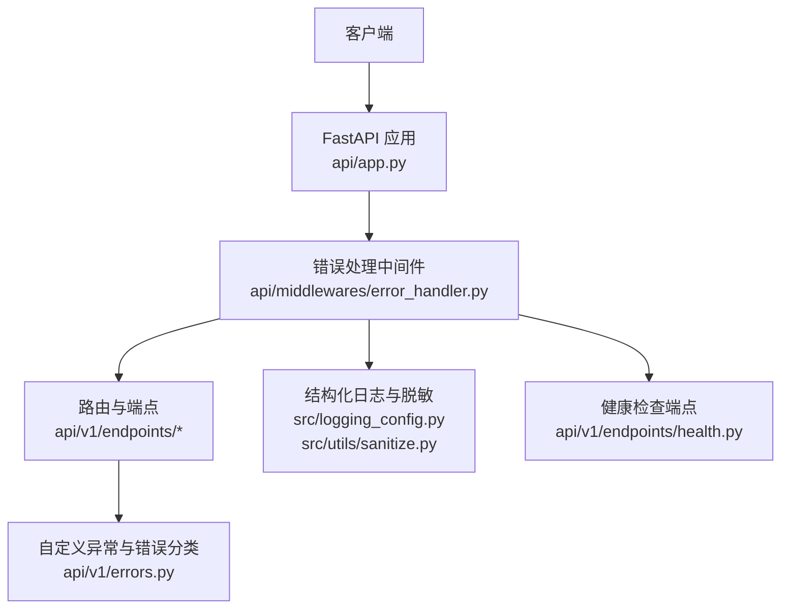
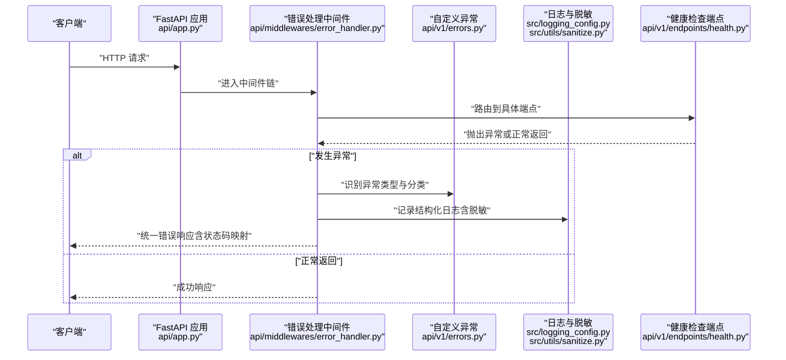
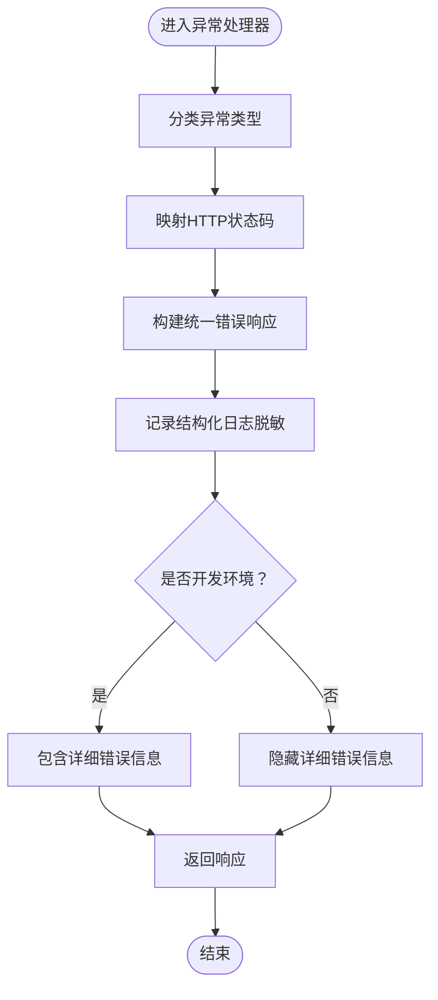
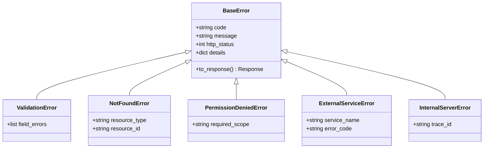
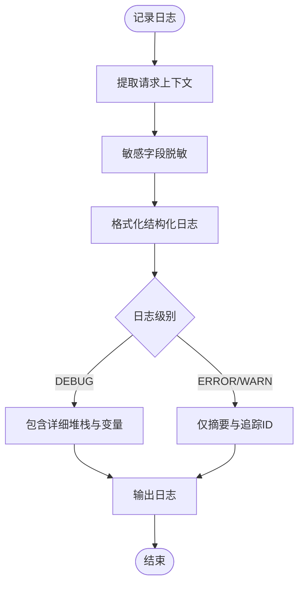
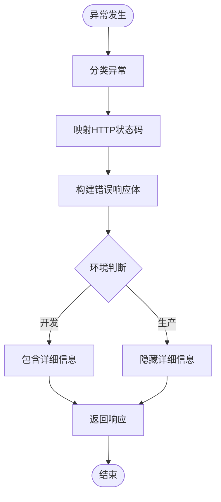
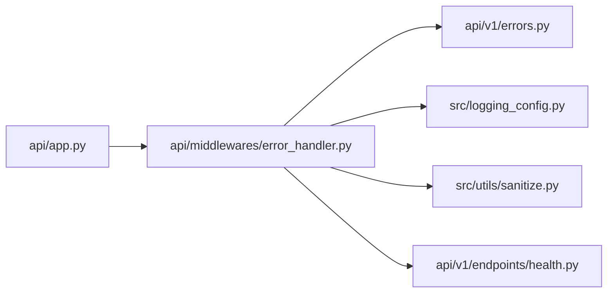

# 错误处理中间件

<cite>
**本文引用的文件**   
- [api/middlewares/error_handler.py](file://api/middlewares/error_handler.py)
- [api/v1/errors.py](file://api/v1/errors.py)
- [api/app.py](file://api/app.py)
- [src/logging_config.py](file://src/logging_config.py)
- [src/utils/sanitize.py](file://src/utils/sanitize.py)
- [api/v1/endpoints/health.py](file://api/v1/endpoints/health.py)
</cite>

## 目录
1. [简介](#简介)
2. [项目结构](#项目结构)
3. [核心组件](#核心组件)
4. [架构总览](#架构总览)
5. [详细组件分析](#详细组件分析)
6. [依赖分析](#依赖分析)
7. [性能考虑](#性能考虑)
8. [故障排查指南](#故障排查指南)
9. [结论](#结论)
10. [附录](#附录)

## 简介
本文件围绕 Daily Stock Analysis 的错误处理中间件进行系统化说明，重点覆盖：
- 异常捕获机制：全局异常处理器、自定义异常类与错误分类体系
- 日志记录：结构化日志格式、敏感信息脱敏、错误堆栈跟踪
- 统一响应：标准错误响应结构、HTTP 状态码映射、错误代码定义
- 调试控制：开发/生产环境差异、详细错误信息的开关
- 最佳实践：错误恢复策略、用户友好提示、监控集成方案

## 项目结构
错误处理相关的关键位置如下：
- API 应用入口与中间件挂载点
- 全局错误处理中间件
- 自定义异常与错误分类
- 结构化日志配置与敏感信息脱敏工具
- 健康检查端点（用于验证错误处理链路）

**图示来源** 
- [api/app.py](file://api/app.py)
- [api/middlewares/error_handler.py](file://api/middlewares/error_handler.py)
- [api/v1/errors.py](file://api/v1/errors.py)
- [src/logging_config.py](file://src/logging_config.py)
- [src/utils/sanitize.py](file://src/utils/sanitize.py)
- [api/v1/endpoints/health.py](file://api/v1/endpoints/health.py)

**章节来源**
- [api/app.py](file://api/app.py)
- [api/middlewares/error_handler.py](file://api/middlewares/error_handler.py)
- [api/v1/errors.py](file://api/v1/errors.py)
- [src/logging_config.py](file://src/logging_config.py)
- [src/utils/sanitize.py](file://src/utils/sanitize.py)
- [api/v1/endpoints/health.py](file://api/v1/endpoints/health.py)

## 核心组件
- 全局异常处理器：在请求进入业务逻辑前统一捕获未处理异常，输出标准化错误响应并记录结构化日志。
- 自定义异常类：按领域划分错误类型（如参数校验失败、资源不存在、权限不足、外部服务不可用等），便于分类统计与前端提示。
- 错误分类系统：通过错误码或错误类别字段对异常进行分类，支持不同环境的差异化展示与上报。
- 结构化日志：包含请求上下文、错误类别、堆栈摘要、时间戳、追踪ID等，便于检索与聚合。
- 敏感信息脱敏：对日志中的密码、密钥、令牌等敏感字段进行掩码处理，避免泄露。
- 统一响应格式：所有错误均返回一致的结构体，包含错误码、消息、详情（可选）、请求ID等。
- HTTP 状态码映射：将异常类别映射为合适的 HTTP 状态码（如 4xx 客户端错误、5xx 服务端错误）。
- 调试控制：根据环境变量区分开发与生产模式，控制是否输出详细错误信息与堆栈。

**章节来源**
- [api/middlewares/error_handler.py](file://api/middlewares/error_handler.py)
- [api/v1/errors.py](file://api/v1/errors.py)
- [src/logging_config.py](file://src/logging_config.py)
- [src/utils/sanitize.py](file://src/utils/sanitize.py)

## 架构总览
下图展示了从请求进入到错误处理的完整流程，包括异常捕获、分类、日志记录、响应构造与环境控制。

**图示来源** 
- [api/app.py](file://api/app.py)
- [api/middlewares/error_handler.py](file://api/middlewares/error_handler.py)
- [api/v1/errors.py](file://api/v1/errors.py)
- [src/logging_config.py](file://src/logging_config.py)
- [src/utils/sanitize.py](file://src/utils/sanitize.py)
- [api/v1/endpoints/health.py](file://api/v1/endpoints/health.py)

## 详细组件分析

### 全局异常处理器
- 职责：拦截未处理异常，提取错误上下文，生成统一错误响应，记录结构化日志。
- 关键点：
  - 依据异常类型选择 HTTP 状态码
  - 根据环境决定是否包含详细错误信息
  - 使用追踪ID关联一次请求的日志
  - 对敏感字段进行脱敏后再写入日志

**图示来源** 
- [api/middlewares/error_handler.py](file://api/middlewares/error_handler.py)
- [src/logging_config.py](file://src/logging_config.py)
- [src/utils/sanitize.py](file://src/utils/sanitize.py)

**章节来源**
- [api/middlewares/error_handler.py](file://api/middlewares/error_handler.py)

### 自定义异常类与错误分类
- 设计目标：以领域为中心定义异常，便于分类统计与前端提示。
- 常见分类：
  - 参数校验失败（如缺少必填字段、类型不匹配）
  - 资源不存在（如股票代码无效、报告不存在）
  - 权限不足（如未认证、无访问权限）
  - 外部服务不可用（如数据源超时、第三方API失败）
  - 内部错误（如计算异常、数据库连接失败）
- 错误码建议：采用分层编码（模块-子域-错误号），便于定位与统计。

**图示来源** 
- [api/v1/errors.py](file://api/v1/errors.py)

**章节来源**
- [api/v1/errors.py](file://api/v1/errors.py)

### 结构化日志与敏感信息脱敏
- 结构化日志字段：
  - 时间戳、级别、模块、方法、请求ID、用户ID（可选）、错误类别、错误码、消息、堆栈摘要
- 脱敏策略：
  - 对密码、密钥、令牌、身份证号、手机号等关键字段进行掩码
  - 仅保留必要上下文，避免冗余敏感数据
- 日志输出：
  - 开发环境：可输出更详细的堆栈与变量快照
  - 生产环境：仅输出摘要与追踪ID，减少噪音与风险

**图示来源** 
- [src/logging_config.py](file://src/logging_config.py)
- [src/utils/sanitize.py](file://src/utils/sanitize.py)

**章节来源**
- [src/logging_config.py](file://src/logging_config.py)
- [src/utils/sanitize.py](file://src/utils/sanitize.py)

### 统一响应格式与HTTP状态码映射
- 统一错误响应结构：
  - 错误码（code）
  - 消息（message）
  - 详情（details，可选，仅在开发环境或特定场景返回）
  - 请求ID（request_id）
  - 时间戳（timestamp）
- HTTP 状态码映射：
  - 4xx：客户端错误（参数校验失败、资源不存在、权限不足）
  - 5xx：服务端错误（内部异常、外部服务不可用）
- 成功响应：保持原有成功结构不变，错误路径统一走中间件。

**图示来源** 
- [api/middlewares/error_handler.py](file://api/middlewares/error_handler.py)
- [api/v1/errors.py](file://api/v1/errors.py)

**章节来源**
- [api/middlewares/error_handler.py](file://api/middlewares/error_handler.py)
- [api/v1/errors.py](file://api/v1/errors.py)

### 调试信息控制
- 开发环境：
  - 开启详细错误信息、完整堆栈、变量快照
  - 便于快速定位问题
- 生产环境：
  - 关闭详细错误信息，仅返回通用消息
  - 通过追踪ID关联日志，便于后台排查
- 控制方式：
  - 通过环境变量切换（如 DEBUG、LOG_LEVEL）
  - 中间件读取配置决定输出粒度

**章节来源**
- [api/middlewares/error_handler.py](file://api/middlewares/error_handler.py)
- [src/logging_config.py](file://src/logging_config.py)

### 健康检查端点与错误处理联动
- 健康检查端点用于验证服务可用性与错误处理链路是否正常。
- 当依赖服务不可用时，健康检查应返回明确的错误状态与原因，便于运维监控。

**章节来源**
- [api/v1/endpoints/health.py](file://api/v1/endpoints/health.py)

## 依赖分析
错误处理中间件依赖以下模块：
- FastAPI 应用入口：注册中间件与路由
- 自定义异常：提供错误分类与响应构造
- 日志配置：提供结构化日志与脱敏能力
- 健康检查端点：验证错误处理链路

**图示来源** 
- [api/app.py](file://api/app.py)
- [api/middlewares/error_handler.py](file://api/middlewares/error_handler.py)
- [api/v1/errors.py](file://api/v1/errors.py)
- [src/logging_config.py](file://src/logging_config.py)
- [src/utils/sanitize.py](file://src/utils/sanitize.py)
- [api/v1/endpoints/health.py](file://api/v1/endpoints/health.py)

**章节来源**
- [api/app.py](file://api/app.py)
- [api/middlewares/error_handler.py](file://api/middlewares/error_handler.py)
- [api/v1/errors.py](file://api/v1/errors.py)
- [src/logging_config.py](file://src/logging_config.py)
- [src/utils/sanitize.py](file://src/utils/sanitize.py)
- [api/v1/endpoints/health.py](file://api/v1/endpoints/health.py)

## 性能考虑
- 异常路径开销：尽量在业务层尽早抛出明确异常，避免深层嵌套 try/except
- 日志写入：异步化或批量写入，避免阻塞主线程；生产环境降低日志级别
- 脱敏成本：对高频敏感字段进行缓存脱敏规则，减少重复处理
- 响应构造：复用响应模板，减少对象创建与序列化开销

[本节为通用指导，无需引用具体文件]

## 故障排查指南
- 常见问题：
  - 未捕获异常导致 500：检查中间件是否正确注册，确认异常类型是否被分类
  - 日志缺失或无法检索：确认日志级别与追踪ID是否正确注入
  - 敏感信息泄露：检查脱敏规则是否覆盖所有敏感字段
  - 前端收到详细错误：确认生产环境已关闭详细错误输出
- 排查步骤：
  - 通过请求ID在日志系统中检索完整链路
  - 核对异常分类与状态码映射是否符合预期
  - 检查健康检查端点的依赖状态
  - 对比开发与生产环境配置差异

**章节来源**
- [api/middlewares/error_handler.py](file://api/middlewares/error_handler.py)
- [src/logging_config.py](file://src/logging_config.py)
- [src/utils/sanitize.py](file://src/utils/sanitize.py)
- [api/v1/endpoints/health.py](file://api/v1/endpoints/health.py)

## 结论
Daily Stock Analysis 的错误处理中间件通过统一的异常捕获、分类、日志与响应机制，提供了稳定可靠的错误处理能力。结合结构化日志与敏感信息脱敏，既保障了可观测性，又降低了安全风险。在生产环境中，通过调试开关与状态码映射，实现了面向用户的友好提示与面向运维的可追溯性。

[本节为总结，无需引用具体文件]

## 附录
- 错误码规范建议：采用“模块-子域-错误号”的分层编码，便于统计与定位
- 监控集成建议：将错误分类与状态码映射至监控系统，设置告警阈值
- 最佳实践：
  - 在业务层尽早抛出明确异常
  - 避免在中间件中执行耗时操作
  - 定期审查脱敏规则与日志内容
  - 通过健康检查端点持续验证错误处理链路

[本节为补充信息，无需引用具体文件]