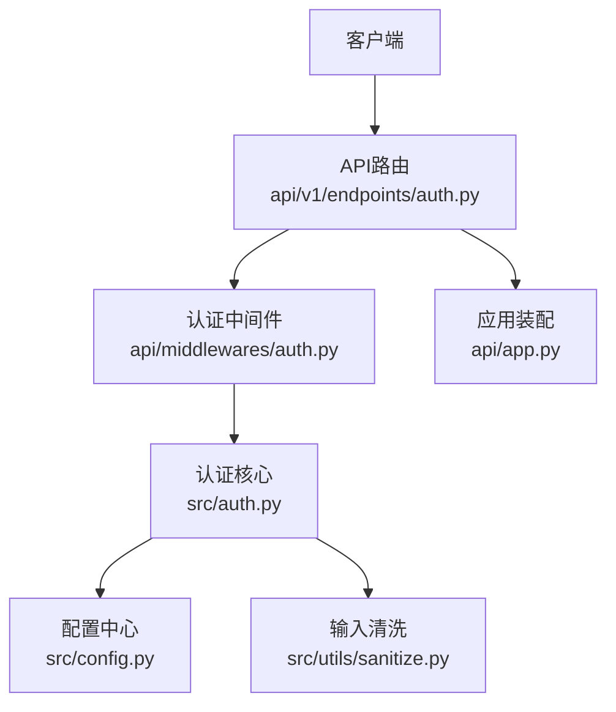
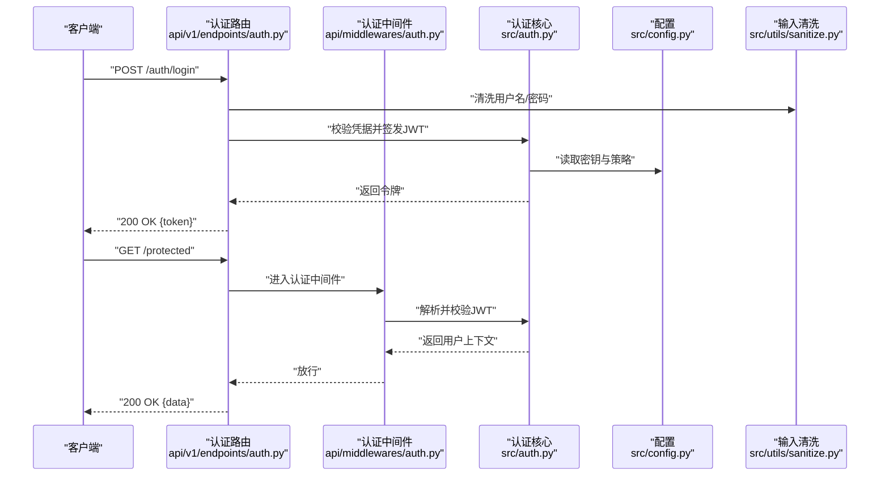
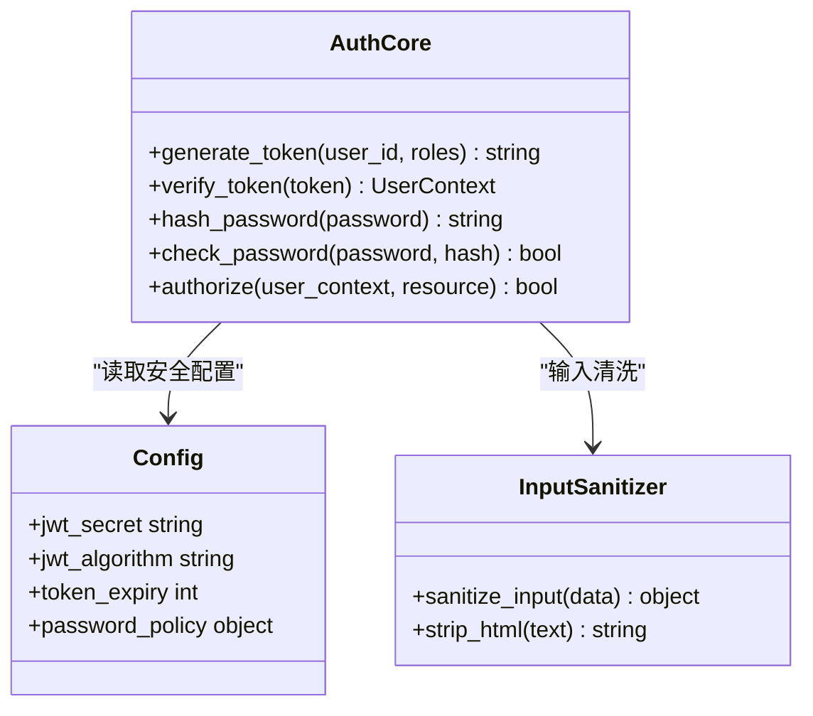
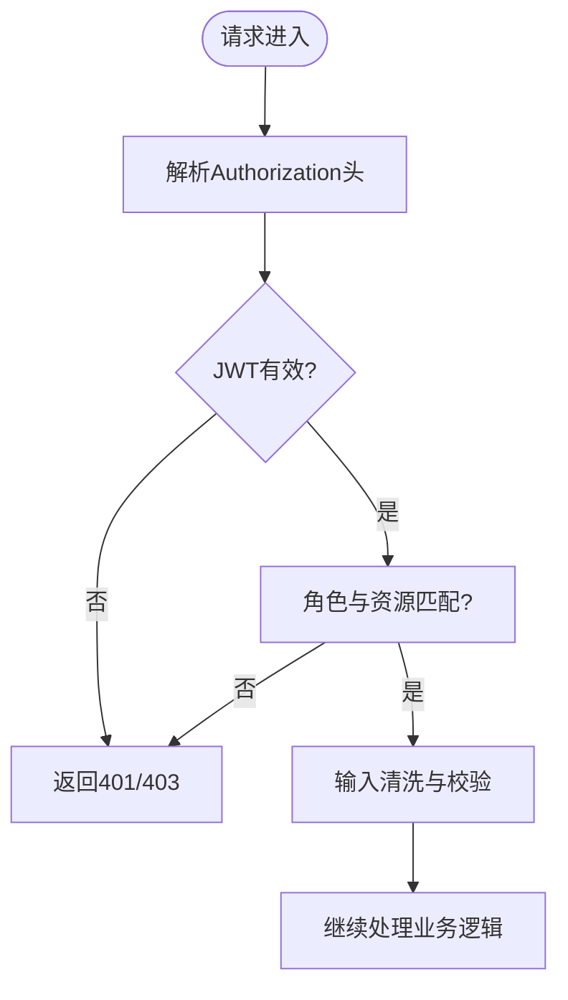
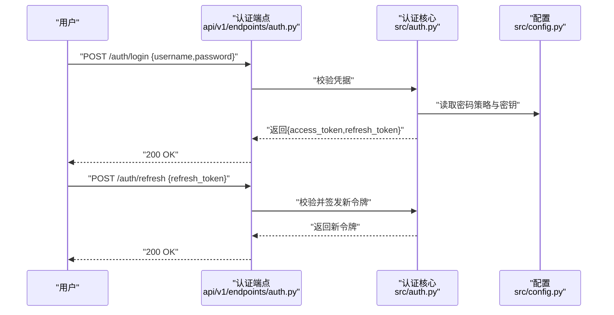
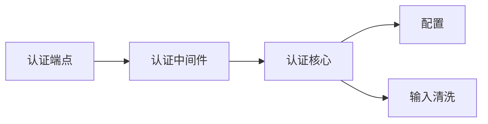

# 安全与认证

<cite>
**本文引用的文件**   
- [src/auth.py](file://src/auth.py)
- [api/middlewares/auth.py](file://api/middlewares/auth.py)
- [api/v1/endpoints/auth.py](file://api/v1/endpoints/auth.py)
- [api/app.py](file://api/app.py)
- [src/config.py](file://src/config.py)
- [src/utils/sanitize.py](file://src/utils/sanitize.py)
- [tests/test_auth.py](file://tests/test_auth.py)
- [tests/test_cwe345_xff_bypass.py](file://tests/test_cwe345_xff_bypass.py)
</cite>

## 目录
1. [简介](#简介)
2. [项目结构](#项目结构)
3. [核心组件](#核心组件)
4. [架构总览](#架构总览)
5. [详细组件分析](#详细组件分析)
6. [依赖分析](#依赖分析)
7. [性能考虑](#性能考虑)
8. [故障排查指南](#故障排查指南)
9. [结论](#结论)
10. [附录](#附录)

## 简介
本文件面向Daily Stock Analysis的安全与认证子系统，聚焦以下目标：
- 认证与授权机制设计：JWT令牌生成与验证、用户权限管理与角色控制。
- 中间件安全防护：请求校验、输入过滤、XSS防护与CSRF保护策略。
- 密码安全与会话管理：密码加密存储、会话超时、并发登录控制。
- API安全防护：速率限制、IP白名单、敏感操作审计。
- 安全配置最佳实践：环境变量管理、密钥轮换与安全漏洞扫描。
- 安全事件监控与响应：异常登录检测、攻击行为识别与安全告警。

说明：本文档基于仓库中现有代码进行梳理与总结，未实现的功能将给出建议与落地方案，确保读者可据此完善系统安全性。

## 项目结构
安全相关代码主要分布在后端API层与通用工具层：
- 认证入口与路由：api/v1/endpoints/auth.py
- 认证中间件：api/middlewares/auth.py
- 应用装配与全局中间件注册：api/app.py
- 认证核心逻辑（JWT、密码哈希、权限）：src/auth.py
- 配置与环境变量：src/config.py
- 输入清洗与XSS防护：src/utils/sanitize.py
- 测试用例：tests/test_auth.py、tests/test_cwe345_xff_bypass.py

图表来源
- [api/v1/endpoints/auth.py](file://api/v1/endpoints/auth.py)
- [api/middlewares/auth.py](file://api/middlewares/auth.py)
- [src/auth.py](file://src/auth.py)
- [src/config.py](file://src/config.py)
- [src/utils/sanitize.py](file://src/utils/sanitize.py)
- [api/app.py](file://api/app.py)

章节来源
- [api/v1/endpoints/auth.py](file://api/v1/endpoints/auth.py)
- [api/middlewares/auth.py](file://api/middlewares/auth.py)
- [src/auth.py](file://src/auth.py)
- [src/config.py](file://src/config.py)
- [src/utils/sanitize.py](file://src/utils/sanitize.py)
- [api/app.py](file://api/app.py)

## 核心组件
- 认证核心（src/auth.py）
  - JWT签发与校验：包含令牌生命周期、签名算法、过期时间等关键参数。
  - 密码哈希：采用安全的哈希算法对密码进行不可逆加密存储。
  - 权限与角色：基于角色的访问控制（RBAC），在资源级或接口级进行鉴权。
- 认证中间件（api/middlewares/auth.py）
  - 统一拦截受保护接口，解析并校验JWT，注入当前用户上下文。
  - 可选的IP白名单与请求来源校验。
- 认证路由（api/v1/endpoints/auth.py）
  - 登录/登出、刷新令牌、获取当前用户信息等端点。
- 配置（src/config.py）
  - 集中管理JWT密钥、令牌有效期、密码策略、限流阈值等安全相关配置。
- 输入清洗（src/utils/sanitize.py）
  - 提供HTML标签过滤、脚本注入防护等能力，用于降低XSS风险。
- 应用装配（api/app.py）
  - 注册全局中间件、错误处理、CORS、日志与审计钩子。

章节来源
- [src/auth.py](file://src/auth.py)
- [api/middlewares/auth.py](file://api/middlewares/auth.py)
- [api/v1/endpoints/auth.py](file://api/v1/endpoints/auth.py)
- [src/config.py](file://src/config.py)
- [src/utils/sanitize.py](file://src/utils/sanitize.py)
- [api/app.py](file://api/app.py)

## 架构总览
下图展示从客户端到认证核心的调用链路与数据流向，包括JWT校验、权限判断与输入清洗。

图表来源
- [api/v1/endpoints/auth.py](file://api/v1/endpoints/auth.py)
- [api/middlewares/auth.py](file://api/middlewares/auth.py)
- [src/auth.py](file://src/auth.py)
- [src/config.py](file://src/config.py)
- [src/utils/sanitize.py](file://src/utils/sanitize.py)

## 详细组件分析

### 认证核心（JWT与密码安全）
- JWT令牌
  - 签发：使用强随机密钥与合适的签名算法，设置合理的过期时间与刷新策略。
  - 校验：验证签名、过期时间、必要声明（如用户ID、角色）。
- 密码安全
  - 存储：采用业界推荐的哈希算法（如bcrypt/argon2）加盐存储，禁止明文。
  - 策略：最小长度、复杂度要求、历史密码检查。
- 权限与角色
  - RBAC模型：用户-角色-资源的映射，支持接口级与数据级权限。
  - 上下文注入：将用户身份与角色信息注入请求上下文，供业务层使用。

图表来源
- [src/auth.py](file://src/auth.py)
- [src/config.py](file://src/config.py)
- [src/utils/sanitize.py](file://src/utils/sanitize.py)

章节来源
- [src/auth.py](file://src/auth.py)
- [src/config.py](file://src/config.py)
- [src/utils/sanitize.py](file://src/utils/sanitize.py)

### 认证中间件（请求校验与防护）
- 统一鉴权：拦截需要认证的请求，解析Authorization头中的Bearer Token。
- 权限控制：根据角色与资源路径决定放行或拒绝。
- 输入过滤：对请求体与查询参数进行基础清洗，防止恶意注入。
- 来源校验：可选的IP白名单与Referer校验，降低越权与跨站风险。

图表来源
- [api/middlewares/auth.py](file://api/middlewares/auth.py)
- [src/auth.py](file://src/auth.py)
- [src/utils/sanitize.py](file://src/utils/sanitize.py)

章节来源
- [api/middlewares/auth.py](file://api/middlewares/auth.py)
- [src/auth.py](file://src/auth.py)
- [src/utils/sanitize.py](file://src/utils/sanitize.py)

### 认证路由（登录、令牌与用户信息）
- 登录：校验用户名与密码，成功后签发JWT。
- 刷新令牌：基于刷新令牌或旧令牌换取新令牌，控制令牌轮换。
- 当前用户：返回已认证用户的上下文信息。
- 登出：服务端记录登出状态（如需黑名单）或仅客户端丢弃令牌。

图表来源
- [api/v1/endpoints/auth.py](file://api/v1/endpoints/auth.py)
- [src/auth.py](file://src/auth.py)
- [src/config.py](file://src/config.py)

章节来源
- [api/v1/endpoints/auth.py](file://api/v1/endpoints/auth.py)
- [src/auth.py](file://src/auth.py)
- [src/config.py](file://src/config.py)

### 应用装配（全局中间件与错误处理）
- 中间件注册：统一挂载认证、输入清洗、CORS、日志与审计中间件。
- 错误处理：标准化错误响应格式，避免泄露敏感信息。
- 审计钩子：记录关键安全事件（登录成功/失败、权限拒绝、异常访问）。

章节来源
- [api/app.py](file://api/app.py)

## 依赖分析
- 模块耦合
  - 认证路由依赖认证中间件与认证核心。
  - 认证中间件依赖认证核心与输入清洗。
  - 认证核心依赖配置与输入清洗。
- 外部依赖
  - JWT库、密码哈希库、HTTP框架中间件。
- 潜在循环依赖
  - 通过分层与依赖注入避免循环引用。

图表来源
- [api/v1/endpoints/auth.py](file://api/v1/endpoints/auth.py)
- [api/middlewares/auth.py](file://api/middlewares/auth.py)
- [src/auth.py](file://src/auth.py)
- [src/config.py](file://src/config.py)
- [src/utils/sanitize.py](file://src/utils/sanitize.py)

章节来源
- [api/v1/endpoints/auth.py](file://api/v1/endpoints/auth.py)
- [api/middlewares/auth.py](file://api/middlewares/auth.py)
- [src/auth.py](file://src/auth.py)
- [src/config.py](file://src/config.py)
- [src/utils/sanitize.py](file://src/utils/sanitize.py)

## 性能考虑
- JWT校验开销：尽量使用无状态校验，避免每次请求都查库；必要时引入本地缓存。
- 密码哈希强度：选择合适的工作因子，平衡安全性与CPU开销。
- 中间件链长度：精简中间件数量，减少不必要的计算。
- 限流与防抖：在高并发场景下启用速率限制，避免暴力破解与资源耗尽。

[本节为通用指导，不直接分析具体文件]

## 故障排查指南
- 常见问题
  - 令牌无效或过期：检查JWT签名、过期时间、时钟同步。
  - 权限不足：确认用户角色与资源路径是否匹配。
  - 输入清洗失败：检查清洗规则与特殊字符处理。
- 调试建议
  - 开启详细日志，记录认证流程的关键节点。
  - 使用测试用例定位问题，如登录、刷新、鉴权失败场景。
- 参考测试
  - 认证功能测试：tests/test_auth.py
  - XFF绕过测试：tests/test_cwe345_xff_bypass.py

章节来源
- [tests/test_auth.py](file://tests/test_auth.py)
- [tests/test_cwe345_xff_bypass.py](file://tests/test_cwe345_xff_bypass.py)

## 结论
Daily Stock Analysis的安全与认证子系统围绕JWT、RBAC、输入清洗与中间件防护构建，具备基础的认证授权能力。建议在现有基础上进一步完善：
- 强化会话管理与并发登录控制。
- 增加速率限制、IP白名单与敏感操作审计。
- 完善安全配置管理、密钥轮换与漏洞扫描流程。
- 建立安全事件监控与告警机制，提升整体安全态势感知能力。

[本节为总结性内容，不直接分析具体文件]

## 附录
- 安全配置最佳实践
  - 环境变量管理：所有密钥与敏感配置通过环境变量注入，避免硬编码。
  - 密钥轮换：定期更换JWT密钥与哈希盐值，支持平滑过渡。
  - 漏洞扫描：集成静态分析与依赖漏洞扫描，纳入CI流水线。
- 安全事件监控与响应
  - 异常登录检测：统计失败次数、地理位置与设备指纹。
  - 攻击行为识别：识别暴力破解、注入尝试与异常流量模式。
  - 安全告警：对接告警平台，及时通知安全团队处置。

[本节为通用指导，不直接分析具体文件]