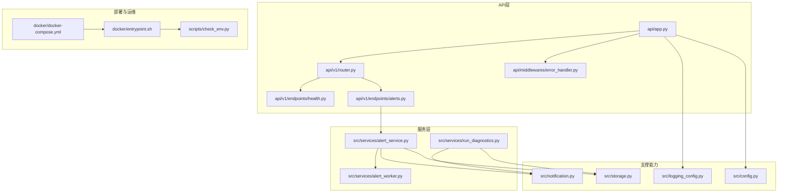
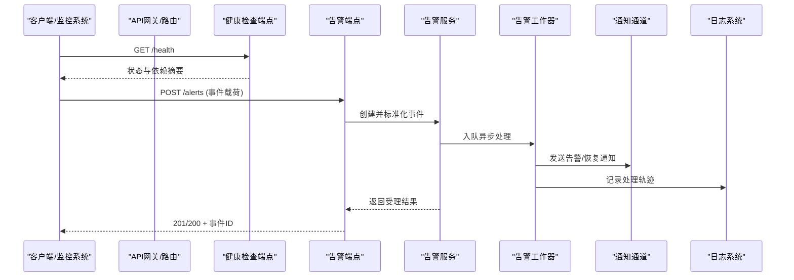
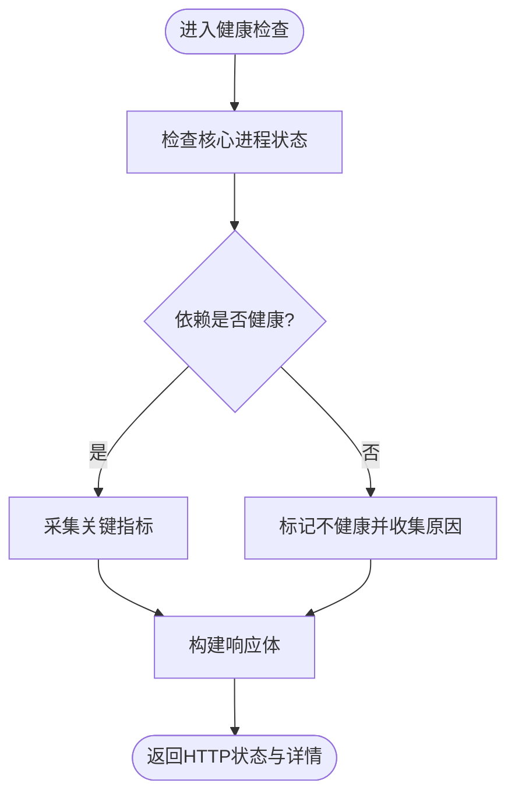
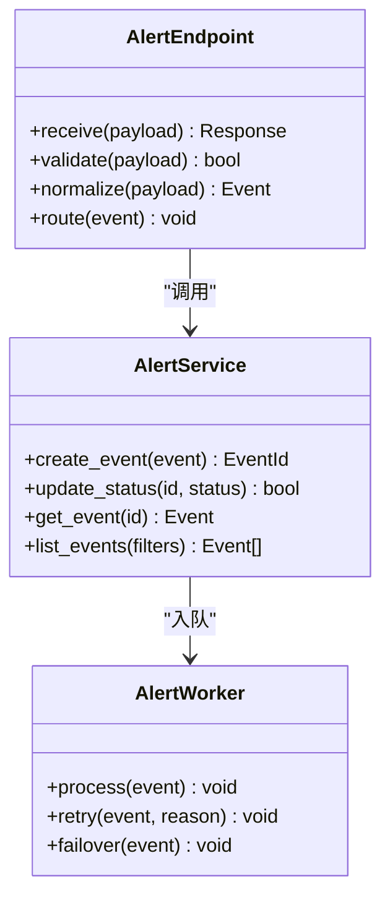
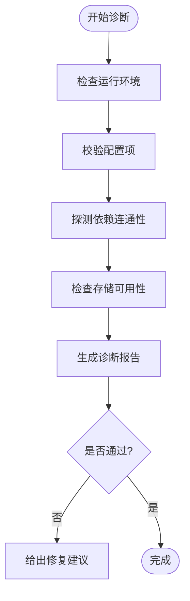
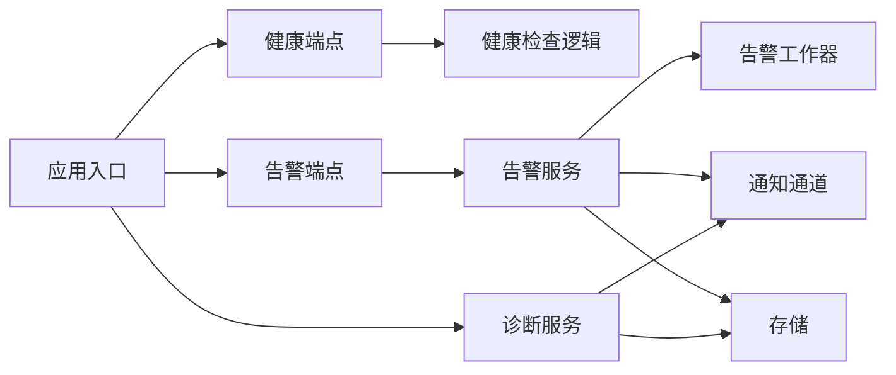

# 安全事件响应与恢复

<cite>
**本文引用的文件**   
- [server.py](file://server.py)
- [main.py](file://main.py)
- [api/app.py](file://api/app.py)
- [api/v1/router.py](file://api/v1/router.py)
- [api/v1/endpoints/health.py](file://api/v1/endpoints/health.py)
- [api/v1/endpoints/alerts.py](file://api/v1/endpoints/alerts.py)
- [api/v1/schemas/alerts.py](file://api/v1/schemas/alerts.py)
- [api/middlewares/error_handler.py](file://api/middlewares/error_handler.py)
- [src/services/alert_service.py](file://src/services/alert_service.py)
- [src/services/alert_worker.py](file://src/services/alert_worker.py)
- [src/services/run_diagnostics.py](file://src/services/run_diagnostics.py)
- [src/notification.py](file://src/notification.py)
- [src/logging_config.py](file://src/logging_config.py)
- [src/config.py](file://src/config.py)
- [src/storage.py](file://src/storage.py)
- [docker/docker-compose.yml](file://docker/docker-compose.yml)
- [docker/entrypoint.sh](file://docker/entrypoint.sh)
- [scripts/check_env.py](file://scripts/check_env.py)
- [tests/test_alert_api.py](file://tests/test_alert_api.py)
- [tests/test_run_diagnostics_p1.py](file://tests/test_run_diagnostics_p1.py)
- [tests/test_run_diagnostics_p2.py](file://tests/test_run_diagnostics_p2.py)
</cite>

## 目录
1. [简介](#简介)
2. [项目结构](#项目结构)
3. [核心组件](#核心组件)
4. [架构总览](#架构总览)
5. [详细组件分析](#详细组件分析)
6. [依赖关系分析](#依赖关系分析)
7. [性能考虑](#性能考虑)
8. [故障排查指南](#故障排查指南)
9. [结论](#结论)
10. [附录](#附录)

## 简介
本文件面向Daily Stock Analysis的安全事件响应与恢复，提供可操作的规范、流程与工具指引。内容覆盖：
- 事件分类标准（威胁等级、影响范围、紧急程度）
- 响应流程（上报、调查、处置、验证）
- 数据恢复程序（备份恢复、校验、服务重启）
- 事后分析报告（根因分析、改进措施、经验总结）
- 应急响应工具（诊断脚本、监控、取证）
- 应急预案模板与演练指导

本说明以代码仓库中的API、告警、诊断、日志、配置与部署相关实现为依据，确保实践与系统能力一致。

## 项目结构
与安全事件响应相关的核心位置包括：
- API层：健康检查、告警接口、错误处理中间件
- 服务层：告警服务与异步工作器、诊断服务
- 通知与日志：统一通知通道、结构化日志配置
- 配置与存储：运行时配置、持久化存储
- 部署与运维：容器编排、启动入口、环境检查脚本
- 测试：告警API与诊断能力的用例

图表来源
- [api/app.py](file://api/app.py)
- [api/v1/router.py](file://api/v1/router.py)
- [api/v1/endpoints/health.py](file://api/v1/endpoints/health.py)
- [api/v1/endpoints/alerts.py](file://api/v1/endpoints/alerts.py)
- [api/middlewares/error_handler.py](file://api/middlewares/error_handler.py)
- [src/services/alert_service.py](file://src/services/alert_service.py)
- [src/services/alert_worker.py](file://src/services/alert_worker.py)
- [src/services/run_diagnostics.py](file://src/services/run_diagnostics.py)
- [src/notification.py](file://src/notification.py)
- [src/logging_config.py](file://src/logging_config.py)
- [src/config.py](file://src/config.py)
- [src/storage.py](file://src/storage.py)
- [docker/docker-compose.yml](file://docker/docker-compose.yml)
- [docker/entrypoint.sh](file://docker/entrypoint.sh)
- [scripts/check_env.py](file://scripts/check_env.py)

章节来源
- [server.py](file://server.py)
- [main.py](file://main.py)
- [api/app.py](file://api/app.py)
- [api/v1/router.py](file://api/v1/router.py)
- [api/v1/endpoints/health.py](file://api/v1/endpoints/health.py)
- [api/v1/endpoints/alerts.py](file://api/v1/endpoints/alerts.py)
- [api/middlewares/error_handler.py](file://api/middlewares/error_handler.py)
- [src/services/alert_service.py](file://src/services/alert_service.py)
- [src/services/alert_worker.py](file://src/services/alert_worker.py)
- [src/services/run_diagnostics.py](file://src/services/run_diagnostics.py)
- [src/notification.py](file://src/notification.py)
- [src/logging_config.py](file://src/logging_config.py)
- [src/config.py](file://src/config.py)
- [src/storage.py](file://src/storage.py)
- [docker/docker-compose.yml](file://docker/docker-compose.yml)
- [docker/entrypoint.sh](file://docker/entrypoint.sh)
- [scripts/check_env.py](file://scripts/check_env.py)

## 核心组件
- 健康检查端点：用于快速判定服务可用性、依赖状态与关键指标，作为事件分级与恢复验证的入口。
- 告警接口与服务：接收并标准化告警事件，进行路由、去重、优先级排序与通知分发。
- 告警工作器：异步执行告警处理任务，避免阻塞请求链路，支持重试与失败回退。
- 诊断服务：提供运行态自检、依赖探测、配置与环境校验，辅助定位问题与验证恢复效果。
- 通知通道：统一对外发送告警与恢复通知，支持多通道与失败重试。
- 日志与配置：结构化日志便于检索与审计；集中配置管理保障一致性。
- 存储与备份：关键数据落盘与快照，为恢复提供基础。
- 部署与启动：容器编排与启动脚本，保证服务可用性与环境就绪。

章节来源
- [api/v1/endpoints/health.py](file://api/v1/endpoints/health.py)
- [api/v1/endpoints/alerts.py](file://api/v1/endpoints/alerts.py)
- [src/services/alert_service.py](file://src/services/alert_service.py)
- [src/services/alert_worker.py](file://src/services/alert_worker.py)
- [src/services/run_diagnostics.py](file://src/services/run_diagnostics.py)
- [src/notification.py](file://src/notification.py)
- [src/logging_config.py](file://src/logging_config.py)
- [src/config.py](file://src/config.py)
- [src/storage.py](file://src/storage.py)
- [docker/docker-compose.yml](file://docker/docker-compose.yml)
- [docker/entrypoint.sh](file://docker/entrypoint.sh)

## 架构总览
下图展示从外部触发到内部处理的关键路径，涵盖健康检查、告警接入、异步处理、通知与日志记录。

图表来源
- [api/v1/endpoints/health.py](file://api/v1/endpoints/health.py)
- [api/v1/endpoints/alerts.py](file://api/v1/endpoints/alerts.py)
- [src/services/alert_service.py](file://src/services/alert_service.py)
- [src/services/alert_worker.py](file://src/services/alert_worker.py)
- [src/notification.py](file://src/notification.py)
- [src/logging_config.py](file://src/logging_config.py)

## 详细组件分析

### 健康检查与健康策略
- 目的：快速暴露服务可用性、依赖连通性、资源水位等关键指标，用于事件分级与恢复验证。
- 关键点：
  - 聚合多个子健康检查项（数据库、缓存、消息队列、外部API等）
  - 输出结构化JSON，包含状态码、时间戳、明细项
  - 被监控平台轮询，异常时触发告警

图表来源
- [api/v1/endpoints/health.py](file://api/v1/endpoints/health.py)

章节来源
- [api/v1/endpoints/health.py](file://api/v1/endpoints/health.py)

### 告警接口与事件模型
- 目的：统一接入各类告警事件，标准化字段、去重、优先级与路由。
- 关键点：
  - 输入校验与模式匹配，拒绝非法载荷
  - 生成唯一事件ID，建立追踪链
  - 根据规则计算威胁等级与紧急程度
  - 写入存储并触发异步处理

图表来源
- [api/v1/endpoints/alerts.py](file://api/v1/endpoints/alerts.py)
- [src/services/alert_service.py](file://src/services/alert_service.py)
- [src/services/alert_worker.py](file://src/services/alert_worker.py)

章节来源
- [api/v1/endpoints/alerts.py](file://api/v1/endpoints/alerts.py)
- [src/services/alert_service.py](file://src/services/alert_service.py)
- [src/services/alert_worker.py](file://src/services/alert_worker.py)
- [api/v1/schemas/alerts.py](file://api/v1/schemas/alerts.py)

### 诊断服务与自检流程
- 目的：在事件发生时快速定位问题，在恢复后验证修复有效性。
- 关键点：
  - 环境检查（Python版本、依赖、环境变量）
  - 配置校验（必填项、格式、权限）
  - 依赖连通性（数据库、缓存、消息队列、外部API）
  - 存储可用性（读写、配额、锁）
  - 输出诊断报告，供人工或自动化决策

图表来源
- [src/services/run_diagnostics.py](file://src/services/run_diagnostics.py)
- [scripts/check_env.py](file://scripts/check_env.py)

章节来源
- [src/services/run_diagnostics.py](file://src/services/run_diagnostics.py)
- [scripts/check_env.py](file://scripts/check_env.py)
- [tests/test_run_diagnostics_p1.py](file://tests/test_run_diagnostics_p1.py)
- [tests/test_run_diagnostics_p2.py](file://tests/test_run_diagnostics_p2.py)

### 通知与日志
- 通知：
  - 统一抽象多种通道（邮件、IM、Webhook等）
  - 支持重试、退避与失败回退
  - 事件关联ID，便于追踪
- 日志：
  - 结构化输出，包含事件ID、级别、模块、上下文
  - 按模块与级别分离，便于检索与审计

章节来源
- [src/notification.py](file://src/notification.py)
- [src/logging_config.py](file://src/logging_config.py)

### 配置与存储
- 配置：
  - 集中化管理，支持环境变量与配置文件
  - 敏感信息加密或外部密钥管理
- 存储：
  - 告警事件、诊断报告、配置快照持久化
  - 支持备份与恢复，保证数据一致性

章节来源
- [src/config.py](file://src/config.py)
- [src/storage.py](file://src/storage.py)

### 部署与启动
- 容器编排：定义服务、依赖、环境变量、卷挂载与端口映射
- 启动脚本：初始化环境、拉取依赖、执行迁移、启动主进程
- 健康探针：Kubernetes或编排平台使用健康端点进行存活与就绪检测

章节来源
- [docker/docker-compose.yml](file://docker/docker-compose.yml)
- [docker/entrypoint.sh](file://docker/entrypoint.sh)

## 依赖关系分析
- API层依赖服务层：健康与告警端点调用对应服务
- 服务层依赖基础设施：通知、日志、配置、存储
- 部署层驱动运行环境：容器编排与启动脚本保障依赖就绪
- 测试层验证关键路径：告警API与诊断能力用例

图表来源
- [api/v1/endpoints/health.py](file://api/v1/endpoints/health.py)
- [api/v1/endpoints/alerts.py](file://api/v1/endpoints/alerts.py)
- [src/services/alert_service.py](file://src/services/alert_service.py)
- [src/services/alert_worker.py](file://src/services/alert_worker.py)
- [src/services/run_diagnostics.py](file://src/services/run_diagnostics.py)
- [src/notification.py](file://src/notification.py)
- [src/storage.py](file://src/storage.py)

章节来源
- [api/app.py](file://api/app.py)
- [api/v1/router.py](file://api/v1/router.py)

## 性能考虑
- 告警处理异步化：避免阻塞请求链路，提升吞吐
- 批量与限流：对通知与外部API调用实施限流与批处理
- 缓存热点：对只读配置与静态字典进行缓存
- 日志采样：在高并发场景下合理采样，降低IO压力
- 健康检查轻量：避免在健康检查中执行耗时操作

[本节为通用指导，不直接分析具体文件]

## 故障排查指南
- 快速定位：
  - 查看健康端点，确认服务与依赖状态
  - 检索结构化日志，过滤事件ID与错误级别
  - 运行诊断服务，获取环境与依赖检测报告
- 常见症状与对策：
  - 告警未送达：检查通知通道配置、网络连通与重试策略
  - 告警风暴：启用去重与抑制规则，调整阈值
  - 数据不一致：核对存储快照与事务边界，必要时回滚
- 恢复验证：
  - 重新运行诊断，确认全部检查项通过
  - 回放关键告警，验证端到端链路正常
  - 观察健康端点与监控指标稳定

章节来源
- [api/v1/endpoints/health.py](file://api/v1/endpoints/health.py)
- [src/services/run_diagnostics.py](file://src/services/run_diagnostics.py)
- [src/logging_config.py](file://src/logging_config.py)
- [tests/test_alert_api.py](file://tests/test_alert_api.py)

## 结论
通过标准化的事件分类、清晰的响应流程、可靠的恢复程序与完善的工具链，Daily Stock Analysis能够在安全事件发生时快速定位、有效处置并稳健恢复。建议持续完善告警规则、演练预案与复盘机制，形成闭环改进。

[本节为总结性内容，不直接分析具体文件]

## 附录

### 事件分类标准
- 威胁等级：
  - P0：核心服务不可用或数据丢失风险极高
  - P1：重要功能受损，影响部分用户或业务
  - P2：非关键功能异常，影响有限
  - P3：轻微问题，可延后处理
- 影响范围：
  - 全局：所有用户/市场数据受影响
  - 区域：特定市场或模块受影响
  - 单点：单个实例或依赖异常
- 紧急程度：
  - 立即：需分钟级响应
  - 短时：小时级内解决
  - 计划：纳入迭代修复

[本节为概念性说明，不直接分析具体文件]

### 响应流程规范
- 事件上报：
  - 通过告警接口提交事件，携带必要上下文与证据
  - 自动生成事件ID并分配优先级
- 调查分析：
  - 健康检查与诊断服务定位根因
  - 日志与链路追踪还原过程
- 处置措施：
  - 临时缓解（熔断、降级、隔离）
  - 永久修复（补丁、配置变更、数据修复）
- 恢复验证：
  - 健康检查通过
  - 关键指标回归基线
  - 通知与告警链路验证

章节来源
- [api/v1/endpoints/alerts.py](file://api/v1/endpoints/alerts.py)
- [src/services/alert_service.py](file://src/services/alert_service.py)
- [src/services/run_diagnostics.py](file://src/services/run_diagnostics.py)

### 数据恢复程序
- 备份恢复：
  - 选择最近可信快照
  - 停止写操作，导入备份
- 数据校验：
  - 完整性校验（哈希/行数/关键字段）
  - 一致性校验（外键/索引/约束）
- 服务重启：
  - 按依赖顺序启动
  - 健康检查与冒烟测试

章节来源
- [src/storage.py](file://src/storage.py)
- [docker/entrypoint.sh](file://docker/entrypoint.sh)

### 事后分析报告
- 根因分析：时间线、触发条件、传播路径
- 改进措施：技术加固、流程优化、监控增强
- 经验总结：最佳实践、反模式、培训要点

[本节为概念性说明，不直接分析具体文件]

### 应急响应工具
- 诊断脚本：
  - 环境检查脚本
  - 依赖连通性探测
- 监控工具：
  - 健康端点与指标采集
  - 告警收敛与降噪
- 取证方法：
  - 结构化日志导出
  - 事件快照与回放

章节来源
- [scripts/check_env.py](file://scripts/check_env.py)
- [api/v1/endpoints/health.py](file://api/v1/endpoints/health.py)
- [src/services/run_diagnostics.py](file://src/services/run_diagnostics.py)

### 应急预案模板与演练指导
- 模板要素：
  - 事件描述、影响评估、处置步骤、责任人、沟通渠道
- 演练步骤：
  - 准备环境、注入故障、执行预案、复盘改进
- 演练频率：
  - 季度演练，重大变更后专项演练

[本节为概念性说明，不直接分析具体文件]