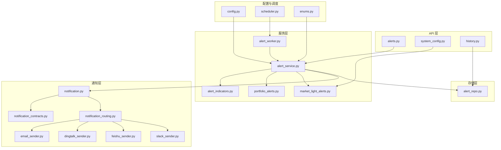
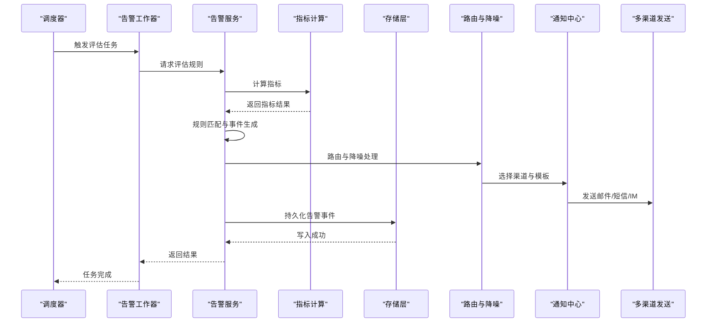
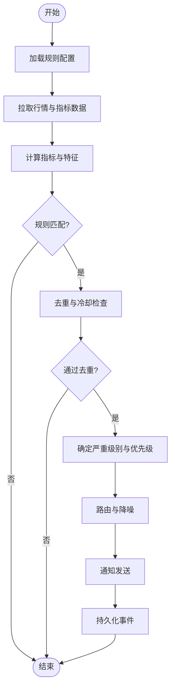
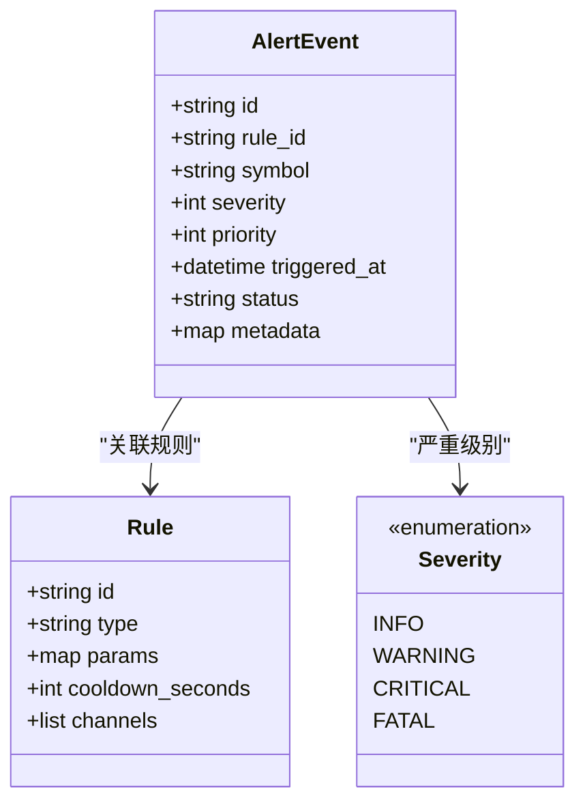
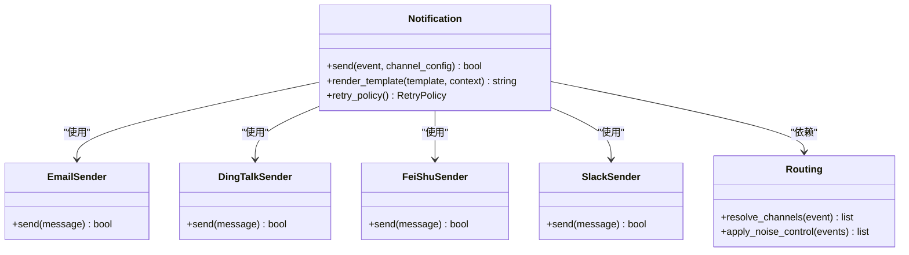
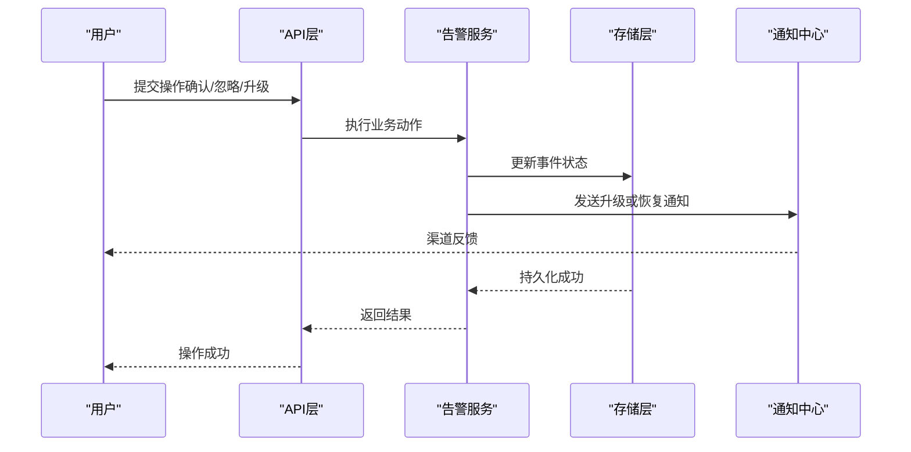
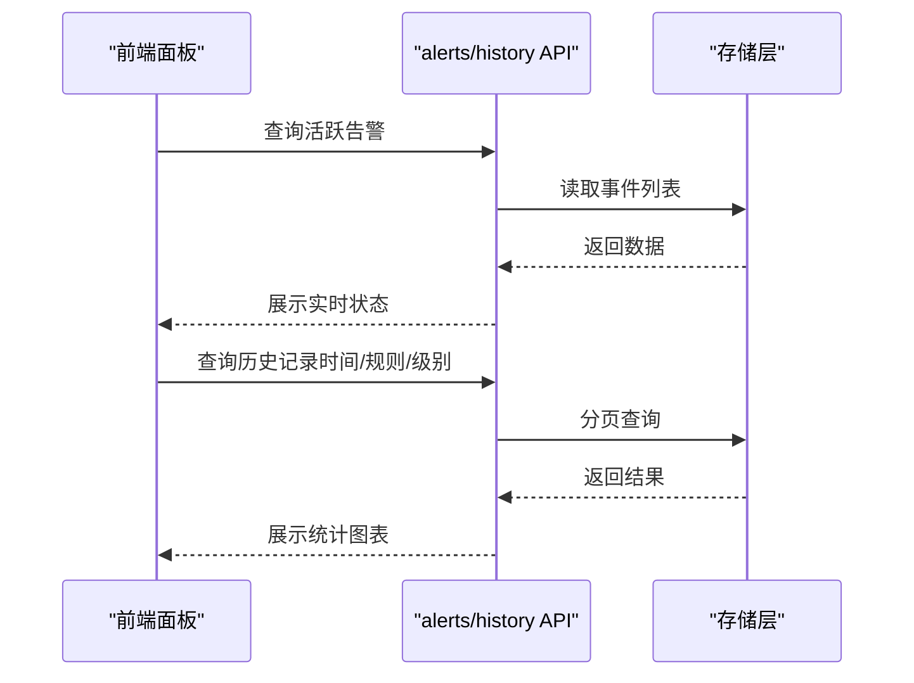
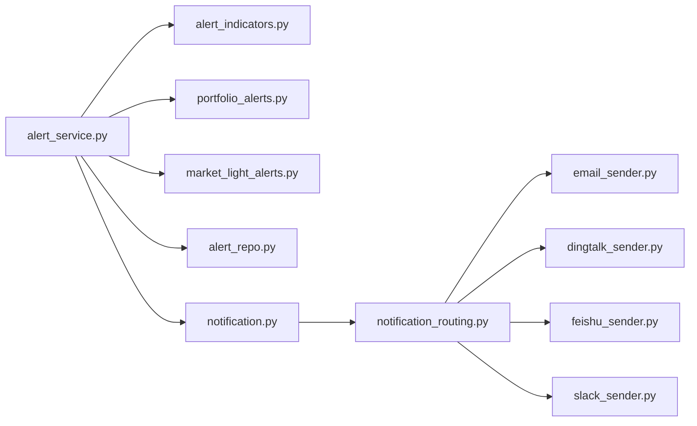

# 安全告警系统

<cite>
**本文档引用的文件**   
- [api/v1/endpoints/alerts.py](file://api/v1/endpoints/alerts.py)
- [api/v1/schemas/alerts.py](file://api/v1/schemas/alerts.py)
- [src/services/alert_service.py](file://src/services/alert_service.py)
- [src/services/alert_worker.py](file://src/services/alert_worker.py)
- [src/repositories/alert_repo.py](file://src/repositories/alert_repo.py)
- [src/notification_sender/email_sender.py](file://src/notification_sender/email_sender.py)
- [src/notification_sender/dingtalk_sender.py](file://src/notification_sender/dingtalk_sender.py)
- [src/notification_sender/feishu_sender.py](file://src/notification_sender/feishu_sender.py)
- [src/notification_sender/slack_sender.py](file://src/notification_sender/slack_sender.py)
- [src/notification.py](file://src/notification.py)
- [src/notification_contracts.py](file://src/notification_contracts.py)
- [src/notification_routing.py](file://src/notification_routing.py)
- [src/notification_noise.py](file://src/notification_noise.py)
- [src/enums.py](file://src/enums.py)
- [src/config.py](file://src/config.py)
- [src/scheduler.py](file://src/scheduler.py)
- [src/core/market_light_alerts.py](file://src/core/market_light_alerts.py)
- [src/services/portfolio_alerts.py](file://src/services/portfolio_alerts.py)
- [src/services/alert_indicators.py](file://src/services/alert_indicators.py)
- [src/services/system_config_service.py](file://src/services/system_config_service.py)
- [api/v1/endpoints/system_config.py](file://api/v1/endpoints/system_config.py)
- [api/v1/endpoints/history.py](file://api/v1/endpoints/history.py)
- [api/v1/schemas/common.py](file://api/v1/schemas/common.py)
- [tests/test_alert_api.py](file://tests/test_alert_api.py)
- [tests/test_alert_worker.py](file://tests/test_alert_worker.py)
- [tests/test_notification.py](file://tests/test_notification.py)
- [tests/test_notification_routing.py](file://tests/test_notification_routing.py)
- [tests/test_notification_noise.py](file://tests/test_notification_noise.py)
</cite>

## 目录
1. [简介](#简介)
2. [项目结构](#项目结构)
3. [核心组件](#核心组件)
4. [架构总览](#架构总览)
5. [详细组件分析](#详细组件分析)
6. [依赖关系分析](#依赖关系分析)
7. [性能考虑](#性能考虑)
8. [故障排除指南](#故障排除指南)
9. [结论](#结论)
10. [附录](#附录)

## 简介
本文件为 Daily Stock Analysis 安全告警系统的权威技术文档，聚焦以下目标：
- 告警规则配置：阈值设置、条件判断与触发机制
- 告警渠道集成：邮件、短信、即时通讯工具（钉钉、飞书、Slack等）
- 事件分类：严重级别定义、优先级排序与去重策略
- 响应流程：自动恢复、人工干预与升级机制
- 监控面板：实时状态查看、历史查询与统计分析
- 配置示例与故障排除方法

该文档面向产品、研发与运维人员，兼顾可读性与可实施性。

## 项目结构
与告警相关的代码主要分布在如下模块：
- API 层：提供告警查询、配置管理、历史检索等接口
- 服务层：封装告警计算、路由、通知发送与任务调度
- 存储层：持久化告警事件与配置
- 通知层：多渠道发送能力与统一契约
- 配置与调度：系统配置、定时任务与运行参数

图表来源
- [api/v1/endpoints/alerts.py](file://api/v1/endpoints/alerts.py)
- [api/v1/endpoints/system_config.py](file://api/v1/endpoints/system_config.py)
- [api/v1/endpoints/history.py](file://api/v1/endpoints/history.py)
- [src/services/alert_service.py](file://src/services/alert_service.py)
- [src/services/alert_worker.py](file://src/services/alert_worker.py)
- [src/services/alert_indicators.py](file://src/services/alert_indicators.py)
- [src/services/portfolio_alerts.py](file://src/services/portfolio_alerts.py)
- [src/core/market_light_alerts.py](file://src/core/market_light_alerts.py)
- [src/repositories/alert_repo.py](file://src/repositories/alert_repo.py)
- [src/notification.py](file://src/notification.py)
- [src/notification_contracts.py](file://src/notification_contracts.py)
- [src/notification_routing.py](file://src/notification_routing.py)
- [src/notification_sender/email_sender.py](file://src/notification_sender/email_sender.py)
- [src/notification_sender/dingtalk_sender.py](file://src/notification_sender/dingtalk_sender.py)
- [src/notification_sender/feishu_sender.py](file://src/notification_sender/feishu_sender.py)
- [src/notification_sender/slack_sender.py](file://src/notification_sender/slack_sender.py)
- [src/config.py](file://src/config.py)
- [src/scheduler.py](file://src/scheduler.py)
- [src/enums.py](file://src/enums.py)

章节来源
- [api/v1/endpoints/alerts.py](file://api/v1/endpoints/alerts.py)
- [src/services/alert_service.py](file://src/services/alert_service.py)
- [src/notification.py](file://src/notification.py)
- [src/config.py](file://src/config.py)

## 核心组件
- 告警服务（AlertService）
  - 负责聚合指标、组合规则、生成告警事件、执行路由与通知
  - 与存储层交互以持久化事件，与调度器协作周期性触发
- 告警工作器（AlertWorker）
  - 后台任务执行器，按周期或事件驱动拉取数据、评估规则、投递通知
- 指标计算（AlertIndicators）
  - 提供技术指标与业务指标的计算能力，供规则引擎使用
- 组合告警（PortfolioAlerts）
  - 针对投资组合层面的风险与异常进行告警
- 市场轻预警（MarketLightAlerts）
  - 基于市场状态的轻量级预警，用于快速提示
- 通知中心（Notification）
  - 统一发送入口，支持多通道、模板渲染与重试
- 路由与降噪（NotificationRouting / NotificationNoise）
  - 根据规则将事件分发到合适渠道，并实现去重、限流与合并
- 存储（AlertRepo）
  - 告警事件的增删改查与分页查询
- 配置与枚举（Config / Enums）
  - 全局开关、渠道配置、严重级别与优先级定义

章节来源
- [src/services/alert_service.py](file://src/services/alert_service.py)
- [src/services/alert_worker.py](file://src/services/alert_worker.py)
- [src/services/alert_indicators.py](file://src/services/alert_indicators.py)
- [src/services/portfolio_alerts.py](file://src/services/portfolio_alerts.py)
- [src/core/market_light_alerts.py](file://src/core/market_light_alerts.py)
- [src/notification.py](file://src/notification.py)
- [src/notification_routing.py](file://src/notification_routing.py)
- [src/notification_noise.py](file://src/notification_noise.py)
- [src/repositories/alert_repo.py](file://src/repositories/alert_repo.py)
- [src/config.py](file://src/config.py)
- [src/enums.py](file://src/enums.py)

## 架构总览
告警系统采用“采集-评估-路由-通知-持久化”的分层架构，结合调度器与配置中心实现可观测与可配置。

图表来源
- [src/scheduler.py](file://src/scheduler.py)
- [src/services/alert_worker.py](file://src/services/alert_worker.py)
- [src/services/alert_service.py](file://src/services/alert_service.py)
- [src/services/alert_indicators.py](file://src/services/alert_indicators.py)
- [src/repositories/alert_repo.py](file://src/repositories/alert_repo.py)
- [src/notification_routing.py](file://src/notification_routing.py)
- [src/notification.py](file://src/notification.py)
- [src/notification_sender/email_sender.py](file://src/notification_sender/email_sender.py)
- [src/notification_sender/dingtalk_sender.py](file://src/notification_sender/dingtalk_sender.py)
- [src/notification_sender/feishu_sender.py](file://src/notification_sender/feishu_sender.py)
- [src/notification_sender/slack_sender.py](file://src/notification_sender/slack_sender.py)

## 详细组件分析

### 告警规则与触发机制
- 规则类型
  - 阈值规则：对价格、成交量、波动率等指标设定上下限
  - 条件规则：多指标组合逻辑（如金叉+放量）
  - 时间窗口：滑动窗口统计与趋势判定
- 触发机制
  - 定时触发：由调度器按周期执行
  - 事件驱动：外部事件（如行情快照）触发
  - 幂等与去重：同一规则在同一时间窗内避免重复告警
- 配置项
  - 阈值、条件表达式、窗口大小、冷却时间、严重级别、通知渠道

图表来源
- [src/services/alert_service.py](file://src/services/alert_service.py)
- [src/services/alert_indicators.py](file://src/services/alert_indicators.py)
- [src/notification_routing.py](file://src/notification_routing.py)
- [src/notification_noise.py](file://src/notification_noise.py)
- [src/repositories/alert_repo.py](file://src/repositories/alert_repo.py)

章节来源
- [src/services/alert_service.py](file://src/services/alert_service.py)
- [src/services/alert_indicators.py](file://src/services/alert_indicators.py)
- [src/notification_noise.py](file://src/notification_noise.py)

### 告警事件分类与优先级
- 严重级别
  - 定义于枚举中，通常包含：信息、警告、严重、致命
- 优先级排序
  - 基于严重级别、影响范围（个股/组合/市场）、时效性综合排序
- 去重策略
  - 基于规则ID、标的、时间窗口的哈希去重
  - 冷却时间与合并策略减少噪音

图表来源
- [src/enums.py](file://src/enums.py)
- [src/repositories/alert_repo.py](file://src/repositories/alert_repo.py)

章节来源
- [src/enums.py](file://src/enums.py)
- [src/repositories/alert_repo.py](file://src/repositories/alert_repo.py)

### 告警渠道集成
- 支持的渠道
  - 邮件、短信、钉钉、飞书、Slack 等
- 统一契约
  - 所有渠道实现统一的发送接口，便于扩展与替换
- 路由策略
  - 根据规则配置与事件属性选择渠道
  - 支持多通道并行发送与失败回退

图表来源
- [src/notification.py](file://src/notification.py)
- [src/notification_contracts.py](file://src/notification_contracts.py)
- [src/notification_routing.py](file://src/notification_routing.py)
- [src/notification_sender/email_sender.py](file://src/notification_sender/email_sender.py)
- [src/notification_sender/dingtalk_sender.py](file://src/notification_sender/dingtalk_sender.py)
- [src/notification_sender/feishu_sender.py](file://src/notification_sender/feishu_sender.py)
- [src/notification_sender/slack_sender.py](file://src/notification_sender/slack_sender.py)

章节来源
- [src/notification.py](file://src/notification.py)
- [src/notification_contracts.py](file://src/notification_contracts.py)
- [src/notification_routing.py](file://src/notification_routing.py)
- [src/notification_sender/email_sender.py](file://src/notification_sender/email_sender.py)
- [src/notification_sender/dingtalk_sender.py](file://src/notification_sender/dingtalk_sender.py)
- [src/notification_sender/feishu_sender.py](file://src/notification_sender/feishu_sender.py)
- [src/notification_sender/slack_sender.py](file://src/notification_sender/slack_sender.py)

### 告警响应流程
- 自动恢复
  - 当指标回归正常区间时，自动生成恢复事件并通知
- 人工干预
  - 提供确认、忽略、转交等操作接口
- 升级机制
  - 长时间未处理或重复触发时，自动升级严重级别并追加通知渠道

图表来源
- [api/v1/endpoints/alerts.py](file://api/v1/endpoints/alerts.py)
- [src/services/alert_service.py](file://src/services/alert_service.py)
- [src/repositories/alert_repo.py](file://src/repositories/alert_repo.py)
- [src/notification.py](file://src/notification.py)

章节来源
- [api/v1/endpoints/alerts.py](file://api/v1/endpoints/alerts.py)
- [src/services/alert_service.py](file://src/services/alert_service.py)
- [src/repositories/alert_repo.py](file://src/repositories/alert_repo.py)
- [src/notification.py](file://src/notification.py)

### 告警监控面板使用指南
- 实时状态查看
  - 通过 API 获取当前活跃告警列表与状态
- 历史查询
  - 支持按时间范围、规则、标的、严重级别筛选
- 统计分析
  - 告警数量趋势、渠道成功率、平均处理时长等

图表来源
- [api/v1/endpoints/alerts.py](file://api/v1/endpoints/alerts.py)
- [api/v1/endpoints/history.py](file://api/v1/endpoints/history.py)
- [src/repositories/alert_repo.py](file://src/repositories/alert_repo.py)

章节来源
- [api/v1/endpoints/alerts.py](file://api/v1/endpoints/alerts.py)
- [api/v1/endpoints/history.py](file://api/v1/endpoints/history.py)
- [src/repositories/alert_repo.py](file://src/repositories/alert_repo.py)

### 告警规则配置示例
- 阈值规则示例
  - 标的：某股票
  - 指标：收盘价
  - 条件：连续N日低于阈值X
  - 严重级别：警告
  - 渠道：邮件+钉钉
- 条件规则示例
  - 标的：组合
  - 指标：回撤幅度、波动率
  - 条件：回撤超过Y%且波动率高于Z
  - 严重级别：严重
  - 渠道：飞书+邮件
- 时间窗口与冷却
  - 窗口：5分钟
  - 冷却：10分钟
  - 去重：规则ID+标的+时间窗哈希

章节来源
- [src/services/alert_service.py](file://src/services/alert_service.py)
- [src/config.py](file://src/config.py)
- [api/v1/endpoints/system_config.py](file://api/v1/endpoints/system_config.py)

### 故障排除方法
- 常见问题
  - 渠道发送失败：检查网络、凭据、模板渲染
  - 规则不触发：校验阈值、窗口、数据源可用性
  - 告警风暴：调整冷却与降噪策略
- 诊断步骤
  - 查看告警日志与发送回执
  - 验证配置项与枚举值
  - 使用测试用例模拟触发与发送

章节来源
- [tests/test_notification.py](file://tests/test_notification.py)
- [tests/test_notification_routing.py](file://tests/test_notification_routing.py)
- [tests/test_notification_noise.py](file://tests/test_notification_noise.py)
- [tests/test_alert_api.py](file://tests/test_alert_api.py)
- [tests/test_alert_worker.py](file://tests/test_alert_worker.py)

## 依赖关系分析
- 组件耦合
  - 告警服务依赖指标计算、路由与通知中心
  - 通知中心依赖各渠道发送器
  - 存储层独立于业务逻辑，提供统一数据访问
- 外部依赖
  - 数据源（行情、基本面）
  - 第三方服务（邮件服务器、IM平台）
- 潜在循环依赖
  - 通过接口解耦与服务分层避免

图表来源
- [src/services/alert_service.py](file://src/services/alert_service.py)
- [src/services/alert_indicators.py](file://src/services/alert_indicators.py)
- [src/services/portfolio_alerts.py](file://src/services/portfolio_alerts.py)
- [src/core/market_light_alerts.py](file://src/core/market_light_alerts.py)
- [src/repositories/alert_repo.py](file://src/repositories/alert_repo.py)
- [src/notification.py](file://src/notification.py)
- [src/notification_routing.py](file://src/notification_routing.py)
- [src/notification_sender/email_sender.py](file://src/notification_sender/email_sender.py)
- [src/notification_sender/dingtalk_sender.py](file://src/notification_sender/dingtalk_sender.py)
- [src/notification_sender/feishu_sender.py](file://src/notification_sender/feishu_sender.py)
- [src/notification_sender/slack_sender.py](file://src/notification_sender/slack_sender.py)

章节来源
- [src/services/alert_service.py](file://src/services/alert_service.py)
- [src/notification.py](file://src/notification.py)
- [src/notification_routing.py](file://src/notification_routing.py)

## 性能考虑
- 指标计算优化
  - 缓存热点数据，减少重复计算
  - 批量拉取与异步处理提升吞吐
- 路由与降噪
  - 合理设置冷却时间与合并策略，降低发送压力
- 存储与查询
  - 索引设计优化查询性能，分页与过滤减少负载
- 可扩展性
  - 水平扩展工作器实例，负载均衡

[本节为通用指导，无需特定文件引用]

## 故障排除指南
- 渠道问题
  - 检查凭据与网络连通性
  - 查看发送回执与错误码
- 规则问题
  - 校验阈值与条件表达式
  - 确认数据源可用性与延迟
- 告警风暴
  - 调整冷却与降噪策略
  - 增加合并与限流
- 定位手段
  - 启用调试日志
  - 使用测试用例复现与验证

章节来源
- [tests/test_notification.py](file://tests/test_notification.py)
- [tests/test_notification_routing.py](file://tests/test_notification_routing.py)
- [tests/test_notification_noise.py](file://tests/test_notification_noise.py)
- [tests/test_alert_api.py](file://tests/test_alert_api.py)
- [tests/test_alert_worker.py](file://tests/test_alert_worker.py)

## 结论
Daily Stock Analysis 安全告警系统通过清晰的分层架构与模块化设计，实现了灵活的规则配置、稳定的多渠道通知与高效的告警处理。配合完善的监控与诊断能力，能够满足金融场景下对实时性与可靠性的严格要求。建议在生产环境中持续优化指标计算与路由策略，确保在大规模数据与高并发下的稳定表现。

[本节为总结，无需特定文件引用]

## 附录
- 配置参考
  - 系统配置接口与字段说明
  - 渠道配置样例与必填项
- 最佳实践
  - 规则命名与版本管理
  - 告警分级与升级策略
  - 监控与审计

[本节为补充信息，无需特定文件引用]