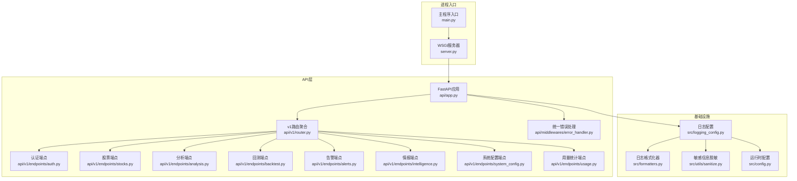
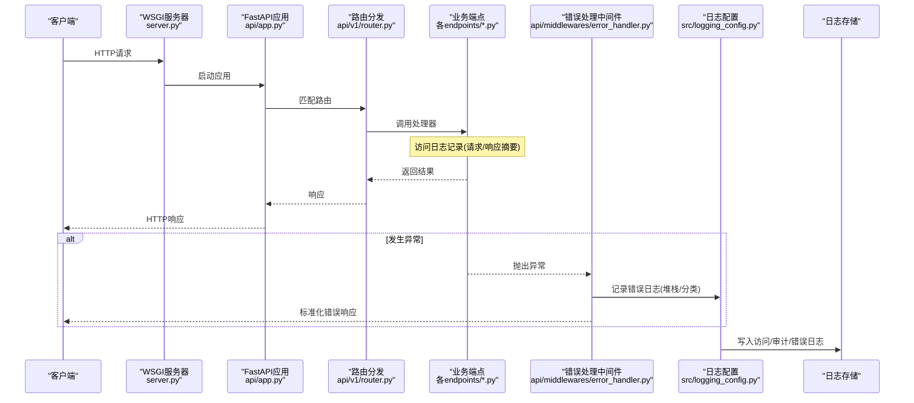
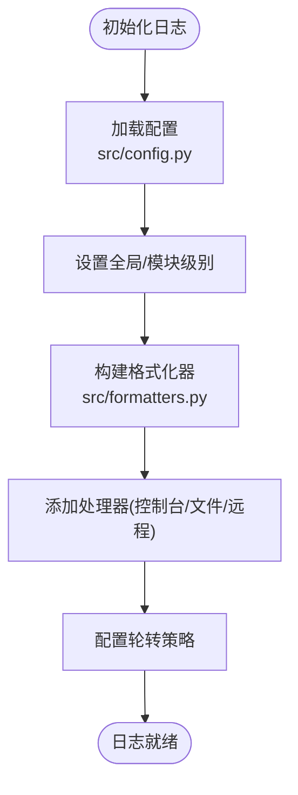
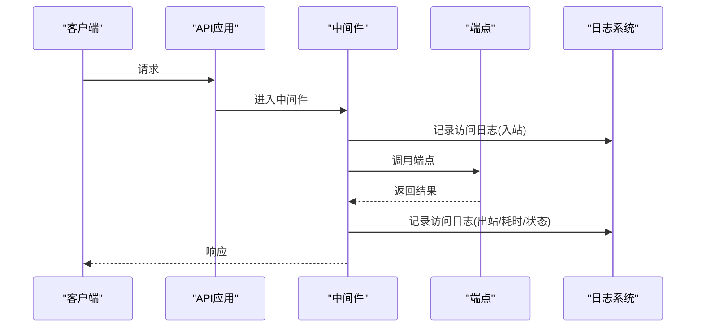
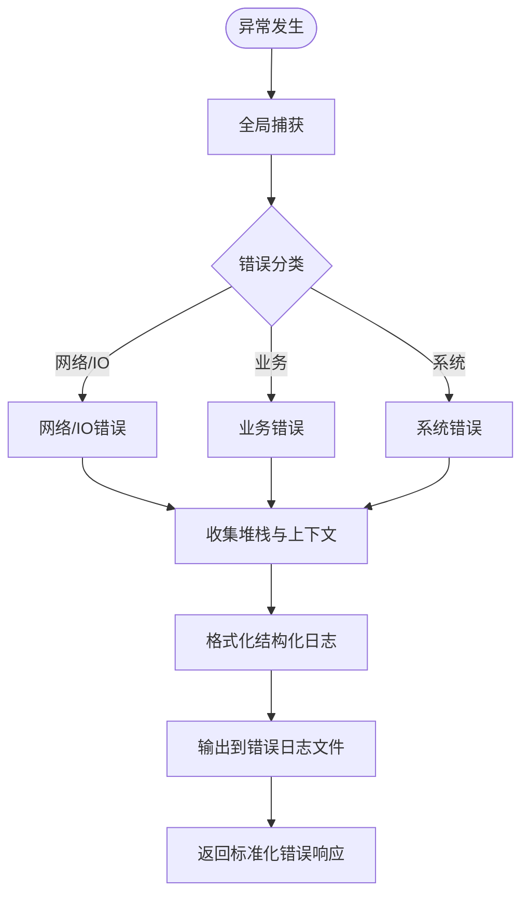
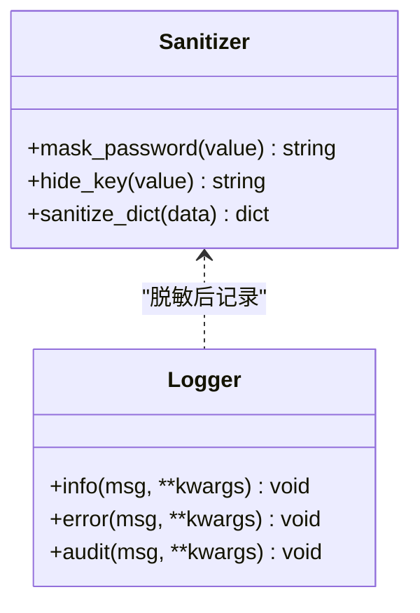
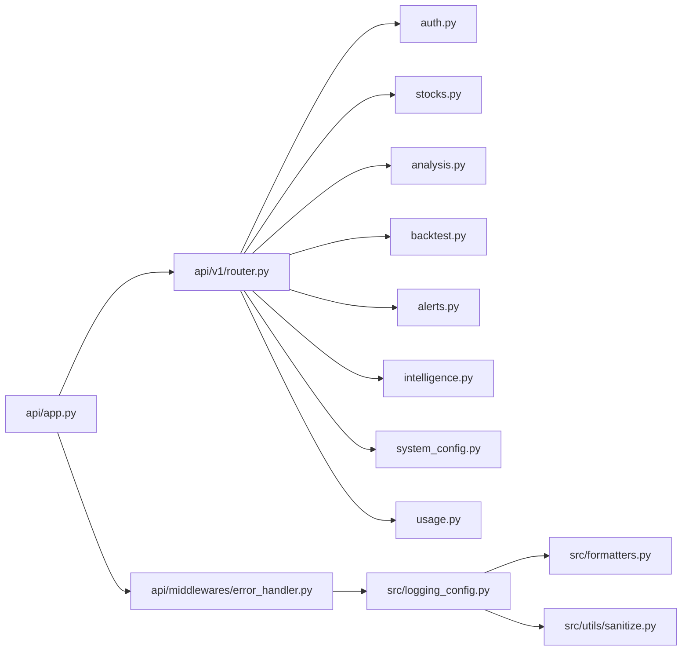

# 安全日志记录

<cite>
**本文引用的文件**   
- [logging_config.py](file://src/logging_config.py)
- [api/app.py](file://api/app.py)
- [api/middlewares/error_handler.py](file://api/middlewares/error_handler.py)
- [api/v1/endpoints/auth.py](file://api/v1/endpoints/auth.py)
- [api/v1/endpoints/stocks.py](file://api/v1/endpoints/stocks.py)
- [api/v1/endpoints/analysis.py](file://api/v1/endpoints/analysis.py)
- [api/v1/endpoints/backtest.py](file://api/v1/endpoints/backtest.py)
- [api/v1/endpoints/alerts.py](file://api/v1/endpoints/alerts.py)
- [api/v1/endpoints/intelligence.py](file://api/v1/endpoints/intelligence.py)
- [api/v1/endpoints/system_config.py](file://api/v1/endpoints/system_config.py)
- [api/v1/endpoints/usage.py](file://api/v1/endpoints/usage.py)
- [api/v1/router.py](file://api/v1/router.py)
- [server.py](file://server.py)
- [main.py](file://main.py)
- [src/config.py](file://src/config.py)
- [src/formatters.py](file://src/formatters.py)
- [src/utils/sanitize.py](file://src/utils/sanitize.py)
- [tests/test_logging_config.py](file://tests/test_logging_config.py)
</cite>

## 目录
1. [简介](#简介)
2. [项目结构](#项目结构)
3. [核心组件](#核心组件)
4. [架构总览](#架构总览)
5. [详细组件分析](#详细组件分析)
6. [依赖关系分析](#依赖关系分析)
7. [性能考虑](#性能考虑)
8. [故障排查指南](#故障排查指南)
9. [结论](#结论)
10. [附录](#附录)

## 简介
本文件面向Daily Stock Analysis的安全日志记录体系，覆盖日志配置系统、访问日志（API请求、用户操作审计、会话跟踪）、错误日志追踪（异常捕获、堆栈跟踪、错误分类）、敏感信息保护（密码脱敏、密钥隐藏、数据加密）以及日志分析工具使用指南。文档以代码级为依据，提供可视化架构图与流程图，并给出最佳实践建议，帮助读者快速理解并正确使用日志能力。

## 项目结构
本项目采用分层与模块化组织：
- API层：FastAPI应用入口、路由注册、中间件与错误处理
- 服务层：业务逻辑与外部集成
- 工具层：格式化器、脱敏工具、配置管理
- 测试层：针对日志配置的单元测试

图表来源 
- [api/app.py](file://api/app.py)
- [api/v1/router.py](file://api/v1/router.py)
- [api/middlewares/error_handler.py](file://api/middlewares/error_handler.py)
- [src/logging_config.py](file://src/logging_config.py)
- [src/formatters.py](file://src/formatters.py)
- [src/utils/sanitize.py](file://src/utils/sanitize.py)
- [src/config.py](file://src/config.py)
- [server.py](file://server.py)
- [main.py](file://main.py)

章节来源
- [api/app.py](file://api/app.py)
- [api/v1/router.py](file://api/v1/router.py)
- [src/logging_config.py](file://src/logging_config.py)
- [src/formatters.py](file://src/formatters.py)
- [src/utils/sanitize.py](file://src/utils/sanitize.py)
- [src/config.py](file://src/config.py)
- [server.py](file://server.py)
- [main.py](file://main.py)

## 核心组件
- 日志配置中心：集中管理日志级别、输出目标、格式模板与轮转策略
- 访问日志：记录HTTP请求/响应摘要、方法、路径、状态码、耗时、客户端IP等
- 审计日志：记录关键用户操作（登录、权限变更、配置修改）
- 错误日志：统一异常捕获、结构化堆栈、错误分类与上下文关联
- 敏感信息保护：对密码、密钥、令牌等进行脱敏或掩码处理
- 存储策略：按模块/级别分文件、按时间轮转、保留周期与压缩

章节来源
- [src/logging_config.py](file://src/logging_config.py)
- [src/formatters.py](file://src/formatters.py)
- [src/utils/sanitize.py](file://src/utils/sanitize.py)
- [src/config.py](file://src/config.py)

## 架构总览
下图展示了从请求进入FastAPI到日志落盘的全链路，包括访问日志、审计日志与错误日志的生成与输出。

图表来源 
- [server.py](file://server.py)
- [api/app.py](file://api/app.py)
- [api/v1/router.py](file://api/v1/router.py)
- [api/middlewares/error_handler.py](file://api/middlewares/error_handler.py)
- [src/logging_config.py](file://src/logging_config.py)

## 详细组件分析

### 日志配置系统
- 日志级别设置：支持DEBUG/INFO/WARNING/ERROR/CRITICAL，可按模块或全局配置
- 输出格式：结构化JSON或文本，包含时间戳、级别、模块、消息、请求ID、用户ID等字段
- 存储策略：按级别与模块拆分文件，按天轮转，保留N天，自动压缩归档
- 动态调整：支持运行时调整日志级别与输出目标（控制台/文件/远程）

图表来源 
- [src/logging_config.py](file://src/logging_config.py)
- [src/formatters.py](file://src/formatters.py)
- [src/config.py](file://src/config.py)

章节来源
- [src/logging_config.py](file://src/logging_config.py)
- [src/formatters.py](file://src/formatters.py)
- [src/config.py](file://src/config.py)
- [tests/test_logging_config.py](file://tests/test_logging_config.py)

### 访问日志记录
- API请求日志：记录方法、路径、查询参数（脱敏后）、状态码、耗时、客户端IP、User-Agent
- 用户操作审计：登录成功/失败、权限校验、配置更新、数据导出等关键动作
- 会话跟踪：通过请求ID/会话ID关联一次交互的全链路日志

图表来源 
- [api/app.py](file://api/app.py)
- [api/v1/router.py](file://api/v1/router.py)
- [api/middlewares/error_handler.py](file://api/middlewares/error_handler.py)
- [src/logging_config.py](file://src/logging_config.py)

章节来源
- [api/app.py](file://api/app.py)
- [api/v1/router.py](file://api/v1/router.py)
- [api/middlewares/error_handler.py](file://api/middlewares/error_handler.py)

### 错误日志追踪
- 异常捕获：全局异常处理器统一捕获未处理异常，避免泄露内部细节
- 堆栈跟踪：记录完整堆栈与上下文（请求ID、用户ID、模块名）
- 错误分类：按HTTP状态码、异常类型、业务域进行分类标记，便于检索与分析

图表来源 
- [api/middlewares/error_handler.py](file://api/middlewares/error_handler.py)
- [src/logging_config.py](file://src/logging_config.py)

章节来源
- [api/middlewares/error_handler.py](file://api/middlewares/error_handler.py)
- [src/logging_config.py](file://src/logging_config.py)

### 敏感信息保护
- 密码脱敏：对用户输入中的密码字段进行掩码替换
- 密钥隐藏：对API Key、Token、Secret等敏感值进行遮蔽或哈希
- 数据加密：对落盘的敏感日志字段进行加密存储（可选）

图表来源 
- [src/utils/sanitize.py](file://src/utils/sanitize.py)
- [src/logging_config.py](file://src/logging_config.py)

章节来源
- [src/utils/sanitize.py](file://src/utils/sanitize.py)
- [src/logging_config.py](file://src/logging_config.py)

### 端点级日志示例（路径参考）
- 认证端点：记录登录尝试、令牌签发与失效
  - 参考路径：[api/v1/endpoints/auth.py](file://api/v1/endpoints/auth.py)
- 股票查询端点：记录查询条件、返回条数、耗时
  - 参考路径：[api/v1/endpoints/stocks.py](file://api/v1/endpoints/stocks.py)
- 分析端点：记录分析任务ID、模型版本、输入摘要
  - 参考路径：[api/v1/endpoints/analysis.py](file://api/v1/endpoints/analysis.py)
- 回测端点：记录策略名称、回测区间、指标摘要
  - 参考路径：[api/v1/endpoints/backtest.py](file://api/v1/endpoints/backtest.py)
- 告警端点：记录触发条件、接收渠道、发送结果
  - 参考路径：[api/v1/endpoints/alerts.py](file://api/v1/endpoints/alerts.py)
- 情报端点：记录数据来源、抓取结果、缓存命中
  - 参考路径：[api/v1/endpoints/intelligence.py](file://api/v1/endpoints/intelligence.py)
- 系统配置端点：记录配置键、变更前后值（脱敏）
  - 参考路径：[api/v1/endpoints/system_config.py](file://api/v1/endpoints/system_config.py)
- 用量统计端点：记录调用次数、模型消耗、配额阈值
  - 参考路径：[api/v1/endpoints/usage.py](file://api/v1/endpoints/usage.py)

章节来源
- [api/v1/endpoints/auth.py](file://api/v1/endpoints/auth.py)
- [api/v1/endpoints/stocks.py](file://api/v1/endpoints/stocks.py)
- [api/v1/endpoints/analysis.py](file://api/v1/endpoints/analysis.py)
- [api/v1/endpoints/backtest.py](file://api/v1/endpoints/backtest.py)
- [api/v1/endpoints/alerts.py](file://api/v1/endpoints/alerts.py)
- [api/v1/endpoints/intelligence.py](file://api/v1/endpoints/intelligence.py)
- [api/v1/endpoints/system_config.py](file://api/v1/endpoints/system_config.py)
- [api/v1/endpoints/usage.py](file://api/v1/endpoints/usage.py)

## 依赖关系分析
- FastAPI应用依赖路由与中间件，中间件依赖日志配置与格式化器
- 端点依赖业务服务，但日志记录集中在中间件与错误处理器中，降低耦合
- 脱敏工具被日志系统复用，确保所有输出一致安全

图表来源 
- [api/app.py](file://api/app.py)
- [api/v1/router.py](file://api/v1/router.py)
- [api/middlewares/error_handler.py](file://api/middlewares/error_handler.py)
- [src/logging_config.py](file://src/logging_config.py)
- [src/formatters.py](file://src/formatters.py)
- [src/utils/sanitize.py](file://src/utils/sanitize.py)

章节来源
- [api/app.py](file://api/app.py)
- [api/v1/router.py](file://api/v1/router.py)
- [api/middlewares/error_handler.py](file://api/middlewares/error_handler.py)
- [src/logging_config.py](file://src/logging_config.py)
- [src/formatters.py](file://src/formatters.py)
- [src/utils/sanitize.py](file://src/utils/sanitize.py)

## 性能考虑
- 异步日志：在高并发场景下使用异步写入，减少请求阻塞
- 批量写入：合并多条日志为批次写入，降低I/O开销
- 采样策略：对高频低价值日志进行采样，控制日志量
- 分级输出：生产环境默认INFO及以上，调试时按需提升级别
- 磁盘与压缩：合理设置轮转大小与保留天数，启用压缩节省空间

## 故障排查指南
- 无法写入日志：检查日志目录权限、磁盘空间、轮转策略配置
- 日志缺失关键字段：确认格式化器是否注入请求ID、用户ID等上下文
- 敏感信息泄露：核查脱敏规则是否覆盖所有敏感字段
- 错误分类不准确：检查异常类型映射与HTTP状态码转换逻辑
- 性能抖动：评估日志级别与写入方式，必要时开启采样或异步

章节来源
- [src/logging_config.py](file://src/logging_config.py)
- [src/formatters.py](file://src/formatters.py)
- [src/utils/sanitize.py](file://src/utils/sanitize.py)
- [api/middlewares/error_handler.py](file://api/middlewares/error_handler.py)

## 结论
Daily Stock Analysis的安全日志记录体系以集中式配置为核心，结合访问日志、审计日志与错误日志，形成完整的可观测性闭环。通过严格的敏感信息保护与灵活的存储策略，既满足合规要求，又兼顾性能与可维护性。建议在部署前完成日志级别与轮转策略的调优，并在上线后持续监控日志质量与容量增长。

## 附录
- 日志查询建议：
  - 基于请求ID/会话ID进行全链路追踪
  - 按模块与级别过滤，定位问题范围
  - 使用模式匹配提取关键指标（如耗时、状态码分布）
- 性能监控建议：
  - 监控日志写入延迟与吞吐
  - 关注错误率与异常分类趋势
  - 定期审查敏感字段脱敏覆盖率
- 最佳实践：
  - 禁止在日志中记录明文密码与密钥
  - 使用结构化日志便于解析与聚合
  - 将审计日志与访问日志分离，便于合规审计
  - 对高敏感操作增加二次审计与告警