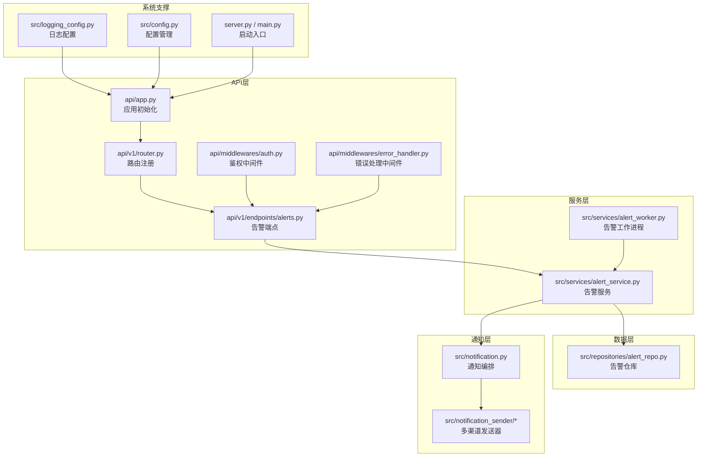
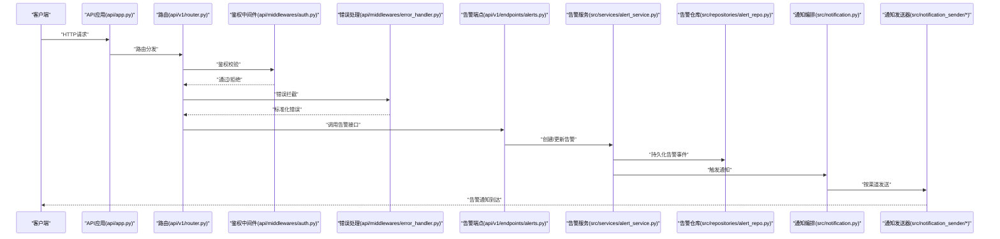
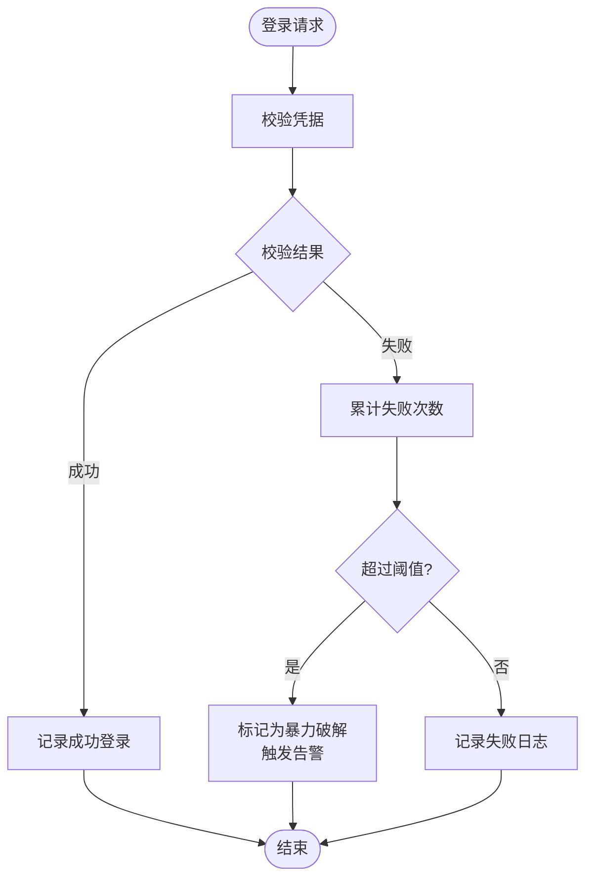
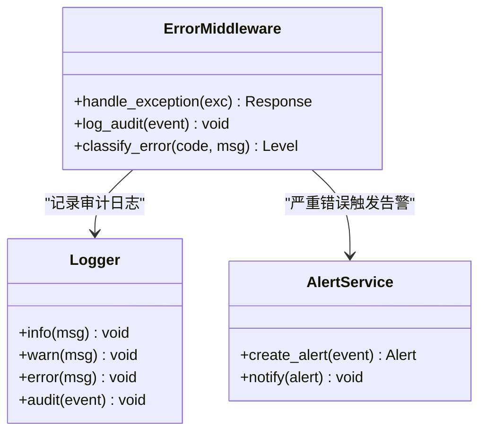
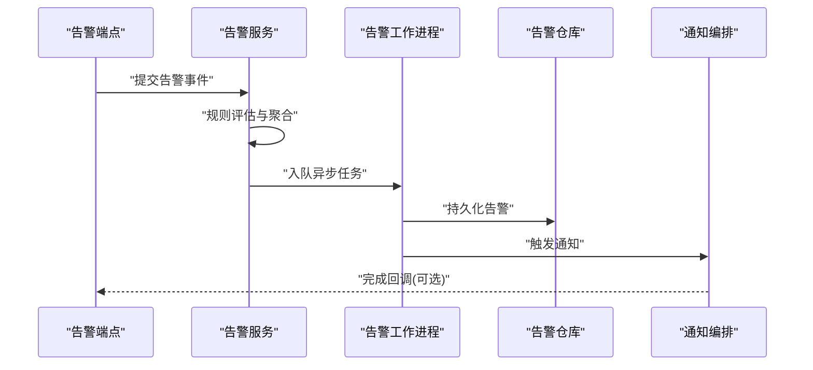
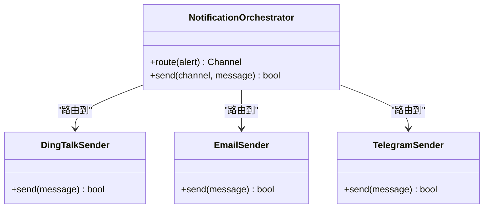
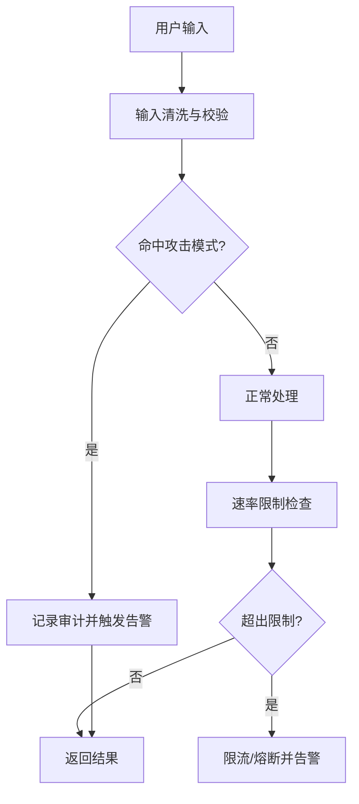
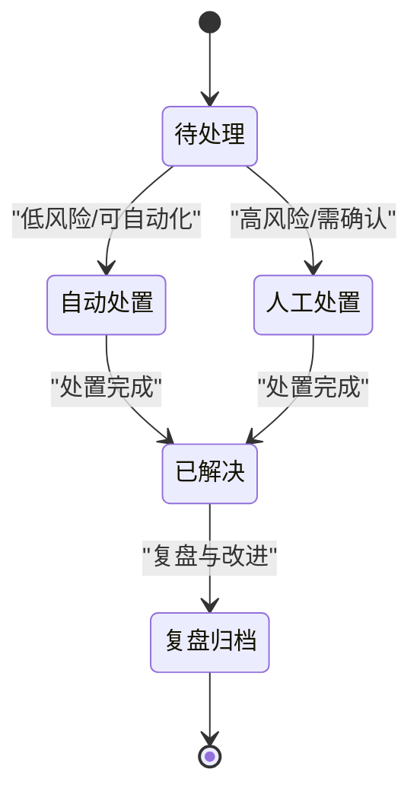
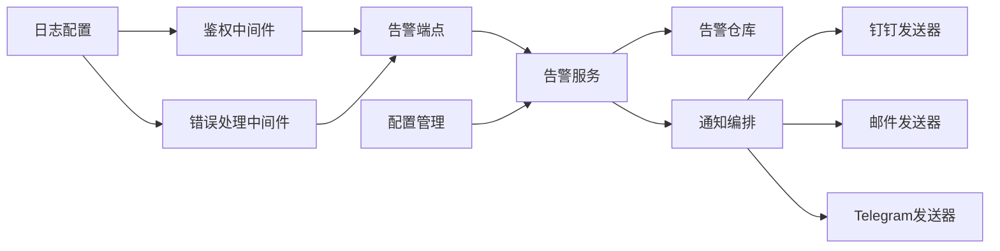

# 安全监控与响应

<cite>
**本文引用的文件**   
- [api/app.py](file://api/app.py)
- [api/middlewares/auth.py](file://api/middlewares/auth.py)
- [api/middlewares/error_handler.py](file://api/middlewares/error_handler.py)
- [api/v1/router.py](file://api/v1/router.py)
- [api/v1/endpoints/alerts.py](file://api/v1/endpoints/alerts.py)
- [api/v1/schemas/alerts.py](file://api/v1/schemas/alerts.py)
- [src/services/alert_service.py](file://src/services/alert_service.py)
- [src/services/alert_worker.py](file://src/services/alert_worker.py)
- [src/repositories/alert_repo.py](file://src/repositories/alert_repo.py)
- [src/notification_sender/dingtalk_sender.py](file://src/notification_sender/dingtalk_sender.py)
- [src/notification_sender/email_sender.py](file://src/notification_sender/email_sender.py)
- [src/notification_sender/telegram_sender.py](file://src/notification_sender/telegram_sender.py)
- [src/notification.py](file://src/notification.py)
- [src/logging_config.py](file://src/logging_config.py)
- [src/config.py](file://src/config.py)
- [server.py](file://server.py)
- [main.py](file://main.py)
</cite>

## 目录
1. [简介](#简介)
2. [项目结构](#项目结构)
3. [核心组件](#核心组件)
4. [架构总览](#架构总览)
5. [详细组件分析](#详细组件分析)
6. [依赖关系分析](#依赖关系分析)
7. [性能考虑](#性能考虑)
8. [故障排查指南](#故障排查指南)
9. [结论](#结论)
10. [附录](#附录)

## 简介
本文件面向Daily Stock Analysis的安全监控与响应能力，围绕以下目标展开：
- 安全事件监控：异常登录检测、暴力破解识别、可疑行为分析
- 安全日志记录：访问日志、操作审计、错误追踪
- 安全告警机制：告警规则配置、通知渠道、响应流程
- 攻击行为识别：SQL注入检测、XSS攻击识别、DDoS防护
- 安全事件响应：事件分类、处理流程、恢复措施
- 安全监控配置：日志级别、存储策略、分析工具使用

## 项目结构
与安全监控与响应相关的代码主要分布在API层、服务层、仓库层、通知发送器以及全局配置与日志模块中。整体采用分层架构，API路由负责请求接入，中间件负责鉴权与错误处理，服务层编排业务逻辑，仓库层持久化告警数据，通知发送器负责多渠道告警推送。

图表来源
- [api/app.py](file://api/app.py)
- [api/v1/router.py](file://api/v1/router.py)
- [api/middlewares/auth.py](file://api/middlewares/auth.py)
- [api/middlewares/error_handler.py](file://api/middlewares/error_handler.py)
- [api/v1/endpoints/alerts.py](file://api/v1/endpoints/alerts.py)
- [src/services/alert_service.py](file://src/services/alert_service.py)
- [src/services/alert_worker.py](file://src/services/alert_worker.py)
- [src/repositories/alert_repo.py](file://src/repositories/alert_repo.py)
- [src/notification.py](file://src/notification.py)
- [src/logging_config.py](file://src/logging_config.py)
- [src/config.py](file://src/config.py)
- [server.py](file://server.py)
- [main.py](file://main.py)

章节来源
- [api/app.py](file://api/app.py)
- [api/v1/router.py](file://api/v1/router.py)
- [api/middlewares/auth.py](file://api/middlewares/auth.py)
- [api/middlewares/error_handler.py](file://api/middlewares/error_handler.py)
- [api/v1/endpoints/alerts.py](file://api/v1/endpoints/alerts.py)
- [src/services/alert_service.py](file://src/services/alert_service.py)
- [src/services/alert_worker.py](file://src/services/alert_worker.py)
- [src/repositories/alert_repo.py](file://src/repositories/alert_repo.py)
- [src/notification.py](file://src/notification.py)
- [src/logging_config.py](file://src/logging_config.py)
- [src/config.py](file://src/config.py)
- [server.py](file://server.py)
- [main.py](file://main.py)

## 核心组件
- 鉴权中间件：统一处理认证、授权与会话状态，为异常登录与暴力破解检测提供基础
- 错误处理中间件：捕获并标准化错误，便于审计与追踪
- 告警服务：聚合告警规则、评估风险、生成告警事件并触发通知
- 告警工作进程：异步处理告警任务，避免阻塞主请求路径
- 告警仓库：持久化告警事件，支持查询与统计
- 通知编排与发送器：按渠道（钉钉、邮件、Telegram等）分发告警消息
- 日志与配置：集中式日志配置与运行时配置管理

章节来源
- [api/middlewares/auth.py](file://api/middlewares/auth.py)
- [api/middlewares/error_handler.py](file://api/middlewares/error_handler.py)
- [src/services/alert_service.py](file://src/services/alert_service.py)
- [src/services/alert_worker.py](file://src/services/alert_worker.py)
- [src/repositories/alert_repo.py](file://src/repositories/alert_repo.py)
- [src/notification.py](file://src/notification.py)
- [src/notification_sender/dingtalk_sender.py](file://src/notification_sender/dingtalk_sender.py)
- [src/notification_sender/email_sender.py](file://src/notification_sender/email_sender.py)
- [src/notification_sender/telegram_sender.py](file://src/notification_sender/telegram_sender.py)
- [src/logging_config.py](file://src/logging_config.py)
- [src/config.py](file://src/config.py)

## 架构总览
下图展示了从请求进入、鉴权与错误处理，到告警生成、持久化与通知分发的完整链路。

图表来源
- [api/app.py](file://api/app.py)
- [api/v1/router.py](file://api/v1/router.py)
- [api/middlewares/auth.py](file://api/middlewares/auth.py)
- [api/middlewares/error_handler.py](file://api/middlewares/error_handler.py)
- [api/v1/endpoints/alerts.py](file://api/v1/endpoints/alerts.py)
- [src/services/alert_service.py](file://src/services/alert_service.py)
- [src/repositories/alert_repo.py](file://src/repositories/alert_repo.py)
- [src/notification.py](file://src/notification.py)
- [src/notification_sender/dingtalk_sender.py](file://src/notification_sender/dingtalk_sender.py)
- [src/notification_sender/email_sender.py](file://src/notification_sender/email_sender.py)
- [src/notification_sender/telegram_sender.py](file://src/notification_sender/telegram_sender.py)

## 详细组件分析

### 鉴权与异常登录检测
- 功能要点
  - 统一鉴权：校验令牌、会话有效性、权限范围
  - 异常登录检测：基于失败次数、IP/设备指纹、时间窗口进行判定
  - 暴力破解识别：对同一账户或IP的连续失败尝试进行阈值控制与临时封禁
- 实现要点
  - 在鉴权中间件中记录登录尝试结果与上下文信息
  - 结合配置中的阈值与时间窗口，动态调整风控策略
  - 将高风险事件写入告警事件，触发通知

图表来源
- [api/middlewares/auth.py](file://api/middlewares/auth.py)
- [src/config.py](file://src/config.py)
- [src/services/alert_service.py](file://src/services/alert_service.py)

章节来源
- [api/middlewares/auth.py](file://api/middlewares/auth.py)
- [src/config.py](file://src/config.py)
- [src/services/alert_service.py](file://src/services/alert_service.py)

### 错误处理与审计追踪
- 功能要点
  - 统一错误捕获：结构化错误码、消息与堆栈
  - 审计追踪：记录关键操作的输入输出摘要与耗时
  - 错误分级：区分可恢复错误与致命错误，驱动不同告警级别
- 实现要点
  - 错误处理中间件对异常进行包装与标准化
  - 结合日志配置输出结构化审计日志
  - 将严重错误转化为告警事件

图表来源
- [api/middlewares/error_handler.py](file://api/middlewares/error_handler.py)
- [src/logging_config.py](file://src/logging_config.py)
- [src/services/alert_service.py](file://src/services/alert_service.py)

章节来源
- [api/middlewares/error_handler.py](file://api/middlewares/error_handler.py)
- [src/logging_config.py](file://src/logging_config.py)
- [src/services/alert_service.py](file://src/services/alert_service.py)

### 告警服务与工作进程
- 功能要点
  - 规则评估：根据配置规则判断是否生成告警
  - 事件聚合：合并重复或低价值告警，降低噪音
  - 异步处理：通过工作进程执行耗时任务，避免阻塞
- 实现要点
  - 告警服务封装规则引擎与事件生命周期
  - 工作进程拉取队列任务，执行持久化与通知
  - 仓库层提供增删改查与统计接口

图表来源
- [api/v1/endpoints/alerts.py](file://api/v1/endpoints/alerts.py)
- [src/services/alert_service.py](file://src/services/alert_service.py)
- [src/services/alert_worker.py](file://src/services/alert_worker.py)
- [src/repositories/alert_repo.py](file://src/repositories/alert_repo.py)
- [src/notification.py](file://src/notification.py)

章节来源
- [api/v1/endpoints/alerts.py](file://api/v1/endpoints/alerts.py)
- [src/services/alert_service.py](file://src/services/alert_service.py)
- [src/services/alert_worker.py](file://src/services/alert_worker.py)
- [src/repositories/alert_repo.py](file://src/repositories/alert_repo.py)
- [src/notification.py](file://src/notification.py)

### 通知渠道与告警分发
- 功能要点
  - 多通道支持：钉钉、邮件、Telegram等
  - 模板化消息：按渠道适配格式与内容
  - 路由策略：按告警级别与标签选择合适渠道
- 实现要点
  - 通知编排统一调度各发送器
  - 发送器实现具体协议与重试机制
  - 配置项控制渠道开关与限流

图表来源
- [src/notification.py](file://src/notification.py)
- [src/notification_sender/dingtalk_sender.py](file://src/notification_sender/dingtalk_sender.py)
- [src/notification_sender/email_sender.py](file://src/notification_sender/email_sender.py)
- [src/notification_sender/telegram_sender.py](file://src/notification_sender/telegram_sender.py)

章节来源
- [src/notification.py](file://src/notification.py)
- [src/notification_sender/dingtalk_sender.py](file://src/notification_sender/dingtalk_sender.py)
- [src/notification_sender/email_sender.py](file://src/notification_sender/email_sender.py)
- [src/notification_sender/telegram_sender.py](file://src/notification_sender/telegram_sender.py)

### 攻击行为识别（SQL注入、XSS、DDoS）
- SQL注入检测
  - 在输入校验与查询构建阶段加入模式匹配与参数化约束
  - 对可疑请求记录审计日志并触发告警
- XSS攻击识别
  - 对前端渲染内容进行转义与白名单过滤
  - 对后端接收的用户输入进行清洗与验证
- DDoS防护
  - 基于IP/用户维度的速率限制与熔断
  - 结合告警规则对突发流量进行识别与告警

图表来源
- [api/middlewares/auth.py](file://api/middlewares/auth.py)
- [api/middlewares/error_handler.py](file://api/middlewares/error_handler.py)
- [src/services/alert_service.py](file://src/services/alert_service.py)
- [src/config.py](file://src/config.py)

章节来源
- [api/middlewares/auth.py](file://api/middlewares/auth.py)
- [api/middlewares/error_handler.py](file://api/middlewares/error_handler.py)
- [src/services/alert_service.py](file://src/services/alert_service.py)
- [src/config.py](file://src/config.py)

### 安全事件响应流程
- 事件分类
  - 按严重级别（低、中、高、紧急）与类型（认证、注入、XSS、DDoS等）分类
- 处理流程
  - 自动响应：限流、封禁、隔离
  - 人工介入：工单派发、升级策略、复盘归档
- 恢复措施
  - 回滚变更、清理恶意数据、修复漏洞、加固策略

图表来源
- [src/services/alert_service.py](file://src/services/alert_service.py)
- [src/services/alert_worker.py](file://src/services/alert_worker.py)
- [src/repositories/alert_repo.py](file://src/repositories/alert_repo.py)

章节来源
- [src/services/alert_service.py](file://src/services/alert_service.py)
- [src/services/alert_worker.py](file://src/services/alert_worker.py)
- [src/repositories/alert_repo.py](file://src/repositories/alert_repo.py)

## 依赖关系分析
- 组件耦合
  - 鉴权中间件与错误处理中间件为上层端点提供安全基线
  - 告警服务依赖仓库与通知编排，解耦持久化与分发
  - 通知编排与发送器之间通过接口契约协作
- 外部依赖
  - 日志系统与配置中心影响监控与策略生效
  - 第三方通知平台（钉钉、邮件、Telegram）需要网络可达与凭据正确

图表来源
- [api/middlewares/auth.py](file://api/middlewares/auth.py)
- [api/middlewares/error_handler.py](file://api/middlewares/error_handler.py)
- [api/v1/endpoints/alerts.py](file://api/v1/endpoints/alerts.py)
- [src/services/alert_service.py](file://src/services/alert_service.py)
- [src/repositories/alert_repo.py](file://src/repositories/alert_repo.py)
- [src/notification.py](file://src/notification.py)
- [src/notification_sender/dingtalk_sender.py](file://src/notification_sender/dingtalk_sender.py)
- [src/notification_sender/email_sender.py](file://src/notification_sender/email_sender.py)
- [src/notification_sender/telegram_sender.py](file://src/notification_sender/telegram_sender.py)
- [src/logging_config.py](file://src/logging_config.py)
- [src/config.py](file://src/config.py)

章节来源
- [api/middlewares/auth.py](file://api/middlewares/auth.py)
- [api/middlewares/error_handler.py](file://api/middlewares/error_handler.py)
- [api/v1/endpoints/alerts.py](file://api/v1/endpoints/alerts.py)
- [src/services/alert_service.py](file://src/services/alert_service.py)
- [src/repositories/alert_repo.py](file://src/repositories/alert_repo.py)
- [src/notification.py](file://src/notification.py)
- [src/notification_sender/dingtalk_sender.py](file://src/notification_sender/dingtalk_sender.py)
- [src/notification_sender/email_sender.py](file://src/notification_sender/email_sender.py)
- [src/notification_sender/telegram_sender.py](file://src/notification_sender/telegram_sender.py)
- [src/logging_config.py](file://src/logging_config.py)
- [src/config.py](file://src/config.py)

## 性能考虑
- 异步化处理：告警持久化与通知发送走工作进程，避免阻塞主线程
- 告警聚合：合并重复事件，减少通知风暴
- 限流与熔断：对高频请求与外部依赖进行保护
- 日志采样：在高并发场景下对非关键日志进行采样，降低IO压力

[本节为通用指导，不直接分析具体文件]

## 故障排查指南
- 常见问题
  - 鉴权失败：检查令牌有效期、权限范围与密钥配置
  - 告警未触发：核对规则阈值、事件字段与渠道配置
  - 通知失败：确认网络连通性、凭据与模板变量
- 排查步骤
  - 查看错误处理中间件的标准化错误信息
  - 检索审计日志中的关键事件与耗时
  - 检查告警仓库的事件状态与通知发送器的回执

章节来源
- [api/middlewares/error_handler.py](file://api/middlewares/error_handler.py)
- [src/logging_config.py](file://src/logging_config.py)
- [src/repositories/alert_repo.py](file://src/repositories/alert_repo.py)
- [src/notification.py](file://src/notification.py)

## 结论
Daily Stock Analysis的安全监控与响应体系以鉴权与错误处理为基础，通过告警服务与工作进程实现规则评估、事件持久化与多渠道通知。配合统一的日志与配置管理，形成闭环的安全运营能力。建议持续完善攻击模式库、优化告警规则与提升自动化处置比例，以降低误报与漏报，提高响应效率。

[本节为总结性内容，不直接分析具体文件]

## 附录
- 安全监控配置指南
  - 日志级别：生产环境建议INFO及以上，调试时开启DEBUG
  - 存储策略：告警事件按时间分片存储，保留周期与归档策略按需配置
  - 分析工具：结合审计日志与告警数据进行趋势分析与根因定位
  - 通知渠道：按业务需求启用钉钉、邮件、Telegram等，并设置限流与重试

[本节为通用指导，不直接分析具体文件]