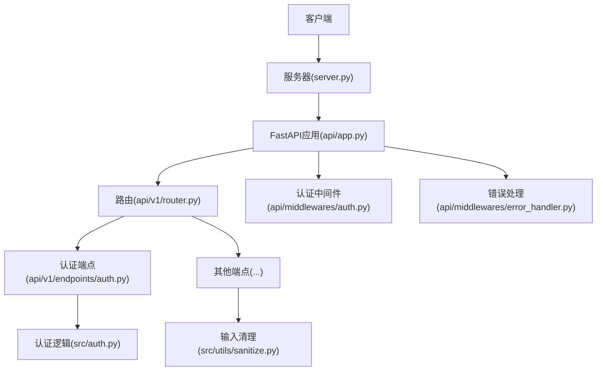
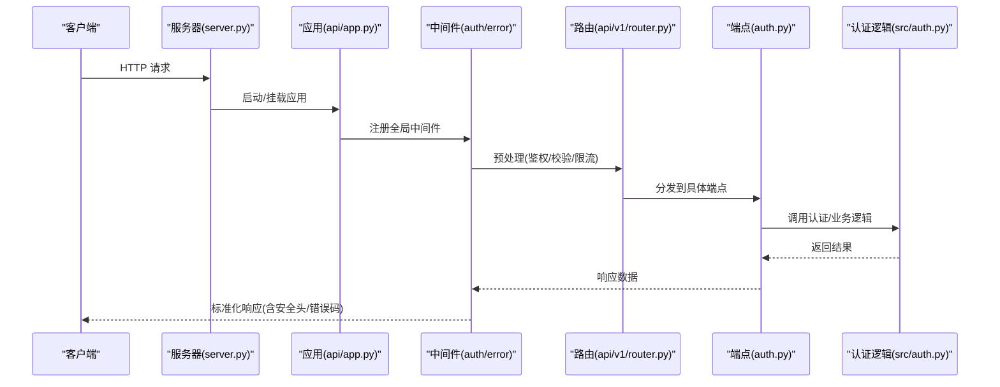
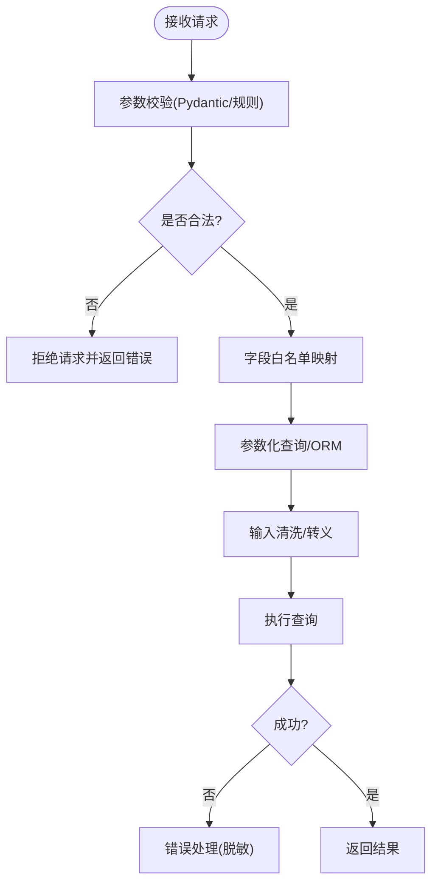
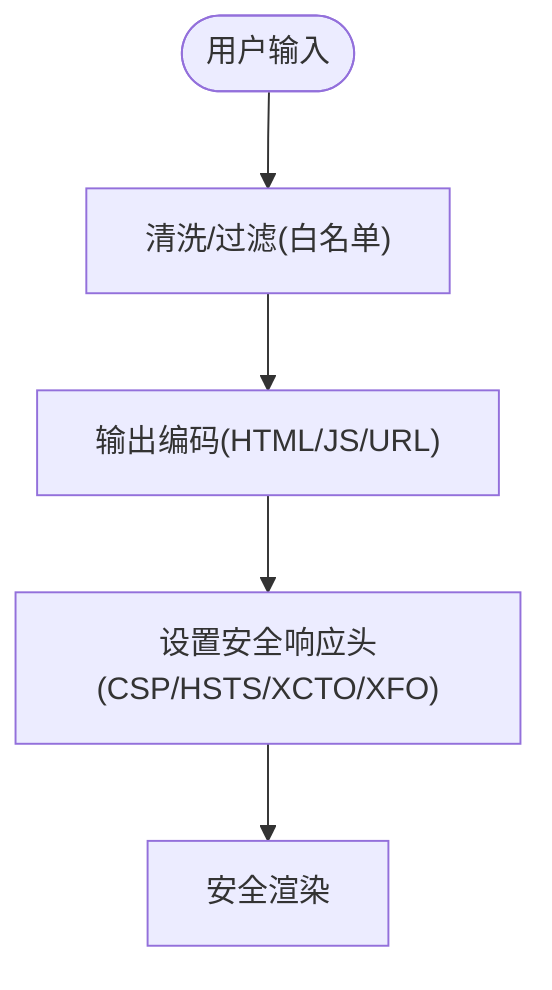
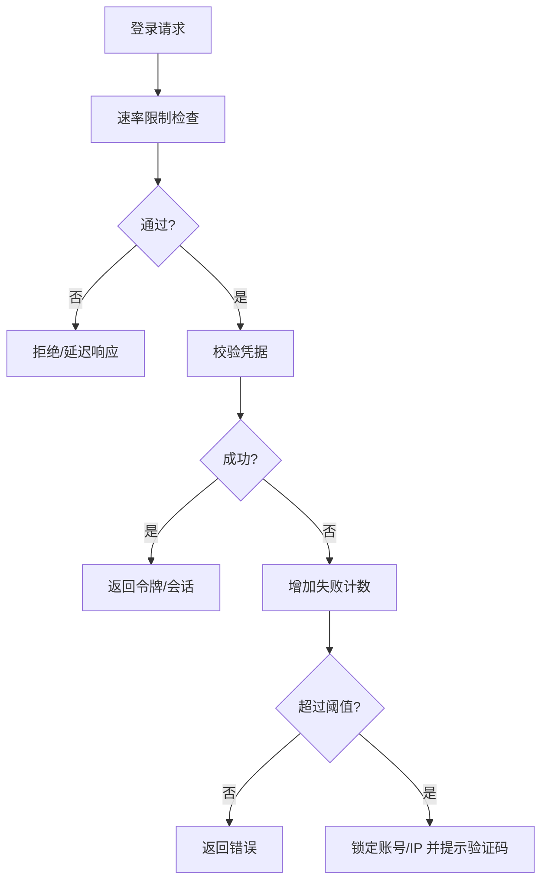
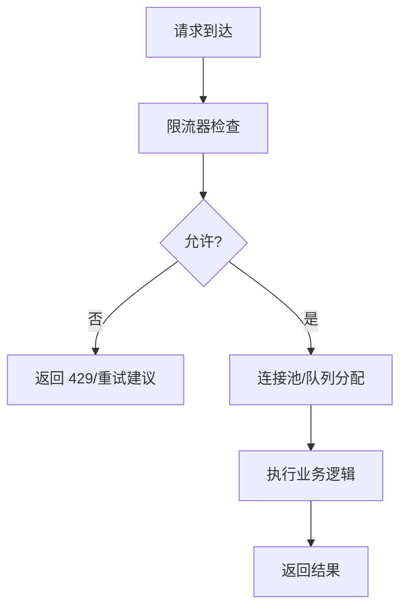
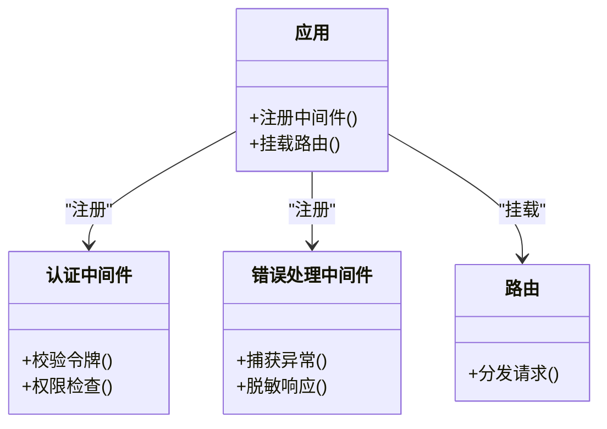
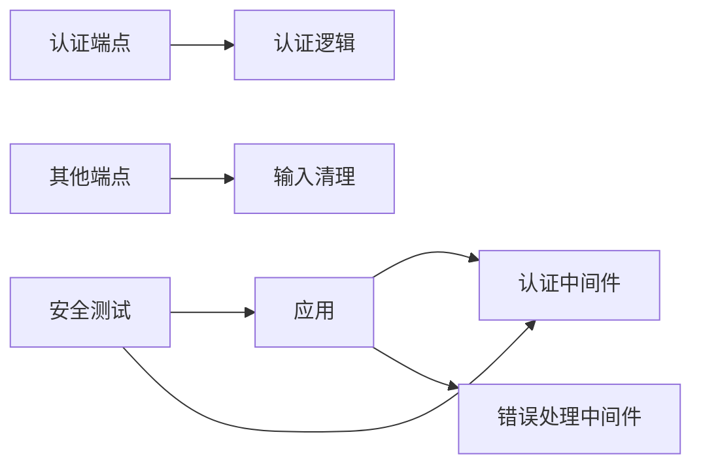

# 攻击检测与防护

<cite>
**本文引用的文件**   
- [api/app.py](file://api/app.py)
- [api/middlewares/auth.py](file://api/middlewares/auth.py)
- [api/middlewares/error_handler.py](file://api/middlewares/error_handler.py)
- [api/v1/router.py](file://api/v1/router.py)
- [api/v1/endpoints/auth.py](file://api/v1/endpoints/auth.py)
- [src/auth.py](file://src/auth.py)
- [src/utils/sanitize.py](file://src/utils/sanitize.py)
- [tests/test_cwe345_xff_bypass.py](file://tests/test_cwe345_xff_bypass.py)
- [tests/test_api_app_cors.py](file://tests/test_api_app_cors.py)
- [server.py](file://server.py)
</cite>

## 目录
1. [简介](#简介)
2. [项目结构](#项目结构)
3. [核心组件](#核心组件)
4. [架构总览](#架构总览)
5. [详细组件分析](#详细组件分析)
6. [依赖关系分析](#依赖关系分析)
7. [性能考虑](#性能考虑)
8. [故障排查指南](#故障排查指南)
9. [结论](#结论)
10. [附录](#附录)

## 简介
本文件面向 Daily Stock Analysis 项目的安全加固，聚焦以下目标：
- SQL 注入检测与防护：参数验证、查询白名单、输入过滤
- XSS 防护：输出编码、内容安全策略（CSP）、脚本拦截
- 暴力破解识别：登录失败计数、IP 封禁、验证码机制
- DDoS 防护：请求限流、连接池管理、资源限制
- 安全中间件配置：CORS、CSRF 保护、请求验证
- 攻击模拟测试与安全加固建议

说明：本文基于仓库中现有代码与测试进行归纳，未发现的实现将给出“待增强”建议与落地路径。

## 项目结构
后端 API 采用模块化路由与中间件组织，安全相关能力主要分布在：
- 应用入口与全局中间件注册
- 认证与鉴权中间件
- 错误处理中间件
- 认证端点与业务端点
- 通用工具（如输入清理）
- 安全相关测试用例

图表来源 
- [server.py](file://server.py)
- [api/app.py](file://api/app.py)
- [api/v1/router.py](file://api/v1/router.py)
- [api/v1/endpoints/auth.py](file://api/v1/endpoints/auth.py)
- [api/middlewares/auth.py](file://api/middlewares/auth.py)
- [api/middlewares/error_handler.py](file://api/middlewares/error_handler.py)
- [src/auth.py](file://src/auth.py)
- [src/utils/sanitize.py](file://src/utils/sanitize.py)

章节来源
- [server.py](file://server.py)
- [api/app.py](file://api/app.py)
- [api/v1/router.py](file://api/v1/router.py)

## 核心组件
- 认证与鉴权中间件：负责会话/令牌校验、权限控制、访问审计
- 错误处理中间件：统一异常捕获、敏感信息脱敏、标准化响应
- 认证端点：登录、登出、状态检查等接口
- 输入清理工具：对输入进行规范化与危险字符过滤
- 安全测试：针对 X-Forwarded-For 绕过、CORS 行为等进行验证

章节来源
- [api/middlewares/auth.py](file://api/middlewares/auth.py)
- [api/middlewares/error_handler.py](file://api/middlewares/error_handler.py)
- [api/v1/endpoints/auth.py](file://api/v1/endpoints/auth.py)
- [src/auth.py](file://src/auth.py)
- [src/utils/sanitize.py](file://src/utils/sanitize.py)

## 架构总览
下图展示请求从进入服务器到经过中间件、路由、端点处理的完整链路，并标注安全相关节点。

图表来源 
- [server.py](file://server.py)
- [api/app.py](file://api/app.py)
- [api/middlewares/auth.py](file://api/middlewares/auth.py)
- [api/middlewares/error_handler.py](file://api/middlewares/error_handler.py)
- [api/v1/router.py](file://api/v1/router.py)
- [api/v1/endpoints/auth.py](file://api/v1/endpoints/auth.py)
- [src/auth.py](file://src/auth.py)

## 详细组件分析

### SQL 注入检测与防护
- 参数验证：所有入参应通过 Pydantic 模型或等价校验器进行类型、长度、格式校验；对数值型字段严格限定范围，避免字符串拼接进查询
- 查询白名单：数据库操作使用参数化查询或 ORM；禁止动态拼接 SQL；如需动态排序/分页，仅允许白名单字段名映射
- 输入过滤：对文本类输入执行清洗与转义，移除危险字符与标签；对富文本场景启用白名单 HTML 过滤
- 日志与审计：记录可疑模式（如常见注入关键字），但不记录敏感值

图表来源 
- [api/v1/endpoints/auth.py](file://api/v1/endpoints/auth.py)
- [src/utils/sanitize.py](file://src/utils/sanitize.py)

章节来源
- [src/utils/sanitize.py](file://src/utils/sanitize.py)

### XSS 防护
- 输出编码：对所有用户可控数据进行上下文相关的编码（HTML/JS/CSS/URL）
- 内容安全策略（CSP）：在响应头中设置 CSP，限制脚本来源、内联脚本与 eval 使用
- 脚本拦截：前端渲染层禁用危险 API，后端对富文本进行白名单过滤
- 安全头：启用 HSTS、X-Content-Type-Options、X-Frame-Options 等

[本节为概念性流程，不直接对应具体文件]

### 暴力破解识别
- 登录失败计数：对同一账号/IP 的失败次数进行统计，超过阈值触发临时锁定
- IP 封禁：对高频恶意来源实施短期封禁或降权
- 验证码机制：在多次失败后要求人机验证，降低自动化攻击成功率
- 速率限制：对认证接口进行限流，防止字典攻击

[本节为概念性流程，不直接对应具体文件]

### DDoS 防护
- 请求限流：按 IP/用户维度限制 QPS/并发，超限返回 429
- 连接池管理：合理设置数据库/外部服务连接池大小与超时，避免资源耗尽
- 资源限制：限制请求体大小、超时时间、最大并发任务数
- 健康检查与熔断：对下游依赖进行熔断与降级，保障核心功能可用

[本节为概念性流程，不直接对应具体文件]

### 安全中间件配置
- CORS：明确允许的源、方法、头部，禁用通配符在生产环境
- CSRF：对写操作启用 CSRF Token 校验
- 请求验证：统一校验 Content-Type、长度、签名等
- 错误处理：统一错误响应格式，屏蔽堆栈与内部细节

图表来源 
- [api/app.py](file://api/app.py)
- [api/middlewares/auth.py](file://api/middlewares/auth.py)
- [api/middlewares/error_handler.py](file://api/middlewares/error_handler.py)
- [api/v1/router.py](file://api/v1/router.py)

章节来源
- [api/app.py](file://api/app.py)
- [api/middlewares/auth.py](file://api/middlewares/auth.py)
- [api/middlewares/error_handler.py](file://api/middlewares/error_handler.py)
- [api/v1/router.py](file://api/v1/router.py)

## 依赖关系分析
- 认证端点依赖认证逻辑模块，用于生成/验证令牌与会话
- 中间件依赖应用生命周期进行注册与卸载
- 输入清理工具被各端点复用，确保一致的输入处理策略
- 测试覆盖关键安全点（如 X-Forwarded-For 绕过、CORS 行为）

图表来源 
- [api/v1/endpoints/auth.py](file://api/v1/endpoints/auth.py)
- [src/auth.py](file://src/auth.py)
- [api/app.py](file://api/app.py)
- [api/middlewares/auth.py](file://api/middlewares/auth.py)
- [api/middlewares/error_handler.py](file://api/middlewares/error_handler.py)
- [src/utils/sanitize.py](file://src/utils/sanitize.py)
- [tests/test_cwe345_xff_bypass.py](file://tests/test_cwe345_xff_bypass.py)
- [tests/test_api_app_cors.py](file://tests/test_api_app_cors.py)

章节来源
- [tests/test_cwe345_xff_bypass.py](file://tests/test_cwe345_xff_bypass.py)
- [tests/test_api_app_cors.py](file://tests/test_api_app_cors.py)

## 性能考虑
- 限流算法选择：令牌桶/滑动窗口适合高吞吐场景，注意内存占用
- 连接池调优：根据 CPU/IO 特性调整池大小与超时，避免过多上下文切换
- 缓存策略：对热点只读数据启用缓存，减少数据库压力
- 监控与告警：对延迟、错误率、限流命中进行观测与告警

[本节提供通用指导，不直接分析具体文件]

## 故障排查指南
- 认证失败：检查令牌有效期、签名校验、会话存储一致性
- 跨域问题：核对 CORS 配置与实际请求头，确认生产环境禁用通配符
- 注入风险：定位未参数化的查询与动态拼接点，补充白名单与清洗
- XSS 问题：审查输出编码位置与 CSP 策略，确认富文本过滤生效
- 限流误伤：检查限流键设计（IP/用户/租户），避免共享键导致误判

章节来源
- [api/middlewares/auth.py](file://api/middlewares/auth.py)
- [api/middlewares/error_handler.py](file://api/middlewares/error_handler.py)
- [tests/test_api_app_cors.py](file://tests/test_api_app_cors.py)
- [tests/test_cwe345_xff_bypass.py](file://tests/test_cwe345_xff_bypass.py)

## 结论
当前项目在认证、错误处理与基础输入清理方面具备良好基础，建议在以下方面持续强化：
- 全面引入参数化查询与字段白名单，杜绝 SQL 拼接
- 完善 CSP 与输出编码策略，覆盖富文本与模板渲染
- 建立统一的速率限制与暴力破解防护机制
- 细化连接池与资源限制，提升抗 DDoS 能力
- 扩展安全测试覆盖度，纳入回归与 CI 门禁

[本节总结性内容，不直接分析具体文件]

## 附录
- 安全加固清单
  - 参数化查询与 ORM 优先
  - 输入白名单与最小权限原则
  - 统一错误响应与敏感信息脱敏
  - 全站 HTTPS 与强加密套件
  - 定期依赖漏洞扫描与更新
- 攻击模拟建议
  - 注入：尝试常见注入载荷与边界条件
  - XSS：注入脚本、事件处理器与编码变体
  - 暴力破解：高频失败与验证码绕过
  - DDoS：突发流量与慢速攻击

[本节为通用建议，不直接分析具体文件]