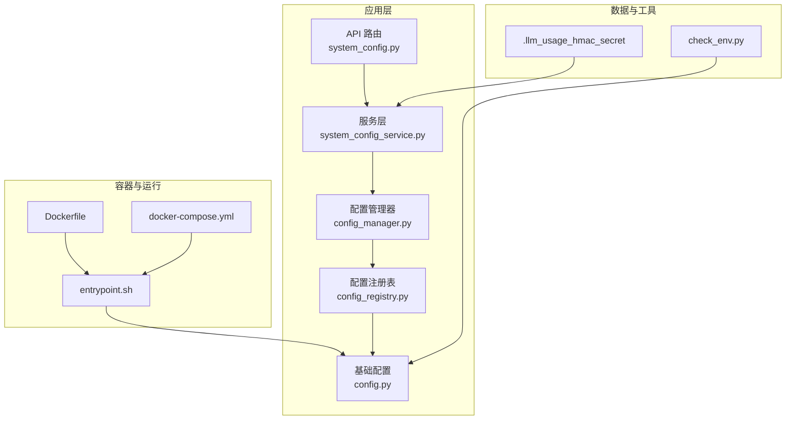

# 安全配置管理

<cite>
**本文引用的文件**   
- [src/config.py](file://src/config.py)
- [src/core/config_manager.py](file://src/core/config_manager.py)
- [src/core/config_registry.py](file://src/core/config_registry.py)
- [api/v1/endpoints/system_config.py](file://api/v1/endpoints/system_config.py)
- [api/v1/schemas/system_config.py](file://api/v1/schemas/system_config.py)
- [src/services/system_config_service.py](file://src/services/system_config_service.py)
- [docker/Dockerfile](file://docker/Dockerfile)
- [docker/docker-compose.yml](file://docker/docker-compose.yml)
- [docker/entrypoint.sh](file://docker/entrypoint.sh)
- [data/.llm_usage_hmac_secret](file://data/.llm_usage_hmac_secret)
- [scripts/check_env.py](file://scripts/check_env.py)
- [tests/test_config_manager.py](file://tests/test_config_manager.py)
- [tests/test_config_validate_structured.py](file://tests/test_config_validate_structured.py)
- [tests/test_cwe345_xff_bypass.py](file://tests/test_cwe345_xff_bypass.py)
- [tests/test_api_app_cors.py](file://tests/test_api_app_cors.py)
</cite>

## 目录
1. [简介](#简介)
2. [项目结构](#项目结构)
3. [核心组件](#核心组件)
4. [架构总览](#架构总览)
5. [详细组件分析](#详细组件分析)
6. [依赖关系分析](#依赖关系分析)
7. [性能考虑](#性能考虑)
8. [故障排查指南](#故障排查指南)
9. [结论](#结论)
10. [附录](#附录)

## 简介
本文件面向 Daily Stock Analysis 的安全配置管理，围绕环境变量、密钥与敏感信息管理、加密与安全参数、配置文件安全、部署环境安全以及最佳实践进行系统化说明。目标是帮助开发者与运维人员以最小权限、可审计、可回滚的方式完成安全配置落地，并满足生产环境的合规要求。

## 项目结构
Daily Stock Analysis 将配置与安全相关能力集中在以下位置：
- 配置加载与校验：src/config.py、src/core/config_manager.py、src/core/config_registry.py
- 系统配置 API 与数据模型：api/v1/endpoints/system_config.py、api/v1/schemas/system_config.py、src/services/system_config_service.py
- 容器化与启动脚本：docker/Dockerfile、docker/docker-compose.yml、docker/entrypoint.sh
- 敏感信息示例与工具：data/.llm_usage_hmac_secret、scripts/check_env.py
- 测试用例（覆盖配置验证、CORS、XFF 绕过等）：tests/*

**图表来源** 
- [api/v1/endpoints/system_config.py](file://api/v1/endpoints/system_config.py)
- [src/services/system_config_service.py](file://src/services/system_config_service.py)
- [src/core/config_manager.py](file://src/core/config_manager.py)
- [src/core/config_registry.py](file://src/core/config_registry.py)
- [src/config.py](file://src/config.py)
- [docker/Dockerfile](file://docker/Dockerfile)
- [docker/docker-compose.yml](file://docker/docker-compose.yml)
- [docker/entrypoint.sh](file://docker/entrypoint.sh)
- [data/.llm_usage_hmac_secret](file://data/.llm_usage_hmac_secret)
- [scripts/check_env.py](file://scripts/check_env.py)

**章节来源**
- [src/config.py](file://src/config.py)
- [src/core/config_manager.py](file://src/core/config_manager.py)
- [src/core/config_registry.py](file://src/core/config_registry.py)
- [api/v1/endpoints/system_config.py](file://api/v1/endpoints/system_config.py)
- [api/v1/schemas/system_config.py](file://api/v1/schemas/system_config.py)
- [src/services/system_config_service.py](file://src/services/system_config_service.py)
- [docker/Dockerfile](file://docker/Dockerfile)
- [docker/docker-compose.yml](file://docker/docker-compose.yml)
- [docker/entrypoint.sh](file://docker/entrypoint.sh)
- [data/.llm_usage_hmac_secret](file://data/.llm_usage_hmac_secret)
- [scripts/check_env.py](file://scripts/check_env.py)

## 核心组件
- 配置加载与校验
  - 基础配置定义与默认值：src/config.py
  - 配置管理器：集中读取、合并、缓存与热更新能力：src/core/config_manager.py
  - 配置注册表：按命名空间/模块注册配置项，便于校验与发现：src/core/config_registry.py
- 系统配置 API
  - 路由与鉴权：api/v1/endpoints/system_config.py
  - 请求/响应模型与校验：api/v1/schemas/system_config.py
  - 业务编排与持久化：src/services/system_config_service.py
- 容器与启动
  - 镜像构建与运行时注入：docker/Dockerfile、docker/docker-compose.yml
  - 启动前检查与环境准备：docker/entrypoint.sh
- 敏感信息与工具
  - HMAC 密钥示例：data/.llm_usage_hmac_secret
  - 环境检查脚本：scripts/check_env.py

**章节来源**
- [src/config.py](file://src/config.py)
- [src/core/config_manager.py](file://src/core/config_manager.py)
- [src/core/config_registry.py](file://src/core/config_registry.py)
- [api/v1/endpoints/system_config.py](file://api/v1/endpoints/system_config.py)
- [api/v1/schemas/system