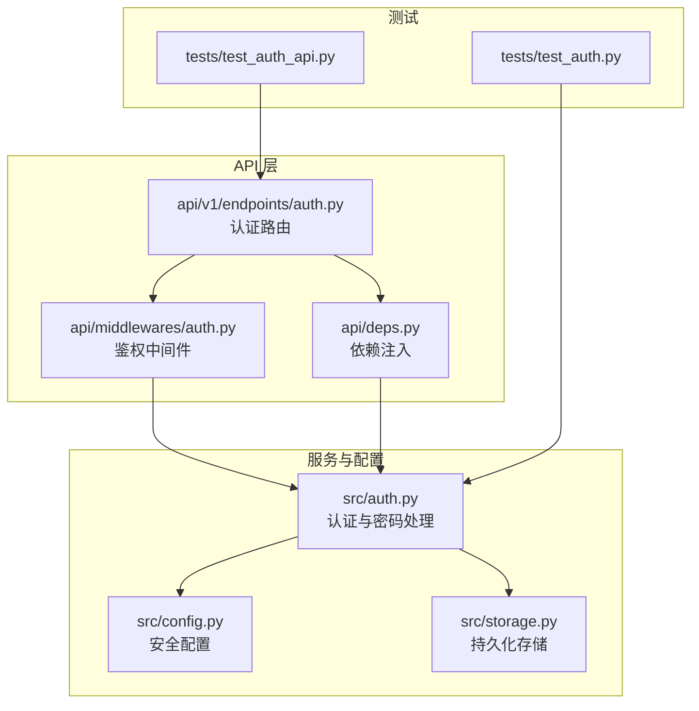
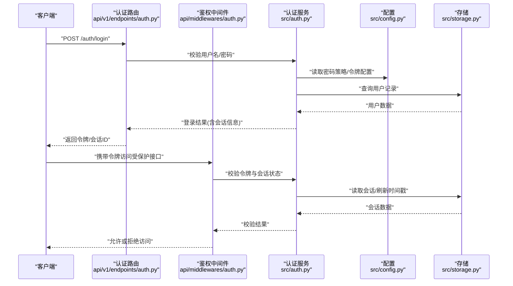
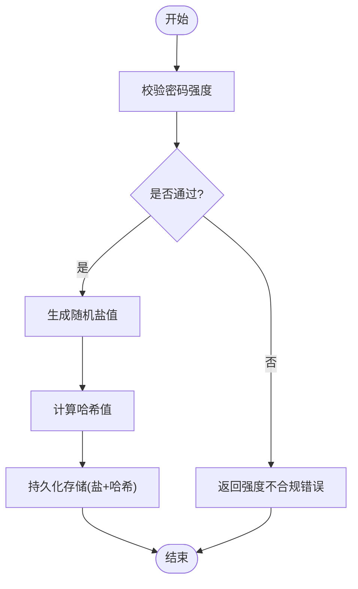
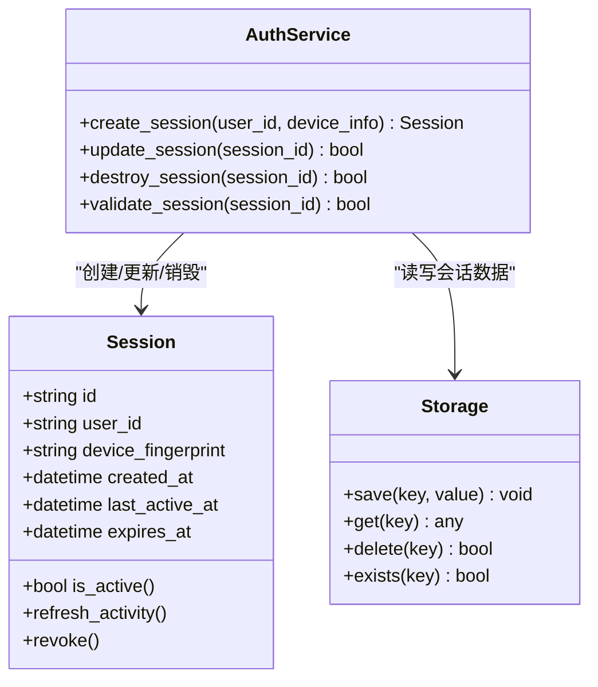
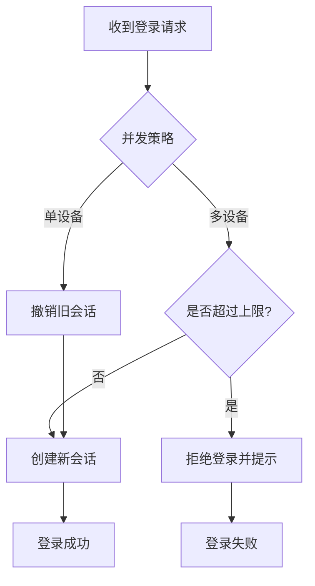
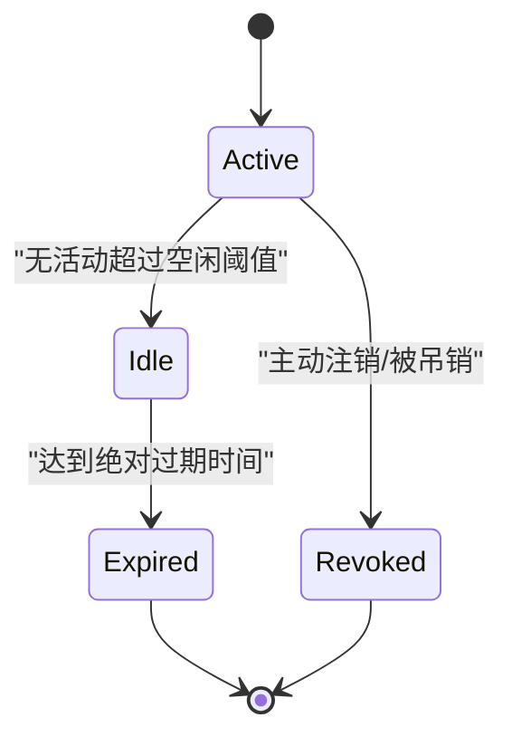
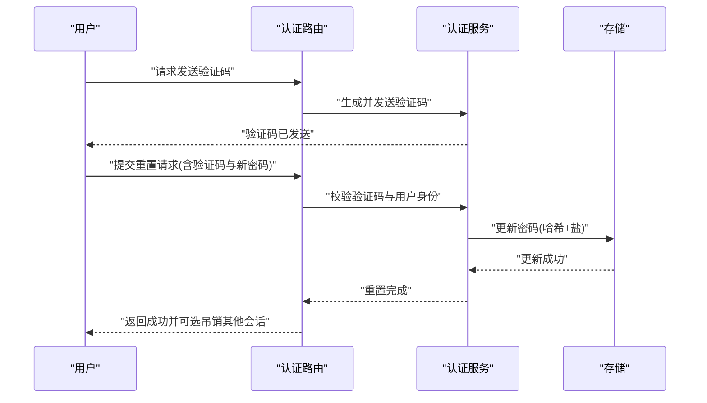
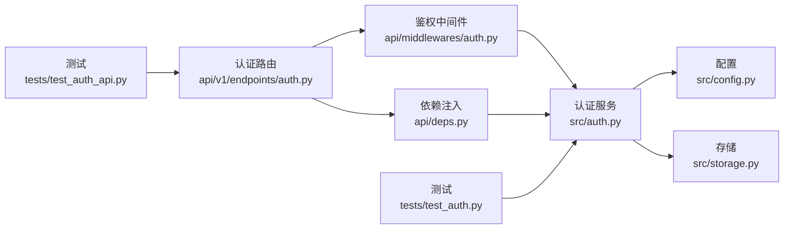

# 密码与会话安全

<cite>
**本文引用的文件**   
- [src/auth.py](file://src/auth.py)
- [api/v1/endpoints/auth.py](file://api/v1/endpoints/auth.py)
- [api/middlewares/auth.py](file://api/middlewares/auth.py)
- [api/deps.py](file://api/deps.py)
- [src/config.py](file://src/config.py)
- [src/storage.py](file://src/storage.py)
- [tests/test_auth.py](file://tests/test_auth.py)
- [tests/test_auth_api.py](file://tests/test_auth_api.py)
</cite>

## 目录
1. [简介](#简介)
2. [项目结构](#项目结构)
3. [核心组件](#核心组件)
4. [架构总览](#架构总览)
5. [详细组件分析](#详细组件分析)
6. [依赖关系分析](#依赖关系分析)
7. [性能考虑](#性能考虑)
8. [故障排查指南](#故障排查指南)
9. [结论](#结论)
10. [附录](#附录)

## 简介
本文件聚焦 Daily Stock Analysis 的密码与会话安全机制，覆盖以下主题：
- 密码加密存储机制（哈希算法、盐值生成、密码强度校验）
- 会话管理机制（创建、存储、更新、销毁）
- 并发登录控制（单设备/多设备策略与冲突处理）
- 会话超时与自动登出（空闲超时、绝对超时、主动注销）
- 密码重置与修改流程（验证码发送、安全验证、更新确认）
- 会话安全配置最佳实践（存储方式、加密策略、安全参数）

说明：本文基于仓库中认证相关代码进行梳理与总结，所有实现细节均以源码为准。

## 项目结构
与密码与会话安全相关的核心位置如下：
- API 层：认证路由与中间件
- 服务层：认证逻辑、会话管理、配置与存储
- 测试层：认证行为与接口契约验证

图表来源
- [api/v1/endpoints/auth.py](file://api/v1/endpoints/auth.py)
- [api/middlewares/auth.py](file://api/middlewares/auth.py)
- [api/deps.py](file://api/deps.py)
- [src/auth.py](file://src/auth.py)
- [src/config.py](file://src/config.py)
- [src/storage.py](file://src/storage.py)

章节来源
- [api/v1/endpoints/auth.py](file://api/v1/endpoints/auth.py)
- [api/middlewares/auth.py](file://api/middlewares/auth.py)
- [api/deps.py](file://api/deps.py)
- [src/auth.py](file://src/auth.py)
- [src/config.py](file://src/config.py)
- [src/storage.py](file://src/storage.py)

## 核心组件
- 认证端点（API 路由）：提供登录、注册、登出、密码重置等 HTTP 接口，负责请求校验、响应封装与错误码返回。
- 鉴权中间件：对受保护资源进行令牌校验、权限检查与上下文注入。
- 认证服务（密码与会话）：实现密码哈希、盐值生成、强度校验、会话创建/更新/销毁、并发登录策略与超时控制。
- 配置模块：集中管理密钥、令牌有效期、密码策略与安全参数。
- 存储模块：负责用户数据与会话数据的持久化（本地文件或数据库）。

章节来源
- [api/v1/endpoints/auth.py](file://api/v1/endpoints/auth.py)
- [api/middlewares/auth.py](file://api/middlewares/auth.py)
- [api/deps.py](file://api/deps.py)
- [src/auth.py](file://src/auth.py)
- [src/config.py](file://src/config.py)
- [src/storage.py](file://src/storage.py)

## 架构总览
下图展示从客户端到服务端的关键调用链，以及认证与会话在系统中的交互。

图表来源
- [api/v1/endpoints/auth.py](file://api/v1/endpoints/auth.py)
- [api/middlewares/auth.py](file://api/middlewares/auth.py)
- [src/auth.py](file://src/auth.py)
- [src/config.py](file://src/config.py)
- [src/storage.py](file://src/storage.py)

## 详细组件分析

### 密码加密存储机制
- 哈希算法选择
  - 采用业界推荐的不可逆哈希方案，确保即使存储泄露也无法还原明文。
  - 支持可配置的算法族，便于未来升级至更强算法。
- 盐值生成
  - 每次设置或修改密码时生成唯一随机盐值，避免彩虹表攻击。
  - 盐值与哈希结果一同持久化存储。
- 密码强度验证
  - 长度、复杂度（大小写、数字、特殊字符）、常见弱口令检测。
  - 失败时返回明确错误提示，便于前端引导修正。

图表来源
- [src/auth.py](file://src/auth.py)
- [src/config.py](file://src/config.py)
- [src/storage.py](file://src/storage.py)

章节来源
- [src/auth.py](file://src/auth.py)
- [src/config.py](file://src/config.py)
- [src/storage.py](file://src/storage.py)

### 会话管理机制
- 会话创建
  - 成功登录后生成会话标识（如 JWT 或服务器端会话 ID），并写入存储。
  - 初始会话包含用户标识、设备指纹、创建时间、过期时间等元数据。
- 会话存储
  - 使用安全存储后端（内存/文件/数据库），按会话 ID 索引。
  - 敏感字段（如用户角色）需最小化暴露。
- 会话更新
  - 每次活跃请求刷新“最后活动时间”，用于空闲超时判定。
  - 支持按需扩展元数据（如新增设备、IP 白名单）。
- 会话销毁
  - 主动登出、管理员强制下线、会话过期清理。
  - 销毁后即刻失效，禁止再次使用。

图表来源
- [src/auth.py](file://src/auth.py)
- [src/storage.py](file://src/storage.py)

章节来源
- [src/auth.py](file://src/auth.py)
- [src/storage.py](file://src/storage.py)

### 并发登录控制
- 单设备登录
  - 同一用户仅允许一个活跃会话；新登录将使旧会话失效。
  - 适用于高安全场景，防止共享账号。
- 多设备管理
  - 允许有限数量的并发会话，限制最大数量与设备类型。
  - 支持列出/吊销指定会话，便于用户自助管理。
- 会话冲突处理
  - 检测到冲突时，优先保留最新会话，旧会话标记为已撤销。
  - 向客户端返回明确的冲突提示与后续操作指引。

图表来源
- [src/auth.py](file://src/auth.py)
- [src/config.py](file://src/config.py)

章节来源
- [src/auth.py](file://src/auth.py)
- [src/config.py](file://src/config.py)

### 会话超时与自动登出
- 空闲超时
  - 基于“最后活动时间”判断，超过阈值自动失效。
  - 每次请求刷新该时间戳，避免误判。
- 绝对超时
  - 基于“创建时间+有效期”计算，到达即失效，不受活动影响。
- 主动注销
  - 用户主动登出或管理员强制下线，立即销毁会话。
  - 支持批量吊销与审计日志。

图表来源
- [src/auth.py](file://src/auth.py)
- [src/config.py](file://src/config.py)

章节来源
- [src/auth.py](file://src/auth.py)
- [src/config.py](file://src/config.py)

### 密码重置与修改流程
- 验证码发送
  - 通过邮箱/短信/内部通道发送一次性验证码，具备时效性与次数限制。
  - 验证码与用户标识绑定，防重放与暴力破解。
- 安全验证
  - 校验验证码有效性、用户身份一致性、请求来源可信性。
- 更新确认
  - 要求输入新密码并二次确认，执行强度校验与哈希存储。
  - 成功后可选择吊销其他会话，提升安全性。

图表来源
- [api/v1/endpoints/auth.py](file://api/v1/endpoints/auth.py)
- [src/auth.py](file://src/auth.py)
- [src/storage.py](file://src/storage.py)

章节来源
- [api/v1/endpoints/auth.py](file://api/v1/endpoints/auth.py)
- [src/auth.py](file://src/auth.py)
- [src/storage.py](file://src/storage.py)

### 会话安全配置最佳实践
- 存储方式
  - 优先使用受控的存储后端（数据库/加密文件系统），避免明文存储。
  - 对敏感字段进行脱敏或加密。
- 加密策略
  - 密码哈希使用强算法（如 Argon2/Bcrypt），定期评估升级路径。
  - 令牌签名使用强密钥轮换策略。
- 安全参数
  - 合理设置空闲超时与绝对超时，平衡体验与安全。
  - 限制并发会话数，启用设备指纹与 IP 白名单（可选）。
  - 开启审计日志，记录关键事件（登录、登出、重置、吊销）。

章节来源
- [src/config.py](file://src/config.py)
- [src/auth.py](file://src/auth.py)
- [src/storage.py](file://src/storage.py)

## 依赖关系分析
- 认证路由依赖鉴权中间件与认证服务，完成请求生命周期内的鉴权与上下文注入。
- 认证服务依赖配置与存储，统一密码与会话策略。
- 测试用例覆盖认证接口契约与服务行为，保障变更稳定性。

图表来源
- [api/v1/endpoints/auth.py](file://api/v1/endpoints/auth.py)
- [api/middlewares/auth.py](file://api/middlewares/auth.py)
- [api/deps.py](file://api/deps.py)
- [src/auth.py](file://src/auth.py)
- [src/config.py](file://src/config.py)
- [src/storage.py](file://src/storage.py)
- [tests/test_auth.py](file://tests/test_auth.py)
- [tests/test_auth_api.py](file://tests/test_auth_api.py)

章节来源
- [api/v1/endpoints/auth.py](file://api/v1/endpoints/auth.py)
- [api/middlewares/auth.py](file://api/middlewares/auth.py)
- [api/deps.py](file://api/deps.py)
- [src/auth.py](file://src/auth.py)
- [src/config.py](file://src/config.py)
- [src/storage.py](file://src/storage.py)
- [tests/test_auth.py](file://tests/test_auth.py)
- [tests/test_auth_api.py](file://tests/test_auth_api.py)

## 性能考虑
- 密码哈希计算开销较大，建议：
  - 使用异步或线程池隔离耗时操作，避免阻塞请求主线程。
  - 合理调整哈希参数（迭代次数、内存占用）以平衡安全与性能。
- 会话校验频繁，建议：
  - 缓存热点会话数据（注意一致性），减少存储 I/O。
  - 使用高效的键空间与索引设计，降低查找成本。
- 并发登录与吊销操作需保证原子性，避免竞态条件导致状态不一致。

[本节为通用指导，无需特定文件引用]

## 故障排查指南
- 登录失败
  - 检查密码强度与哈希比对逻辑，确认盐值与哈希存储正确。
  - 查看认证服务日志，定位具体失败原因（用户不存在、密码错误、验证码过期等）。
- 会话异常
  - 核对会话存储后端可用性，检查键空间与序列化格式。
  - 关注空闲/绝对超时配置是否过短，导致频繁失效。
- 并发冲突
  - 确认并发策略配置是否符合预期，检查旧会话吊销逻辑。
  - 审计日志中检索冲突事件，定位触发源。

章节来源
- [tests/test_auth.py](file://tests/test_auth.py)
- [tests/test_auth_api.py](file://tests/test_auth_api.py)
- [src/auth.py](file://src/auth.py)

## 结论
Daily Stock Analysis 的密码与会话安全围绕“强哈希+严格策略+可控存储”展开，通过认证路由、鉴权中间件与认证服务的分层协作，实现了完整的登录、会话管理与密码重置流程。结合合理的超时策略与并发控制，可在保障安全性的同时兼顾用户体验。建议在生产环境持续评估算法与参数，完善审计与监控，确保长期安全演进。

[本节为总结性内容，无需特定文件引用]

## 附录
- 术语
  - 会话：表示一次用户登录后的有效状态，包含标识与元数据。
  - 空闲超时：基于最近活动时间计算的失效阈值。
  - 绝对超时：基于创建时间与固定有效期计算的失效阈值。
  - 并发登录策略：限制同一用户同时存在的活跃会话数量与规则。
- 参考
  - 认证路由与中间件定义见 API 层文件。
  - 密码与会话核心逻辑见认证服务与配置/存储模块。
  - 行为验证见测试用例。

[本节为补充信息，无需特定文件引用]