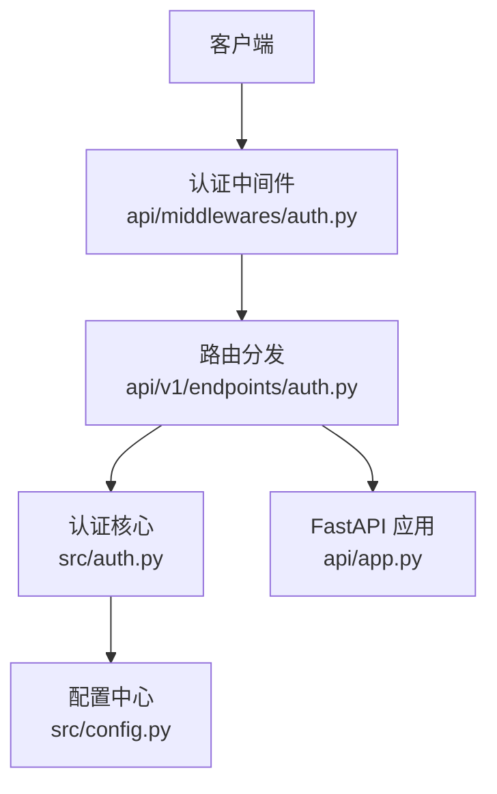
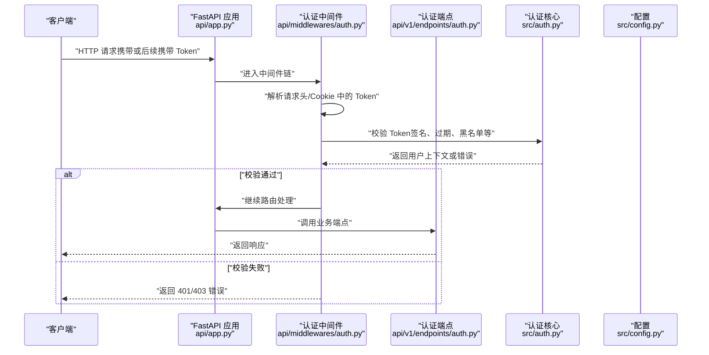
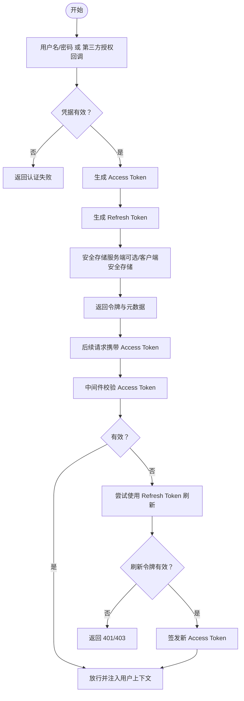
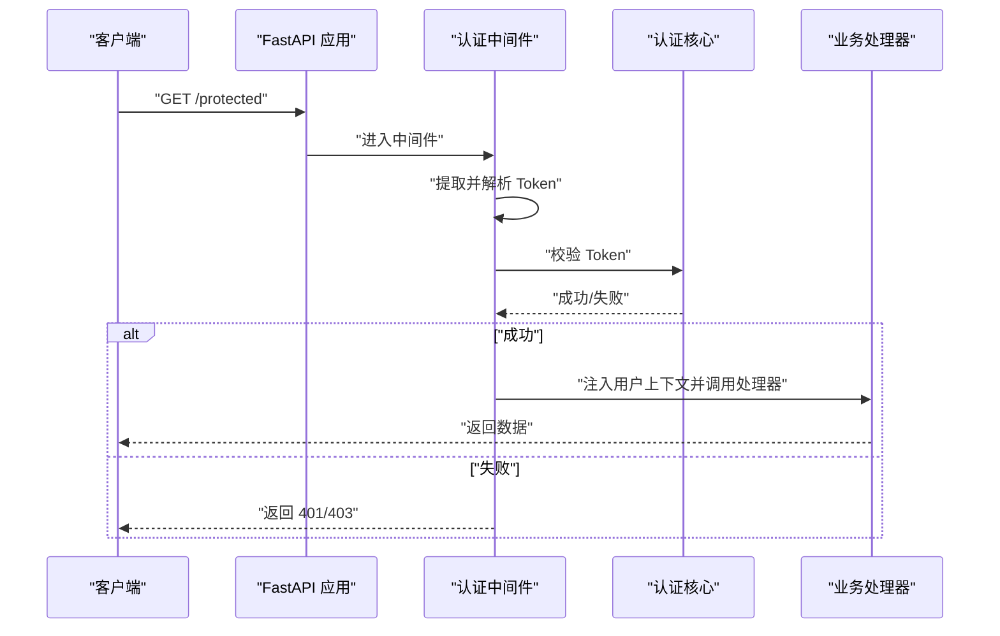
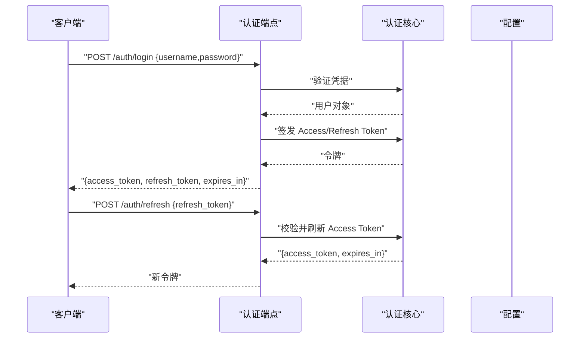
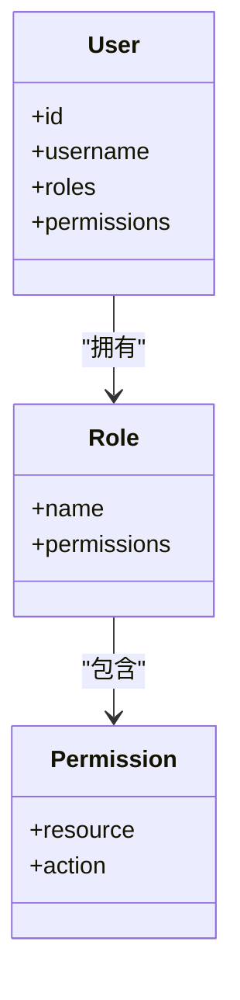
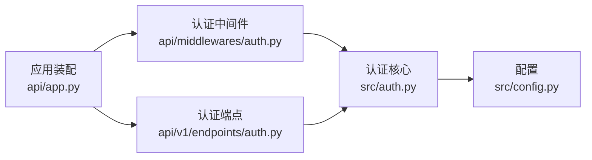

# 认证机制

<cite>
**本文引用的文件**   
- [src/auth.py](file://src/auth.py)
- [api/middlewares/auth.py](file://api/middlewares/auth.py)
- [api/v1/endpoints/auth.py](file://api/v1/endpoints/auth.py)
- [api/app.py](file://api/app.py)
- [src/config.py](file://src/config.py)
- [tests/test_auth.py](file://tests/test_auth.py)
- [tests/test_auth_api.py](file://tests/test_auth_api.py)
</cite>

## 目录
1. [简介](#简介)
2. [项目结构](#项目结构)
3. [核心组件](#核心组件)
4. [架构总览](#架构总览)
5. [详细组件分析](#详细组件分析)
6. [依赖关系分析](#依赖关系分析)
7. [性能考虑](#性能考虑)
8. [故障排查指南](#故障排查指南)
9. [结论](#结论)
10. [附录](#附录)

## 简介
本文件系统性梳理 Daily Stock Analysis 的认证机制，覆盖 JWT 令牌的生成、验证与刷新流程，令牌结构与过期时间管理，安全存储建议；用户登录认证流程（用户名/密码、第三方登录集成、会话管理）；权限控制模型（角色定义、权限分配、访问控制策略）；API 中间件的认证检查机制（请求拦截、令牌验证、错误处理）；以及认证配置最佳实践（密钥管理、令牌加密与安全参数设置）。文档同时给出常见错误的处理与用户反馈建议。

## 项目结构
认证相关代码主要分布在以下位置：
- 后端认证核心逻辑：src/auth.py
- API 中间件（请求拦截与鉴权）：api/middlewares/auth.py
- 认证相关接口实现：api/v1/endpoints/auth.py
- FastAPI 应用装配与中间件注册：api/app.py
- 配置项（含认证相关环境变量）：src/config.py
- 认证功能测试用例：tests/test_auth.py、tests/test_auth_api.py

**图表来源**
- [api/middlewares/auth.py](file://api/middlewares/auth.py)
- [api/v1/endpoints/auth.py](file://api/v1/endpoints/auth.py)
- [src/auth.py](file://src/auth.py)
- [src/config.py](file://src/config.py)
- [api/app.py](file://api/app.py)

**章节来源**
- [src/auth.py](file://src/auth.py)
- [api/middlewares/auth.py](file://api/middlewares/auth.py)
- [api/v1/endpoints/auth.py](file://api/v1/endpoints/auth.py)
- [api/app.py](file://api/app.py)
- [src/config.py](file://src/config.py)

## 核心组件
- 认证核心模块（JWT 签发、校验、刷新）：src/auth.py
- 认证中间件（统一拦截、解析、校验、注入上下文）：api/middlewares/auth.py
- 认证端点（登录、登出、刷新、状态查询等）：api/v1/endpoints/auth.py
- 应用装配（中间件注册、全局错误处理、CORS 等）：api/app.py
- 配置管理（密钥、算法、过期时间、白名单等）：src/config.py
- 测试（行为验证、边界条件、异常路径）：tests/test_auth.py、tests/test_auth_api.py

**章节来源**
- [src/auth.py](file://src/auth.py)
- [api/middlewares/auth.py](file://api/middlewares/auth.py)
- [api/v1/endpoints/auth.py](file://api/v1/endpoints/auth.py)
- [api/app.py](file://api/app.py)
- [src/config.py](file://src/config.py)
- [tests/test_auth.py](file://tests/test_auth.py)
- [tests/test_auth_api.py](file://tests/test_auth_api.py)

## 架构总览
下图展示从客户端发起受保护请求到服务端完成认证与鉴权的整体流程。

**图表来源**
- [api/app.py](file://api/app.py)
- [api/middlewares/auth.py](file://api/middlewares/auth.py)
- [api/v1/endpoints/auth.py](file://api/v1/endpoints/auth.py)
- [src/auth.py](file://src/auth.py)
- [src/config.py](file://src/config.py)

## 详细组件分析

### 认证核心（JWT 签发、校验、刷新）
- 职责
  - 生成访问令牌（Access Token）与刷新令牌（Refresh Token）
  - 校验令牌签名、有效期、撤销列表（如使用）
  - 基于刷新令牌签发新访问令牌
  - 提供用户上下文构建（如角色、权限集合）
- 关键要点
  - 令牌结构：包含用户标识、角色、权限、签发时间、过期时间等声明
  - 过期策略：短生命周期 Access Token + 长生命周期 Refresh Token
  - 安全存储：服务端不持久化敏感信息（除非需要撤销），客户端安全存储（HttpOnly Cookie 或内存）
  - 算法与密钥：对称或非对称算法，密钥轮换支持
- 流程图（令牌签发与刷新）

**图表来源**
- [src/auth.py](file://src/auth.py)
- [api/v1/endpoints/auth.py](file://api/v1/endpoints/auth.py)

**章节来源**
- [src/auth.py](file://src/auth.py)
- [api/v1/endpoints/auth.py](file://api/v1/endpoints/auth.py)

### 认证中间件（请求拦截、令牌验证、错误处理）
- 职责
  - 统一拦截受保护路由的请求
  - 从请求头/Cookie 提取并解析令牌
  - 调用认证核心进行校验，失败时返回标准错误码
  - 将用户上下文注入到请求上下文中供后续处理器使用
- 关键点
  - 白名单路由（如健康检查、公开接口）跳过校验
  - 错误分类：未认证（401）、无权限（403）、令牌格式错误、过期等
  - 日志记录：脱敏记录关键信息便于审计与排障
- 序列图（受保护请求处理）

**图表来源**
- [api/middlewares/auth.py](file://api/middlewares/auth.py)
- [src/auth.py](file://src/auth.py)

**章节来源**
- [api/middlewares/auth.py](file://api/middlewares/auth.py)
- [src/auth.py](file://src/auth.py)

### 认证端点（登录、登出、刷新、状态）
- 登录
  - 用户名/密码：校验凭据，签发 Access/Refresh Token
  - 第三方登录：对接 OAuth/OIDC 回调，建立本地会话并签发令牌
- 登出
  - 使当前 Refresh Token 失效（若支持撤销）
  - 清除客户端存储（前端负责）
- 刷新
  - 使用 Refresh Token 换取新的 Access Token
- 状态
  - 返回当前用户信息与权限集合（用于前端渲染）
- 序列图（登录与刷新）

**图表来源**
- [api/v1/endpoints/auth.py](file://api/v1/endpoints/auth.py)
- [src/auth.py](file://src/auth.py)

**章节来源**
- [api/v1/endpoints/auth.py](file://api/v1/endpoints/auth.py)
- [src/auth.py](file://src/auth.py)

### 应用装配（中间件注册与全局错误处理）
- 作用
  - 注册认证中间件到 FastAPI 应用
  - 配置 CORS、静态资源、全局异常映射
  - 暴露健康检查与系统配置接口（通常无需认证）
- 关键点
  - 中间件顺序：认证应在日志、压缩等之后，在路由之前
  - 全局错误：统一返回结构化错误体，便于前端处理

**章节来源**
- [api/app.py](file://api/app.py)

### 配置管理（认证相关环境变量）
- 典型配置项
  - 密钥（SECRET_KEY/JWT_SECRET）
  - 算法（ALGORITHM，如 HS256/RS256）
  - 过期时间（ACCESS_TOKEN_EXPIRE_MINUTES、REFRESH_TOKEN_EXPIRE_DAYS）
  - 白名单路由（OPEN_ROUTES）
  - 第三方登录配置（OAuth 客户端 ID/Secret、回调地址）
- 最佳实践
  - 通过环境变量注入，避免硬编码
  - 生产环境启用强随机密钥与最小权限原则
  - 定期轮换密钥并兼容旧令牌过渡期

**章节来源**
- [src/config.py](file://src/config.py)

### 权限控制模型（角色、权限、访问控制）
- 角色定义
  - 管理员、分析师、普通用户等角色
- 权限分配
  - 基于角色的访问控制（RBAC），用户继承角色权限
- 访问控制策略
  - 路由级装饰器或中间件内判断角色/权限
  - 资源级细粒度控制（如仅允许查看自身数据）
- 类图（概念性）

[本图为概念性说明，不对应具体源码结构]

**章节来源**
- [src/auth.py](file://src/auth.py)
- [api/middlewares/auth.py](file://api/middlewares/auth.py)

## 依赖关系分析
- 模块耦合
  - 中间件依赖认证核心与配置
  - 端点依赖认证核心与配置
  - 应用装配依赖中间件与端点
- 外部依赖
  - JWT 库（如 PyJWT）
  - 哈希库（如 bcrypt/passlib）
  - 第三方 OAuth/OIDC 客户端（可选）

**图表来源**
- [src/auth.py](file://src/auth.py)
- [src/config.py](file://src/config.py)
- [api/middlewares/auth.py](file://api/middlewares/auth.py)
- [api/v1/endpoints/auth.py](file://api/v1/endpoints/auth.py)
- [api/app.py](file://api/app.py)

**章节来源**
- [src/auth.py](file://src/auth.py)
- [src/config.py](file://src/config.py)
- [api/middlewares/auth.py](file://api/middlewares/auth.py)
- [api/v1/endpoints/auth.py](file://api/v1/endpoints/auth.py)
- [api/app.py](file://api/app.py)

## 性能考虑
- 令牌校验开销
  - 优先使用对称算法（HS256）提升性能；非对称场景按需切换
  - 缓存用户上下文（短期内存缓存）减少重复计算
- 并发与限流
  - 对登录与刷新接口实施速率限制，防止暴力破解
- 存储优化
  - 刷新令牌撤销表（如需）采用高效键值存储（Redis）
- 网络优化
  - 合理设置 Access Token 过期时间，降低刷新频率

[本节为通用指导，不直接分析具体文件]

## 故障排查指南
- 常见问题
  - 401 未认证：Token 缺失、格式错误或已过期
  - 403 无权限：用户角色/权限不足
  - 刷新失败：Refresh Token 无效或被撤销
- 排查步骤
  - 检查请求头/Cookie 中是否携带正确 Token
  - 核对服务器时间与客户端时间同步
  - 查看认证核心日志与中间件日志
  - 验证配置项（密钥、算法、过期时间、白名单）
- 用户反馈
  - 明确错误类型与修复建议（如重新登录、检查网络）
  - 提供重试与降级策略（如离线模式提示）

**章节来源**
- [api/middlewares/auth.py](file://api/middlewares/auth.py)
- [src/auth.py](file://src/auth.py)
- [tests/test_auth.py](file://tests/test_auth.py)
- [tests/test_auth_api.py](file://tests/test_auth_api.py)

## 结论
Daily Stock Analysis 的认证机制以 JWT 为核心，结合中间件统一拦截与校验，配合清晰的端点设计与配置管理，实现了高可用、可扩展且安全的认证体系。通过短生命周期的 Access Token 与长生命周期的 Refresh Token 组合，既保障安全性又兼顾用户体验。权限模型采用 RBAC，便于扩展与维护。建议在部署时严格管理密钥与算法，启用速率限制与审计日志，持续优化性能与可观测性。

[本节为总结性内容，不直接分析具体文件]

## 附录
- 最佳实践清单
  - 使用强随机密钥与合适的算法
  - 合理设置令牌过期时间
  - 安全存储令牌（HttpOnly Cookie 或内存）
  - 启用速率限制与异常监控
  - 定期轮换密钥并制定回滚方案
- 参考测试
  - 单元测试覆盖登录、刷新、权限校验等路径
  - 端到端测试验证中间件与端点协作

**章节来源**
- [tests/test_auth.py](file://tests/test_auth.py)
- [tests/test_auth_api.py](file://tests/test_auth_api.py)