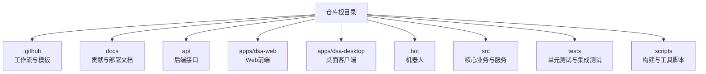
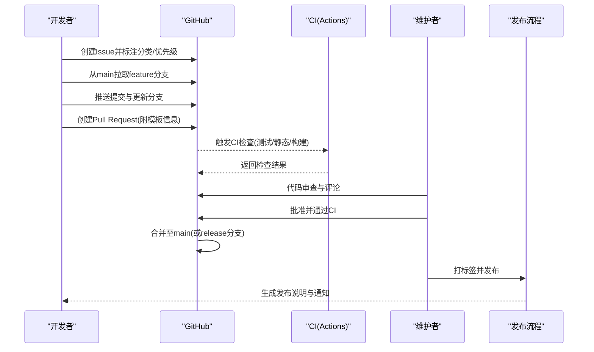
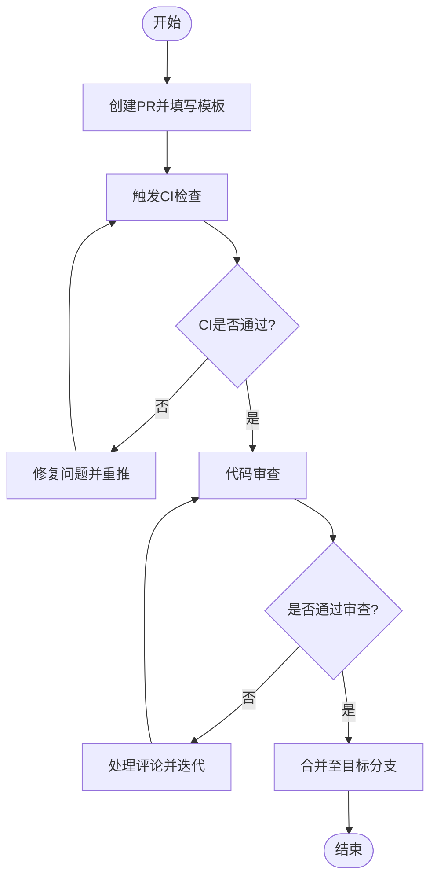
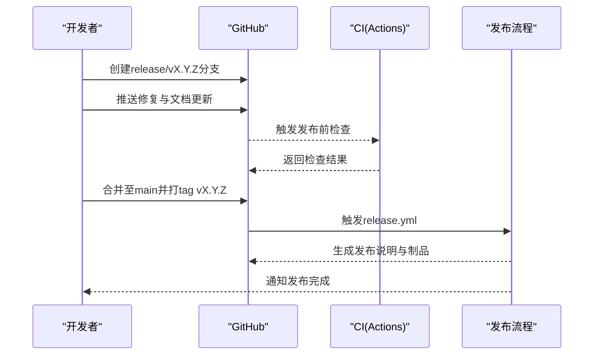
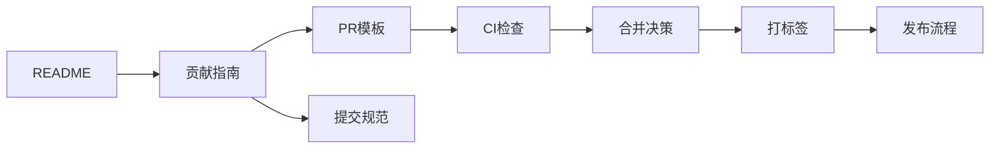

# Git工作流程

<cite>
**本文引用的文件**   
- [CONTRIBUTING.md](file://docs/CONTRIBUTING.md)
- [PULL_REQUEST_TEMPLATE.md](file://.github/PULL_REQUEST_TEMPLATE.md)
- [release.yml](file://.github/release.yml)
- [copilot-instructions.md](file://.github/copilot-instructions.md)
- [SKILL.md](file://SKILL.md)
- [AGENTS.md](file://AGENTS.md)
- [README.md](file://README.md)
</cite>

## 目录
1. [简介](#简介)
2. [项目结构](#项目结构)
3. [核心组件](#核心组件)
4. [架构总览](#架构总览)
5. [详细组件分析](#详细组件分析)
6. [依赖关系分析](#依赖关系分析)
7. [性能考虑](#性能考虑)
8. [故障排查指南](#故障排查指南)
9. [结论](#结论)
10. [附录](#附录)

## 简介
本指南面向Daily Stock Analysis项目的协作开发，聚焦Git工作流程与规范。内容涵盖分支管理策略（主分支保护、功能分支命名、合并策略）、Issue创建与管理（分类、标签、优先级）、Pull Request流程（代码审查、CI检查、合并条件）、提交信息规范（commit message格式、变更日志维护）、协作最佳实践（冲突解决、同步策略）以及版本发布与标签管理规范。目标是让新成员快速上手，同时保障主干稳定与交付质量。

## 项目结构
仓库根目录包含API、前端Web、桌面端、Bot、数据源、服务层、测试与文档等模块。与Git工作流直接相关的配置集中在以下位置：
- .github/workflows：持续集成与发布流水线
- .github/PULL_REQUEST_TEMPLATE.md：PR模板
- docs/CONTRIBUTING.md：贡献指南
- .github/release.yml：发布相关配置
- .github/copilot-instructions.md：AI辅助说明
- SKILL.md / AGENTS.md：技能与Agent使用说明
- README.md：项目概览与入口

**章节来源**
- [README.md](file://README.md)
- [CONTRIBUTING.md](file://docs/CONTRIBUTING.md)
- [PULL_REQUEST_TEMPLATE.md](file://.github/PULL_REQUEST_TEMPLATE.md)
- [release.yml](file://.github/release.yml)
- [copilot-instructions.md](file://.github/copilot-instructions.md)
- [SKILL.md](file://SKILL.md)
- [AGENTS.md](file://AGENTS.md)

## 核心组件
- 分支模型：以main为受保护主干，feature/*作为功能分支，hotfix/*用于紧急修复，release/*用于预发布。
- Issue管理：通过GitHub Issues进行问题跟踪，使用标签进行分类与优先级标记。
- Pull Request：基于模板驱动，强制代码审查与CI检查通过后合并。
- 提交规范：采用约定式提交（Conventional Commits），便于自动生成变更日志与版本。
- CI/CD：GitHub Actions执行测试、静态检查与构建；release.yml驱动发布流程。
- 文档与规范：贡献指南、PR模板、Copilot指令、技能与Agent说明共同构成协作基线。

**章节来源**
- [CONTRIBUTING.md](file://docs/CONTRIBUTING.md)
- [PULL_REQUEST_TEMPLATE.md](file://.github/PULL_REQUEST_TEMPLATE.md)
- [release.yml](file://.github/release.yml)
- [copilot-instructions.md](file://.github/copilot-instructions.md)
- [SKILL.md](file://SKILL.md)
- [AGENTS.md](file://AGENTS.md)

## 架构总览
下图展示从Issue到PR、再到合并与发布的端到端工作流，体现分支、审查、CI与发布之间的关系。

**图表来源**
- [release.yml](file://.github/release.yml)
- [PULL_REQUEST_TEMPLATE.md](file://.github/PULL_REQUEST_TEMPLATE.md)
- [CONTRIBUTING.md](file://docs/CONTRIBUTING.md)

## 详细组件分析

### 分支管理策略
- 主分支保护
  - main为受保护分支，禁止直接推送；所有变更必须通过PR合并。
  - 建议启用状态检查（CI）与至少一名维护者审批。
- 功能分支命名
  - feature/<issue编号>-<简短描述>，例如 feature/123-add-algorithm。
  - 保持短小、可独立验证的增量。
- 热修复分支
  - hotfix/<issue编号>-<简短描述>，针对生产问题的快速修复。
- 发布分支
  - release/vX.Y.Z，用于冻结与回归测试，最终合并回main与develop（如存在）。
- 合并策略
  - 优先使用Squash Merge以保持历史整洁；或Rebase+Merge确保线性历史。
  - 合并前需通过CI且完成审查。

**章节来源**
- [CONTRIBUTING.md](file://docs/CONTRIBUTING.md)
- [PULL_REQUEST_TEMPLATE.md](file://.github/PULL_REQUEST_TEMPLATE.md)

### Issue创建与管理流程
- 分类
  - bug、feature、enhancement、docs、question、task等。
- 标签与优先级
  - 使用priority: P0/P1/P2/P3标识紧急程度；area: backend/frontend/bot/data等定位范围。
- 模板与必填项
  - 复现步骤、期望行为、实际行为、环境信息与截图/日志。
- 生命周期
  - New → In Progress → Review → Testing → Done；必要时添加blocked或wip标签。

**章节来源**
- [CONTRIBUTING.md](file://docs/CONTRIBUTING.md)

### Pull Request流程
- 模板要求
  - 变更概述、影响范围、自测结果、依赖变化、风险与回滚方案。
- 代码审查
  - 至少一名维护者审查；关注可读性、健壮性与一致性。
- CI检查
  - 单元测试、集成测试、静态检查、构建产物校验。
- 合并条件
  - 所有检查通过、审查通过、无未决评论；符合分支策略。

**图表来源**
- [PULL_REQUEST_TEMPLATE.md](file://.github/PULL_REQUEST_TEMPLATE.md)
- [CONTRIBUTING.md](file://docs/CONTRIBUTING.md)

**章节来源**
- [PULL_REQUEST_TEMPLATE.md](file://.github/PULL_REQUEST_TEMPLATE.md)
- [CONTRIBUTING.md](file://docs/CONTRIBUTING.md)

### 提交信息规范
- 格式
  - 类型: 标题（conventional commits），支持feat、fix、docs、style、refactor、test、chore等。
  - 正文：动机、变更点、影响范围、注意事项。
  - 尾注：关联Issue（Closes #xxx）、破坏性变更标记。
- 示例类型
  - feat: 新功能
  - fix: 缺陷修复
  - refactor: 重构
  - test: 测试相关
  - docs: 文档更新
  - chore: 构建/工具链
- 变更日志
  - 基于提交消息自动生成CHANGELOG；按类型分组，突出重要变更。

**章节来源**
- [CONTRIBUTING.md](file://docs/CONTRIBUTING.md)

### 协作开发最佳实践
- 冲突解决
  - 频繁rebase/merge上游分支；在本地先解决冲突再推送。
  - 大改动拆分为多个小PR，降低冲突概率。
- 代码同步
  - 每日至少一次同步main；跨模块依赖变更时提前沟通。
- 审查文化
  - 小而精的PR更易审查；提供清晰的上下文与自测证据。
- 安全与合规
  - 不提交敏感信息；遵循许可证与第三方依赖规范。

**章节来源**
- [CONTRIBUTING.md](file://docs/CONTRIBUTING.md)

### 版本发布流程与标签管理
- 版本号
  - 语义化版本：主版本.次版本.修订号（MAJOR.MINOR.PATCH）。
- 发布分支
  - 从main创建release/vX.Y.Z，进行回归测试与修复。
- 标签与发布说明
  - 打tag vX.Y.Z；自动生成发布说明（基于提交消息与PR）。
- 自动化
  - GitHub Actions触发构建与发布；上传制品与通知渠道。

**图表来源**
- [release.yml](file://.github/release.yml)

**章节来源**
- [release.yml](file://.github/release.yml)
- [CONTRIBUTING.md](file://docs/CONTRIBUTING.md)

## 依赖关系分析
- 工作流依赖
  - PR模板驱动审查与CI；release.yml驱动发布。
- 文档依赖
  - CONTRIBUTING.md定义规范；README提供入口与背景。
- 工具依赖
  - Copilot指令辅助编码与审查；SKILL/AGENTS指导Agent能力边界。

**图表来源**
- [PULL_REQUEST_TEMPLATE.md](file://.github/PULL_REQUEST_TEMPLATE.md)
- [release.yml](file://.github/release.yml)
- [CONTRIBUTING.md](file://docs/CONTRIBUTING.md)
- [README.md](file://README.md)

**章节来源**
- [PULL_REQUEST_TEMPLATE.md](file://.github/PULL_REQUEST_TEMPLATE.md)
- [release.yml](file://.github/release.yml)
- [CONTRIBUTING.md](file://docs/CONTRIBUTING.md)
- [README.md](file://README.md)

## 性能考虑
- 小步快跑：拆分PR减少审查与CI时间。
- 选择性运行：按需跳过无关测试（谨慎使用）。
- 缓存依赖：利用CI缓存加速安装与构建。
- 并行任务：将测试与构建并行化，缩短流水线时长。

[本节为通用建议，不直接分析具体文件]

## 故障排查指南
- CI失败
  - 查看日志定位错误；确认依赖与环境；最小化复现。
- 审查阻塞
  - 明确阻塞原因；补充证据；必要时升级讨论。
- 发布异常
  - 检查release.yml与权限；验证tag与分支状态；回滚策略准备。

**章节来源**
- [CONTRIBUTING.md](file://docs/CONTRIBUTING.md)
- [release.yml](file://.github/release.yml)

## 结论
通过规范的分支管理、Issue与PR流程、提交信息与CI/CD自动化，Daily Stock Analysis项目在协作效率与交付质量上具备坚实基础。建议持续完善模板与规则，结合AI辅助提升审查与文档质量，确保主干稳定与快速迭代。

[本节为总结，不直接分析具体文件]

## 附录
- 参考文档
  - 贡献指南：docs/CONTRIBUTING.md
  - PR模板：.github/PULL_REQUEST_TEMPLATE.md
  - 发布配置：.github/release.yml
  - AI辅助：.github/copilot-instructions.md
  - 技能与Agent：SKILL.md、AGENTS.md
  - 项目概览：README.md

**章节来源**
- [CONTRIBUTING.md](file://docs/CONTRIBUTING.md)
- [PULL_REQUEST_TEMPLATE.md](file://.github/PULL_REQUEST_TEMPLATE.md)
- [release.yml](file://.github/release.yml)
- [copilot-instructions.md](file://.github/copilot-instructions.md)
- [SKILL.md](file://SKILL.md)
- [AGENTS.md](file://AGENTS.md)
- [README.md](file://README.md)