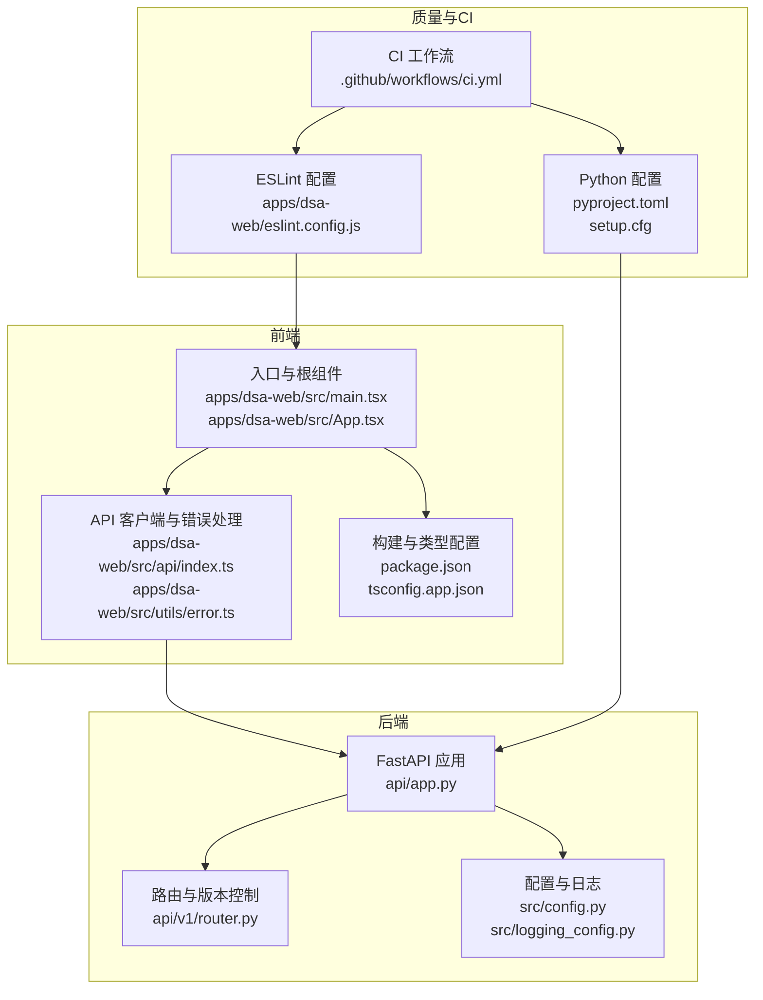
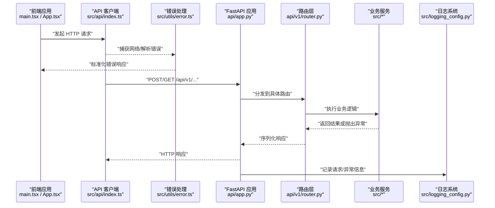
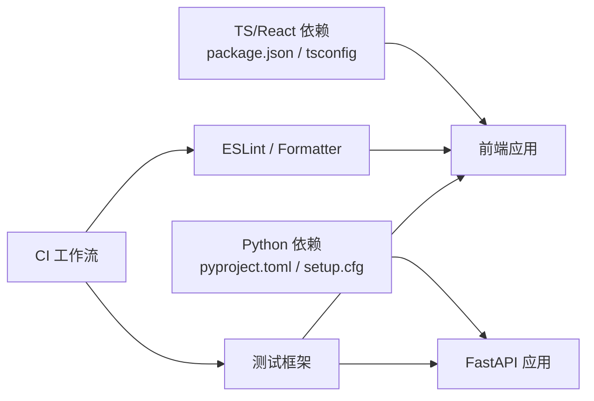

# 代码规范

<cite>
**本文引用的文件**   
- [pyproject.toml](file://pyproject.toml)
- [setup.cfg](file://setup.cfg)
- [.github/workflows/ci.yml](file://.github/workflows/ci.yml)
- [api/app.py](file://api/app.py)
- [api/v1/router.py](file://api/v1/router.py)
- [src/config.py](file://src/config.py)
- [src/logging_config.py](file://src/logging_config.py)
- [apps/dsa-web/eslint.config.js](file://apps/dsa-web/eslint.config.js)
- [apps/dsa-web/package.json](file://apps/dsa-web/package.json)
- [apps/dsa-web/tsconfig.app.json](file://apps/dsa-web/tsconfig.app.json)
- [apps/dsa-web/src/App.tsx](file://apps/dsa-web/src/App.tsx)
- [apps/dsa-web/src/main.tsx](file://apps/dsa-web/src/main.tsx)
- [apps/dsa-web/src/api/index.ts](file://apps/dsa-web/src/api/index.ts)
- [apps/dsa-web/src/utils/error.ts](file://apps/dsa-web/src/utils/error.ts)
- [tests/conftest.py](file://tests/conftest.py)
</cite>

## 目录
1. [简介](#简介)
2. [项目结构](#项目结构)
3. [核心组件](#核心组件)
4. [架构总览](#架构总览)
5. [详细组件分析](#详细组件分析)
6. [依赖分析](#依赖分析)
7. [性能考虑](#性能考虑)
8. [故障排查指南](#故障排查指南)
9. [结论](#结论)
10. [附录](#附录)

## 简介
本文件为 Daily Stock Analysis 项目的代码规范文档，覆盖 Python 与 TypeScript/React 两端的编码约定、格式化与静态检查配置、注释与 API 文档要求、以及代码审查清单与质量标准。目标是让不同背景的开发者都能快速上手并保持一致的代码质量与风格。

## 项目结构
本项目采用前后端分离的模块化结构：
- 后端（Python/FastAPI）：位于 api/ 与 src/，提供 RESTful API、领域服务、数据访问与工具库。
- 前端（TypeScript/React/Vite）：位于 apps/dsa-web/，包含页面、组件、状态管理、类型定义与测试。
- 工程化与质量保障：通过 pyproject.toml、setup.cfg、eslint.config.js、tsconfig.* 等配置文件统一格式化和检查规则；CI 流程在 .github/workflows 中编排。

**图示来源**
- [api/app.py](file://api/app.py)
- [api/v1/router.py](file://api/v1/router.py)
- [src/config.py](file://src/config.py)
- [src/logging_config.py](file://src/logging_config.py)
- [apps/dsa-web/src/main.tsx](file://apps/dsa-web/src/main.tsx)
- [apps/dsa-web/src/App.tsx](file://apps/dsa-web/src/App.tsx)
- [apps/dsa-web/src/api/index.ts](file://apps/dsa-web/src/api/index.ts)
- [apps/dsa-web/src/utils/error.ts](file://apps/dsa-web/src/utils/error.ts)
- [apps/dsa-web/package.json](file://apps/dsa-web/package.json)
- [apps/dsa-web/tsconfig.app.json](file://apps/dsa-web/tsconfig.app.json)
- [apps/dsa-web/eslint.config.js](file://apps/dsa-web/eslint.config.js)
- [pyproject.toml](file://pyproject.toml)
- [setup.cfg](file://setup.cfg)
- [.github/workflows/ci.yml](file://.github/workflows/ci.yml)

**章节来源**
- [pyproject.toml](file://pyproject.toml)
- [setup.cfg](file://setup.cfg)
- [.github/workflows/ci.yml](file://.github/workflows/ci.yml)

## 核心组件
- 后端 FastAPI 应用：集中式应用初始化、中间件注册、异常处理与路由挂载。
- 前端 React 应用：基于 Vite 构建，使用 ESLint + TypeScript 保证类型与风格一致性，集中式 API 客户端与错误处理。
- 质量与自动化：Python 侧通过 pyproject.toml/setup.cfg 统一工具链；前端通过 eslint.config.js 与 tsconfig 约束；CI 串联检查与测试。

**章节来源**
- [api/app.py](file://api/app.py)
- [api/v1/router.py](file://api/v1/router.py)
- [apps/dsa-web/src/App.tsx](file://apps/dsa-web/src/App.tsx)
- [apps/dsa-web/src/main.tsx](file://apps/dsa-web/src/main.tsx)
- [apps/dsa-web/src/api/index.ts](file://apps/dsa-web/src/api/index.ts)
- [apps/dsa-web/src/utils/error.ts](file://apps/dsa-web/src/utils/error.ts)
- [apps/dsa-web/eslint.config.js](file://apps/dsa-web/eslint.config.js)
- [apps/dsa-web/tsconfig.app.json](file://apps/dsa-web/tsconfig.app.json)
- [pyproject.toml](file://pyproject.toml)
- [setup.cfg](file://setup.cfg)

## 架构总览
下图展示请求从前端到后端的调用链路，以及错误处理与日志记录的关键节点。

**图示来源**
- [apps/dsa-web/src/main.tsx](file://apps/dsa-web/src/main.tsx)
- [apps/dsa-web/src/App.tsx](file://apps/dsa-web/src/App.tsx)
- [apps/dsa-web/src/api/index.ts](file://apps/dsa-web/src/api/index.ts)
- [apps/dsa-web/src/utils/error.ts](file://apps/dsa-web/src/utils/error.ts)
- [api/app.py](file://api/app.py)
- [api/v1/router.py](file://api/v1/router.py)
- [src/logging_config.py](file://src/logging_config.py)

## 详细组件分析

### Python 代码规范（PEP8、命名、函数与类设计）
- 命名约定
  - 模块/包：全小写，下划线分隔（如 data_provider）。
  - 类名：大驼峰（如 MarketAnalyzer）。
  - 函数/方法：小写下划线（如 fetch_stock_history）。
  - 常量：全大写+下划线（如 DEFAULT_TIMEOUT）。
- PEP8 基础
  - 行宽建议 88/120（以工具配置为准），缩进 4 空格，空行分隔逻辑块。
  - 导入顺序：标准库、第三方、本地模块，按字母排序。
- 函数与类设计原则
  - 单一职责：每个函数/类只做一件事。
  - 参数最小化：优先使用具名参数与默认值，避免可变默认参数。
  - 返回值明确：成功返回结构化数据，失败抛出异常或返回错误对象。
  - 可测试性：避免全局状态，尽量注入依赖。
- 异常与错误处理
  - 自定义异常分层：网络、数据、业务三类。
  - 统一错误码与消息，便于前端展示与日志追踪。
- 日志与配置
  - 集中式日志配置，区分级别与输出目标。
  - 配置项集中管理，支持环境变量覆盖。

**章节来源**
- [src/config.py](file://src/config.py)
- [src/logging_config.py](file://src/logging_config.py)
- [pyproject.toml](file://pyproject.toml)
- [setup.cfg](file://setup.cfg)

### TypeScript/React 代码规范（组件模式、状态管理与错误处理）
- 组件设计模式
  - 容器组件负责数据与逻辑，展示组件只关注 UI。
  - 组合优于继承，复用通过 props 与 hooks。
  - 组件拆分粒度：按功能域划分，保持单文件职责清晰。
- 状态管理
  - 局部状态用 useState/useReducer，跨组件状态用 Context 或轻量状态库。
  - 异步状态统一封装，避免分散的 loading/error 状态。
- 错误处理最佳实践
  - 网络请求统一拦截，标准化错误对象。
  - 用户可见的错误提示与兜底 UI。
  - 关键路径增加重试与降级策略。
- 类型与接口
  - 严格开启 strict 模式，避免 any。
  - 对外暴露的类型需稳定且文档化。

**章节来源**
- [apps/dsa-web/src/App.tsx](file://apps/dsa-web/src/App.tsx)
- [apps/dsa-web/src/main.tsx](file://apps/dsa-web/src/main.tsx)
- [apps/dsa-web/src/api/index.ts](file://apps/dsa-web/src/api/index.ts)
- [apps/dsa-web/src/utils/error.ts](file://apps/dsa-web/src/utils/error.ts)
- [apps/dsa-web/tsconfig.app.json](file://apps/dsa-web/tsconfig.app.json)

### 代码格式化与自动化工具配置
- Python
  - 使用 pyproject.toml 与 setup.cfg 统一 formatter/linter 配置（如 black、isort、flake8/ruff）。
  - 提交前运行格式化与检查，确保仓库一致性。
- TypeScript/React
  - ESLint 规则在 eslint.config.js 中集中管理，结合 Prettier 进行格式化。
  - TypeScript 编译选项在 tsconfig.app.json 中启用严格模式。
- 预提交钩子
  - 建议在 .pre-commit-config.yaml 中配置 pre-commit 钩子，统一执行 lint/format/test。
  - CI 中重复校验，防止不规范代码合并。

**章节来源**
- [pyproject.toml](file://pyproject.toml)
- [setup.cfg](file://setup.cfg)
- [apps/dsa-web/eslint.config.js](file://apps/dsa-web/eslint.config.js)
- [apps/dsa-web/tsconfig.app.json](file://apps/dsa-web/tsconfig.app.json)
- [.github/workflows/ci.yml](file://.github/workflows/ci.yml)

### 注释与文档编写规范
- Python docstring
  - 使用 Google/NumPy/Sphinx 风格之一，统一描述参数、返回值与异常。
  - 公共模块与类需提供模块级说明。
- API 文档
  - FastAPI 使用 Pydantic 模型与 OpenAPI 注解生成文档。
  - 字段需标注必填、默认值与示例。
- 前端文档
  - 组件 Props 使用 JSDoc 或 TypeScript 类型注释。
  - 复杂逻辑添加行内注释，解释“为什么”而非“是什么”。

**章节来源**
- [api/v1/router.py](file://api/v1/router.py)
- [apps/dsa-web/src/api/index.ts](file://apps/dsa-web/src/api/index.ts)

### 代码审查检查清单与质量标准
- 通用
  - 变更是否最小化？是否新增不必要的依赖？
  - 是否有单元测试/集成测试覆盖关键路径？
  - 错误处理是否完善，边界条件是否考虑？
- Python
  - 是否符合 PEP8 与工具链规则？
  - 异常是否分类清晰，日志是否充分？
  - 配置是否可外部化，敏感信息是否安全？
- TypeScript/React
  - 是否关闭 any，类型是否完整？
  - 组件是否可复用，状态是否合理拆分？
  - 错误提示是否友好，加载态是否一致？

**章节来源**
- [tests/conftest.py](file://tests/conftest.py)

## 依赖分析
- 后端依赖
  - FastAPI 作为 Web 框架，Pydantic 用于数据校验与序列化。
  - 日志与配置模块解耦，便于替换与扩展。
- 前端依赖
  - React + Vite 构建，ESLint + TypeScript 保证类型与风格。
  - API 客户端集中管理，错误处理统一。
- 质量与 CI
  - Python 与前端各自独立的质量门禁，CI 串联执行。

**图示来源**
- [pyproject.toml](file://pyproject.toml)
- [setup.cfg](file://setup.cfg)
- [apps/dsa-web/package.json](file://apps/dsa-web/package.json)
- [apps/dsa-web/tsconfig.app.json](file://apps/dsa-web/tsconfig.app.json)
- [apps/dsa-web/eslint.config.js](file://apps/dsa-web/eslint.config.js)
- [.github/workflows/ci.yml](file://.github/workflows/ci.yml)

**章节来源**
- [pyproject.toml](file://pyproject.toml)
- [setup.cfg](file://setup.cfg)
- [apps/dsa-web/package.json](file://apps/dsa-web/package.json)
- [apps/dsa-web/tsconfig.app.json](file://apps/dsa-web/tsconfig.app.json)
- [apps/dsa-web/eslint.config.js](file://apps/dsa-web/eslint.config.js)
- [.github/workflows/ci.yml](file://.github/workflows/ci.yml)

## 性能考虑
- 后端
  - 数据库查询去重与分页，避免 N+1。
  - 缓存热点数据，减少重复计算。
  - 异步 IO 与并发控制，避免阻塞。
- 前端
  - 组件懒加载与代码分割，减少首屏体积。
  - 列表虚拟化与增量更新，提升渲染性能。
  - 网络请求合并与防抖/节流。

[本节为通用指导，不直接分析具体文件]

## 故障排查指南
- 常见问题
  - 格式化不一致：运行本地格式化与 CI 对比差异。
  - 类型错误：开启严格模式，逐步消除 any。
  - 运行时异常：查看日志上下文与错误堆栈，定位调用链。
- 调试建议
  - 后端：增加结构化日志，关联请求 ID。
  - 前端：统一错误上报与用户提示，保留必要上下文。
  - 测试：补充失败用例，复现问题并回归验证。

**章节来源**
- [src/logging_config.py](file://src/logging_config.py)
- [apps/dsa-web/src/utils/error.ts](file://apps/dsa-web/src/utils/error.ts)

## 结论
通过统一的 Python 与 TypeScript/React 规范、严格的格式化与检查配置、完善的错误处理与日志体系，以及 CI 质量门禁，Daily Stock Analysis 项目在可维护性与协作效率上具备坚实基础。建议持续迭代规范与工具链，保持团队一致性与代码质量。

[本节为总结，不直接分析具体文件]

## 附录
- 推荐工具链
  - Python：black、isort、ruff/flake8、pytest。
  - 前端：ESLint、Prettier、TypeScript、Vitest/Jest。
- 常用命令
  - 本地格式化与检查：根据工具配置执行对应命令。
  - 运行测试：后端 pytest，前端 vitest/jest。
  - 启动开发服务器：后端 uvicorn/fastapi，前端 vite dev。

[本节为通用参考，不直接分析具体文件]