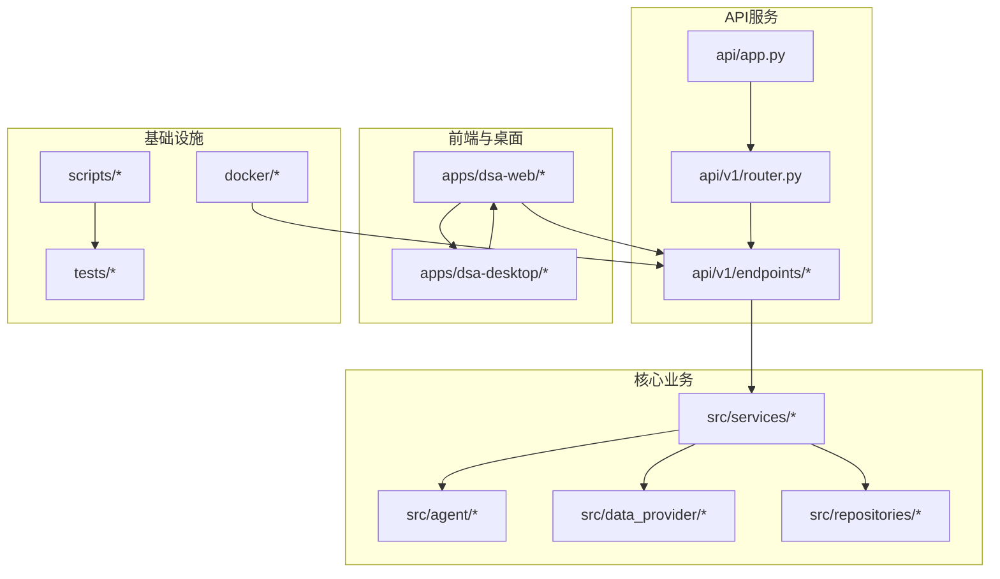
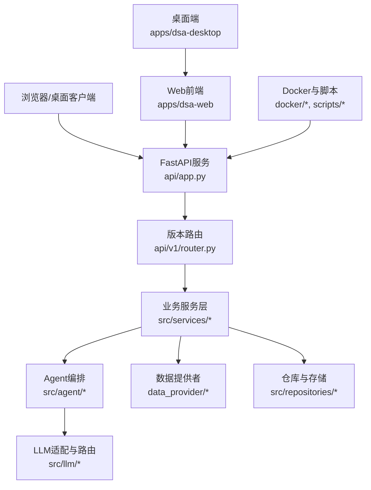
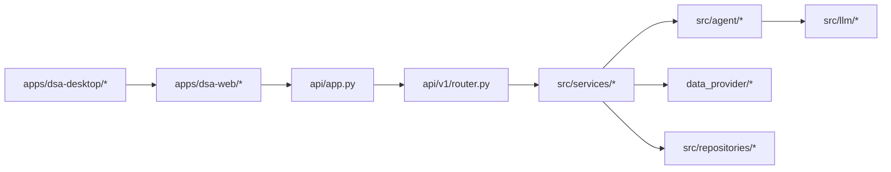

# 开发指南

<cite>
**本文引用的文件**   
- [README.md](file://README.md)
- [pyproject.toml](file://pyproject.toml)
- [requirements.txt](file://requirements.txt)
- [main.py](file://main.py)
- [server.py](file://server.py)
- [webui.py](file://webui.py)
- [api/app.py](file://api/app.py)
- [api/v1/router.py](file://api/v1/router.py)
- [src/config.py](file://src/config.py)
- [src/logging_config.py](file://src/logging_config.py)
- [docker/Dockerfile](file://docker/Dockerfile)
- [docker/docker-compose.yml](file://docker/docker-compose.yml)
- [scripts/ci_gate.sh](file://scripts/ci_gate.sh)
- [scripts/test.sh](file://scripts/test.sh)
- [.github/workflows](file://.github/workflows)
- [.github/PULL_REQUEST_TEMPLATE.md](file://.github/PULL_REQUEST_TEMPLATE.md)
- [docs/CONTRIBUTING.md](file://docs/CONTRIBUTING.md)
- [docs/DEPLOY.md](file://docs/DEPLOY.md)
- [apps/dsa-web/package.json](file://apps/dsa-web/package.json)
- [apps/dsa-desktop/package.json](file://apps/dsa-desktop/package.json)
</cite>

## 目录
1. [简介](#简介)
2. [项目结构](#项目结构)
3. [核心组件](#核心组件)
4. [架构总览](#架构总览)
5. [详细组件分析](#详细组件分析)
6. [依赖分析](#依赖分析)
7. [性能考虑](#性能考虑)
8. [故障排查指南](#故障排查指南)
9. [结论](#结论)
10. [附录](#附录)

## 简介
本指南面向Daily Stock Analysis项目的开发者，提供从环境搭建、代码规范、调试配置到构建发布、质量保障与贡献流程的完整说明。项目采用多语言多模块组织：Python后端（FastAPI）、Web前端（React/Vite）、桌面端（Electron）以及Bot与数据源适配层。通过统一的脚本与CI流水线，确保本地开发与线上部署的一致性。

## 项目结构
仓库采用“按领域分层 + 多应用”的组织方式：
- api：FastAPI服务与路由、中间件、请求校验Schema
- src：核心业务逻辑（Agent、LLM、策略、服务层、存储、工具等）
- data_provider：多数据源适配器（A股、港股、美股、指数等）
- bot：跨平台消息机器人（钉钉、飞书、Discord等）
- apps：Web前端与桌面客户端
- docker：容器化镜像与编排
- scripts：构建、测试、检查与发布辅助脚本
- tests：单元测试与集成测试
- docs：文档与部署指南

图表来源
- [api/app.py](file://api/app.py)
- [api/v1/router.py](file://api/v1/router.py)
- [src/config.py](file://src/config.py)
- [docker/Dockerfile](file://docker/Dockerfile)
- [docker/docker-compose.yml](file://docker/docker-compose.yml)

章节来源
- [README.md](file://README.md)
- [pyproject.toml](file://pyproject.toml)
- [requirements.txt](file://requirements.txt)

## 核心组件
- API网关与服务入口
  - FastAPI应用初始化、中间件注册、版本路由挂载
  - 统一错误处理与鉴权中间件
- 业务服务层
  - 分析、回测、组合、通知、系统配置、任务调度等服务
- Agent与LLM适配
  - 多Agent编排、工具注册、流式事件、模型路由与追踪
- 数据提供者
  - 多源行情与基本面数据拉取与标准化
- 存储与仓库
  - 分析结果、决策信号、历史数据、组合快照等持久化
- 前端与桌面
  - Web UI基于Vite+React，桌面端基于Electron打包分发
- 容器与脚本
  - Docker镜像构建、Compose编排、CI门禁与测试脚本

章节来源
- [api/app.py](file://api/app.py)
- [api/v1/router.py](file://api/v1/router.py)
- [src/config.py](file://src/config.py)
- [src/logging_config.py](file://src/logging_config.py)
- [apps/dsa-web/package.json](file://apps/dsa-web/package.json)
- [apps/dsa-desktop/package.json](file://apps/dsa-desktop/package.json)

## 架构总览
系统由API服务驱动，前端调用API获取数据与执行分析；Agent与LLM负责智能分析与报告生成；数据提供者聚合多源数据；存储服务持久化关键实体；Docker与脚本保证一致的环境与交付。

图表来源
- [api/app.py](file://api/app.py)
- [api/v1/router.py](file://api/v1/router.py)
- [src/services/*](file://src/services/__init__.py)
- [src/agent/*](file://src/agent/__init__.py)
- [data_provider/*](file://data_provider/__init__.py)
- [src/repositories/*](file://src/repositories/__init__.py)
- [src/llm/*](file://src/llm/__init__.py)
- [apps/dsa-web/package.json](file://apps/dsa-web/package.json)
- [apps/dsa-desktop/package.json](file://apps/dsa-desktop/package.json)
- [docker/Dockerfile](file://docker/Dockerfile)
- [docker/docker-compose.yml](file://docker/docker-compose.yml)

## 详细组件分析

### 开发环境与IDE配置
- Python环境
  - 使用虚拟环境或conda管理依赖，安装requirements与pyproject定义包
  - 推荐IDE：VS Code或PyCharm，启用Pylance/Black/isort/flake8/ruff等插件
- Node环境
  - 使用Node LTS版本，安装pnpm/yarn/npm（依据package.json脚本选择）
  - VS Code启用ESLint、TypeScript、Tailwind IntelliSense
- Electron桌面端
  - 安装原生依赖时可能需要编译工具链（C++编译器、Python构建工具）
- 日志与调试
  - 启动前设置环境变量（如数据库连接、LLM密钥、缓存路径）
  - 使用断点调试API与前端网络面板，结合结构化日志定位问题

章节来源
- [requirements.txt](file://requirements.txt)
- [pyproject.toml](file://pyproject.toml)
- [apps/dsa-web/package.json](file://apps/dsa-web/package.json)
- [apps/dsa-desktop/package.json](file://apps/dsa-desktop/package.json)
- [src/logging_config.py](file://src/logging_config.py)

### 代码规范与命名约定
- Python
  - 模块与包小写下划线分隔，类名大驼峰，函数与变量小写加下划线
  - 类型注解与Pydantic Schema用于输入输出校验
  - 统一格式化与静态检查（建议ruff/black/isort/flake8）
- TypeScript/React
  - 组件与Hook使用大驼峰，文件以功能域组织
  - ESLint规则与Tailwind样式规范保持一致
- Git提交
  - 遵循Conventional Commits（feat/fix/docs/chore等），保持变更可追溯

章节来源
- [pyproject.toml](file://pyproject.toml)
- [apps/dsa-web/package.json](file://apps/dsa-web/package.json)
- [docs/CONTRIBUTING.md](file://docs/CONTRIBUTING.md)

### 调试工具与运行方式
- 后端服务
  - 通过主入口或服务器脚本启动，支持热重载与调试模式
  - 使用API文档（Swagger/ReDoc）进行接口验证
- 前端与桌面
  - 前端开发服务器支持热更新与Mock
  - 桌面端支持远程调试与日志导出
- 容器化
  - 使用Docker镜像与Compose一键拉起依赖服务

章节来源
- [main.py](file://main.py)
- [server.py](file://server.py)
- [webui.py](file://webui.py)
- [docker/Dockerfile](file://docker/Dockerfile)
- [docker/docker-compose.yml](file://docker/docker-compose.yml)

### 构建与发布流程
- 依赖管理
  - Python：requirements与pyproject双轨管理，锁定版本
  - Node：package.json脚本统一管理构建、测试与打包
- 版本标记
  - 使用Git标签与Release说明，配合CI生成产物
- 产物管理
  - 后端镜像、前端静态资源、桌面安装包分别归档与分发

章节来源
- [requirements.txt](file://requirements.txt)
- [pyproject.toml](file://pyproject.toml)
- [apps/dsa-web/package.json](file://apps/dsa-web/package.json)
- [apps/dsa-desktop/package.json](file://apps/dsa-desktop/package.json)
- [docker/Dockerfile](file://docker/Dockerfile)
- [scripts/ci_gate.sh](file://scripts/ci_gate.sh)

### 代码质量保障
- 静态分析
  - Python：ruff/black/isort/flake8；TypeScript：ESLint与TS检查
- 自动化测试
  - pytest覆盖后端逻辑；Vitest/Jest覆盖前端；Playwright进行E2E
- CI门禁
  - 代码检查、测试、构建与安全检查在PR阶段强制执行

章节来源
- [scripts/test.sh](file://scripts/test.sh)
- [scripts/ci_gate.sh](file://scripts/ci_gate.sh)
- [apps/dsa-web/package.json](file://apps/dsa-web/package.json)
- [tests/*](file://tests/conftest.py)

### 贡献代码流程（Issue到PR合并）
- Issue创建
  - 描述问题背景、复现步骤、期望行为与环境信息
- 分支与提交
  - 从主分支拉取特性分支，提交遵循Conventional Commits
- 代码审查
  - 发起PR，填写模板，附上测试与变更说明
- 合并与发布
  - 通过CI后合并至主分支，打标签并生成发布说明

章节来源
- [.github/PULL_REQUEST_TEMPLATE.md](file://.github/PULL_REQUEST_TEMPLATE.md)
- [docs/CONTRIBUTING.md](file://docs/CONTRIBUTING.md)

## 依赖分析
- 外部依赖
  - Python：FastAPI、Uvicorn、Pydantic、SQLAlchemy/SQLite、HTTP客户端、LLM SDK等
  - Node：React、Vite、Tailwind、Electron、测试框架等
- 内部依赖
  - API层依赖服务层，服务层依赖Agent与数据提供者，存储层解耦于具体实现
- 风险与优化
  - 避免循环依赖，拆分重型模块，按需加载与懒初始化

图表来源
- [api/app.py](file://api/app.py)
- [api/v1/router.py](file://api/v1/router.py)
- [src/services/__init__.py](file://src/services/__init__.py)
- [src/agent/__init__.py](file://src/agent/__init__.py)
- [data_provider/__init__.py](file://data_provider/__init__.py)
- [src/repositories/__init__.py](file://src/repositories/__init__.py)
- [src/llm/__init__.py](file://src/llm/__init__.py)
- [apps/dsa-web/package.json](file://apps/dsa-web/package.json)
- [apps/dsa-desktop/package.json](file://apps/dsa-desktop/package.json)

章节来源
- [pyproject.toml](file://pyproject.toml)
- [requirements.txt](file://requirements.txt)
- [apps/dsa-web/package.json](file://apps/dsa-web/package.json)
- [apps/dsa-desktop/package.json](file://apps/dsa-desktop/package.json)

## 性能考虑
- 异步与并发
  - API使用异步IO，Agent与LLM调用需限流与重试
- 缓存与预取
  - 热点数据缓存、批量拉取与增量更新
- 资源控制
  - 限制并发度、超时与熔断，避免雪崩
- 前端优化
  - 代码分割、懒加载、图片与静态资源压缩

[本节为通用指导，不直接分析具体文件]

## 故障排查指南
- 常见问题
  - 端口冲突、依赖缺失、环境变量未设置、数据库连接失败、LLM密钥无效
- 诊断方法
  - 查看日志与错误堆栈，启用详细日志级别
  - 使用健康检查接口确认服务状态
  - 前端网络面板与后端访问日志交叉验证
- 恢复步骤
  - 清理缓存与临时文件，重启服务，回滚到稳定版本

章节来源
- [src/logging_config.py](file://src/logging_config.py)
- [api/app.py](file://api/app.py)
- [scripts/ci_gate.sh](file://scripts/ci_gate.sh)

## 结论
本指南提供了Daily Stock Analysis项目的端到端开发实践，涵盖环境搭建、代码规范、调试、构建发布、质量保障与贡献流程。遵循本文档可提升团队协作效率与交付质量，确保系统在复杂场景下的稳定性与可维护性。

## 附录
- 部署参考
  - 容器化部署与云服务部署指南
- 扩展阅读
  - 架构设计文档、API规范、Bot配置与通知渠道

章节来源
- [docs/DEPLOY.md](file://docs/DEPLOY.md)
- [docs/INDEX.md](file://docs/INDEX.md)