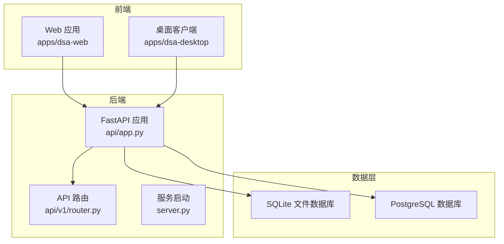
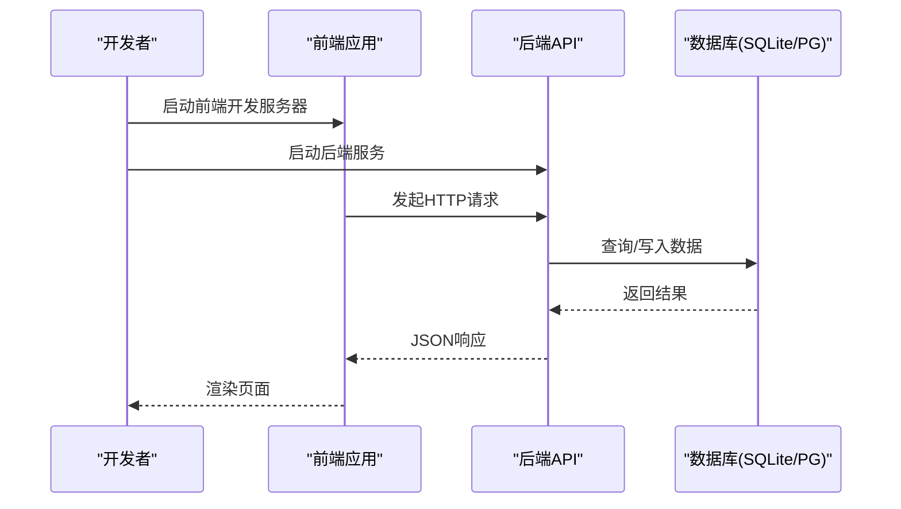
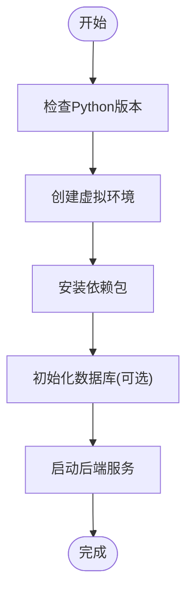
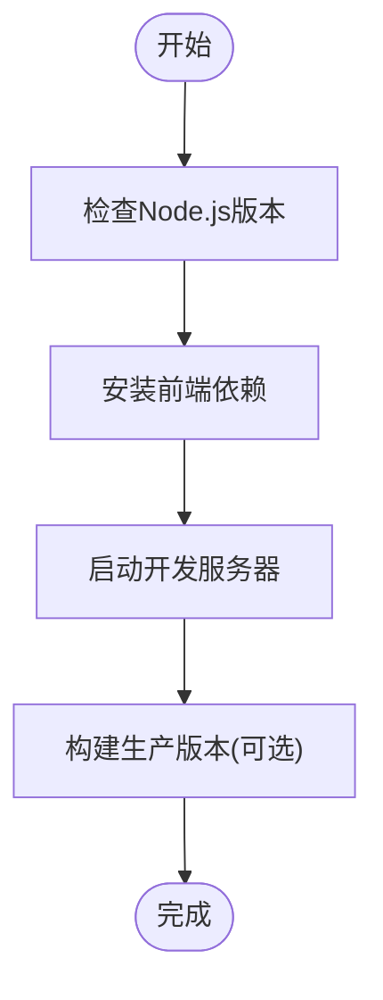
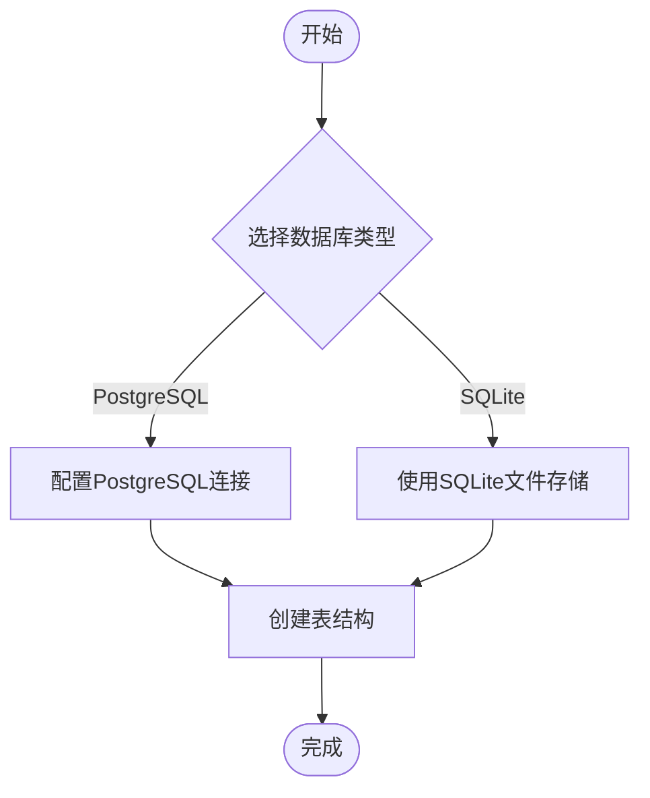
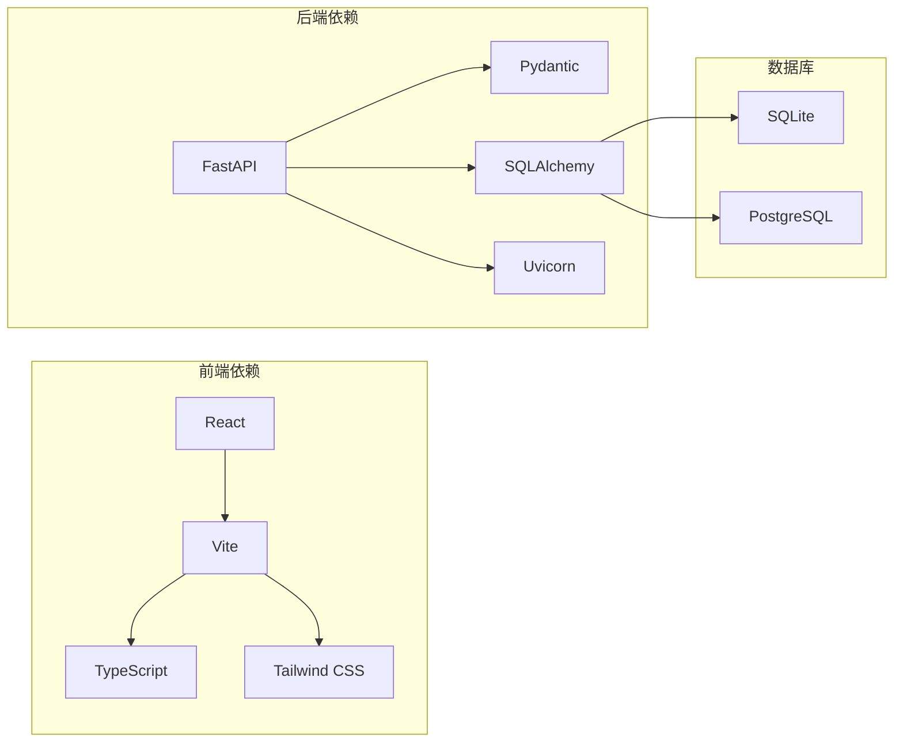

# 开发环境搭建

<cite>
**本文引用的文件**   
- [pyproject.toml](file://pyproject.toml)
- [requirements.txt](file://requirements.txt)
- [server.py](file://server.py)
- [main.py](file://main.py)
- [webui.py](file://webui.py)
- [apps/dsa-web/package.json](file://apps/dsa-web/package.json)
- [apps/dsa-desktop/package.json](file://apps/dsa-desktop/package.json)
- [docker/docker-compose.yml](file://docker/docker-compose.yml)
- [docker/Dockerfile](file://docker/Dockerfile)
- [scripts/check_env.py](file://scripts/check_env.py)
- [src/config.py](file://src/config.py)
- [api/app.py](file://api/app.py)
- [api/v1/router.py](file://api/v1/router.py)
- [apps/dsa-web/vite.config.ts](file://apps/dsa-web/vite.config.ts)
- [apps/dsa-web/tsconfig.json](file://apps/dsa-web/tsconfig.json)
- [apps/dsa-web/eslint.config.js](file://apps/dsa-web/eslint.config.js)
- [apps/dsa-web/tailwind.config.js](file://apps/dsa-web/tailwind.config.js)
- [apps/dsa-web/index.html](file://apps/dsa-web/index.html)
- [apps/dsa-web/src/main.tsx](file://apps/dsa-web/src/main.tsx)
- [apps/dsa-web/src/App.tsx](file://apps/dsa-web/src/App.tsx)
- [apps/dsa-desktop/main.js](file://apps/dsa-desktop/main.js)
- [apps/dsa-desktop/preload.js](file://apps/dsa-desktop/preload.js)
</cite>

## 目录
1. [简介](#简介)
2. [项目结构](#项目结构)
3. [核心组件](#核心组件)
4. [架构总览](#架构总览)
5. [详细组件分析](#详细组件分析)
6. [依赖关系分析](#依赖关系分析)
7. [性能注意事项](#性能注意事项)
8. [故障排查指南](#故障排查指南)
9. [结论](#结论)
10. [附录](#附录)

## 简介
本指南面向Daily Stock Analysis项目的开发者，提供从零开始搭建本地开发环境的完整步骤。内容涵盖：
- Python 后端环境配置（版本、虚拟环境、依赖安装）
- Node.js 前端环境配置（版本、包管理器、依赖安装与构建）
- IDE 推荐配置（VS Code 插件、格式化、调试器）
- 数据库初始化（SQLite 与 PostgreSQL 选项）
- 环境变量与配置文件模板
- 常见问题排查与解决方案

## 项目结构
本项目采用前后端分离的架构：
- 后端使用 FastAPI（Python），入口为 server.py，路由集中在 api/v1/router.py，应用装配在 api/app.py。
- 前端 Web 应用位于 apps/dsa-web，基于 Vite + React + TypeScript，通过 vite.config.ts 进行构建配置。
- 桌面客户端位于 apps/dsa-desktop，基于 Electron，入口 main.js 与 preload.js。
- Docker 部署相关脚本位于 docker/ 目录。
- 脚本工具位于 scripts/，包含环境检查等辅助脚本。

**图表来源** 
- [server.py:1-200](file://server.py#L1-L200)
- [api/app.py:1-200](file://api/app.py#L1-L200)
- [api/v1/router.py:1-200](file://api/v1/router.py#L1-L200)
- [apps/dsa-web/vite.config.ts:1-200](file://apps/dsa-web/vite.config.ts#L1-L200)
- [apps/dsa-desktop/main.js:1-200](file://apps/dsa-desktop/main.js#L1-L200)

**章节来源**
- [server.py:1-200](file://server.py#L1-L200)
- [api/app.py:1-200](file://api/app.py#L1-L200)
- [api/v1/router.py:1-200](file://api/v1/router.py#L1-L200)
- [apps/dsa-web/vite.config.ts:1-200](file://apps/dsa-web/vite.config.ts#L1-L200)
- [apps/dsa-desktop/main.js:1-200](file://apps/dsa-desktop/main.js#L1-L200)

## 核心组件
- 后端服务：FastAPI 应用，统一入口 server.py，加载中间件、路由、健康检查等。
- 前端应用：Vite 驱动的 React + TypeScript 单页应用，提供用户界面与交互逻辑。
- 桌面客户端：Electron 打包的桌面应用，用于本地运行与集成。
- 数据访问：支持 SQLite（默认）与 PostgreSQL（可选），通过配置切换。
- 配置与环境：集中式配置管理，环境变量驱动行为。

**章节来源**
- [server.py:1-200](file://server.py#L1-L200)
- [api/app.py:1-200](file://api/app.py#L1-L200)
- [src/config.py:1-200](file://src/config.py#L1-L200)

## 架构总览
下图展示了开发环境下各组件的交互关系：前端通过 HTTP 调用后端 API，后端根据配置选择数据库类型并执行业务逻辑；桌面客户端同样通过 API 与后端通信。

**图表来源** 
- [server.py:1-200](file://server.py#L1-L200)
- [api/app.py:1-200](file://api/app.py#L1-L200)
- [src/config.py:1-200](file://src/config.py#L1-L200)

## 详细组件分析

### Python 后端环境配置
- Python 版本要求：建议使用 Python 3.10+（参考 pyproject.toml 中的设置）。
- 虚拟环境：推荐使用 venv 或 conda 创建独立环境，避免系统依赖冲突。
- 依赖安装：使用 pip 安装 requirements.txt 中的依赖。
- 启动方式：执行 server.py 启动后端服务，或通过 webui.py 启动 Web UI 模式。

**图表来源** 
- [pyproject.toml:1-200](file://pyproject.toml#L1-L200)
- [requirements.txt:1-200](file://requirements.txt#L1-L200)
- [server.py:1-200](file://server.py#L1-L200)

**章节来源**
- [pyproject.toml:1-200](file://pyproject.toml#L1-L200)
- [requirements.txt:1-200](file://requirements.txt#L1-L200)
- [server.py:1-200](file://server.py#L1-L200)
- [webui.py:1-200](file://webui.py#L1-L200)

### Node.js 前端环境配置
- Node.js 版本：建议使用 LTS 版本（如 18.x 或 20.x）。
- 包管理器：npm 或 yarn（项目包含 package-lock.json，推荐使用 npm）。
- 依赖安装：进入 apps/dsa-web 目录，执行 npm install 安装依赖。
- 开发服务器：执行 npm run dev 启动 Vite 开发服务器。
- 构建产物：执行 npm run build 生成静态资源。

**图表来源** 
- [apps/dsa-web/package.json:1-200](file://apps/dsa-web/package.json#L1-L200)
- [apps/dsa-web/vite.config.ts:1-200](file://apps/dsa-web/vite.config.ts#L1-L200)

**章节来源**
- [apps/dsa-web/package.json:1-200](file://apps/dsa-web/package.json#L1-L200)
- [apps/dsa-web/vite.config.ts:1-200](file://apps/dsa-web/vite.config.ts#L1-L200)

### 桌面客户端环境配置
- Electron 应用：apps/dsa-desktop 目录包含 Electron 主进程和预加载脚本。
- 依赖安装：进入目录执行 npm install。
- 启动方式：执行 npm start 或 node main.js。

**章节来源**
- [apps/dsa-desktop/package.json:1-200](file://apps/dsa-desktop/package.json#L1-L200)
- [apps/dsa-desktop/main.js:1-200](file://apps/dsa-desktop/main.js#L1-L200)
- [apps/dsa-desktop/preload.js:1-200](file://apps/dsa-desktop/preload.js#L1-L200)

### 数据库初始化
- SQLite：默认使用 SQLite 文件存储，无需额外安装，首次运行时自动创建数据库文件。
- PostgreSQL：可通过环境变量配置连接信息，适用于生产环境或团队协作。
- 初始化脚本：项目未提供专门的初始化脚本，但可通过 API 触发必要的表结构创建。

**图表来源** 
- [src/config.py:1-200](file://src/config.py#L1-L200)
- [docker/docker-compose.yml:1-200](file://docker/docker-compose.yml#L1-L200)

**章节来源**
- [src/config.py:1-200](file://src/config.py#L1-L200)
- [docker/docker-compose.yml:1-200](file://docker/docker-compose.yml#L1-L200)

### 环境变量与配置文件
- 环境变量：通过 .env 文件或系统环境变量配置数据库连接、API密钥等。
- 配置文件：项目使用集中式配置管理，支持动态加载和验证。
- 示例模板：可参考项目中的示例配置文件创建自己的配置。

**章节来源**
- [src/config.py:1-200](file://src/config.py#L1-L200)
- [scripts/check_env.py:1-200](file://scripts/check_env.py#L1-L200)

### IDE 推荐配置（VS Code）
- 插件推荐：
  - Python：Pylance、Black Formatter、isort
  - JavaScript/TypeScript：ESLint、Prettier、Volar
  - Docker：Docker 扩展
  - Git：GitLens
- 代码格式化：
  - Python：使用 Black 和 isort 进行格式化和导入排序
  - TypeScript：使用 ESLint 和 Prettier 进行代码风格检查
- 调试器设置：
  - Python：使用内置调试器，配置 launch.json
  - Node.js：使用 Chrome 调试器或 VS Code 内置调试器

**章节来源**
- [apps/dsa-web/eslint.config.js:1-200](file://apps/dsa-web/eslint.config.js#L1-L200)
- [apps/dsa-web/tsconfig.json:1-200](file://apps/dsa-web/tsconfig.json#L1-L200)

## 依赖关系分析
项目依赖关系清晰，前后端解耦，通过 API 进行通信。

**图表来源** 
- [pyproject.toml:1-200](file://pyproject.toml#L1-L200)
- [requirements.txt:1-200](file://requirements.txt#L1-L200)
- [apps/dsa-web/package.json:1-200](file://apps/dsa-web/package.json#L1-L200)

**章节来源**
- [pyproject.toml:1-200](file://pyproject.toml#L1-L200)
- [requirements.txt:1-200](file://requirements.txt#L1-L200)
- [apps/dsa-web/package.json:1-200](file://apps/dsa-web/package.json#L1-L200)

## 性能注意事项
- 前端优化：启用代码分割、懒加载和资源压缩
- 后端优化：使用异步处理、数据库连接池和缓存策略
- 数据库优化：合理索引设计、查询优化和连接池配置
- 内存管理：监控内存使用情况，避免内存泄漏

## 故障排查指南
- Python 环境问题：检查 Python 版本兼容性，重新安装依赖包
- 端口冲突：修改默认端口或关闭占用端口的进程
- 数据库连接失败：检查连接字符串、用户名密码和网络配置
- 前端构建错误：清理 node_modules 重新安装依赖
- 环境变量问题：检查 .env 文件格式和环境变量加载顺序

**章节来源**
- [scripts/check_env.py:1-200](file://scripts/check_env.py#L1-L200)

## 结论
通过以上步骤，您可以成功搭建 Daily Stock Analysis 的开发环境。建议在生产环境中使用 Docker 进行部署，确保环境一致性和可重复性。定期更新依赖包以获取安全补丁和新功能。

## 附录

### 快速启动命令
- 后端：python server.py
- 前端：cd apps/dsa-web && npm run dev
- 桌面客户端：cd apps/dsa-desktop && npm start

### 常用配置文件路径
- 后端配置：src/config.py
- 前端配置：apps/dsa-web/vite.config.ts
- 数据库配置：通过环境变量或 src/config.py

**章节来源**
- [server.py:1-200](file://server.py#L1-L200)
- [apps/dsa-web/vite.config.ts:1-200](file://apps/dsa-web/vite.config.ts#L1-L200)
- [src/config.py:1-200](file://src/config.py#L1-L200)