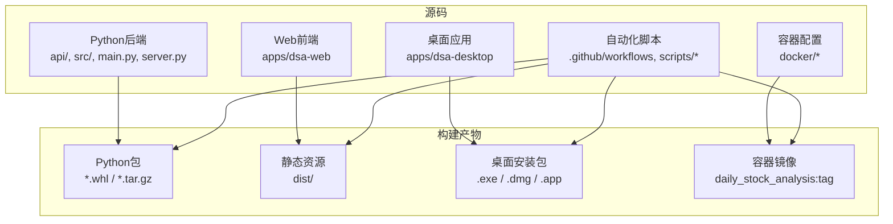
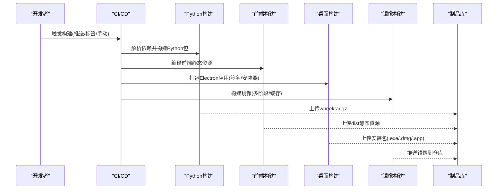
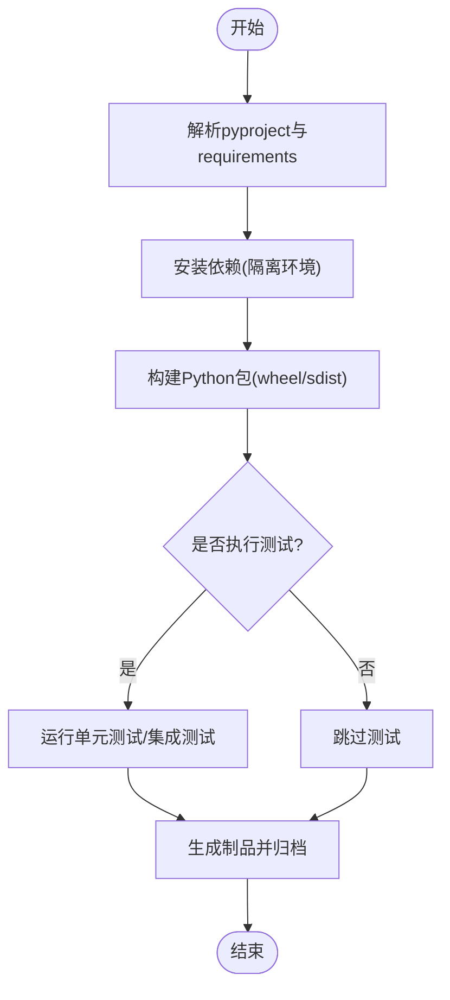
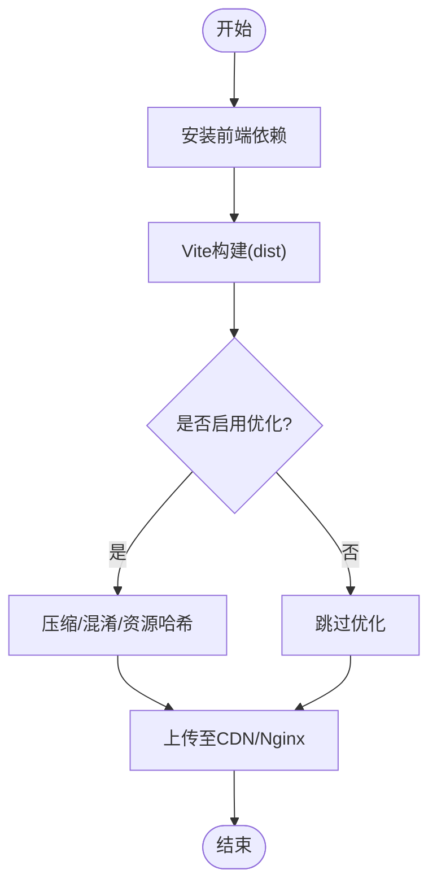
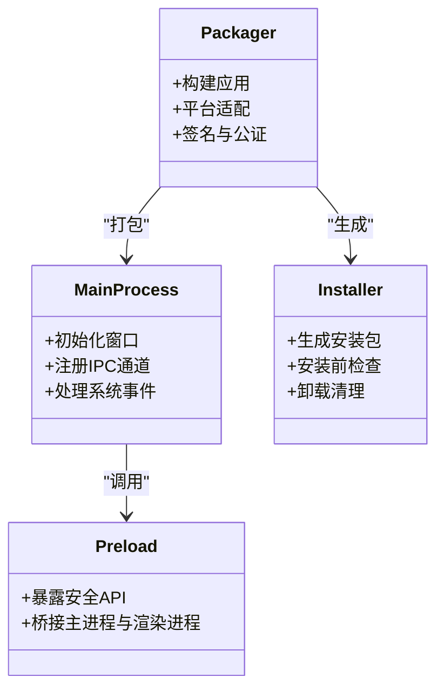
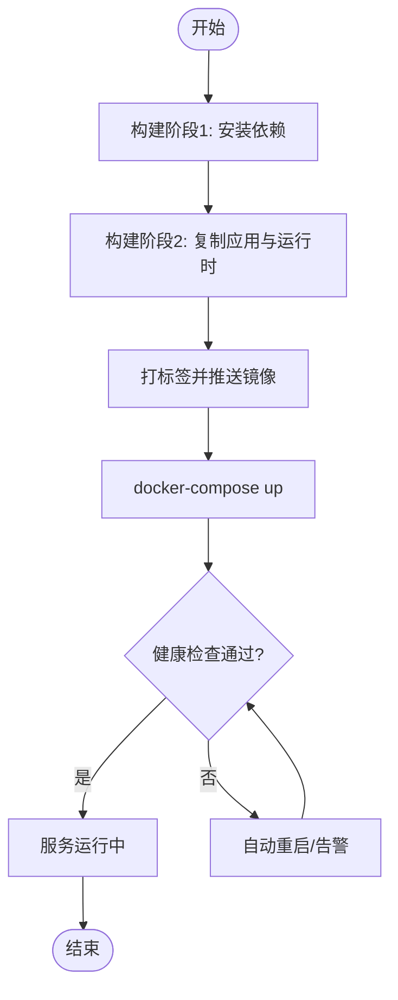
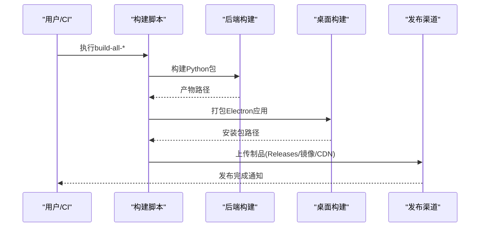
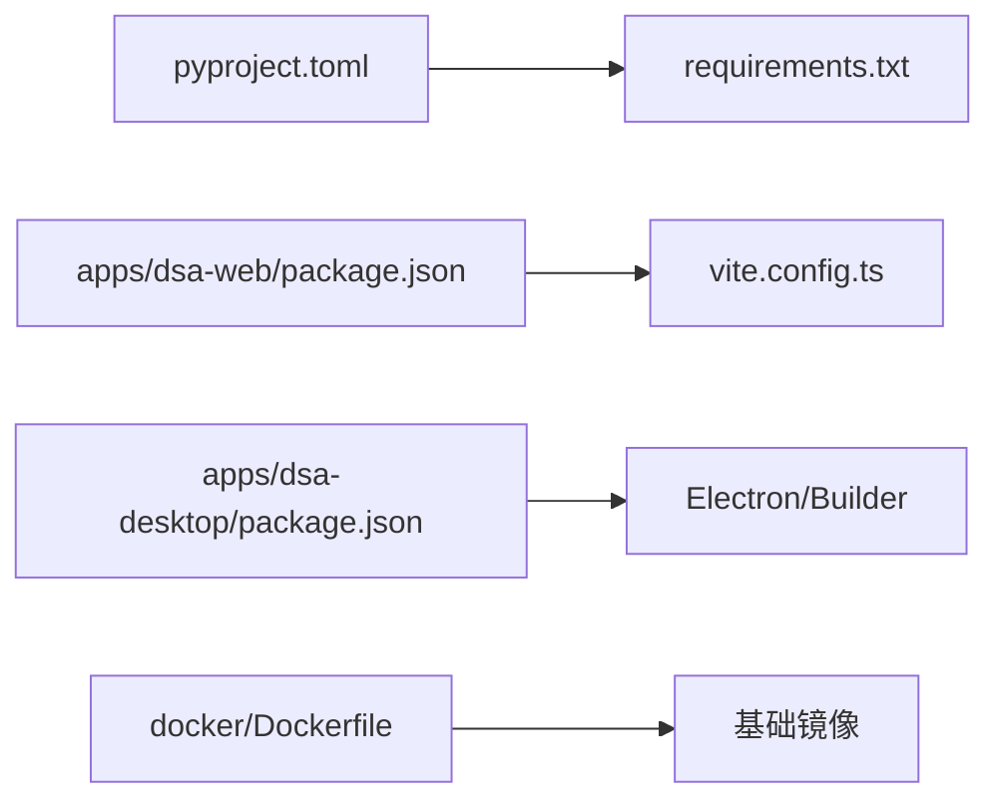

# 构建与发布

<cite>
**本文引用的文件**   
- [pyproject.toml](file://pyproject.toml)
- [requirements.txt](file://requirements.txt)
- [server.py](file://server.py)
- [main.py](file://main.py)
- [webui.py](file://webui.py)
- [Dockerfile](file://docker/Dockerfile)
- [docker-compose.yml](file://docker/docker-compose.yml)
- [entrypoint.sh](file://docker/entrypoint.sh)
- [.github/workflows/ci.yml](file://.github/workflows/ci.yml)
- [.github/release.yml](file://.github/release.yml)
- [scripts/build-backend-macos.sh](file://scripts/build-backend-macos.sh)
- [scripts/build-backend.ps1](file://scripts/build-backend.ps1)
- [scripts/build-all-macos.sh](file://scripts/build-all-macos.sh)
- [scripts/build-all.ps1](file://scripts/build-all.ps1)
- [scripts/build-desktop-macos.sh](file://scripts/build-desktop-macos.sh)
- [scripts/build-desktop.ps1](file://scripts/build-desktop.ps1)
- [apps/dsa-web/package.json](file://apps/dsa-web/package.json)
- [apps/dsa-web/vite.config.ts](file://apps/dsa-web/vite.config.ts)
- [apps/dsa-desktop/package.json](file://apps/dsa-desktop/package.json)
- [apps/dsa-desktop/main.js](file://apps/dsa-desktop/main.js)
- [apps/dsa-desktop/preload.js](file://apps/dsa-desktop/preload.js)
- [apps/dsa-desktop/scripts/afterPackMacos.js](file://apps/dsa-desktop/scripts/afterPackMacos.js)
- [apps/dsa-desktop/installer.nsh](file://apps/dsa-desktop/installer.nsh)
</cite>

## 目录
1. [简介](#简介)
2. [项目结构](#项目结构)
3. [核心组件](#核心组件)
4. [架构总览](#架构总览)
5. [详细组件分析](#详细组件分析)
6. [依赖分析](#依赖分析)
7. [性能考虑](#性能考虑)
8. [故障排查指南](#故障排查指南)
9. [结论](#结论)
10. [附录](#附录)

## 简介
本文件面向Daily Stock Analysis项目的构建与发布，覆盖后端服务、Web应用、桌面应用、容器镜像以及自动化流水线。文档旨在帮助开发者快速理解并执行本地与CI环境下的构建、打包、签名、分发与部署流程，并提供自定义配置与排错建议。

## 项目结构
本项目采用多端产物组织：
- 后端服务：Python FastAPI应用，通过pyproject与requirements管理依赖，提供REST API与调度能力。
- Web前端：基于Vite+React的SPA，构建为静态资源，供Nginx或CDN托管。
- 桌面客户端：Electron应用，支持Windows安装包与macOS应用包，含预加载脚本与平台后处理脚本。
- 容器化：Docker镜像与编排文件，便于一键部署。
- 自动化：GitHub Actions工作流与脚本，统一构建、测试、打包与发布。

**图表来源** 
- [pyproject.toml](file://pyproject.toml)
- [apps/dsa-web/package.json](file://apps/dsa-web/package.json)
- [apps/dsa-desktop/package.json](file://apps/dsa-desktop/package.json)
- [docker/Dockerfile](file://docker/Dockerfile)
- [.github/workflows/ci.yml](file://.github/workflows/ci.yml)

**章节来源**
- [pyproject.toml](file://pyproject.toml)
- [requirements.txt](file://requirements.txt)
- [apps/dsa-web/package.json](file://apps/dsa-web/package.json)
- [apps/dsa-desktop/package.json](file://apps/dsa-desktop/package.json)
- [docker/Dockerfile](file://docker/Dockerfile)
- [docker/docker-compose.yml](file://docker/docker-compose.yml)

## 核心组件
- 后端服务入口与路由：FastAPI应用启动、中间件、版本路由与错误处理。
- Web前端构建：Vite编译、资源优化、环境变量注入与输出目录。
- 桌面应用打包：Electron主进程、预加载脚本、平台后处理与安装器配置。
- 容器镜像：多阶段构建、依赖缓存、运行时最小化镜像。
- 自动化流水线：CI任务、构建脚本、发布策略与制品归档。

**章节来源**
- [server.py](file://server.py)
- [main.py](file://main.py)
- [webui.py](file://webui.py)
- [apps/dsa-web/vite.config.ts](file://apps/dsa-web/vite.config.ts)
- [apps/dsa-desktop/main.js](file://apps/dsa-desktop/main.js)
- [apps/dsa-desktop/preload.js](file://apps/dsa-desktop/preload.js)
- [docker/Dockerfile](file://docker/Dockerfile)
- [docker/entrypoint.sh](file://docker/entrypoint.sh)

## 架构总览
下图展示从源码到产物的端到端构建链路，包括后端包、前端静态资源、桌面安装包与容器镜像。

**图表来源** 
- [.github/workflows/ci.yml](file://.github/workflows/ci.yml)
- [scripts/build-backend-macos.sh](file://scripts/build-backend-macos.sh)
- [scripts/build-backend.ps1](file://scripts/build-backend.ps1)
- [scripts/build-desktop-macos.sh](file://scripts/build-desktop-macos.sh)
- [scripts/build-desktop.ps1](file://scripts/build-desktop.ps1)
- [docker/Dockerfile](file://docker/Dockerfile)

## 详细组件分析

### 后端服务构建（Python）
- 依赖管理：使用pyproject定义元数据与依赖，requirements用于锁定与CI环境一致性。
- 构建目标：生成可分发的wheel与源码包，便于pip安装与离线部署。
- 优化要点：
  - 分离运行依赖与开发依赖，减少镜像体积。
  - 启用依赖缓存层，加速重复构建。
  - 可选裁剪无用模块，降低导入开销。
- 部署方式：
  - 直接运行FastAPI应用（uvicorn/gunicorn）。
  - 容器化运行，配合反向代理与系统级守护。

**图表来源** 
- [pyproject.toml](file://pyproject.toml)
- [requirements.txt](file://requirements.txt)
- [scripts/build-backend-macos.sh](file://scripts/build-backend-macos.sh)
- [scripts/build-backend.ps1](file://scripts/build-backend.ps1)

**章节来源**
- [pyproject.toml](file://pyproject.toml)
- [requirements.txt](file://requirements.txt)
- [server.py](file://server.py)
- [main.py](file://main.py)

### Web应用构建（Vite + React）
- 构建工具：Vite负责编译TypeScript/JS、样式与资源，输出至dist目录。
- 优化策略：
  - 代码分割与懒加载，提升首屏性能。
  - 静态资源压缩与哈希命名，利于CDN缓存。
  - 环境变量注入，区分开发与生产配置。
- 部署方式：
  - Nginx/Apache托管静态文件。
  - CDN直传，结合缓存策略与回源规则。

**图表来源** 
- [apps/dsa-web/package.json](file://apps/dsa-web/package.json)
- [apps/dsa-web/vite.config.ts](file://apps/dsa-web/vite.config.ts)

**章节来源**
- [apps/dsa-web/package.json](file://apps/dsa-web/package.json)
- [apps/dsa-web/vite.config.ts](file://apps/dsa-web/vite.config.ts)

### 桌面应用打包（Electron）
- 主进程与预加载：main.js定义窗口与生命周期，preload.js暴露安全API给渲染进程。
- 打包流程：
  - 使用Electron Builder进行跨平台打包。
  - Windows生成安装包(.exe)，macOS生成.dmg/.app。
  - macOS签名与公证流程由afterPack脚本驱动。
- 安装器定制：NSIS脚本用于Windows安装界面与权限设置。

**图表来源** 
- [apps/dsa-desktop/main.js](file://apps/dsa-desktop/main.js)
- [apps/dsa-desktop/preload.js](file://apps/dsa-desktop/preload.js)
- [apps/dsa-desktop/scripts/afterPackMacos.js](file://apps/dsa-desktop/scripts/afterPackMacos.js)
- [apps/dsa-desktop/installer.nsh](file://apps/dsa-desktop/installer.nsh)
- [apps/dsa-desktop/package.json](file://apps/dsa-desktop/package.json)

**章节来源**
- [apps/dsa-desktop/package.json](file://apps/dsa-desktop/package.json)
- [apps/dsa-desktop/main.js](file://apps/dsa-desktop/main.js)
- [apps/dsa-desktop/preload.js](file://apps/dsa-desktop/preload.js)
- [apps/dsa-desktop/scripts/afterPackMacos.js](file://apps/dsa-desktop/scripts/afterPackMacos.js)
- [apps/dsa-desktop/installer.nsh](file://apps/dsa-desktop/installer.nsh)

### 容器镜像构建与编排
- 镜像构建：
  - 多阶段构建，第一阶段安装依赖，第二阶段仅包含运行时。
  - 使用非root用户运行，提升安全性。
  - 环境变量与配置文件挂载，实现灵活部署。
- 编排：
  - docker-compose定义服务、网络与卷。
  - 健康检查与重启策略保障可用性。

**图表来源** 
- [docker/Dockerfile](file://docker/Dockerfile)
- [docker/docker-compose.yml](file://docker/docker-compose.yml)
- [docker/entrypoint.sh](file://docker/entrypoint.sh)

**章节来源**
- [docker/Dockerfile](file://docker/Dockerfile)
- [docker/docker-compose.yml](file://docker/docker-compose.yml)
- [docker/entrypoint.sh](file://docker/entrypoint.sh)

### 自动化构建脚本与自定义配置
- 脚本职责：
  - build-backend-*：构建Python包，支持macOS与Windows。
  - build-desktop-*：打包Electron应用，支持签名与安装器生成。
  - build-all-*：一体化构建，按顺序执行后端、前端、桌面与镜像构建。
- 自定义配置：
  - 环境变量控制构建选项（如调试模式、目标平台、签名证书路径）。
  - 在CI中通过密钥管理敏感信息（如签名私钥、仓库凭据）。
- 发布渠道：
  - GitHub Releases上传安装包与二进制。
  - 容器镜像推送到私有或公共仓库。
  - 静态资源上传至CDN并更新缓存。

**图表来源** 
- [scripts/build-all-macos.sh](file://scripts/build-all-macos.sh)
- [scripts/build-all.ps1](file://scripts/build-all.ps1)
- [scripts/build-backend-macos.sh](file://scripts/build-backend-macos.sh)
- [scripts/build-backend.ps1](file://scripts/build-backend.ps1)
- [scripts/build-desktop-macos.sh](file://scripts/build-desktop-macos.sh)
- [scripts/build-desktop.ps1](file://scripts/build-desktop.ps1)

**章节来源**
- [scripts/build-backend-macos.sh](file://scripts/build-backend-macos.sh)
- [scripts/build-backend.ps1](file://scripts/build-backend.ps1)
- [scripts/build-desktop-macos.sh](file://scripts/build-desktop-macos.sh)
- [scripts/build-desktop.ps1](file://scripts/build-desktop.ps1)
- [scripts/build-all-macos.sh](file://scripts/build-all-macos.sh)
- [scripts/build-all.ps1](file://scripts/build-all.ps1)

## 依赖分析
- Python依赖：
  - pyproject定义项目元数据与依赖分组。
  - requirements锁定具体版本，确保CI与生产一致。
- 前端依赖：
  - package.json声明构建工具与运行时依赖。
  - vite.config.ts配置构建行为与优化选项。
- 桌面依赖：
  - Electron及Builder相关依赖，平台特定二进制。
  - 签名与安装器工具链。
- 容器依赖：
  - 基础镜像选择与系统包安装。
  - 运行时最小化镜像策略。

**图表来源** 
- [pyproject.toml](file://pyproject.toml)
- [requirements.txt](file://requirements.txt)
- [apps/dsa-web/package.json](file://apps/dsa-web/package.json)
- [apps/dsa-web/vite.config.ts](file://apps/dsa-web/vite.config.ts)
- [apps/dsa-desktop/package.json](file://apps/dsa-desktop/package.json)
- [docker/Dockerfile](file://docker/Dockerfile)

**章节来源**
- [pyproject.toml](file://pyproject.toml)
- [requirements.txt](file://requirements.txt)
- [apps/dsa-web/package.json](file://apps/dsa-web/package.json)
- [apps/dsa-web/vite.config.ts](file://apps/dsa-web/vite.config.ts)
- [apps/dsa-desktop/package.json](file://apps/dsa-desktop/package.json)
- [docker/Dockerfile](file://docker/Dockerfile)

## 性能考虑
- 后端：
  - 使用异步框架与连接池，减少I/O阻塞。
  - 按需加载模块，避免冷启动延迟。
  - 日志级别与环境变量控制，降低运行时开销。
- 前端：
  - 代码分割与懒加载，提升首屏速度。
  - 静态资源压缩与HTTP缓存，减少带宽消耗。
  - CDN边缘缓存与回源策略，提高访问效率。
- 桌面：
  - 按需引入模块，减小安装包体积。
  - 预加载脚本最小化，避免渲染进程阻塞。
- 容器：
  - 多阶段构建与分层缓存，缩短构建时间。
  - 只读文件系统与安全加固，提升稳定性。

[本节为通用指导，不直接分析具体文件]

## 故障排查指南
- 构建失败：
  - 检查依赖版本冲突与网络连通性。
  - 查看CI日志中的错误堆栈与退出码。
  - 确认环境变量与密钥配置正确。
- 运行时异常：
  - 后端：验证端口占用、数据库连接与外部API可用性。
  - 前端：检查静态资源路径与CDN缓存失效。
  - 桌面：确认签名证书有效与权限设置。
- 容器问题：
  - 镜像拉取失败：检查仓库地址与认证。
  - 服务无法启动：查看容器日志与健康检查状态。

**章节来源**
- [.github/workflows/ci.yml](file://.github/workflows/ci.yml)
- [docker/entrypoint.sh](file://docker/entrypoint.sh)

## 结论
Daily Stock Analysis项目提供了完整的构建与发布体系，涵盖后端、前端、桌面与容器化方案。通过标准化脚本与CI流水线，可实现高效、可靠的构建与分发。建议在生产环境中严格遵循安全最佳实践，并结合监控与告警机制保障服务稳定性。

[本节为总结，不直接分析具体文件]

## 附录
- 常用命令参考：
  - 后端构建：执行对应平台的构建脚本。
  - 前端构建：进入前端目录执行构建命令。
  - 桌面打包：执行打包脚本并指定目标平台。
  - 镜像构建：使用Docker或CI流水线构建镜像。
- 发布策略：
  - 版本号规范与变更日志维护。
  - 灰度发布与回滚策略。
  - 多渠道分发与权限控制。

[本节为补充信息，不直接分析具体文件]