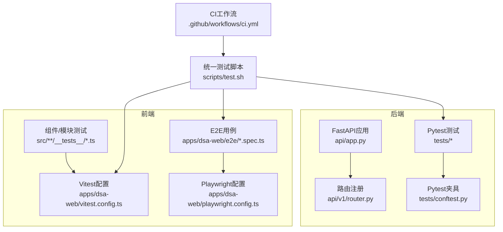
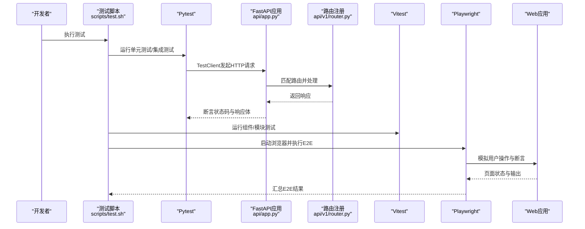
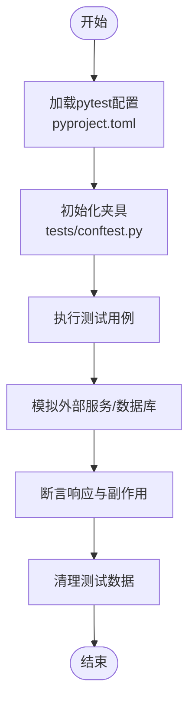
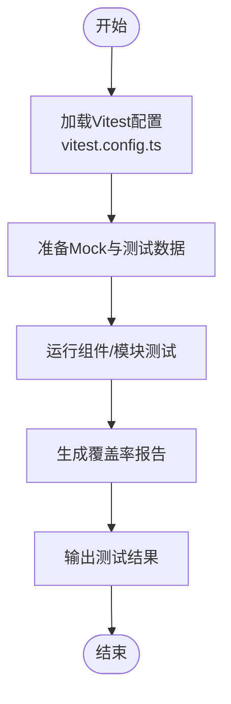
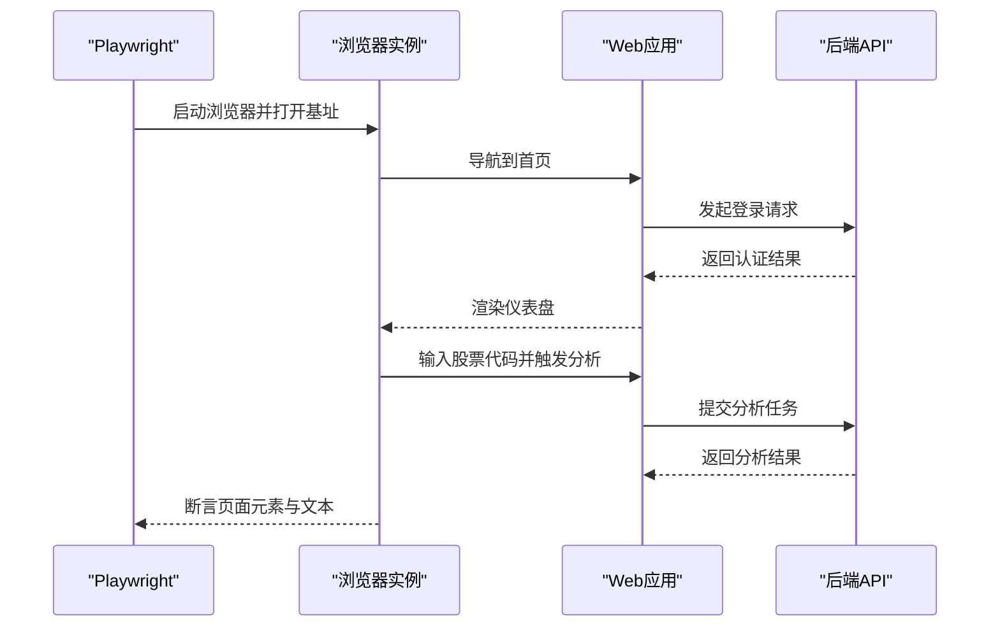
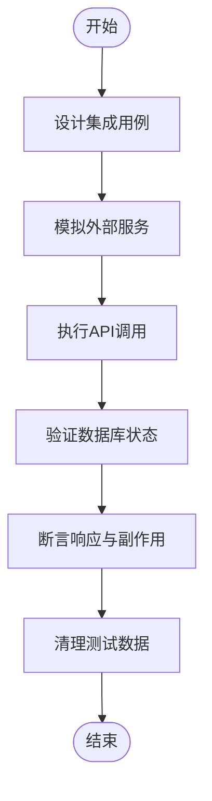
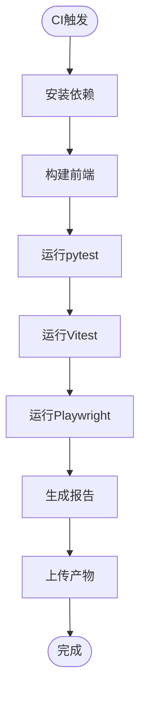
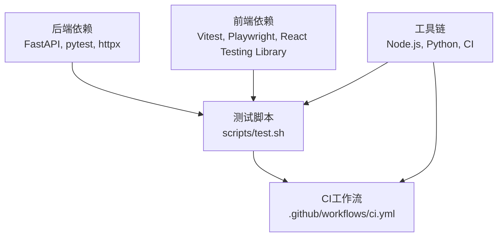

# 测试指南

<cite>
**本文引用的文件**   
- [pyproject.toml](file://pyproject.toml)
- [tests/conftest.py](file://tests/conftest.py)
- [api/app.py](file://api/app.py)
- [api/v1/router.py](file://api/v1/router.py)
- [apps/dsa-web/vitest.config.ts](file://apps/dsa-web/vitest.config.ts)
- [apps/dsa-web/playwright.config.ts](file://apps/dsa-web/playwright.config.ts)
- [apps/dsa-web/e2e/smoke.spec.ts](file://apps/dsa-web/e2e/smoke.spec.ts)
- [scripts/test.sh](file://scripts/test.sh)
- [.github/workflows/ci.yml](file://.github/workflows/ci.yml)
</cite>

## 目录
1. [简介](#简介)
2. [项目结构](#项目结构)
3. [核心组件](#核心组件)
4. [架构总览](#架构总览)
5. [详细组件分析](#详细组件分析)
6. [依赖分析](#依赖分析)
7. [性能考虑](#性能考虑)
8. [故障排查指南](#故障排查指南)
9. [结论](#结论)
10. [附录](#附录)

## 简介
本指南面向Daily Stock Analysis项目的测试实践，覆盖单元测试、集成测试、端到端测试、测试数据与环境隔离、性能与负载测试、覆盖率要求以及持续集成中的测试执行。文档基于仓库中现有的测试配置与脚本进行说明，帮助读者快速搭建并运行各类测试，理解测试分层策略与最佳实践。

## 项目结构
本项目采用前后端分离的测试组织方式：
- 后端（Python/FastAPI）使用pytest进行单元与集成测试，测试用例集中在tests目录，通过conftest提供共享夹具与全局配置。
- 前端（Web应用）使用Vitest进行组件与模块级单元测试，使用Playwright进行浏览器端到端测试，配置文件位于apps/dsa-web下。
- 统一的测试入口与CI脚本位于scripts/test.sh与.github/workflows/ci.yml，便于本地与流水线统一执行。

**图表来源** 
- [api/app.py](file://api/app.py)
- [api/v1/router.py](file://api/v1/router.py)
- [tests/conftest.py](file://tests/conftest.py)
- [apps/dsa-web/vitest.config.ts](file://apps/dsa-web/vitest.config.ts)
- [apps/dsa-web/playwright.config.ts](file://apps/dsa-web/playwright.config.ts)
- [scripts/test.sh](file://scripts/test.sh)
- [.github/workflows/ci.yml](file://.github/workflows/ci.yml)

**章节来源**
- [pyproject.toml](file://pyproject.toml)
- [tests/conftest.py](file://tests/conftest.py)
- [api/app.py](file://api/app.py)
- [api/v1/router.py](file://api/v1/router.py)
- [apps/dsa-web/vitest.config.ts](file://apps/dsa-web/vitest.config.ts)
- [apps/dsa-web/playwright.config.ts](file://apps/dsa-web/playwright.config.ts)
- [scripts/test.sh](file://scripts/test.sh)
- [.github/workflows/ci.yml](file://.github/workflows/ci.yml)

## 核心组件
- 后端测试框架（pytest）
  - 通过pyproject.toml声明测试依赖与运行命令，确保环境一致性。
  - tests/conftest.py提供全局夹具、数据库连接、外部服务模拟等，减少重复代码。
  - 针对FastAPI的测试通常使用TestClient或异步客户端访问路由，验证状态码、响应体与副作用。
- 前端测试框架（Vitest）
  - apps/dsa-web/vitest.config.ts定义测试环境、别名、覆盖率收集与Mock策略。
  - 组件与工具函数测试位于src/**/__tests__目录下，按功能域组织。
- 端到端测试（Playwright）
  - apps/dsa-web/playwright.config.ts配置浏览器、基址、超时与并行度。
  - e2e目录包含用户流程场景，如登录、搜索与分析页面交互。
- 统一脚本与CI
  - scripts/test.sh聚合pytest、Vitest与Playwright的执行命令，支持选择性运行。
  - .github/workflows/ci.yml在CI中安装依赖、构建前端、运行测试并上报结果。

**章节来源**
- [pyproject.toml](file://pyproject.toml)
- [tests/conftest.py](file://tests/conftest.py)
- [apps/dsa-web/vitest.config.ts](file://apps/dsa-web/vitest.config.ts)
- [apps/dsa-web/playwright.config.ts](file://apps/dsa-web/playwright.config.ts)
- [scripts/test.sh](file://scripts/test.sh)
- [.github/workflows/ci.yml](file://.github/workflows/ci.yml)

## 架构总览
下图展示从请求到测试执行的完整链路，包括后端API、路由、测试客户端与前端E2E流程。

**图表来源** 
- [scripts/test.sh](file://scripts/test.sh)
- [api/app.py](file://api/app.py)
- [api/v1/router.py](file://api/v1/router.py)
- [apps/dsa-web/vitest.config.ts](file://apps/dsa-web/vitest.config.ts)
- [apps/dsa-web/playwright.config.ts](file://apps/dsa-web/playwright.config.ts)
- [apps/dsa-web/e2e/smoke.spec.ts](file://apps/dsa-web/e2e/smoke.spec.ts)

## 详细组件分析

### 单元测试框架配置（pytest）
- 依赖与命令
  - 在pyproject.toml中声明pytest及相关插件，统一测试运行命令，避免环境差异。
- 夹具与共享配置
  - tests/conftest.py集中管理数据库连接、Mock外部服务、测试数据准备与清理，保证用例隔离与可重复性。
- API测试模式
  - 使用TestClient或异步客户端调用api/app.py暴露的路由，验证输入校验、错误处理与业务逻辑。
- 数据与隔离
  - 通过事务回滚或内存数据库实现数据隔离；对第三方依赖使用mock或stub替换。

**图表来源** 
- [pyproject.toml](file://pyproject.toml)
- [tests/conftest.py](file://tests/conftest.py)

**章节来源**
- [pyproject.toml](file://pyproject.toml)
- [tests/conftest.py](file://tests/conftest.py)

### 前端单元测试框架配置（Vitest）
- 配置要点
  - apps/dsa-web/vitest.config.ts定义测试环境、路径别名、覆盖率阈值与Mock策略。
- 测试组织
  - 组件与工具函数测试位于src/**/__tests__，按模块划分，便于定位与维护。
- 运行与报告
  - 通过npm脚本或scripts/test.sh统一执行，生成覆盖率报告与失败详情。

**图表来源** 
- [apps/dsa-web/vitest.config.ts](file://apps/dsa-web/vitest.config.ts)

**章节来源**
- [apps/dsa-web/vitest.config.ts](file://apps/dsa-web/vitest.config.ts)

### 端到端测试（Playwright）
- 配置与基址
  - apps/dsa-web/playwright.config.ts设置浏览器类型、测试基址、超时与并行度。
- 用户流程模拟
  - e2e目录下的用例模拟真实用户操作，如登录、搜索股票、查看分析报告等。
- 稳定性与隔离
  - 通过固定网络延迟、重试机制与独立测试账户提升稳定性。

**图表来源** 
- [apps/dsa-web/playwright.config.ts](file://apps/dsa-web/playwright.config.ts)
- [apps/dsa-web/e2e/smoke.spec.ts](file://apps/dsa-web/e2e/smoke.spec.ts)

**章节来源**
- [apps/dsa-web/playwright.config.ts](file://apps/dsa-web/playwright.config.ts)
- [apps/dsa-web/e2e/smoke.spec.ts](file://apps/dsa-web/e2e/smoke.spec.ts)

### 集成测试策略
- API接口测试
  - 使用TestClient直接调用FastAPI路由，覆盖正常路径、边界条件与错误分支。
- 数据库操作测试
  - 通过事务回滚或内存数据库确保数据隔离，验证CRUD与复杂查询。
- 外部服务模拟
  - 对第三方API（如行情、LLM、通知）使用mock或本地stub，避免网络不稳定影响测试。

**章节来源**
- [tests/conftest.py](file://tests/conftest.py)
- [api/app.py](file://api/app.py)
- [api/v1/router.py](file://api/v1/router.py)

### 测试数据管理与环境隔离
- 测试数据
  - 在conftest中集中管理种子数据与工厂方法，确保用例间数据一致。
- 环境隔离
  - 使用环境变量区分测试与生产配置；对敏感信息通过密钥管理服务注入。
- 资源清理
  - 每个测试用例结束后自动清理临时文件、缓存与数据库记录。

**章节来源**
- [tests/conftest.py](file://tests/conftest.py)

### 性能测试与负载测试
- 后端压测
  - 使用locust或k6对关键API进行并发压测，监控响应时间与吞吐。
- 前端性能
  - 结合Vitest与浏览器性能指标评估渲染与交互性能。
- 指标采集
  - 记录CPU、内存、I/O与网络指标，识别瓶颈点。

[本节为通用指导，不直接分析具体文件]

### 测试覆盖率要求
- 覆盖率目标
  - 设定行覆盖率、分支覆盖率与函数覆盖率阈值，未达标时阻断合并。
- 报告生成
  - pytest与Vitest分别生成覆盖率报告，统一汇总至CI。
- 增量覆盖
  - 仅统计变更文件的覆盖率，提高反馈速度。

**章节来源**
- [apps/dsa-web/vitest.config.ts](file://apps/dsa-web/vitest.config.ts)
- [pyproject.toml](file://pyproject.toml)

### 持续集成中的测试执行
- 工作流编排
  - .github/workflows/ci.yml定义安装依赖、构建前端、运行测试与上传报告的步骤。
- 并行执行
  - 利用并行化加速测试执行，缩短反馈时间。
- 结果上报
  - 将测试报告与覆盖率结果归档，便于回溯与审计。

**图表来源** 
- [.github/workflows/ci.yml](file://.github/workflows/ci.yml)
- [scripts/test.sh](file://scripts/test.sh)

**章节来源**
- [.github/workflows/ci.yml](file://.github/workflows/ci.yml)
- [scripts/test.sh](file://scripts/test.sh)

## 依赖分析
- 后端依赖
  - FastAPI、pytest、httpx/TestClient、数据库驱动与第三方SDK。
- 前端依赖
  - Vitest、Playwright、React测试库与Mock工具。
- 工具链
  - Node.js、Python环境、浏览器驱动与CI服务。

**图表来源** 
- [scripts/test.sh](file://scripts/test.sh)
- [.github/workflows/ci.yml](file://.github/workflows/ci.yml)

**章节来源**
- [scripts/test.sh](file://scripts/test.sh)
- [.github/workflows/ci.yml](file://.github/workflows/ci.yml)

## 性能考虑
- 测试并行化
  - 合理拆分用例，利用多线程或多进程提升执行效率。
- 资源限制
  - 控制并发数与超时时间，避免资源争用导致不稳定。
- 缓存与预热
  - 对静态资源与模型进行预热，减少冷启动开销。

[本节为通用指导，不直接分析具体文件]

## 故障排查指南
- 常见问题
  - 端口冲突、浏览器驱动缺失、环境变量未正确注入。
- 调试技巧
  - 启用详细日志、逐步回放E2E用例、检查网络请求与数据库状态。
- 恢复策略
  - 重置测试环境、清理缓存与临时文件、重新安装依赖。

**章节来源**
- [tests/conftest.py](file://tests/conftest.py)
- [apps/dsa-web/playwright.config.ts](file://apps/dsa-web/playwright.config.ts)

## 结论
本指南系统梳理了Daily Stock Analysis项目的测试架构与实践，涵盖pytest与Vitest的配置、集成测试策略、E2E实现、数据与环境管理、性能与覆盖率要求以及CI集成。遵循本文档可显著提升测试质量与交付效率。

## 附录
- 常用命令
  - 运行所有测试：scripts/test.sh
  - 仅运行后端测试：pytest
  - 仅运行前端测试：Vitest
  - 仅运行E2E测试：Playwright
- 参考文件
  - 测试配置：pyproject.toml、apps/dsa-web/vitest.config.ts、apps/dsa-web/playwright.config.ts
  - 夹具与共享：tests/conftest.py
  - 应用入口：api/app.py、api/v1/router.py
  - 统一脚本：scripts/test.sh
  - CI工作流：.github/workflows/ci.yml