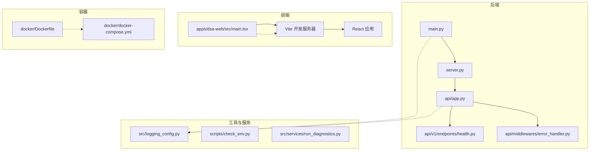
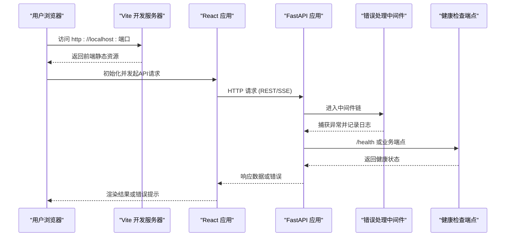
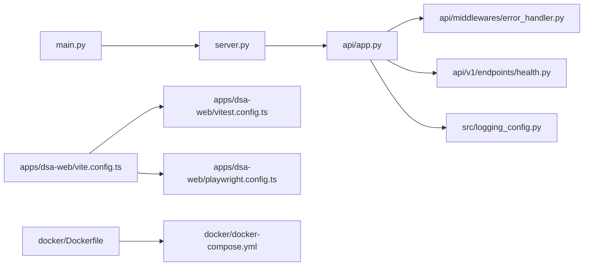

# 调试工具

<cite>
**本文引用的文件**   
- [main.py](file://main.py)
- [server.py](file://server.py)
- [logging_config.py](file://src/logging_config.py)
- [check_env.py](file://scripts/check_env.py)
- [run_diagnostics.py](file://src/services/run_diagnostics.py)
- [app.py](file://api/app.py)
- [error_handler.py](file://api/middlewares/error_handler.py)
- [health.py](file://api/v1/endpoints/health.py)
- [webui_frontend.py](file://src/webui_frontend.py)
- [vite.config.ts](file://apps/dsa-web/vite.config.ts)
- [vitest.config.ts](file://apps/dsa-web/vitest.config.ts)
- [playwright.config.ts](file://apps/dsa-web/playwright.config.ts)
- [docker-compose.yml](file://docker/docker-compose.yml)
- [Dockerfile](file://docker/Dockerfile)
</cite>

## 目录
1. [简介](#简介)
2. [项目结构](#项目结构)
3. [核心组件](#核心组件)
4. [架构总览](#架构总览)
5. [详细组件分析](#详细组件分析)
6. [依赖关系分析](#依赖关系分析)
7. [性能考虑](#性能考虑)
8. [故障排查指南](#故障排查指南)
9. [结论](#结论)
10. [附录](#附录)

## 简介
本文件面向Daily Stock Analysis项目的开发与运维人员，系统化梳理后端与前端调试方法、日志体系配置与分析、诊断与健康检查工具、以及性能分析手段。内容覆盖Python调试器（pdb）使用、断点与变量检查；前端Chrome DevTools与React Developer Tools、网络请求调试；结构化日志与聚合；环境检查脚本与系统健康检查；内存泄漏检测与CPU性能分析；常见问题定位技巧。

## 项目结构
本项目采用前后端分离架构：
- 后端：FastAPI应用，位于api目录，入口为main.py/server.py，中间件包含错误处理与认证等。
- 前端：Web应用位于apps/dsa-web，构建与测试由Vite/Vitest/Playwright管理。
- 服务与工具：src目录下包含业务服务、日志配置、诊断服务等；scripts目录提供环境与静态资源检查脚本。
- 容器化：docker目录提供Docker镜像与编排文件。

图表来源
- [main.py:1-20](file://main.py#L1-L20)
- [server.py:1-20](file://server.py#L1-L20)
- [app.py:1-20](file://api/app.py#L1-L20)
- [error_handler.py:1-20](file://api/middlewares/error_handler.py#L1-L20)
- [health.py:1-20](file://api/v1/endpoints/health.py#L1-L20)
- [webui_frontend.py:1-20](file://src/webui_frontend.py#L1-L20)
- [vite.config.ts:1-20](file://apps/dsa-web/vite.config.ts#L1-L20)
- [vitest.config.ts:1-20](file://apps/dsa-web/vitest.config.ts#L1-L20)
- [playwright.config.ts:1-20](file://apps/dsa-web/playwright.config.ts#L1-L20)
- [docker-compose.yml:1-20](file://docker/docker-compose.yml#L1-L20)
- [Dockerfile:1-20](file://docker/Dockerfile#L1-L20)

章节来源
- [main.py:1-20](file://main.py#L1-L20)
- [server.py:1-20](file://server.py#L1-L20)
- [app.py:1-20](file://api/app.py#L1-L20)
- [error_handler.py:1-20](file://api/middlewares/error_handler.py#L1-L20)
- [health.py:1-20](file://api/v1/endpoints/health.py#L1-L20)
- [webui_frontend.py:1-20](file://src/webui_frontend.py#L1-L20)
- [vite.config.ts:1-20](file://apps/dsa-web/vite.config.ts#L1-L20)
- [vitest.config.ts:1-20](file://apps/dsa-web/vitest.config.ts#L1-L20)
- [playwright.config.ts:1-20](file://apps/dsa-web/playwright.config.ts#L1-L20)
- [docker-compose.yml:1-20](file://docker/docker-compose.yml#L1-L20)
- [Dockerfile:1-20](file://docker/Dockerfile#L1-L20)

## 核心组件
- Python调试器（pdb）：用于后端代码级断点、调用栈查看、变量检查与单步执行。
- 前端调试（Chrome DevTools + React Developer Tools）：用于DOM/状态/网络请求/性能面板分析。
- 日志系统：集中式配置、分级输出、结构化日志与聚合采集。
- 诊断与健康检查：环境检查脚本、运行时诊断服务、健康端点。
- 性能分析：内存与CPU分析工具集成到本地与容器环境。

章节来源
- [logging_config.py:1-20](file://src/logging_config.py#L1-L20)
- [check_env.py:1-20](file://scripts/check_env.py#L1-L20)
- [run_diagnostics.py:1-20](file://src/services/run_diagnostics.py#L1-L20)
- [health.py:1-20](file://api/v1/endpoints/health.py#L1-L20)
- [vite.config.ts:1-20](file://apps/dsa-web/vite.config.ts#L1-L20)
- [vitest.config.ts:1-20](file://apps/dsa-web/vitest.config.ts#L1-L20)
- [playwright.config.ts:1-20](file://apps/dsa-web/playwright.config.ts#L1-L20)

## 架构总览
下图展示从浏览器到后端API的完整调试链路，包括前端构建、代理转发、中间件错误处理与健康检查。

图表来源
- [vite.config.ts:1-20](file://apps/dsa-web/vite.config.ts#L1-L20)
- [app.py:1-20](file://api/app.py#L1-L20)
- [error_handler.py:1-20](file://api/middlewares/error_handler.py#L1-L20)
- [health.py:1-20](file://api/v1/endpoints/health.py#L1-L20)

## 详细组件分析

### Python调试器（pdb）与断点设置
- 启动方式：在入口脚本中启用交互式调试，或在运行命令时附加调试参数。
- 断点设置：在关键函数或异常路径插入断点，便于观察调用上下文。
- 变量检查：在断点处打印/检查局部变量、全局变量与对象属性。
- 单步执行：逐步执行代码，跟踪控制流与分支逻辑。
- 适用场景：接口异常、数据处理错误、异步任务失败等。

建议实践
- 在API路由与核心服务方法入口处设置断点，快速定位问题。
- 结合日志级别调整，避免过多冗余输出影响调试效率。
- 对第三方库调用进行隔离，必要时替换为Mock以简化复现。

章节来源
- [main.py:1-20](file://main.py#L1-L20)
- [server.py:1-20](file://server.py#L1-L20)
- [app.py:1-20](file://api/app.py#L1-L20)

### 前端调试技巧（Chrome DevTools + React Developer Tools）
- 网络请求调试：查看请求头、响应体、耗时与重试策略，定位跨域与鉴权问题。
- DOM与样式：检查元素树、CSS规则与动画，验证UI渲染与布局。
- React状态：通过React Developer Tools查看组件状态、Props与Hooks调用。
- 性能面板：录制页面加载与交互，识别重渲染与长任务。
- 控制台日志：结合结构化日志与前端日志库，统一追踪问题。

建议实践
- 在Vite开发模式下开启Source Map，便于源码级调试。
- 对SSE或WebSocket连接，使用Network面板过滤与持久化日志。
- 使用Performance面板录制关键操作，定位卡顿与内存增长。

章节来源
- [vite.config.ts:1-20](file://apps/dsa-web/vite.config.ts#L1-L20)
- [vitest.config.ts:1-20](file://apps/dsa-web/vitest.config.ts#L1-L20)
- [playwright.config.ts:1-20](file://apps/dsa-web/playwright.config.ts#L1-L20)

### 日志系统配置与分析
- 日志级别：DEBUG/INFO/WARNING/ERROR，按模块与环境动态切换。
- 结构化日志：JSON格式输出，便于聚合与检索。
- 输出目标：控制台、文件、外部日志服务（如ELK/Cloud Logging）。
- 采样与限流：在高并发场景下限制日志量，避免I/O瓶颈。
- 关联ID：为每个请求分配唯一ID，贯穿前后端链路。

建议实践
- 在生产环境默认INFO级别，按需提升为DEBUG进行问题定位。
- 对敏感字段进行脱敏处理，避免泄露。
- 使用统一的日志门面，屏蔽底层实现差异。

章节来源
- [logging_config.py:1-20](file://src/logging_config.py#L1-L20)
- [error_handler.py:1-20](file://api/middlewares/error_handler.py#L1-L20)

### 诊断工具与环境检查
- 环境检查脚本：校验依赖版本、环境变量、路径权限与外部服务连通性。
- 运行时诊断服务：收集进程信息、内存占用、线程状态与队列长度。
- 健康检查端点：暴露系统就绪、依赖健康与指标摘要。
- 自动化巡检：定时执行诊断任务，生成报告并告警。

建议实践
- 将环境检查纳入CI流水线，提前发现配置错误。
- 健康端点配合负载均衡与健康探针，实现自动恢复。
- 诊断报告归档，便于回溯与趋势分析。

章节来源
- [check_env.py:1-20](file://scripts/check_env.py#L1-L20)
- [run_diagnostics.py:1-20](file://src/services/run_diagnostics.py#L1-L20)
- [health.py:1-20](file://api/v1/endpoints/health.py#L1-L20)

### 性能分析工具（内存与CPU）
- 内存分析：使用tracemalloc/memory_profiler定位泄漏与高占用对象。
- CPU分析：使用cProfile/py-spy/sketch profiling识别热点函数与阻塞调用。
- 前端性能：使用Chrome Performance面板与React Profiler分析渲染成本。
- 容器内分析：在Docker环境中注入分析工具，避免环境差异。

建议实践
- 在压测或生产副本环境进行性能分析，避免影响线上服务。
- 结合APM与分布式追踪，建立端到端性能基线。
- 定期回归性能测试，防止退化。

章节来源
- [Dockerfile:1-20](file://docker/Dockerfile#L1-L20)
- [docker-compose.yml:1-20](file://docker/docker-compose.yml#L1-L20)

## 依赖关系分析
后端模块间依赖清晰，中间件与端点解耦，便于独立调试与测试。前端构建与测试工具链稳定，支持源码映射与热更新。

图表来源
- [main.py:1-20](file://main.py#L1-L20)
- [server.py:1-20](file://server.py#L1-L20)
- [app.py:1-20](file://api/app.py#L1-L20)
- [error_handler.py:1-20](file://api/middlewares/error_handler.py#L1-L20)
- [health.py:1-20](file://api/v1/endpoints/health.py#L1-L20)
- [logging_config.py:1-20](file://src/logging_config.py#L1-L20)
- [vite.config.ts:1-20](file://apps/dsa-web/vite.config.ts#L1-L20)
- [vitest.config.ts:1-20](file://apps/dsa-web/vitest.config.ts#L1-L20)
- [playwright.config.ts:1-20](file://apps/dsa-web/playwright.config.ts#L1-L20)
- [Dockerfile:1-20](file://docker/Dockerfile#L1-L20)
- [docker-compose.yml:1-20](file://docker/docker-compose.yml#L1-L20)

章节来源
- [app.py:1-20](file://api/app.py#L1-L20)
- [error_handler.py:1-20](file://api/middlewares/error_handler.py#L1-L20)
- [health.py:1-20](file://api/v1/endpoints/health.py#L1-L20)
- [logging_config.py:1-20](file://src/logging_config.py#L1-L20)
- [vite.config.ts:1-20](file://apps/dsa-web/vite.config.ts#L1-L20)
- [vitest.config.ts:1-20](file://apps/dsa-web/vitest.config.ts#L1-L20)
- [playwright.config.ts:1-20](file://apps/dsa-web/playwright.config.ts#L1-L20)
- [Dockerfile:1-20](file://docker/Dockerfile#L1-L20)
- [docker-compose.yml:1-20](file://docker/docker-compose.yml#L1-L20)

## 性能考虑
- 日志I/O优化：批量写入、异步落盘与采样策略，降低对主流程的影响。
- 前端渲染优化：减少不必要的重渲染，使用虚拟列表与懒加载。
- 网络请求优化：合并请求、缓存与重试退避，提升用户体验。
- 容器资源限制：合理设置CPU与内存配额，避免资源争用。

[本节为通用指导，不直接分析具体文件]

## 故障排查指南
- 接口异常：通过错误处理中间件捕获异常，结合结构化日志定位根因。
- 前端报错：使用Console与Network面板查看错误堆栈与请求详情。
- 环境问题：运行环境检查脚本，确认依赖、环境变量与权限。
- 性能问题：使用性能分析工具录制关键路径，识别瓶颈。
- 健康检查：调用健康端点，确认服务与依赖状态。

章节来源
- [error_handler.py:1-20](file://api/middlewares/error_handler.py#L1-L20)
- [health.py:1-20](file://api/v1/endpoints/health.py#L1-L20)
- [check_env.py:1-20](file://scripts/check_env.py#L1-L20)
- [run_diagnostics.py:1-20](file://src/services/run_diagnostics.py#L1-L20)

## 结论
通过系统化的调试工具与方法，可显著提升Daily Stock Analysis项目的开发与运维效率。建议将调试与诊断能力融入日常流程，形成闭环的问题定位与性能优化机制。

[本节为总结性内容，不直接分析具体文件]

## 附录
- 常用命令参考：启动后端调试、运行前端开发服务器、执行环境检查与诊断任务。
- 最佳实践清单：日志规范、断点策略、性能分析步骤与健康检查频率。
- 参考资料链接：官方文档与社区教程，便于深入学习。

[本节为补充信息，不直接分析具体文件]