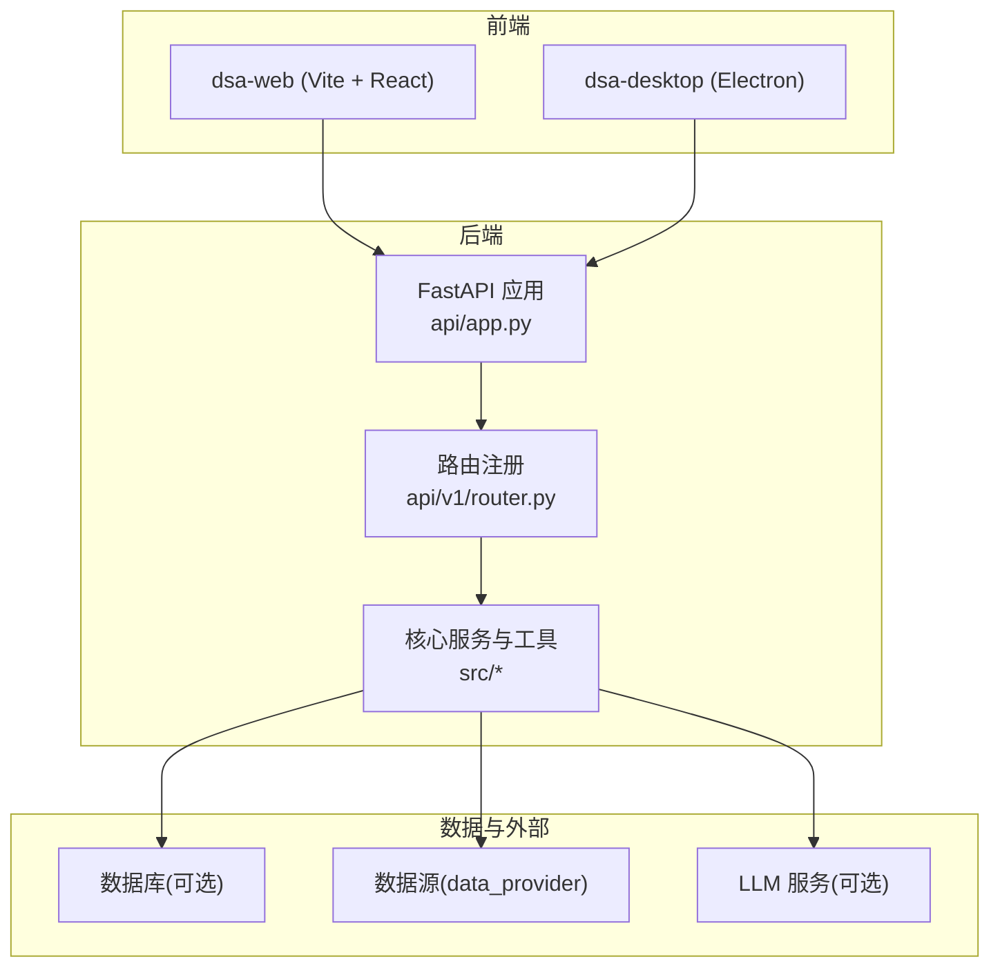
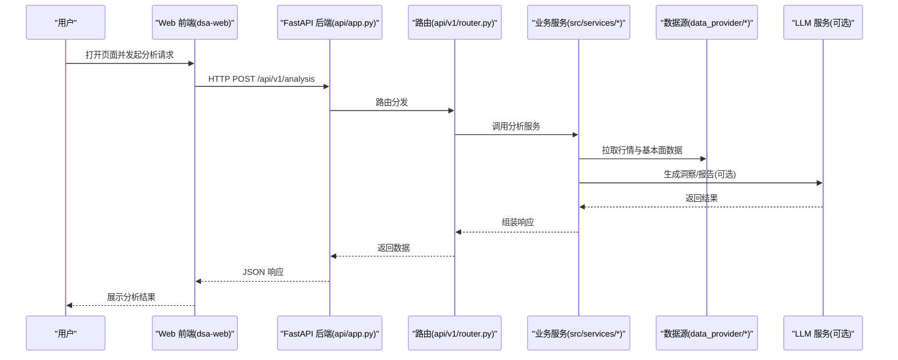
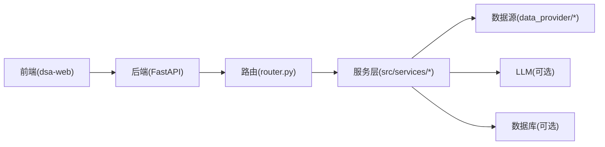

# 快速开始

<cite>
**本文引用的文件**   
- [README.md](file://README.md)
- [pyproject.toml](file://pyproject.toml)
- [requirements.txt](file://requirements.txt)
- [server.py](file://server.py)
- [main.py](file://main.py)
- [webui.py](file://webui.py)
- [docker/Dockerfile](file://docker/Dockerfile)
- [docker/docker-compose.yml](file://docker/docker-compose.yml)
- [docker/entrypoint.sh](file://docker/entrypoint.sh)
- [api/app.py](file://api/app.py)
- [api/v1/router.py](file://api/v1/router.py)
- [src/config.py](file://src/config.py)
- [apps/dsa-web/package.json](file://apps/dsa-web/package.json)
- [apps/dsa-desktop/package.json](file://apps/dsa-desktop/package.json)
- [scripts/check_env.py](file://scripts/check_env.py)
</cite>

## 目录
1. [简介](#简介)
2. [项目结构](#项目结构)
3. [核心组件](#核心组件)
4. [架构总览](#架构总览)
5. [详细组件分析](#详细组件分析)
6. [依赖关系分析](#依赖关系分析)
7. [性能注意事项](#性能注意事项)
8. [故障排查指南](#故障排查指南)
9. [结论](#结论)
10. [附录](#附录)

## 简介
本快速开始指南面向首次接触 Daily Stock Analysis 的用户，目标是帮助你在最短时间内完成本地环境搭建、配置与运行，并通过 Web 界面或 API 完成一次最小化的股票分析任务。内容涵盖：
- 环境要求（Python、Node.js、数据库等）
- 本地开发环境搭建步骤（依赖安装、配置文件设置、数据库初始化）
- Docker 容器化部署的快速启动方式与常用命令
- Web 界面与 API 的访问方法、基本功能验证
- 常见环境配置问题与解决方案
- 最小化配置示例，帮助你快速运行第一个分析任务

## 项目结构
Daily Stock Analysis 采用前后端分离与多应用组织方式：
- 后端服务：FastAPI 应用位于 api 目录，入口由 server.py/main.py/webui.py 提供
- 前端应用：Web 应用位于 apps/dsa-web，桌面应用位于 apps/dsa-desktop
- 业务逻辑：src 目录包含分析引擎、服务层、存储与工具
- 数据源：data_provider 提供多种金融数据获取器
- 机器人：bot 提供多平台消息机器人能力
- 策略与模板：strategies 与 templates 定义策略与报告模板
- 容器化：docker 目录包含 Dockerfile、docker-compose 与启动脚本
- 文档与脚本：docs 与 scripts 提供部署说明与辅助脚本

图表来源
- [api/app.py](file://api/app.py)
- [api/v1/router.py](file://api/v1/router.py)
- [apps/dsa-web/package.json](file://apps/dsa-web/package.json)
- [apps/dsa-desktop/package.json](file://apps/dsa-desktop/package.json)

章节来源
- [README.md](file://README.md)
- [pyproject.toml](file://pyproject.toml)
- [requirements.txt](file://requirements.txt)

## 核心组件
- 后端服务：基于 FastAPI 的 REST API，提供分析、回测、历史、组合、系统配置等接口
- 前端界面：Web 应用提供可视化与分析流程编排；桌面应用提供跨平台客户端体验
- 数据获取：通过 data_provider 适配多种数据源（如 yfinance、tushare、akshare 等）
- 分析与执行：src/services 与 src/agent 实现分析流水线、策略执行与通知
- 配置管理：src/config.py 集中管理环境变量与运行时配置
- 容器化：Dockerfile 与 docker-compose 支持一键拉起服务

章节来源
- [api/app.py](file://api/app.py)
- [api/v1/router.py](file://api/v1/router.py)
- [src/config.py](file://src/config.py)
- [apps/dsa-web/package.json](file://apps/dsa-web/package.json)
- [apps/dsa-desktop/package.json](file://apps/dsa-desktop/package.json)

## 架构总览
下图展示了从前端到后端、再到数据源与外部服务的整体交互流程。

图表来源
- [api/app.py](file://api/app.py)
- [api/v1/router.py](file://api/v1/router.py)
- [src/config.py](file://src/config.py)

## 详细组件分析

### 环境要求与依赖安装
- Python 版本：建议使用 Python 3.10+（参考 pyproject.toml 中的版本约束）
- Node.js 版本：建议使用 Node.js 18+（参考 dsa-web 与 dsa-desktop 的 package.json）
- 数据库：根据使用场景选择 SQLite（默认）或 PostgreSQL（生产推荐），在配置中指定连接信息
- 数据源密钥：如需特定数据源（如 Tushare、Alpha Vantage、Longbridge 等），需在环境变量中配置对应密钥
- LLM 服务（可选）：如需要 AI 分析能力，需配置 LiteLLM 或其他兼容后端

安装步骤概览：
- 克隆仓库后进入项目根目录
- 安装 Python 依赖：使用 pip 或 uv 安装 requirements.txt 或 pyproject.toml 中的依赖
- 安装前端依赖：进入 apps/dsa-web 与 apps/dsa-desktop，分别执行 npm install
- 配置环境变量：复制 .env.example（如有）或参考 src/config.py 中的键名设置必要变量
- 初始化数据库：按所选数据库类型执行迁移或建表（若使用 SQLite，通常无需额外操作）

章节来源
- [pyproject.toml](file://pyproject.toml)
- [requirements.txt](file://requirements.txt)
- [apps/dsa-web/package.json](file://apps/dsa-web/package.json)
- [apps/dsa-desktop/package.json](file://apps/dsa-desktop/package.json)
- [src/config.py](file://src/config.py)

### 本地开发环境搭建
- 启动后端服务：
  - 使用 server.py 或 main.py 作为后端入口，确保已配置必要的环境变量
  - 访问健康检查接口以确认服务正常
- 启动前端开发服务器：
  - 进入 apps/dsa-web，执行 npm run dev
  - 浏览器访问 http://localhost:5173（或 vite.config.ts 中配置的端口）
- 桌面应用开发：
  - 进入 apps/dsa-desktop，执行 npm run dev 或相应脚本
- 数据库初始化：
  - 如使用 SQLite，确保数据目录可写
  - 如使用 PostgreSQL，创建数据库并执行迁移脚本（若有）

章节来源
- [server.py](file://server.py)
- [main.py](file://main.py)
- [webui.py](file://webui.py)
- [api/app.py](file://api/app.py)
- [api/v1/router.py](file://api/v1/router.py)

### Docker 容器化部署
- 构建镜像：
  - 在项目根目录执行 docker build -f docker/Dockerfile -t daily-stock-analysis .
- 使用 docker-compose 启动：
  - 执行 docker compose up -d
  - 查看日志：docker compose logs -f
- 常用命令：
  - 停止服务：docker compose down
  - 重启服务：docker compose restart
  - 进入容器：docker compose exec <service_name> bash

章节来源
- [docker/Dockerfile](file://docker/Dockerfile)
- [docker/docker-compose.yml](file://docker/docker-compose.yml)
- [docker/entrypoint.sh](file://docker/entrypoint.sh)

### 访问 Web 界面与 API
- Web 界面：
  - 本地开发：http://localhost:5173（或 vite.config.ts 中配置的端口）
  - Docker 部署：访问宿主机的映射端口（例如 http://localhost:80）
- API 接口：
  - 健康检查：GET /api/v1/health
  - 分析接口：POST /api/v1/analysis（具体参数请参考 schemas/analysis.py）
  - 其他接口：通过 router.py 中注册的路径访问

章节来源
- [api/v1/router.py](file://api/v1/router.py)
- [api/v1/schemas/analysis.py](file://api/v1/schemas/analysis.py)

### 最小化配置示例
- 环境变量（示例键名，具体值请根据你的环境填写）：
  - DATABASE_URL=sqlite:///./data/db.sqlite3
  - DATA_SOURCE_API_KEY=your_api_key
  - LLM_BACKEND=litellm
  - LLM_MODEL=openai/gpt-4o-mini
- 启动顺序：
  - 先启动后端服务，确认健康检查通过
  - 再启动前端开发服务器
  - 在 Web 界面中选择一只股票并提交分析任务

章节来源
- [src/config.py](file://src/config.py)
- [scripts/check_env.py](file://scripts/check_env.py)

## 依赖关系分析
- 后端依赖：FastAPI、Uvicorn、SQLAlchemy（可选）、Pydantic、HTTP 客户端库等
- 前端依赖：React、Vite、TypeScript、Tailwind CSS 等
- 数据源依赖：yfinance、tushare、akshare、finnhub 等（按需启用）
- LLM 依赖：LiteLLM 或兼容后端（可选）

图表来源
- [api/v1/router.py](file://api/v1/router.py)
- [src/config.py](file://src/config.py)

章节来源
- [requirements.txt](file://requirements.txt)
- [pyproject.toml](file://pyproject.toml)
- [apps/dsa-web/package.json](file://apps/dsa-web/package.json)

## 性能注意事项
- 数据源限流：合理设置请求间隔与重试策略，避免触发第三方 API 限制
- 缓存策略：对热点数据（如指数列表、股票名称映射）启用缓存以减少重复请求
- 并发控制：分析任务与通知发送应使用队列或线程池进行限流
- 资源监控：关注 CPU、内存与磁盘 I/O，必要时调整进程数与线程数

[本节为通用指导，不直接分析具体文件]

## 故障排查指南
- 常见问题：
  - 端口占用：修改 vite.config.ts 或后端监听端口
  - 环境变量缺失：使用 scripts/check_env.py 检查必要变量是否齐全
  - 数据源不可用：检查 API Key 与网络连通性
  - 数据库连接失败：确认连接字符串与权限
- 调试建议：
  - 查看后端日志与前端控制台输出
  - 使用健康检查接口定位服务状态
  - 逐步禁用可选依赖（如 LLM）以缩小问题范围

章节来源
- [scripts/check_env.py](file://scripts/check_env.py)
- [api/v1/router.py](file://api/v1/router.py)

## 结论
通过以上步骤，你可以在本地或容器中快速搭建 Daily Stock Analysis 的运行环境，并完成一次最小化的分析任务。建议在熟悉基础用法后，逐步探索高级功能（如策略配置、通知集成、多数据源切换等）。

[本节为总结，不直接分析具体文件]

## 附录
- 相关文档：
  - README.md：项目概述与使用说明
  - docs/DEPLOY.md：部署指南
  - docs/beginner-client-setup.md：客户端设置入门
- 常用命令汇总：
  - 后端启动：python server.py 或 python main.py
  - 前端开发：cd apps/dsa-web && npm run dev
  - Docker 启动：docker compose up -d

章节来源
- [README.md](file://README.md)
- [docs/DEPLOY.md](file://docs/DEPLOY.md)
- [docs/beginner-client-setup.md](file://docs/beginner-client-setup.md)