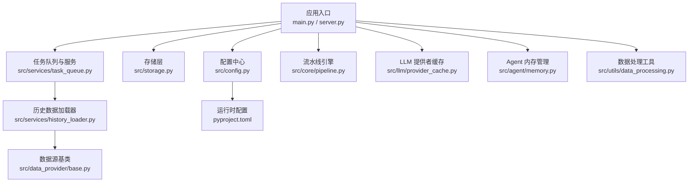
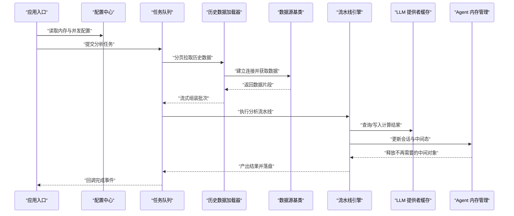
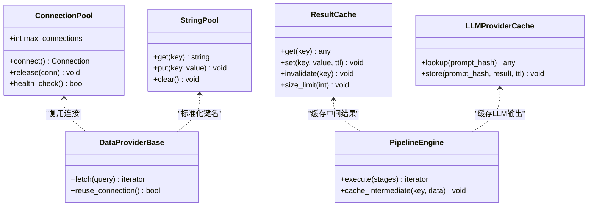
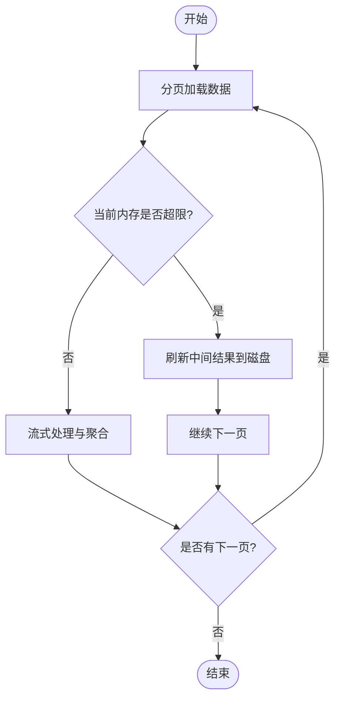
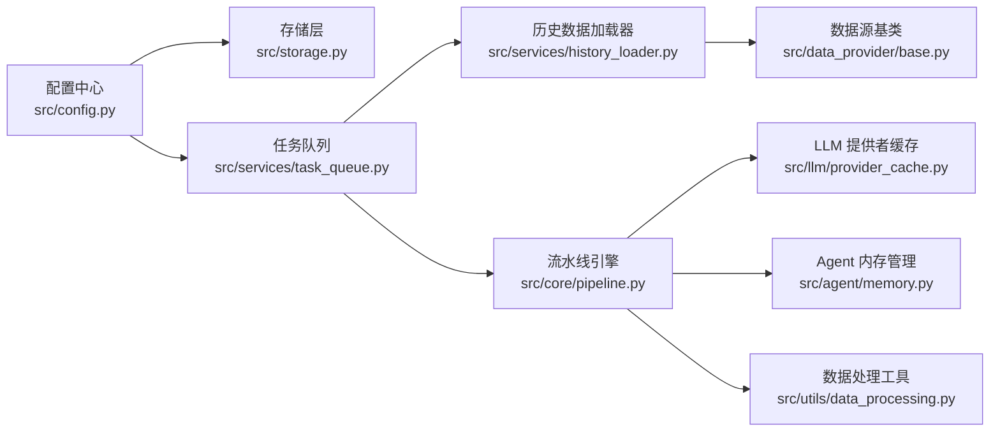

# 内存管理

<cite>
**本文引用的文件**   
- [main.py](file://main.py)
- [server.py](file://server.py)
- [src/config.py](file://src/config.py)
- [src/storage.py](file://src/storage.py)
- [src/agent/memory.py](file://src/agent/memory.py)
- [src/services/task_queue.py](file://src/services/task_queue.py)
- [src/services/history_loader.py](file://src/services/history_loader.py)
- [src/data_provider/base.py](file://src/data_provider/base.py)
- [src/core/pipeline.py](file://src/core/pipeline.py)
- [src/llm/provider_cache.py](file://src/llm/provider_cache.py)
- [src/utils/data_processing.py](file://src/utils/data_processing.py)
- [pyproject.toml](file://pyproject.toml)
</cite>

## 目录
1. [简介](#简介)
2. [项目结构](#项目结构)
3. [核心组件](#核心组件)
4. [架构总览](#架构总览)
5. [详细组件分析](#详细组件分析)
6. [依赖关系分析](#依赖关系分析)
7. [性能考量](#性能考量)
8. [故障排查指南](#故障排查指南)
9. [结论](#结论)
10. [附录](#附录)

## 简介
本文件围绕 Daily Stock Analysis 项目的内存管理进行系统化说明，重点覆盖：
- 对象池化技术：连接池、字符串池与计算结果缓存
- 垃圾回收调优：GC 参数配置、内存泄漏检测与堆栈分析
- 大数据集处理优化：流式处理、分页加载与内存映射文件
- Python 特定内存优化：__slots__、弱引用与循环引用避免
- 内存监控工具：内存使用分析、性能剖析与泄漏检测
- 长时间运行进程的内存管理最佳实践

## 项目结构
Daily Stock Analysis 采用分层模块化设计，后端服务入口、配置、存储、数据源、任务队列、LLM 缓存与数据处理等模块共同构成内存管理的核心。下图展示了与内存管理密切相关的模块及其交互关系。

图表来源 
- [main.py:1-200](file://main.py#L1-L200)
- [server.py:1-200](file://server.py#L1-L200)
- [src/config.py:1-200](file://src/config.py#L1-L200)
- [src/storage.py:1-200](file://src/storage.py#L1-L200)
- [src/services/task_queue.py:1-200](file://src/services/task_queue.py#L1-L200)
- [src/services/history_loader.py:1-200](file://src/services/history_loader.py#L1-L200)
- [src/data_provider/base.py:1-200](file://src/data_provider/base.py#L1-L200)
- [src/core/pipeline.py:1-200](file://src/core/pipeline.py#L1-L200)
- [src/llm/provider_cache.py:1-200](file://src/llm/provider_cache.py#L1-L200)
- [src/agent/memory.py:1-200](file://src/agent/memory.py#L1-L200)
- [src/utils/data_processing.py:1-200](file://src/utils/data_processing.py#L1-L200)
- [pyproject.toml:1-200](file://pyproject.toml#L1-L200)

章节来源
- [main.py:1-200](file://main.py#L1-L200)
- [server.py:1-200](file://server.py#L1-L200)
- [src/config.py:1-200](file://src/config.py#L1-L200)
- [src/storage.py:1-200](file://src/storage.py#L1-L200)
- [src/services/task_queue.py:1-200](file://src/services/task_queue.py#L1-L200)
- [src/services/history_loader.py:1-200](file://src/services/history_loader.py#L1-L200)
- [src/data_provider/base.py:1-200](file://src/data_provider/base.py#L1-L200)
- [src/core/pipeline.py:1-200](file://src/core/pipeline.py#L1-L200)
- [src/llm/provider_cache.py:1-200](file://src/llm/provider_cache.py#L1-L200)
- [src/agent/memory.py:1-200](file://src/agent/memory.py#L1-L200)
- [src/utils/data_processing.py:1-200](file://src/utils/data_processing.py#L1-L200)
- [pyproject.toml:1-200](file://pyproject.toml#L1-L200)

## 核心组件
- 配置中心（src/config.py）：集中管理内存相关参数（如连接池大小、缓存上限、批大小、并发度），为其他模块提供统一读取接口。
- 存储层（src/storage.py）：负责持久化与临时缓存策略，支持按时间窗口或键空间分片，降低热点对象的常驻内存。
- 任务队列（src/services/task_queue.py）：控制任务消费速率与内存水位，结合背压机制防止突发负载导致 OOM。
- 历史数据加载器（src/services/history_loader.py）：实现分页加载与流式读取，避免一次性载入大表。
- 数据源基类（src/data_provider/base.py）：抽象网络请求与本地缓存，统一超时、重试与连接复用策略。
- 流水线引擎（src/core/pipeline.py）：编排多阶段数据处理，支持中间结果按需释放与增量更新。
- LLM 提供者缓存（src/llm/provider_cache.py）：对模型调用结果与上下文进行缓存，限制最大条目与过期策略。
- Agent 内存管理（src/agent/memory.py）：维护会话上下文、工具状态与中间态，提供清理与回收钩子。
- 数据处理工具（src/utils/data_processing.py）：通用流式转换、去重与聚合函数，减少中间副本。

章节来源
- [src/config.py:1-200](file://src/config.py#L1-L200)
- [src/storage.py:1-200](file://src/storage.py#L1-L200)
- [src/services/task_queue.py:1-200](file://src/services/task_queue.py#L1-L200)
- [src/services/history_loader.py:1-200](file://src/services/history_loader.py#L1-L200)
- [src/data_provider/base.py:1-200](file://src/data_provider/base.py#L1-L200)
- [src/core/pipeline.py:1-200](file://src/core/pipeline.py#L1-L200)
- [src/llm/provider_cache.py:1-200](file://src/llm/provider_cache.py#L1-L200)
- [src/agent/memory.py:1-200](file://src/agent/memory.py#L1-L200)
- [src/utils/data_processing.py:1-200](file://src/utils/data_processing.py#L1-L200)

## 架构总览
下图展示内存管理在整体架构中的位置与关键路径：从应用入口到配置、存储、任务队列、数据加载、数据源、流水线、LLM 缓存与 Agent 内存的完整链路。

图表来源 
- [main.py:1-200](file://main.py#L1-L200)
- [src/config.py:1-200](file://src/config.py#L1-L200)
- [src/services/task_queue.py:1-200](file://src/services/task_queue.py#L1-L200)
- [src/services/history_loader.py:1-200](file://src/services/history_loader.py#L1-L200)
- [src/data_provider/base.py:1-200](file://src/data_provider/base.py#L1-L200)
- [src/core/pipeline.py:1-200](file://src/core/pipeline.py#L1-L200)
- [src/llm/provider_cache.py:1-200](file://src/llm/provider_cache.py#L1-L200)
- [src/agent/memory.py:1-200](file://src/agent/memory.py#L1-L200)

## 详细组件分析

### 对象池化技术
- 连接池
  - 目标：复用数据库/HTTP/消息通道连接，减少握手与分配开销。
  - 关键点：最大连接数、空闲超时、健康检查、错误回退。
  - 集成点：数据源基类（连接创建与复用）、任务队列（并发度控制）。
- 字符串池
  - 目标：减少重复短字符串的分配与复制。
  - 关键点：符号化常量、字典映射、避免频繁拼接。
  - 集成点：配置中心（枚举与键名）、数据处理工具（标准化字段名）。
- 计算结果缓存
  - 目标：缓存高频指标与中间结果，降低重复计算。
  - 关键点：LRU/TTL、键空间隔离、失效策略、内存上限。
  - 集成点：LLM 提供者缓存、流水线引擎（中间结果缓存）、存储层（持久化缓存）。

图表来源 
- [src/data_provider/base.py:1-200](file://src/data_provider/base.py#L1-L200)
- [src/core/pipeline.py:1-200](file://src/core/pipeline.py#L1-L200)
- [src/llm/provider_cache.py:1-200](file://src/llm/provider_cache.py#L1-L200)
- [src/utils/data_processing.py:1-200](file://src/utils/data_processing.py#L1-L200)

章节来源
- [src/data_provider/base.py:1-200](file://src/data_provider/base.py#L1-L200)
- [src/core/pipeline.py:1-200](file://src/core/pipeline.py#L1-L200)
- [src/llm/provider_cache.py:1-200](file://src/llm/provider_cache.py#L1-L200)
- [src/utils/data_processing.py:1-200](file://src/utils/data_processing.py#L1-L200)

### 垃圾回收调优
- GC 参数配置
  - 关注点：触发阈值、代际切换、暂停时间、碎片率。
  - 建议：根据工作负载调整阈值，避免频繁 Full GC；对长生命周期对象启用显式清理。
- 内存泄漏检测
  - 方法：引用计数追踪、弱引用探测、快照对比、增量采样。
  - 工具：内置 gc 模块、第三方库（如 objgraph、tracemalloc）。
- 堆栈分析
  - 方法：生成堆转储、定位热点对象、回溯持有者链。
  - 场景：长时间运行的服务进程、批量任务执行后内存未回落。

章节来源
- [src/config.py:1-200](file://src/config.py#L1-L200)
- [src/agent/memory.py:1-200](file://src/agent/memory.py#L1-L200)

### 大数据集处理优化
- 流式处理
  - 目标：以迭代器/生成器方式逐步消费数据，避免一次性加载。
  - 要点：缓冲大小、背压、异常恢复。
- 分页加载
  - 目标：按页拉取并合并，控制单次内存峰值。
  - 要点：页大小、游标/偏移、去重策略。
- 内存映射文件
  - 目标：将大文件映射到虚拟内存，按需访问。
  - 要点：平台兼容性、读写权限、同步策略。

图表来源 
- [src/services/history_loader.py:1-200](file://src/services/history_loader.py#L1-L200)
- [src/utils/data_processing.py:1-200](file://src/utils/data_processing.py#L1-L200)

章节来源
- [src/services/history_loader.py:1-200](file://src/services/history_loader.py#L1-L200)
- [src/utils/data_processing.py:1-200](file://src/utils/data_processing.py#L1-L200)

### Python 特定的内存优化
- __slots__
  - 适用：大量小对象（如行情快照、指标对象），减少属性字典开销。
  - 注意：继承与动态属性的权衡。
- 弱引用
  - 适用：缓存与观察者模式，避免强引用导致的循环与无法回收。
  - 工具：weakref 模块，配合 TTL 清理。
- 循环引用避免
  - 策略：解耦父子关系、使用事件总线、及时断开回调。
  - 检测：gc.get_referrers、tracemalloc 快照对比。

章节来源
- [src/agent/memory.py:1-200](file://src/agent/memory.py#L1-L200)
- [src/utils/data_processing.py:1-200](file://src/utils/data_processing.py#L1-L200)

### 内存监控工具
- 内存使用分析
  - 指标：RSS、VMS、堆占用、对象数量分布。
  - 采集：psutil、tracemalloc、gc 统计。
- 性能剖析
  - 方法：cProfile、line_profiler、memory_profiler。
  - 场景：热点函数定位、内存增长曲线分析。
- 泄漏检测
  - 方法：周期性快照对比、引用图分析、对象存活率评估。
  - 自动化：定时任务触发分析并上报告警。

章节来源
- [src/config.py:1-200](file://src/config.py#L1-L200)
- [src/services/task_queue.py:1-200](file://src/services/task_queue.py#L1-L200)

### 长时间运行进程的内存管理最佳实践
- 定期清理：任务完成后主动释放中间对象，避免累积。
- 限流与背压：控制并发与队列长度，防止突发流量导致 OOM。
- 健康检查：监控内存水位与 GC 频率，自动降级或重启。
- 可观测性：埋点关键路径的内存变化，形成趋势与告警。

章节来源
- [src/services/task_queue.py:1-200](file://src/services/task_queue.py#L1-L200)
- [src/core/pipeline.py:1-200](file://src/core/pipeline.py#L1-L200)

## 依赖关系分析
下图展示内存管理相关模块之间的依赖关系，帮助识别耦合与潜在循环依赖。

图表来源 
- [src/config.py:1-200](file://src/config.py#L1-L200)
- [src/storage.py:1-200](file://src/storage.py#L1-L200)
- [src/services/task_queue.py:1-200](file://src/services/task_queue.py#L1-L200)
- [src/services/history_loader.py:1-200](file://src/services/history_loader.py#L1-L200)
- [src/data_provider/base.py:1-200](file://src/data_provider/base.py#L1-L200)
- [src/core/pipeline.py:1-200](file://src/core/pipeline.py#L1-L200)
- [src/llm/provider_cache.py:1-200](file://src/llm/provider_cache.py#L1-L200)
- [src/agent/memory.py:1-200](file://src/agent/memory.py#L1-L200)
- [src/utils/data_processing.py:1-200](file://src/utils/data_processing.py#L1-L200)

章节来源
- [src/config.py:1-200](file://src/config.py#L1-L200)
- [src/storage.py:1-200](file://src/storage.py#L1-L200)
- [src/services/task_queue.py:1-200](file://src/services/task_queue.py#L1-L200)
- [src/services/history_loader.py:1-200](file://src/services/history_loader.py#L1-L200)
- [src/data_provider/base.py:1-200](file://src/data_provider/base.py#L1-L200)
- [src/core/pipeline.py:1-200](file://src/core/pipeline.py#L1-L200)
- [src/llm/provider_cache.py:1-200](file://src/llm/provider_cache.py#L1-L200)
- [src/agent/memory.py:1-200](file://src/agent/memory.py#L1-L200)
- [src/utils/data_processing.py:1-200](file://src/utils/data_processing.py#L1-L200)

## 性能考量
- 连接池大小与并发度需匹配下游资源能力，避免过度竞争。
- 缓存命中率与过期策略直接影响内存占用与响应时延。
- 流式处理与分页加载应平衡缓冲大小与内存峰值。
- GC 调优需基于真实负载测试，避免“一刀切”参数。
- 监控与告警应覆盖内存、GC、队列长度与任务耗时。

[本节为通用指导，不直接分析具体文件]

## 故障排查指南
- 常见症状
  - 内存持续增长：检查缓存未清理、弱引用误用、循环引用。
  - 频繁 Full GC：确认阈值设置与对象生命周期。
  - 任务堆积：观察队列长度与消费者速率。
- 排查步骤
  - 采集快照：记录 RSS、VMS、对象数量与类型分布。
  - 定位热点：使用 cProfile/memory_profiler 定位高占用函数。
  - 验证修复：回归测试与压力测试验证效果。
- 工具推荐
  - tracemalloc：跟踪内存分配与释放。
  - objgraph：绘制引用图，发现循环引用。
  - psutil：系统级内存与进程信息。

章节来源
- [src/agent/memory.py:1-200](file://src/agent/memory.py#L1-L200)
- [src/services/task_queue.py:1-200](file://src/services/task_queue.py#L1-L200)

## 结论
通过对象池化、GC 调优、流式与分页处理、Python 特定优化以及完善的监控体系，Daily Stock Analysis 能够在高并发与大数据集场景下保持稳定的内存表现。建议在生产环境持续收集指标并迭代优化，确保长期运行的可靠性与效率。

[本节为总结性内容，不直接分析具体文件]

## 附录
- 配置参考
  - 连接池：最大连接数、空闲超时、健康检查间隔
  - 缓存：最大条目、TTL、键空间隔离
  - 任务队列：并发度、队列长度、背压阈值
- 监控清单
  - 内存：RSS、VMS、堆占用、对象数量
  - GC：触发次数、暂停时间、碎片率
  - 任务：队列长度、消费速率、失败率

[本节为补充信息，不直接分析具体文件]