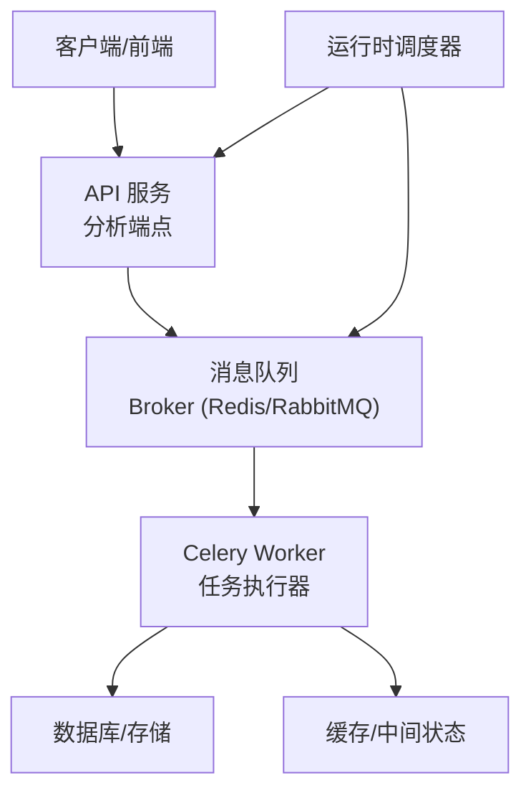
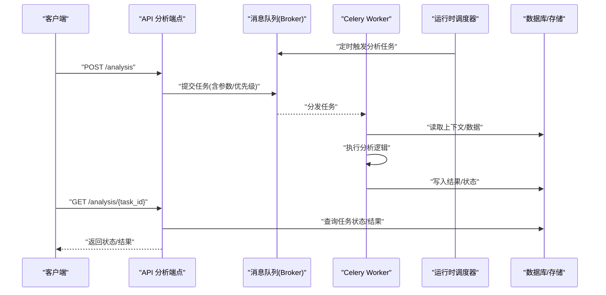
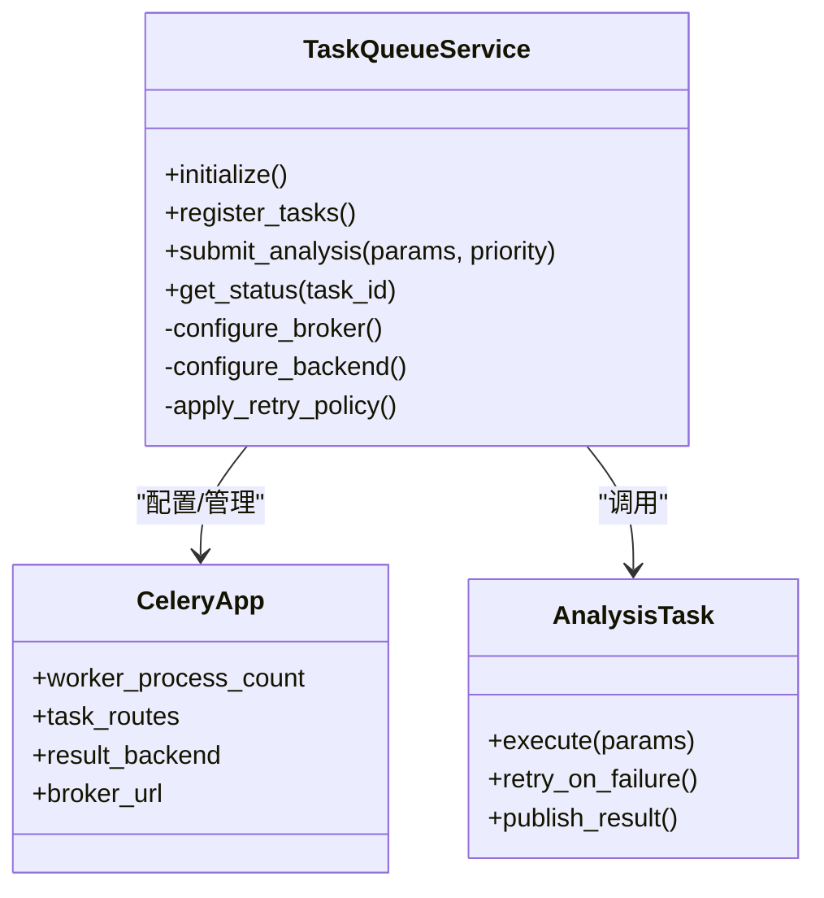
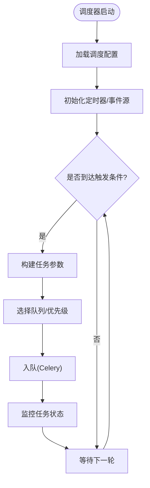
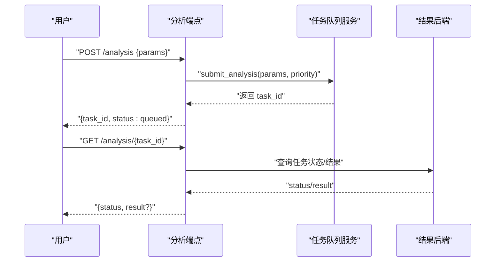
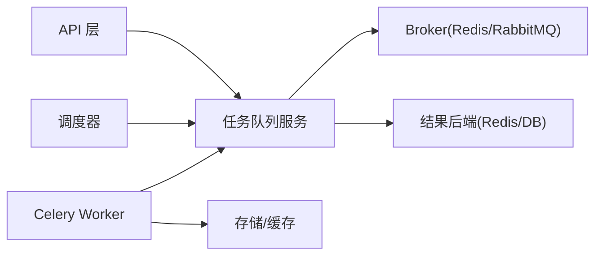

# 异步处理

<cite>
**本文引用的文件**   
- [src/services/task_queue.py](file://src/services/task_queue.py)
- [src/services/runtime_scheduler.py](file://src/services/runtime_scheduler.py)
- [src/scheduler.py](file://src/scheduler.py)
- [api/v1/endpoints/analysis.py](file://api/v1/endpoints/analysis.py)
- [server.py](file://server.py)
- [main.py](file://main.py)
- [pyproject.toml](file://pyproject.toml)
- [requirements.txt](file://requirements.txt)
- [docker/docker-compose.yml](file://docker/docker-compose.yml)
- [tests/test_task_service.py](file://tests/test_task_service.py)
- [tests/test_runtime_scheduler_service.py](file://tests/test_runtime_scheduler_service.py)
</cite>

## 目录
1. [简介](#简介)
2. [项目结构](#项目结构)
3. [核心组件](#核心组件)
4. [架构总览](#架构总览)
5. [详细组件分析](#详细组件分析)
6. [依赖关系分析](#依赖关系分析)
7. [性能考量](#性能考量)
8. [故障排查指南](#故障排查指南)
9. [结论](#结论)
10. [附录](#附录)

## 简介
本文件围绕 Daily Stock Analysis 的异步处理机制展开，重点说明 Celery 任务队列的配置与使用、并发控制策略、运行时调度器工作原理、异步 I/O 优化、任务监控与故障恢复，以及分布式扩展与一致性保证。文档面向不同技术背景的读者，提供从概览到代码级细节的分层说明，并辅以架构图与时序图帮助理解。

## 项目结构
Daily Stock Analysis 将异步能力拆分为“任务队列”和“运行时调度器”两大模块：
- 任务队列（Celery）：负责定义任务、路由规则、重试与幂等、结果持久化与监控。
- 运行时调度器：负责定时任务调度、事件驱动触发、负载均衡与资源协调。
- API 层：通过接口提交分析任务，返回任务 ID，由后端异步执行。
- 部署与配置：通过配置文件与环境变量管理 Broker、Backend、Worker 数量与限流。

图表来源
- [api/v1/endpoints/analysis.py](file://api/v1/endpoints/analysis.py)
- [src/services/task_queue.py](file://src/services/task_queue.py)
- [src/services/runtime_scheduler.py](file://src/services/runtime_scheduler.py)
- [docker/docker-compose.yml](file://docker/docker-compose.yml)

章节来源
- [api/v1/endpoints/analysis.py](file://api/v1/endpoints/analysis.py)
- [src/services/task_queue.py](file://src/services/task_queue.py)
- [src/services/runtime_scheduler.py](file://src/services/runtime_scheduler.py)
- [docker/docker-compose.yml](file://docker/docker-compose.yml)

## 核心组件
- 任务队列服务：封装 Celery 应用初始化、任务注册、路由与重试策略、结果后端配置。
- 运行时调度器：封装定时任务、周期任务、事件监听与任务派发，支持优先级与资源限制。
- API 分析端点：接收请求，构造任务参数，入队并返回任务 ID；支持查询任务状态。
- 部署编排：Docker Compose 启动 Broker、Worker、Scheduler 与必要的存储组件。

章节来源
- [src/services/task_queue.py](file://src/services/task_queue.py)
- [src/services/runtime_scheduler.py](file://src/services/runtime_scheduler.py)
- [api/v1/endpoints/analysis.py](file://api/v1/endpoints/analysis.py)
- [docker/docker-compose.yml](file://docker/docker-compose.yml)

## 架构总览
下图展示了从 API 提交分析任务到 Worker 执行、结果落库与状态查询的完整流程，以及调度器如何周期性触发任务。

图表来源
- [api/v1/endpoints/analysis.py](file://api/v1/endpoints/analysis.py)
- [src/services/task_queue.py](file://src/services/task_queue.py)
- [src/services/runtime_scheduler.py](file://src/services/runtime_scheduler.py)

## 详细组件分析

### 任务队列（Celery）设计与实现
- 任务定义与注册：在任务队列服务中集中定义与分析相关的任务函数，并通过装饰器注册到 Celery 应用。
- 路由规则：按业务域或资源类型将任务路由到指定队列，便于隔离与独立扩缩容。
- 重试机制：对网络抖动、外部依赖失败设置指数退避重试，结合死信队列记录失败详情。
- 结果后端：将任务状态与结果持久化至 Redis/数据库，供 API 查询。
- 并发与限流：通过 Worker 进程数、线程池大小、任务级并发上限控制吞吐与资源占用。

图表来源
- [src/services/task_queue.py](file://src/services/task_queue.py)

章节来源
- [src/services/task_queue.py](file://src/services/task_queue.py)

### 运行时调度器（定时与事件驱动）
- 定时任务：基于系统时间或外部调度源，周期性触发每日市场分析任务。
- 事件驱动：监听市场事件或外部信号，动态触发分析任务。
- 负载均衡：根据队列长度与 Worker 负载动态调整任务派发频率。
- 资源限制：为不同任务设定 CPU/内存上限，避免资源争用。

图表来源
- [src/services/runtime_scheduler.py](file://src/services/runtime_scheduler.py)
- [src/scheduler.py](file://src/scheduler.py)

章节来源
- [src/services/runtime_scheduler.py](file://src/services/runtime_scheduler.py)
- [src/scheduler.py](file://src/scheduler.py)

### API 分析端点（任务提交与状态查询）
- 提交任务：校验输入、生成任务 ID、将参数序列化后入队，立即返回任务 ID。
- 查询状态：根据任务 ID 查询任务状态与结果，支持分页与过滤。
- 错误处理：对非法参数、队列不可用、权限不足等返回明确错误码。

图表来源
- [api/v1/endpoints/analysis.py](file://api/v1/endpoints/analysis.py)
- [src/services/task_queue.py](file://src/services/task_queue.py)

章节来源
- [api/v1/endpoints/analysis.py](file://api/v1/endpoints/analysis.py)
- [src/services/task_queue.py](file://src/services/task_queue.py)

### 部署与运行（Docker Compose）
- Broker：推荐使用 Redis 或 RabbitMQ，作为消息中间件。
- Worker：多进程/多线程 Worker，按任务类型拆分队列。
- Scheduler：独立进程运行调度器，避免阻塞 API。
- 环境变量：统一通过 .env 或容器环境变量注入配置。

章节来源
- [docker/docker-compose.yml](file://docker/docker-compose.yml)
- [server.py](file://server.py)
- [main.py](file://main.py)

## 依赖关系分析
- 外部依赖：Celery、Broker（Redis/RabbitMQ）、结果后端（Redis/DB）、HTTP 框架（FastAPI）。
- 内部依赖：API 层依赖任务队列服务；调度器依赖任务队列服务；Worker 依赖业务逻辑与存储。
- 版本与安装：通过 pyproject.toml 与 requirements.txt 声明依赖。

图表来源
- [pyproject.toml](file://pyproject.toml)
- [requirements.txt](file://requirements.txt)
- [src/services/task_queue.py](file://src/services/task_queue.py)

章节来源
- [pyproject.toml](file://pyproject.toml)
- [requirements.txt](file://requirements.txt)
- [src/services/task_queue.py](file://src/services/task_queue.py)

## 性能考量
- 非阻塞操作：API 仅做参数校验与入队，避免长耗时逻辑阻塞请求。
- 连接池管理：对外部数据源与数据库使用连接池，减少握手开销。
- 内存优化：大对象分块处理，及时释放临时引用，避免 Worker 内存泄漏。
- 并发控制：合理设置 Worker 进程数与线程数，按任务类型划分队列，避免热点竞争。
- 优先级与限流：高优先级任务优先处理，低优先级任务限速，保障关键路径稳定。

[本节为通用指导，不直接分析具体文件]

## 故障排查指南
- 任务状态跟踪：通过任务 ID 查询状态，关注 queued、started、success、failed、revoked 等状态。
- 错误处理：查看 Worker 日志与错误上报，定位异常堆栈与重试次数。
- 死信队列：检查失败任务的重试策略与死信队列，分析失败原因并修复。
- 资源瓶颈：监控 CPU/内存/IO，必要时扩容 Worker 或优化任务粒度。
- 常见问题：
  - Broker 不可达：检查网络与认证配置。
  - 结果后端不可写：检查权限与磁盘空间。
  - 任务堆积：增加 Worker 或优化任务耗时。

章节来源
- [tests/test_task_service.py](file://tests/test_task_service.py)
- [tests/test_runtime_scheduler_service.py](file://tests/test_runtime_scheduler_service.py)

## 结论
Daily Stock Analysis 的异步处理以 Celery 为核心，配合运行时调度器实现定时与事件驱动的每日市场分析。通过清晰的任务定义、路由与重试策略，结合合理的并发控制与资源限制，系统在可扩展性与稳定性之间取得平衡。建议在生产环境完善监控告警、链路追踪与容量规划，确保高可用与一致性。

[本节为总结性内容，不直接分析具体文件]

## 附录
- 术语表：
  - Broker：消息中间件，负责任务分发与确认。
  - Worker：执行任务的进程/线程集合。
  - 结果后端：持久化任务状态与结果的存储。
  - 死信队列：存放无法成功执行的任务，便于后续分析与重放。
- 最佳实践：
  - 任务幂等：确保重复执行不会产生副作用。
  - 超时保护：为长时间任务设置超时，避免僵尸任务。
  - 灰度发布：逐步扩大 Worker 规模，观察指标后再全量上线。

[本节为补充信息，不直接分析具体文件]