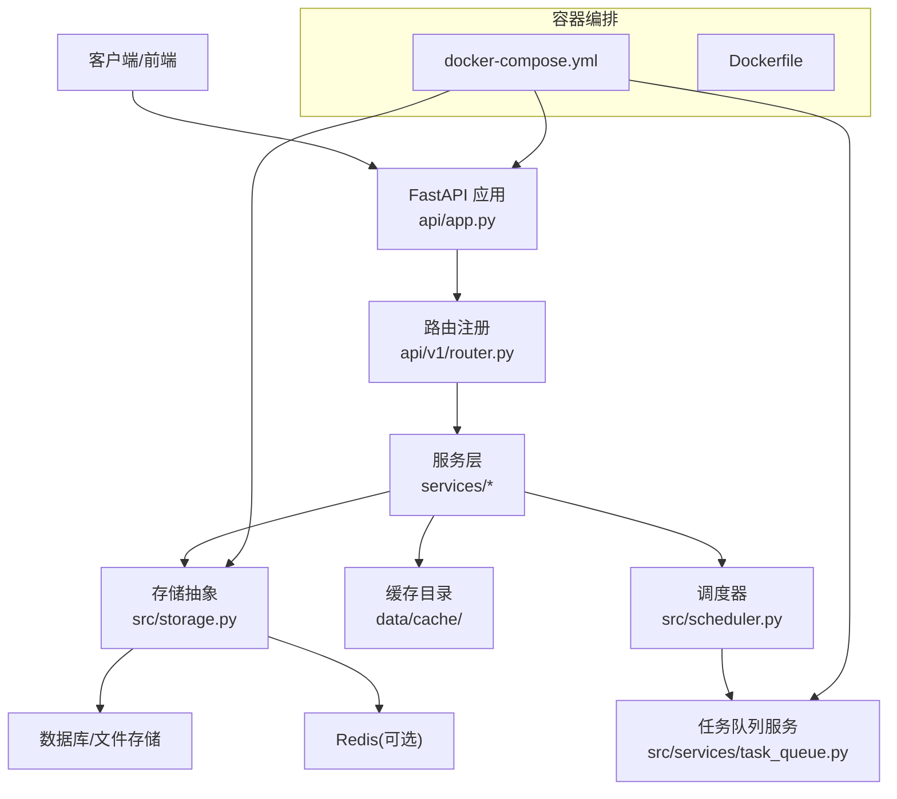
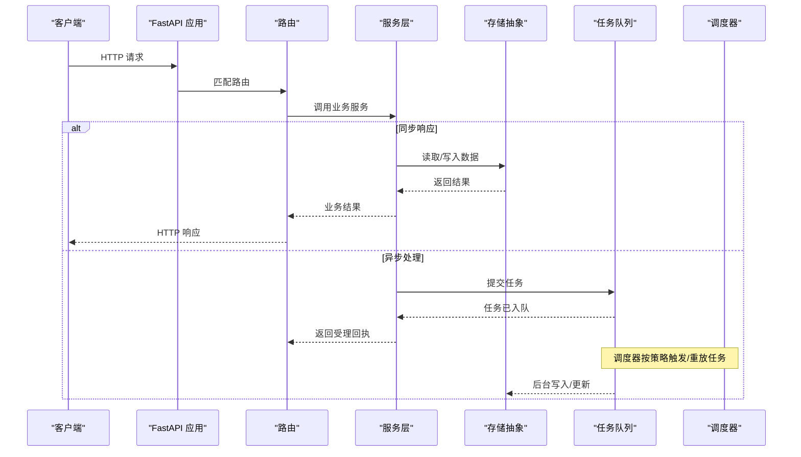
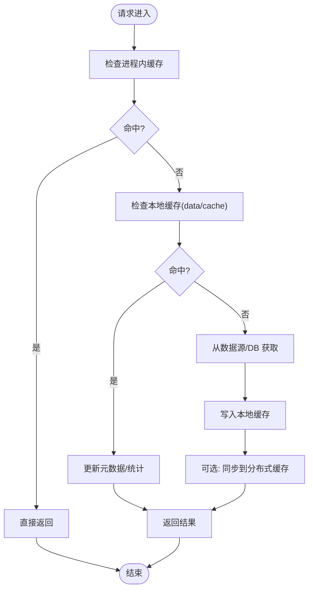
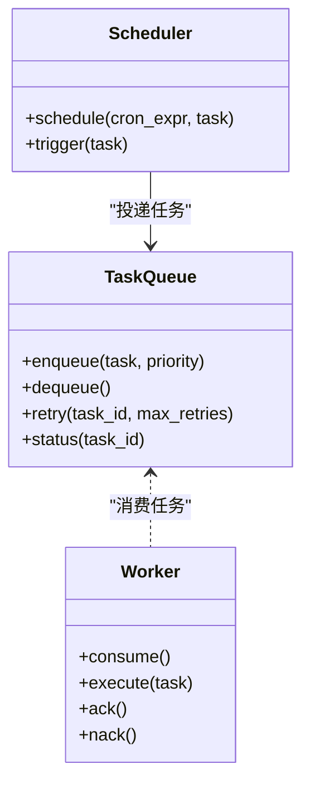
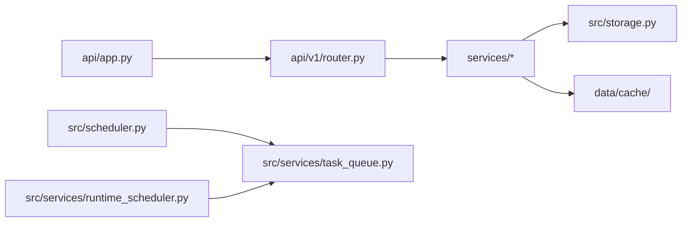

# 性能优化

<cite>
**本文引用的文件**   
- [main.py](file://main.py)
- [server.py](file://server.py)
- [api/app.py](file://api/app.py)
- [api/v1/router.py](file://api/v1/router.py)
- [src/config.py](file://src/config.py)
- [src/scheduler.py](file://src/scheduler.py)
- [src/services/task_queue.py](file://src/services/task_queue.py)
- [src/services/runtime_scheduler.py](file://src/services/runtime_scheduler.py)
- [src/storage.py](file://src/storage.py)
- [src/logging_config.py](file://src/logging_config.py)
- [docker/docker-compose.yml](file://docker/docker-compose.yml)
- [docker/Dockerfile](file://docker/Dockerfile)
- [requirements.txt](file://requirements.txt)
- [pyproject.toml](file://pyproject.toml)
- [data/cache/](file://data/cache/)
</cite>

## 目录
1. [简介](#简介)
2. [项目结构](#项目结构)
3. [核心组件](#核心组件)
4. [架构总览](#架构总览)
5. [详细组件分析](#详细组件分析)
6. [依赖关系分析](#依赖关系分析)
7. [性能考量](#性能考量)
8. [故障排查指南](#故障排查指南)
9. [结论](#结论)
10. [附录](#附录)

## 简介
本文件聚焦 Daily Stock Analysis 的性能优化，围绕缓存策略、异步任务队列、数据库与存储优化、内存与资源管理、监控诊断以及分布式部署等维度展开。文档面向不同技术背景的读者，既提供高层概览，也给出代码级分析与可视化图示，帮助快速定位瓶颈并落地优化方案。

## 项目结构
Daily Stock Analysis 采用前后端分离与模块化后端设计：
- API 层：基于 FastAPI 的 REST 接口，路由集中在 v1 模块，中间件处理鉴权与错误。
- 服务层：业务逻辑封装在 services，包含任务队列、运行时调度、市场数据服务等。
- 数据层：通过 storage 抽象统一访问持久化（本地文件、SQLite、Redis 等），配合 data/cache 做热点缓存。
- 应用入口：main.py/server.py 负责进程启动、配置加载、调度器初始化与外部依赖装配。
- 容器化：Dockerfile 与 docker-compose.yml 定义镜像构建与服务编排。

图表来源 
- [api/app.py](file://api/app.py)
- [api/v1/router.py](file://api/v1/router.py)
- [src/storage.py](file://src/storage.py)
- [src/scheduler.py](file://src/scheduler.py)
- [src/services/task_queue.py](file://src/services/task_queue.py)
- [docker/docker-compose.yml](file://docker/docker-compose.yml)
- [docker/Dockerfile](file://docker/Dockerfile)

章节来源
- [main.py](file://main.py)
- [server.py](file://server.py)
- [api/app.py](file://api/app.py)
- [api/v1/router.py](file://api/v1/router.py)
- [src/config.py](file://src/config.py)
- [src/scheduler.py](file://src/scheduler.py)
- [src/services/task_queue.py](file://src/services/task_queue.py)
- [src/services/runtime_scheduler.py](file://src/services/runtime_scheduler.py)
- [src/storage.py](file://src/storage.py)
- [docker/docker-compose.yml](file://docker/docker-compose.yml)
- [docker/Dockerfile](file://docker/Dockerfile)

## 核心组件
- 应用入口与生命周期管理：负责加载配置、初始化日志、挂载中间件、启动调度与任务队列。
- 路由与中间件：统一错误处理、鉴权、限流与请求追踪。
- 服务层：聚合领域能力，协调数据获取、分析计算、通知与报告生成。
- 存储抽象：屏蔽底层存储差异，支持多后端与连接池。
- 调度与任务队列：定时任务与异步任务解耦，支撑高并发与优先级控制。
- 缓存目录：用于热点数据与中间结果的本地缓存。

章节来源
- [src/config.py](file://src/config.py)
- [src/logging_config.py](file://src/logging_config.py)
- [src/storage.py](file://src/storage.py)
- [src/scheduler.py](file://src/scheduler.py)
- [src/services/task_queue.py](file://src/services/task_queue.py)
- [src/services/runtime_scheduler.py](file://src/services/runtime_scheduler.py)
- [data/cache/](file://data/cache/)

## 架构总览
系统以“请求驱动 + 事件驱动”双模运行：
- 同步路径：HTTP 请求进入 FastAPI，经中间件校验后路由到对应服务，服务调用存储或缓存，返回结果。
- 异步路径：调度器触发定时任务，或将耗时任务投递至任务队列，由工作进程消费执行，完成后回写存储或推送通知。

图表来源 
- [api/app.py](file://api/app.py)
- [api/v1/router.py](file://api/v1/router.py)
- [src/services/task_queue.py](file://src/services/task_queue.py)
- [src/scheduler.py](file://src/scheduler.py)
- [src/storage.py](file://src/storage.py)

## 详细组件分析

### 多级缓存策略设计与实施
目标：降低重复计算与外部依赖调用，提升热点数据命中率与整体吞吐。
- 缓存层级
  - L1 进程内缓存：适用于极短生命周期、线程安全的轻量对象（如配置、字典映射）。
  - L2 本地缓存：使用 data/cache 目录存放结构化缓存文件（JSON/Parquet），适合跨请求共享且可落盘的热点数据。
  - L3 分布式缓存（可选）：接入 Redis，作为集群共享缓存，支持过期与淘汰策略。
- 失效策略
  - TTL 过期：为每条缓存设置有效期，结合数据新鲜度要求动态调整。
  - 事件驱动失效：数据源更新时主动删除或标记相关缓存键。
  - 版本化键名：通过版本号或时间戳前缀避免脏读。
- 热点优化
  - 预取与预热：在低峰期批量拉取热门标的指标并写入缓存。
  - 读写分离：读路径优先命中缓存，写路径走主存储并异步刷新缓存。
  - 局部更新：增量更新而非全量覆盖，减少 I/O 与序列化开销。

图表来源 
- [src/storage.py](file://src/storage.py)
- [data/cache/](file://data/cache/)

章节来源
- [src/storage.py](file://src/storage.py)
- [data/cache/](file://data/cache/)

### 异步处理机制：任务队列与并发控制
- 任务队列
  - 使用独立队列服务（如 Celery/RQ）将耗时任务（数据分析、报告生成、通知发送）从请求链路中剥离。
  - 支持任务重试、死信队列与幂等性保障。
- 并发控制
  - Worker 数量与 CPU/IO 类型匹配：CPU 密集型限制并发，IO 密集型提高并发。
  - 限流与背压：对上游流量进行令牌桶/漏桶限流，防止雪崩。
- 优先级管理
  - 多队列或多标签实现优先级路由（如 high/normal/low）。
  - 关键任务抢占与降级策略，确保 SLA。

图表来源 
- [src/services/task_queue.py](file://src/services/task_queue.py)
- [src/scheduler.py](file://src/scheduler.py)

章节来源
- [src/services/task_queue.py](file://src/services/task_queue.py)
- [src/scheduler.py](file://src/scheduler.py)
- [src/services/runtime_scheduler.py](file://src/services/runtime_scheduler.py)

### 数据库与存储优化
- 查询优化
  - 分页与投影：仅拉取必要字段，避免大对象传输。
  - 批处理：合并多次写入为批量操作，降低事务开销。
  - 慢查询监控：开启慢查询日志与采样分析，定期优化索引与 SQL。
- 索引设计
  - 复合索引：针对高频过滤条件组合建立索引。
  - 覆盖索引：尽量让查询命中索引而不回表。
  - 维护成本：评估写入放大与碎片整理频率。
- 连接池配置
  - 根据并发与延迟目标设定最小/最大连接数与超时。
  - 健康检查与自动回收，避免僵尸连接。
- 存储抽象
  - 通过 src/storage.py 统一接口，便于切换后端（SQLite/PostgreSQL/文件）与启用连接池。

章节来源
- [src/storage.py](file://src/storage.py)

### 内存管理与资源优化
- 对象池化
  - 复用重型对象（如解析器、网络客户端、模型实例），减少创建销毁开销。
  - 注意线程安全与状态隔离。
- 垃圾回收调优
  - 调整分代阈值与触发策略，平衡延迟与吞吐。
  - 避免循环引用导致的 GC 压力。
- 内存泄漏检测
  - 使用工具（如 tracemalloc、memory_profiler）定位增长趋势与热点分配。
  - 监控长生命周期对象的存活情况。

章节来源
- [src/storage.py](file://src/storage.py)

### 性能监控与诊断
- APM 集成
  - 埋点关键路径（HTTP、任务、存储、外部 API），采集延迟、吞吐与错误率。
  - 分布式追踪串联请求与任务。
- 日志分析
  - 结构化日志，分级输出，集中收集与检索。
  - 告警规则基于错误率、延迟阈值与资源水位。
- 基准测试
  - 端到端压测：模拟真实负载曲线，验证容量与弹性。
  - 单元/集成测试中的性能断言，防止回归。

章节来源
- [src/logging_config.py](file://src/logging_config.py)

### 分布式部署的性能考虑
- 负载均衡
  - 前置反向代理（Nginx/云 LB）分发请求，健康检查与灰度发布。
- 数据同步
  - 读写分离与最终一致性策略，必要时引入消息总线。
- 服务发现
  - 动态扩缩容与实例注册，保证路由可达。
- 容器编排
  - 通过 docker-compose 或编排平台管理多副本、资源限制与健康探针。

章节来源
- [docker/docker-compose.yml](file://docker/docker-compose.yml)
- [docker/Dockerfile](file://docker/Dockerfile)

## 依赖关系分析
- 外部依赖
  - Web 框架与中间件、任务队列库、存储驱动、监控与日志库。
- 内部耦合
  - API 层依赖服务层；服务层依赖存储抽象与缓存；调度器与任务队列协作。
- 潜在环路
  - 服务间应避免循环导入，通过接口与事件解耦。

图表来源 
- [api/app.py](file://api/app.py)
- [api/v1/router.py](file://api/v1/router.py)
- [src/storage.py](file://src/storage.py)
- [src/scheduler.py](file://src/scheduler.py)
- [src/services/task_queue.py](file://src/services/task_queue.py)
- [src/services/runtime_scheduler.py](file://src/services/runtime_scheduler.py)

章节来源
- [requirements.txt](file://requirements.txt)
- [pyproject.toml](file://pyproject.toml)

## 性能考量
- 缓存命中率与过期策略需与数据新鲜度权衡，热点数据优先预热。
- 任务队列的并发度应与硬件资源匹配，避免上下文切换与锁竞争。
- 数据库索引与查询计划需定期审查，避免全表扫描与大对象传输。
- 监控与告警应覆盖关键路径与资源水位，形成闭环优化。
- 分布式场景下，网络分区与一致性需要明确取舍与补偿策略。

## 故障排查指南
- 常见问题
  - 缓存未命中导致抖动：检查 TTL、预热与键命名规范。
  - 任务堆积：检查 Worker 数量、消费者速率与上游限流。
  - 数据库连接耗尽：检查连接池大小、超时与泄露。
  - 内存持续增长：定位对象持有链与长生命周期变量。
- 诊断步骤
  - 查看慢查询与错误日志，定位热点接口与任务。
  - 使用 APM 追踪耗时节点，识别瓶颈。
  - 压测复现问题，逐步收敛范围。
  - 修复后回归验证，更新监控阈值与告警规则。

章节来源
- [src/logging_config.py](file://src/logging_config.py)

## 结论
通过多级缓存、异步任务队列、存储与索引优化、内存治理以及完善的监控体系，Daily Stock Analysis 可在高并发与大数据量场景下保持稳定与高效。建议在持续迭代中完善压测与观测，形成“度量—优化—验证”的闭环。

## 附录
- 配置与环境
  - 通过环境变量与配置文件统一管理缓存、队列、存储与监控参数。
- 容器化与部署
  - 参考 Dockerfile 与 docker-compose.yml 进行环境搭建与扩展。

章节来源
- [src/config.py](file://src/config.py)
- [docker/Dockerfile](file://docker/Dockerfile)
- [docker/docker-compose.yml](file://docker/docker-compose.yml)