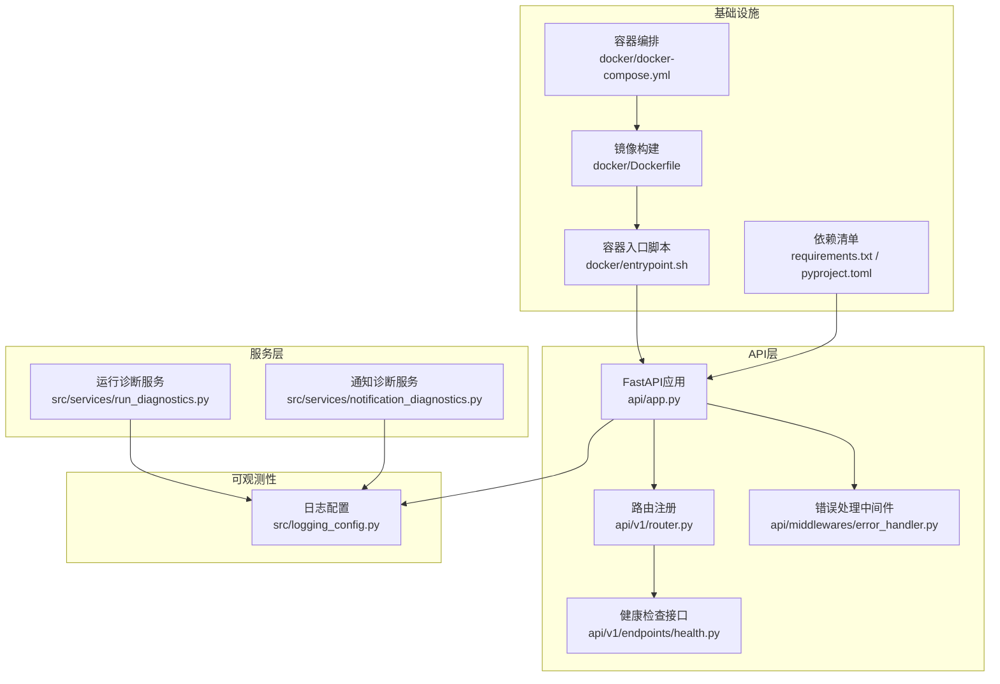
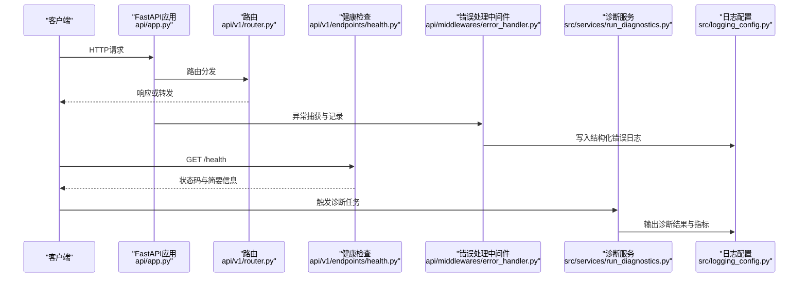
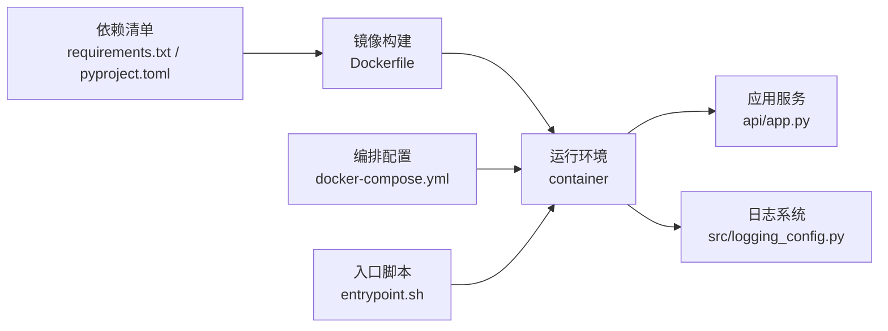

# 性能监控

<cite>
**本文引用的文件**   
- [logging_config.py](file://src/logging_config.py)
- [app.py](file://api/app.py)
- [router.py](file://api/v1/router.py)
- [error_handler.py](file://api/middlewares/error_handler.py)
- [health.py](file://api/v1/endpoints/health.py)
- [run_diagnostics.py](file://src/services/run_diagnostics.py)
- [notification_diagnostics.py](file://src/services/notification_diagnostics.py)
- [test_logging_config.py](file://tests/test_logging_config.py)
- [docker-compose.yml](file://docker/docker-compose.yml)
- [Dockerfile](file://docker/Dockerfile)
- [entrypoint.sh](file://docker/entrypoint.sh)
- [requirements.txt](file://requirements.txt)
- [pyproject.toml](file://pyproject.toml)
- [server.py](file://server.py)
- [main.py](file://main.py)
</cite>

## 目录
1. [简介](#简介)
2. [项目结构](#项目结构)
3. [核心组件](#核心组件)
4. [架构总览](#架构总览)
5. [详细组件分析](#详细组件分析)
6. [依赖关系分析](#依赖关系分析)
7. [性能考量](#性能考量)
8. [故障排查指南](#故障排查指南)
9. [结论](#结论)
10. [附录](#附录)

## 简介
本文件面向Daily Stock Analysis项目的性能监控与可观测性建设，覆盖APM集成、日志分析与聚合、性能基准测试、实时监控仪表板、诊断工具使用以及生产环境最佳实践。文档基于仓库中现有代码与配置进行梳理，并给出可扩展的实践建议，帮助读者在不侵入业务逻辑的前提下构建完整的性能监控体系。

## 项目结构
本项目采用前后端分离与多模块组织：
- API层：FastAPI应用入口、路由与中间件（含错误处理与健康检查）
- 服务层：诊断与告警、通知诊断、任务调度等
- 基础设施：Docker镜像与编排、依赖管理、启动脚本
- 日志与可观测性：集中式日志配置、结构化输出、健康探针

图表来源
- [app.py](file://api/app.py)
- [router.py](file://api/v1/router.py)
- [error_handler.py](file://api/middlewares/error_handler.py)
- [health.py](file://api/v1/endpoints/health.py)
- [run_diagnostics.py](file://src/services/run_diagnostics.py)
- [notification_diagnostics.py](file://src/services/notification_diagnostics.py)
- [docker-compose.yml](file://docker/docker-compose.yml)
- [Dockerfile](file://docker/Dockerfile)
- [entrypoint.sh](file://docker/entrypoint.sh)
- [requirements.txt](file://requirements.txt)
- [pyproject.toml](file://pyproject.toml)
- [logging_config.py](file://src/logging_config.py)

章节来源
- [app.py](file://api/app.py)
- [router.py](file://api/v1/router.py)
- [error_handler.py](file://api/middlewares/error_handler.py)
- [health.py](file://api/v1/endpoints/health.py)
- [run_diagnostics.py](file://src/services/run_diagnostics.py)
- [notification_diagnostics.py](file://src/services/notification_diagnostics.py)
- [docker-compose.yml](file://docker/docker-compose.yml)
- [Dockerfile](file://docker/Dockerfile)
- [entrypoint.sh](file://docker/entrypoint.sh)
- [requirements.txt](file://requirements.txt)
- [pyproject.toml](file://pyproject.toml)
- [logging_config.py](file://src/logging_config.py)

## 核心组件
- 日志配置与结构化输出：通过集中式日志配置实现统一格式、级别控制与输出目标，便于后续接入日志聚合系统。
- 健康检查与可用性探测：提供健康检查接口，供负载均衡器或编排平台进行存活与就绪探测。
- 错误处理中间件：统一捕获异常、记录结构化错误日志，避免未处理异常导致进程崩溃。
- 诊断服务：内置运行诊断与通知诊断能力，辅助定位问题根因。
- 容器化部署：通过Docker与编排文件标准化运行环境，确保监控指标与日志的一致性。

章节来源
- [logging_config.py](file://src/logging_config.py)
- [health.py](file://api/v1/endpoints/health.py)
- [error_handler.py](file://api/middlewares/error_handler.py)
- [run_diagnostics.py](file://src/services/run_diagnostics.py)
- [notification_diagnostics.py](file://src/services/notification_diagnostics.py)
- [docker-compose.yml](file://docker/docker-compose.yml)
- [Dockerfile](file://docker/Dockerfile)
- [entrypoint.sh](file://docker/entrypoint.sh)

## 架构总览
下图展示从请求进入API到日志与诊断输出的整体链路，强调可观测性在关键节点的注入位置。

图表来源
- [app.py](file://api/app.py)
- [router.py](file://api/v1/router.py)
- [health.py](file://api/v1/endpoints/health.py)
- [error_handler.py](file://api/middlewares/error_handler.py)
- [run_diagnostics.py](file://src/services/run_diagnostics.py)
- [logging_config.py](file://src/logging_config.py)

## 详细组件分析

### APM集成方案（应用性能监控）
- 现状评估：仓库未包含显式的APM SDK集成代码。建议在API层与应用初始化处引入APM库（如OpenTelemetry、Sentry、New Relic等），以非侵入方式采集HTTP请求耗时、错误率、数据库与外部调用延迟等指标。
- 推荐接入点：
  - 应用启动阶段：初始化APM客户端、设置服务名与版本、启用自动插桩。
  - HTTP中间件：为每个请求生成TraceID，记录入参摘要、出参摘要（脱敏）、耗时与状态码。
  - 异步任务与后台作业：为长耗时任务创建Span，关联上下文传播。
- 指标与追踪：
  - 指标：QPS、P50/P95/P99延迟、错误率、资源使用（CPU、内存、GC）。
  - 追踪：端到端请求链路、下游依赖（数据源、LLM、消息队列）的耗时分布。
- 部署与配置：
  - 环境变量：服务名、采样率、上报端点、密钥等。
  - 容器化：在Docker镜像中安装APM Agent，并通过编排文件注入环境变量。

章节来源
- [app.py](file://api/app.py)
- [requirements.txt](file://requirements.txt)
- [pyproject.toml](file://pyproject.toml)
- [docker-compose.yml](file://docker/docker-compose.yml)
- [Dockerfile](file://docker/Dockerfile)
- [entrypoint.sh](file://docker/entrypoint.sh)

### 日志分析与聚合
- 结构化日志：统一JSON格式，包含时间戳、级别、服务名、请求ID、模块、消息与关键字段（如股票代码、策略名称、任务ID）。
- 日志级别管理：DEBUG用于开发调试，INFO记录关键流程，WARNING关注潜在风险，ERROR记录异常与失败路径，CRITICAL用于严重错误。
- 输出目标：控制台与文件输出，支持按大小或时间轮转；在生产环境建议对接集中式日志系统（如ELK、Loki、Splunk）。
- 敏感信息脱敏：对密码、Token、用户信息等字段进行过滤或哈希处理。
- 性能相关日志：记录慢查询、超时、重试、缓存命中/失效、队列积压等关键事件。

章节来源
- [logging_config.py](file://src/logging_config.py)
- [error_handler.py](file://api/middlewares/error_handler.py)
- [test_logging_config.py](file://tests/test_logging_config.py)

### 性能基准测试
- 负载测试：使用压测工具（如Locust、k6、JMeter）模拟并发请求，验证API吞吐与延迟是否满足SLA。
- 压力测试：逐步增加负载直至系统瓶颈出现，识别CPU、内存、IO或外部依赖限制。
- 性能回归检测：将压测纳入CI流水线，对比历史基线，当P95/P99延迟或错误率超过阈值时阻断合并。
- 指标采集：结合APM与系统监控（Prometheus+Grafana）收集关键指标，形成趋势报告。

章节来源
- [requirements.txt](file://requirements.txt)
- [pyproject.toml](file://pyproject.toml)
- [docker-compose.yml](file://docker/docker-compose.yml)

### 实时监控仪表板
- 关键指标：
  - 业务指标：每日分析任务完成率、数据源成功率、策略信号命中率。
  - 系统指标：CPU、内存、磁盘IO、网络带宽、连接数。
  - 应用指标：QPS、延迟分位、错误率、线程池与队列长度。
- 告警规则：
  - 延迟阈值：P95超过设定值持续N分钟触发。
  - 错误率：错误比例超过阈值或突发增长。
  - 资源水位：CPU/内存使用率接近上限，磁盘空间不足。
- 趋势分析：
  - 日/周/月维度对比，识别季节性波动与异常峰值。
  - 关联变更事件（发布、配置调整、数据源切换）进行归因分析。

章节来源
- [health.py](file://api/v1/endpoints/health.py)
- [logging_config.py](file://src/logging_config.py)
- [docker-compose.yml](file://docker/docker-compose.yml)

### 诊断工具使用指南
- CPU分析：
  - 使用cProfile或perf采集热点函数与调用栈，定位CPU密集型逻辑。
  - 结合APM追踪查看慢请求的调用链与耗时分布。
- 内存剖析：
  - 使用memory_profiler或tracemalloc分析内存分配与泄漏。
  - 关注大对象生命周期与缓存策略。
- 网络监控：
  - 使用tcpdump、Wireshark或APM网络插桩观察HTTP/HTTPS流量与延迟。
  - 针对数据源与LLM调用进行超时与重试优化。
- 内置诊断服务：
  - 运行诊断：检查系统环境、依赖、配置文件与端口占用。
  - 通知诊断：验证通知渠道连通性与模板渲染。

章节来源
- [run_diagnostics.py](file://src/services/run_diagnostics.py)
- [notification_diagnostics.py](file://src/services/notification_diagnostics.py)
- [logging_config.py](file://src/logging_config.py)

## 依赖关系分析
- 运行时依赖：Python包依赖由requirements.txt与pyproject.toml声明，确保镜像构建与运行环境一致。
- 容器编排：docker-compose.yml定义服务间依赖、环境变量、卷挂载与端口映射，便于本地与生产环境一致性。
- 启动流程：entrypoint.sh负责环境准备、依赖校验与服务启动，保证监控与日志在容器内可用。

图表来源
- [requirements.txt](file://requirements.txt)
- [pyproject.toml](file://pyproject.toml)
- [Dockerfile](file://docker/Dockerfile)
- [docker-compose.yml](file://docker/docker-compose.yml)
- [entrypoint.sh](file://docker/entrypoint.sh)
- [app.py](file://api/app.py)
- [logging_config.py](file://src/logging_config.py)

章节来源
- [requirements.txt](file://requirements.txt)
- [pyproject.toml](file://pyproject.toml)
- [Dockerfile](file://docker/Dockerfile)
- [docker-compose.yml](file://docker/docker-compose.yml)
- [entrypoint.sh](file://docker/entrypoint.sh)
- [app.py](file://api/app.py)
- [logging_config.py](file://src/logging_config.py)

## 性能考量
- 请求处理：
  - 减少同步阻塞操作，优先使用异步IO与连接池。
  - 对热点接口实施缓存与限流，避免雪崩。
- 数据获取：
  - 数据源调用需具备超时、重试与降级策略。
  - 批量拉取与分页策略优化，降低网络开销。
- 存储与缓存：
  - 合理设计缓存键与过期策略，避免缓存穿透与击穿。
  - 数据库查询索引优化与慢查询治理。
- 资源管理：
  - 监控线程池与进程池大小，避免过多上下文切换。
  - 定期清理临时文件与日志轮转，防止磁盘占满。

[本节为通用指导，不直接分析具体文件]

## 故障排查指南
- 快速定位：
  - 通过健康检查接口确认服务状态与依赖连通性。
  - 查看错误处理中间件记录的异常堆栈与上下文信息。
- 日志分析：
  - 使用结构化日志关键字段（请求ID、模块、级别）过滤与聚合。
  - 关注警告与错误级别的日志，结合时间窗口定位问题。
- 诊断执行：
  - 运行内置诊断服务，检查环境、配置与端口占用。
  - 使用CPU与内存剖析工具定位热点与泄漏。
- 恢复与回滚：
  - 根据告警规则快速回滚至稳定版本。
  - 临时扩容或降级非关键功能，保障核心链路可用。

章节来源
- [health.py](file://api/v1/endpoints/health.py)
- [error_handler.py](file://api/middlewares/error_handler.py)
- [run_diagnostics.py](file://src/services/run_diagnostics.py)
- [notification_diagnostics.py](file://src/services/notification_diagnostics.py)
- [logging_config.py](file://src/logging_config.py)

## 结论
通过集中式日志配置、健康检查与错误处理中间件，项目已具备基础的可观测性能力。建议在此基础上引入APM与监控系统，完善性能基准测试与告警规则，形成闭环的性能管理与故障排查流程。容器化与编排确保了环境一致性，为生产环境的稳定运行奠定基础。

[本节为总结性内容，不直接分析具体文件]

## 附录
- 常用命令：
  - 启动服务：参考entrypoint.sh与docker-compose.yml中的服务定义。
  - 查看日志：使用容器日志命令或集中式日志平台检索。
  - 触发诊断：调用诊断服务接口或执行内置诊断脚本。
- 最佳实践：
  - 所有外部调用必须设置超时与重试。
  - 关键路径添加结构化日志与APM追踪。
  - 定期演练故障场景，验证告警与恢复流程。

[本节为补充信息，不直接分析具体文件]