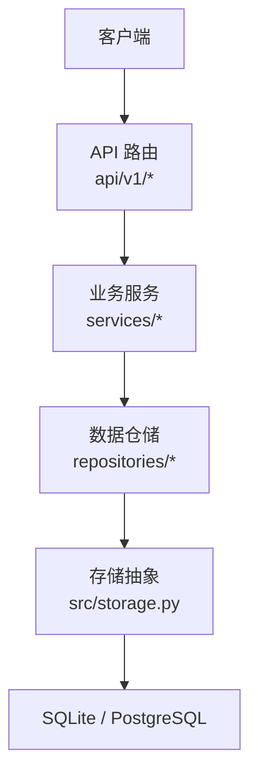
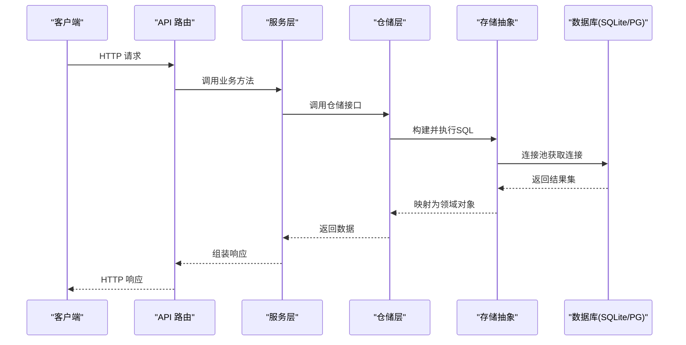
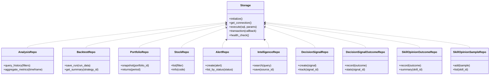

# 数据库优化

<cite>
**本文引用的文件**   
- [storage.py](file://src/storage.py)
- [config.py](file://src/config.py)
- [main.py](file://main.py)
- [server.py](file://server.py)
- [docker-compose.yml](file://docker/docker-compose.yml)
- [Dockerfile](file://docker/Dockerfile)
- [entrypoint.sh](file://docker/entrypoint.sh)
- [analysis_repo.py](file://src/repositories/analysis_repo.py)
- [backtest_repo.py](file://src/repositories/backtest_repo.py)
- [portfolio_repo.py](file://src/repositories/portfolio_repo.py)
- [stock_repo.py](file://src/repositories/stock_repo.py)
- [alert_repo.py](file://src/repositories/alert_repo.py)
- [intelligence_repo.py](file://src/repositories/intelligence_repo.py)
- [decision_signal_repo.py](file://src/repositories/decision_signal_repo.py)
- [decision_signal_outcome_repo.py](file://src/repositories/decision_signal_outcome_repo.py)
- [skill_opinion_outcome_repo.py](file://src/repositories/skill_opinion_outcome_repo.py)
- [skill_opinion_sample_repo.py](file://src/repositories/skill_opinion_sample_repo.py)
- [history_service.py](file://src/services/history_service.py)
- [run_diagnostics.py](file://src/services/run_diagnostics.py)
- [logging_config.py](file://src/logging_config.py)
- [scheduler.py](file://src/scheduler.py)
- [task_queue.py](file://src/services/task_queue.py)
</cite>

## 目录
1. [简介](#简介)
2. [项目结构](#项目结构)
3. [核心组件](#核心组件)
4. [架构总览](#架构总览)
5. [详细组件分析](#详细组件分析)
6. [依赖关系分析](#依赖关系分析)
7. [性能考量](#性能考量)
8. [故障排查指南](#故障排查指南)
9. [结论](#结论)
10. [附录](#附录)

## 简介
本文件面向 Daily Stock Analysis 项目的数据库优化，覆盖以下关键主题：
- SQL 查询优化、索引设计与查询计划分析
- 连接池配置（连接数管理、超时设置、健康检查）
- 慢查询监控与诊断（日志分析、瓶颈识别、优化建议）
- 数据分片与分区策略（水平分片、垂直分片、读写分离）
- 备份与恢复策略（增量备份、灾难恢复、数据迁移）
- SQLite 与 PostgreSQL 的性能调优最佳实践

目标是为开发者与运维人员提供可操作的优化方案与落地指引。

## 项目结构
本项目采用分层架构：API 层通过服务层调用仓储层，仓储层统一使用存储抽象访问底层数据库。关键路径包括：
- API 路由与中间件：api/v1/*
- 业务服务：services/*
- 数据仓储：repositories/*
- 存储抽象与配置：src/storage.py、src/config.py
- 应用入口与服务器：main.py、server.py
- 容器化部署：docker/*

图表来源
- [main.py](file://main.py)
- [server.py](file://server.py)
- [storage.py](file://src/storage.py)
- [analysis_repo.py](file://src/repositories/analysis_repo.py)

章节来源
- [main.py](file://main.py)
- [server.py](file://server.py)
- [storage.py](file://src/storage.py)

## 核心组件
- 存储抽象层：封装数据库连接、会话生命周期、事务与查询执行，屏蔽 SQLite/PostgreSQL 差异
- 仓储层：按领域划分的数据访问实现（分析、回测、组合、股票、告警、情报、决策信号等）
- 服务层：编排仓储调用，处理业务逻辑与缓存策略
- 配置与启动：集中式配置加载、环境变量注入、运行时参数校验

章节来源
- [storage.py](file://src/storage.py)
- [analysis_repo.py](file://src/repositories/analysis_repo.py)
- [backtest_repo.py](file://src/repositories/backtest_repo.py)
- [portfolio_repo.py](file://src/repositories/portfolio_repo.py)
- [stock_repo.py](file://src/repositories/stock_repo.py)
- [alert_repo.py](file://src/repositories/alert_repo.py)
- [intelligence_repo.py](file://src/repositories/intelligence_repo.py)
- [decision_signal_repo.py](file://src/repositories/decision_signal_repo.py)
- [decision_signal_outcome_repo.py](file://src/repositories/decision_signal_outcome_repo.py)
- [skill_opinion_outcome_repo.py](file://src/repositories/skill_opinion_outcome_repo.py)
- [skill_opinion_sample_repo.py](file://src/repositories/skill_opinion_sample_repo.py)

## 架构总览
下图展示从请求到数据存储的完整链路，以及关键优化点（连接池、索引、查询计划、慢查询日志）。

图表来源
- [storage.py](file://src/storage.py)
- [analysis_repo.py](file://src/repositories/analysis_repo.py)
- [history_service.py](file://src/services/history_service.py)

## 详细组件分析

### 存储抽象层（Storage）
职责与优化要点：
- 连接池管理：根据后端类型（SQLite/PostgreSQL）初始化连接池，控制最大连接数、最小连接数、空闲超时、回收周期
- 会话与事务：提供上下文管理器，确保连接正确释放；支持显式事务边界，减少锁竞争
- 查询执行：统一 SQL 执行入口，便于注入慢查询日志、执行计划捕获与重试策略
- 健康检查：定期探测连接可用性，自动剔除失效连接，提升稳定性

优化建议：
- 针对高频读多写少的场景，增大只读连接池比例，缩短连接等待时间
- 对长事务进行拆分，避免持有锁过久导致连接池耗尽
- 在 PG 上启用连接池预热，减少冷启动延迟

章节来源
- [storage.py](file://src/storage.py)

### 仓储层（Repositories）
仓储按领域组织，常见优化模式：
- 批量写入：合并多次 INSERT/UPDATE 为批量操作，降低往返开销
- 分页与投影：仅选择必要字段，限制返回行数，避免全表扫描
- 条件过滤与排序：优先使用索引列作为过滤和排序键
- 物化视图/临时表：复杂聚合查询拆分为中间结果，提高可读性与性能

示例仓储（以分析、回测、组合、股票、告警、情报、决策信号等为例）：
- 分析仓储：历史分析结果查询、时间窗口聚合、指标计算
- 回测仓储：策略运行记录、交易明细、绩效汇总
- 组合仓储：持仓快照、收益曲线、风险指标
- 股票仓储：标的列表、基础信息、行情快照
- 告警仓储：规则命中记录、通知状态
- 情报仓储：新闻、研报、事件摘要
- 决策信号仓储：信号生成、跟踪、归因
- 技能意见仓储：样本与结果统计

章节来源
- [analysis_repo.py](file://src/repositories/analysis_repo.py)
- [backtest_repo.py](file://src/repositories/backtest_repo.py)
- [portfolio_repo.py](file://src/repositories/portfolio_repo.py)
- [stock_repo.py](file://src/repositories/stock_repo.py)
- [alert_repo.py](file://src/repositories/alert_repo.py)
- [intelligence_repo.py](file://src/repositories/intelligence_repo.py)
- [decision_signal_repo.py](file://src/repositories/decision_signal_repo.py)
- [decision_signal_outcome_repo.py](file://src/repositories/decision_signal_outcome_repo.py)
- [skill_opinion_outcome_repo.py](file://src/repositories/skill_opinion_outcome_repo.py)
- [skill_opinion_sample_repo.py](file://src/repositories/skill_opinion_sample_repo.py)

### 服务层（Services）
- 历史服务：负责历史数据加载、缓存策略、增量更新与一致性保障
- 诊断服务：提供系统健康检查、慢查询采集、性能指标收集

优化建议：
- 引入多级缓存（内存+Redis），热点数据短 TTL，降低数据库压力
- 异步任务队列解耦耗时操作（如批量导入、报表生成）

章节来源
- [history_service.py](file://src/services/history_service.py)
- [run_diagnostics.py](file://src/services/run_diagnostics.py)

### 配置与启动（Config & Entrypoints）
- 配置中心：集中管理数据库 URL、连接池参数、超时、日志级别等
- 应用入口：初始化存储、注册路由、启动调度器与后台任务

优化建议：
- 将连接池参数与环境变量绑定，支持不同环境差异化配置
- 启动时进行数据库连通性检测与版本兼容性校验

章节来源
- [config.py](file://src/config.py)
- [main.py](file://main.py)
- [server.py](file://server.py)

## 依赖关系分析
仓储层依赖存储抽象，服务层依赖仓储层，API 层依赖服务层。存储抽象屏蔽底层数据库差异，便于切换与扩展。

图表来源
- [storage.py](file://src/storage.py)
- [analysis_repo.py](file://src/repositories/analysis_repo.py)
- [backtest_repo.py](file://src/repositories/backtest_repo.py)
- [portfolio_repo.py](file://src/repositories/portfolio_repo.py)
- [stock_repo.py](file://src/repositories/stock_repo.py)
- [alert_repo.py](file://src/repositories/alert_repo.py)
- [intelligence_repo.py](file://src/repositories/intelligence_repo.py)
- [decision_signal_repo.py](file://src/repositories/decision_signal_repo.py)
- [decision_signal_outcome_repo.py](file://src/repositories/decision_signal_outcome_repo.py)
- [skill_opinion_outcome_repo.py](file://src/repositories/skill_opinion_outcome_repo.py)
- [skill_opinion_sample_repo.py](file://src/repositories/skill_opinion_sample_repo.py)

章节来源
- [storage.py](file://src/storage.py)
- [analysis_repo.py](file://src/repositories/analysis_repo.py)
- [backtest_repo.py](file://src/repositories/backtest_repo.py)
- [portfolio_repo.py](file://src/repositories/portfolio_repo.py)
- [stock_repo.py](file://src/repositories/stock_repo.py)
- [alert_repo.py](file://src/repositories/alert_repo.py)
- [intelligence_repo.py](file://src/repositories/intelligence_repo.py)
- [decision_signal_repo.py](file://src/repositories/decision_signal_repo.py)
- [decision_signal_outcome_repo.py](file://src/repositories/decision_signal_outcome_repo.py)
- [skill_opinion_outcome_repo.py](file://src/repositories/skill_opinion_outcome_repo.py)
- [skill_opinion_sample_repo.py](file://src/repositories/skill_opinion_sample_repo.py)

## 性能考量

### SQL 查询优化
- 避免 SELECT *，仅选择必要字段，减少网络与序列化开销
- 使用 WHERE 条件限定范围，结合索引列过滤与排序
- 分页查询使用游标或基于主键的分页，避免 OFFSET 大偏移
- 聚合查询尽量下推至数据库端，利用 GROUP BY、窗口函数
- 避免 N+1 查询，使用 JOIN 或批量加载

### 索引设计
- 单列索引：用于等值查询与排序键（如股票代码、日期）
- 复合索引：遵循最左前缀原则，将高选择性列放在前面
- 部分索引：针对常用过滤条件创建局部索引，减小索引体积
- 唯一索引：保证业务唯一性（如交易流水号、告警 ID）
- 定期重建与统计信息更新，保持索引有效性

### 查询计划分析
- 使用 EXPLAIN/EXPLAIN ANALYZE 查看执行计划，关注全表扫描、临时表、文件排序
- 关注成本估算与实际行数的偏差，必要时调整统计信息
- 对慢查询建立基线，对比优化前后计划变化

### 连接池配置
- 连接数管理：根据并发量与数据库容量设置最大连接数，避免连接风暴
- 超时设置：合理配置连接获取超时、查询超时、事务超时，快速失败
- 健康检查：周期性探测连接可用性，剔除死连接，防止泄漏
- 只读副本：读多写少场景分流到只读实例，提升吞吐

### 慢查询监控与诊断
- 开启慢查询日志，设定阈值，记录 SQL、参数、执行时间与计划
- 建立慢查询看板，按频率、耗时、资源消耗排序
- 定位瓶颈：CPU 密集型（复杂 JOIN、排序）、IO 密集型（全表扫描、磁盘 IO）
- 优化建议：改写 SQL、增加索引、拆分查询、引入缓存

### 数据分片与分区策略
- 水平分片：按时间或标的维度切分，提升写入与查询并行度
- 垂直分片：按业务域拆分库/表，降低单库压力
- 读写分离：主库写、从库读，提升读取能力
- 分区表：按时间分区（日/月），便于归档与清理

### 备份与恢复策略
- 全量备份：定期快照，保留多份历史
- 增量备份：基于 WAL/二进制日志，减少备份窗口
- 灾难恢复：演练恢复流程，验证 RTO/RPO
- 数据迁移：灰度发布、双写过渡、校验一致性

### SQLite 调优最佳实践
- 使用 WAL 模式提升并发读性能
- 调整 PRAGMA 参数（cache_size、synchronous、mmap_size）
- 避免长时间事务，减少锁竞争
- 定期 VACUUM 与 REINDEX，维护碎片与索引

### PostgreSQL 调优最佳实践
- 调整 shared_buffers、work_mem、maintenance_work_mem
- 启用 autovacuum，优化统计信息收集频率
- 使用 pg_stat_statements 分析热点 SQL
- 合理规划索引与分区，避免过度索引

章节来源
- [storage.py](file://src/storage.py)
- [history_service.py](file://src/services/history_service.py)
- [run_diagnostics.py](file://src/services/run_diagnostics.py)
- [logging_config.py](file://src/logging_config.py)
- [scheduler.py](file://src/scheduler.py)
- [task_queue.py](file://src/services/task_queue.py)

## 故障排查指南
常见问题与定位步骤：
- 连接池耗尽：检查连接泄漏、长事务、未释放连接；监控活跃连接数与等待队列
- 查询缓慢：查看慢查询日志，分析执行计划，定位全表扫描与排序
- 锁冲突：观察锁等待与死锁，缩短事务，避免跨表更新
- 磁盘 IO 高：检查临时表与排序，优化索引与查询
- 备份失败：验证存储空间与权限，检查 WAL/日志完整性

章节来源
- [run_diagnostics.py](file://src/services/run_diagnostics.py)
- [logging_config.py](file://src/logging_config.py)

## 结论
通过对存储抽象、仓储层与服务层的系统性优化，结合合理的索引设计、查询计划分析与连接池配置，可以显著提升 Daily Stock Analysis 的数据库性能与稳定性。配合慢查询监控、分片分区策略与完善的备份恢复机制，能够在高并发与大数据量场景下保持稳健运行。

## 附录

### 部署与容器化
- Docker 镜像构建与运行脚本
- 环境变量与配置注入
- 健康检查与重启策略

章节来源
- [Dockerfile](file://docker/Dockerfile)
- [docker-compose.yml](file://docker/docker-compose.yml)
- [entrypoint.sh](file://docker/entrypoint.sh)