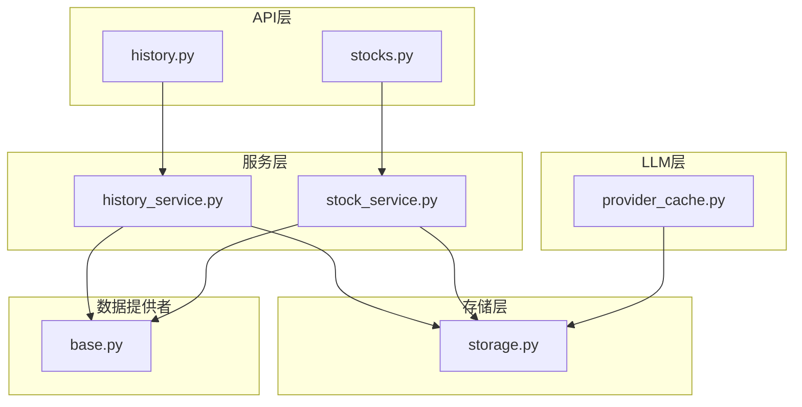
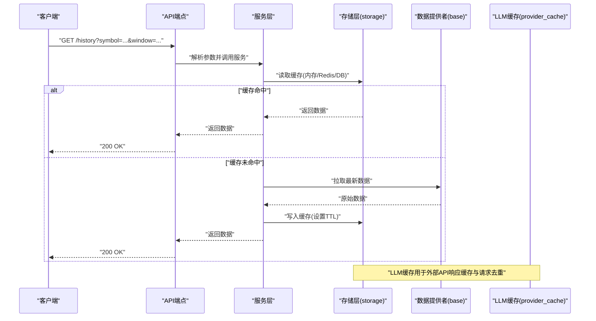
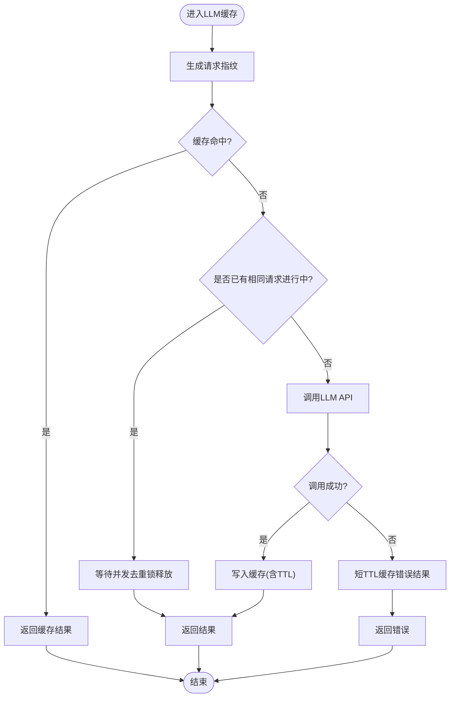
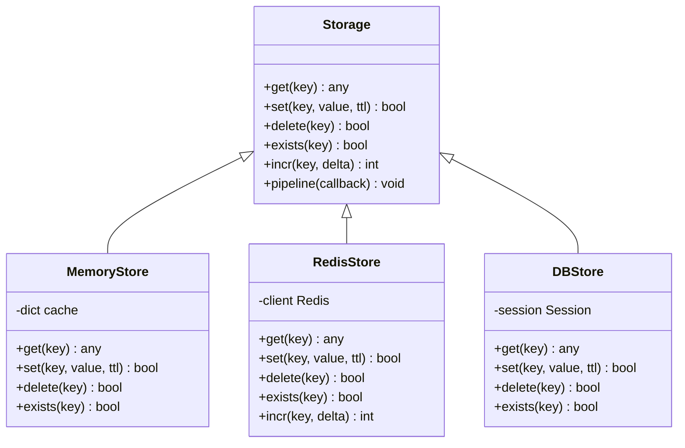
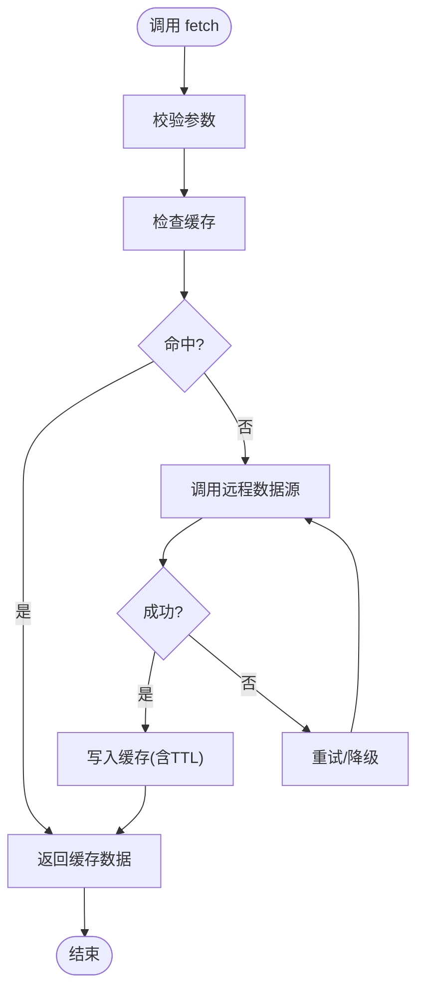
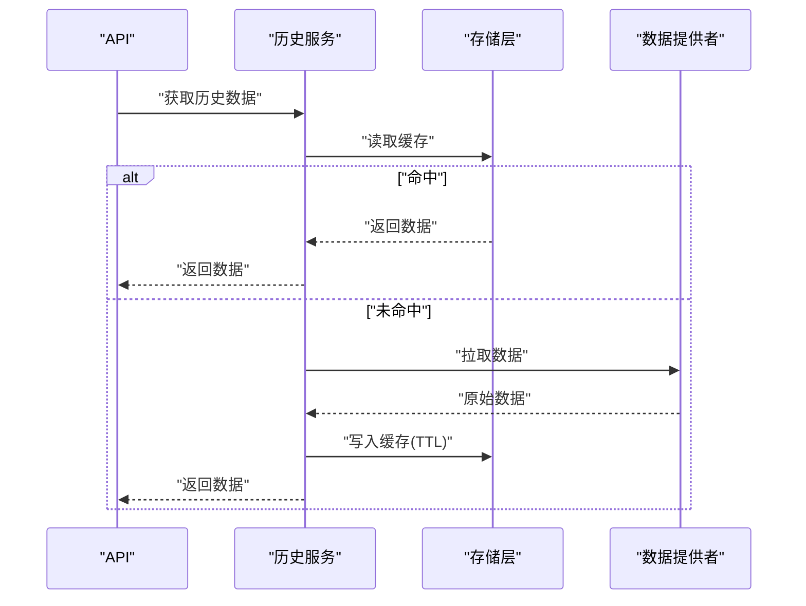
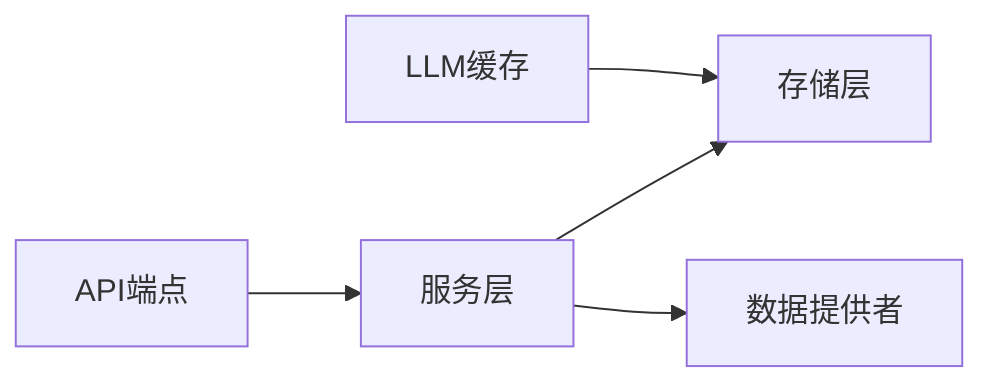

# 缓存策略

<cite>
**本文引用的文件**   
- [src/llm/provider_cache.py](file://src/llm/provider_cache.py)
- [src/storage.py](file://src/storage.py)
- [src/config.py](file://src/config.py)
- [data_provider/base.py](file://data_provider/base.py)
- [api/v1/endpoints/history.py](file://api/v1/endpoints/history.py)
- [api/v1/endpoints/stocks.py](file://api/v1/endpoints/stocks.py)
- [src/services/history_service.py](file://src/services/history_service.py)
- [src/services/stock_service.py](file://src/services/stock_service.py)
- [tests/test_provider_cache.py](file://tests/test_provider_cache.py)
- [tests/test_storage.py](file://tests/test_storage.py)
</cite>

## 目录
1. [简介](#简介)
2. [项目结构](#项目结构)
3. [核心组件](#核心组件)
4. [架构总览](#架构总览)
5. [详细组件分析](#详细组件分析)
6. [依赖关系分析](#依赖关系分析)
7. [性能考量](#性能考量)
8. [故障排查指南](#故障排查指南)
9. [结论](#结论)
10. [附录](#附录)

## 简介
本文件面向Daily Stock Analysis的缓存策略，围绕多级缓存架构（内存、Redis、数据库）进行系统化说明。内容涵盖：
- 多级缓存层次结构与职责划分
- 失效策略（TTL、LRU、热点识别）
- LLM提供商缓存优化（API响应缓存、请求去重、结果复用）
- 股票数据缓存（实时行情、历史数据预取、增量更新）
- 监控与调试（命中率、内存使用、基准测试）
- 分布式一致性保证与数据同步策略

## 项目结构
本项目将缓存能力集中在LLM层与存储层，并在服务层与API层进行调用编排。关键路径包括：
- LLM提供商缓存：位于 src/llm/provider_cache.py，负责对外部LLM API的响应缓存、请求去重与结果复用
- 通用存储抽象：位于 src/storage.py，封装内存、Redis、数据库等后端
- 配置管理：位于 src/config.py，提供缓存相关开关、TTL、容量等参数
- 数据获取基类：位于 data_provider/base.py，定义拉取与缓存的统一接口
- 历史与股票服务：位于 src/services/history_service.py 与 src/services/stock_service.py，编排缓存读取与回源逻辑
- API端点：位于 api/v1/endpoints/history.py 与 api/v1/endpoints/stocks.py，暴露带缓存能力的查询接口
- 测试用例：tests/test_provider_cache.py 与 tests/test_storage.py，覆盖缓存行为与边界条件

**图表来源** 
- [api/v1/endpoints/history.py](file://api/v1/endpoints/history.py)
- [api/v1/endpoints/stocks.py](file://api/v1/endpoints/stocks.py)
- [src/services/history_service.py](file://src/services/history_service.py)
- [src/services/stock_service.py](file://src/services/stock_service.py)
- [src/llm/provider_cache.py](file://src/llm/provider_cache.py)
- [src/storage.py](file://src/storage.py)
- [data_provider/base.py](file://data_provider/base.py)

**章节来源**
- [src/llm/provider_cache.py](file://src/llm/provider_cache.py)
- [src/storage.py](file://src/storage.py)
- [src/config.py](file://src/config.py)
- [data_provider/base.py](file://data_provider/base.py)
- [api/v1/endpoints/history.py](file://api/v1/endpoints/history.py)
- [api/v1/endpoints/stocks.py](file://api/v1/endpoints/stocks.py)
- [src/services/history_service.py](file://src/services/history_service.py)
- [src/services/stock_service.py](file://src/services/stock_service.py)

## 核心组件
- LLM提供商缓存（provider_cache.py）
  - 功能：对LLM API请求进行去重、响应缓存与结果复用；支持按请求指纹生成键值，避免重复计算
  - 关键点：请求指纹生成、并发去重锁、TTL过期控制、命中统计
- 通用存储（storage.py）
  - 功能：统一封装内存字典、Redis客户端、数据库访问；提供get/set/del/exists等原子操作
  - 关键点：多后端切换、序列化/反序列化、错误降级、连接池管理
- 配置（config.py）
  - 功能：集中管理缓存开关、TTL默认值、最大容量、预热策略、热点阈值
  - 关键点：环境变量注入、运行时重载、灰度开关
- 数据提供者基类（base.py）
  - 功能：定义fetch/get_latest/prefetch/incremental_update等标准方法，供各数据源实现
  - 关键点：异常重试、超时控制、缓存写入时机
- 历史与股票服务（history_service.py, stock_service.py）
  - 功能：编排缓存读取、回源到数据提供者、增量更新与批量预取
  - 关键点：读路径优先命中缓存，写路径先更新缓存再返回
- API端点（history.py, stocks.py）
  - 功能：对外暴露带缓存语义的REST接口，支持分页、过滤、时间窗口
  - 关键点：参数校验、缓存键规范化、限流与熔断

**章节来源**
- [src/llm/provider_cache.py](file://src/llm/provider_cache.py)
- [src/storage.py](file://src/storage.py)
- [src/config.py](file://src/config.py)
- [data_provider/base.py](file://data_provider/base.py)
- [src/services/history_service.py](file://src/services/history_service.py)
- [src/services/stock_service.py](file://src/services/stock_service.py)
- [api/v1/endpoints/history.py](file://api/v1/endpoints/history.py)
- [api/v1/endpoints/stocks.py](file://api/v1/endpoints/stocks.py)

## 架构总览
下图展示从API到存储的多级缓存调用链，以及LLM提供商缓存的集成位置。

**图表来源** 
- [api/v1/endpoints/history.py](file://api/v1/endpoints/history.py)
- [src/services/history_service.py](file://src/services/history_service.py)
- [src/storage.py](file://src/storage.py)
- [data_provider/base.py](file://data_provider/base.py)
- [src/llm/provider_cache.py](file://src/llm/provider_cache.py)

## 详细组件分析

### LLM提供商缓存（provider_cache.py）
- 设计要点
  - 请求指纹：基于模型、参数、输入文本等生成稳定哈希，作为缓存键
  - 并发去重：同一时刻相同请求仅发起一次网络调用，其余等待复用结果
  - TTL管理：按模型或任务类型设置不同过期时间，平衡新鲜度与成本
  - 命中率统计：记录命中/未命中次数，输出指标便于监控
- 失效策略
  - 固定TTL：适用于静态或低频变化数据
  - 滑动窗口：结合时间戳与版本号，减少雪崩风险
  - 热点识别：高频访问的请求指纹自动延长TTL或提升优先级
- 结果复用
  - 相同指纹直接返回缓存结果，避免重复计算
  - 失败结果可短期缓存以避免风暴

**图表来源** 
- [src/llm/provider_cache.py](file://src/llm/provider_cache.py)

**章节来源**
- [src/llm/provider_cache.py](file://src/llm/provider_cache.py)
- [tests/test_provider_cache.py](file://tests/test_provider_cache.py)

### 通用存储（storage.py）
- 设计要点
  - 多后端抽象：内存字典、Redis、数据库通过统一接口访问
  - 序列化：JSON或MessagePack，确保跨语言兼容
  - 错误降级：当Redis不可用时回退到内存或数据库
  - 连接池：Redis与数据库连接复用，降低开销
- 数据结构
  - 键空间：按模块+实体+维度组织，如 llm/{model}/{hash}、stock/{symbol}/realtime
  - 元数据：包含版本、更新时间、TTL、来源标识
- 一致性
  - 读写分离：读优先缓存，写先更新缓存再落库
  - 幂等性：写入操作具备幂等键，避免重复写入

**图表来源** 
- [src/storage.py](file://src/storage.py)

**章节来源**
- [src/storage.py](file://src/storage.py)
- [tests/test_storage.py](file://tests/test_storage.py)

### 数据提供者基类（base.py）
- 设计要点
  - 统一接口：fetch(symbol, window)、get_latest(symbol)、prefetch(symbols)、incremental_update(symbol, since)
  - 缓存协作：在成功拉取后写入缓存，失败时触发重试与降级
  - 异常处理：网络超时、限流、鉴权失败等场景的恢复策略
- 增量更新
  - 基于时间戳或版本号判断是否需要全量拉取
  - 合并策略：保留最新快照，避免脏数据覆盖

**图表来源** 
- [data_provider/base.py](file://data_provider/base.py)

**章节来源**
- [data_provider/base.py](file://data_provider/base.py)

### 历史与股票服务（history_service.py, stock_service.py）
- 历史服务
  - 读路径：优先内存→Redis→数据库→数据提供者
  - 写路径：先更新缓存，再异步落库，保证低延迟
  - 预取：在交易时段前批量预取热门标的历史数据
- 股票服务
  - 实时行情：高频更新，采用内存+Redis双缓冲，缩短读取路径
  - 增量更新：基于时间窗口推送变更，减少带宽与CPU消耗
  - 热点识别：根据访问频率动态调整TTL与副本数量

**图表来源** 
- [src/services/history_service.py](file://src/services/history_service.py)
- [src/services/stock_service.py](file://src/services/stock_service.py)
- [src/storage.py](file://src/storage.py)
- [data_provider/base.py](file://data_provider/base.py)

**章节来源**
- [src/services/history_service.py](file://src/services/history_service.py)
- [src/services/stock_service.py](file://src/services/stock_service.py)

### API端点（history.py, stocks.py）
- 历史端点
  - 参数：symbol、start_date、end_date、interval、fields
  - 缓存键：标准化为 symbol+date_range+interval+fields
  - 限流：按用户或IP限制QPS，防止缓存穿透
- 股票端点
  - 实时行情：short-lived缓存，TTL秒级
  - 盘后汇总：长TTL缓存，日终刷新

**章节来源**
- [api/v1/endpoints/history.py](file://api/v1/endpoints/history.py)
- [api/v1/endpoints/stocks.py](file://api/v1/endpoints/stocks.py)

## 依赖关系分析
- 组件耦合
  - API与服务层松耦合，通过接口契约通信
  - 服务层与存储层解耦，支持多后端切换
  - LLM缓存独立于业务缓存，避免相互影响
- 外部依赖
  - Redis：高性能KV存储，用于共享缓存
  - 数据库：持久化存储，用于审计与回放
  - 数据提供者：第三方数据源，需容错与重试

**图表来源** 
- [api/v1/endpoints/history.py](file://api/v1/endpoints/history.py)
- [api/v1/endpoints/stocks.py](file://api/v1/endpoints/stocks.py)
- [src/services/history_service.py](file://src/services/history_service.py)
- [src/services/stock_service.py](file://src/services/stock_service.py)
- [src/storage.py](file://src/storage.py)
- [data_provider/base.py](file://data_provider/base.py)
- [src/llm/provider_cache.py](file://src/llm/provider_cache.py)

**章节来源**
- [src/config.py](file://src/config.py)
- [src/storage.py](file://src/storage.py)
- [src/llm/provider_cache.py](file://src/llm/provider_cache.py)

## 性能考量
- 命中率优化
  - 热点识别：基于访问频次与时间衰减，动态调整TTL
  - 预取策略：交易时段前批量加载热门标的数据
  - 分片与副本：按symbol或时间范围分片，热点数据多副本
- 内存管理
  - LRU淘汰：内存缓存使用LRU算法，限制最大条目数
  - 压缩：大对象压缩存储，减少内存占用
- 网络与I/O
  - 连接池：Redis与数据库连接复用
  - 批处理：批量写入与读取，降低往返次数
- 基准测试
  - QPS与延迟：模拟高并发场景，评估缓存效果
  - 资源使用：CPU、内存、网络带宽监控

[本节为通用指导，不直接分析具体文件]

## 故障排查指南
- 常见问题
  - 缓存未命中：检查缓存键生成规则与参数标准化
  - 数据陈旧：确认TTL设置与刷新策略
  - 性能下降：观察命中率与内存使用，调整容量与淘汰策略
- 诊断工具
  - 命中率统计：记录命中/未命中比率，定位热点
  - 内存分析：查看缓存大小与增长趋势
  - 日志追踪：记录缓存读写路径与耗时
- 恢复策略
  - 降级：Redis不可用时回退到内存或数据库
  - 熔断：数据源异常时快速失败，避免雪崩
  - 预热：系统启动后预加载关键数据

**章节来源**
- [tests/test_provider_cache.py](file://tests/test_provider_cache.py)
- [tests/test_storage.py](file://tests/test_storage.py)

## 结论
Daily Stock Analysis的缓存策略通过多级缓存架构实现了高效的数据访问与成本控制。LLM提供商缓存专注于API响应优化，通用存储层提供灵活的后端选择，服务层与API层则确保一致的缓存语义。通过TTL、LRU与热点识别机制，系统在性能与新鲜度之间取得平衡。监控与调试工具帮助持续优化缓存效果，分布式一致性保证与数据同步策略确保多节点环境下的可靠性。

[本节为总结，不直接分析具体文件]

## 附录
- 配置项建议
  - 缓存开关：enable_memory_cache、enable_redis_cache、enable_db_cache
  - TTL默认值：default_ttl、hot_ttl、cold_ttl
  - 容量限制：max_entries、memory_limit_mb
  - 预热策略：prefetch_symbols、prefetch_window
- 最佳实践
  - 键命名规范：模块:实体:维度:标识
  - 错误处理：区分可重试与不可重试错误
  - 监控告警：命中率低于阈值时告警

[本节为补充信息，不直接分析具体文件]