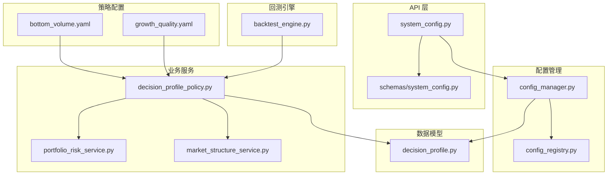
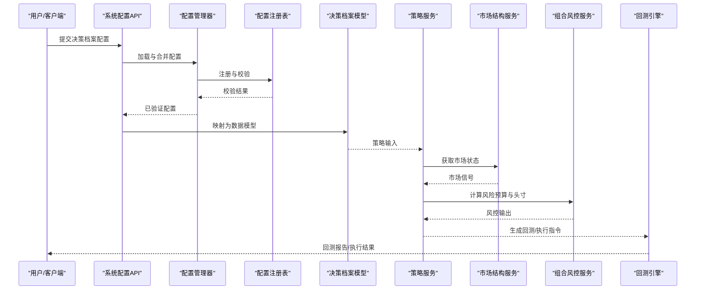
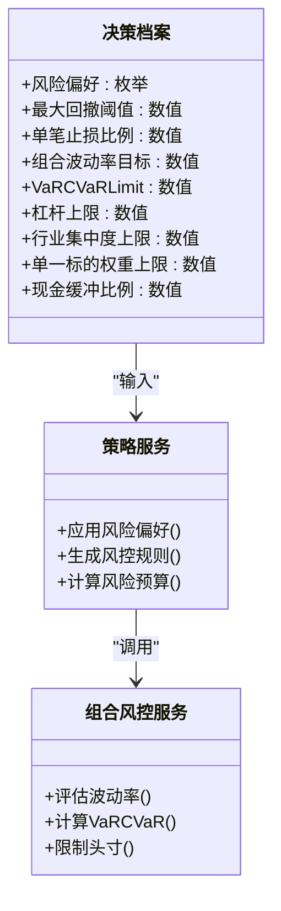
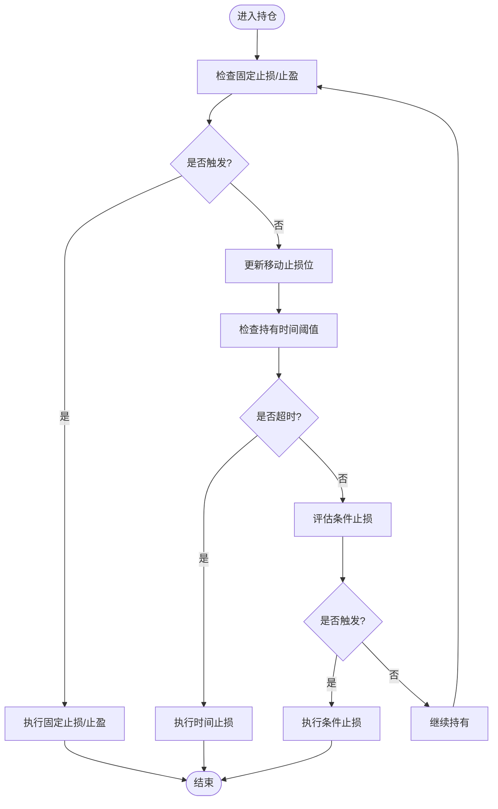
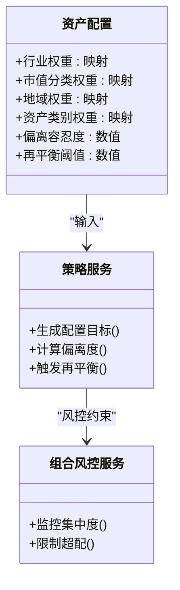
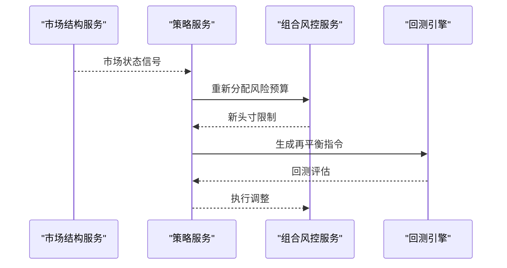
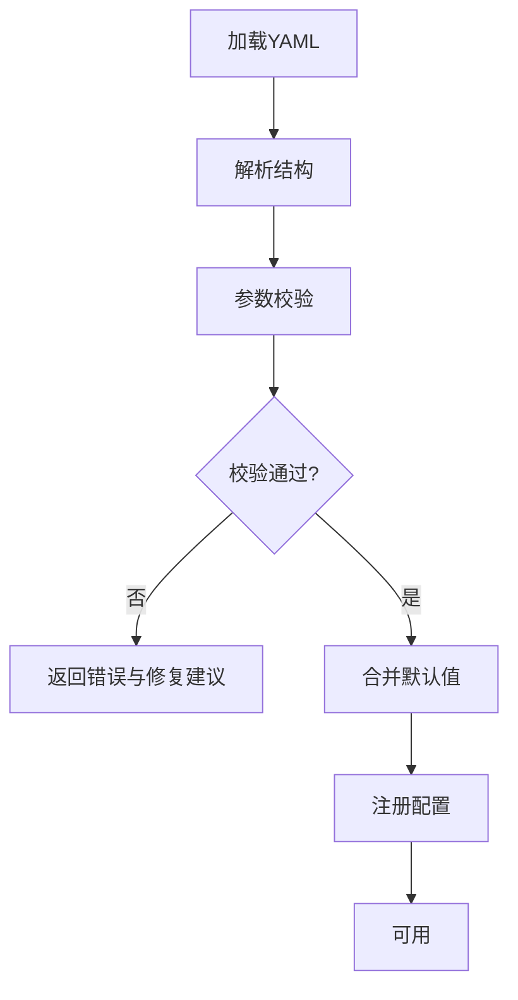
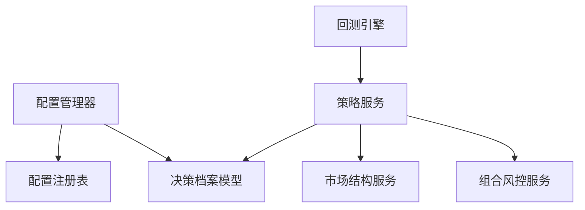

# 决策档案配置

<cite>
**本文引用的文件**   
- [src/schemas/decision_profile.py](file://src/schemas/decision_profile.py)
- [src/services/decision_profile_policy.py](file://src/services/decision_profile_policy.py)
- [src/core/config_manager.py](file://src/core/config_manager.py)
- [src/core/config_registry.py](file://src/core/config_registry.py)
- [api/v1/endpoints/system_config.py](file://api/v1/endpoints/system_config.py)
- [api/v1/schemas/system_config.py](file://api/v1/schemas/system_config.py)
- [strategies/growth_quality.yaml](file://strategies/growth_quality.yaml)
- [strategies/bottom_volume.yaml](file://strategies/bottom_volume.yaml)
- [src/services/portfolio_risk_service.py](file://src/services/portfolio_risk_service.py)
- [src/services/market_structure_service.py](file://src/services/market_structure_service.py)
- [src/core/backtest_engine.py](file://src/core/backtest_engine.py)
</cite>

## 目录
1. [简介](#简介)
2. [项目结构](#项目结构)
3. [核心组件](#核心组件)
4. [架构总览](#架构总览)
5. [详细组件分析](#详细组件分析)
6. [依赖关系分析](#依赖关系分析)
7. [性能考量](#性能考量)
8. [故障排查指南](#故障排查指南)
9. [结论](#结论)
10. [附录](#附录)

## 简介
本文件面向“决策档案配置”，聚焦于投资决策系统中的风险偏好、止损止盈规则、资产配置策略与动态调整机制，并提供配置文件格式说明（YAML）、参数验证规则与默认值设置。文档同时给出不同投资风格的配置示例与调优建议，帮助读者快速理解并落地使用。

## 项目结构
围绕决策档案的配置与执行，系统采用分层设计：
- 数据模型层：定义决策档案的结构化模式与校验规则
- 服务层：实现风险偏好、止损止盈、资产配置与动态调整的业务逻辑
- 配置管理层：负责配置的加载、注册、校验与持久化
- API 层：提供系统配置与决策档案的读写接口
- 策略层：以 YAML 形式声明式配置策略与参数

图表来源
- [api/v1/endpoints/system_config.py](file://api/v1/endpoints/system_config.py)
- [api/v1/schemas/system_config.py](file://api/v1/schemas/system_config.py)
- [src/core/config_manager.py](file://src/core/config_manager.py)
- [src/core/config_registry.py](file://src/core/config_registry.py)
- [src/schemas/decision_profile.py](file://src/schemas/decision_profile.py)
- [src/services/decision_profile_policy.py](file://src/services/decision_profile_policy.py)
- [src/services/portfolio_risk_service.py](file://src/services/portfolio_risk_service.py)
- [src/services/market_structure_service.py](file://src/services/market_structure_service.py)
- [strategies/growth_quality.yaml](file://strategies/growth_quality.yaml)
- [strategies/bottom_volume.yaml](file://strategies/bottom_volume.yaml)
- [src/core/backtest_engine.py](file://src/core/backtest_engine.py)

章节来源
- [src/schemas/decision_profile.py](file://src/schemas/decision_profile.py)
- [src/services/decision_profile_policy.py](file://src/services/decision_profile_policy.py)
- [src/core/config_manager.py](file://src/core/config_manager.py)
- [src/core/config_registry.py](file://src/core/config_registry.py)
- [api/v1/endpoints/system_config.py](file://api/v1/endpoints/system_config.py)
- [api/v1/schemas/system_config.py](file://api/v1/schemas/system_config.py)
- [strategies/growth_quality.yaml](file://strategies/growth_quality.yaml)
- [strategies/bottom_volume.yaml](file://strategies/bottom_volume.yaml)
- [src/services/portfolio_risk_service.py](file://src/services/portfolio_risk_service.py)
- [src/services/market_structure_service.py](file://src/services/market_structure_service.py)
- [src/core/backtest_engine.py](file://src/core/backtest_engine.py)

## 核心组件
- 决策档案数据模型：定义风险偏好、止损止盈、资产配置与动态调整的字段结构与约束
- 决策档案策略服务：将配置转化为可执行的策略规则，驱动组合风控与再平衡
- 配置管理器与注册表：统一加载、校验、合并与缓存配置
- 系统配置 API：对外暴露配置读取与更新能力
- 市场结构与组合风控服务：为动态调整提供市场状态感知与风险预算分配
- 回测引擎：基于配置进行历史回测与参数敏感性分析

章节来源
- [src/schemas/decision_profile.py](file://src/schemas/decision_profile.py)
- [src/services/decision_profile_policy.py](file://src/services/decision_profile_policy.py)
- [src/core/config_manager.py](file://src/core/config_manager.py)
- [src/core/config_registry.py](file://src/core/config_registry.py)
- [api/v1/endpoints/system_config.py](file://api/v1/endpoints/system_config.py)
- [api/v1/schemas/system_config.py](file://api/v1/schemas/system_config.py)
- [src/services/portfolio_risk_service.py](file://src/services/portfolio_risk_service.py)
- [src/services/market_structure_service.py](file://src/services/market_structure_service.py)
- [src/core/backtest_engine.py](file://src/core/backtest_engine.py)

## 架构总览
决策档案从配置到执行的端到端流程如下：
- 配置加载：通过配置管理器读取 YAML/环境变量/数据库等来源，完成合并与校验
- 模型映射：将配置映射为决策档案数据模型
- 策略解析：策略服务根据档案生成风控与交易规则
- 市场感知：市场结构服务提供市场状态信号
- 组合风控：组合风控服务计算风险预算与头寸限制
- 执行与回测：回测引擎或实盘执行器依据规则进行交易或模拟

图表来源
- [api/v1/endpoints/system_config.py](file://api/v1/endpoints/system_config.py)
- [src/core/config_manager.py](file://src/core/config_manager.py)
- [src/core/config_registry.py](file://src/core/config_registry.py)
- [src/schemas/decision_profile.py](file://src/schemas/decision_profile.py)
- [src/services/decision_profile_policy.py](file://src/services/decision_profile_policy.py)
- [src/services/market_structure_service.py](file://src/services/market_structure_service.py)
- [src/services/portfolio_risk_service.py](file://src/services/portfolio_risk_service.py)
- [src/core/backtest_engine.py](file://src/core/backtest_engine.py)

## 详细组件分析

### 风险偏好设置（保守型、稳健型、激进型）
- 风险等级定义
  - 保守型：低波动容忍度、严格止损、低仓位上限、高流动性偏好
  - 稳健型：中等波动容忍度、适度止损、均衡仓位、行业分散
  - 激进型：高波动容忍度、宽松止损、高仓位上限、集中行业/主题
- 关键参数
  - 最大回撤阈值、单笔止损比例、组合波动率目标、VaR/CVaR 限额、杠杆上限
  - 行业集中度上限、单一标的权重上限、现金缓冲比例
- 配置位置
  - 决策档案模型中定义风险偏好字段与取值范围
  - 策略服务根据风险等级选择默认参数集，并可被覆盖

图表来源
- [src/schemas/decision_profile.py](file://src/schemas/decision_profile.py)
- [src/services/decision_profile_policy.py](file://src/services/decision_profile_policy.py)
- [src/services/portfolio_risk_service.py](file://src/services/portfolio_risk_service.py)

章节来源
- [src/schemas/decision_profile.py](file://src/schemas/decision_profile.py)
- [src/services/decision_profile_policy.py](file://src/services/decision_profile_policy.py)
- [src/services/portfolio_risk_service.py](file://src/services/portfolio_risk_service.py)

### 止损止盈规则配置
- 固定比例止损/止盈
  - 按入场价设定固定百分比触发止损或止盈
  - 适用于趋势跟踪与波段交易
- 移动止损
  - 随价格创新高/新低动态上移/下移止损位
  - 结合ATR或均线通道增强鲁棒性
- 时间止损
  - 持有超过阈值未达目标则平仓
  - 降低资金占用与机会成本
- 条件止损
  - 基于市场状态（如波动率飙升、趋势反转信号）触发
  - 与宏观/板块指标联动

图表来源
- [src/services/decision_profile_policy.py](file://src/services/decision_profile_policy.py)
- [src/services/portfolio_risk_service.py](file://src/services/portfolio_risk_service.py)

章节来源
- [src/services/decision_profile_policy.py](file://src/services/decision_profile_policy.py)
- [src/services/portfolio_risk_service.py](file://src/services/portfolio_risk_service.py)

### 资产配置策略
- 行业分散
  - 设定行业权重区间与集中度上限，避免单行业过度暴露
- 市值配置
  - 大盘/中盘/小盘权重目标与偏离容忍度
- 地域分布
  - 国内/海外/新兴市场权重目标与汇率对冲策略
- 资产类别平衡
  - 股票/债券/商品/现金的目标权重与再平衡阈值

图表来源
- [src/schemas/decision_profile.py](file://src/schemas/decision_profile.py)
- [src/services/decision_profile_policy.py](file://src/services/decision_profile_policy.py)
- [src/services/portfolio_risk_service.py](file://src/services/portfolio_risk_service.py)

章节来源
- [src/schemas/decision_profile.py](file://src/schemas/decision_profile.py)
- [src/services/decision_profile_policy.py](file://src/services/decision_profile_policy.py)
- [src/services/portfolio_risk_service.py](file://src/services/portfolio_risk_service.py)

### 动态调整机制
- 市场状态感知
  - 通过市场结构服务识别趋势/震荡/高波动等状态
- 风险预算分配
  - 根据市场状态动态调整组合波动率目标与VaR限额
- 再平衡触发条件
  - 权重偏离阈值、风险预算耗尽、事件驱动（财报/政策）

图表来源
- [src/services/market_structure_service.py](file://src/services/market_structure_service.py)
- [src/services/decision_profile_policy.py](file://src/services/decision_profile_policy.py)
- [src/services/portfolio_risk_service.py](file://src/services/portfolio_risk_service.py)
- [src/core/backtest_engine.py](file://src/core/backtest_engine.py)

章节来源
- [src/services/market_structure_service.py](file://src/services/market_structure_service.py)
- [src/services/decision_profile_policy.py](file://src/services/decision_profile_policy.py)
- [src/services/portfolio_risk_service.py](file://src/services/portfolio_risk_service.py)
- [src/core/backtest_engine.py](file://src/core/backtest_engine.py)

### 配置文件格式说明（YAML）
- 结构定义
  - 顶层包含策略元信息、风险偏好、止损止盈、资产配置与动态调整模块
  - 各模块字段具备类型、取值范围与默认值
- 参数验证规则
  - 必填字段校验、数值范围校验、互斥/依赖关系校验
  - 通过配置注册表集中管理与扩展
- 默认值设置
  - 未显式设置的字段自动填充默认值，确保策略可运行

图表来源
- [src/core/config_manager.py](file://src/core/config_manager.py)
- [src/core/config_registry.py](file://src/core/config_registry.py)
- [strategies/growth_quality.yaml](file://strategies/growth_quality.yaml)
- [strategies/bottom_volume.yaml](file://strategies/bottom_volume.yaml)

章节来源
- [src/core/config_manager.py](file://src/core/config_manager.py)
- [src/core/config_registry.py](file://src/core/config_registry.py)
- [strategies/growth_quality.yaml](file://strategies/growth_quality.yaml)
- [strategies/bottom_volume.yaml](file://strategies/bottom_volume.yaml)

### 不同投资风格的配置示例与调优建议
- 保守型风格
  - 低波动目标、严格止损、高现金缓冲、行业分散
  - 调优建议：提高时间止损敏感度，降低杠杆与集中度
- 稳健型风格
  - 中等波动目标、移动止损为主、均衡行业与市值配置
  - 调优建议：根据市场状态微调风险预算，关注再平衡频率
- 激进型风格
  - 高波动容忍度、宽松止损、集中主题/成长股
  - 调优建议：加强条件止损与事件驱动风控，控制尾部风险

章节来源
- [strategies/growth_quality.yaml](file://strategies/growth_quality.yaml)
- [strategies/bottom_volume.yaml](file://strategies/bottom_volume.yaml)
- [src/services/decision_profile_policy.py](file://src/services/decision_profile_policy.py)

## 依赖关系分析
- 组件耦合
  - 策略服务依赖数据模型与市场结构服务，组合风控服务受策略服务驱动
  - 配置管理器与注册表为所有组件提供统一的配置访问
- 外部依赖
  - 数据源（行情/基本面）通过数据提供者接入
  - LLM/工具链用于增强分析与报告生成（非必需）
- 潜在循环依赖
  - 通过服务接口解耦，避免直接导入导致的循环

图表来源
- [src/core/config_manager.py](file://src/core/config_manager.py)
- [src/core/config_registry.py](file://src/core/config_registry.py)
- [src/schemas/decision_profile.py](file://src/schemas/decision_profile.py)
- [src/services/decision_profile_policy.py](file://src/services/decision_profile_policy.py)
- [src/services/market_structure_service.py](file://src/services/market_structure_service.py)
- [src/services/portfolio_risk_service.py](file://src/services/portfolio_risk_service.py)
- [src/core/backtest_engine.py](file://src/core/backtest_engine.py)

章节来源
- [src/core/config_manager.py](file://src/core/config_manager.py)
- [src/core/config_registry.py](file://src/core/config_registry.py)
- [src/schemas/decision_profile.py](file://src/schemas/decision_profile.py)
- [src/services/decision_profile_policy.py](file://src/services/decision_profile_policy.py)
- [src/services/market_structure_service.py](file://src/services/market_structure_service.py)
- [src/services/portfolio_risk_service.py](file://src/services/portfolio_risk_service.py)
- [src/core/backtest_engine.py](file://src/core/backtest_engine.py)

## 性能考量
- 配置加载与校验
  - 使用缓存与增量校验减少重复解析开销
- 市场状态感知
  - 异步拉取与批处理提升吞吐，避免阻塞主流程
- 风控计算
  - 向量化计算波动率与VaR，降低CPU压力
- 回测引擎
  - 并行回测与内存池优化，缩短参数扫描时间

[本节为通用指导，不直接分析具体文件]

## 故障排查指南
- 配置校验失败
  - 检查必填字段、数值范围与依赖关系
  - 查看配置注册表的错误提示与修复建议
- 策略执行异常
  - 确认市场状态信号正常，检查风险预算是否耗尽
  - 核对止损止盈触发逻辑与数据质量
- 回测结果异常
  - 验证数据源新鲜度与对齐窗口
  - 检查滑点、手续费与流动性假设

章节来源
- [src/core/config_registry.py](file://src/core/config_registry.py)
- [src/services/decision_profile_policy.py](file://src/services/decision_profile_policy.py)
- [src/services/portfolio_risk_service.py](file://src/services/portfolio_risk_service.py)
- [src/core/backtest_engine.py](file://src/core/backtest_engine.py)

## 结论
决策档案配置通过清晰的数据模型与服务分工，实现了风险偏好、止损止盈、资产配置与动态调整的闭环管理。借助配置管理器与注册表，系统具备良好的可扩展性与可维护性。建议在实际使用中结合回测与沙盒环境逐步调优参数，确保策略稳健性与适应性。

[本节为总结性内容，不直接分析具体文件]

## 附录
- 常用术语
  - 风险预算：在给定风险限额内分配至各资产/策略的额度
  - 移动止损：随价格变化动态调整止损位的风控手段
  - 再平衡：将组合权重恢复至目标权重的操作
- 参考策略文件
  - growth_quality.yaml：成长质量策略示例
  - bottom_volume.yaml：底部放量策略示例

章节来源
- [strategies/growth_quality.yaml](file://strategies/growth_quality.yaml)
- [strategies/bottom_volume.yaml](file://strategies/bottom_volume.yaml)