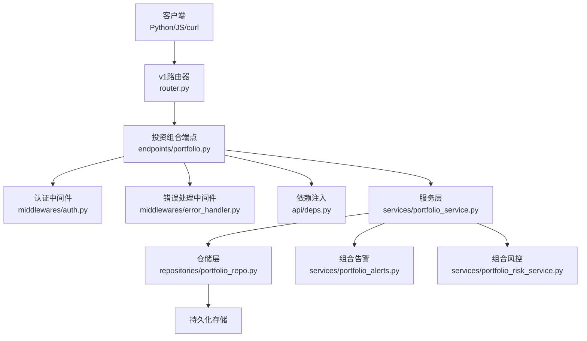
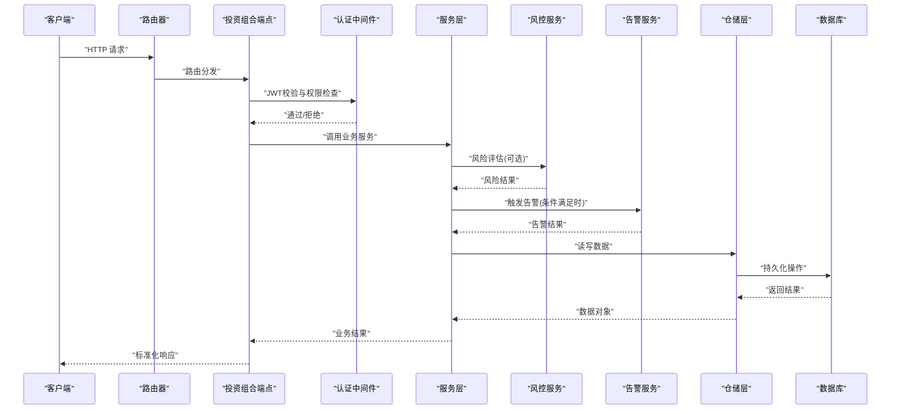
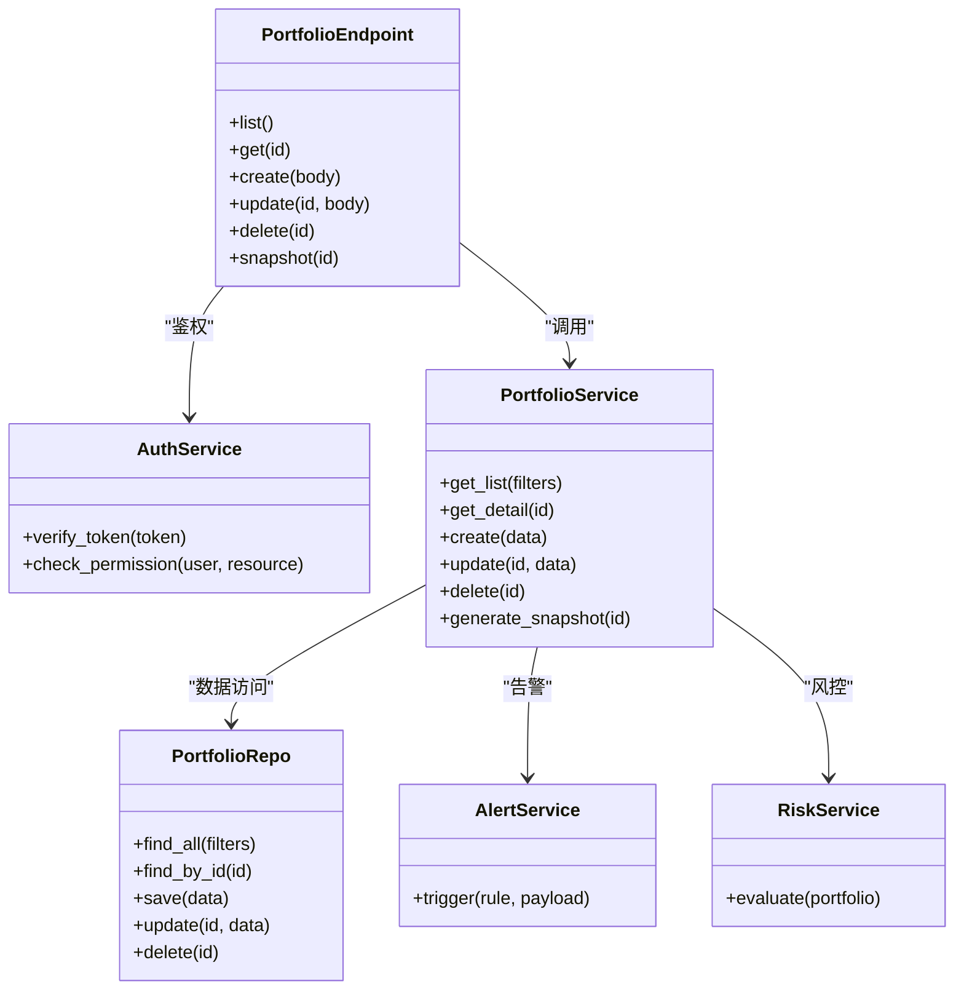

# 投资组合API接口

<cite>
**本文档引用的文件**   
- [portfolio.py](file://api/v1/endpoints/portfolio.py)
- [portfolio.py](file://api/v1/schemas/portfolio.py)
- [auth.py](file://api/middlewares/auth.py)
- [error_handler.py](file://api/middlewares/error_handler.py)
- [router.py](file://api/v1/router.py)
- [app.py](file://api/app.py)
- [deps.py](file://api/deps.py)
- [portfolio_service.py](file://src/services/portfolio_service.py)
- [portfolio_repo.py](file://src/repositories/portfolio_repo.py)
- [portfolio_alerts.py](file://src/services/portfolio_alerts.py)
- [portfolio_risk_service.py](file://src/services/portfolio_risk_service.py)
- [test_portfolio_api.py](file://tests/test_portfolio_api.py)
- [portfolio.ts](file://apps/dsa-web/src/api/portfolio.ts)
</cite>

## 目录
1. [简介](#简介)
2. [项目结构](#项目结构)
3. [核心组件](#核心组件)
4. [架构总览](#架构总览)
5. [详细组件分析](#详细组件分析)
6. [依赖关系分析](#依赖关系分析)
7. [性能考虑](#性能考虑)
8. [故障排查指南](#故障排查指南)
9. [结论](#结论)
10. [附录](#附录)

## 简介
本文件面向“投资组合”相关RESTful API，提供端点设计、认证与授权、数据验证、分页与过滤、错误码、限流策略与性能优化建议，并给出Python SDK、curl与JavaScript客户端的调用示例。该模块基于FastAPI构建，采用Pydantic进行请求/响应校验，通过中间件实现JWT鉴权与统一错误处理，服务层与仓储层分离以支持数据隔离与扩展性。

## 项目结构
围绕投资组合API的关键代码分布如下：
- 路由与端点定义：api/v1/endpoints/portfolio.py
- 请求/响应模型：api/v1/schemas/portfolio.py
- 认证与授权中间件：api/middlewares/auth.py
- 统一错误处理：api/middlewares/error_handler.py
- 路由注册与挂载：api/v1/router.py, api/app.py
- 依赖注入：api/deps.py
- 业务服务层：src/services/portfolio_service.py
- 数据访问层：src/repositories/portfolio_repo.py
- 组合告警与风控：src/services/portfolio_alerts.py, src/services/portfolio_risk_service.py
- 前端SDK：apps/dsa-web/src/api/portfolio.ts
- 测试用例：tests/test_portfolio_api.py

图表来源
- [router.py:1-200](file://api/v1/router.py#L1-L200)
- [portfolio.py](file://api/v1/endpoints/portfolio.py)
- [auth.py](file://api/middlewares/auth.py)
- [error_handler.py](file://api/middlewares/error_handler.py)
- [deps.py](file://api/deps.py)
- [portfolio_service.py](file://src/services/portfolio_service.py)
- [portfolio_repo.py](file://src/repositories/portfolio_repo.py)
- [portfolio_alerts.py](file://src/services/portfolio_alerts.py)
- [portfolio_risk_service.py](file://src/services/portfolio_risk_service.py)

章节来源
- [router.py:1-200](file://api/v1/router.py#L1-L200)
- [app.py:1-200](file://api/app.py#L1-L200)

## 核心组件
- 端点层（Endpoints）：定义RESTful路径、HTTP方法、查询参数、请求体与响应体，使用Pydantic模型进行强类型校验。
- 认证与授权（Auth）：基于JWT令牌验证用户身份，结合用户角色/权限控制资源访问；按用户或租户维度进行数据隔离。
- 服务层（Service）：封装业务逻辑，协调多个仓储与外部服务（如告警、风控）。
- 仓储层（Repository）：负责数据存取，屏蔽底层存储细节。
- 中间件（Middleware）：统一错误处理、日志、跨域、速率限制等横切关注点。
- 前端SDK：为Web应用提供类型安全的API调用封装。

章节来源
- [portfolio.py](file://api/v1/endpoints/portfolio.py)
- [portfolio.py](file://api/v1/schemas/portfolio.py)
- [auth.py](file://api/middlewares/auth.py)
- [error_handler.py](file://api/middlewares/error_handler.py)
- [deps.py](file://api/deps.py)
- [portfolio_service.py](file://src/services/portfolio_service.py)
- [portfolio_repo.py](file://src/repositories/portfolio_repo.py)

## 架构总览
下图展示了从客户端到数据存储的完整调用链路，以及认证、错误处理、服务与仓储的职责边界。

图表来源
- [portfolio.py](file://api/v1/endpoints/portfolio.py)
- [auth.py](file://api/middlewares/auth.py)
- [portfolio_service.py](file://src/services/portfolio_service.py)
- [portfolio_risk_service.py](file://src/services/portfolio_risk_service.py)
- [portfolio_alerts.py](file://src/services/portfolio_alerts.py)
- [portfolio_repo.py](file://src/repositories/portfolio_repo.py)

## 详细组件分析

### 端点与路由设计（Portfolio Endpoints）
- 基础路径：/api/v1/portfolio
- 典型端点（示例，具体以实际实现为准）：
  - GET /api/v1/portfolio/list：获取当前用户/租户的投资组合列表，支持分页与过滤。
  - GET /api/v1/portfolio/{id}：获取指定投资组合详情。
  - POST /api/v1/portfolio/create：创建新的投资组合，包含持仓、权重等字段校验。
  - PUT /api/v1/portfolio/{id}：更新投资组合信息。
  - DELETE /api/v1/portfolio/{id}：删除投资组合（需权限校验）。
  - POST /api/v1/portfolio/{id}/snapshot：生成快照，用于回测或报告。
- 查询参数：page、size、sort_by、order、keyword、date_from、date_to、status等。
- 请求体：遵循Pydantic模型定义，包含必填字段、数据类型、范围约束与自定义校验器。
- 响应体：统一包装{code, message, data}，data为具体业务对象或分页结构。

章节来源
- [portfolio.py](file://api/v1/endpoints/portfolio.py)
- [portfolio.py](file://api/v1/schemas/portfolio.py)

### 认证与授权机制（JWT与权限）
- JWT令牌验证：
  - 客户端在请求头携带Authorization: Bearer <token>。
  - 中间件解析并校验签名、过期时间、签发者等。
- 权限控制：
  - 基于用户角色或资源所有权判断是否允许访问。
  - 投资组合数据按用户ID或租户ID隔离，避免越权访问。
- 会话与刷新：
  - 支持短期访问令牌与长期刷新令牌的组合策略（若实现）。

章节来源
- [auth.py](file://api/middlewares/auth.py)
- [deps.py](file://api/deps.py)

### 数据验证规则（输入校验与业务验证）
- 输入参数校验：
  - 使用Pydantic模型对请求体与查询参数进行强类型校验。
  - 内置约束：非空、长度、数值范围、枚举值、日期格式等。
- 业务逻辑验证：
  - 组合名称唯一性、持仓权重总和校验、标的有效性检查。
  - 状态机转换合法性（如草稿→已发布）。
- 错误响应格式：
  - 统一错误结构：{code, message, details}，便于前端展示与重试。

章节来源
- [portfolio.py](file://api/v1/schemas/portfolio.py)
- [error_handler.py](file://api/middlewares/error_handler.py)

### 分页与过滤功能
- 分页参数：page（页码）、size（每页条数），默认值与上限保护。
- 排序选项：sort_by（字段名）、order（asc/desc），白名单校验防止注入。
- 搜索条件：keyword（模糊匹配）、date_from/date_to（时间窗口）、status（状态筛选）。
- 响应结构：包含total、page、size、items等字段。

章节来源
- [portfolio.py](file://api/v1/endpoints/portfolio.py)
- [portfolio.py](file://api/v1/schemas/portfolio.py)

### 服务层与仓储层职责
- 服务层：
  - 编排业务流程，调用仓储与外部服务（风控、告警）。
  - 聚合多源数据，计算指标（如收益、风险暴露）。
- 仓储层：
  - 抽象数据访问接口，支持多种后端（SQLite、PostgreSQL等）。
  - 实现数据隔离（按用户/租户过滤）。

章节来源
- [portfolio_service.py](file://src/services/portfolio_service.py)
- [portfolio_repo.py](file://src/repositories/portfolio_repo.py)

### 组合告警与风控集成
- 告警服务：
  - 根据阈值或规则触发通知（邮件、短信、IM）。
  - 支持订阅与取消订阅。
- 风控服务：
  - 评估组合风险（波动率、最大回撤、集中度等）。
  - 返回风险等级与建议动作。

章节来源
- [portfolio_alerts.py](file://src/services/portfolio_alerts.py)
- [portfolio_risk_service.py](file://src/services/portfolio_risk_service.py)

### 前端SDK集成（JavaScript）
- 提供类型安全的函数封装，自动附加JWT令牌。
- 支持Promise/async-await风格调用。
- 错误处理：统一捕获网络与业务错误，转换为友好提示。

章节来源
- [portfolio.ts](file://apps/dsa-web/src/api/portfolio.ts)

### 测试与契约验证
- 单元测试覆盖关键路径（创建、更新、删除、分页、过滤）。
- 集成测试验证JWT鉴权与数据隔离。
- 契约测试确保前后端数据结构一致。

章节来源
- [test_portfolio_api.py](file://tests/test_portfolio_api.py)

## 依赖关系分析

图表来源
- [portfolio.py](file://api/v1/endpoints/portfolio.py)
- [auth.py](file://api/middlewares/auth.py)
- [portfolio_service.py](file://src/services/portfolio_service.py)
- [portfolio_repo.py](file://src/repositories/portfolio_repo.py)
- [portfolio_alerts.py](file://src/services/portfolio_alerts.py)
- [portfolio_risk_service.py](file://src/services/portfolio_risk_service.py)

章节来源
- [portfolio.py](file://api/v1/endpoints/portfolio.py)
- [portfolio_service.py](file://src/services/portfolio_service.py)
- [portfolio_repo.py](file://src/repositories/portfolio_repo.py)

## 性能考虑
- 缓存策略：对热点查询（如组合列表、快照）启用Redis缓存，设置合理TTL。
- 数据库优化：
  - 为常用查询字段建立索引（user_id、status、updated_at）。
  - 使用分页与投影减少数据传输量。
- 异步处理：耗时任务（如快照生成、风控计算）放入消息队列异步执行。
- 连接池：数据库与外部服务连接复用，避免频繁握手开销。
- 压缩传输：启用Gzip/Brotli压缩大响应体。

[本节为通用指导，无需特定文件来源]

## 故障排查指南
- 常见错误码：
  - 400：请求参数校验失败（details包含字段级错误）。
  - 401：未认证或令牌无效。
  - 403：权限不足。
  - 404：资源不存在。
  - 429：请求频率超限。
  - 500：服务器内部错误。
- 排查步骤：
  - 检查请求头Authorization是否正确。
  - 查看错误响应中的message与details定位问题。
  - 启用调试日志，确认服务层与仓储层异常堆栈。
  - 验证数据库连接与索引是否生效。
- 监控与告警：
  - 记录慢查询与异常率。
  - 设置阈值告警（如错误率>1%持续5分钟）。

章节来源
- [error_handler.py](file://api/middlewares/error_handler.py)
- [test_portfolio_api.py](file://tests/test_portfolio_api.py)

## 结论
投资组合API采用分层架构与强类型校验，结合JWT鉴权与数据隔离，提供安全、可扩展的RESTful接口。通过服务层与仓储层解耦，便于集成告警与风控能力。建议在生产环境启用缓存、异步处理与监控告警，以提升性能与稳定性。

[本节为总结，无需特定文件来源]

## 附录

### API调用示例

- Python SDK示例
  - 安装依赖后，导入客户端并设置Base URL与Token。
  - 调用list、create、update等方法，传入Pydantic模型或字典。
  - 处理响应中的data与错误信息。

- curl命令示例
  - 获取列表：curl -H "Authorization: Bearer <token>" "https://api.example.com/api/v1/portfolio/list?page=1&size=10"
  - 创建组合：curl -X POST -H "Authorization: Bearer <token>" -H "Content-Type: application/json" -d '{"name":"...","holdings":[...]}' "https://api.example.com/api/v1/portfolio/create"

- JavaScript客户端示例
  - 使用fetch或axios发送请求，自动附加JWT。
  - 处理Promise结果与错误分支。
  - 在React/Vue中通过hooks或store管理状态。

[本节为通用示例，无需特定文件来源]

### 错误码说明
- 400：参数校验失败，details包含字段名与错误原因。
- 401：令牌缺失、过期或签名无效。
- 403：无权限访问资源。
- 404：资源不存在。
- 429：超过速率限制，Retry-After指示等待时间。
- 500：未知错误，查看服务端日志。

章节来源
- [error_handler.py](file://api/middlewares/error_handler.py)

### 限流策略
- 基于IP或用户ID的滑动窗口限流。
- 不同端点设置不同阈值（如创建操作更严格）。
- 返回429时附带Retry-After头部。

[本节为通用指导，无需特定文件来源]

### 性能优化建议
- 缓存热点数据（组合列表、快照）。
- 数据库索引优化与查询计划分析。
- 异步处理长耗时任务。
- 启用连接池与HTTP Keep-Alive。
- 压缩响应体与静态资源。

[本节为通用指导，无需特定文件来源]