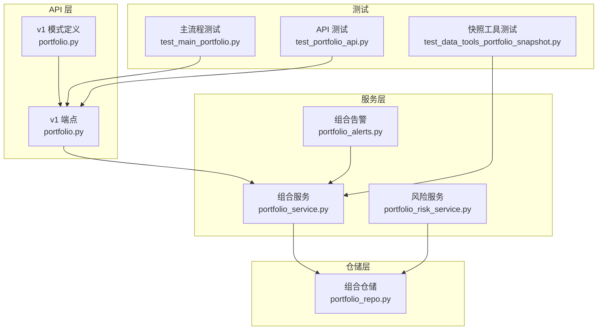
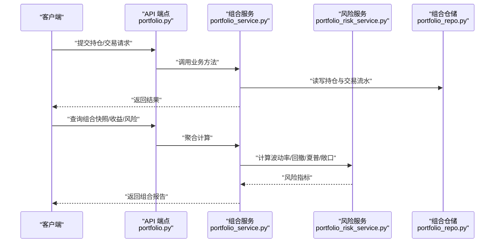
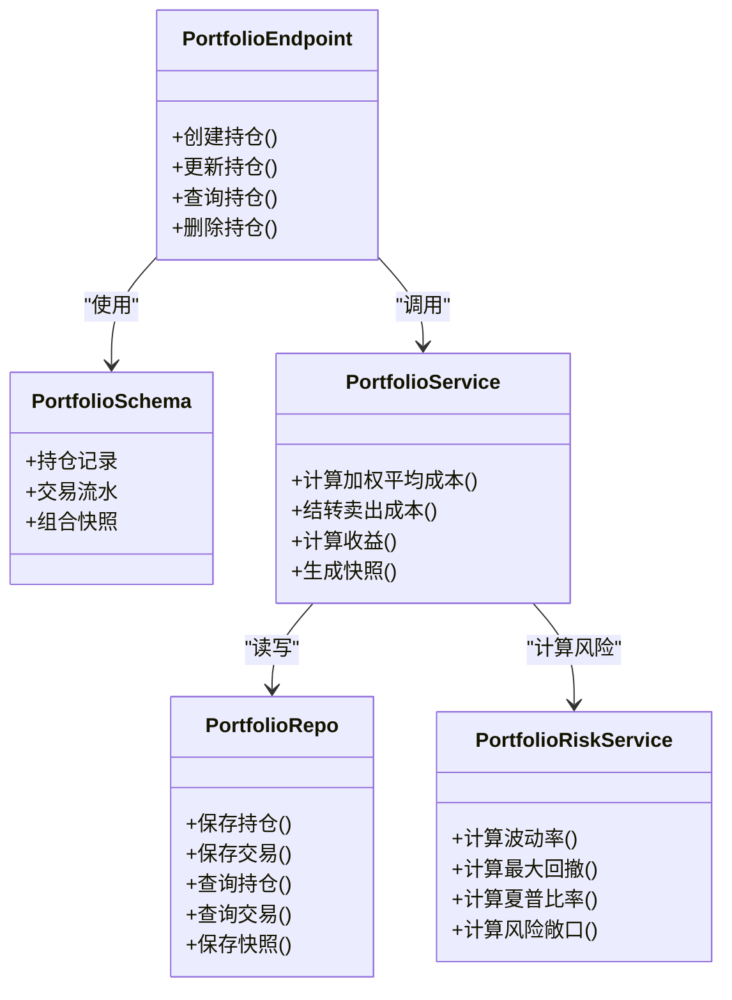

# 投资组合数据结构

<cite>
**本文引用的文件**   
- [portfolio.py](file://api/v1/schemas/portfolio.py)
- [portfolio.py](file://api/v1/endpoints/portfolio.py)
- [portfolio_service.py](file://src/services/portfolio_service.py)
- [portfolio_repo.py](file://src/repositories/portfolio_repo.py)
- [portfolio_risk_service.py](file://src/services/portfolio_risk_service.py)
- [portfolio_alerts.py](file://src/services/portfolio_alerts.py)
- [test_main_portfolio.py](file://tests/test_main_portfolio.py)
- [test_portfolio_api.py](file://tests/test_portfolio_api.py)
- [test_data_tools_portfolio_snapshot.py](file://tests/test_data_tools_portfolio_snapshot.py)
</cite>

## 目录
1. [简介](#简介)
2. [项目结构](#项目结构)
3. [核心组件](#核心组件)
4. [架构总览](#架构总览)
5. [详细组件分析](#详细组件分析)
6. [依赖关系分析](#依赖关系分析)
7. [性能考量](#性能考量)
8. [故障排查指南](#故障排查指南)
9. [结论](#结论)
10. [附录](#附录)

## 简介
本文件面向“投资组合数据结构”的设计与实现，聚焦持仓信息的数据模型、成本计算算法、收益统计模型、风险评估指标以及数据库表结构设计。文档以代码库中的实际实现为依据，结合接口定义、服务层逻辑、仓储层访问与测试用例，给出从概念到落地的完整说明，帮助读者理解并正确使用该模块。

## 项目结构
围绕投资组合功能，代码主要分布在以下位置：
- API 层：定义请求/响应数据模型与路由端点
- 服务层：封装业务逻辑（持仓管理、收益统计、风险指标）
- 仓储层：负责数据持久化与查询
- 测试：覆盖关键路径与边界条件

图表来源
- [portfolio.py](file://api/v1/endpoints/portfolio.py)
- [portfolio.py](file://api/v1/schemas/portfolio.py)
- [portfolio_service.py](file://src/services/portfolio_service.py)
- [portfolio_repo.py](file://src/repositories/portfolio_repo.py)
- [portfolio_risk_service.py](file://src/services/portfolio_risk_service.py)
- [portfolio_alerts.py](file://src/services/portfolio_alerts.py)
- [test_main_portfolio.py](file://tests/test_main_portfolio.py)
- [test_portfolio_api.py](file://tests/test_portfolio_api.py)
- [test_data_tools_portfolio_snapshot.py](file://tests/test_data_tools_portfolio_snapshot.py)

章节来源
- [portfolio.py](file://api/v1/endpoints/portfolio.py)
- [portfolio.py](file://api/v1/schemas/portfolio.py)
- [portfolio_service.py](file://src/services/portfolio_service.py)
- [portfolio_repo.py](file://src/repositories/portfolio_repo.py)
- [portfolio_risk_service.py](file://src/services/portfolio_risk_service.py)
- [portfolio_alerts.py](file://src/services/portfolio_alerts.py)
- [test_main_portfolio.py](file://tests/test_main_portfolio.py)
- [test_portfolio_api.py](file://tests/test_portfolio_api.py)
- [test_data_tools_portfolio_snapshot.py](file://tests/test_data_tools_portfolio_snapshot.py)

## 核心组件
- 数据模型（Schema）：定义持仓记录、交易流水、组合快照等字段与校验规则，包括股票代码、买入价格、持有数量、当前市值等核心字段。
- 端点（Endpoints）：提供创建、更新、查询、删除等 RESTful 接口，统一输入输出格式。
- 服务（Services）：实现成本计算（加权平均、分批买入分摊、手续费处理）、收益统计（浮动盈亏、已实现收益、收益率、年化收益）、风险评估（波动率、最大回撤、夏普比率、风险敞口）。
- 仓储（Repository）：封装数据库操作，保证主键约束、索引优化与外键关系。
- 告警（Alerts）：基于持仓与风险阈值触发预警。
- 测试（Tests）：覆盖端到端流程、边界条件与异常场景。

章节来源
- [portfolio.py](file://api/v1/schemas/portfolio.py)
- [portfolio.py](file://api/v1/endpoints/portfolio.py)
- [portfolio_service.py](file://src/services/portfolio_service.py)
- [portfolio_repo.py](file://src/repositories/portfolio_repo.py)
- [portfolio_risk_service.py](file://src/services/portfolio_risk_service.py)
- [portfolio_alerts.py](file://src/services/portfolio_alerts.py)
- [test_main_portfolio.py](file://tests/test_main_portfolio.py)
- [test_portfolio_api.py](file://tests/test_portfolio_api.py)
- [test_data_tools_portfolio_snapshot.py](file://tests/test_data_tools_portfolio_snapshot.py)

## 架构总览
下图展示了从 API 调用到数据持久化的整体流程，以及服务层对成本、收益与风险的加工逻辑。

图表来源
- [portfolio.py](file://api/v1/endpoints/portfolio.py)
- [portfolio_service.py](file://src/services/portfolio_service.py)
- [portfolio_risk_service.py](file://src/services/portfolio_risk_service.py)
- [portfolio_repo.py](file://src/repositories/portfolio_repo.py)

## 详细组件分析

### 数据模型设计（Schema）
- 持仓记录字段
  - 股票代码：唯一标识标的
  - 买入价格：历史成交均价或批次单价
  - 持有数量：当前持仓股数
  - 当前市值：按最新价计算的市值
  - 其他常见字段：币种/市场、账户ID、创建时间、更新时间、状态等
- 交易流水字段
  - 交易类型：买入/卖出/分红/调仓
  - 成交价格、成交数量、成交金额
  - 手续费、税费、滑点等成本项
  - 交易时间戳、订单号、备注
- 组合快照字段
  - 组合ID、日期、总资产、现金余额、持仓明细、当日收益、累计收益等

校验规则建议
- 非空与类型校验：股票代码、数量、价格必须有效
- 数量与金额一致性：成交数量×价格±费用≈成交金额
- 时间顺序：交易时间需递增，避免回滚导致不一致
- 唯一性：同一股票在同一账户下的持仓记录唯一；交易流水订单号唯一

章节来源
- [portfolio.py](file://api/v1/schemas/portfolio.py)
- [test_portfolio_api.py](file://tests/test_portfolio_api.py)

### 成本计算算法
- 加权平均成本
  - 适用于多次买入合并成本：总成本/总数量
  - 考虑手续费分摊至每笔成交，计入成本基数
- 分批买入的成本分摊
  - 每次买入独立记录批次，卖出时按先进先出（FIFO）或移动加权平均法结转成本
  - 支持部分卖出后的剩余批次成本重算
- 手续费处理
  - 买入：手续费加入成本基数
  - 卖出：手续费作为交易成本，影响已实现收益
  - 税费与滑点：按策略配置计入成本或费用科目

复杂度与性能
- 加权平均：O(1) 更新
- FIFO 结转：O(k)，k 为卖出涉及的批次数
- 批量计算：可缓存中间结果，减少重复计算

章节来源
- [portfolio_service.py](file://src/services/portfolio_service.py)
- [test_main_portfolio.py](file://tests/test_main_portfolio.py)

### 收益统计模型
- 浮动盈亏
  - 按最新价计算持仓市值与成本基数的差额
- 已实现收益
  - 基于卖出成交价与结转成本的差额，扣除相关费用
- 收益率计算
  - 单只标的收益率：（卖出收入-成本-费用）/成本
  - 组合收益率：加权汇总各标的收益率
- 年化收益
  - 基于持有期收益率换算为年化值，考虑复利与交易日长度

注意事项
- 汇率与币种转换：多币种组合需统一折算基准货币
- 分红与拆合股：调整成本基数与数量，保持口径一致

章节来源
- [portfolio_service.py](file://src/services/portfolio_service.py)
- [test_data_tools_portfolio_snapshot.py](file://tests/test_data_tools_portfolio_snapshot.py)

### 风险评估指标
- 波动率
  - 基于历史收益率序列的标准差，常用日频或周频
- 最大回撤
  - 峰值到谷底的最大跌幅，衡量极端下行风险
- 夏普比率
  - （组合收益-无风险利率）/波动率，衡量风险调整后收益
- 风险敞口
  - 按行业、地区、因子暴露进行归因，评估集中度风险

数据来源与频率
- 行情数据：用于计算收益率序列与波动率
- 无风险利率：根据市场与期限选择合适基准

章节来源
- [portfolio_risk_service.py](file://src/services/portfolio_risk_service.py)
- [portfolio_alerts.py](file://src/services/portfolio_alerts.py)

### 数据库表结构设计
- 持仓表（positions）
  - 主键：自增ID
  - 唯一键：账户ID+股票代码
  - 字段：账户ID、股票代码、数量、成本基数、最新价、市值、更新时间、状态
  - 索引：账户ID、股票代码、更新时间
- 交易流水表（trades）
  - 主键：自增ID
  - 唯一键：订单号
  - 字段：订单号、账户ID、股票代码、交易类型、成交价格、成交数量、成交金额、手续费、税费、滑点、交易时间、备注
  - 索引：账户ID、股票代码、交易时间、订单号
- 组合快照表（portfolio_snapshots）
  - 主键：自增ID
  - 字段：组合ID、日期、总资产、现金余额、持仓明细JSON、当日收益、累计收益、更新时间
  - 索引：组合ID、日期

外键关系
- trades.account_id → accounts.id
- positions.account_id → accounts.id
- snapshots.composition_id → compositions.id

约束与优化
- 使用事务保证交易与持仓的一致性
- 合理分区与归档历史快照，提升查询性能
- 对高频查询字段建立复合索引

章节来源
- [portfolio_repo.py](file://src/repositories/portfolio_repo.py)
- [test_main_portfolio.py](file://tests/test_main_portfolio.py)

### 实际数据示例与验证规则
- 示例数据要点
  - 持仓：某股票持有数量为正，成本基数与最新价存在差异，市值由最新价计算
  - 交易：买入与卖出成对出现，订单号唯一，时间递增
  - 快照：每日生成，包含总资产与收益指标
- 验证规则
  - 数量与金额一致性校验
  - 时间顺序校验
  - 唯一性校验（订单号、持仓唯一键）
  - 收益与风险指标合理性检查（如波动率为正、回撤不超过100%）

章节来源
- [test_portfolio_api.py](file://tests/test_portfolio_api.py)
- [test_data_tools_portfolio_snapshot.py](file://tests/test_data_tools_portfolio_snapshot.py)

## 依赖关系分析
- API 端点依赖 Schema 定义与服务层方法
- 服务层依赖仓储层进行数据存取，并调用风险服务计算指标
- 仓储层依赖数据库连接与事务管理
- 测试覆盖端到端流程与边界条件

图表来源
- [portfolio.py](file://api/v1/endpoints/portfolio.py)
- [portfolio.py](file://api/v1/schemas/portfolio.py)
- [portfolio_service.py](file://src/services/portfolio_service.py)
- [portfolio_risk_service.py](file://src/services/portfolio_risk_service.py)
- [portfolio_repo.py](file://src/repositories/portfolio_repo.py)

章节来源
- [portfolio.py](file://api/v1/endpoints/portfolio.py)
- [portfolio.py](file://api/v1/schemas/portfolio.py)
- [portfolio_service.py](file://src/services/portfolio_service.py)
- [portfolio_risk_service.py](file://src/services/portfolio_risk_service.py)
- [portfolio_repo.py](file://src/repositories/portfolio_repo.py)

## 性能考量
- 批量写入：交易与持仓的批量插入减少往返开销
- 缓存热点：最近交易日快照与实时行情缓存
- 索引优化：针对账户ID、股票代码、时间的复合索引
- 异步计算：风险指标可在后台任务中增量更新
- 分页与限流：大集合查询采用分页，防止过载

[本节为通用指导，不直接分析具体文件]

## 故障排查指南
- 数据不一致
  - 检查事务是否成功提交
  - 核对交易时间与数量一致性
- 收益异常
  - 确认成本结转方法与手续费处理是否正确
  - 检查汇率与币种转换
- 风险指标异常
  - 验证收益率序列与无风险利率来源
  - 检查缺失数据与异常值的处理
- 接口错误
  - 查看请求参数是否符合 Schema 校验
  - 检查权限与账户隔离

章节来源
- [portfolio_alerts.py](file://src/services/portfolio_alerts.py)
- [test_portfolio_api.py](file://tests/test_portfolio_api.py)

## 结论
本投资组合数据结构以清晰的模型定义、稳健的服务层算法与完善的仓储设计为基础，实现了从交易到持仓、从收益到风险的全链路管理。通过合理的索引与事务保障，系统在准确性与性能之间取得平衡。建议在后续迭代中持续优化风险指标的增量计算与数据质量校验，以提升系统的可靠性与可扩展性。

[本节为总结性内容，不直接分析具体文件]

## 附录
- 术语表
  - 加权平均成本：按成交数量加权计算的平均成本
  - 浮动盈亏：未平仓头寸的账面盈亏
  - 已实现收益：平仓后实际实现的盈亏
  - 波动率：收益率序列的标准差
  - 最大回撤：历史净值曲线从峰值到谷值的最大跌幅
  - 夏普比率：风险调整后收益指标
  - 风险敞口：按维度划分的风险暴露程度
- 参考实现路径
  - 数据模型与端点：[portfolio.py](file://api/v1/schemas/portfolio.py)、[portfolio.py](file://api/v1/endpoints/portfolio.py)
  - 业务逻辑：[portfolio_service.py](file://src/services/portfolio_service.py)
  - 风险计算：[portfolio_risk_service.py](file://src/services/portfolio_risk_service.py)
  - 数据持久化：[portfolio_repo.py](file://src/repositories/portfolio_repo.py)
  - 告警机制：[portfolio_alerts.py](file://src/services/portfolio_alerts.py)
  - 测试用例：[test_main_portfolio.py](file://tests/test_main_portfolio.py)、[test_portfolio_api.py](file://tests/test_portfolio_api.py)、[test_data_tools_portfolio_snapshot.py](file://tests/test_data_tools_portfolio_snapshot.py)