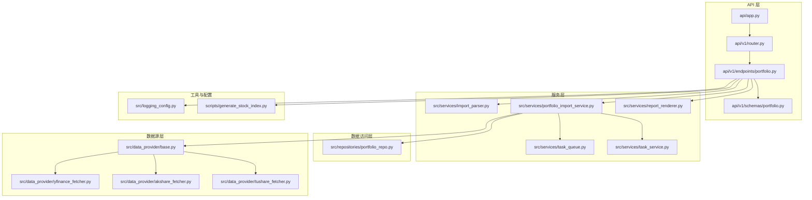
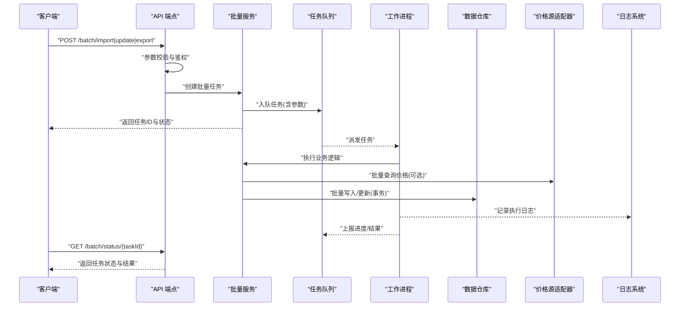
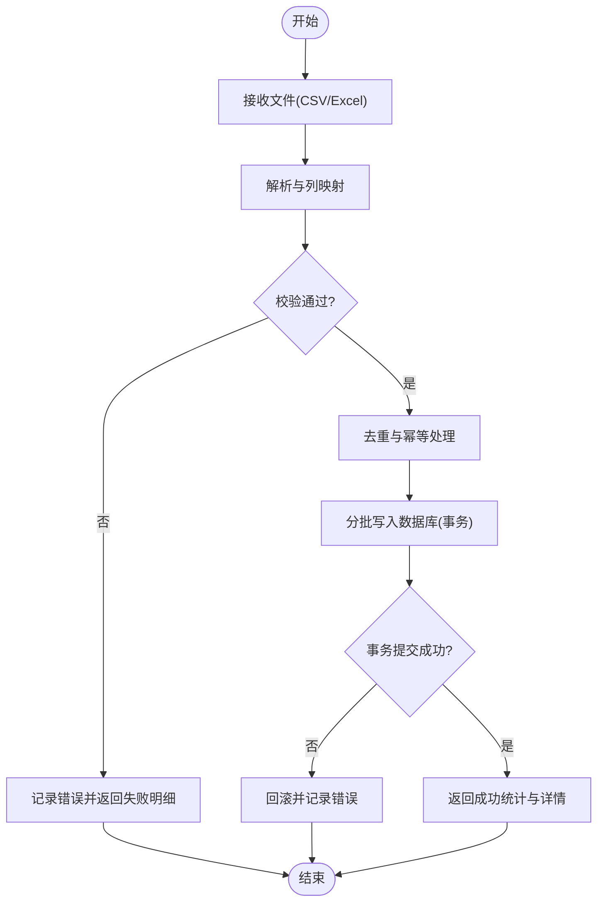
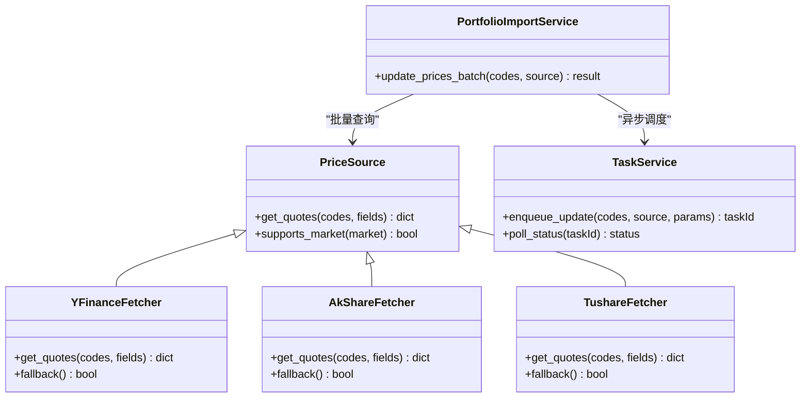
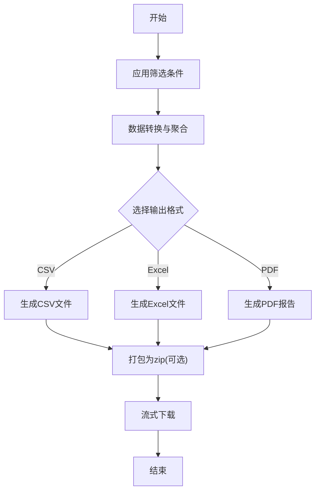
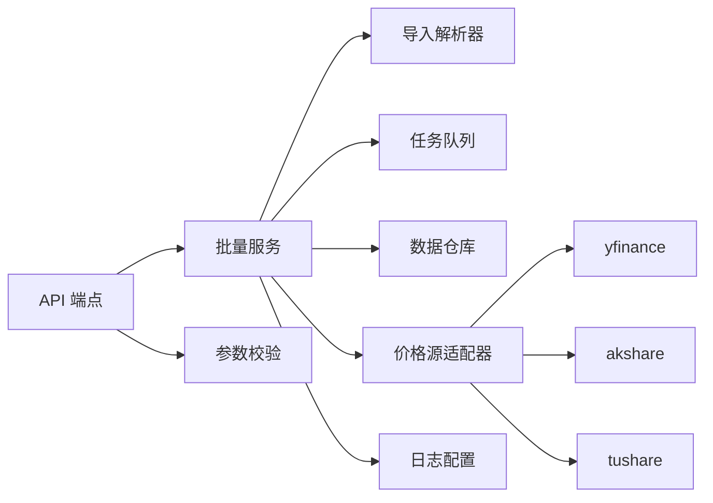

# 批量操作

<cite>
**本文引用的文件**   
- [api/app.py](file://api/app.py)
- [api/v1/router.py](file://api/v1/router.py)
- [api/v1/endpoints/portfolio.py](file://api/v1/endpoints/portfolio.py)
- [api/v1/schemas/portfolio.py](file://api/v1/schemas/portfolio.py)
- [src/services/import_parser.py](file://src/services/import_parser.py)
- [src/services/portfolio_import_service.py](file://src/services/portfolio_import_service.py)
- [src/services/task_queue.py](file://src/services/task_queue.py)
- [src/services/task_service.py](file://src/services/task_service.py)
- [src/repositories/portfolio_repo.py](file://src/repositories/portfolio_repo.py)
- [src/data_provider/base.py](file://src/data_provider/base.py)
- [src/data_provider/yfinance_fetcher.py](file://src/data_provider/yfinance_fetcher.py)
- [src/data_provider/akshare_fetcher.py](file://src/data_provider/akshare_fetcher.py)
- [src/data_provider/tushare_fetcher.py](file://src/data_provider/tushare_fetcher.py)
- [src/logging_config.py](file://src/logging_config.py)
- [scripts/generate_stock_index.py](file://scripts/generate_stock_index.py)
</cite>

## 目录
1. [简介](#简介)
2. [项目结构](#项目结构)
3. [核心组件](#核心组件)
4. [架构总览](#架构总览)
5. [详细组件分析](#详细组件分析)
6. [依赖关系分析](#依赖关系分析)
7. [性能考虑](#性能考虑)
8. [故障排查指南](#故障排查指南)
9. [结论](#结论)
10. [附录：API 接口与使用示例](#附录api-接口与使用示例)

## 简介
本文件围绕“批量操作”能力进行系统化文档化，覆盖以下关键场景：
- 批量导入持仓：支持 CSV、Excel 格式；提供数据解析、字段校验、去重与幂等写入。
- 批量更新价格：支持多价格源选择；批量查询与异步任务处理；失败重试与部分成功回滚策略。
- 批量导出报表：按条件筛选数据；多格式转换（CSV/Excel/PDF）；多文件打包下载。
- 错误处理：部分失败重试、事务回滚、结构化日志记录与可观测性。
- 最佳实践：数据准备规范、性能优化要点、监控告警建议。
- API 接口与使用示例：完整的请求/响应契约与调用流程说明。

## 项目结构
与批量操作相关的代码主要分布在以下模块：
- API 层：路由注册与参数校验
- 服务层：导入解析、任务编排、价格更新、报表生成
- 数据访问层：持仓与交易数据的持久化
- 数据源层：多价格源适配与统一接口
- 工具与配置：日志、任务队列、脚本辅助

**图表来源** 
- [api/app.py](file://api/app.py)
- [api/v1/router.py](file://api/v1/router.py)
- [api/v1/endpoints/portfolio.py](file://api/v1/endpoints/portfolio.py)
- [api/v1/schemas/portfolio.py](file://api/v1/schemas/portfolio.py)
- [src/services/import_parser.py](file://src/services/import_parser.py)
- [src/services/portfolio_import_service.py](file://src/services/portfolio_import_service.py)
- [src/services/task_queue.py](file://src/services/task_queue.py)
- [src/services/task_service.py](file://src/services/task_service.py)
- [src/repositories/portfolio_repo.py](file://src/repositories/portfolio_repo.py)
- [src/data_provider/base.py](file://src/data_provider/base.py)
- [src/data_provider/yfinance_fetcher.py](file://src/data_provider/yfinance_fetcher.py)
- [src/data_provider/akshare_fetcher.py](file://src/data_provider/akshare_fetcher.py)
- [src/data_provider/tushare_fetcher.py](file://src/data_provider/tushare_fetcher.py)
- [src/logging_config.py](file://src/logging_config.py)
- [scripts/generate_stock_index.py](file://scripts/generate_stock_index.py)

**章节来源**
- [api/app.py](file://api/app.py)
- [api/v1/router.py](file://api/v1/router.py)
- [api/v1/endpoints/portfolio.py](file://api/v1/endpoints/portfolio.py)
- [api/v1/schemas/portfolio.py](file://api/v1/schemas/portfolio.py)
- [src/services/import_parser.py](file://src/services/import_parser.py)
- [src/services/portfolio_import_service.py](file://src/services/portfolio_import_service.py)
- [src/services/task_queue.py](file://src/services/task_queue.py)
- [src/services/task_service.py](file://src/services/task_service.py)
- [src/repositories/portfolio_repo.py](file://src/repositories/portfolio_repo.py)
- [src/data_provider/base.py](file://src/data_provider/base.py)
- [src/data_provider/yfinance_fetcher.py](file://src/data_provider/yfinance_fetcher.py)
- [src/data_provider/akshare_fetcher.py](file://src/data_provider/akshare_fetcher.py)
- [src/data_provider/tushare_fetcher.py](file://src/data_provider/tushare_fetcher.py)
- [src/logging_config.py](file://src/logging_config.py)
- [scripts/generate_stock_index.py](file://scripts/generate_stock_index.py)

## 核心组件
- 导入解析器（import_parser）：负责 CSV/Excel 的读取、列映射、类型转换与基础校验。
- 持仓导入服务（portfolio_import_service）：协调解析、验证、去重、批量写入与事务控制。
- 任务队列与服务（task_queue, task_service）：异步执行批量任务，支持进度跟踪与重试。
- 数据访问仓库（portfolio_repo）：批量插入/更新持仓数据，保证一致性。
- 价格源适配器（data_provider.base 及具体 fetcher）：统一价格查询接口，支持多源切换与降级。
- 报表渲染（report_renderer）：将筛选后的数据转换为多种格式并打包下载。
- 日志配置（logging_config）：统一日志输出，便于追踪批量操作的执行轨迹。

**章节来源**
- [src/services/import_parser.py](file://src/services/import_parser.py)
- [src/services/portfolio_import_service.py](file://src/services/portfolio_import_service.py)
- [src/services/task_queue.py](file://src/services/task_queue.py)
- [src/services/task_service.py](file://src/services/task_service.py)
- [src/repositories/portfolio_repo.py](file://src/repositories/portfolio_repo.py)
- [src/data_provider/base.py](file://src/data_provider/base.py)
- [src/data_provider/yfinance_fetcher.py](file://src/data_provider/yfinance_fetcher.py)
- [src/data_provider/akshare_fetcher.py](file://src/data_provider/akshare_fetcher.py)
- [src/data_provider/tushare_fetcher.py](file://src/data_provider/tushare_fetcher.py)
- [src/services/report_renderer.py](file://src/services/report_renderer.py)
- [src/logging_config.py](file://src/logging_config.py)

## 架构总览
批量操作的整体流程如下：
- 客户端通过 API 提交批量任务（导入/更新/导出）。
- API 层进行参数校验与鉴权后，交由服务层编排。
- 服务层根据任务类型调用解析器、数据源或渲染器。
- 任务进入队列异步执行，支持进度上报与重试。
- 数据访问层以事务方式写入，确保一致性。
- 日志系统记录关键事件，便于问题定位与审计。

**图表来源** 
- [api/v1/endpoints/portfolio.py](file://api/v1/endpoints/portfolio.py)
- [src/services/portfolio_import_service.py](file://src/services/portfolio_import_service.py)
- [src/services/task_queue.py](file://src/services/task_queue.py)
- [src/services/task_service.py](file://src/services/task_service.py)
- [src/repositories/portfolio_repo.py](file://src/repositories/portfolio_repo.py)
- [src/data_provider/base.py](file://src/data_provider/base.py)
- [src/logging_config.py](file://src/logging_config.py)

## 详细组件分析

### 批量导入持仓
- 文件格式支持：CSV、Excel（.xlsx/.xls），由解析器统一读取。
- 数据解析：列名映射、数据类型转换、日期格式化、数值精度处理。
- 批量验证：必填字段检查、股票代码有效性、数量与价格范围校验、重复项检测。
- 写入策略：分批写入、主键冲突处理（更新或跳过）、事务边界控制。
- 进度与结果：任务状态机（待处理/进行中/完成/失败），失败明细与成功统计。

**图表来源** 
- [src/services/import_parser.py](file://src/services/import_parser.py)
- [src/services/portfolio_import_service.py](file://src/services/portfolio_import_service.py)
- [src/repositories/portfolio_repo.py](file://src/repositories/portfolio_repo.py)

**章节来源**
- [src/services/import_parser.py](file://src/services/import_parser.py)
- [src/services/portfolio_import_service.py](file://src/services/portfolio_import_service.py)
- [src/repositories/portfolio_repo.py](file://src/repositories/portfolio_repo.py)

### 批量更新价格
- 价格源选择：支持多个数据源（如 yfinance、akshare、tushare），可按优先级或市场选择。
- 批量查询：按股票代码列表批量拉取历史/实时价格，支持分页与并发限制。
- 异步处理：任务入队，后台 worker 执行，支持中断与恢复。
- 失败重试：指数退避重试，记录失败原因与重试次数。
- 数据一致性：更新前快照、冲突解决策略（最新覆盖或合并）。

**图表来源** 
- [src/data_provider/base.py](file://src/data_provider/base.py)
- [src/data_provider/yfinance_fetcher.py](file://src/data_provider/yfinance_fetcher.py)
- [src/data_provider/akshare_fetcher.py](file://src/data_provider/akshare_fetcher.py)
- [src/data_provider/tushare_fetcher.py](file://src/data_provider/tushare_fetcher.py)
- [src/services/task_service.py](file://src/services/task_service.py)
- [src/services/portfolio_import_service.py](file://src/services/portfolio_import_service.py)

**章节来源**
- [src/data_provider/base.py](file://src/data_provider/base.py)
- [src/data_provider/yfinance_fetcher.py](file://src/data_provider/yfinance_fetcher.py)
- [src/data_provider/akshare_fetcher.py](file://src/data_provider/akshare_fetcher.py)
- [src/data_provider/tushare_fetcher.py](file://src/data_provider/tushare_fetcher.py)
- [src/services/task_service.py](file://src/services/task_service.py)
- [src/services/portfolio_import_service.py](file://src/services/portfolio_import_service.py)

### 批量导出报表
- 数据筛选：按时间范围、股票列表、指标维度过滤。
- 格式转换：CSV、Excel、PDF 等多格式输出。
- 多文件打包：按主题或维度分文件，压缩为 zip 包。
- 流式输出：大文件分块传输，避免内存溢出。

**图表来源** 
- [src/services/report_renderer.py](file://src/services/report_renderer.py)

**章节来源**
- [src/services/report_renderer.py](file://src/services/report_renderer.py)

### 错误处理与事务
- 部分失败重试：对单个条目失败进行重试，不影响其他条目。
- 事务回滚：批量写入失败时整体回滚，保证数据一致性。
- 日志记录：结构化日志包含任务ID、批次号、错误码与堆栈。
- 监控告警：失败率阈值触发告警，通知运维与开发。

**章节来源**
- [src/logging_config.py](file://src/logging_config.py)
- [src/services/portfolio_import_service.py](file://src/services/portfolio_import_service.py)
- [src/repositories/portfolio_repo.py](file://src/repositories/portfolio_repo.py)

## 依赖关系分析
- API 端点依赖服务层，服务层依赖解析器、任务队列与数据仓库。
- 数据源适配器抽象了不同价格源的差异，提供统一接口。
- 日志配置贯穿各层，确保可观测性。
- 脚本工具用于数据准备与索引生成。

**图表来源** 
- [api/v1/endpoints/portfolio.py](file://api/v1/endpoints/portfolio.py)
- [api/v1/schemas/portfolio.py](file://api/v1/schemas/portfolio.py)
- [src/services/import_parser.py](file://src/services/import_parser.py)
- [src/services/portfolio_import_service.py](file://src/services/portfolio_import_service.py)
- [src/services/task_queue.py](file://src/services/task_queue.py)
- [src/repositories/portfolio_repo.py](file://src/repositories/portfolio_repo.py)
- [src/data_provider/base.py](file://src/data_provider/base.py)
- [src/data_provider/yfinance_fetcher.py](file://src/data_provider/yfinance_fetcher.py)
- [src/data_provider/akshare_fetcher.py](file://src/data_provider/akshare_fetcher.py)
- [src/data_provider/tushare_fetcher.py](file://src/data_provider/tushare_fetcher.py)
- [src/logging_config.py](file://src/logging_config.py)

**章节来源**
- [api/v1/endpoints/portfolio.py](file://api/v1/endpoints/portfolio.py)
- [api/v1/schemas/portfolio.py](file://api/v1/schemas/portfolio.py)
- [src/services/import_parser.py](file://src/services/import_parser.py)
- [src/services/portfolio_import_service.py](file://src/services/portfolio_import_service.py)
- [src/services/task_queue.py](file://src/services/task_queue.py)
- [src/repositories/portfolio_repo.py](file://src/repositories/portfolio_repo.py)
- [src/data_provider/base.py](file://src/data_provider/base.py)
- [src/data_provider/yfinance_fetcher.py](file://src/data_provider/yfinance_fetcher.py)
- [src/data_provider/akshare_fetcher.py](file://src/data_provider/akshare_fetcher.py)
- [src/data_provider/tushare_fetcher.py](file://src/data_provider/tushare_fetcher.py)
- [src/logging_config.py](file://src/logging_config.py)

## 性能考虑
- 批量大小控制：合理设置每批写入条数，平衡吞吐与内存占用。
- 并发限制：对价格源查询设置并发上限，避免被限流或封禁。
- 缓存策略：对热点数据（如股票映射、基准价格）进行缓存。
- 流式处理：大文件导出采用流式读写，降低峰值内存。
- 索引优化：数据库表对常用查询字段建立索引，提升检索效率。

[本节为通用指导，不直接分析具体文件]

## 故障排查指南
- 查看任务状态：通过任务ID查询当前进度与错误信息。
- 检查日志：定位解析失败、网络超时、权限不足等问题。
- 重试机制：确认是否启用自动重试与最大重试次数。
- 数据一致性：核对事务是否回滚，是否存在脏数据。
- 监控告警：关注失败率、延迟与资源使用率异常。

**章节来源**
- [src/logging_config.py](file://src/logging_config.py)
- [src/services/task_service.py](file://src/services/task_service.py)
- [src/services/portfolio_import_service.py](file://src/services/portfolio_import_service.py)

## 结论
本批量操作体系通过清晰的层次划分与模块化设计，实现了高可用、可扩展且易于维护的数据处理能力。结合异步任务、事务控制与完善日志，能够有效支撑大规模持仓导入、价格更新与报表导出的业务需求。遵循最佳实践与监控告警机制，可进一步提升系统的稳定性与可观测性。

[本节为总结性内容，不直接分析具体文件]

## 附录：API 接口与使用示例
- 批量导入持仓
  - 方法：POST
  - 路径：/api/v1/batch/import
  - 请求体：multipart/form-data，包含文件与元数据（如日期、币种）
  - 响应：任务ID与初始状态
  - 状态查询：GET /api/v1/batch/status/{taskId}

- 批量更新价格
  - 方法：POST
  - 路径：/api/v1/batch/update-prices
  - 请求体：股票代码列表、价格源、时间范围、字段选择
  - 响应：任务ID与初始状态
  - 状态查询：GET /api/v1/batch/status/{taskId}

- 批量导出报表
  - 方法：POST
  - 路径：/api/v1/batch/export
  - 请求体：筛选条件、输出格式、是否打包
  - 响应：任务ID与初始状态
  - 下载链接：GET /api/v1/batch/download/{taskId}

- 使用示例
  - 前端调用：通过表单上传文件，轮询任务状态，完成后提示下载。
  - 后端集成：在服务层封装批量逻辑，调用任务队列与数据仓库。
  - 错误处理：捕获异常并记录日志，返回友好错误消息。

**章节来源**
- [api/v1/endpoints/portfolio.py](file://api/v1/endpoints/portfolio.py)
- [api/v1/schemas/portfolio.py](file://api/v1/schemas/portfolio.py)
- [src/services/task_service.py](file://src/services/task_service.py)
- [src/services/report_renderer.py](file://src/services/report_renderer.py)