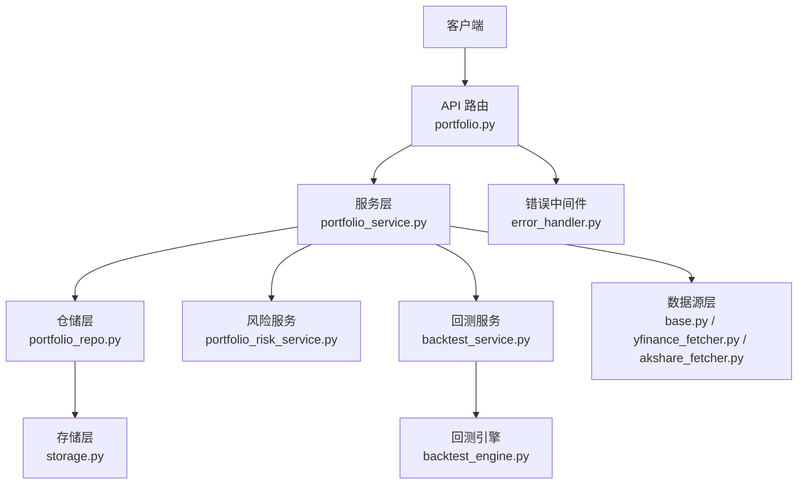
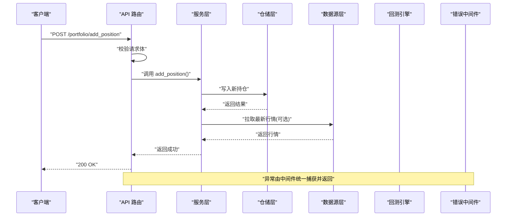
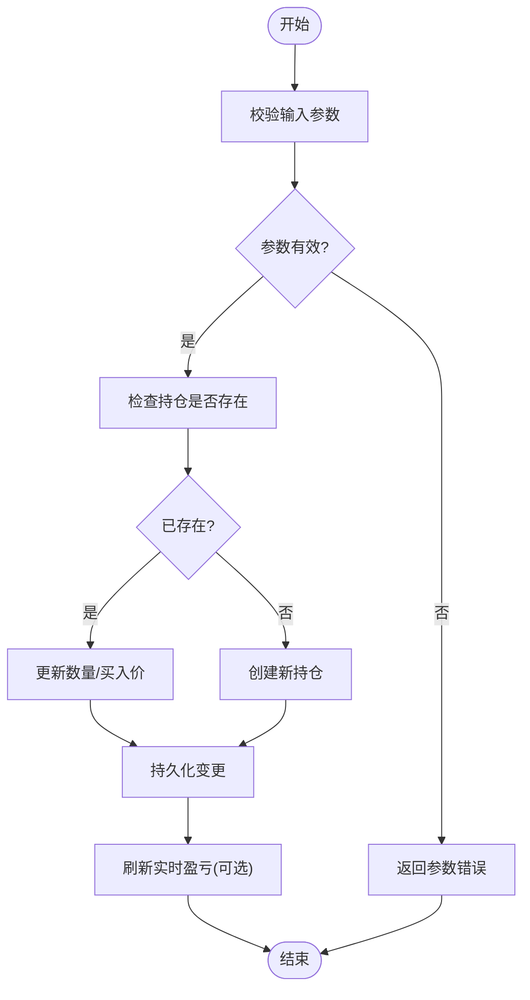
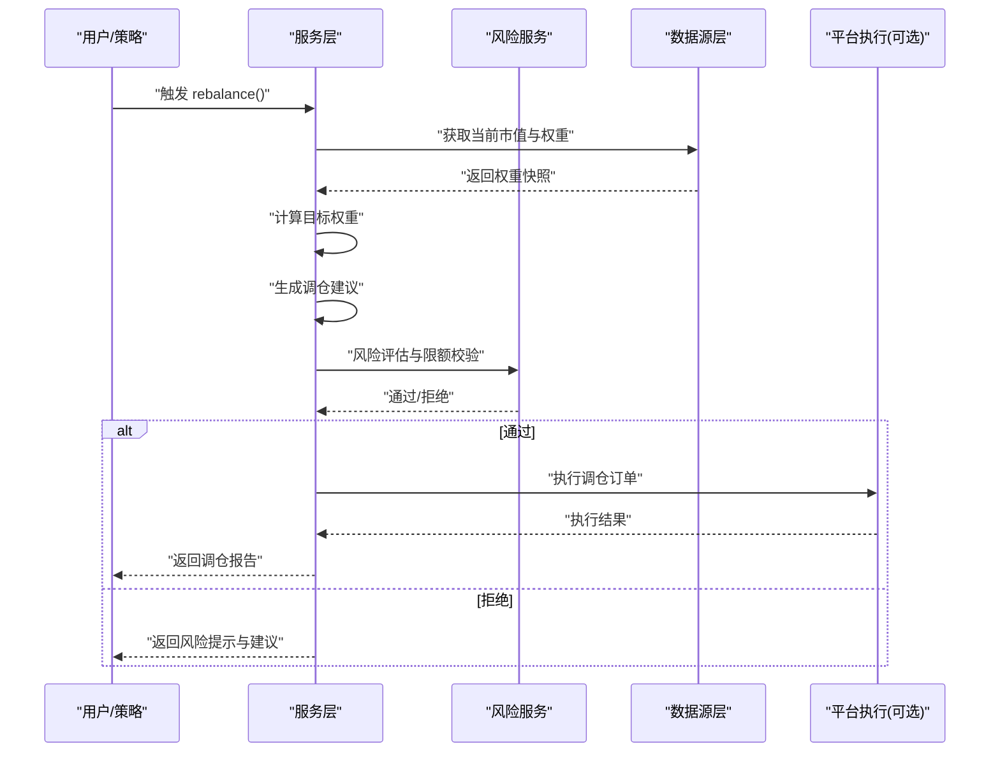
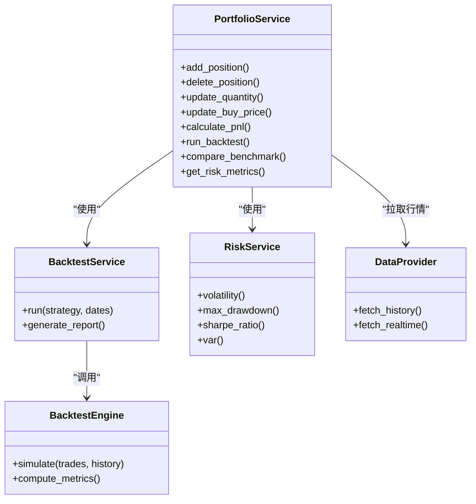
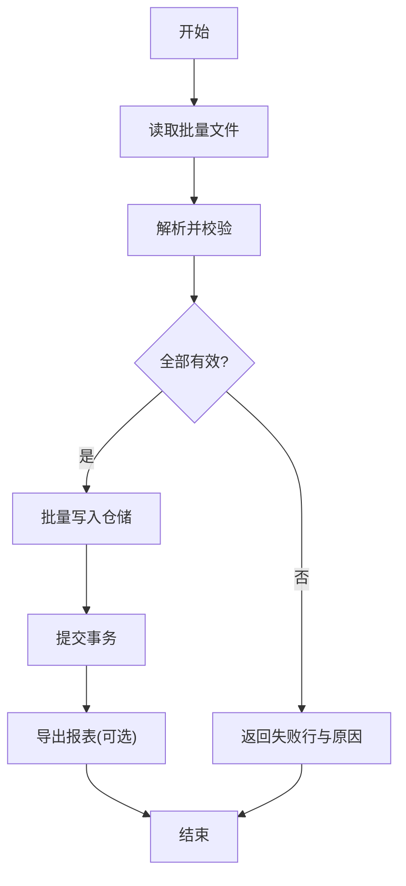
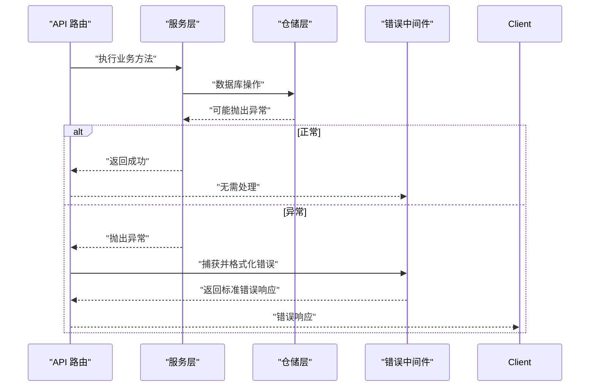
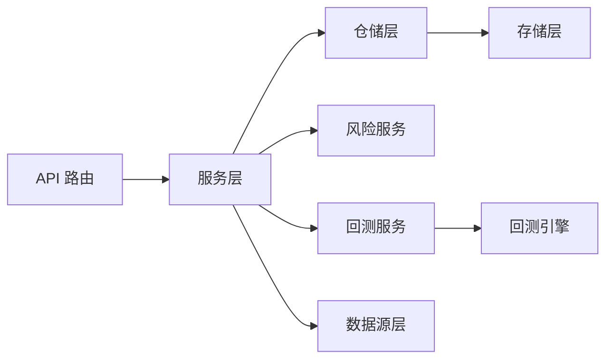

# 投资组合服务

<cite>
**本文引用的文件**   
- [api/v1/endpoints/portfolio.py](file://api/v1/endpoints/portfolio.py)
- [api/v1/schemas/portfolio.py](file://api/v1/schemas/portfolio.py)
- [src/services/portfolio_service.py](file://src/services/portfolio_service.py)
- [src/repositories/portfolio_repo.py](file://src/repositories/portfolio_repo.py)
- [src/services/portfolio_risk_service.py](file://src/services/portfolio_risk_service.py)
- [src/services/portfolio_alerts.py](file://src/services/portfolio_alerts.py)
- [src/services/backtest_service.py](file://src/services/backtest_service.py)
- [src/core/backtest_engine.py](file://src/core/backtest_engine.py)
- [data_provider/base.py](file://data_provider/base.py)
- [data_provider/yfinance_fetcher.py](file://data_provider/yfinance_fetcher.py)
- [data_provider/akshare_fetcher.py](file://data_provider/akshare_fetcher.py)
- [src/storage.py](file://src/storage.py)
- [api/middlewares/error_handler.py](file://api/middlewares/error_handler.py)
- [tests/test_portfolio_api.py](file://tests/test_portfolio_api.py)
- [tests/test_main_portfolio.py](file://tests/test_main_portfolio.py)
</cite>

## 目录
1. [简介](#简介)
2. [项目结构](#项目结构)
3. [核心组件](#核心组件)
4. [架构总览](#架构总览)
5. [详细组件分析](#详细组件分析)
6. [依赖关系分析](#依赖关系分析)
7. [性能考量](#性能考量)
8. [故障排查指南](#故障排查指南)
9. [结论](#结论)
10. [附录](#附录)

## 简介
本文件为“投资组合服务”的完整技术文档，面向开发者与使用者，系统阐述持仓管理、调仓（rebalancing）、绩效分析与批量操作等核心能力，并给出错误处理与事务一致性保障策略、API调用示例与最佳实践。该服务基于分层架构：API层定义接口与校验，服务层编排业务逻辑，仓储层负责数据持久化，数据源层提供行情与历史数据，回测引擎支撑历史收益与基准对比分析，风险服务提供关键风险指标监控。

## 项目结构
投资组合相关代码主要分布在以下模块：
- API 层：路由与请求/响应模型定义
- 服务层：组合管理、风险、回测、告警等
- 仓储层：组合数据的增删改查
- 数据源层：行情与历史数据获取
- 存储层：本地持久化与缓存
- 中间件：统一错误处理

**图表来源** 
- [api/v1/endpoints/portfolio.py](file://api/v1/endpoints/portfolio.py)
- [src/services/portfolio_service.py](file://src/services/portfolio_service.py)
- [src/repositories/portfolio_repo.py](file://src/repositories/portfolio_repo.py)
- [src/services/portfolio_risk_service.py](file://src/services/portfolio_risk_service.py)
- [src/services/backtest_service.py](file://src/services/backtest_service.py)
- [src/core/backtest_engine.py](file://src/core/backtest_engine.py)
- [data_provider/base.py](file://data_provider/base.py)
- [data_provider/yfinance_fetcher.py](file://data_provider/yfinance_fetcher.py)
- [data_provider/akshare_fetcher.py](file://data_provider/akshare_fetcher.py)
- [src/storage.py](file://src/storage.py)
- [api/middlewares/error_handler.py](file://api/middlewares/error_handler.py)

**章节来源**
- [api/v1/endpoints/portfolio.py](file://api/v1/endpoints/portfolio.py)
- [src/services/portfolio_service.py](file://src/services/portfolio_service.py)
- [src/repositories/portfolio_repo.py](file://src/repositories/portfolio_repo.py)

## 核心组件
- 持仓管理：新增持仓、删除持仓、调整数量、修改买入价
- 调仓机制：目标权重计算、调仓建议生成、自动执行流程
- 绩效分析：实时盈亏、历史收益回测、基准对比、风险指标
- 批量操作：批量导入、批量更新价格、批量导出报表
- 错误处理与事务：异常捕获、数据一致性、重试与补偿

**章节来源**
- [api/v1/schemas/portfolio.py](file://api/v1/schemas/portfolio.py)
- [src/services/portfolio_service.py](file://src/services/portfolio_service.py)
- [src/repositories/portfolio_repo.py](file://src/repositories/portfolio_repo.py)
- [src/services/portfolio_risk_service.py](file://src/services/portfolio_risk_service.py)
- [src/services/backtest_service.py](file://src/services/backtest_service.py)
- [src/core/backtest_engine.py](file://src/core/backtest_engine.py)

## 架构总览
投资组合服务采用清晰的分层与职责分离：
- API 路由接收请求，进行参数校验后委托服务层
- 服务层协调仓储、数据源、回测与风险服务完成业务编排
- 仓储层封装对存储层的访问，保证数据一致性与事务边界
- 数据源层抽象多数据提供方，支持灵活切换
- 错误中间件统一捕获与返回错误信息

**图表来源** 
- [api/v1/endpoints/portfolio.py](file://api/v1/endpoints/portfolio.py)
- [src/services/portfolio_service.py](file://src/services/portfolio_service.py)
- [src/repositories/portfolio_repo.py](file://src/repositories/portfolio_repo.py)
- [data_provider/base.py](file://data_provider/base.py)
- [api/middlewares/error_handler.py](file://api/middlewares/error_handler.py)

## 详细组件分析

### 持仓管理
- 新增持仓：支持指定标的、数量、买入价、手续费等字段；服务层校验合法性并持久化
- 删除持仓：按标的或批次删除，确保无其他依赖冲突
- 调整仓位数量：增量或覆盖式更新，记录变更历史
- 修改买入价格：用于成本修正与复权处理，需保留审计轨迹

**图表来源** 
- [src/services/portfolio_service.py](file://src/services/portfolio_service.py)
- [src/repositories/portfolio_repo.py](file://src/repositories/portfolio_repo.py)

**章节来源**
- [api/v1/schemas/portfolio.py](file://api/v1/schemas/portfolio.py)
- [src/services/portfolio_service.py](file://src/services/portfolio_service.py)
- [src/repositories/portfolio_repo.py](file://src/repositories/portfolio_repo.py)

### 调仓（Rebalancing）机制
- 目标权重计算：基于策略规则或用户配置，计算各标的的目标权重
- 调仓建议生成：对比当前权重与目标权重，生成买卖建议清单
- 自动执行流程：校验资金与风控阈值，分批下单并记录执行日志

**图表来源** 
- [src/services/portfolio_service.py](file://src/services/portfolio_service.py)
- [src/services/portfolio_risk_service.py](file://src/services/portfolio_risk_service.py)
- [data_provider/base.py](file://data_provider/base.py)

**章节来源**
- [src/services/portfolio_service.py](file://src/services/portfolio_service.py)
- [src/services/portfolio_risk_service.py](file://src/services/portfolio_risk_service.py)

### 绩效分析
- 实时盈亏计算：结合最新行情与持仓成本，计算浮动盈亏与收益率
- 历史收益回测：基于回测引擎与历史数据，模拟策略表现
- 基准对比分析：与指数或自定义基准比较超额收益与跟踪误差
- 风险指标监控：波动率、最大回撤、夏普比率、VaR 等

**图表来源** 
- [src/services/portfolio_service.py](file://src/services/portfolio_service.py)
- [src/services/backtest_service.py](file://src/services/backtest_service.py)
- [src/core/backtest_engine.py](file://src/core/backtest_engine.py)
- [src/services/portfolio_risk_service.py](file://src/services/portfolio_risk_service.py)
- [data_provider/base.py](file://data_provider/base.py)

**章节来源**
- [src/services/backtest_service.py](file://src/services/backtest_service.py)
- [src/core/backtest_engine.py](file://src/core/backtest_engine.py)
- [src/services/portfolio_risk_service.py](file://src/services/portfolio_risk_service.py)

### 批量操作
- 批量导入持仓：支持 CSV/JSON 格式，解析并批量入库
- 批量更新价格：按标的列表批量更新最新买入价或成本
- 批量导出报表：导出持仓明细、交易流水、绩效报告

**图表来源** 
- [src/services/portfolio_service.py](file://src/services/portfolio_service.py)
- [src/repositories/portfolio_repo.py](file://src/repositories/portfolio_repo.py)

**章节来源**
- [src/services/portfolio_service.py](file://src/services/portfolio_service.py)
- [src/repositories/portfolio_repo.py](file://src/repositories/portfolio_repo.py)

### 错误处理与异常恢复
- 统一错误中间件捕获异常，返回标准化错误码与消息
- 事务边界在仓储层控制，保证数据一致性
- 重试与补偿：对外部数据源调用设置超时与重试策略，失败时回滚或降级

**图表来源** 
- [api/middlewares/error_handler.py](file://api/middlewares/error_handler.py)
- [src/repositories/portfolio_repo.py](file://src/repositories/portfolio_repo.py)

**章节来源**
- [api/middlewares/error_handler.py](file://api/middlewares/error_handler.py)
- [src/storage.py](file://src/storage.py)

## 依赖关系分析
- API 路由依赖服务层与错误中间件
- 服务层依赖仓储、数据源、回测与风险服务
- 仓储层依赖存储层
- 数据源层抽象多实现，便于扩展

**图表来源** 
- [api/v1/endpoints/portfolio.py](file://api/v1/endpoints/portfolio.py)
- [src/services/portfolio_service.py](file://src/services/portfolio_service.py)
- [src/repositories/portfolio_repo.py](file://src/repositories/portfolio_repo.py)
- [src/services/portfolio_risk_service.py](file://src/services/portfolio_risk_service.py)
- [src/services/backtest_service.py](file://src/services/backtest_service.py)
- [src/core/backtest_engine.py](file://src/core/backtest_engine.py)
- [data_provider/base.py](file://data_provider/base.py)
- [src/storage.py](file://src/storage.py)

**章节来源**
- [api/v1/endpoints/portfolio.py](file://api/v1/endpoints/portfolio.py)
- [src/services/portfolio_service.py](file://src/services/portfolio_service.py)
- [src/repositories/portfolio_repo.py](file://src/repositories/portfolio_repo.py)

## 性能考量
- 行情拉取：优先使用缓存与增量更新，避免重复请求
- 批量操作：使用事务与批处理减少 IO 次数
- 回测与风险计算：异步执行与分页加载大数据集
- 并发控制：限制并行度，防止资源争用与限流

[本节为通用指导，不直接分析具体文件]

## 故障排查指南
- 常见错误：参数校验失败、数据源超时、权限不足、库存不足
- 定位步骤：查看中间件错误日志、检查仓储事务状态、验证数据源连通性
- 恢复策略：重试外部调用、回滚未提交事务、降级到只读模式

**章节来源**
- [api/middlewares/error_handler.py](file://api/middlewares/error_handler.py)
- [src/storage.py](file://src/storage.py)

## 结论
投资组合服务以分层架构与明确职责为核心，提供完整的持仓管理、调仓、绩效分析与批量操作能力。通过统一错误处理与事务保障，确保数据一致性与系统稳定性。建议在生产环境中启用缓存、异步任务与监控告警，以提升性能与可观测性。

[本节为总结，不直接分析具体文件]

## 附录

### API 调用示例与最佳实践
- 新增持仓：POST /portfolio/add_position，携带标的、数量、买入价等必填字段
- 删除持仓：DELETE /portfolio/delete_position，指定标的或批次 ID
- 调整数量：PUT /portfolio/update_quantity，传入增量或覆盖值
- 修改买入价：PUT /portfolio/update_buy_price，附带成本修正说明
- 调仓：POST /portfolio/rebalance，提交目标权重或策略名称
- 绩效分析：GET /portfolio/pnl?date=...，GET /portfolio/backtest?strategy=...
- 基准对比：GET /portfolio/benchmark_compare?benchmark=...
- 风险指标：GET /portfolio/risk?window=...
- 批量导入：POST /portfolio/import，上传 CSV/JSON
- 批量更新价格：POST /portfolio/batch_update_prices，传入标的与价格映射
- 批量导出：GET /portfolio/export?format=csv|json

最佳实践：
- 所有写操作开启事务，确保原子性
- 外部数据源调用设置超时与重试上限
- 批量操作分片处理，避免单次负载过大
- 敏感字段加密存储，审计日志完整记录

**章节来源**
- [api/v1/endpoints/portfolio.py](file://api/v1/endpoints/portfolio.py)
- [api/v1/schemas/portfolio.py](file://api/v1/schemas/portfolio.py)
- [tests/test_portfolio_api.py](file://tests/test_portfolio_api.py)
- [tests/test_main_portfolio.py](file://tests/test_main_portfolio.py)