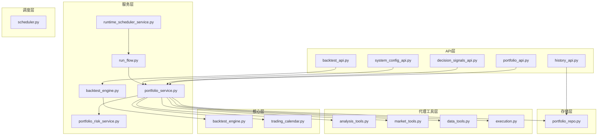
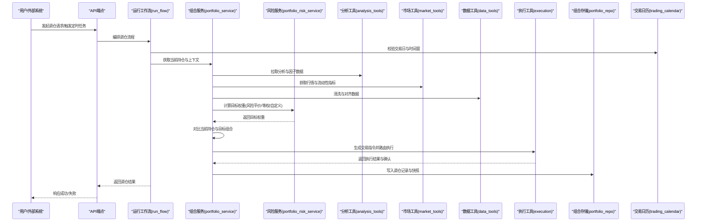
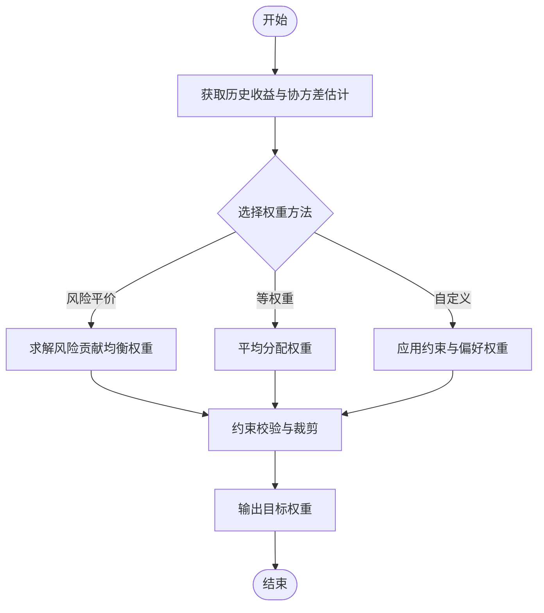
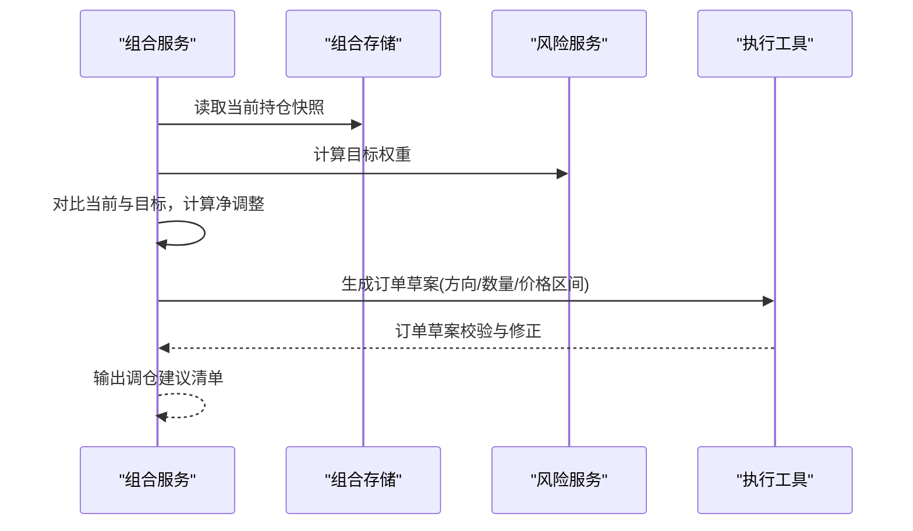
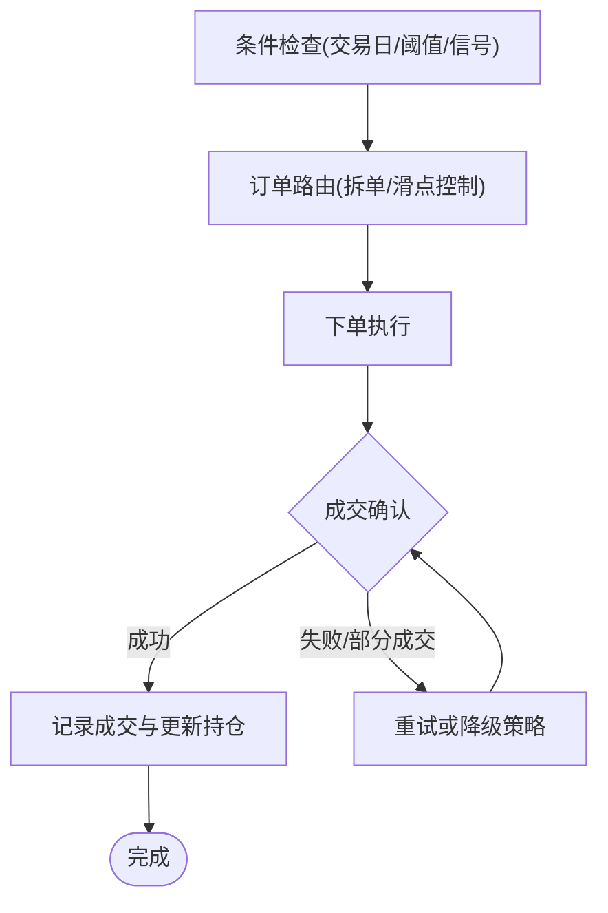
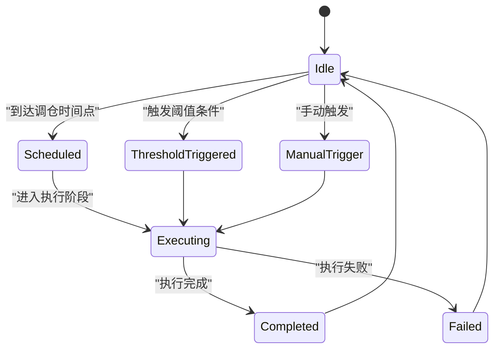
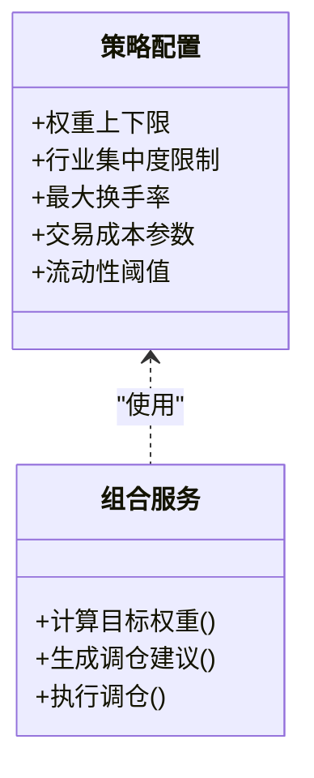
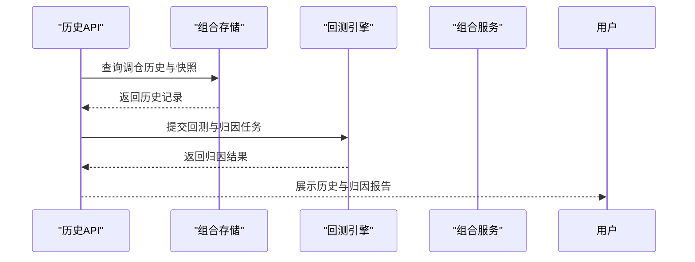
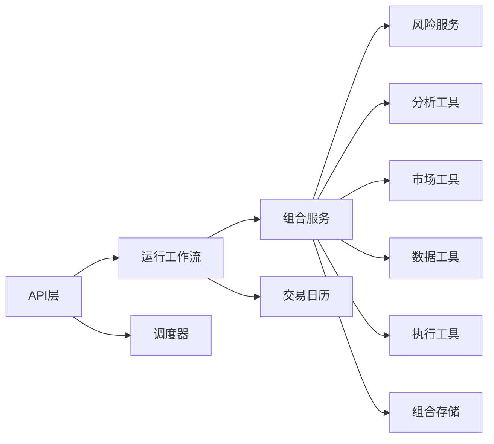

# 投资组合调仓

<cite>
**本文引用的文件**   
- [portfolio_service.py](file://src/services/portfolio_service.py)
- [portfolio_risk_service.py](file://src/services/portfolio_risk_service.py)
- [execution.py](file://src/agent/tools/execution.py)
- [backtest_engine.py](file://src/core/backtest_engine.py)
- [trading_calendar.py](file://src/core/trading_calendar.py)
- [scheduler.py](file://src/scheduler.py)
- [runtime_scheduler_service.py](file://src/services/runtime_scheduler_service.py)
- [portfolio_repo.py](file://src/repositories/portfolio_repo.py)
- [analysis_tools.py](file://src/agent/tools/analysis_tools.py)
- [market_tools.py](file://src/agent/tools/market_tools.py)
- [data_tools.py](file://src/agent/tools/data_tools.py)
- [run_flow.py](file://src/services/run_flow.py)
- [api_router.py](file://api/v1/router.py)
- [portfolio_api.py](file://api/v1/endpoints/portfolio.py)
- [portfolio_schema.py](file://api/v1/schemas/portfolio.py)
- [decision_signals_api.py](file://api/v1/endpoints/decision_signals.py)
- [decision_signals_schema.py](file://api/v1/schemas/decision_signals.py)
- [backtest_api.py](file://api/v1/endpoints/backtest.py)
- [backtest_schema.py](file://api/v1/schemas/backtest.py)
- [history_api.py](file://api/v1/endpoints/history.py)
- [history_schema.py](file://api/v1/schemas/history.py)
- [system_config_api.py](file://api/v1/endpoints/system_config.py)
- [system_config_schema.py](file://api/v1/schemas/system_config.py)
</cite>

## 目录
1. [简介](#简介)
2. [项目结构](#项目结构)
3. [核心组件](#核心组件)
4. [架构总览](#架构总览)
5. [详细组件分析](#详细组件分析)
6. [依赖关系分析](#依赖关系分析)
7. [性能考量](#性能考量)
8. [故障排查指南](#故障排查指南)
9. [结论](#结论)
10. [附录](#附录)

## 简介
本文件面向“投资组合调仓”功能，系统性阐述目标权重计算（风险平价、等权重、自定义权重）、调仓建议生成（当前持仓分析、目标组合对比、交易指令生成）、自动执行流程（条件检查、订单路由、执行确认）、调仓频率控制（定期、阈值触发、手动模式），以及策略配置（权重约束、交易成本、流动性限制）与历史记录和绩效归因。文档以代码仓库中的服务层、工具层、调度器、API 与持久化模块为依据，提供可追溯的章节来源与架构图示。

## 项目结构
围绕调仓能力，代码组织采用分层与按职责划分：
- API 层：暴露调仓相关接口（组合管理、决策信号、回测、历史、系统配置）。
- 服务层：组合服务、风险服务、运行调度、回测引擎、工作流编排。
- 代理工具层：数据分析、市场数据、执行工具。
- 核心层：回测引擎、交易日历。
- 存储层：组合持久化。
- 调度层：定时任务与运行时调度。

图表来源
- [portfolio_api.py](file://api/v1/endpoints/portfolio.py)
- [decision_signals_api.py](file://api/v1/endpoints/decision_signals.py)
- [backtest_api.py](file://api/v1/endpoints/backtest.py)
- [history_api.py](file://api/v1/endpoints/history.py)
- [system_config_api.py](file://api/v1/endpoints/system_config.py)
- [portfolio_service.py](file://src/services/portfolio_service.py)
- [portfolio_risk_service.py](file://src/services/portfolio_risk_service.py)
- [run_flow.py](file://src/services/run_flow.py)
- [runtime_scheduler_service.py](file://src/services/runtime_scheduler_service.py)
- [backtest_engine.py](file://src/core/backtest_engine.py)
- [trading_calendar.py](file://src/core/trading_calendar.py)
- [portfolio_repo.py](file://src/repositories/portfolio_repo.py)
- [analysis_tools.py](file://src/agent/tools/analysis_tools.py)
- [market_tools.py](file://src/agent/tools/market_tools.py)
- [data_tools.py](file://src/agent/tools/data_tools.py)
- [execution.py](file://src/agent/tools/execution.py)
- [scheduler.py](file://src/scheduler.py)

章节来源
- [portfolio_service.py](file://src/services/portfolio_service.py)
- [portfolio_risk_service.py](file://src/services/portfolio_risk_service.py)
- [execution.py](file://src/agent/tools/execution.py)
- [backtest_engine.py](file://src/core/backtest_engine.py)
- [trading_calendar.py](file://src/core/trading_calendar.py)
- [scheduler.py](file://src/scheduler.py)
- [runtime_scheduler_service.py](file://src/services/runtime_scheduler_service.py)
- [portfolio_repo.py](file://src/repositories/portfolio_repo.py)
- [analysis_tools.py](file://src/agent/tools/analysis_tools.py)
- [market_tools.py](file://src/agent/tools/market_tools.py)
- [data_tools.py](file://src/agent/tools/data_tools.py)
- [run_flow.py](file://src/services/run_flow.py)
- [api_router.py](file://api/v1/router.py)
- [portfolio_api.py](file://api/v1/endpoints/portfolio.py)
- [portfolio_schema.py](file://api/v1/schemas/portfolio.py)
- [decision_signals_api.py](file://api/v1/endpoints/decision_signals.py)
- [decision_signals_schema.py](file://api/v1/schemas/decision_signals.py)
- [backtest_api.py](file://api/v1/endpoints/backtest.py)
- [backtest_schema.py](file://api/v1/schemas/backtest.py)
- [history_api.py](file://api/v1/endpoints/history.py)
- [history_schema.py](file://api/v1/schemas/history.py)
- [system_config_api.py](file://api/v1/endpoints/system_config.py)
- [system_config_schema.py](file://api/v1/schemas/system_config.py)

## 核心组件
- 组合服务（Portfolio Service）：聚合持仓、目标权重、交易建议与执行协调，是调仓中枢。
- 风险服务（Portfolio Risk Service）：实现风险度量与风险平价权重计算。
- 执行工具（Execution Tools）：负责订单构建、路由与成交确认。
- 回测引擎（Backtest Engine）：用于策略回测与绩效归因。
- 交易日历（Trading Calendar）：交易日判断与时间窗口控制。
- 运行调度（Runtime Scheduler）：定时与事件驱动的调仓触发。
- 数据存储（Portfolio Repo）：组合快照、调仓记录与历史查询。
- 分析/市场/数据工具：为权重计算与对比提供输入数据。

章节来源
- [portfolio_service.py](file://src/services/portfolio_service.py)
- [portfolio_risk_service.py](file://src/services/portfolio_risk_service.py)
- [execution.py](file://src/agent/tools/execution.py)
- [backtest_engine.py](file://src/core/backtest_engine.py)
- [trading_calendar.py](file://src/core/trading_calendar.py)
- [runtime_scheduler_service.py](file://src/services/runtime_scheduler_service.py)
- [portfolio_repo.py](file://src/repositories/portfolio_repo.py)
- [analysis_tools.py](file://src/agent/tools/analysis_tools.py)
- [market_tools.py](file://src/agent/tools/market_tools.py)
- [data_tools.py](file://src/agent/tools/data_tools.py)

## 架构总览
调仓流程从 API 或调度器触发，经由运行工作流编排，调用组合服务进行目标权重计算与交易建议生成，再经执行工具完成订单路由与确认，最终落盘记录并支持回测与归因。

图表来源
- [run_flow.py](file://src/services/run_flow.py)
- [portfolio_service.py](file://src/services/portfolio_service.py)
- [portfolio_risk_service.py](file://src/services/portfolio_risk_service.py)
- [analysis_tools.py](file://src/agent/tools/analysis_tools.py)
- [market_tools.py](file://src/agent/tools/market_tools.py)
- [data_tools.py](file://src/agent/tools/data_tools.py)
- [execution.py](file://src/agent/tools/execution.py)
- [portfolio_repo.py](file://src/repositories/portfolio_repo.py)
- [trading_calendar.py](file://src/core/trading_calendar.py)

## 详细组件分析

### 目标权重计算算法
- 风险平价模型
  - 基于资产波动率与相关性估计协方差矩阵，求解各资产对组合风险的边际贡献相等时的权重。
  - 需要历史收益率序列、协方差估计方法（如指数加权或滚动窗口）与数值优化求解。
  - 输出：满足风险贡献均衡的目标权重向量。
- 等权重分配
  - 将资金在候选资产间均匀分配，适用于无明确信号或作为基准策略。
  - 输出：等权目标权重向量。
- 自定义权重配置
  - 允许通过系统配置或策略参数指定权重上限、下限、行业/风格约束与再平衡偏差容忍度。
  - 输出：受约束的目标权重向量。

图表来源
- [portfolio_risk_service.py](file://src/services/portfolio_risk_service.py)
- [portfolio_service.py](file://src/services/portfolio_service.py)
- [system_config_schema.py](file://api/v1/schemas/system_config.py)

章节来源
- [portfolio_risk_service.py](file://src/services/portfolio_risk_service.py)
- [portfolio_service.py](file://src/services/portfolio_service.py)
- [system_config_schema.py](file://api/v1/schemas/system_config.py)

### 调仓建议生成机制
- 当前持仓分析
  - 读取当前组合快照、市值与仓位比例，识别超配/低配标的。
- 目标组合对比
  - 将目标权重转换为目标市值，结合现金与交易成本估算，得到净头寸调整量。
- 交易指令生成
  - 根据买卖方向、数量与价格区间生成订单草案，考虑最小交易单位与流动性限制。

图表来源
- [portfolio_service.py](file://src/services/portfolio_service.py)
- [portfolio_risk_service.py](file://src/services/portfolio_risk_service.py)
- [execution.py](file://src/agent/tools/execution.py)
- [portfolio_repo.py](file://src/repositories/portfolio_repo.py)

章节来源
- [portfolio_service.py](file://src/services/portfolio_service.py)
- [execution.py](file://src/agent/tools/execution.py)
- [portfolio_repo.py](file://src/repositories/portfolio_repo.py)

### 自动执行流程
- 调仓条件检查
  - 交易日验证、时间窗限制、阈值触发（权重偏离、波动率突破、信号强度）。
- 订单路由
  - 根据券商/交易所规则选择路由策略，拆分大单、滑点控制。
- 执行确认
  - 成交回报解析、部分成交处理、异常重试与告警。

图表来源
- [execution.py](file://src/agent/tools/execution.py)
- [trading_calendar.py](file://src/core/trading_calendar.py)
- [runtime_scheduler_service.py](file://src/services/runtime_scheduler_service.py)

章节来源
- [execution.py](file://src/agent/tools/execution.py)
- [trading_calendar.py](file://src/core/trading_calendar.py)
- [runtime_scheduler_service.py](file://src/services/runtime_scheduler_service.py)

### 调仓频率控制
- 定期调仓
  - 按日/周/月周期触发，结合交易日历避免非交易日执行。
- 阈值触发
  - 当权重偏离超过阈值或波动率/信号强度达到阈值时即时触发。
- 手动调仓模式
  - 通过 API 或控制台手动发起调仓，适用于临时调整或紧急风控。

图表来源
- [scheduler.py](file://src/scheduler.py)
- [runtime_scheduler_service.py](file://src/services/runtime_scheduler_service.py)
- [trading_calendar.py](file://src/core/trading_calendar.py)

章节来源
- [scheduler.py](file://src/scheduler.py)
- [runtime_scheduler_service.py](file://src/services/runtime_scheduler_service.py)
- [trading_calendar.py](file://src/core/trading_calendar.py)

### 调仓策略配置示例
- 权重约束
  - 设置单个资产权重上下限、行业/风格集中度限制、最大换手率。
- 交易成本考虑
  - 佣金、印花税、滑点预估纳入净收益评估，影响是否执行调仓。
- 流动性限制
  - 基于成交量与买卖价差过滤低流动性标的，限制单笔最大委托量。

图表来源
- [system_config_schema.py](file://api/v1/schemas/system_config.py)
- [portfolio_service.py](file://src/services/portfolio_service.py)

章节来源
- [system_config_schema.py](file://api/v1/schemas/system_config.py)
- [portfolio_service.py](file://src/services/portfolio_service.py)

### 调仓历史记录与绩效归因
- 历史记录
  - 保存每次调仓的输入数据、目标权重、实际成交与偏差，便于审计与回溯。
- 绩效归因
  - 基于回测引擎对策略收益进行分解（资产配置、择时、个股选择），定位贡献来源。

图表来源
- [history_api.py](file://api/v1/endpoints/history.py)
- [portfolio_repo.py](file://src/repositories/portfolio_repo.py)
- [backtest_engine.py](file://src/core/backtest_engine.py)
- [portfolio_service.py](file://src/services/portfolio_service.py)

章节来源
- [history_api.py](file://api/v1/endpoints/history.py)
- [portfolio_repo.py](file://src/repositories/portfolio_repo.py)
- [backtest_engine.py](file://src/core/backtest_engine.py)
- [portfolio_service.py](file://src/services/portfolio_service.py)

## 依赖关系分析
- 组合服务依赖风险服务、分析/市场/数据工具、执行工具与组合存储。
- 运行工作流编排调仓全流程，调度器驱动定时任务。
- API 层暴露组合、决策信号、回测、历史与系统配置接口。

图表来源
- [api_router.py](file://api/v1/router.py)
- [run_flow.py](file://src/services/run_flow.py)
- [portfolio_service.py](file://src/services/portfolio_service.py)
- [portfolio_risk_service.py](file://src/services/portfolio_risk_service.py)
- [analysis_tools.py](file://src/agent/tools/analysis_tools.py)
- [market_tools.py](file://src/agent/tools/market_tools.py)
- [data_tools.py](file://src/agent/tools/data_tools.py)
- [execution.py](file://src/agent/tools/execution.py)
- [portfolio_repo.py](file://src/repositories/portfolio_repo.py)
- [trading_calendar.py](file://src/core/trading_calendar.py)
- [scheduler.py](file://src/scheduler.py)

章节来源
- [api_router.py](file://api/v1/router.py)
- [run_flow.py](file://src/services/run_flow.py)
- [portfolio_service.py](file://src/services/portfolio_service.py)
- [portfolio_risk_service.py](file://src/services/portfolio_risk_service.py)
- [analysis_tools.py](file://src/agent/tools/analysis_tools.py)
- [market_tools.py](file://src/agent/tools/market_tools.py)
- [data_tools.py](file://src/agent/tools/data_tools.py)
- [execution.py](file://src/agent/tools/execution.py)
- [portfolio_repo.py](file://src/repositories/portfolio_repo.py)
- [trading_calendar.py](file://src/core/trading_calendar.py)
- [scheduler.py](file://src/scheduler.py)

## 性能考量
- 协方差估计与优化求解应使用高效数值库与近似方法，降低计算开销。
- 批量数据处理与缓存减少重复 I/O，提升吞吐。
- 订单拆分与并行执行提高成交效率，同时控制滑点。
- 回测与归因任务异步化，避免阻塞主流程。

[本节为通用指导，不直接分析具体文件]

## 故障排查指南
- 常见问题
  - 非交易日触发：检查交易日历与调度器配置。
  - 权重计算发散：检查协方差估计方法与数据质量。
  - 订单失败：核对券商接口状态、流动性阈值与滑点设置。
  - 执行延迟：检查网络与并发限制。
- 诊断步骤
  - 查看调仓日志与执行回执。
  - 回放历史快照与输入数据。
  - 逐步隔离问题模块（数据→权重→执行）。

章节来源
- [execution.py](file://src/agent/tools/execution.py)
- [trading_calendar.py](file://src/core/trading_calendar.py)
- [portfolio_repo.py](file://src/repositories/portfolio_repo.py)

## 结论
本方案以组合服务为核心，整合风险服务与执行工具，形成从目标权重计算到订单执行的闭环。通过灵活的频率控制与策略配置，支持多种调仓模式；借助回测与归因能力，持续优化策略表现。建议在实盘中加强数据质量监控与执行风控，确保稳健运行。

[本节为总结性内容，不直接分析具体文件]

## 附录
- 术语表
  - 风险平价：使各资产对组合风险贡献相等的权重分配方法。
  - 等权重：将所有资金平均分配到候选资产。
  - 调仓建议：基于当前与目标组合差异生成的交易清单。
  - 绩效归因：将组合收益分解为不同来源的贡献。

[本节为概念性内容，不直接分析具体文件]