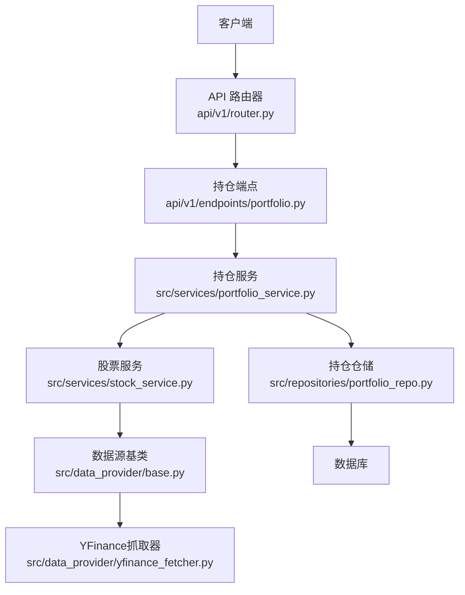
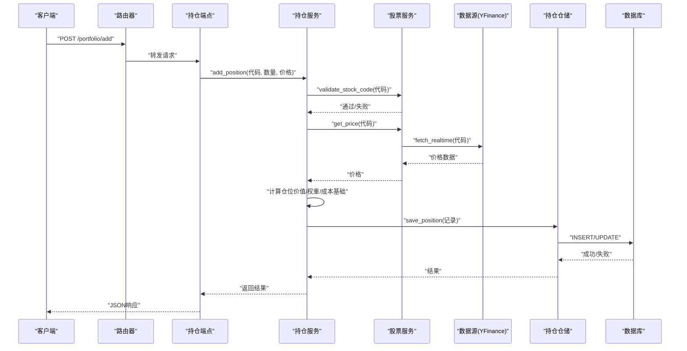
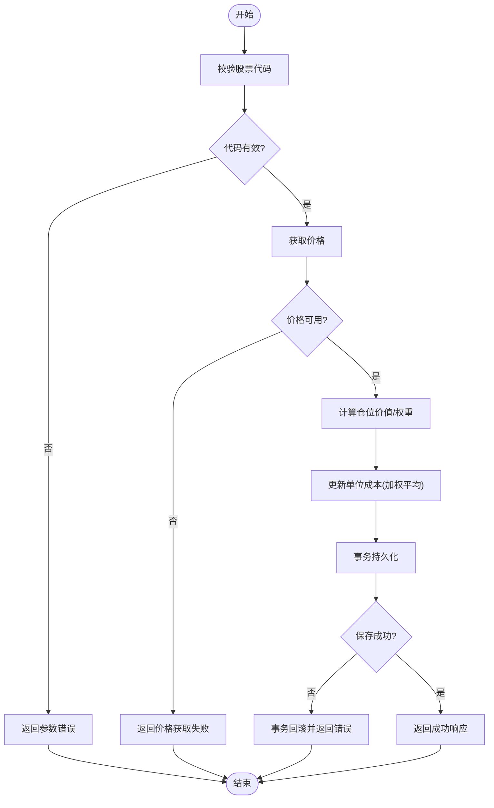
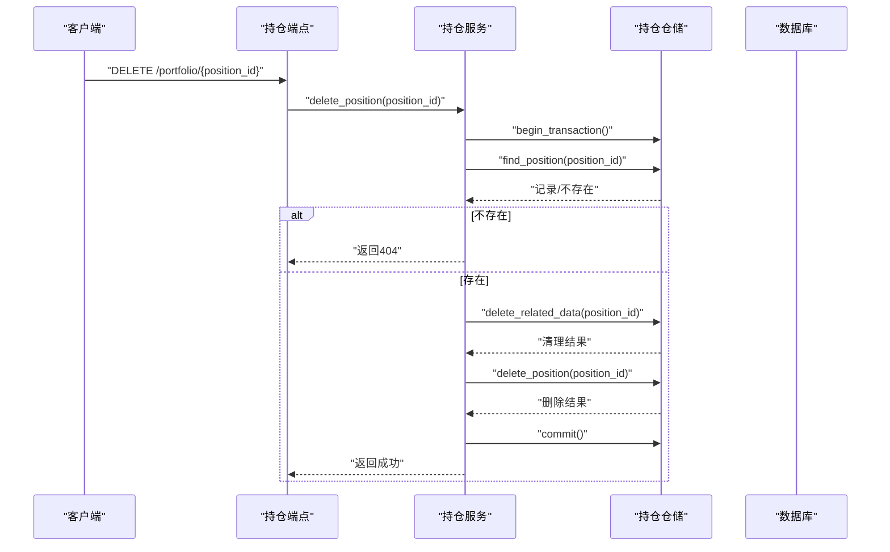
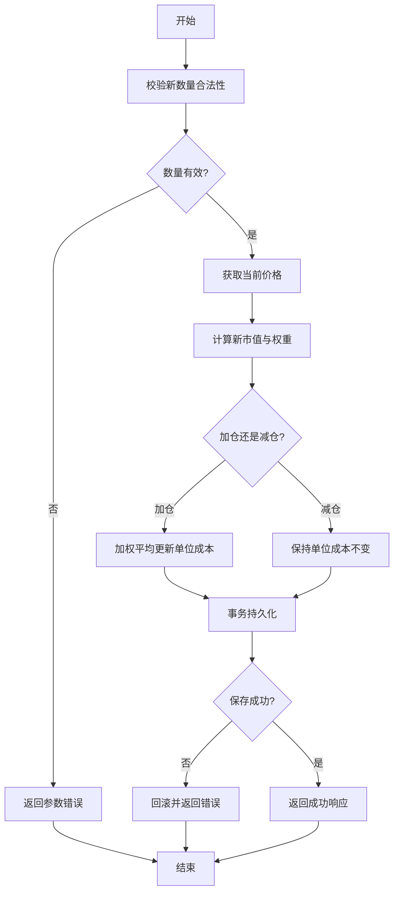
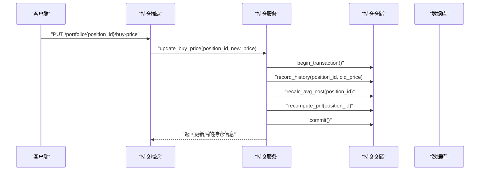
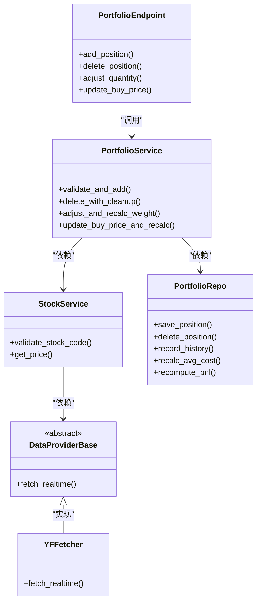

# 持仓管理

<cite>
**本文引用的文件**   
- [api/v1/endpoints/portfolio.py](file://api/v1/endpoints/portfolio.py)
- [api/v1/schemas/portfolio.py](file://api/v1/schemas/portfolio.py)
- [src/services/portfolio_service.py](file://src/services/portfolio_service.py)
- [src/repositories/portfolio_repo.py](file://src/repositories/portfolio_repo.py)
- [src/services/stock_service.py](file://src/services/stock_service.py)
- [src/data_provider/base.py](file://src/data_provider/base.py)
- [src/data_provider/yfinance_fetcher.py](file://src/data_provider/yfinance_fetcher.py)
- [api/app.py](file://api/app.py)
- [api/v1/router.py](file://api/v1/router.py)
</cite>

## 目录
1. [简介](#简介)
2. [项目结构](#项目结构)
3. [核心组件](#核心组件)
4. [架构总览](#架构总览)
5. [详细组件分析](#详细组件分析)
6. [依赖关系分析](#依赖关系分析)
7. [性能考虑](#性能考虑)
8. [故障排查指南](#故障排查指南)
9. [结论](#结论)
10. [附录：API调用示例与数据校验规则](#附录api调用示例与数据校验规则)

## 简介
本文件围绕“持仓管理”功能，系统性说明新增、删除、调整仓位数量、修改买入价格等关键流程的实现细节。内容覆盖股票代码验证、实时/历史价格获取、仓位计算、权重重算、数据库持久化、事务回滚机制、错误处理与数据校验规则，并提供完整的API调用示例（请求参数、响应格式、错误处理）。文档面向不同技术背景的读者，力求清晰易懂且具备可操作性。

## 项目结构
与持仓管理相关的代码主要分布在以下模块：
- API层：路由与请求/响应模型定义
- 服务层：业务编排与计算逻辑
- 仓储层：数据访问与事务控制
- 数据源层：行情数据获取与适配
- 应用装配：路由注册与中间件

**图表来源** 
- [api/v1/router.py](file://api/v1/router.py)
- [api/v1/endpoints/portfolio.py](file://api/v1/endpoints/portfolio.py)
- [src/services/portfolio_service.py](file://src/services/portfolio_service.py)
- [src/repositories/portfolio_repo.py](file://src/repositories/portfolio_repo.py)
- [src/services/stock_service.py](file://src/services/stock_service.py)
- [src/data_provider/base.py](file://src/data_provider/base.py)
- [src/data_provider/yfinance_fetcher.py](file://src/data_provider/yfinance_fetcher.py)

**章节来源**
- [api/app.py](file://api/app.py)
- [api/v1/router.py](file://api/v1/router.py)

## 核心组件
- 持仓端点（API）：负责接收HTTP请求、参数校验、调用服务层并返回统一响应。
- 持仓服务（Service）：实现添加、删除、调整仓位、修改买入价等业务逻辑；协调股票服务获取价格；协调仓储进行持久化；处理权重与成本基础计算。
- 持仓仓储（Repository）：封装数据库操作，提供事务边界与一致性保障。
- 股票服务（Stock Service）：抽象股票代码解析、有效性检查、价格获取（实时/历史）。
- 数据源（Data Provider）：对接外部行情接口（如YFinance），统一返回标准化数据结构。

**章节来源**
- [api/v1/endpoints/portfolio.py](file://api/v1/endpoints/portfolio.py)
- [src/services/portfolio_service.py](file://src/services/portfolio_service.py)
- [src/repositories/portfolio_repo.py](file://src/repositories/portfolio_repo.py)
- [src/services/stock_service.py](file://src/services/stock_service.py)
- [src/data_provider/base.py](file://src/data_provider/base.py)
- [src/data_provider/yfinance_fetcher.py](file://src/data_provider/yfinance_fetcher.py)

## 架构总览
下图展示了从HTTP请求到数据持久化的完整调用链，以及关键的数据流向与职责划分。

**图表来源** 
- [api/v1/endpoints/portfolio.py](file://api/v1/endpoints/portfolio.py)
- [src/services/portfolio_service.py](file://src/services/portfolio_service.py)
- [src/services/stock_service.py](file://src/services/stock_service.py)
- [src/data_provider/base.py](file://src/data_provider/base.py)
- [src/data_provider/yfinance_fetcher.py](file://src/data_provider/yfinance_fetcher.py)
- [src/repositories/portfolio_repo.py](file://src/repositories/portfolio_repo.py)

## 详细组件分析

### 新增持仓（Add Position）
新增持仓的完整流程包括：
- 股票代码验证：确保代码格式正确、市场前缀合法、可被解析为内部标准代码。
- 价格获取：优先使用实时价格，若不可用则回退至最近收盘价或缓存。
- 仓位计算：根据数量与价格计算持仓市值；结合现有持仓与组合总市值更新权重。
- 成本基础更新：首次建仓设置单位成本；后续加仓按加权平均更新单位成本。
- 持久化：在事务中写入或更新持仓记录，保证一致性。

**图表来源** 
- [src/services/portfolio_service.py](file://src/services/portfolio_service.py)
- [src/services/stock_service.py](file://src/services/stock_service.py)
- [src/repositories/portfolio_repo.py](file://src/repositories/portfolio_repo.py)

**章节来源**
- [src/services/portfolio_service.py](file://src/services/portfolio_service.py)
- [src/services/stock_service.py](file://src/services/stock_service.py)
- [src/repositories/portfolio_repo.py](file://src/repositories/portfolio_repo.py)

### 删除持仓（Delete Position）
删除持仓需满足：
- 存在性检查：确认目标持仓存在且属于当前用户/账户。
- 关联数据清理：如有订单历史、信号关联、日志等，需在事务内一并清理。
- 事务回滚：任一步骤失败，整体回滚，避免不一致状态。

**图表来源** 
- [src/services/portfolio_service.py](file://src/services/portfolio_service.py)
- [src/repositories/portfolio_repo.py](file://src/repositories/portfolio_repo.py)

**章节来源**
- [src/services/portfolio_service.py](file://src/services/portfolio_service.py)
- [src/repositories/portfolio_repo.py](file://src/repositories/portfolio_repo.py)

### 调整仓位数量（Adjust Quantity）
调整数量的关键点：
- 数量验证：新数量必须为正数，且不小于最小交易单位（如A股100股整手）。
- 成本基础更新：若为加仓，按加权平均更新单位成本；若减仓，保持单位成本不变。
- 权重重新计算：基于最新价格与调整后数量，重新计算该持仓占组合总市值的权重。
- 事务持久化：确保数量与成本更新的原子性。

**图表来源** 
- [src/services/portfolio_service.py](file://src/services/portfolio_service.py)
- [src/services/stock_service.py](file://src/services/stock_service.py)
- [src/repositories/portfolio_repo.py](file://src/repositories/portfolio_repo.py)

**章节来源**
- [src/services/portfolio_service.py](file://src/services/portfolio_service.py)
- [src/services/stock_service.py](file://src/services/stock_service.py)
- [src/repositories/portfolio_repo.py](file://src/repositories/portfolio_repo.py)

### 修改买入价格（Update Buy Price）
修改买入价格的实现要点：
- 历史价格记录：每次修改应记录历史价格快照，便于回溯与审计。
- 平均成本计算：支持按时间序列或批次合并计算平均成本（例如移动加权平均）。
- 盈亏重算：基于新的单位成本与当前市场价格，重新计算浮动盈亏与收益率。
- 事务与一致性：确保成本更新与历史记录写入在同一事务中完成。

**图表来源** 
- [src/services/portfolio_service.py](file://src/services/portfolio_service.py)
- [src/repositories/portfolio_repo.py](file://src/repositories/portfolio_repo.py)

**章节来源**
- [src/services/portfolio_service.py](file://src/services/portfolio_service.py)
- [src/repositories/portfolio_repo.py](file://src/repositories/portfolio_repo.py)

## 依赖关系分析
- 端点依赖服务：所有HTTP端点仅做参数校验与响应包装，业务逻辑下沉至服务层。
- 服务依赖仓储与股票服务：服务层协调数据访问与价格获取，不直接操作数据库。
- 数据源抽象：通过基类与具体抓取器解耦外部行情接口，便于扩展与替换。

**图表来源** 
- [api/v1/endpoints/portfolio.py](file://api/v1/endpoints/portfolio.py)
- [src/services/portfolio_service.py](file://src/services/portfolio_service.py)
- [src/services/stock_service.py](file://src/services/stock_service.py)
- [src/repositories/portfolio_repo.py](file://src/repositories/portfolio_repo.py)
- [src/data_provider/base.py](file://src/data_provider/base.py)
- [src/data_provider/yfinance_fetcher.py](file://src/data_provider/yfinance_fetcher.py)

**章节来源**
- [api/v1/endpoints/portfolio.py](file://api/v1/endpoints/portfolio.py)
- [src/services/portfolio_service.py](file://src/services/portfolio_service.py)
- [src/services/stock_service.py](file://src/services/stock_service.py)
- [src/repositories/portfolio_repo.py](file://src/repositories/portfolio_repo.py)
- [src/data_provider/base.py](file://src/data_provider/base.py)
- [src/data_provider/yfinance_fetcher.py](file://src/data_provider/yfinance_fetcher.py)

## 性能考虑
- 价格获取缓存：对热门标的的价格查询增加短期缓存，降低外部接口压力。
- 批量计算：在组合层面批量更新权重与盈亏，减少多次往返数据库。
- 异步任务：对于耗时较长的历史价格回放与重算，建议放入任务队列异步执行。
- 索引优化：对持仓表按股票代码、用户ID建立索引，提升查询效率。

[本节为通用指导，不涉及具体文件]

## 故障排查指南
常见问题与定位方法：
- 股票代码无效：检查前缀与格式转换逻辑，确认市场映射是否正确。
- 价格获取失败：查看数据源可用性、网络超时与重试策略；必要时回退至历史收盘价。
- 事务回滚：检查数据库约束与并发冲突；确认清理关联数据的顺序与完整性。
- 权重异常：核对组合总市值是否包含现金与所有持仓；确认价格更新时机。

**章节来源**
- [src/services/stock_service.py](file://src/services/stock_service.py)
- [src/data_provider/base.py](file://src/data_provider/base.py)
- [src/data_provider/yfinance_fetcher.py](file://src/data_provider/yfinance_fetcher.py)
- [src/repositories/portfolio_repo.py](file://src/repositories/portfolio_repo.py)

## 结论
持仓管理模块通过清晰的层次结构与职责分离，实现了稳健的新增、删除、调整与价格修改能力。借助服务层编排与仓储层事务保障，系统在一致性与可扩展性方面表现良好。建议在价格获取与批量计算上进一步优化性能，并完善监控与告警以提升运维体验。

[本节为总结，不涉及具体文件]

## 附录：API调用示例与数据校验规则

### 新增持仓
- 方法：POST
- 路径：/api/v1/portfolio/add
- 请求体字段：
  - stock_code: 字符串，必填，符合市场规范（如A股“600000.SH”、美股“AAPL.O”）
  - quantity: 整数，必填，大于0且为最小交易单位的整数倍
  - price: 浮点数，必填，大于0
- 响应体字段：
  - position_id: 字符串，新增记录的ID
  - market_value: 浮点数，持仓市值
  - weight: 浮点数，占组合总市值权重
  - avg_cost: 浮点数，单位成本
  - pnl: 浮点数，浮动盈亏
- 错误码：
  - 400 参数校验失败（代码无效、数量非法、价格为负）
  - 500 服务器内部错误（价格获取失败、数据库异常）

**章节来源**
- [api/v1/endpoints/portfolio.py](file://api/v1/endpoints/portfolio.py)
- [api/v1/schemas/portfolio.py](file://api/v1/schemas/portfolio.py)

### 删除持仓
- 方法：DELETE
- 路径：/api/v1/portfolio/{position_id}
- 路径参数：
  - position_id: 字符串，必填，唯一标识
- 响应体字段：
  - message: 字符串，操作结果描述
- 错误码：
  - 404 持仓不存在
  - 500 服务器内部错误（事务回滚、关联数据清理失败）

**章节来源**
- [api/v1/endpoints/portfolio.py](file://api/v1/endpoints/portfolio.py)

### 调整仓位数量
- 方法：PUT
- 路径：/api/v1/portfolio/{position_id}/quantity
- 请求体字段：
  - quantity: 整数，必填，大于0且为最小交易单位的整数倍
- 响应体字段：
  - position_id: 字符串
  - market_value: 浮点数
  - weight: 浮点数
  - avg_cost: 浮点数
  - pnl: 浮点数
- 错误码：
  - 400 参数校验失败
  - 500 服务器内部错误（价格获取失败、权重重算失败）

**章节来源**
- [api/v1/endpoints/portfolio.py](file://api/v1/endpoints/portfolio.py)

### 修改买入价格
- 方法：PUT
- 路径：/api/v1/portfolio/{position_id}/buy-price
- 请求体字段：
  - buy_price: 浮点数，必填，大于0
- 响应体字段：
  - position_id: 字符串
  - avg_cost: 浮点数
  - pnl: 浮点数
  - history_snapshot: 对象，包含旧价格与新价格的时间戳
- 错误码：
  - 400 参数校验失败
  - 500 服务器内部错误（历史记录写入失败、成本重算失败）

**章节来源**
- [api/v1/endpoints/portfolio.py](file://api/v1/endpoints/portfolio.py)

### 数据验证规则与业务约束
- 股票代码：
  - 必须包含市场前缀（如“.SH”、“.SZ”、“.O”等）
  - 数字部分长度与位数符合交易所规范
  - 大小写不敏感，自动规范化
- 数量：
  - 必须为正整数
  - 必须为最小交易单位的整数倍（A股通常为100股）
- 价格：
  - 必须为正数
  - 精度保留两位小数（货币单位）
- 权重：
  - 单个持仓权重范围[0, 1]
  - 组合权重总和≈1（允许微小浮点误差）
- 成本基础：
  - 加仓采用加权平均法
  - 减仓不改变单位成本
- 事务一致性：
  - 所有写操作必须在事务中执行
  - 任一子步骤失败需整体回滚

**章节来源**
- [api/v1/schemas/portfolio.py](file://api/v1/schemas/portfolio.py)
- [src/services/portfolio_service.py](file://src/services/portfolio_service.py)
- [src/repositories/portfolio_repo.py](file://src/repositories/portfolio_repo.py)