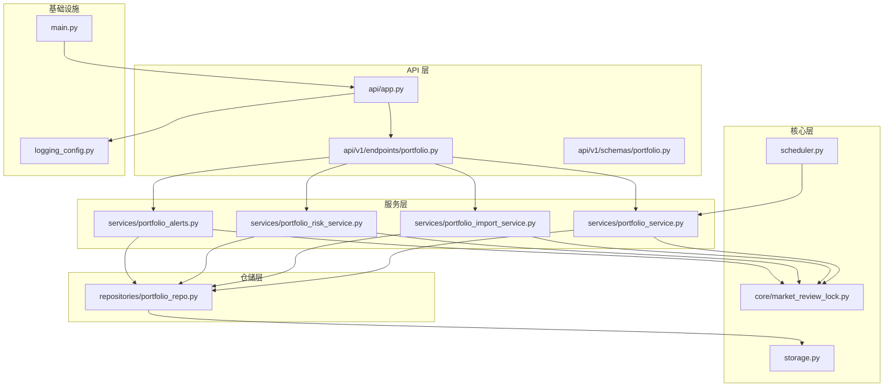
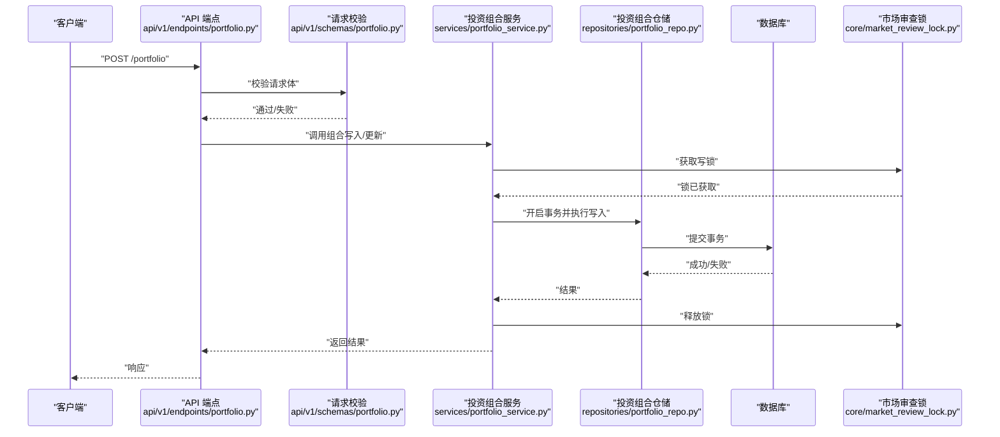
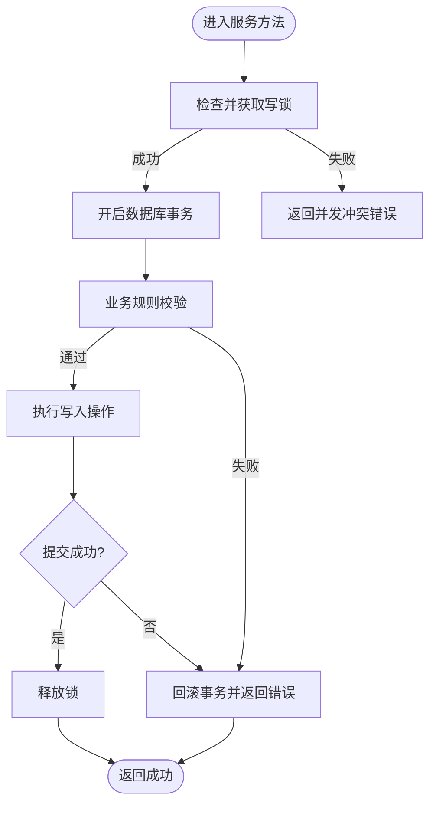
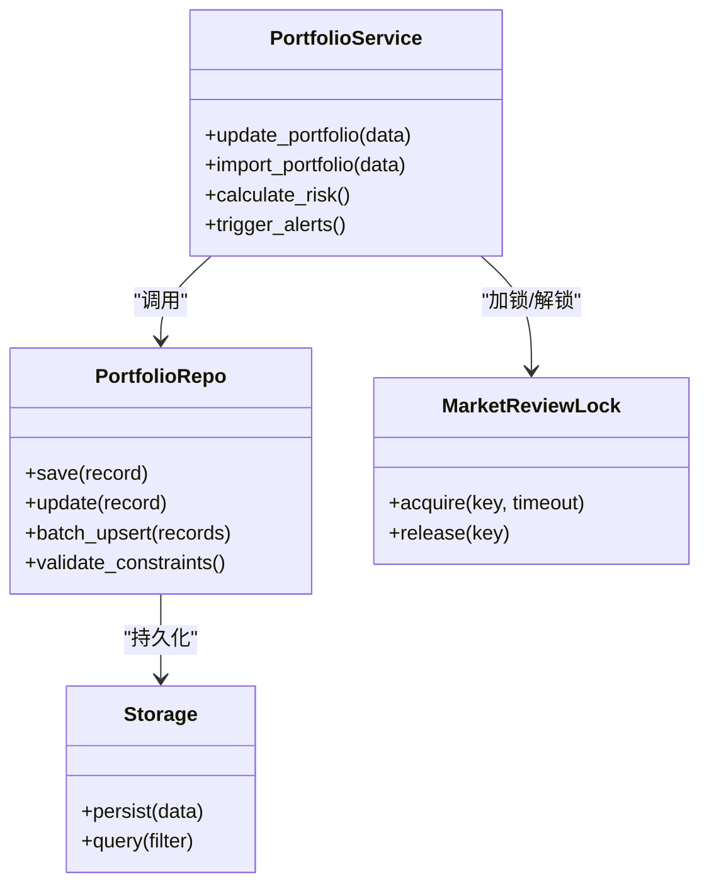
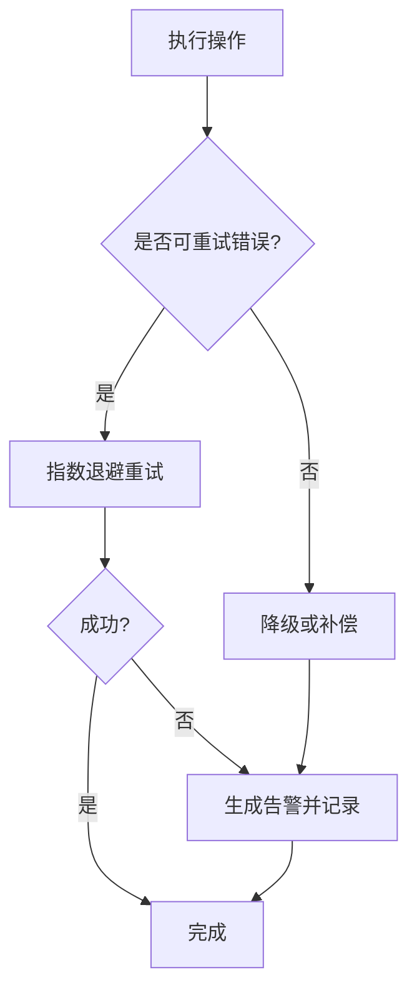
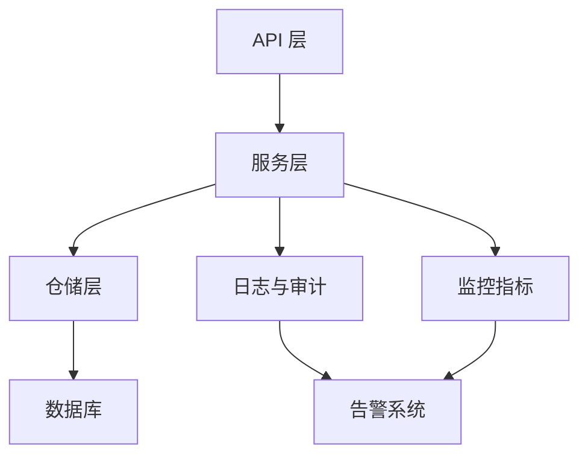
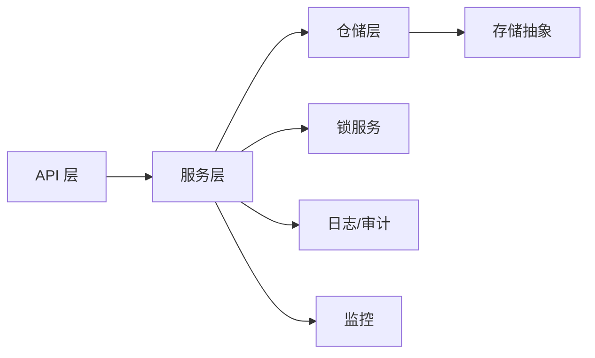

# 数据一致性

<cite>
**本文引用的文件**   
- [portfolio_repo.py](file://src/repositories/portfolio_repo.py)
- [portfolio_service.py](file://src/services/portfolio_service.py)
- [portfolio_alerts.py](file://src/services/portfolio_alerts.py)
- [portfolio_import_service.py](file://src/services/portfolio_import_service.py)
- [portfolio_risk_service.py](file://src/services/portfolio_risk_service.py)
- [api/app.py](file://api/app.py)
- [api/v1/endpoints/portfolio.py](file://api/v1/endpoints/portfolio.py)
- [api/v1/schemas/portfolio.py](file://api/v1/schemas/portfolio.py)
- [core/market_review_lock.py](file://src/core/market_review_lock.py)
- [storage.py](file://src/storage.py)
- [logging_config.py](file://src/logging_config.py)
- [scheduler.py](file://src/scheduler.py)
- [main.py](file://main.py)
</cite>

## 目录
1. [简介](#简介)
2. [项目结构](#项目结构)
3. [核心组件](#核心组件)
4. [架构总览](#架构总览)
5. [详细组件分析](#详细组件分析)
6. [依赖关系分析](#依赖关系分析)
7. [性能考量](#性能考量)
8. [故障排查指南](#故障排查指南)
9. [结论](#结论)
10. [附录](#附录)

## 简介
本文件围绕投资组合数据的一致性进行系统化说明，覆盖事务管理、并发控制与锁策略、数据完整性保证、异常恢复机制、备份与恢复、数据迁移工具以及监控审计等关键主题。文档面向不同技术背景的读者，既提供高层概览，也给出代码级映射与可视化图示，帮助理解系统在真实实现中的设计取舍与最佳实践。

## 项目结构
本项目采用分层架构：API 层暴露接口，服务层封装业务逻辑，仓储层负责数据访问，核心模块提供通用能力（如锁、调度、存储），日志与配置贯穿全链路。与投资组合数据一致性直接相关的目录包括：
- API 层：路由与请求校验
- 服务层：组合变更、导入、风控、告警
- 仓储层：数据库访问与事务边界
- 核心层：分布式/进程内锁、任务调度、存储抽象
- 基础设施：日志、配置、启动入口

**图表来源** 
- [api/app.py](file://api/app.py)
- [api/v1/endpoints/portfolio.py](file://api/v1/endpoints/portfolio.py)
- [api/v1/schemas/portfolio.py](file://api/v1/schemas/portfolio.py)
- [services/portfolio_service.py](file://src/services/portfolio_service.py)
- [services/portfolio_import_service.py](file://src/services/portfolio_import_service.py)
- [services/portfolio_risk_service.py](file://src/services/portfolio_risk_service.py)
- [services/portfolio_alerts.py](file://src/services/portfolio_alerts.py)
- [repositories/portfolio_repo.py](file://src/repositories/portfolio_repo.py)
- [core/market_review_lock.py](file://src/core/market_review_lock.py)
- [storage.py](file://src/storage.py)
- [scheduler.py](file://src/scheduler.py)
- [logging_config.py](file://src/logging_config.py)
- [main.py](file://main.py)

**章节来源**
- [api/app.py](file://api/app.py)
- [api/v1/endpoints/portfolio.py](file://api/v1/endpoints/portfolio.py)
- [api/v1/schemas/portfolio.py](file://api/v1/schemas/portfolio.py)
- [src/services/portfolio_service.py](file://src/services/portfolio_service.py)
- [src/repositories/portfolio_repo.py](file://src/repositories/portfolio_repo.py)
- [src/core/market_review_lock.py](file://src/core/market_review_lock.py)
- [src/storage.py](file://src/storage.py)
- [src/logging_config.py](file://src/logging_config.py)
- [src/scheduler.py](file://src/scheduler.py)
- [main.py](file://main.py)

## 核心组件
- 投资组合服务（Portfolio Service）：聚合组合读写、批量导入、风险计算与告警触发，作为事务编排中心。
- 投资组合仓储（Portfolio Repo）：封装数据库操作，定义事务边界与重试策略，确保原子性。
- 市场审查锁（Market Review Lock）：用于跨进程/线程的互斥控制，避免并发写冲突。
- 存储抽象（Storage）：统一持久化接口，屏蔽底层差异。
- 调度器（Scheduler）：定时任务驱动数据更新与一致性检查。
- API 层：对外暴露 REST 接口，负责参数校验与错误映射。

**章节来源**
- [src/services/portfolio_service.py](file://src/services/portfolio_service.py)
- [src/repositories/portfolio_repo.py](file://src/repositories/portfolio_repo.py)
- [src/core/market_review_lock.py](file://src/core/market_review_lock.py)
- [src/storage.py](file://src/storage.py)
- [src/scheduler.py](file://src/scheduler.py)
- [api/v1/endpoints/portfolio.py](file://api/v1/endpoints/portfolio.py)

## 架构总览
下图展示从 HTTP 请求到数据落库的关键路径，突出事务边界、锁与校验点。

**图表来源** 
- [api/v1/endpoints/portfolio.py](file://api/v1/endpoints/portfolio.py)
- [api/v1/schemas/portfolio.py](file://api/v1/schemas/portfolio.py)
- [src/services/portfolio_service.py](file://src/services/portfolio_service.py)
- [src/repositories/portfolio_repo.py](file://src/repositories/portfolio_repo.py)
- [src/core/market_review_lock.py](file://src/core/market_review_lock.py)

## 详细组件分析

### 事务管理机制
- 事务边界：在仓储层统一开启与提交，服务层仅编排步骤，避免业务逻辑侵入事务细节。
- 并发控制：使用进程内/分布式锁保护关键写路径，防止重复提交与脏写。
- 幂等性：对导入与批量更新操作引入幂等键或去重策略，避免重复处理。
- 隔离级别：根据读多写少场景选择合适隔离级别，必要时使用快照读减少锁竞争。

**图表来源** 
- [src/services/portfolio_service.py](file://src/services/portfolio_service.py)
- [src/repositories/portfolio_repo.py](file://src/repositories/portfolio_repo.py)
- [src/core/market_review_lock.py](file://src/core/market_review_lock.py)

**章节来源**
- [src/repositories/portfolio_repo.py](file://src/repositories/portfolio_repo.py)
- [src/services/portfolio_service.py](file://src/services/portfolio_service.py)
- [src/core/market_review_lock.py](file://src/core/market_review_lock.py)

### 数据完整性保证
- 外键约束：通过仓储层维护关联表的外键关系，确保引用完整性。
- 唯一性检查：对股票代码、组合名称等关键字段实施唯一性约束，避免重复。
- 业务规则验证：在服务层进行范围与阈值校验（如仓位比例、风险指标）。
- 校验顺序：先做输入校验，再做业务规则校验，最后落库，减少无效写入。

**图表来源** 
- [src/services/portfolio_service.py](file://src/services/portfolio_service.py)
- [src/repositories/portfolio_repo.py](file://src/repositories/portfolio_repo.py)
- [src/core/market_review_lock.py](file://src/core/market_review_lock.py)
- [src/storage.py](file://src/storage.py)

**章节来源**
- [src/services/portfolio_service.py](file://src/services/portfolio_service.py)
- [src/repositories/portfolio_repo.py](file://src/repositories/portfolio_repo.py)
- [src/storage.py](file://src/storage.py)

### 异常恢复机制
- 错误检测：捕获数据库异常、网络超时、校验失败等，分类记录。
- 自动重试：对可重试错误（如临时网络问题、死锁）实施指数退避重试。
- 人工干预：对不可重试错误（如数据损坏、权限不足）生成告警并记录上下文。
- 补偿操作：在部分失败时执行补偿（如撤销中间状态、清理临时文件）。

**图表来源** 
- [src/repositories/portfolio_repo.py](file://src/repositories/portfolio_repo.py)
- [src/services/portfolio_service.py](file://src/services/portfolio_service.py)
- [src/logging_config.py](file://src/logging_config.py)

**章节来源**
- [src/repositories/portfolio_repo.py](file://src/repositories/portfolio_repo.py)
- [src/services/portfolio_service.py](file://src/services/portfolio_service.py)
- [src/logging_config.py](file://src/logging_config.py)

### 数据备份与恢复
- 增量备份：基于时间戳或版本号增量导出变更，降低备份窗口。
- 全量备份：定期全量快照，确保灾难恢复基线。
- 灾难恢复：制定恢复演练流程，验证备份可用性与恢复时间目标（RTO/RPO）。
- 一致性快照：在备份前获取一致视图（如快照或只读副本），避免不一致数据。

[本节为概念性内容，不直接分析具体文件]

### 数据迁移工具
- 版本升级：按版本号顺序执行迁移脚本，确保向前兼容。
- 数据校验：迁移前后进行一致性校验（行数、哈希、抽样对比）。
- 回滚机制：支持一键回滚到上一版本，保留回滚日志。
- 灰度发布：分批次迁移，观察指标后再全量推进。

[本节为概念性内容，不直接分析具体文件]

### 监控与审计
- 操作审计：记录所有写操作的主体、时间、参数与结果。
- 指标采集：QPS、延迟、错误率、锁等待时长、事务耗时。
- 告警策略：阈值触发与分级通知，快速定位问题。
- 可追溯性：关联请求 ID 与事务 ID，形成完整链路追踪。

**图表来源** 
- [api/v1/endpoints/portfolio.py](file://api/v1/endpoints/portfolio.py)
- [src/services/portfolio_service.py](file://src/services/portfolio_service.py)
- [src/repositories/portfolio_repo.py](file://src/repositories/portfolio_repo.py)
- [src/logging_config.py](file://src/logging_config.py)

**章节来源**
- [src/logging_config.py](file://src/logging_config.py)
- [src/scheduler.py](file://src/scheduler.py)

## 依赖关系分析
- 低耦合高内聚：服务层依赖仓储接口，仓储依赖存储抽象，便于替换与测试。
- 外部依赖：数据库、锁服务、日志与监控系统。
- 潜在循环依赖：通过接口解耦避免循环；若存在需重构为事件驱动或消息队列。

**图表来源** 
- [api/v1/endpoints/portfolio.py](file://api/v1/endpoints/portfolio.py)
- [src/services/portfolio_service.py](file://src/services/portfolio_service.py)
- [src/repositories/portfolio_repo.py](file://src/repositories/portfolio_repo.py)
- [src/storage.py](file://src/storage.py)
- [src/core/market_review_lock.py](file://src/core/market_review_lock.py)
- [src/logging_config.py](file://src/logging_config.py)

**章节来源**
- [src/services/portfolio_service.py](file://src/services/portfolio_service.py)
- [src/repositories/portfolio_repo.py](file://src/repositories/portfolio_repo.py)
- [src/storage.py](file://src/storage.py)
- [src/core/market_review_lock.py](file://src/core/market_review_lock.py)
- [src/logging_config.py](file://src/logging_config.py)

## 性能考量
- 批处理：批量插入/更新减少往返次数。
- 连接池：合理设置连接数与超时，避免资源耗尽。
- 索引优化：对查询热点字段建立索引，提升读取性能。
- 缓存策略：读多写少场景引入缓存，注意失效与一致性。
- 异步化：非关键路径异步执行，缩短主流程耗时。

[本节为通用指导，不直接分析具体文件]

## 故障排查指南
- 常见问题：
  - 事务超时：检查长事务与锁等待，优化 SQL 与索引。
  - 并发冲突：增加重试与退避，调整锁粒度。
  - 数据不一致：核对迁移脚本与校验流程，恢复基线快照。
- 诊断步骤：
  - 查看日志与审计记录，定位请求 ID 与事务 ID。
  - 检查监控指标，识别瓶颈与异常峰值。
  - 复现问题，逐步缩小范围。
- 恢复策略：
  - 使用备份恢复基线，应用增量变更。
  - 回滚至稳定版本，观察指标后再次尝试。

**章节来源**
- [src/logging_config.py](file://src/logging_config.py)
- [src/scheduler.py](file://src/scheduler.py)
- [src/storage.py](file://src/storage.py)

## 结论
本方案通过明确的事务边界、严格的并发控制与锁策略、完善的数据完整性校验、健壮的异常恢复机制、可靠的备份与恢复流程、可追溯的监控审计，构建了稳健的投资组合数据一致性保障体系。建议持续优化索引与批处理策略，完善自动化测试与演练，确保在高并发与复杂场景下的稳定性与可恢复性。

## 附录
- 术语表：事务、隔离级别、幂等性、RTO/RPO、快照、补偿操作。
- 参考规范：数据库设计规范、API 错误码约定、日志格式标准。

[本节为补充信息，不直接分析具体文件]