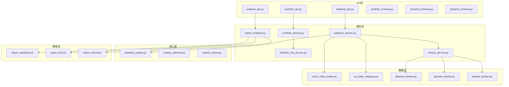
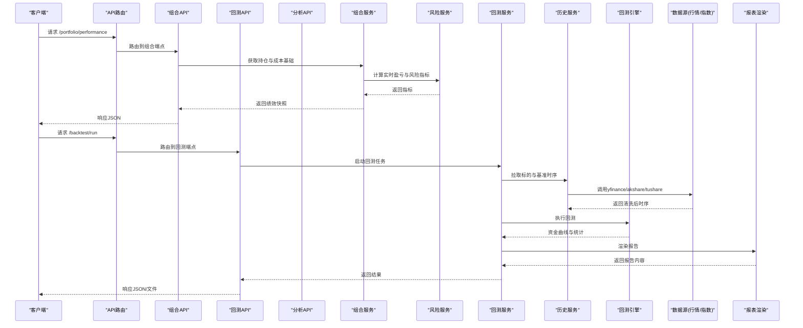
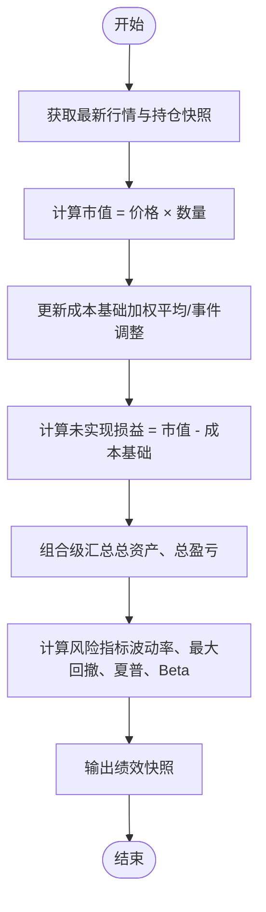
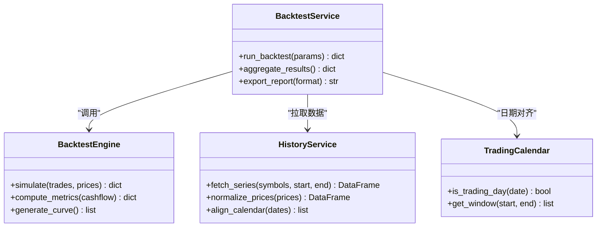
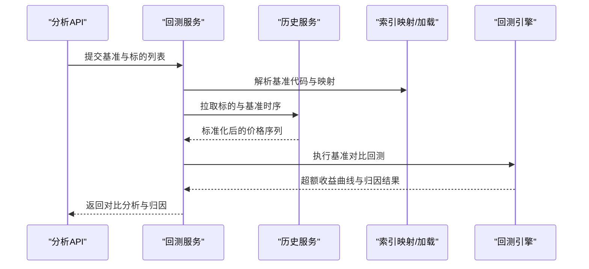
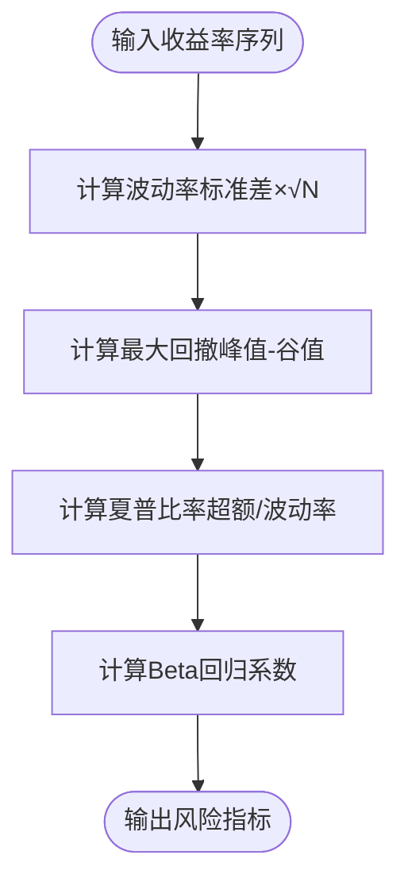
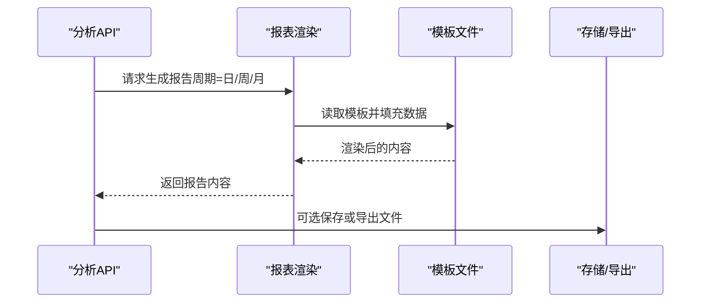
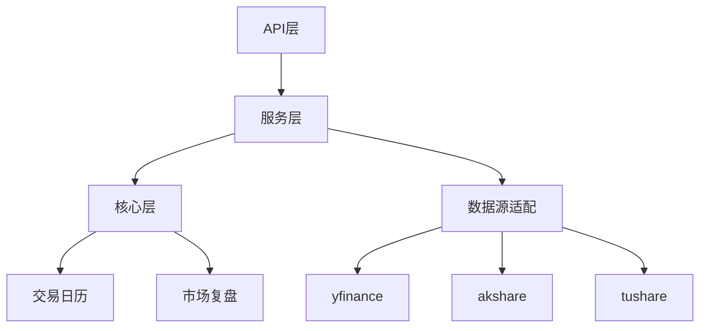

# 绩效分析

<cite>
**本文引用的文件**   
- [portfolio_service.py](file://src/services/portfolio_service.py)
- [portfolio_risk_service.py](file://src/services/portfolio_risk_service.py)
- [backtest_service.py](file://src/services/backtest_service.py)
- [history_service.py](file://src/services/history_service.py)
- [report_renderer.py](file://src/services/report_renderer.py)
- [backtest_engine.py](file://src/core/backtest_engine.py)
- [trading_calendar.py](file://src/core/trading_calendar.py)
- [market_review.py](file://src/core/market_review.py)
- [api_router.py](file://api/v1/router.py)
- [portfolio_api.py](file://api/v1/endpoints/portfolio.py)
- [backtest_api.py](file://api/v1/endpoints/backtest.py)
- [analysis_api.py](file://api/v1/endpoints/analysis.py)
- [portfolio_schema.py](file://api/v1/schemas/portfolio.py)
- [backtest_schema.py](file://api/v1/schemas/backtest.py)
- [analysis_schema.py](file://api/v1/schemas/analysis.py)
- [stock_index_loader.py](file://src/data/stock_index_loader.py)
- [us_index_mapping.py](file://data_provider/us_index_mapping.py)
- [yfinance_fetcher.py](file://data_provider/yfinance_fetcher.py)
- [akshare_fetcher.py](file://data_provider/akshare_fetcher.py)
- [tushare_fetcher.py](file://data_provider/tushare_fetcher.py)
- [report_markdown.j2](file://templates/report_markdown.j2)
- [report_brief.j2](file://templates/report_brief.j2)
- [report_wechat.j2](file://templates/report_wechat.j2)
</cite>

## 目录
1. [简介](#简介)
2. [项目结构](#项目结构)
3. [核心组件](#核心组件)
4. [架构总览](#架构总览)
5. [详细组件分析](#详细组件分析)
6. [依赖关系分析](#依赖关系分析)
7. [性能考量](#性能考量)
8. [故障排查指南](#故障排查指南)
9. [结论](#结论)
10. [附录](#附录)

## 简介
本文件面向“投资组合绩效分析”功能，覆盖以下关键能力：
- 实时盈亏计算机制：市值估值、成本基础计算与未实现损益跟踪
- 历史收益回测：时间序列分析、收益率计算与风险指标统计
- 基准对比分析：指数选择、超额收益计算与业绩归因
- 风险指标监控：波动率、最大回撤、夏普比率与Beta值
- 绩效报表生成：日度、周度、月度报告模板
- 可视化图表与数据导出：前端图表渲染与后端数据导出接口

## 项目结构
围绕绩效分析的核心代码分布在服务层、核心引擎、API路由与Schema定义、数据源适配以及模板渲染等模块中。整体采用分层架构：
- API层：提供REST接口，负责参数校验与响应序列化
- 服务层：聚合业务逻辑（组合管理、风险计算、回测编排、报表渲染）
- 核心层：回测引擎、交易日历、市场复盘等基础设施
- 数据层：多源行情与指数映射、索引加载
- 模板层：Markdown/微信简报模板用于报表输出

**图示来源** 
- [portfolio_api.py](file://api/v1/endpoints/portfolio.py)
- [backtest_api.py](file://api/v1/endpoints/backtest.py)
- [analysis_api.py](file://api/v1/endpoints/analysis.py)
- [portfolio_schema.py](file://api/v1/schemas/portfolio.py)
- [backtest_schema.py](file://api/v1/schemas/backtest.py)
- [analysis_schema.py](file://api/v1/schemas/analysis.py)
- [portfolio_service.py](file://src/services/portfolio_service.py)
- [portfolio_risk_service.py](file://src/services/portfolio_risk_service.py)
- [backtest_service.py](file://src/services/backtest_service.py)
- [history_service.py](file://src/services/history_service.py)
- [report_renderer.py](file://src/services/report_renderer.py)
- [backtest_engine.py](file://src/core/backtest_engine.py)
- [trading_calendar.py](file://src/core/trading_calendar.py)
- [market_review.py](file://src/core/market_review.py)
- [stock_index_loader.py](file://src/data/stock_index_loader.py)
- [us_index_mapping.py](file://data_provider/us_index_mapping.py)
- [yfinance_fetcher.py](file://data_provider/yfinance_fetcher.py)
- [akshare_fetcher.py](file://data_provider/akshare_fetcher.py)
- [tushare_fetcher.py](file://data_provider/tushare_fetcher.py)
- [report_markdown.j2](file://templates/report_markdown.j2)
- [report_brief.j2](file://templates/report_brief.j2)
- [report_wechat.j2](file://templates/report_wechat.j2)

**章节来源**
- [api_router.py](file://api/v1/router.py)
- [portfolio_api.py](file://api/v1/endpoints/portfolio.py)
- [backtest_api.py](file://api/v1/endpoints/backtest.py)
- [analysis_api.py](file://api/v1/endpoints/analysis.py)

## 核心组件
- 组合服务（Portfolio Service）：维护持仓快照、成本基础、市值与未实现损益的更新与查询
- 风险服务（Portfolio Risk Service）：计算波动率、最大回撤、夏普比率、Beta等风险指标
- 回测服务（Backtest Service）：编排历史数据拉取、回测引擎执行、结果汇总与指标统计
- 历史服务（History Service）：统一时序数据获取与清洗，支撑回测与基准对比
- 报表渲染（Report Renderer）：基于模板生成Markdown/微信简报等格式的报告
- 回测引擎（Backtest Engine）：核心回测算法，含资金曲线、交易信号回放与绩效统计
- 交易日历（Trading Calendar）：交易日识别与窗口对齐，确保时间序列一致性
- 市场复盘（Market Review）：市场状态上下文，辅助归因与解释

**章节来源**
- [portfolio_service.py](file://src/services/portfolio_service.py)
- [portfolio_risk_service.py](file://src/services/portfolio_risk_service.py)
- [backtest_service.py](file://src/services/backtest_service.py)
- [history_service.py](file://src/services/history_service.py)
- [report_renderer.py](file://src/services/report_renderer.py)
- [backtest_engine.py](file://src/core/backtest_engine.py)
- [trading_calendar.py](file://src/core/trading_calendar.py)
- [market_review.py](file://src/core/market_review.py)

## 架构总览
下图展示从API到服务、引擎与数据源的调用链路，以及报表生成的路径。

**图示来源** 
- [portfolio_api.py](file://api/v1/endpoints/portfolio.py)
- [backtest_api.py](file://api/v1/endpoints/backtest.py)
- [analysis_api.py](file://api/v1/endpoints/analysis.py)
- [portfolio_service.py](file://src/services/portfolio_service.py)
- [portfolio_risk_service.py](file://src/services/portfolio_risk_service.py)
- [backtest_service.py](file://src/services/backtest_service.py)
- [history_service.py](file://src/services/history_service.py)
- [backtest_engine.py](file://src/core/backtest_engine.py)
- [yfinance_fetcher.py](file://data_provider/yfinance_fetcher.py)
- [akshare_fetcher.py](file://data_provider/akshare_fetcher.py)
- [tushare_fetcher.py](file://data_provider/tushare_fetcher.py)
- [report_renderer.py](file://src/services/report_renderer.py)

## 详细组件分析

### 实时盈亏计算机制（市值估值、成本基础、未实现损益）
- 市值估值：按最新收盘价乘以持仓数量，支持多币种与汇率换算（由数据源适配器处理）
- 成本基础：按加权平均成本或移动平均法更新，考虑分红、拆合股调整
- 未实现损益：市值减去成本基础，逐日滚动累计；支持按资产维度与组合维度汇总
- 风险指标：在实时快照中同步计算波动率、最大回撤、夏普比率与Beta（以基准为参照）

**图示来源** 
- [portfolio_service.py](file://src/services/portfolio_service.py)
- [portfolio_risk_service.py](file://src/services/portfolio_risk_service.py)
- [yfinance_fetcher.py](file://data_provider/yfinance_fetcher.py)
- [akshare_fetcher.py](file://data_provider/akshare_fetcher.py)
- [tushare_fetcher.py](file://data_provider/tushare_fetcher.py)

**章节来源**
- [portfolio_service.py](file://src/services/portfolio_service.py)
- [portfolio_risk_service.py](file://src/services/portfolio_risk_service.py)

### 历史收益回测（时间序列分析、收益率计算、风险指标统计）
- 时间序列分析：对齐交易日，处理缺失值与停牌，保证回测窗口一致
- 收益率计算：简单收益率、对数收益率、年化收益率；支持复权价格
- 风险指标统计：波动率（年化）、最大回撤、夏普比率、Beta、信息比率
- 回测引擎：基于交易信号回放，模拟成交、滑点与手续费，生成资金曲线

**图示来源** 
- [backtest_service.py](file://src/services/backtest_service.py)
- [backtest_engine.py](file://src/core/backtest_engine.py)
- [history_service.py](file://src/services/history_service.py)
- [trading_calendar.py](file://src/core/trading_calendar.py)

**章节来源**
- [backtest_service.py](file://src/services/backtest_service.py)
- [backtest_engine.py](file://src/core/backtest_engine.py)
- [history_service.py](file://src/services/history_service.py)
- [trading_calendar.py](file://src/core/trading_calendar.py)

### 基准对比分析（指数选择、超额收益、业绩归因）
- 指数选择：通过索引映射与远程服务选择合适基准（如沪深300、标普500等）
- 超额收益：组合收益减去基准收益，滚动窗口计算累计超额与年化超额
- 业绩归因：按行业/风格因子分解贡献，结合市场复盘上下文进行解释

**图示来源** 
- [analysis_api.py](file://api/v1/endpoints/analysis.py)
- [backtest_service.py](file://src/services/backtest_service.py)
- [history_service.py](file://src/services/history_service.py)
- [stock_index_loader.py](file://src/data/stock_index_loader.py)
- [us_index_mapping.py](file://data_provider/us_index_mapping.py)

**章节来源**
- [analysis_api.py](file://api/v1/endpoints/analysis.py)
- [stock_index_loader.py](file://src/data/stock_index_loader.py)
- [us_index_mapping.py](file://data_provider/us_index_mapping.py)

### 风险指标监控（波动率、最大回撤、夏普比率、Beta）
- 波动率：基于日收益率的标准差，年化处理
- 最大回撤：资金曲线峰值到谷值的最大跌幅
- 夏普比率：超额收益除以波动率（无风险利率可配置）
- Beta：组合收益与基准收益的回归系数，衡量系统性风险

**图示来源** 
- [portfolio_risk_service.py](file://src/services/portfolio_risk_service.py)

**章节来源**
- [portfolio_risk_service.py](file://src/services/portfolio_risk_service.py)

### 绩效报表生成（日度、周度、月度模板）
- 模板：Markdown、微信简报等模板，支持动态字段替换
- 周期：日度、周度、月度报告，包含关键指标、图表与摘要
- 导出：支持文本与结构化数据导出，便于下游系统消费

**图示来源** 
- [report_renderer.py](file://src/services/report_renderer.py)
- [report_markdown.j2](file://templates/report_markdown.j2)
- [report_brief.j2](file://templates/report_brief.j2)
- [report_wechat.j2](file://templates/report_wechat.j2)

**章节来源**
- [report_renderer.py](file://src/services/report_renderer.py)
- [report_markdown.j2](file://templates/report_markdown.j2)
- [report_brief.j2](file://templates/report_brief.j2)
- [report_wechat.j2](file://templates/report_wechat.j2)

### 可视化图表与数据导出
- 可视化：前端基于后端返回的时间序列与指标数据进行图表渲染（资金曲线、超额收益、风险指标）
- 导出：CSV/Excel/JSON等格式，支持批量下载与定时任务

[本节为概念性说明，不直接分析具体文件]

## 依赖关系分析
- 组件耦合：API层与服务层松耦合，服务层依赖核心引擎与数据源适配器
- 外部依赖：行情与指数数据来自多个数据源（yfinance、akshare、tushare），需处理异常与降级
- 循环依赖：避免服务层与核心层之间的循环导入，通过接口抽象解耦

**图示来源** 
- [api_router.py](file://api/v1/router.py)
- [portfolio_service.py](file://src/services/portfolio_service.py)
- [backtest_service.py](file://src/services/backtest_service.py)
- [history_service.py](file://src/services/history_service.py)
- [backtest_engine.py](file://src/core/backtest_engine.py)
- [trading_calendar.py](file://src/core/trading_calendar.py)
- [market_review.py](file://src/core/market_review.py)
- [yfinance_fetcher.py](file://data_provider/yfinance_fetcher.py)
- [akshare_fetcher.py](file://data_provider/akshare_fetcher.py)
- [tushare_fetcher.py](file://data_provider/tushare_fetcher.py)

**章节来源**
- [api_router.py](file://api/v1/router.py)
- [portfolio_service.py](file://src/services/portfolio_service.py)
- [backtest_service.py](file://src/services/backtest_service.py)
- [history_service.py](file://src/services/history_service.py)
- [backtest_engine.py](file://src/core/backtest_engine.py)
- [trading_calendar.py](file://src/core/trading_calendar.py)
- [market_review.py](file://src/core/market_review.py)
- [yfinance_fetcher.py](file://data_provider/yfinance_fetcher.py)
- [akshare_fetcher.py](file://data_provider/akshare_fetcher.py)
- [tushare_fetcher.py](file://data_provider/tushare_fetcher.py)

## 性能考量
- 数据拉取并发：历史服务应使用异步并发拉取多标的与基准数据，减少等待时间
- 缓存策略：对常用行情与指数映射进行缓存，降低重复请求
- 计算优化：风险指标与回测统计向量化计算，避免Python循环瓶颈
- 内存管理：大时间序列分块处理，及时释放中间变量
- I/O优化：报表渲染与导出采用流式写入，避免一次性加载大对象

[本节为通用指导，不直接分析具体文件]

## 故障排查指南
- 数据源异常：检查网络连通性与限频策略，启用降级数据源与重试机制
- 时间对齐错误：确认交易日历与节假日配置，处理停牌与缺失值
- 成本基础不一致：核查分红、拆合股事件是否已应用，验证加权平均逻辑
- 指标异常：检查收益率序列的NaN与无穷值处理，确保年化参数正确
- 报表渲染失败：核对模板字段与数据类型，确保必填项存在

**章节来源**
- [history_service.py](file://src/services/history_service.py)
- [trading_calendar.py](file://src/core/trading_calendar.py)
- [portfolio_service.py](file://src/services/portfolio_service.py)
- [report_renderer.py](file://src/services/report_renderer.py)

## 结论
本绩效分析模块通过清晰的分层架构与模块化设计，实现了实时盈亏计算、历史回测、基准对比、风险指标监控与报表生成等核心能力。建议在后续迭代中加强数据源容错、计算性能优化与可视化交互体验，以提升系统的稳定性与可用性。

[本节为总结性内容，不直接分析具体文件]

## 附录
- 术语表：市值、成本基础、未实现损益、波动率、最大回撤、夏普比率、Beta、超额收益、业绩归因
- 配置建议：无风险利率、年化因子、滑点与手续费参数
- 扩展方向：因子模型归因、蒙特卡洛模拟、实时推送告警

[本节为补充信息，不直接分析具体文件]