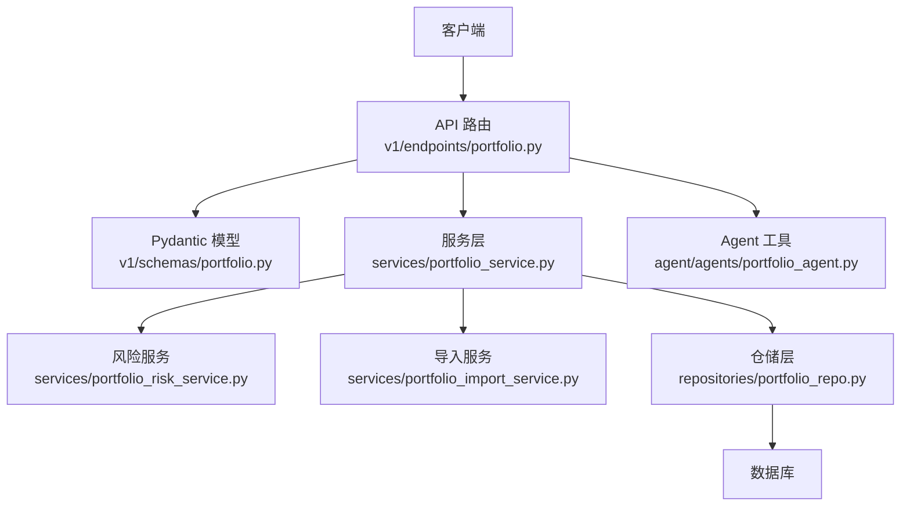
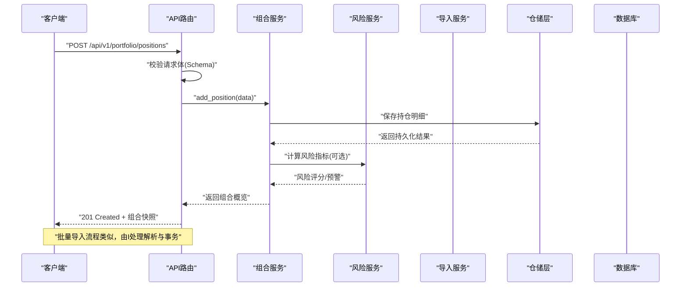
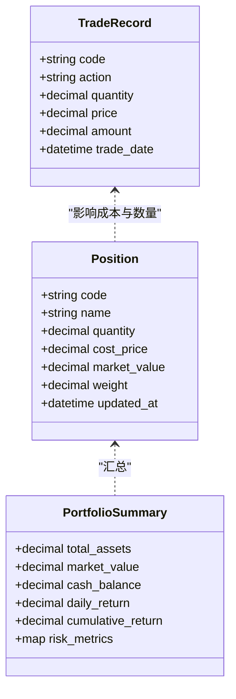
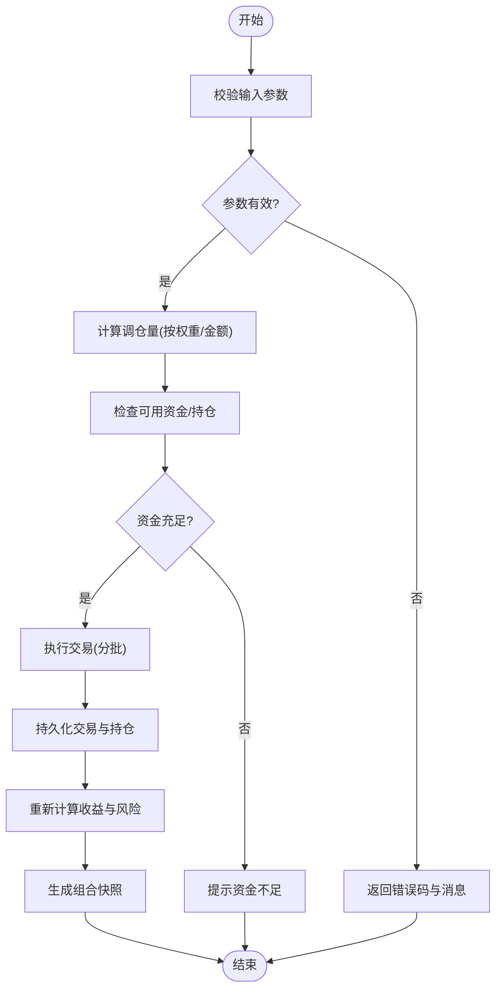
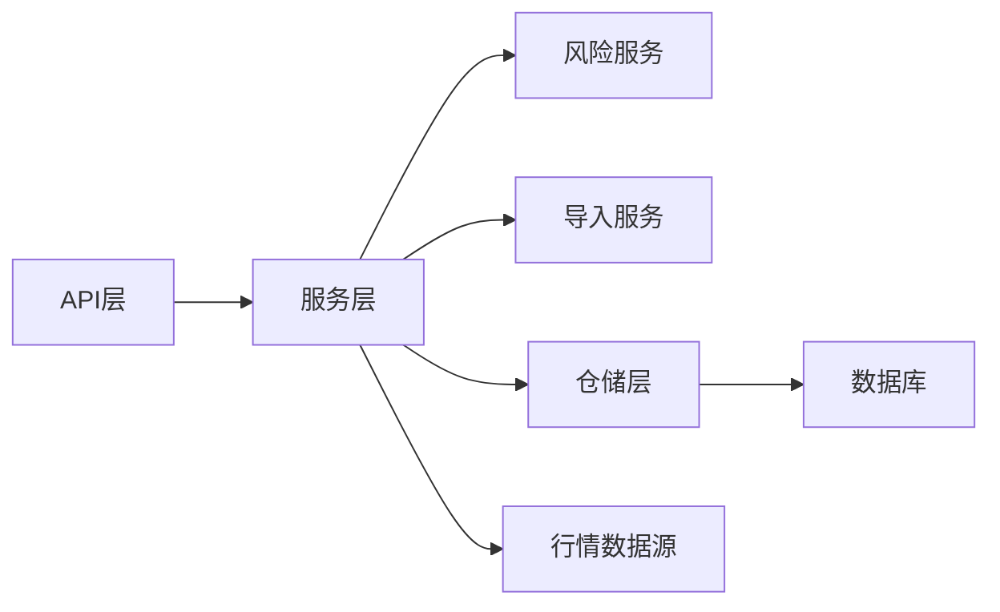

# 投资组合管理

<cite>
**本文引用的文件**   
- [portfolio.py](file://api/v1/endpoints/portfolio.py)
- [portfolio.py](file://api/v1/schemas/portfolio.py)
- [portfolio_service.py](file://src/services/portfolio_service.py)
- [portfolio_risk_service.py](file://src/services/portfolio_risk_service.py)
- [portfolio_import_service.py](file://src/services/portfolio_import_service.py)
- [portfolio_repo.py](file://src/repositories/portfolio_repo.py)
- [portfolio_agent.py](file://src/agent/agents/portfolio_agent.py)
- [test_main_portfolio.py](file://tests/test_main_portfolio.py)
- [test_portfolio_api.py](file://tests/test_portfolio_api.py)
- [test_portfolio_service.py](file://tests/test_portfolio_service.py)
- [test_data_tools_portfolio_snapshot.py](file://tests/test_data_tools_portfolio_snapshot.py)
</cite>

## 目录
1. [简介](#简介)
2. [项目结构](#项目结构)
3. [核心组件](#核心组件)
4. [架构总览](#架构总览)
5. [详细组件分析](#详细组件分析)
6. [依赖关系分析](#依赖关系分析)
7. [性能考量](#性能考量)
8. [故障排查指南](#故障排查指南)
9. [结论](#结论)
10. [附录](#附录)

## 简介
本文件面向Daily Stock Analysis项目的“投资组合管理”功能，系统性说明其数据模型、服务层能力、决策档案配置、持久化方案与API接口规范，并提供可操作的实战示例（批量导入、定期再平衡、报表导出）。文档力求兼顾技术深度与可读性，帮助开发者快速理解并扩展该模块。

## 项目结构
投资组合管理涉及API层、Schema定义、服务层、仓储层以及Agent工具链，整体采用分层架构：
- API层：暴露RESTful端点，负责请求校验与响应封装
- Schema层：Pydantic模型，统一输入输出契约
- 服务层：业务编排（持仓增删改查、盈亏计算、风险指标、导入导出）
- 仓储层：数据持久化（数据库表、索引、备份恢复）
- Agent层：为智能体提供组合快照与分析工具

图表来源 
- [portfolio.py](file://api/v1/endpoints/portfolio.py)
- [portfolio.py](file://api/v1/schemas/portfolio.py)
- [portfolio_service.py](file://src/services/portfolio_service.py)
- [portfolio_risk_service.py](file://src/services/portfolio_risk_service.py)
- [portfolio_import_service.py](file://src/services/portfolio_import_service.py)
- [portfolio_repo.py](file://src/repositories/portfolio_repo.py)
- [portfolio_agent.py](file://src/agent/agents/portfolio_agent.py)

章节来源
- [portfolio.py](file://api/v1/endpoints/portfolio.py)
- [portfolio.py](file://api/v1/schemas/portfolio.py)
- [portfolio_service.py](file://src/services/portfolio_service.py)
- [portfolio_risk_service.py](file://src/services/portfolio_risk_service.py)
- [portfolio_import_service.py](file://src/services/portfolio_import_service.py)
- [portfolio_repo.py](file://src/repositories/portfolio_repo.py)
- [portfolio_agent.py](file://src/agent/agents/portfolio_agent.py)

## 核心组件
- 数据模型（Schema）
  - 持仓条目：证券代码、名称、数量、成本价、市值、权重等
  - 组合概览：总资产、总市值、现金余额、收益统计、风险指标
  - 交易指令：买入/卖出、目标权重、止损止盈参数
  - 导入格式：CSV/JSON 批量持仓与交易记录
- 服务层（Service）
  - 组合CRUD：创建、更新、删除、查询
  - 仓位调整：按金额或权重调仓，支持分批执行
  - 盈亏计算：实现成本法（移动加权/先进先出）、市价重估、累计收益
  - 风险评估：波动率、最大回撤、VaR、夏普比率、行业集中度
  - 导入导出：批量导入持仓/交易、导出报表（CSV/Markdown）
- 仓储层（Repository）
  - 持久化：组合主表、持仓明细表、交易日志表
  - 索引优化：按代码、日期、组合ID建立复合索引
  - 备份恢复：定时快照、增量日志回放
- Agent工具
  - 组合快照：获取当前持仓、权重、估值
  - 分析工具：收益归因、风险预警、再平衡建议

章节来源
- [portfolio.py](file://api/v1/schemas/portfolio.py)
- [portfolio_service.py](file://src/services/portfolio_service.py)
- [portfolio_risk_service.py](file://src/services/portfolio_risk_service.py)
- [portfolio_import_service.py](file://src/services/portfolio_import_service.py)
- [portfolio_repo.py](file://src/repositories/portfolio_repo.py)
- [portfolio_agent.py](file://src/agent/agents/portfolio_agent.py)

## 架构总览
投资组合管理的调用链路遵循“请求→校验→服务→仓储→存储”的标准流程，同时通过风险服务与导入服务进行横向扩展。

图表来源 
- [portfolio.py](file://api/v1/endpoints/portfolio.py)
- [portfolio_service.py](file://src/services/portfolio_service.py)
- [portfolio_risk_service.py](file://src/services/portfolio_risk_service.py)
- [portfolio_import_service.py](file://src/services/portfolio_import_service.py)
- [portfolio_repo.py](file://src/repositories/portfolio_repo.py)

## 详细组件分析

### 数据模型与结构设计
- 持仓信息
  - 字段：证券代码、名称、数量、成本价、市值、权重、更新时间
  - 约束：唯一键（组合ID+代码），数量非负，权重范围[0,1]
- 成本计算
  - 支持移动加权平均与先进先出两种策略
  - 成本更新触发：买入追加、分红送股、拆合股
- 收益统计
  - 日度/周度/月度收益率、累计收益率、年化收益率
  - 基准对比：相对指数超额收益
- 风险评估
  - 波动率、最大回撤、VaR(95%/99%)、夏普比率、索提诺比率
  - 集中度：行业/地域集中度阈值与预警

图表来源 
- [portfolio.py](file://api/v1/schemas/portfolio.py)
- [portfolio_service.py](file://src/services/portfolio_service.py)

章节来源
- [portfolio.py](file://api/v1/schemas/portfolio.py)
- [portfolio_service.py](file://src/services/portfolio_service.py)

### 服务层核心功能
- 持仓添加/删除
  - 新增：校验代码有效性、资金可用性、重复持仓合并
  - 删除：检查剩余数量、更新权重、记录交易日志
- 仓位调整
  - 按目标权重或目标金额调仓，自动计算买卖量
  - 支持分批执行与失败回滚
- 盈亏计算
  - 实时市价重估，滚动窗口收益统计
  - 成本法切换与历史重算
- 绩效分析
  - 收益分解：个股贡献、行业贡献、现金拖累
  - 风险归因：波动来源、尾部风险、相关性矩阵

图表来源 
- [portfolio_service.py](file://src/services/portfolio_service.py)

章节来源
- [portfolio_service.py](file://src/services/portfolio_service.py)

### 决策档案配置选项
- 风险偏好设置
  - 风险等级（保守/稳健/积极）
  - 最大回撤容忍度、VaR上限、波动率阈值
- 止损止盈规则
  - 个股止损/止盈比例、组合级止损线
  - 动态止损（基于ATR或均线）
- 资产配置策略
  - 目标权重区间、再平衡频率（日/周/月）
  - 行业/地域分散度约束、流动性限制

章节来源
- [portfolio_risk_service.py](file://src/services/portfolio_risk_service.py)
- [portfolio_service.py](file://src/services/portfolio_service.py)

### 持久化存储方案
- 数据库表结构
  - 组合主表：组合ID、名称、创建时间、状态
  - 持仓明细表：组合ID、代码、数量、成本、市值、权重、更新时间
  - 交易日志表：组合ID、代码、动作、数量、价格、金额、时间
- 索引优化
  - 组合ID+代码联合唯一索引
  - 交易时间、代码、组合ID的复合索引加速查询
- 备份恢复
  - 每日全量快照+增量日志
  - 恢复流程：加载快照→回放增量→一致性校验

章节来源
- [portfolio_repo.py](file://src/repositories/portfolio_repo.py)

### API接口使用说明
- 端点概览
  - POST /api/v1/portfolio/positions：新增持仓
  - DELETE /api/v1/portfolio/positions/{code}：删除持仓
  - PUT /api/v1/portfolio/rebalance：仓位调整
  - GET /api/v1/portfolio/snapshot：组合快照
  - POST /api/v1/portfolio/import：批量导入
  - GET /api/v1/portfolio/report：导出报表
- 请求/响应格式
  - 请求体遵循Schema定义（代码、数量、价格、权重等）
  - 响应包含状态码、数据对象与错误信息
- 错误码
  - 400：参数校验失败
  - 409：冲突（重复持仓、资金不足）
  - 500：内部错误

章节来源
- [portfolio.py](file://api/v1/endpoints/portfolio.py)
- [portfolio.py](file://api/v1/schemas/portfolio.py)

### 实际使用示例
- 批量导入
  - 上传CSV/JSON，包含代码、动作、数量、价格、日期
  - 服务层解析→事务写入→风险重算→返回导入报告
- 定期再平衡
  - 定时任务触发，读取目标权重，计算调仓量，执行交易
  - 失败重试与审计日志
- 报表导出
  - 支持CSV/Markdown，包含持仓明细、收益曲线、风险指标

章节来源
- [portfolio_import_service.py](file://src/services/portfolio_import_service.py)
- [portfolio_service.py](file://src/services/portfolio_service.py)

## 依赖关系分析
- 组件耦合
  - API层依赖Schema与服务层，低耦合高内聚
  - 服务层依赖风险服务与导入服务，职责清晰
  - 仓储层屏蔽数据库细节，便于替换存储后端
- 外部依赖
  - 行情数据源（用于市值重估与收益计算）
  - 通知系统（风险预警）
- 循环依赖
  - 无直接循环依赖，服务间通过接口解耦

图表来源 
- [portfolio.py](file://api/v1/endpoints/portfolio.py)
- [portfolio_service.py](file://src/services/portfolio_service.py)
- [portfolio_risk_service.py](file://src/services/portfolio_risk_service.py)
- [portfolio_import_service.py](file://src/services/portfolio_import_service.py)
- [portfolio_repo.py](file://src/repositories/portfolio_repo.py)

章节来源
- [portfolio.py](file://api/v1/endpoints/portfolio.py)
- [portfolio_service.py](file://src/services/portfolio_service.py)
- [portfolio_risk_service.py](file://src/services/portfolio_risk_service.py)
- [portfolio_import_service.py](file://src/services/portfolio_import_service.py)
- [portfolio_repo.py](file://src/repositories/portfolio_repo.py)

## 性能考量
- 批量操作
  - 导入与再平衡采用事务与分批提交，避免长事务锁表
- 缓存策略
  - 组合快照缓存（TTL），减少重复计算
- 查询优化
  - 复合索引覆盖高频查询（组合ID+日期、代码+时间）
- 异步处理
  - 风险计算与报表生成异步队列，降低主流程延迟

## 故障排查指南
- 常见问题
  - 参数校验失败：检查Schema必填字段与类型
  - 资金不足：确认可用余额与冻结资金
  - 重复持仓：检查唯一键冲突
- 诊断步骤
  - 查看交易日志与错误日志
  - 验证数据一致性（持仓与交易匹配）
  - 复现路径：最小化请求体测试
- 恢复策略
  - 从快照恢复+增量回放
  - 清理脏数据后重试

章节来源
- [test_portfolio_api.py](file://tests/test_portfolio_api.py)
- [test_portfolio_service.py](file://tests/test_portfolio_service.py)
- [test_data_tools_portfolio_snapshot.py](file://tests/test_data_tools_portfolio_snapshot.py)

## 结论
投资组合管理模块以清晰的层次结构与完善的Schema契约为基础，提供了完整的持仓管理、盈亏计算、风险评估与导入导出能力。通过索引优化与异步处理保障性能，结合快照与增量日志确保数据可靠性。建议在生产环境启用监控告警与自动化再平衡，以提升运营效率与风险控制水平。

## 附录
- 术语表
  - 组合快照：某一时刻的组合资产与持仓视图
  - 再平衡：将持仓权重调整至目标配置的过程
  - VaR：在给定置信水平下的最大潜在损失
- 参考测试
  - 单元测试覆盖API、服务与快照逻辑，可作为集成参考

章节来源
- [test_main_portfolio.py](file://tests/test_main_portfolio.py)
- [test_portfolio_api.py](file://tests/test_portfolio_api.py)
- [test_portfolio_service.py](file://tests/test_portfolio_service.py)
- [test_data_tools_portfolio_snapshot.py](file://tests/test_data_tools_portfolio_snapshot.py)