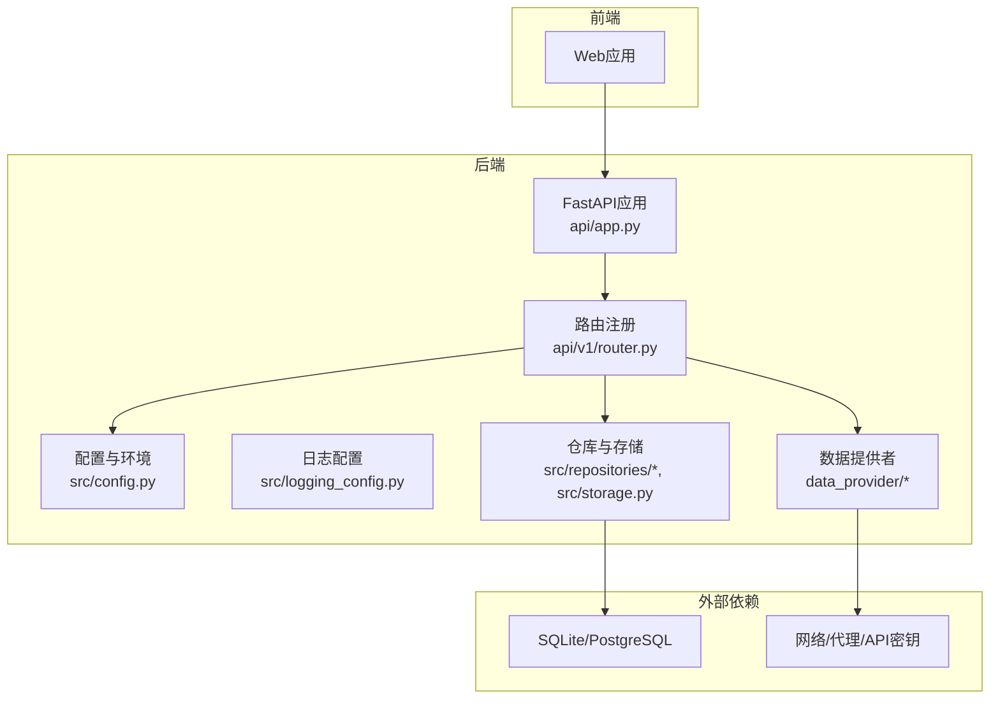
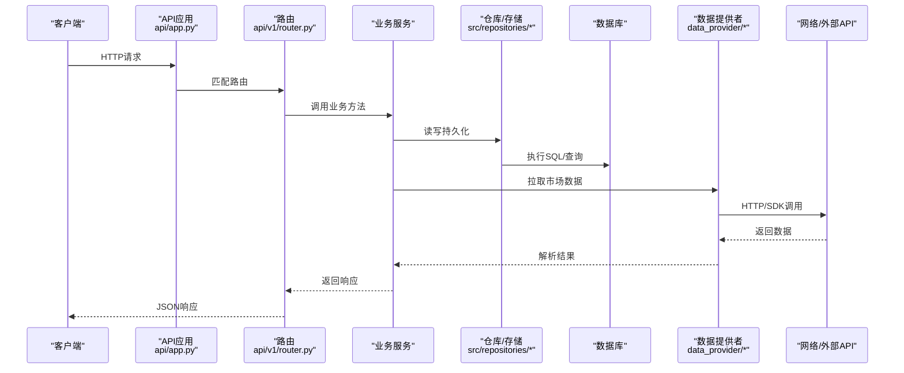
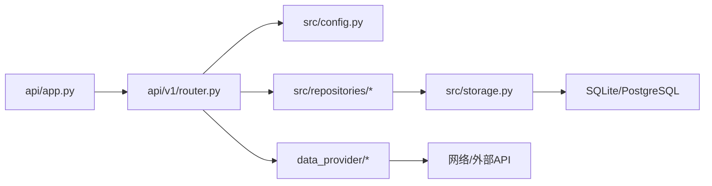

# 常见问题诊断

<cite>
**本文引用的文件**   
- [main.py](file://main.py)
- [server.py](file://server.py)
- [pyproject.toml](file://pyproject.toml)
- [requirements.txt](file://requirements.txt)
- [src/config.py](file://src/config.py)
- [src/logging_config.py](file://src/logging_config.py)
- [scripts/check_env.py](file://scripts/check_env.py)
- [api/app.py](file://api/app.py)
- [api/v1/router.py](file://api/v1/router.py)
- [data_provider/base.py](file://data_provider/base.py)
- [data_provider/yfinance_fetcher.py](file://data_provider/yfinance_fetcher.py)
- [data_provider/alphavantage_fetcher.py](file://data_provider/alphavantage_fetcher.py)
- [data_provider/tushare_fetcher.py](file://data_provider/tushare_fetcher.py)
- [src/repositories/__init__.py](file://src/repositories/__init__.py)
- [src/storage.py](file://src/storage.py)
- [docker/Dockerfile](file://docker/Dockerfile)
- [docker/docker-compose.yml](file://docker/docker-compose.yml)
- [docker/entrypoint.sh](file://docker/entrypoint.sh)
- [docs/run-diagnostics-p1.md](file://docs/run-diagnostics-p1.md)
- [docs/run-diagnostics-p2.md](file://docs/run-diagnostics-p2.md)
</cite>

## 目录
1. [简介](#简介)
2. [项目结构](#项目结构)
3. [核心组件](#核心组件)
4. [架构总览](#架构总览)
5. [详细组件分析](#详细组件分析)
6. [依赖关系分析](#依赖关系分析)
7. [性能注意事项](#性能注意事项)
8. [故障排查指南](#故障排查指南)
9. [结论](#结论)
10. [附录](#附录)

## 简介
本文件面向Daily Stock Analysis的部署与运维人员，聚焦常见问题的快速定位与解决。内容覆盖：
- 环境配置问题（Python版本、依赖包冲突、环境变量）
- 网络连接问题（API密钥、数据源连接失败、代理设置）
- 数据库连接问题（SQLite权限、PostgreSQL连接配置）
- 系统资源问题（内存不足、磁盘空间不足）
并提供自动诊断工具使用方法与手动检查清单，帮助快速恢复服务。

## 项目结构
本项目采用前后端分离与多模块组织：
- API服务入口与路由在 api/ 下
- 业务逻辑与存储层在 src/ 下
- 数据获取器在 data_provider/ 下
- 脚本与诊断工具在 scripts/ 与 docs/ 中
- 容器化部署在 docker/ 中

图表来源
- [api/app.py](file://api/app.py)
- [api/v1/router.py](file://api/v1/router.py)
- [src/config.py](file://src/config.py)
- [src/logging_config.py](file://src/logging_config.py)
- [src/repositories/__init__.py](file://src/repositories/__init__.py)
- [src/storage.py](file://src/storage.py)
- [data_provider/base.py](file://data_provider/base.py)

章节来源
- [main.py:1-50](file://main.py#L1-L50)
- [server.py:1-50](file://server.py#L1-L50)
- [pyproject.toml:1-50](file://pyproject.toml#L1-L50)
- [requirements.txt:1-50](file://requirements.txt#L1-L50)

## 核心组件
- 应用启动与进程管理：主入口与服务器启动脚本负责加载配置、初始化日志、注册路由与中间件。
- 配置与环境：集中读取环境变量与配置文件，提供默认值与校验。
- 数据存储：统一抽象SQLite与PostgreSQL访问，处理连接池与错误重试。
- 数据获取：通过data_provider适配器对接多个数据源，支持超时、重试与降级。
- 日志与诊断：结构化日志输出，配合诊断脚本进行环境与连通性自检。

章节来源
- [src/config.py:1-120](file://src/config.py#L1-L120)
- [src/logging_config.py:1-80](file://src/logging_config.py#L1-L80)
- [src/storage.py:1-120](file://src/storage.py#L1-L120)
- [data_provider/base.py:1-80](file://data_provider/base.py#L1-L80)

## 架构总览
后端以FastAPI为核心，路由层将请求分发至各服务；服务层调用仓库与数据提供者；仓库层对接数据库；数据提供者通过网络访问外部API或数据源。

图表来源
- [api/app.py](file://api/app.py)
- [api/v1/router.py](file://api/v1/router.py)
- [src/repositories/__init__.py](file://src/repositories/__init__.py)
- [src/storage.py](file://src/storage.py)
- [data_provider/base.py](file://data_provider/base.py)

## 详细组件分析

### 环境配置问题（Python版本、依赖包冲突、环境变量）
症状
- 启动时报Python版本不兼容或导入错误
- 运行时报依赖缺失或版本冲突
- 关键环境变量未生效导致功能异常

根本原因
- Python解释器版本与项目要求不一致
- 虚拟环境未激活或依赖安装不完整
- 环境变量未正确加载或命名不匹配

解决步骤
- 确认Python版本满足项目要求，使用项目提供的依赖清单安装依赖
- 在隔离环境中安装依赖，避免全局污染
- 检查并导出必要的环境变量，确保路径与大小写正确
- 使用内置检查脚本验证环境完整性

章节来源
- [pyproject.toml:1-50](file://pyproject.toml#L1-L50)
- [requirements.txt:1-50](file://requirements.txt#L1-L50)
- [src/config.py:1-120](file://src/config.py#L1-L120)
- [scripts/check_env.py:1-120](file://scripts/check_env.py#L1-L120)

### 网络连接问题（API密钥配置、数据源连接失败、代理设置）
症状
- 数据拉取失败，出现认证错误或超时
- 无法访问外部数据源或返回空数据
- 代理配置不正确导致连接被拒绝

根本原因
- API密钥缺失或无效
- 目标数据源不可达或限流
- 代理参数未正确设置或证书问题

解决步骤
- 核对并更新API密钥，确保权限与配额充足
- 检查网络连通性与DNS解析，必要时切换备用数据源
- 配置HTTP代理与超时参数，启用重试与退避策略
- 查看日志中的网络错误码与堆栈信息

章节来源
- [data_provider/base.py:1-80](file://data_provider/base.py#L1-L80)
- [data_provider/yfinance_fetcher.py:1-120](file://data_provider/yfinance_fetcher.py#L1-L120)
- [data_provider/alphavantage_fetcher.py:1-120](file://data_provider/alphavantage_fetcher.py#L1-L120)
- [data_provider/tushare_fetcher.py:1-120](file://data_provider/tushare_fetcher.py#L1-L120)

### 数据库连接问题（SQLite文件权限、PostgreSQL连接配置）
症状
- SQLite操作报权限错误或文件损坏
- PostgreSQL连接失败或认证错误
- 查询缓慢或锁等待

根本原因
- SQLite文件权限不足或路径错误
- PostgreSQL连接字符串、用户名密码或端口配置错误
- 连接池耗尽或事务未提交

解决步骤
- 为SQLite文件设置正确的读写权限，确保进程可访问
- 校验PostgreSQL连接参数，测试连通性与认证
- 调整连接池大小与超时，监控慢查询与锁竞争
- 使用健康检查接口验证数据库状态

章节来源
- [src/storage.py:1-120](file://src/storage.py#L1-L120)
- [src/repositories/__init__.py:1-80](file://src/repositories/__init__.py#L1-L80)

### 系统资源问题（内存不足、磁盘空间不足）
症状
- 进程被系统杀死或频繁重启
- 写入报告或缓存失败
- 任务队列堆积，响应延迟升高

根本原因
- 内存占用过高导致OOM
- 磁盘空间不足无法写入日志或数据
- 并发任务过多未限制

解决步骤
- 监控内存与CPU使用，优化批处理大小与并发度
- 清理历史文件与缓存，扩展磁盘容量
- 限制后台任务数量，启用背压与队列持久化

章节来源
- [src/logging_config.py:1-80](file://src/logging_config.py#L1-L80)
- [src/storage.py:1-120](file://src/storage.py#L1-L120)

## 依赖关系分析
- 应用启动依赖配置与环境变量
- 路由层依赖服务与仓库
- 仓库依赖存储抽象与数据库驱动
- 数据提供者依赖网络与外部API

图表来源
- [api/app.py](file://api/app.py)
- [api/v1/router.py](file://api/v1/router.py)
- [src/config.py](file://src/config.py)
- [src/repositories/__init__.py](file://src/repositories/__init__.py)
- [src/storage.py](file://src/storage.py)
- [data_provider/base.py](file://data_provider/base.py)

章节来源
- [pyproject.toml:1-50](file://pyproject.toml#L1-L50)
- [requirements.txt:1-50](file://requirements.txt#L1-L50)

## 性能注意事项
- 合理设置数据拉取的并发与超时，避免阻塞主线程
- 使用缓存减少重复请求，注意缓存失效策略
- 对大对象进行分页与流式处理，降低内存峰值
- 监控关键指标（QPS、延迟、错误率），及时扩容或限流

[本节为通用指导，不直接分析具体文件]

## 故障排查指南
自动诊断工具
- 使用诊断文档指引执行分阶段诊断，收集环境与网络信息
- 运行环境检查脚本，验证Python版本、依赖与基本路径

手动检查清单
- 环境变量是否已加载且有效
- 数据源API密钥是否正确且未过期
- 数据库连接字符串与权限是否配置正确
- 代理与防火墙规则是否允许出站连接
- 磁盘与内存是否充足，日志是否轮转

章节来源
- [docs/run-diagnostics-p1.md:1-120](file://docs/run-diagnostics-p1.md#L1-L120)
- [docs/run-diagnostics-p2.md:1-120](file://docs/run-diagnostics-p2.md#L1-L120)
- [scripts/check_env.py:1-120](file://scripts/check_env.py#L1-L120)

## 结论
通过系统化地检查环境、网络、数据库与系统资源，并结合自动诊断与手动清单，可快速定位并解决Daily Stock Analysis的常见问题。建议在生产环境持续监控关键指标，完善告警与回滚策略，保障服务稳定性。

[本节为总结，不直接分析具体文件]

## 附录
- 容器化部署要点：镜像构建、环境变量注入、卷挂载与端口映射
- 日志与调试：开启详细日志级别，捕获异常堆栈与请求链路

章节来源
- [docker/Dockerfile:1-120](file://docker/Dockerfile#L1-L120)
- [docker/docker-compose.yml:1-120](file://docker/docker-compose.yml#L1-L120)
- [docker/entrypoint.sh:1-120](file://docker/entrypoint.sh#L1-L120)