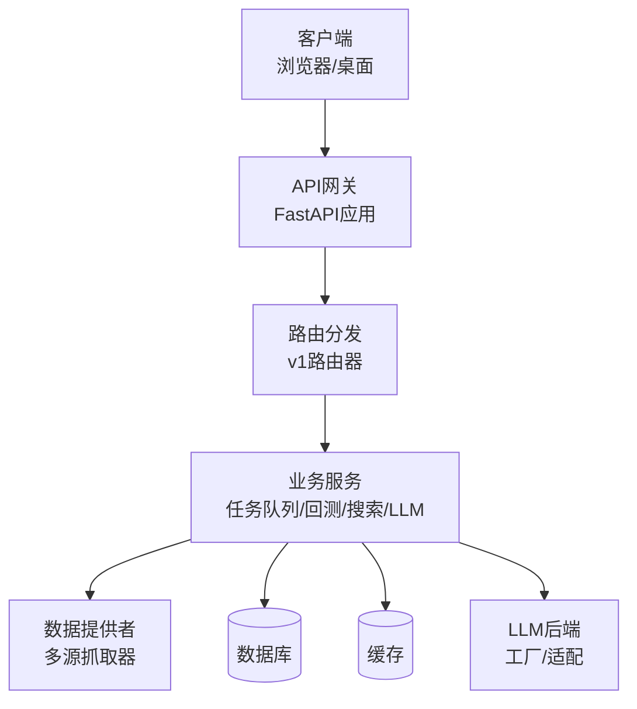
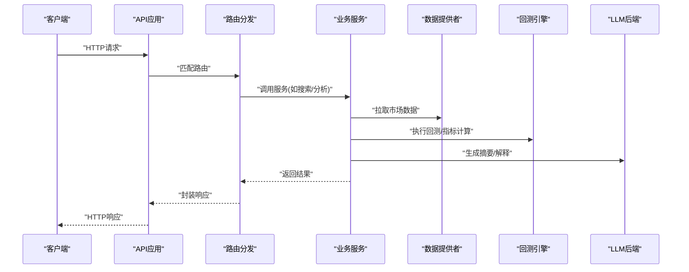
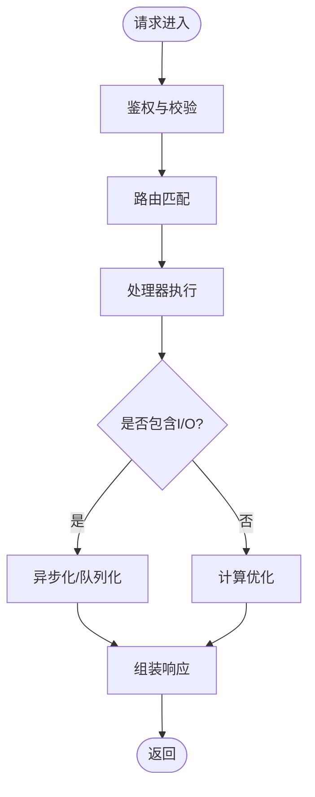
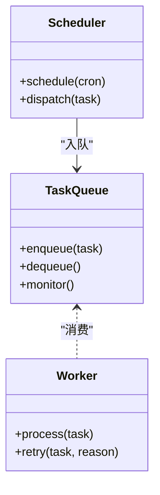
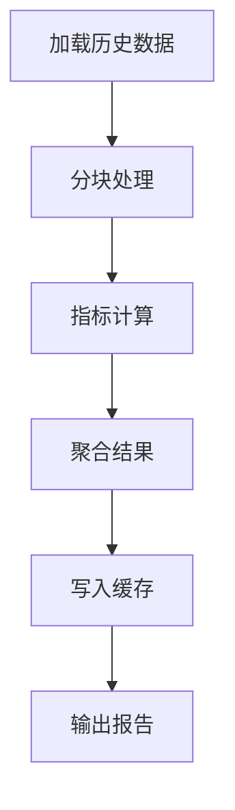
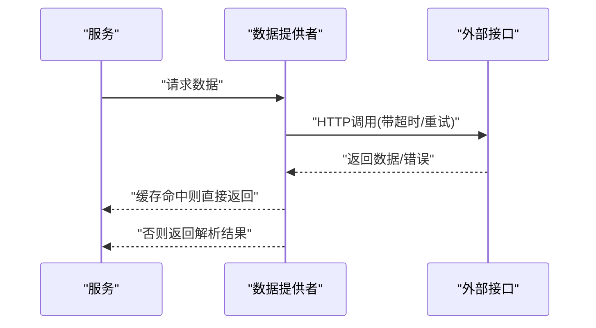
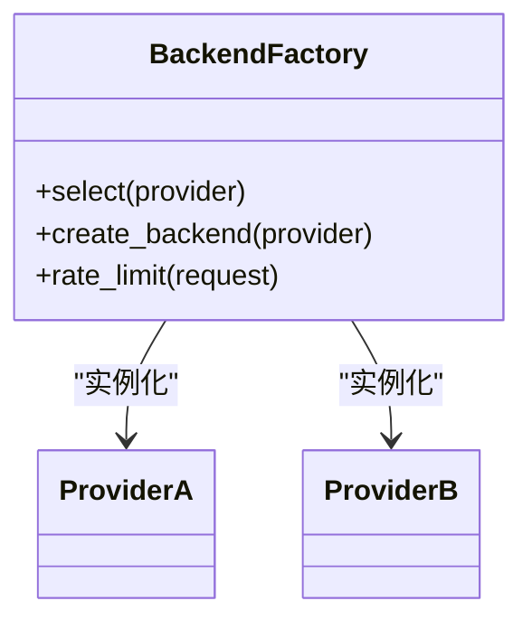
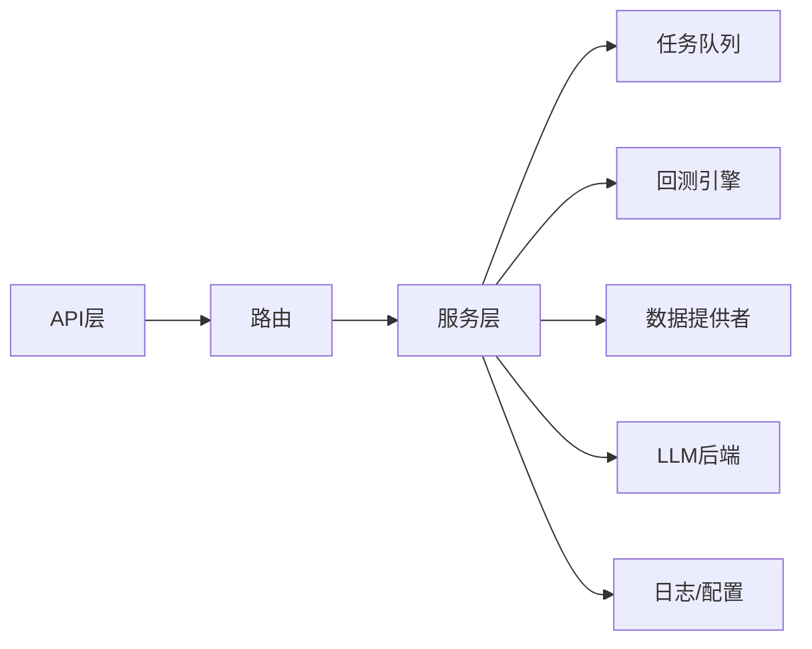

# 性能问题排查

<cite>
**本文引用的文件**   
- [main.py](file://main.py)
- [server.py](file://server.py)
- [api/app.py](file://api/app.py)
- [api/v1/router.py](file://api/v1/router.py)
- [src/services/task_queue.py](file://src/services/task_queue.py)
- [src/core/backtest_engine.py](file://src/core/backtest_engine.py)
- [data_provider/base.py](file://data_provider/base.py)
- [src/llm/backend_factory.py](file://src/llm/backend_factory.py)
- [src/logging_config.py](file://src/logging_config.py)
- [tests/test_search_performance.py](file://tests/test_search_performance.py)
</cite>

## 目录
1. [简介](#简介)
2. [项目结构](#项目结构)
3. [核心组件](#核心组件)
4. [架构总览](#架构总览)
5. [详细组件分析](#详细组件分析)
6. [依赖关系分析](#依赖关系分析)
7. [性能考量](#性能考量)
8. [故障排查指南](#故障排查指南)
9. [结论](#结论)
10. [附录](#附录)

## 简介
本指南面向性能问题定位与优化，覆盖CPU占用分析、内存使用监控、数据库查询优化、API响应时间测量等关键方法。结合代码库中的异步任务队列、回测引擎、数据获取器与LLM后端工厂等核心模块，给出常见瓶颈（数据库锁竞争、内存泄漏、网络I/O阻塞、异步任务积压）的诊断思路与优化策略，并配套基准测试构建与回归检测方案。

## 项目结构
本项目采用前后端分离与多服务协作的架构：
- API层：FastAPI应用与路由定义，承载HTTP请求入口与中间件处理
- 业务服务层：任务队列、回测引擎、搜索与LLM调用等
- 数据层：多种数据源抓取器与适配器
- 前端：Web与桌面客户端
- 工具与脚本：部署、测试、诊断脚本

**图表来源** 
- [api/app.py](file://api/app.py)
- [api/v1/router.py](file://api/v1/router.py)
- [src/services/task_queue.py](file://src/services/task_queue.py)
- [src/core/backtest_engine.py](file://src/core/backtest_engine.py)
- [data_provider/base.py](file://data_provider/base.py)
- [src/llm/backend_factory.py](file://src/llm/backend_factory.py)

**章节来源**
- [main.py](file://main.py)
- [server.py](file://server.py)
- [api/app.py](file://api/app.py)
- [api/v1/router.py](file://api/v1/router.py)

## 核心组件
- API应用与路由：统一入口、鉴权、错误处理、限流与日志埋点
- 任务队列：异步任务调度与执行，避免同步阻塞
- 回测引擎：计算密集型逻辑，需关注CPU与内存峰值
- 数据提供者：外部网络I/O密集，需关注超时、重试与并发控制
- LLM后端工厂：动态选择模型后端，需关注连接池与限流

**章节来源**
- [api/app.py](file://api/app.py)
- [api/v1/router.py](file://api/v1/router.py)
- [src/services/task_queue.py](file://src/services/task_queue.py)
- [src/core/backtest_engine.py](file://src/core/backtest_engine.py)
- [data_provider/base.py](file://data_provider/base.py)
- [src/llm/backend_factory.py](file://src/llm/backend_factory.py)

## 架构总览
下图展示一次典型API请求从进入FastAPI到业务处理、数据获取与返回的全链路流程，便于定位耗时热点。

**图表来源** 
- [api/app.py](file://api/app.py)
- [api/v1/router.py](file://api/v1/router.py)
- [src/services/task_queue.py](file://src/services/task_queue.py)
- [src/core/backtest_engine.py](file://src/core/backtest_engine.py)
- [data_provider/base.py](file://data_provider/base.py)
- [src/llm/backend_factory.py](file://src/llm/backend_factory.py)

## 详细组件分析

### API层性能剖析
- 目标：测量端到端响应时间，识别慢路由与中间件开销
- 方法：
  - 在应用层启用请求计时与结构化日志
  - 对关键路由添加延迟采样与错误率统计
  - 通过压测工具模拟高并发，观察吞吐与时延分布
- 常见问题：
  - 同步阻塞调用导致线程池耗尽
  - 未开启响应压缩或分页过大
  - 鉴权/校验逻辑重复计算

**图表来源** 
- [api/app.py](file://api/app.py)
- [api/v1/router.py](file://api/v1/router.py)

**章节来源**
- [api/app.py](file://api/app.py)
- [api/v1/router.py](file://api/v1/router.py)

### 任务队列与异步任务
- 目标：避免同步阻塞，提升吞吐与稳定性
- 方法：
  - 将耗时任务入队，消费者按容量消费
  - 设置合理的队列长度、重试策略与死信队列
  - 监控队列堆积与消费者健康状态
- 常见问题：
  - 队列无界导致内存膨胀
  - 消费者数量不足造成积压
  - 任务幂等性缺失引发重复处理

**图表来源** 
- [src/services/task_queue.py](file://src/services/task_queue.py)

**章节来源**
- [src/services/task_queue.py](file://src/services/task_queue.py)

### 回测引擎（CPU与内存热点）
- 目标：降低CPU峰值与内存占用，缩短回测时延
- 方法：
  - 向量化计算替代循环
  - 分块加载数据，减少内存峰值
  - 并行计算时注意GIL与进程间通信开销
- 常见问题：
  - 大对象未及时释放导致内存碎片
  - 频繁创建临时对象引发GC抖动
  - 未利用缓存导致重复计算

**图表来源** 
- [src/core/backtest_engine.py](file://src/core/backtest_engine.py)

**章节来源**
- [src/core/backtest_engine.py](file://src/core/backtest_engine.py)

### 数据提供者（网络I/O优化）
- 目标：提高数据拉取的稳定性与速度
- 方法：
  - 合理设置超时、重试与退避策略
  - 使用连接池与并发限制
  - 引入本地缓存与增量更新
- 常见问题：
  - 外部接口限流导致大量失败
  - 未捕获异常导致任务中断
  - 并发过高触发远端拒绝

**图表来源** 
- [data_provider/base.py](file://data_provider/base.py)

**章节来源**
- [data_provider/base.py](file://data_provider/base.py)

### LLM后端工厂（动态路由与限流）
- 目标：稳定调用多个LLM后端，避免单点过载
- 方法：
  - 基于配置动态选择后端
  - 实现令牌桶或漏桶限流
  - 记录调用链路与成本
- 常见问题：
  - 后端不可用未快速降级
  - 未做请求去重导致重复计费
  - 长文本输入未截断导致超时

**图表来源** 
- [src/llm/backend_factory.py](file://src/llm/backend_factory.py)

**章节来源**
- [src/llm/backend_factory.py](file://src/llm/backend_factory.py)

## 依赖关系分析
- API层依赖路由与服务层；服务层依赖数据提供者、回测引擎与LLM后端
- 任务队列作为横向能力被多服务复用
- 日志与配置贯穿全链路，影响可观测性与行为一致性

**图表来源** 
- [api/app.py](file://api/app.py)
- [api/v1/router.py](file://api/v1/router.py)
- [src/services/task_queue.py](file://src/services/task_queue.py)
- [src/core/backtest_engine.py](file://src/core/backtest_engine.py)
- [data_provider/base.py](file://data_provider/base.py)
- [src/llm/backend_factory.py](file://src/llm/backend_factory.py)
- [src/logging_config.py](file://src/logging_config.py)

**章节来源**
- [api/app.py](file://api/app.py)
- [api/v1/router.py](file://api/v1/router.py)
- [src/services/task_queue.py](file://src/services/task_queue.py)
- [src/core/backtest_engine.py](file://src/core/backtest_engine.py)
- [data_provider/base.py](file://data_provider/base.py)
- [src/llm/backend_factory.py](file://src/llm/backend_factory.py)
- [src/logging_config.py](file://src/logging_config.py)

## 性能考量
- CPU占用分析
  - 使用profiler采集热点函数与调用栈
  - 针对回测引擎与数据处理路径进行抽样与火焰图分析
  - 优化算法复杂度与数据结构选择
- 内存使用监控
  - 监控RSS、堆分配与GC频率
  - 定位大对象与未释放引用，避免循环引用
  - 使用分块与惰性加载降低峰值
- 数据库查询优化
  - 索引设计与查询计划审查
  - 批量操作与事务边界优化
  - 读写分离与缓存命中提升
- API响应时间测量
  - 端到端时延与分阶段耗时拆解
  - 压测场景覆盖峰值与突发流量
  - 限流与熔断保护下游

[本节为通用指导，不直接分析具体文件]

## 故障排查指南
- 常见瓶颈与定位
  - 数据库锁竞争：观察锁等待与事务时长，拆分长事务，减少写放大
  - 内存泄漏：追踪对象生命周期，检查闭包与全局变量持有
  - 网络I/O阻塞：增加超时与重试，调整并发度，启用连接池
  - 异步任务积压：扩容消费者，限制入队速率，完善死信队列
- 工具与实践
  - Profiler：cProfile/py-spy/性能剖析平台
  - 内存分析器：tracemalloc/memory_profiler/内存快照对比
  - APM：分布式链路追踪、指标与告警
  - 压测：wrk/k6/JMeter，构建基准用例与回归阈值
- 基准测试与回归检测
  - 建立稳定的基准集与度量指标（吞吐、P95/P99、错误率）
  - CI中自动运行基准，比较版本差异并告警
  - 对热点路径编写微基准，验证优化效果

**章节来源**
- [src/logging_config.py](file://src/logging_config.py)
- [tests/test_search_performance.py](file://tests/test_search_performance.py)

## 结论
通过系统化的性能分析方法与工具链，结合本项目的任务队列、回测引擎、数据提供者与LLM后端等关键组件，可有效定位并解决CPU、内存、I/O与队列积压等瓶颈。建议持续建设基准测试与APM体系，形成性能回归的自动化检测与预警机制，保障系统在增长负载下的稳定性与效率。

## 附录
- 常用命令与脚本
  - 启动服务与调试模式
  - 压测与基准脚本
  - 日志与指标导出
- 参考文档
  - 部署与运维手册
  - 数据源稳定性说明
  - 通知与告警配置

[本节为补充信息，不直接分析具体文件]