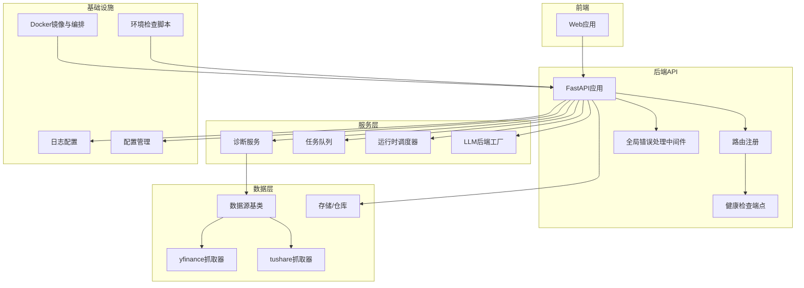
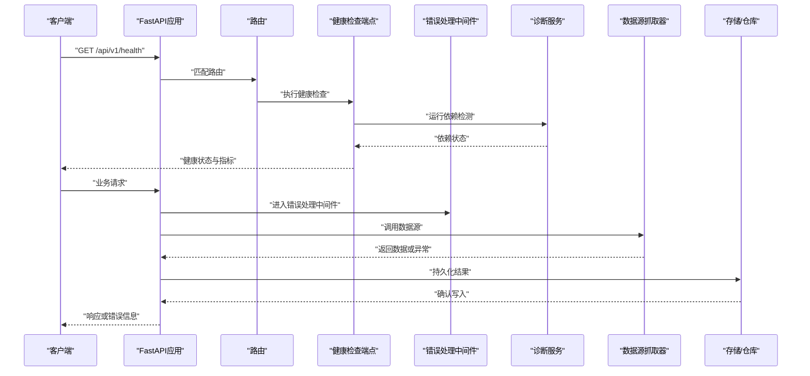
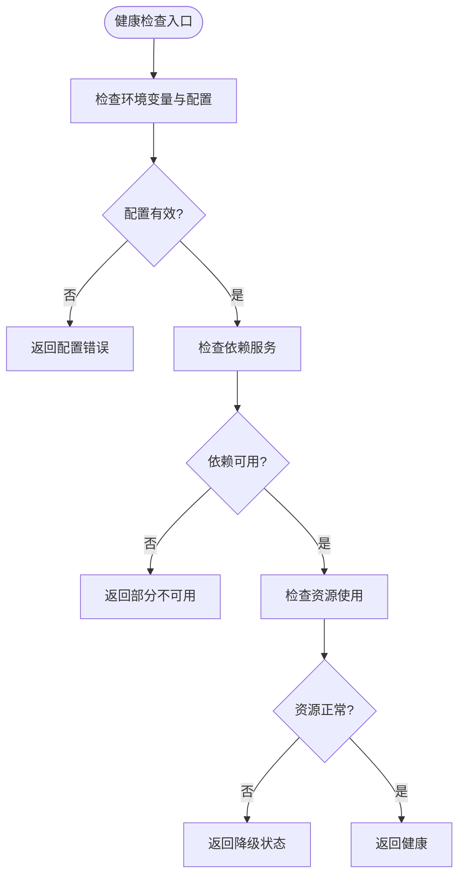
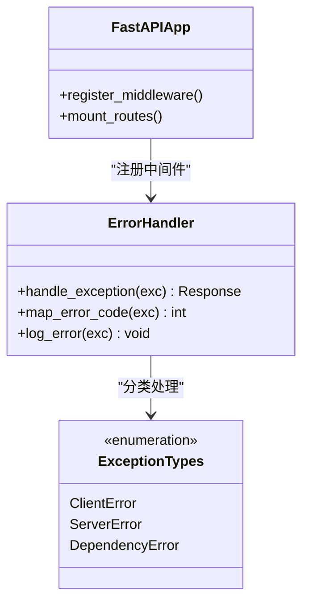
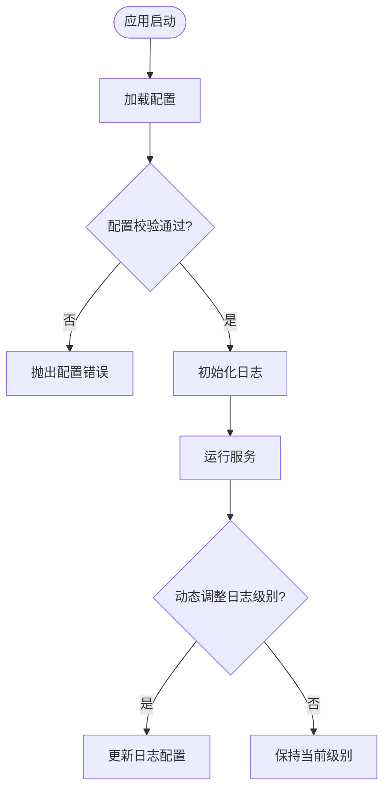
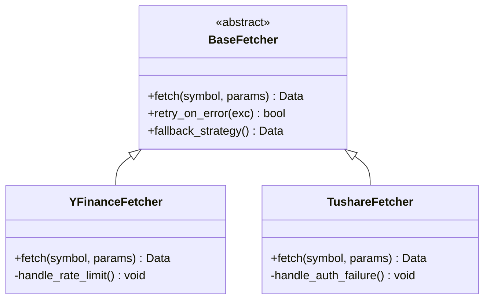
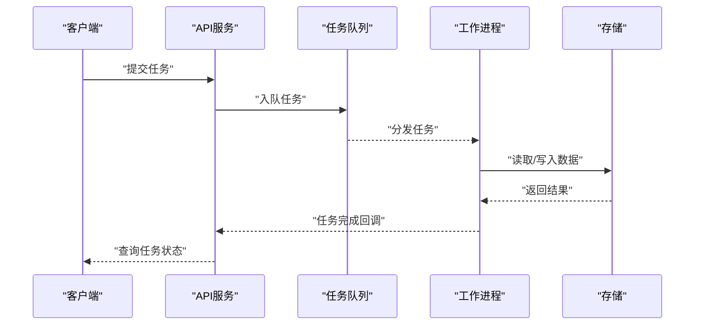
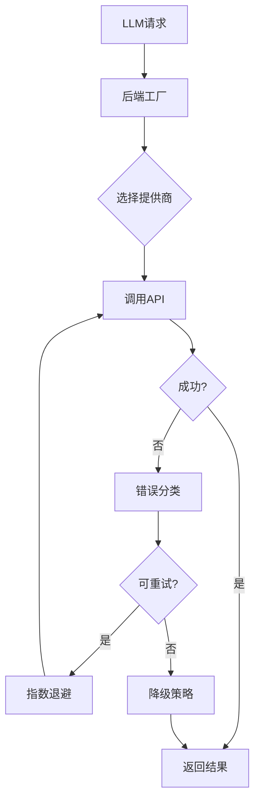
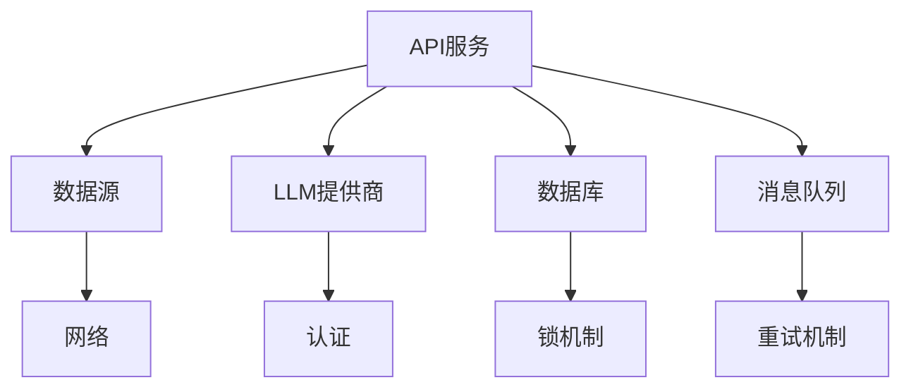

# 故障排除

<cite>
**本文引用的文件**   
- [main.py](file://main.py)
- [server.py](file://server.py)
- [api/app.py](file://api/app.py)
- [api/v1/router.py](file://api/v1/router.py)
- [api/v1/endpoints/health.py](file://api/v1/endpoints/health.py)
- [api/middlewares/error_handler.py](file://api/middlewares/error_handler.py)
- [src/logging_config.py](file://src/logging_config.py)
- [src/config.py](file://src/config.py)
- [src/services/run_diagnostics.py](file://src/services/run_diagnostics.py)
- [src/core/config_manager.py](file://src/core/config_manager.py)
- [src/core/config_registry.py](file://src/core/config_registry.py)
- [data_provider/base.py](file://data_provider/base.py)
- [data_provider/yfinance_fetcher.py](file://data_provider/yfinance_fetcher.py)
- [data_provider/tushare_fetcher.py](file://data_provider/tushare_fetcher.py)
- [src/services/task_queue.py](file://src/services/task_queue.py)
- [src/services/runtime_scheduler_service.py](file://src/services/runtime_scheduler_service.py)
- [src/llm/errors.py](file://src/llm/errors.py)
- [src/llm/backend_factory.py](file://src/llm/backend_factory.py)
- [src/repositories/alert_repo.py](file://src/repositories/alert_repo.py)
- [src/repositories/analysis_repo.py](file://src/repositories/analysis_repo.py)
- [src/storage.py](file://src/storage.py)
- [docker/Dockerfile](file://docker/Dockerfile)
- [docker/docker-compose.yml](file://docker/docker-compose.yml)
- [scripts/check_env.py](file://scripts/check_env.py)
</cite>

## 目录
1. [简介](#简介)
2. [项目结构](#项目结构)
3. [核心组件](#核心组件)
4. [架构总览](#架构总览)
5. [详细组件分析](#详细组件分析)
6. [依赖关系分析](#依赖关系分析)
7. [性能注意事项](#性能注意事项)
8. [故障排查指南](#故障排查指南)
9. [结论](#结论)
10. [附录](#附录)

## 简介
本故障排除文档面向Daily Stock Analysis系统的运维与研发人员，聚焦于环境问题、配置错误、网络连接与数据同步等常见问题的诊断方法；提供日志分析与调试技巧（含日志级别配置、关键日志定位与性能瓶颈分析）；说明系统健康检查方法（服务状态监控、依赖服务检测与自动修复机制）；给出性能问题排查步骤（CPU占用、内存泄漏、数据库锁与API响应时间分析）；阐述错误处理与异常恢复策略（重试、降级与熔断保护）；并包含应急流程（服务重启、数据修复与业务回滚）。

## 项目结构
Daily Stock Analysis采用前后端分离与多模块后端架构：
- API层：基于FastAPI的REST接口与健康检查端点
- 服务层：任务队列、调度器、诊断工具、LLM适配器等
- 数据层：多种数据源抓取器（yfinance、tushare等）、存储与仓库
- 基础设施：Docker化部署、环境变量校验脚本、日志与配置管理

图表来源
- [api/app.py:1-200](file://api/app.py#L1-L200)
- [api/v1/router.py:1-200](file://api/v1/router.py#L1-L200)
- [api/v1/endpoints/health.py:1-200](file://api/v1/endpoints/health.py#L1-L200)
- [api/middlewares/error_handler.py:1-200](file://api/middlewares/error_handler.py#L1-L200)
- [src/services/run_diagnostics.py:1-200](file://src/services/run_diagnostics.py#L1-L200)
- [src/services/task_queue.py:1-200](file://src/services/task_queue.py#L1-L200)
- [src/services/runtime_scheduler_service.py:1-200](file://src/services/runtime_scheduler_service.py#L1-L200)
- [src/llm/backend_factory.py:1-200](file://src/llm/backend_factory.py#L1-L200)
- [data_provider/base.py:1-200](file://data_provider/base.py#L1-L200)
- [data_provider/yfinance_fetcher.py:1-200](file://data_provider/yfinance_fetcher.py#L1-L200)
- [data_provider/tushare_fetcher.py:1-200](file://data_provider/tushare_fetcher.py#L1-L200)
- [src/storage.py:1-200](file://src/storage.py#L1-L200)
- [docker/Dockerfile:1-200](file://docker/Dockerfile#L1-L200)
- [docker/docker-compose.yml:1-200](file://docker/docker-compose.yml#L1-L200)
- [scripts/check_env.py:1-200](file://scripts/check_env.py#L1-L200)
- [src/logging_config.py:1-200](file://src/logging_config.py#L1-L200)
- [src/core/config_manager.py:1-200](file://src/core/config_manager.py#L1-L200)

章节来源
- [main.py:1-200](file://main.py#L1-L200)
- [server.py:1-200](file://server.py#L1-L200)
- [api/app.py:1-200](file://api/app.py#L1-L200)
- [api/v1/router.py:1-200](file://api/v1/router.py#L1-L200)
- [api/v1/endpoints/health.py:1-200](file://api/v1/endpoints/health.py#L1-L200)
- [api/middlewares/error_handler.py:1-200](file://api/middlewares/error_handler.py#L1-L200)
- [src/logging_config.py:1-200](file://src/logging_config.py#L1-L200)
- [src/config.py:1-200](file://src/config.py#L1-L200)
- [src/services/run_diagnostics.py:1-200](file://src/services/run_diagnostics.py#L1-L200)
- [src/core/config_manager.py:1-200](file://src/core/config_manager.py#L1-L200)
- [src/core/config_registry.py:1-200](file://src/core/config_registry.py#L1-L200)
- [data_provider/base.py:1-200](file://data_provider/base.py#L1-L200)
- [data_provider/yfinance_fetcher.py:1-200](file://data_provider/yfinance_fetcher.py#L1-L200)
- [data_provider/tushare_fetcher.py:1-200](file://data_provider/tushare_fetcher.py#L1-L200)
- [src/services/task_queue.py:1-200](file://src/services/task_queue.py#L1-L200)
- [src/services/runtime_scheduler_service.py:1-200](file://src/services/runtime_scheduler_service.py#L1-L200)
- [src/llm/errors.py:1-200](file://src/llm/errors.py#L1-L200)
- [src/llm/backend_factory.py:1-200](file://src/llm/backend_factory.py#L1-L200)
- [src/repositories/alert_repo.py:1-200](file://src/repositories/alert_repo.py#L1-L200)
- [src/repositories/analysis_repo.py:1-200](file://src/repositories/analysis_repo.py#L1-L200)
- [src/storage.py:1-200](file://src/storage.py#L1-L200)
- [docker/Dockerfile:1-200](file://docker/Dockerfile#L1-L200)
- [docker/docker-compose.yml:1-200](file://docker/docker-compose.yml#L1-L200)
- [scripts/check_env.py:1-200](file://scripts/check_env.py#L1-L200)

## 核心组件
- API与应用入口：FastAPI应用初始化、路由挂载、中间件注册
- 健康检查：服务存活、依赖可达性、资源使用概览
- 错误处理：统一异常捕获、错误码映射、用户友好提示
- 日志与配置：结构化日志、动态日志级别、配置加载与校验
- 数据源与抓取：多数据源抽象、失败重试与降级、缓存策略
- 任务与调度：后台任务队列、定时任务、失败重试与告警
- LLM集成：后端工厂、错误分类、限流与熔断
- 存储与仓库：持久化访问、事务与锁、一致性保障

章节来源
- [api/app.py:1-200](file://api/app.py#L1-L200)
- [api/v1/endpoints/health.py:1-200](file://api/v1/endpoints/health.py#L1-L200)
- [api/middlewares/error_handler.py:1-200](file://api/middlewares/error_handler.py#L1-L200)
- [src/logging_config.py:1-200](file://src/logging_config.py#L1-L200)
- [src/config.py:1-200](file://src/config.py#L1-L200)
- [data_provider/base.py:1-200](file://data_provider/base.py#L1-L200)
- [src/services/task_queue.py:1-200](file://src/services/task_queue.py#L1-L200)
- [src/services/runtime_scheduler_service.py:1-200](file://src/services/runtime_scheduler_service.py#L1-L200)
- [src/llm/backend_factory.py:1-200](file://src/llm/backend_factory.py#L1-L200)
- [src/storage.py:1-200](file://src/storage.py#L1-L200)

## 架构总览
下图展示请求从前端到后端API、服务层、数据源的调用路径，以及健康检查与错误处理的介入点。

图表来源
- [api/app.py:1-200](file://api/app.py#L1-L200)
- [api/v1/router.py:1-200](file://api/v1/router.py#L1-L200)
- [api/v1/endpoints/health.py:1-200](file://api/v1/endpoints/health.py#L1-L200)
- [api/middlewares/error_handler.py:1-200](file://api/middlewares/error_handler.py#L1-L200)
- [src/services/run_diagnostics.py:1-200](file://src/services/run_diagnostics.py#L1-L200)
- [data_provider/base.py:1-200](file://data_provider/base.py#L1-L200)
- [src/storage.py:1-200](file://src/storage.py#L1-L200)

## 详细组件分析

### 健康检查与依赖检测
- 健康检查端点暴露服务存活与依赖可达性，支持快速定位网络、数据库、外部API等问题
- 诊断服务聚合多项检查项，包括配置有效性、环境变量、磁盘空间、端口占用等
- 建议将健康检查纳入容器编排探针（liveness/readiness），实现自动重启与流量摘除

图表来源
- [api/v1/endpoints/health.py:1-200](file://api/v1/endpoints/health.py#L1-L200)
- [src/services/run_diagnostics.py:1-200](file://src/services/run_diagnostics.py#L1-L200)

章节来源
- [api/v1/endpoints/health.py:1-200](file://api/v1/endpoints/health.py#L1-L200)
- [src/services/run_diagnostics.py:1-200](file://src/services/run_diagnostics.py#L1-L200)

### 错误处理与中间件
- 全局错误处理中间件统一捕获异常，转换为标准错误响应，避免堆栈泄露
- 错误分类区分客户端错误、服务端错误与第三方依赖错误，便于监控与告警
- 建议在关键路径增加重试与熔断逻辑，提升鲁棒性

图表来源
- [api/middlewares/error_handler.py:1-200](file://api/middlewares/error_handler.py#L1-L200)
- [api/app.py:1-200](file://api/app.py#L1-L200)

章节来源
- [api/middlewares/error_handler.py:1-200](file://api/middlewares/error_handler.py#L1-L200)
- [api/app.py:1-200](file://api/app.py#L1-L200)

### 日志与配置管理
- 日志配置支持动态级别调整，便于生产环境调优与问题定位
- 配置管理集中加载、校验与热更新，确保运行时一致性
- 建议对关键操作输出结构化日志，包含请求ID、耗时与上下文

图表来源
- [src/logging_config.py:1-200](file://src/logging_config.py#L1-L200)
- [src/core/config_manager.py:1-200](file://src/core/config_manager.py#L1-L200)
- [src/core/config_registry.py:1-200](file://src/core/config_registry.py#L1-L200)

章节来源
- [src/logging_config.py:1-200](file://src/logging_config.py#L1-L200)
- [src/config.py:1-200](file://src/config.py#L1-L200)
- [src/core/config_manager.py:1-200](file://src/core/config_manager.py#L1-L200)
- [src/core/config_registry.py:1-200](file://src/core/config_registry.py#L1-L200)

### 数据源抓取与容错
- 数据源基类定义统一接口，各抓取器实现具体逻辑
- 针对网络超时、限流与数据不一致，实现重试、退避与降级策略
- 建议对关键数据源增加缓存与校验，减少重复请求与错误传播

图表来源
- [data_provider/base.py:1-200](file://data_provider/base.py#L1-L200)
- [data_provider/yfinance_fetcher.py:1-200](file://data_provider/yfinance_fetcher.py#L1-L200)
- [data_provider/tushare_fetcher.py:1-200](file://data_provider/tushare_fetcher.py#L1-L200)

章节来源
- [data_provider/base.py:1-200](file://data_provider/base.py#L1-L200)
- [data_provider/yfinance_fetcher.py:1-200](file://data_provider/yfinance_fetcher.py#L1-L200)
- [data_provider/tushare_fetcher.py:1-200](file://data_provider/tushare_fetcher.py#L1-L200)

### 任务队列与调度
- 任务队列负责异步处理耗时任务，支持优先级与重试
- 运行时调度器管理定时任务，如每日市场回顾、数据刷新等
- 建议监控队列积压与任务失败率，及时扩容与告警

图表来源
- [src/services/task_queue.py:1-200](file://src/services/task_queue.py#L1-L200)
- [src/services/runtime_scheduler_service.py:1-200](file://src/services/runtime_scheduler_service.py#L1-L200)
- [src/storage.py:1-200](file://src/storage.py#L1-L200)

章节来源
- [src/services/task_queue.py:1-200](file://src/services/task_queue.py#L1-L200)
- [src/services/runtime_scheduler_service.py:1-200](file://src/services/runtime_scheduler_service.py#L1-L200)

### LLM后端集成与错误处理
- LLM后端工厂根据配置选择不同提供商，支持热切换
- 错误分类区分认证失败、限流、超时与服务不可用
- 建议实现熔断与降级，避免级联故障

图表来源
- [src/llm/backend_factory.py:1-200](file://src/llm/backend_factory.py#L1-L200)
- [src/llm/errors.py:1-200](file://src/llm/errors.py#L1-L200)

章节来源
- [src/llm/backend_factory.py:1-200](file://src/llm/backend_factory.py#L1-L200)
- [src/llm/errors.py:1-200](file://src/llm/errors.py#L1-L200)

## 依赖关系分析
系统依赖包括外部数据源、LLM提供商、存储系统与消息队列。依赖健康直接影响服务可用性。

图表来源
- [data_provider/base.py:1-200](file://data_provider/base.py#L1-L200)
- [src/llm/backend_factory.py:1-200](file://src/llm/backend_factory.py#L1-L200)
- [src/storage.py:1-200](file://src/storage.py#L1-L200)
- [src/services/task_queue.py:1-200](file://src/services/task_queue.py#L1-L200)

章节来源
- [data_provider/base.py:1-200](file://data_provider/base.py#L1-L200)
- [src/llm/backend_factory.py:1-200](file://src/llm/backend_factory.py#L1-L200)
- [src/storage.py:1-200](file://src/storage.py#L1-L200)
- [src/services/task_queue.py:1-200](file://src/services/task_queue.py#L1-L200)

## 性能注意事项
- CPU占用：监控长耗时任务与复杂计算，考虑异步化与并行优化
- 内存泄漏：定期采样堆快照，关注对象生命周期与缓存清理
- 数据库锁：分析慢查询与锁等待，优化索引与事务范围
- API响应时间：追踪端到端延迟，识别瓶颈环节并优化

[本节为通用指导，不直接分析具体文件]

## 故障排查指南

### 环境问题诊断
- 检查环境变量与配置文件是否完整、格式正确
- 使用环境检查脚本验证依赖库版本与路径
- 在容器环境中确认镜像构建参数与卷挂载

章节来源
- [scripts/check_env.py:1-200](file://scripts/check_env.py#L1-L200)
- [docker/Dockerfile:1-200](file://docker/Dockerfile#L1-L200)
- [docker/docker-compose.yml:1-200](file://docker/docker-compose.yml#L1-L200)

### 配置错误定位
- 查看配置加载日志，确认默认值与覆盖顺序
- 校验必填字段与类型约束，捕获解析异常
- 动态调整配置后验证生效状态

章节来源
- [src/core/config_manager.py:1-200](file://src/core/config_manager.py#L1-L200)
- [src/core/config_registry.py:1-200](file://src/core/config_registry.py#L1-L200)
- [src/config.py:1-200](file://src/config.py#L1-L200)

### 网络连接与数据同步问题
- 检查外部API可达性与认证状态
- 分析抓取器重试与退避策略是否合理
- 对比数据一致性与缓存失效策略

章节来源
- [data_provider/base.py:1-200](file://data_provider/base.py#L1-L200)
- [data_provider/yfinance_fetcher.py:1-200](file://data_provider/yfinance_fetcher.py#L1-L200)
- [data_provider/tushare_fetcher.py:1-200](file://data_provider/tushare_fetcher.py#L1-L200)

### 日志分析与调试技巧
- 设置合适的日志级别，生产环境建议INFO/WARNING
- 定位关键日志：请求入口、异常抛出、外部调用、数据库操作
- 使用结构化日志关联请求链路，便于追踪

章节来源
- [src/logging_config.py:1-200](file://src/logging_config.py#L1-L200)
- [api/middlewares/error_handler.py:1-200](file://api/middlewares/error_handler.py#L1-L200)

### 系统健康检查方法
- 定期调用健康检查端点，监控服务状态
- 集成依赖检测，识别外部服务异常
- 结合容器编排实现自动重启与流量隔离

章节来源
- [api/v1/endpoints/health.py:1-200](file://api/v1/endpoints/health.py#L1-L200)
- [src/services/run_diagnostics.py:1-200](file://src/services/run_diagnostics.py#L1-L200)

### 性能问题排查步骤
- 使用性能剖析工具定位热点函数
- 监控内存使用趋势，发现潜在泄漏
- 分析数据库慢查询与锁竞争
- 追踪API响应时间分布，识别瓶颈

[本节为通用指导，不直接分析具体文件]

### 错误处理与异常恢复策略
- 实现重试机制，针对瞬态错误进行指数退避
- 设计降级策略，保证核心功能可用
- 引入熔断保护，防止级联故障

章节来源
- [api/middlewares/error_handler.py:1-200](file://api/middlewares/error_handler.py#L1-L200)
- [src/llm/errors.py:1-200](file://src/llm/errors.py#L1-L200)
- [src/services/task_queue.py:1-200](file://src/services/task_queue.py#L1-L200)

### 故障恢复应急流程
- 服务重启：通过编排平台滚动重启实例
- 数据修复：执行数据校验与修复脚本
- 业务回滚：切换到稳定版本并恢复配置

章节来源
- [docker/docker-compose.yml:1-200](file://docker/docker-compose.yml#L1-L200)
- [scripts/check_env.py:1-200](file://scripts/check_env.py#L1-L200)

## 结论
Daily Stock Analysis系统具备完善的健康检查、错误处理与日志配置能力。通过系统化故障排查方法，可有效定位环境问题、配置错误、网络连接与数据同步问题。建议持续监控关键指标，完善自动化修复机制，提升系统稳定性与可维护性。

[本节为总结性内容，不直接分析具体文件]

## 附录
- 常用命令：查看日志、重启服务、检查环境
- 监控指标：健康状态、错误率、响应时间、资源使用
- 告警规则：依赖不可用、配置错误、任务失败率过高

[本节为补充信息，不直接分析具体文件]