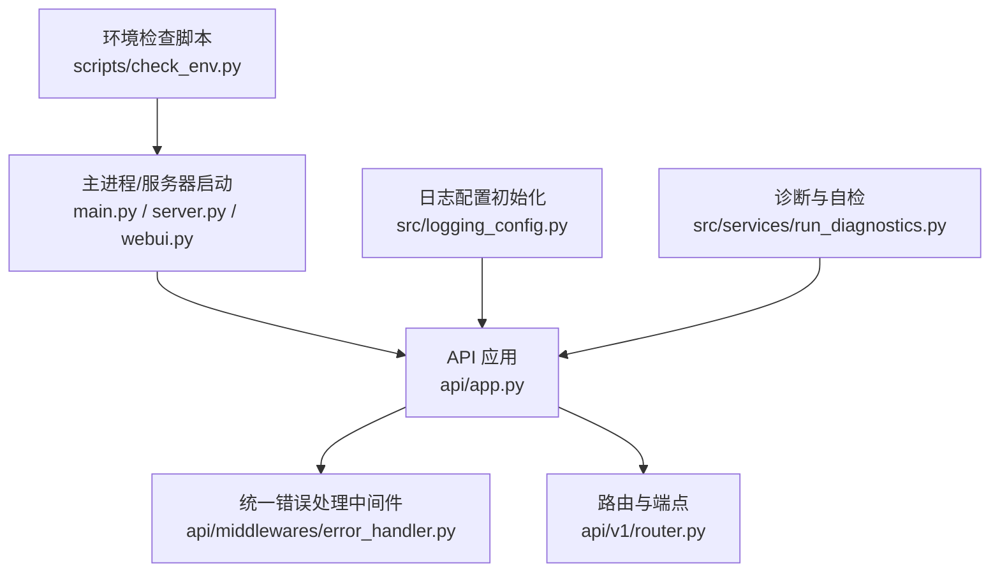
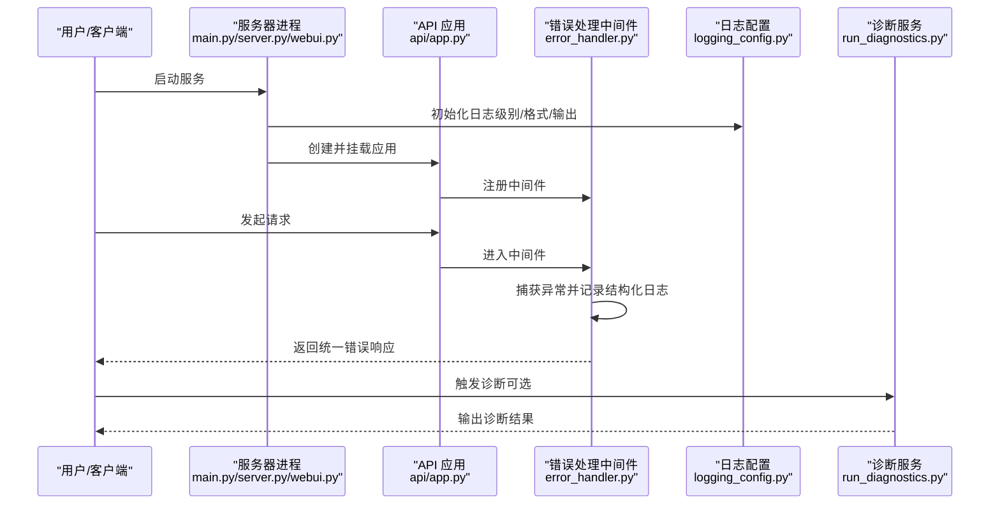
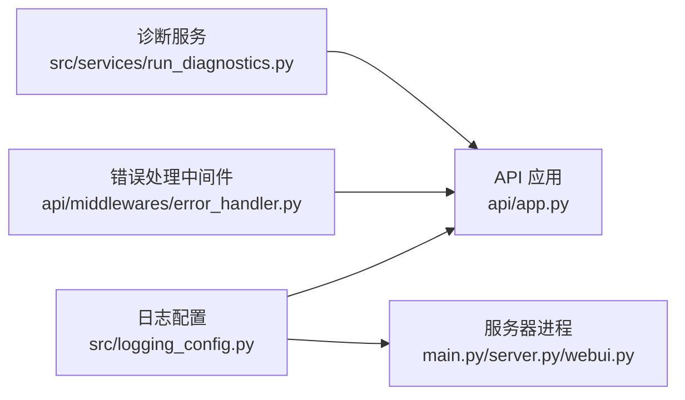

# 日志分析与调试

<cite>
**本文档引用的文件**   
- [logging_config.py](file://src/logging_config.py)
- [api/app.py](file://api/app.py)
- [api/middlewares/error_handler.py](file://api/middlewares/error_handler.py)
- [main.py](file://main.py)
- [server.py](file://server.py)
- [webui.py](file://webui.py)
- [src/services/run_diagnostics.py](file://src/services/run_diagnostics.py)
- [tests/test_logging_config.py](file://tests/test_logging_config.py)
- [tests/test_fetcher_logging.py](file://tests/test_fetcher_logging.py)
- [scripts/check_env.py](file://scripts/check_env.py)
</cite>

## 目录
1. [简介](#简介)
2. [项目结构](#项目结构)
3. [核心组件](#核心组件)
4. [架构总览](#架构总览)
5. [详细组件分析](#详细组件分析)
6. [依赖关系分析](#依赖关系分析)
7. [性能考虑](#性能考虑)
8. [故障排查指南](#故障排查指南)
9. [结论](#结论)
10. [附录](#附录)

## 简介
本指南聚焦于项目的日志系统与调试能力，覆盖日志级别配置、格式化规则与输出目标；说明如何定位错误堆栈、性能指标与业务流程追踪；并提供启用详细日志、使用断点、分析调用链与监控实时日志流的实践技巧。同时总结常见错误模式与快速定位方法，帮助开发者高效排障。

## 项目结构
本项目采用分层与模块化组织：
- API 层：FastAPI 应用入口、路由与中间件（含统一错误处理）
- 业务服务层：各领域服务与工具
- 基础设施：日志配置、诊断脚本、环境检查
- 测试：针对日志与网络请求的稳定性与行为验证

图表来源
- [api/app.py](file://api/app.py)
- [api/middlewares/error_handler.py](file://api/middlewares/error_handler.py)
- [main.py](file://main.py)
- [server.py](file://server.py)
- [webui.py](file://webui.py)
- [src/logging_config.py](file://src/logging_config.py)
- [src/services/run_diagnostics.py](file://src/services/run_diagnostics.py)
- [scripts/check_env.py](file://scripts/check_env.py)

章节来源
- [api/app.py](file://api/app.py)
- [src/logging_config.py](file://src/logging_config.py)
- [main.py](file://main.py)

## 核心组件
- 日志配置模块：集中管理日志级别、格式、输出目标（控制台/文件），支持按模块或全局开关调整
- API 错误处理中间件：捕获异常、记录结构化错误信息、返回统一响应
- 应用入口与服务器：在启动阶段初始化日志与诊断能力，确保运行期可观测性
- 诊断与自检：提供运行时健康检查与问题定位辅助

章节来源
- [src/logging_config.py](file://src/logging_config.py)
- [api/middlewares/error_handler.py](file://api/middlewares/error_handler.py)
- [main.py](file://main.py)
- [server.py](file://server.py)
- [webui.py](file://webui.py)

## 架构总览
日志系统与应用流程的关键交互如下：

图表来源
- [main.py](file://main.py)
- [server.py](file://server.py)
- [webui.py](file://webui.py)
- [api/app.py](file://api/app.py)
- [api/middlewares/error_handler.py](file://api/middlewares/error_handler.py)
- [src/logging_config.py](file://src/logging_config.py)
- [src/services/run_diagnostics.py](file://src/services/run_diagnostics.py)

## 详细组件分析

### 日志配置模块（级别、格式、输出目标）
- 功能要点
  - 设置全局与模块级日志级别，便于按需开启详细日志
  - 定义统一的日志格式（时间戳、级别、模块名、消息等）
  - 配置输出目标（控制台、文件），支持滚动或固定大小策略
  - 提供环境变量或配置文件驱动的能力，便于不同环境切换
- 关键实现位置
  - 日志初始化与配置入口
  - 格式器与处理器绑定
  - 按模块过滤与采样策略（如高频 I/O）

章节来源
- [src/logging_config.py](file://src/logging_config.py)
- [tests/test_logging_config.py](file://tests/test_logging_config.py)

### API 错误处理中间件（统一错误捕获与结构化日志）
- 功能要点
  - 捕获未处理异常，避免进程崩溃
  - 记录结构化错误信息（请求 ID、路径、参数摘要、堆栈）
  - 返回统一错误响应体，便于前端与监控系统消费
- 关键实现位置
  - 中间件注册与执行顺序
  - 异常分类与日志级别映射
  - 敏感字段脱敏与日志裁剪

章节来源
- [api/middlewares/error_handler.py](file://api/middlewares/error_handler.py)
- [api/app.py](file://api/app.py)

### 应用入口与服务器（启动时初始化日志与诊断）
- 功能要点
  - 启动阶段加载日志配置，确保所有子模块继承统一设置
  - 暴露健康检查与诊断接口，便于外部监控
  - 根据运行模式（开发/生产）调整日志级别与输出
- 关键实现位置
  - 主进程入口与服务器启动
  - 应用生命周期钩子（启动/关闭）

章节来源
- [main.py](file://main.py)
- [server.py](file://server.py)
- [webui.py](file://webui.py)

### 诊断与自检（运行时问题定位）
- 功能要点
  - 收集运行时状态（依赖可用性、配置有效性、资源占用）
  - 输出可读的诊断报告，辅助快速定位问题
  - 与日志系统集成，将诊断过程也纳入日志流
- 关键实现位置
  - 诊断任务编排与执行
  - 诊断结果的结构化输出

章节来源
- [src/services/run_diagnostics.py](file://src/services/run_diagnostics.py)

## 依赖关系分析
- 日志配置被 API 应用与服务器进程共同依赖，保证一致的观测性
- 错误处理中间件依赖日志配置，用于输出结构化错误
- 诊断服务独立于业务逻辑，通过 API 或命令行触发，输出到日志或标准输出

图表来源
- [src/logging_config.py](file://src/logging_config.py)
- [api/app.py](file://api/app.py)
- [api/middlewares/error_handler.py](file://api/middlewares/error_handler.py)
- [main.py](file://main.py)
- [server.py](file://server.py)
- [webui.py](file://webui.py)
- [src/services/run_diagnostics.py](file://src/services/run_diagnostics.py)

章节来源
- [src/logging_config.py](file://src/logging_config.py)
- [api/app.py](file://api/app.py)
- [api/middlewares/error_handler.py](file://api/middlewares/error_handler.py)
- [src/services/run_diagnostics.py](file://src/services/run_diagnostics.py)

## 性能考虑
- 日志级别控制：在生产环境默认 INFO/WARNING，仅在定位问题时临时提升为 DEBUG
- 输出目标优化：I/O 密集场景优先写入文件并启用异步或缓冲，减少阻塞
- 结构化日志：避免拼接大对象，仅记录必要字段，降低序列化开销
- 采样与限流：对高频事件（如心跳、轮询）进行采样，防止日志风暴
- 监控集成：将关键指标（延迟、错误率、吞吐）以结构化形式输出，便于采集

[本节为通用指导，不直接分析具体文件]

## 故障排查指南

### 如何定位关键日志信息
- 错误堆栈跟踪
  - 关注 ERROR 级别日志中的完整堆栈，结合请求 ID 与路径定位
  - 使用中间件输出的结构化错误字段（异常类型、参数摘要、调用上下文）
- 性能指标
  - 查找耗时较长的操作日志（如数据拉取、模型推理、数据库查询）
  - 关注超时、重试、降级相关日志，识别瓶颈与不稳定因素
- 业务流程追踪
  - 使用请求 ID 贯穿链路，串联多个模块的日志片段
  - 关注关键节点的状态变更与决策点（如策略选择、信号生成）

章节来源
- [api/middlewares/error_handler.py](file://api/middlewares/error_handler.py)
- [src/logging_config.py](file://src/logging_config.py)

### 调试技巧
- 启用详细日志
  - 通过环境变量或配置项将特定模块级别调整为 DEBUG
  - 在本地复现时临时开启全量日志，线上谨慎使用
- 使用调试器断点
  - 在关键函数入口与异常分支设置断点，观察变量与调用栈
  - 结合结构化日志输出，缩小问题范围
- 分析调用链路
  - 基于请求 ID 聚合多模块日志，还原端到端流程
  - 利用诊断服务输出，确认依赖与配置状态
- 监控实时日志流
  - 使用日志采集工具（如 tail、grep、ELK）实时观察
  - 对高频日志进行过滤与告警，避免噪声干扰

章节来源
- [tests/test_logging_config.py](file://tests/test_logging_config.py)
- [tests/test_fetcher_logging.py](file://tests/test_fetcher_logging.py)
- [scripts/check_env.py](file://scripts/check_env.py)

### 常见错误模式与快速定位
- 网络请求失败
  - 现象：超时、连接拒绝、HTTP 错误码
  - 定位：查看数据源拉取日志、重试次数、代理与证书配置
  - 参考：网络请求与日志稳定性测试
- 配置缺失或无效
  - 现象：启动失败、运行时校验错误
  - 定位：运行环境检查脚本，核对必填项与格式
- 并发与线程安全
  - 现象：偶发崩溃、数据竞争
  - 定位：关注锁与队列相关日志，检查临界区代码
- 资源耗尽
  - 现象：内存/CPU 飙升、文件句柄不足
  - 定位：结合系统监控与日志中的资源使用提示

章节来源
- [tests/test_fetcher_logging.py](file://tests/test_fetcher_logging.py)
- [scripts/check_env.py](file://scripts/check_env.py)

## 结论
通过统一的日志配置、结构化错误处理与诊断能力，项目具备良好的可观测性与可维护性。建议在生产环境保持合理的日志级别与输出策略，在定位问题时灵活提升详细度，并结合诊断工具与监控体系，形成闭环的排障流程。

## 附录
- 常用命令与环境变量
  - 调整日志级别：通过环境变量或配置文件修改模块级别
  - 切换输出目标：控制台/文件，必要时启用滚动策略
  - 触发诊断：调用诊断接口或运行诊断脚本
- 最佳实践
  - 始终记录请求 ID 与关键上下文
  - 避免记录敏感信息，进行脱敏与裁剪
  - 对高频日志进行采样与限流

[本节为补充信息，不直接分析具体文件]