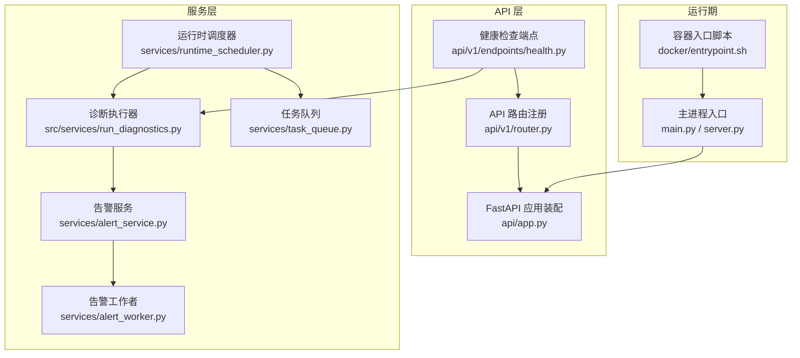
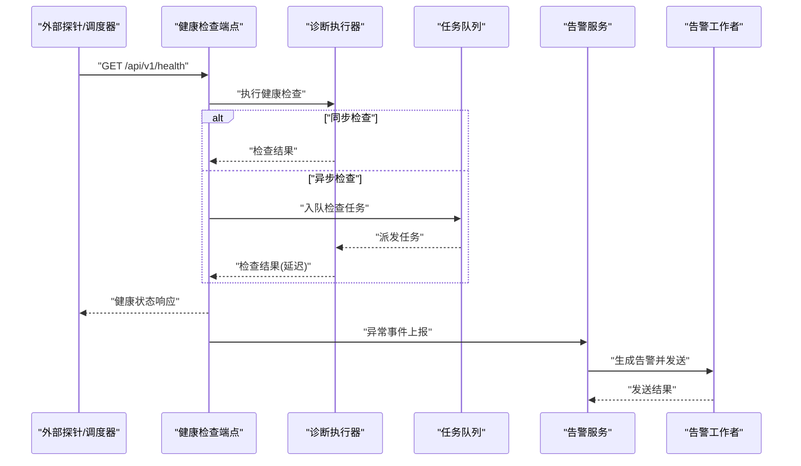
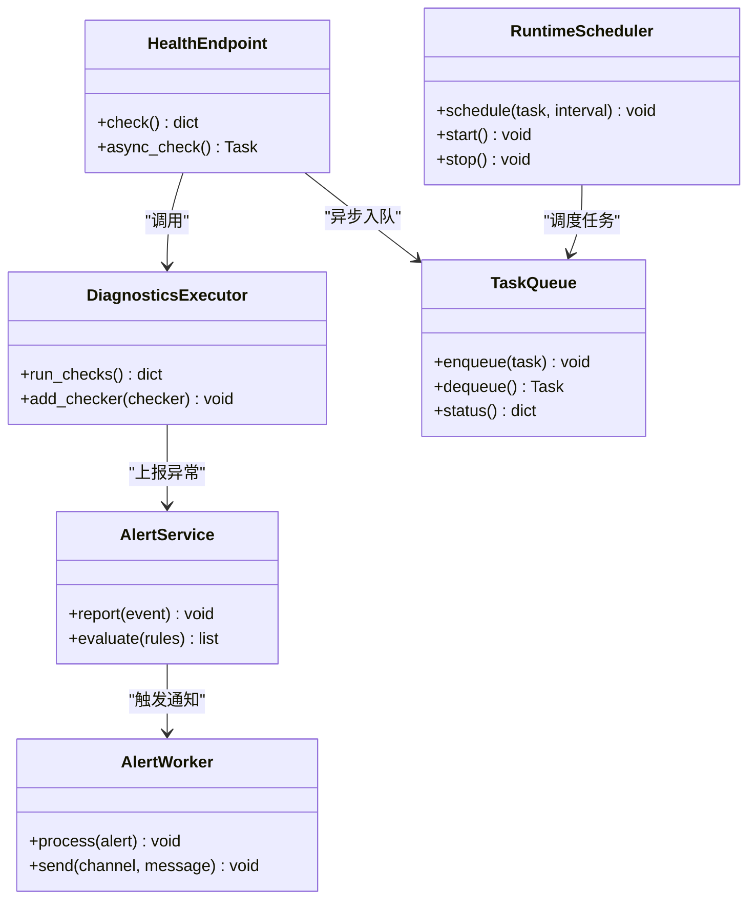

# 系统健康检查

<cite>
**本文引用的文件**   
- [api/v1/endpoints/health.py](file://api/v1/endpoints/health.py)
- [api/app.py](file://api/app.py)
- [api/v1/router.py](file://api/v1/router.py)
- [services/alert_service.py](file://services/alert_service.py)
- [services/alert_worker.py](file://services/alert_worker.py)
- [services/runtime_scheduler.py](file://services/runtime_scheduler.py)
- [services/task_queue.py](file://services/task_queue.py)
- [src/services/run_diagnostics.py](file://src/services/run_diagnostics.py)
- [src/scheduler.py](file://src/scheduler.py)
- [server.py](file://server.py)
- [main.py](file://main.py)
- [docker/entrypoint.sh](file://docker/entrypoint.sh)
- [tests/test_api_health.py](file://tests/test_api_health.py)
</cite>

## 目录
1. [简介](#简介)
2. [项目结构](#项目结构)
3. [核心组件](#核心组件)
4. [架构总览](#架构总览)
5. [详细组件分析](#详细组件分析)
6. [依赖关系分析](#依赖关系分析)
7. [性能考虑](#性能考虑)
8. [故障排查指南](#故障排查指南)
9. [结论](#结论)
10. [附录](#附录)

## 简介
本文件面向系统健康检查与监控，围绕健康检查端点的实现原理、服务状态检测、依赖可用性检查、系统资源监控、自动化机制（定时任务、告警通知、自动恢复）、自定义健康检查开发指南以及监控仪表板配置与关键指标解读进行系统化说明。目标是帮助开发者与运维人员快速理解并扩展系统的可观测性与稳定性保障能力。

## 项目结构
与健康检查和监控相关的代码主要分布在以下位置：
- API 层：健康检查端点定义与路由注册
- 服务层：诊断执行、调度器、任务队列、告警服务与工作者
- 启动与运行：应用入口、容器入口脚本
- 测试：健康检查接口的契约与行为验证

图表来源
- [api/v1/endpoints/health.py](file://api/v1/endpoints/health.py)
- [api/v1/router.py](file://api/v1/router.py)
- [api/app.py](file://api/app.py)
- [src/services/run_diagnostics.py](file://src/services/run_diagnostics.py)
- [services/runtime_scheduler.py](file://services/runtime_scheduler.py)
- [services/task_queue.py](file://services/task_queue.py)
- [services/alert_service.py](file://services/alert_service.py)
- [services/alert_worker.py](file://services/alert_worker.py)
- [main.py](file://main.py)
- [server.py](file://server.py)
- [docker/entrypoint.sh](file://docker/entrypoint.sh)

章节来源
- [api/v1/endpoints/health.py](file://api/v1/endpoints/health.py)
- [api/v1/router.py](file://api/v1/router.py)
- [api/app.py](file://api/app.py)
- [src/services/run_diagnostics.py](file://src/services/run_diagnostics.py)
- [services/runtime_scheduler.py](file://services/runtime_scheduler.py)
- [services/task_queue.py](file://services/task_queue.py)
- [services/alert_service.py](file://services/alert_service.py)
- [services/alert_worker.py](file://services/alert_worker.py)
- [main.py](file://main.py)
- [server.py](file://server.py)
- [docker/entrypoint.sh](file://docker/entrypoint.sh)

## 核心组件
- 健康检查端点：提供 HTTP 接口用于外部探针探测服务存活与就绪状态，返回统一的结构化结果，包含服务状态、依赖项检查结果与系统资源摘要。
- 诊断执行器：封装各类健康检查逻辑，包括服务状态检测、依赖服务可用性检查、系统资源监控等，并以标准化格式输出。
- 运行时调度器：负责周期性触发健康检查与诊断任务，支持按策略执行与失败重试。
- 任务队列：承载异步健康检查与诊断任务，解耦请求处理与耗时检查逻辑。
- 告警服务与工作者：对健康检查异常进行聚合、过滤与通知，支持多种通知渠道与告警规则。
- 应用装配与路由：将健康检查端点挂载到 API 路由，并在应用生命周期中初始化相关服务。

章节来源
- [api/v1/endpoints/health.py](file://api/v1/endpoints/health.py)
- [src/services/run_diagnostics.py](file://src/services/run_diagnostics.py)
- [services/runtime_scheduler.py](file://services/runtime_scheduler.py)
- [services/task_queue.py](file://services/task_queue.py)
- [services/alert_service.py](file://services/alert_service.py)
- [services/alert_worker.py](file://services/alert_worker.py)
- [api/v1/router.py](file://api/v1/router.py)
- [api/app.py](file://api/app.py)

## 架构总览
健康检查的整体流程如下：
- 外部探针或内部调度器调用健康检查端点。
- 端点将检查任务分发至诊断执行器，必要时通过任务队列异步执行。
- 诊断执行器依次执行服务状态检测、依赖可用性检查与系统资源监控。
- 结果汇总后由告警服务评估是否触发告警，并通过工作者发送到指定渠道。
- 调度器根据策略定期执行健康检查，结合任务队列实现高可用与容错。

图表来源
- [api/v1/endpoints/health.py](file://api/v1/endpoints/health.py)
- [src/services/run_diagnostics.py](file://src/services/run_diagnostics.py)
- [services/task_queue.py](file://services/task_queue.py)
- [services/alert_service.py](file://services/alert_service.py)
- [services/alert_worker.py](file://services/alert_worker.py)

## 详细组件分析

### 健康检查端点
- 功能职责
  - 暴露健康检查 HTTP 接口，支持存活与就绪两种语义。
  - 聚合服务状态、依赖项检查结果与系统资源信息，返回统一结构。
  - 支持可选的异步执行模式，避免阻塞请求线程。
- 关键设计要点
  - 结果结构化：包含整体状态、各依赖项状态、错误信息与时间戳。
  - 超时控制：为每个依赖检查设置超时，防止级联延迟。
  - 幂等性：重复调用不会产生副作用，便于探针轮询。
- 使用方式
  - 外部探针：HTTP GET 访问健康检查路径，解析返回体判断服务状态。
  - 内部调度：通过任务队列周期性触发健康检查，结合告警服务进行异常处理。

章节来源
- [api/v1/endpoints/health.py](file://api/v1/endpoints/health.py)
- [api/v1/router.py](file://api/v1/router.py)
- [api/app.py](file://api/app.py)

### 诊断执行器
- 功能职责
  - 编排各项健康检查：服务状态检测、依赖服务可用性检查、系统资源监控。
  - 收集并格式化检查结果，确保一致的数据模型。
  - 支持扩展新的检查项，保持松耦合与可插拔。
- 关键设计要点
  - 检查项抽象：每项检查实现统一的接口，便于管理与组合。
  - 错误隔离：单个检查失败不影响其他检查的执行。
  - 性能优化：并发执行独立检查，限制最大并发度，避免资源争用。
- 扩展指南
  - 新增检查项：实现检查接口，注册到执行器，定义阈值与告警规则。
  - 结果格式化：遵循统一的数据结构，包含状态、消息、指标与时间戳。

章节来源
- [src/services/run_diagnostics.py](file://src/services/run_diagnostics.py)

### 运行时调度器
- 功能职责
  - 周期性触发健康检查与诊断任务，支持固定间隔与 Cron 表达式。
  - 管理任务生命周期，包括启动、暂停、重启与停止。
  - 与任务队列集成，实现异步执行与失败重试。
- 关键设计要点
  - 策略配置：支持不同环境下的差异化调度策略。
  - 容错机制：任务失败时记录日志并触发告警，支持指数退避重试。
  - 资源保护：限制并发任务数，避免过载。
- 使用方式
  - 在应用启动时初始化调度器，加载调度策略。
  - 注册健康检查任务，设置执行周期与失败策略。

章节来源
- [services/runtime_scheduler.py](file://services/runtime_scheduler.py)
- [src/scheduler.py](file://src/scheduler.py)

### 任务队列
- 功能职责
  - 接收健康检查与诊断任务，进行排队与派发。
  - 支持优先级、重试与死信队列，保证任务可靠性。
  - 提供任务状态查询与监控接口。
- 关键设计要点
  - 高吞吐：批量处理任务，减少上下文切换开销。
  - 持久化：任务状态持久化，支持崩溃恢复。
  - 可观测性：暴露队列长度、处理速率与错误率等指标。
- 使用方式
  - 健康检查端点在需要异步执行时将任务入队。
  - 工作者从队列拉取任务并执行，完成后更新状态。

章节来源
- [services/task_queue.py](file://services/task_queue.py)

### 告警服务与工作者
- 功能职责
  - 接收健康检查异常事件，进行聚合、去重与规则匹配。
  - 生成告警消息并发送到多种通知渠道（如邮件、即时通讯等）。
  - 维护告警历史与统计，支持审计与回溯。
- 关键设计要点
  - 规则引擎：支持基于阈值、频率与上下文的告警规则。
  - 通道适配：统一接口适配不同通知渠道，便于扩展。
  - 降噪策略：合并相似告警，抑制风暴，提升可读性。
- 使用方式
  - 健康检查端点或诊断执行器在检测到异常时上报告警服务。
  - 工作者异步处理告警，确保不阻塞主流程。

章节来源
- [services/alert_service.py](file://services/alert_service.py)
- [services/alert_worker.py](file://services/alert_worker.py)

### 应用装配与路由
- 功能职责
  - 将健康检查端点挂载到 API 路由，暴露给外部访问。
  - 在应用生命周期中初始化调度器、任务队列与告警服务。
  - 配置中间件与错误处理，确保健康检查的稳定与可靠。
- 关键设计要点
  - 模块化装配：按功能域划分模块，降低耦合度。
  - 配置驱动：通过配置文件或环境变量控制健康检查行为。
  - 生命周期管理：优雅启动与关闭，确保资源释放。

章节来源
- [api/app.py](file://api/app.py)
- [api/v1/router.py](file://api/v1/router.py)

### 启动与运行
- 功能职责
  - 应用入口负责加载配置、初始化依赖与启动服务。
  - 容器入口脚本负责环境准备、依赖安装与服务启动。
- 关键设计要点
  - 环境隔离：通过容器化确保运行环境一致性。
  - 健康就绪：在应用完全就绪前拒绝流量，避免冷启动问题。
  - 日志与监控：集中化日志采集与指标暴露，便于问题定位。

章节来源
- [main.py](file://main.py)
- [server.py](file://server.py)
- [docker/entrypoint.sh](file://docker/entrypoint.sh)

## 依赖关系分析
健康检查子系统的关键依赖关系如下：
- 健康检查端点依赖诊断执行器与任务队列。
- 诊断执行器依赖系统资源监控与依赖服务检查模块。
- 运行时调度器依赖任务队列与告警服务。
- 告警服务依赖通知渠道适配器与规则引擎。

图表来源
- [api/v1/endpoints/health.py](file://api/v1/endpoints/health.py)
- [src/services/run_diagnostics.py](file://src/services/run_diagnostics.py)
- [services/runtime_scheduler.py](file://services/runtime_scheduler.py)
- [services/task_queue.py](file://services/task_queue.py)
- [services/alert_service.py](file://services/alert_service.py)
- [services/alert_worker.py](file://services/alert_worker.py)

章节来源
- [api/v1/endpoints/health.py](file://api/v1/endpoints/health.py)
- [src/services/run_diagnostics.py](file://src/services/run_diagnostics.py)
- [services/runtime_scheduler.py](file://services/runtime_scheduler.py)
- [services/task_queue.py](file://services/task_queue.py)
- [services/alert_service.py](file://services/alert_service.py)
- [services/alert_worker.py](file://services/alert_worker.py)

## 性能考虑
- 并发与限流：健康检查应限制并发度，避免对依赖服务造成压力。
- 超时与熔断：为每个检查设置合理超时，失败时快速失败，防止雪崩。
- 缓存与预热：对频繁检查且变化缓慢的状态进行缓存，减少重复计算。
- 异步化：将耗时检查放入任务队列，缩短请求响应时间。
- 资源监控：监控 CPU、内存、磁盘与网络使用情况，设置阈值告警。

[本节为通用指导，无需特定文件引用]

## 故障排查指南
- 常见问题
  - 健康检查超时：检查依赖服务连接性与网络延迟。
  - 告警风暴：确认告警规则与降噪策略是否正确配置。
  - 任务堆积：检查任务队列消费者数量与处理能力。
- 排查步骤
  - 查看健康检查端点返回的详细状态与错误信息。
  - 检查调度器日志，确认任务是否按计划执行。
  - 审查告警服务日志，确认告警是否被正确生成与发送。
  - 使用监控仪表板观察关键指标趋势，定位瓶颈。
- 恢复策略
  - 自动重试：对临时故障的任务进行指数退避重试。
  - 降级模式：在依赖不可用时返回部分健康状态，保证核心功能可用。
  - 人工干预：提供手动触发健康检查与重置告警的接口。

章节来源
- [tests/test_api_health.py](file://tests/test_api_health.py)

## 结论
本健康检查与监控系统通过清晰的分层设计与松耦合组件，实现了服务状态检测、依赖可用性检查与系统资源监控的统一化管理。借助调度器、任务队列与告警服务，系统具备自动化、可扩展与高可用的特性。开发者可通过扩展检查项与告警规则，灵活适配不同场景需求。建议在生产环境中结合监控仪表板与日志系统，持续优化健康检查策略与性能表现。

[本节为总结性内容，无需特定文件引用]

## 附录
- 自定义健康检查开发指南
  - 检查项定义：实现统一的检查接口，包含状态、消息、指标与时间戳字段。
  - 结果格式化：遵循标准数据结构，确保与其他检查项一致。
  - 集成方式：注册到诊断执行器，配置调度策略与告警规则。
- 监控仪表板配置
  - 关键指标：服务状态、依赖健康度、任务队列长度、告警数量与响应时间。
  - 可视化：使用图表展示趋势、分布与对比，支持钻取与下钻分析。
  - 告警联动：与告警系统集成，实现实时通知与自动恢复。

[本节为概念性内容，无需特定文件引用]