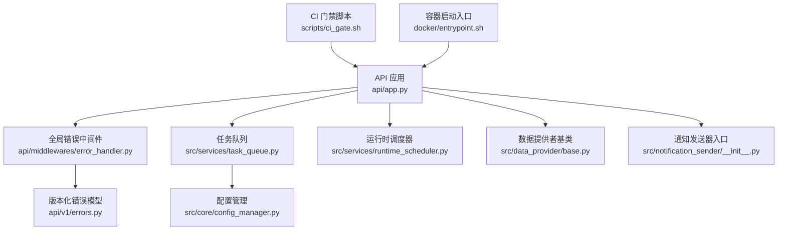
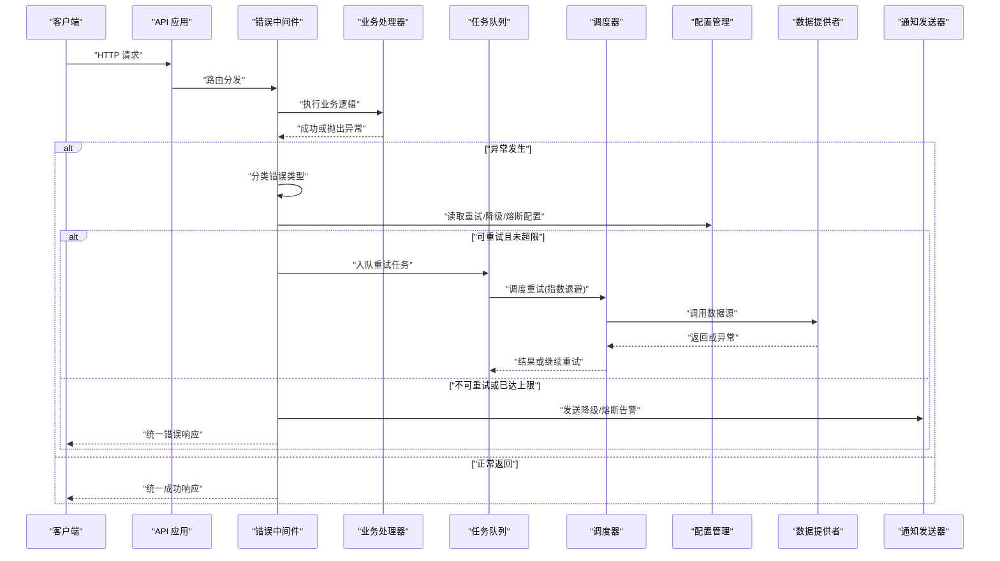
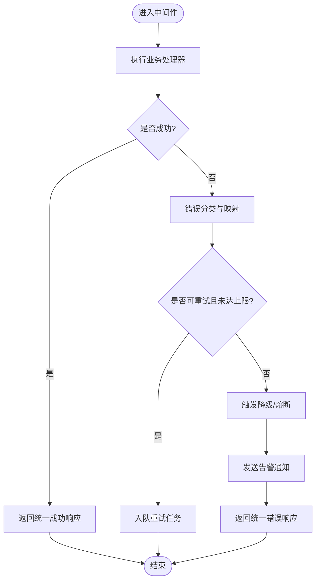
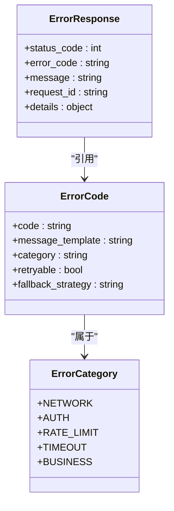
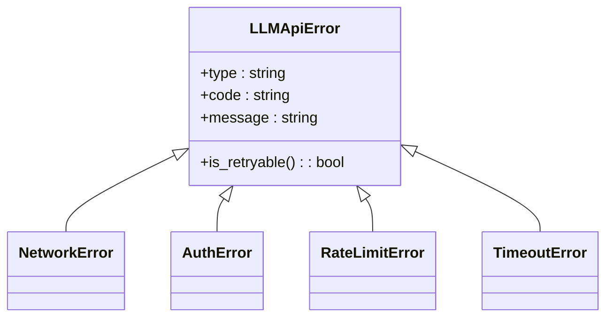
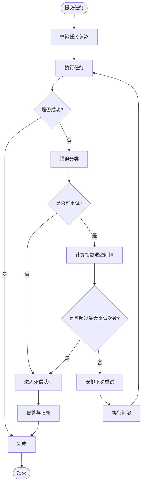
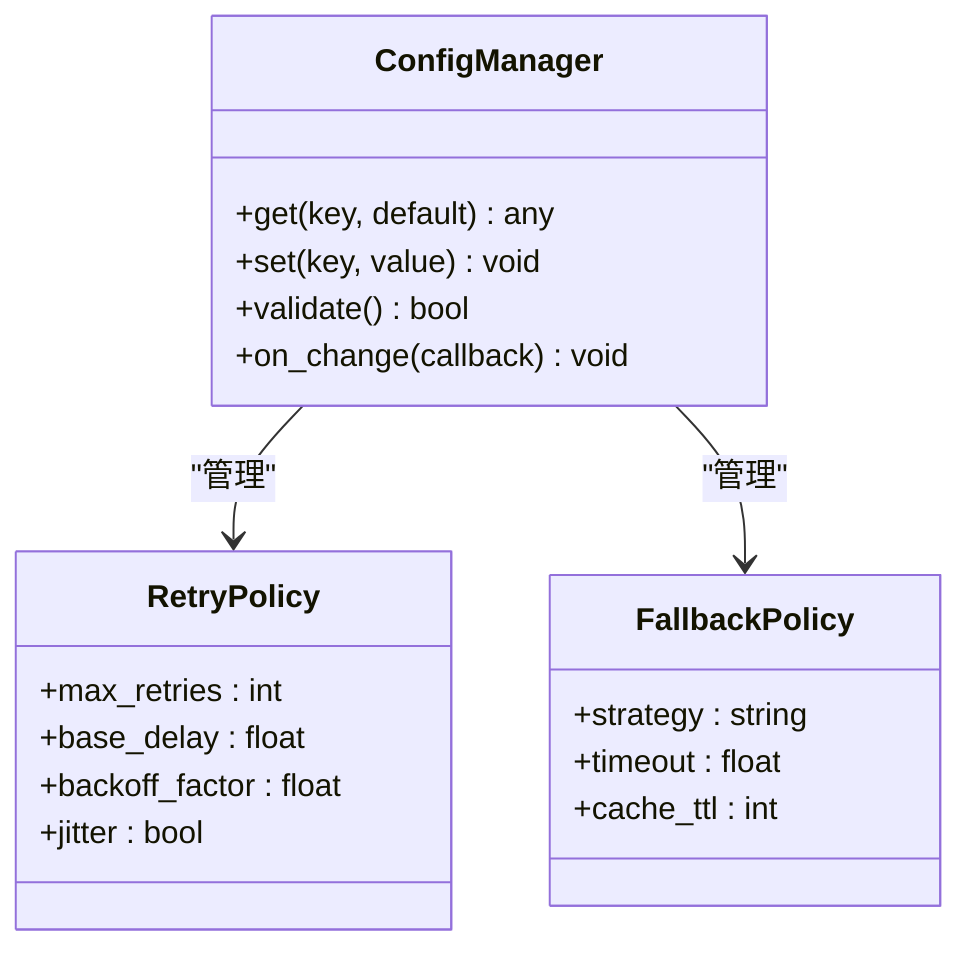
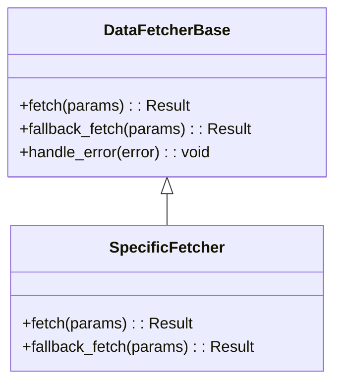
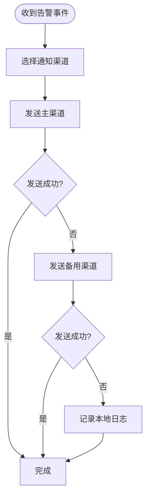
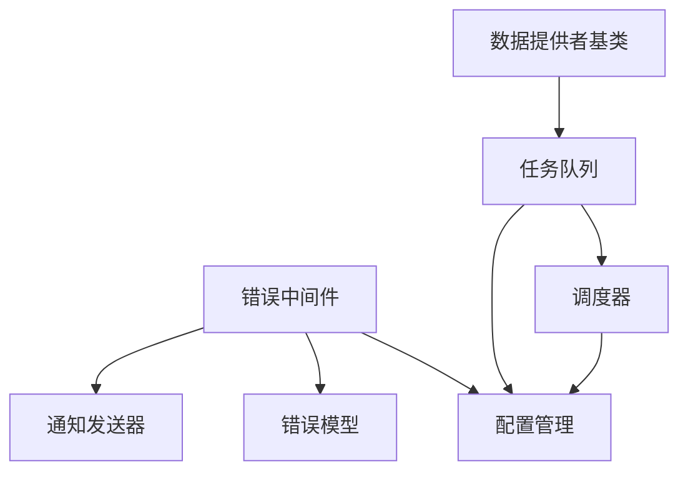

# 错误处理与恢复

<cite>
**本文引用的文件**   
- [api/app.py](file://api/app.py)
- [api/middlewares/error_handler.py](file://api/middlewares/error_handler.py)
- [api/v1/errors.py](file://api/v1/errors.py)
- [src/llm/errors.py](file://src/llm/errors.py)
- [src/services/task_queue.py](file://src/services/task_queue.py)
- [src/services/runtime_scheduler.py](file://src/services/runtime_scheduler.py)
- [src/core/config_manager.py](file://src/core/config_manager.py)
- [src/data_provider/base.py](file://src/data_provider/base.py)
- [src/notification_sender/__init__.py](file://src/notification_sender/__init__.py)
- [scripts/ci_gate.sh](file://scripts/ci_gate.sh)
- [docker/entrypoint.sh](file://docker/entrypoint.sh)
</cite>

## 目录
1. [简介](#简介)
2. [项目结构](#项目结构)
3. [核心组件](#核心组件)
4. [架构总览](#架构总览)
5. [详细组件分析](#详细组件分析)
6. [依赖关系分析](#依赖关系分析)
7. [性能考量](#性能考量)
8. [故障排查指南](#故障排查指南)
9. [结论](#结论)
10. [附录](#附录)

## 简介
本指南聚焦于错误处理与系统恢复，覆盖异常分类、统一错误响应格式、重试机制（指数退避、最大重试次数、失败条件）、降级策略（功能裁剪、缓存回退、服务熔断）以及应急流程（重启、数据修复、业务回滚）和灾难恢复计划。文档基于代码库中的 API 中间件、错误定义、任务队列与调度器、配置管理、数据源抽象与通知子系统实现进行系统化梳理，帮助读者快速理解并落地稳健的错误处理与恢复方案。

## 项目结构
围绕错误处理与恢复的关键位置包括：
- API 层：应用初始化、全局错误中间件、版本化错误模型
- 领域层：LLM 错误类型、任务队列与调度器、配置管理
- 外部依赖：数据提供者基类、通知发送器入口
- 运维脚本：CI 门禁与容器启动入口

图表来源
- [api/app.py](file://api/app.py)
- [api/middlewares/error_handler.py](file://api/middlewares/error_handler.py)
- [api/v1/errors.py](file://api/v1/errors.py)
- [src/services/task_queue.py](file://src/services/task_queue.py)
- [src/services/runtime_scheduler.py](file://src/services/runtime_scheduler.py)
- [src/core/config_manager.py](file://src/core/config_manager.py)
- [src/data_provider/base.py](file://src/data_provider/base.py)
- [src/notification_sender/__init__.py](file://src/notification_sender/__init__.py)
- [scripts/ci_gate.sh](file://scripts/ci_gate.sh)
- [docker/entrypoint.sh](file://docker/entrypoint.sh)

章节来源
- [api/app.py](file://api/app.py)
- [api/middlewares/error_handler.py](file://api/middlewares/error_handler.py)
- [api/v1/errors.py](file://api/v1/errors.py)
- [src/services/task_queue.py](file://src/services/task_queue.py)
- [src/services/runtime_scheduler.py](file://src/services/runtime_scheduler.py)
- [src/core/config_manager.py](file://src/core/config_manager.py)
- [src/data_provider/base.py](file://src/data_provider/base.py)
- [src/notification_sender/__init__.py](file://src/notification_sender/__init__.py)
- [scripts/ci_gate.sh](file://scripts/ci_gate.sh)
- [docker/entrypoint.sh](file://docker/entrypoint.sh)

## 核心组件
- 全局错误中间件：捕获未处理异常，标准化为统一响应体，记录上下文日志，触发告警或降级路径。
- 版本化错误模型：集中定义错误码、消息模板与字段约束，确保前后端一致。
- LLM 错误类型：区分网络、鉴权、限流、超时等，便于上层按类别重试或降级。
- 任务队列与调度器：提供可重试的任务执行框架，支持指数退避、最大重试次数、失败判定与死信队列。
- 配置管理：集中读取重试参数、降级开关、熔断阈值等，支持热更新与默认值。
- 数据提供者基类：封装外部数据源的通用错误处理与回退逻辑。
- 通知发送器入口：聚合多渠道通知，失败时降级到本地日志或备用通道。

章节来源
- [api/middlewares/error_handler.py](file://api/middlewares/error_handler.py)
- [api/v1/errors.py](file://api/v1/errors.py)
- [src/llm/errors.py](file://src/llm/errors.py)
- [src/services/task_queue.py](file://src/services/task_queue.py)
- [src/services/runtime_scheduler.py](file://src/services/runtime_scheduler.py)
- [src/core/config_manager.py](file://src/core/config_manager.py)
- [src/data_provider/base.py](file://src/data_provider/base.py)
- [src/notification_sender/__init__.py](file://src/notification_sender/__init__.py)

## 架构总览
下图展示请求从进入 API 到错误处理、重试与降级的整体流程。

图表来源
- [api/app.py](file://api/app.py)
- [api/middlewares/error_handler.py](file://api/middlewares/error_handler.py)
- [src/services/task_queue.py](file://src/services/task_queue.py)
- [src/services/runtime_scheduler.py](file://src/services/runtime_scheduler.py)
- [src/core/config_manager.py](file://src/core/config_manager.py)
- [src/data_provider/base.py](file://src/data_provider/base.py)
- [src/notification_sender/__init__.py](file://src/notification_sender/__init__.py)

## 详细组件分析

### 全局错误中间件与统一响应
- 职责：捕获所有未处理异常，转换为统一 JSON 响应；记录请求 ID、路径、状态码、错误码与堆栈摘要；根据配置决定是否触发告警或降级。
- 设计要点：
  - 错误分类：将异常映射到预定义错误码（如网络、鉴权、限流、超时、业务校验）。
  - 安全脱敏：避免在响应中泄露敏感信息。
  - 可观测性：结构化日志包含链路追踪与上下文。
  - 降级联动：当检测到上游服务不稳定时，自动切换至降级路径。

图表来源
- [api/middlewares/error_handler.py](file://api/middlewares/error_handler.py)
- [api/v1/errors.py](file://api/v1/errors.py)

章节来源
- [api/middlewares/error_handler.py](file://api/middlewares/error_handler.py)
- [api/v1/errors.py](file://api/v1/errors.py)

### 版本化错误模型与错误码
- 职责：集中定义错误码枚举、消息模板、字段校验规则，保证 API 一致性。
- 设计要点：
  - 错误码分层：通用错误码（网络、鉴权、限流、超时）与业务错误码分离。
  - 消息模板：支持多语言与动态参数替换。
  - 版本兼容：通过版本号隔离变更，避免破坏下游消费者。

图表来源
- [api/v1/errors.py](file://api/v1/errors.py)

章节来源
- [api/v1/errors.py](file://api/v1/errors.py)

### LLM 错误类型与重试策略
- 职责：对大模型服务的网络、鉴权、限流、超时等错误进行分类，指导上层重试或降级。
- 设计要点：
  - 错误分类：区分瞬态错误（可重试）与永久错误（不可重试）。
  - 重试策略：结合指数退避与最大重试次数，避免雪崩。
  - 降级路径：切换到备用模型或离线缓存。

图表来源
- [src/llm/errors.py](file://src/llm/errors.py)

章节来源
- [src/llm/errors.py](file://src/llm/errors.py)

### 任务队列与指数退避重试
- 职责：提供可靠的任务执行框架，支持重试、退避、失败判定与死信队列。
- 设计要点：
  - 指数退避：每次重试间隔按指数增长，避免集中重试。
  - 最大重试次数：防止无限重试导致资源耗尽。
  - 失败条件：仅对瞬态错误重试，持久错误直接失败。
  - 监控与告警：记录重试次数、耗时与失败原因。

图表来源
- [src/services/task_queue.py](file://src/services/task_queue.py)
- [src/services/runtime_scheduler.py](file://src/services/runtime_scheduler.py)
- [src/core/config_manager.py](file://src/core/config_manager.py)

章节来源
- [src/services/task_queue.py](file://src/services/task_queue.py)
- [src/services/runtime_scheduler.py](file://src/services/runtime_scheduler.py)
- [src/core/config_manager.py](file://src/core/config_manager.py)

### 配置管理与降级开关
- 职责：集中管理重试、降级、熔断等运行时参数，支持默认值与环境变量覆盖。
- 设计要点：
  - 默认值：提供合理的默认配置，确保无配置也能运行。
  - 热更新：支持运行时调整关键参数（如最大重试次数、退避系数）。
  - 校验：启动时校验必填项与取值范围。

图表来源
- [src/core/config_manager.py](file://src/core/config_manager.py)

章节来源
- [src/core/config_manager.py](file://src/core/config_manager.py)

### 数据提供者基类与回退逻辑
- 职责：封装外部数据源的通用错误处理与回退逻辑，确保上层调用稳定。
- 设计要点：
  - 统一接口：所有数据源实现相同接口，便于替换与测试。
  - 错误分类：区分网络、超时、解析错误等。
  - 回退策略：优先主源，失败切换备用源或缓存。

图表来源
- [src/data_provider/base.py](file://src/data_provider/base.py)

章节来源
- [src/data_provider/base.py](file://src/data_provider/base.py)

### 通知发送器与告警降级
- 职责：聚合多渠道通知，失败时降级到本地日志或备用通道。
- 设计要点：
  - 渠道选择：根据配置选择主渠道与备用渠道。
  - 失败降级：主渠道失败自动切换备用渠道。
  - 去重与限流：避免重复告警与风暴。

图表来源
- [src/notification_sender/__init__.py](file://src/notification_sender/__init__.py)

章节来源
- [src/notification_sender/__init__.py](file://src/notification_sender/__init__.py)

## 依赖关系分析
- 低耦合高内聚：错误中间件依赖错误模型与配置管理，不直接依赖具体业务逻辑。
- 重试与调度解耦：任务队列与调度器通过配置管理获取策略，降低硬编码。
- 外部依赖抽象：数据提供者基类屏蔽差异，便于替换与测试。
- 告警与业务解耦：通知发送器独立于业务，失败不影响主流程。

图表来源
- [api/middlewares/error_handler.py](file://api/middlewares/error_handler.py)
- [api/v1/errors.py](file://api/v1/errors.py)
- [src/core/config_manager.py](file://src/core/config_manager.py)
- [src/services/task_queue.py](file://src/services/task_queue.py)
- [src/services/runtime_scheduler.py](file://src/services/runtime_scheduler.py)
- [src/data_provider/base.py](file://src/data_provider/base.py)
- [src/notification_sender/__init__.py](file://src/notification_sender/__init__.py)

章节来源
- [api/middlewares/error_handler.py](file://api/middlewares/error_handler.py)
- [api/v1/errors.py](file://api/v1/errors.py)
- [src/core/config_manager.py](file://src/core/config_manager.py)
- [src/services/task_queue.py](file://src/services/task_queue.py)
- [src/services/runtime_scheduler.py](file://src/services/runtime_scheduler.py)
- [src/data_provider/base.py](file://src/data_provider/base.py)
- [src/notification_sender/__init__.py](file://src/notification_sender/__init__.py)

## 性能考量
- 重试开销控制：合理设置最大重试次数与退避间隔，避免放大负载。
- 降级优先级：优先使用缓存与只读副本，减少对外部依赖的依赖。
- 熔断阈值：根据错误率与延迟动态调整，防止级联故障。
- 资源隔离：关键路径与非关键路径隔离，保障核心功能可用。

## 故障排查指南
- 定位问题：通过统一错误响应中的 request_id 与结构化日志快速定位。
- 检查配置：确认重试、降级、熔断相关配置是否正确加载。
- 验证依赖：检查外部数据源与通知渠道的健康状态。
- 模拟故障：使用 CI 门禁与本地测试用例复现问题。

章节来源
- [scripts/ci_gate.sh](file://scripts/ci_gate.sh)
- [docker/entrypoint.sh](file://docker/entrypoint.sh)

## 结论
通过统一的错误模型、中间件、任务队列与配置管理，系统实现了健壮的错误处理与恢复能力。结合指数退避、最大重试次数、失败条件判断与多级降级策略，有效提升了系统的稳定性与可用性。建议持续完善监控与告警，定期演练灾难恢复流程，确保在极端情况下仍能快速恢复。

## 附录
- 应急流程：服务重启、数据修复、业务回滚的标准操作程序（SOP）。
- 灾难恢复计划：RTO/RPO 目标、备份策略、恢复演练与复盘。
- 最佳实践：错误分类、重试策略、降级路径的设计原则与示例。