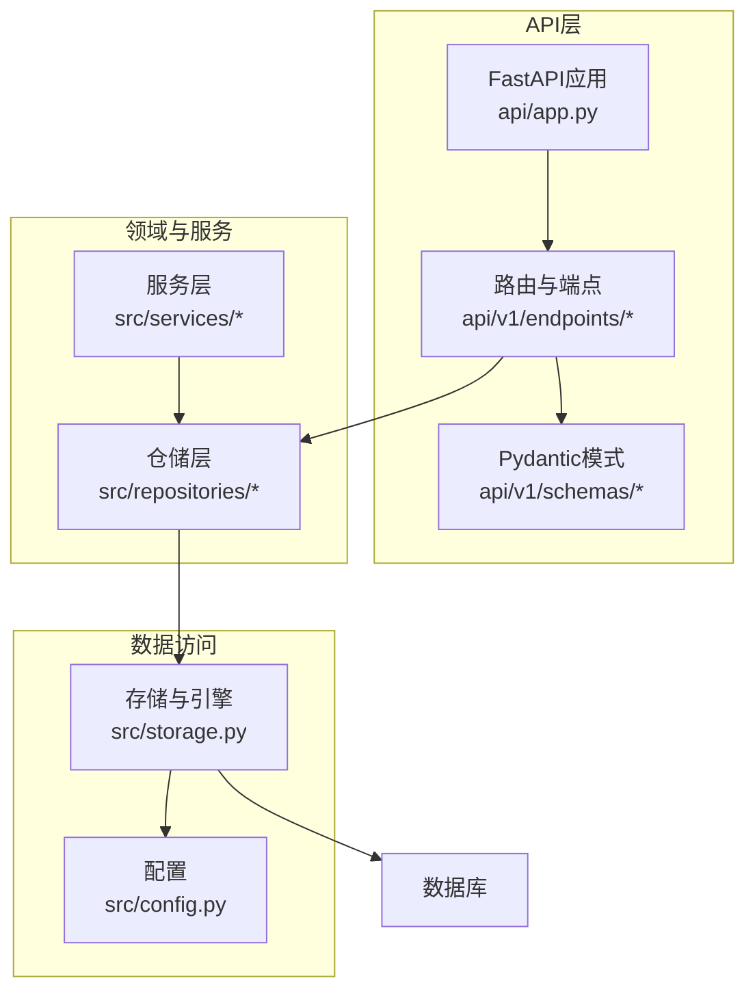
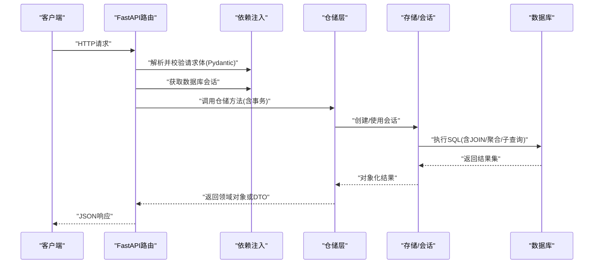
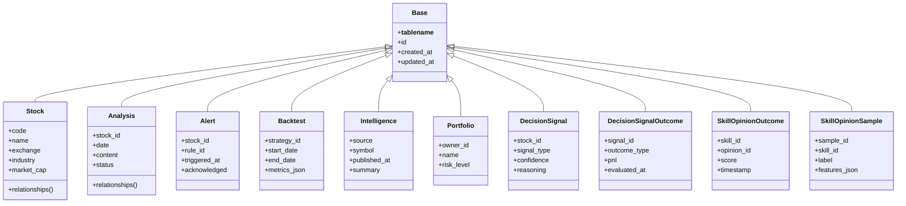
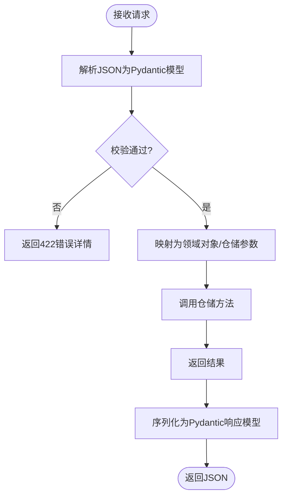
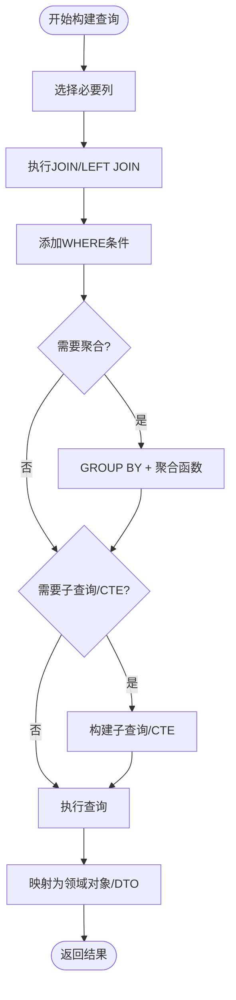
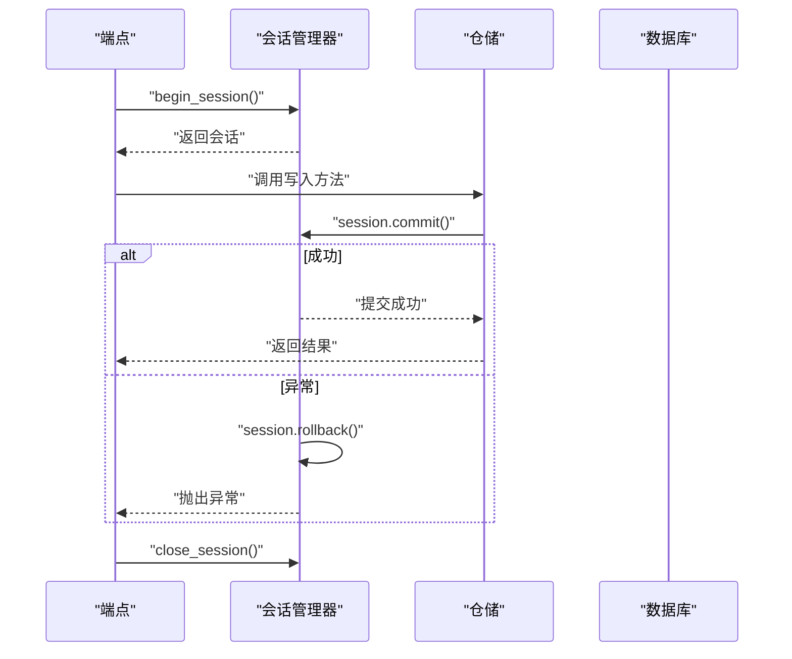
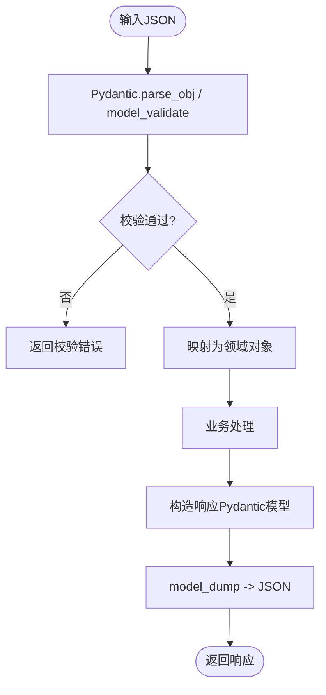
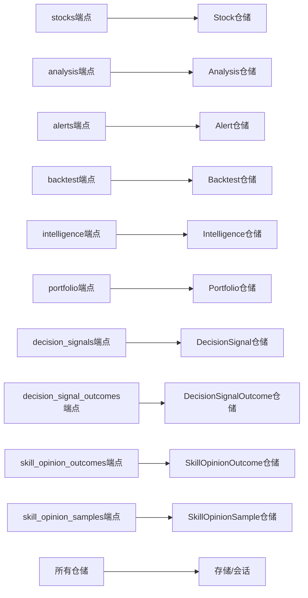

# ORM模型设计

<cite>
**本文档引用的文件**   
- [main.py](file://main.py)
- [server.py](file://server.py)
- [pyproject.toml](file://pyproject.toml)
- [requirements.txt](file://requirements.txt)
- [src/config.py](file://src/config.py)
- [src/storage.py](file://src/storage.py)
- [api/app.py](file://api/app.py)
- [api/deps.py](file://api/deps.py)
- [src/repositories/stock_repo.py](file://src/repositories/stock_repo.py)
- [src/repositories/analysis_repo.py](file://src/repositories/analysis_repo.py)
- [src/repositories/alert_repo.py](file://src/repositories/alert_repo.py)
- [src/repositories/backtest_repo.py](file://src/repositories/backtest_repo.py)
- [src/repositories/intelligence_repo.py](file://src/repositories/intelligence_repo.py)
- [src/repositories/portfolio_repo.py](file://src/repositories/portfolio_repo.py)
- [src/repositories/decision_signal_repo.py](file://src/repositories/decision_signal_repo.py)
- [src/repositories/decision_signal_outcome_repo.py](file://src/repositories/decision_signal_outcome_repo.py)
- [src/repositories/skill_opinion_outcome_repo.py](file://src/repositories/skill_opinion_outcome_repo.py)
- [src/repositories/skill_opinion_sample_repo.py](file://src/repositories/skill_opinion_sample_repo.py)
- [api/v1/endpoints/stocks.py](file://api/v1/endpoints/stocks.py)
- [api/v1/endpoints/analysis.py](file://api/v1/endpoints/analysis.py)
- [api/v1/endpoints/alerts.py](file://api/v1/endpoints/alerts.py)
- [api/v1/endpoints/backtest.py](file://api/v1/endpoints/backtest.py)
- [api/v1/endpoints/intelligence.py](file://api/v1/endpoints/intelligence.py)
- [api/v1/endpoints/portfolio.py](file://api/v1/endpoints/portfolio.py)
- [api/v1/endpoints/decision_signals.py](file://api/v1/endpoints/decision_signals.py)
- [api/v1/schemas/common.py](file://api/v1/schemas/common.py)
- [api/v1/schemas/stocks.py](file://api/v1/schemas/stocks.py)
- [api/v1/schemas/analysis.py](file://api/v1/schemas/analysis.py)
- [api/v1/schemas/alerts.py](file://api/v1/schemas/alerts.py)
- [api/v1/schemas/backtest.py](file://api/v1/schemas/backtest.py)
- [api/v1/schemas/intelligence.py](file://api/v1/schemas/intelligence.py)
- [api/v1/schemas/portfolio.py](file://api/v1/schemas/portfolio.py)
- [api/v1/schemas/decision_signals.py](file://api/v1/schemas/decision_signals.py)
</cite>

## 目录
1. [简介](#简介)
2. [项目结构](#项目结构)
3. [核心组件](#核心组件)
4. [架构总览](#架构总览)
5. [详细组件分析](#详细组件分析)
6. [依赖关系分析](#依赖关系分析)
7. [性能考虑](#性能考虑)
8. [故障排查指南](#故障排查指南)
9. [结论](#结论)
10. [附录](#附录)

## 简介
本文件围绕Daily Stock Analysis项目的ORM模型设计，系统性阐述SQLAlchemy模型定义、字段映射与关系建模；说明Pydantic模型在数据校验与序列化中的应用；给出复杂查询（JOIN、聚合、子查询）的构建方式；总结事务管理最佳实践；并提供模型序列化和反序列化的配置建议，以及懒加载、预加载与查询缓存等性能优化技巧。文档面向不同技术背景的读者，力求以循序渐进的方式呈现从概念到实现的关键要点。

## 项目结构
本项目采用分层架构：API层通过FastAPI暴露接口，依赖注入提供数据库会话；仓储层封装SQLAlchemy查询逻辑；领域服务编排业务流；Pydantic模式用于请求/响应数据的校验与序列化。数据库访问由存储模块统一管理连接与会话生命周期。

图表来源
- [api/app.py](file://api/app.py)
- [src/storage.py](file://src/storage.py)
- [src/config.py](file://src/config.py)

章节来源
- [main.py:1-200](file://main.py#L1-L200)
- [server.py:1-200](file://server.py#L1-L200)
- [pyproject.toml:1-200](file://pyproject.toml#L1-L200)
- [requirements.txt:1-200](file://requirements.txt#L1-L200)

## 核心组件
- 存储与引擎：集中管理数据库引擎、会话工厂与连接池参数，确保统一的连接生命周期与事务边界。
- 仓储层：按实体划分仓库（如股票、分析、警报、回测、情报、组合、决策信号等），封装CRUD与复杂查询。
- API层：使用FastAPI路由与Pydantic模式进行输入校验、输出序列化与错误处理。
- 配置：集中读取环境变量与配置文件，驱动数据库连接与行为开关。

章节来源
- [src/storage.py:1-200](file://src/storage.py#L1-L200)
- [src/config.py:1-200](file://src/config.py#L1-L200)
- [api/app.py:1-200](file://api/app.py#L1-L200)
- [api/deps.py:1-200](file://api/deps.py#L1-L200)

## 架构总览
下图展示从HTTP请求到数据库访问的完整调用链，强调会话与事务边界、仓储封装与Pydantic校验的作用。

图表来源
- [api/app.py:1-200](file://api/app.py#L1-L200)
- [api/deps.py:1-200](file://api/deps.py#L1-L200)
- [src/storage.py:1-200](file://src/storage.py#L1-L200)

## 详细组件分析

### SQLAlchemy模型与Base类继承
- Base类：通常通过declarative_base或registry声明基类，供所有模型继承，统一元数据与表名策略。
- 字段映射：使用Column定义主键、外键、时间戳、枚举等，配合索引与约束提升查询效率与数据一致性。
- 关系定义：通过relationship建立一对多、多对多等关联，结合lazy/eager策略控制加载行为。

图表来源
- [src/repositories/stock_repo.py:1-200](file://src/repositories/stock_repo.py#L1-L200)
- [src/repositories/analysis_repo.py:1-200](file://src/repositories/analysis_repo.py#L1-L200)
- [src/repositories/alert_repo.py:1-200](file://src/repositories/alert_repo.py#L1-L200)
- [src/repositories/backtest_repo.py:1-200](file://src/repositories/backtest_repo.py#L1-L200)
- [src/repositories/intelligence_repo.py:1-200](file://src/repositories/intelligence_repo.py#L1-L200)
- [src/repositories/portfolio_repo.py:1-200](file://src/repositories/portfolio_repo.py#L1-L200)
- [src/repositories/decision_signal_repo.py:1-200](file://src/repositories/decision_signal_repo.py#L1-L200)
- [src/repositories/decision_signal_outcome_repo.py:1-200](file://src/repositories/decision_signal_outcome_repo.py#L1-L200)
- [src/repositories/skill_opinion_outcome_repo.py:1-200](file://src/repositories/skill_opinion_outcome_repo.py#L1-L200)
- [src/repositories/skill_opinion_sample_repo.py:1-200](file://src/repositories/skill_opinion_sample_repo.py#L1-L200)

章节来源
- [src/repositories/stock_repo.py:1-200](file://src/repositories/stock_repo.py#L1-L200)
- [src/repositories/analysis_repo.py:1-200](file://src/repositories/analysis_repo.py#L1-L200)
- [src/repositories/alert_repo.py:1-200](file://src/repositories/alert_repo.py#L1-L200)
- [src/repositories/backtest_repo.py:1-200](file://src/repositories/backtest_repo.py#L1-L200)
- [src/repositories/intelligence_repo.py:1-200](file://src/repositories/intelligence_repo.py#L1-L200)
- [src/repositories/portfolio_repo.py:1-200](file://src/repositories/portfolio_repo.py#L1-L200)
- [src/repositories/decision_signal_repo.py:1-200](file://src/repositories/decision_signal_repo.py#L1-L200)
- [src/repositories/decision_signal_outcome_repo.py:1-200](file://src/repositories/decision_signal_outcome_repo.py#L1-L200)
- [src/repositories/skill_opinion_outcome_repo.py:1-200](file://src/repositories/skill_opinion_outcome_repo.py#L1-L200)
- [src/repositories/skill_opinion_sample_repo.py:1-200](file://src/repositories/skill_opinion_sample_repo.py#L1-L200)

### Pydantic模型集成与数据验证
- 请求校验：在FastAPI端点中使用Pydantic模型对入参进行类型检查、默认值填充与自定义验证器。
- 响应序列化：将领域对象转换为Pydantic模型输出为JSON，保证对外契约稳定。
- 嵌套与联合类型：支持复杂数据结构（如列表、字典、可选字段）的校验与转换。

图表来源
- [api/v1/schemas/common.py:1-200](file://api/v1/schemas/common.py#L1-L200)
- [api/v1/schemas/stocks.py:1-200](file://api/v1/schemas/stocks.py#L1-L200)
- [api/v1/schemas/analysis.py:1-200](file://api/v1/schemas/analysis.py#L1-L200)
- [api/v1/schemas/alerts.py:1-200](file://api/v1/schemas/alerts.py#L1-L200)
- [api/v1/schemas/backtest.py:1-200](file://api/v1/schemas/backtest.py#L1-L200)
- [api/v1/schemas/intelligence.py:1-200](file://api/v1/schemas/intelligence.py#L1-L200)
- [api/v1/schemas/portfolio.py:1-200](file://api/v1/schemas/portfolio.py#L1-L200)
- [api/v1/schemas/decision_signals.py:1-200](file://api/v1/schemas/decision_signals.py#L1-L200)

章节来源
- [api/v1/schemas/common.py:1-200](file://api/v1/schemas/common.py#L1-L200)
- [api/v1/schemas/stocks.py:1-200](file://api/v1/schemas/stocks.py#L1-L200)
- [api/v1/schemas/analysis.py:1-200](file://api/v1/schemas/analysis.py#L1-L200)
- [api/v1/schemas/alerts.py:1-200](file://api/v1/schemas/alerts.py#L1-L200)
- [api/v1/schemas/backtest.py:1-200](file://api/v1/schemas/backtest.py#L1-L200)
- [api/v1/schemas/intelligence.py:1-200](file://api/v1/schemas/intelligence.py#L1-L200)
- [api/v1/schemas/portfolio.py:1-200](file://api/v1/schemas/portfolio.py#L1-L200)
- [api/v1/schemas/decision_signals.py:1-200](file://api/v1/schemas/decision_signals.py#L1-L200)

### 复杂查询构建（JOIN、聚合、子查询）
- JOIN操作：在仓储中通过join/outerjoin关联多表，按需选择列以减少数据传输。
- 聚合查询：使用func.count/sum/avg/max/min等进行统计，结合group_by/having完成分组过滤。
- 子查询：利用subquery/cte构建可复用片段，提升可读性与性能。

图表来源
- [src/repositories/stock_repo.py:1-200](file://src/repositories/stock_repo.py#L1-L200)
- [src/repositories/analysis_repo.py:1-200](file://src/repositories/analysis_repo.py#L1-L200)
- [src/repositories/alert_repo.py:1-200](file://src/repositories/alert_repo.py#L1-L200)
- [src/repositories/backtest_repo.py:1-200](file://src/repositories/backtest_repo.py#L1-L200)
- [src/repositories/intelligence_repo.py:1-200](file://src/repositories/intelligence_repo.py#L1-L200)
- [src/repositories/portfolio_repo.py:1-200](file://src/repositories/portfolio_repo.py#L1-L200)
- [src/repositories/decision_signal_repo.py:1-200](file://src/repositories/decision_signal_repo.py#L1-L200)
- [src/repositories/decision_signal_outcome_repo.py:1-200](file://src/repositories/decision_signal_outcome_repo.py#L1-L200)
- [src/repositories/skill_opinion_outcome_repo.py:1-200](file://src/repositories/skill_opinion_outcome_repo.py#L1-L200)
- [src/repositories/skill_opinion_sample_repo.py:1-200](file://src/repositories/skill_opinion_sample_repo.py#L1-L200)

章节来源
- [src/repositories/stock_repo.py:1-200](file://src/repositories/stock_repo.py#L1-L200)
- [src/repositories/analysis_repo.py:1-200](file://src/repositories/analysis_repo.py#L1-L200)
- [src/repositories/alert_repo.py:1-200](file://src/repositories/alert_repo.py#L1-L200)
- [src/repositories/backtest_repo.py:1-200](file://src/repositories/backtest_repo.py#L1-L200)
- [src/repositories/intelligence_repo.py:1-200](file://src/repositories/intelligence_repo.py#L1-L200)
- [src/repositories/portfolio_repo.py:1-200](file://src/repositories/portfolio_repo.py#L1-L200)
- [src/repositories/decision_signal_repo.py:1-200](file://src/repositories/decision_signal_repo.py#L1-L200)
- [src/repositories/decision_signal_outcome_repo.py:1-200](file://src/repositories/decision_signal_outcome_repo.py#L1-L200)
- [src/repositories/skill_opinion_outcome_repo.py:1-200](file://src/repositories/skill_opinion_outcome_repo.py#L1-L200)
- [src/repositories/skill_opinion_sample_repo.py:1-200](file://src/repositories/skill_opinion_sample_repo.py#L1-L200)

### 事务管理与最佳实践
- 会话边界：每个HTTP请求创建一个会话，确保隔离性；在仓储方法内开启事务，失败时回滚。
- 错误处理：捕获异常并转换为标准HTTP错误码，记录上下文信息便于定位问题。
- 资源释放：确保会话在请求结束时关闭，避免连接泄漏。

图表来源
- [src/storage.py:1-200](file://src/storage.py#L1-L200)
- [api/deps.py:1-200](file://api/deps.py#L1-L200)

章节来源
- [src/storage.py:1-200](file://src/storage.py#L1-L200)
- [api/deps.py:1-200](file://api/deps.py#L1-L200)

### 模型序列化与反序列化配置
- JSON转换：使用Pydantic模型的model_dump/model_validate等方法进行双向转换。
- 字段控制：通过exclude/include控制输出字段，支持别名与默认值。
- 自定义验证：在模型中嵌入validator，实现业务规则校验（如日期范围、数值区间）。

图表来源
- [api/v1/schemas/common.py:1-200](file://api/v1/schemas/common.py#L1-L200)
- [api/v1/schemas/stocks.py:1-200](file://api/v1/schemas/stocks.py#L1-L200)
- [api/v1/schemas/analysis.py:1-200](file://api/v1/schemas/analysis.py#L1-L200)
- [api/v1/schemas/alerts.py:1-200](file://api/v1/schemas/alerts.py#L1-L200)
- [api/v1/schemas/backtest.py:1-200](file://api/v1/schemas/backtest.py#L1-L200)
- [api/v1/schemas/intelligence.py:1-200](file://api/v1/schemas/intelligence.py#L1-L200)
- [api/v1/schemas/portfolio.py:1-200](file://api/v1/schemas/portfolio.py#L1-L200)
- [api/v1/schemas/decision_signals.py:1-200](file://api/v1/schemas/decision_signals.py#L1-L200)

章节来源
- [api/v1/schemas/common.py:1-200](file://api/v1/schemas/common.py#L1-L200)
- [api/v1/schemas/stocks.py:1-200](file://api/v1/schemas/stocks.py#L1-L200)
- [api/v1/schemas/analysis.py:1-200](file://api/v1/schemas/analysis.py#L1-L200)
- [api/v1/schemas/alerts.py:1-200](file://api/v1/schemas/alerts.py#L1-L200)
- [api/v1/schemas/backtest.py:1-200](file://api/v1/schemas/backtest.py#L1-L200)
- [api/v1/schemas/intelligence.py:1-200](file://api/v1/schemas/intelligence.py#L1-L200)
- [api/v1/schemas/portfolio.py:1-200](file://api/v1/schemas/portfolio.py#L1-L200)
- [api/v1/schemas/decision_signals.py:1-200](file://api/v1/schemas/decision_signals.py#L1-L200)

## 依赖关系分析
仓储层与API端点的耦合度较低，通过依赖注入解耦；存储模块集中管理数据库连接与会话，降低各层对底层实现的感知。

图表来源
- [api/v1/endpoints/stocks.py:1-200](file://api/v1/endpoints/stocks.py#L1-L200)
- [api/v1/endpoints/analysis.py:1-200](file://api/v1/endpoints/analysis.py#L1-L200)
- [api/v1/endpoints/alerts.py:1-200](file://api/v1/endpoints/alerts.py#L1-L200)
- [api/v1/endpoints/backtest.py:1-200](file://api/v1/endpoints/backtest.py#L1-L200)
- [api/v1/endpoints/intelligence.py:1-200](file://api/v1/endpoints/intelligence.py#L1-L200)
- [api/v1/endpoints/portfolio.py:1-200](file://api/v1/endpoints/portfolio.py#L1-L200)
- [api/v1/endpoints/decision_signals.py:1-200](file://api/v1/endpoints/decision_signals.py#L1-L200)
- [src/repositories/stock_repo.py:1-200](file://src/repositories/stock_repo.py#L1-L200)
- [src/repositories/analysis_repo.py:1-200](file://src/repositories/analysis_repo.py#L1-L200)
- [src/repositories/alert_repo.py:1-200](file://src/repositories/alert_repo.py#L1-L200)
- [src/repositories/backtest_repo.py:1-200](file://src/repositories/backtest_repo.py#L1-L200)
- [src/repositories/intelligence_repo.py:1-200](file://src/repositories/intelligence_repo.py#L1-L200)
- [src/repositories/portfolio_repo.py:1-200](file://src/repositories/portfolio_repo.py#L1-L200)
- [src/repositories/decision_signal_repo.py:1-200](file://src/repositories/decision_signal_repo.py#L1-L200)
- [src/repositories/decision_signal_outcome_repo.py:1-200](file://src/repositories/decision_signal_outcome_repo.py#L1-L200)
- [src/repositories/skill_opinion_outcome_repo.py:1-200](file://src/repositories/skill_opinion_outcome_repo.py#L1-L200)
- [src/repositories/skill_opinion_sample_repo.py:1-200](file://src/repositories/skill_opinion_sample_repo.py#L1-L200)
- [src/storage.py:1-200](file://src/storage.py#L1-L200)

章节来源
- [api/v1/endpoints/stocks.py:1-200](file://api/v1/endpoints/stocks.py#L1-L200)
- [api/v1/endpoints/analysis.py:1-200](file://api/v1/endpoints/analysis.py#L1-L200)
- [api/v1/endpoints/alerts.py:1-200](file://api/v1/endpoints/alerts.py#L1-L200)
- [api/v1/endpoints/backtest.py:1-200](file://api/v1/endpoints/backtest.py#L1-L200)
- [api/v1/endpoints/intelligence.py:1-200](file://api/v1/endpoints/intelligence.py#L1-L200)
- [api/v1/endpoints/portfolio.py:1-200](file://api/v1/endpoints/portfolio.py#L1-L200)
- [api/v1/endpoints/decision_signals.py:1-200](file://api/v1/endpoints/decision_signals.py#L1-L200)
- [src/repositories/stock_repo.py:1-200](file://src/repositories/stock_repo.py#L1-L200)
- [src/repositories/analysis_repo.py:1-200](file://src/repositories/analysis_repo.py#L1-L200)
- [src/repositories/alert_repo.py:1-200](file://src/repositories/alert_repo.py#L1-L200)
- [src/repositories/backtest_repo.py:1-200](file://src/repositories/backtest_repo.py#L1-L200)
- [src/repositories/intelligence_repo.py:1-200](file://src/repositories/intelligence_repo.py#L1-L200)
- [src/repositories/portfolio_repo.py:1-200](file://src/repositories/portfolio_repo.py#L1-L200)
- [src/repositories/decision_signal_repo.py:1-200](file://src/repositories/decision_signal_repo.py#L1-L200)
- [src/repositories/decision_signal_outcome_repo.py:1-200](file://src/repositories/decision_signal_outcome_repo.py#L1-L200)
- [src/repositories/skill_opinion_outcome_repo.py:1-200](file://src/repositories/skill_opinion_outcome_repo.py#L1-L200)
- [src/repositories/skill_opinion_sample_repo.py:1-200](file://src/repositories/skill_opinion_sample_repo.py#L1-L200)
- [src/storage.py:1-200](file://src/storage.py#L1-L200)

## 性能考虑
- 懒加载与预加载：对频繁访问的关系使用joinedload/subqueryload减少N+1查询；对只读场景启用惰性加载以降低内存占用。
- 查询缓存：对热点数据使用Redis或内存缓存，缩短重复查询延迟。
- 分页与投影：限制返回列与行数，避免全表扫描与大对象传输。
- 连接池调优：根据并发量调整pool_size与max_overflow，避免连接耗尽。

[本节为通用指导，不直接分析具体文件]

## 故障排查指南
- 常见错误：连接超时、事务冲突、校验失败（422）、外键约束违反。
- 日志与追踪：在仓储层记录关键SQL与参数，结合请求ID追踪链路。
- 回滚策略：在异常分支显式回滚，确保数据一致性。
- 健康检查：提供健康检查端点监控数据库连通性与慢查询。

章节来源
- [src/storage.py:1-200](file://src/storage.py#L1-L200)
- [api/deps.py:1-200](file://api/deps.py#L1-L200)

## 结论
通过统一的Base模型、清晰的仓储封装与严格的Pydantic校验，Daily Stock Analysis项目在数据访问层实现了高内聚、低耦合的设计。结合事务边界控制、复杂查询优化与缓存策略，可在保证一致性的同时获得良好的性能表现。建议在后续迭代中持续完善索引设计与查询计划分析，进一步提升系统稳定性与扩展性。

## 附录
- 参考文件清单见“本文档引用的文件”部分。
- 如需进一步细化某仓储或端点的实现细节，可依据对应文件的行号定位源码进行分析。