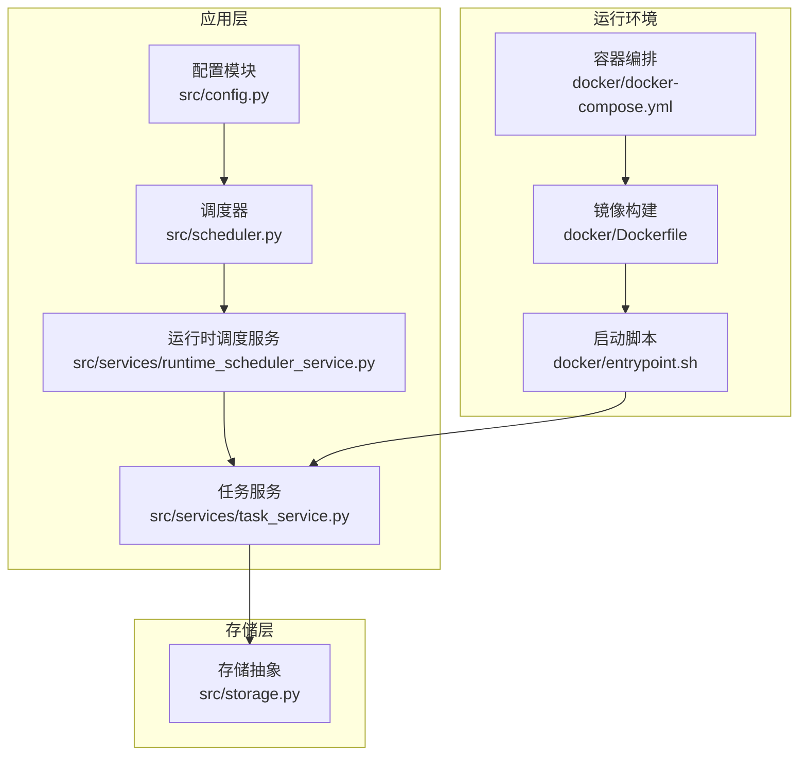
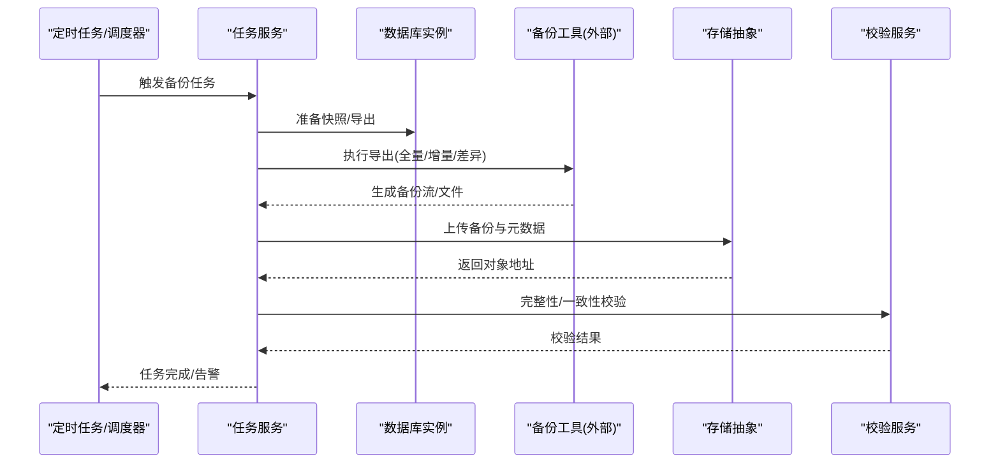
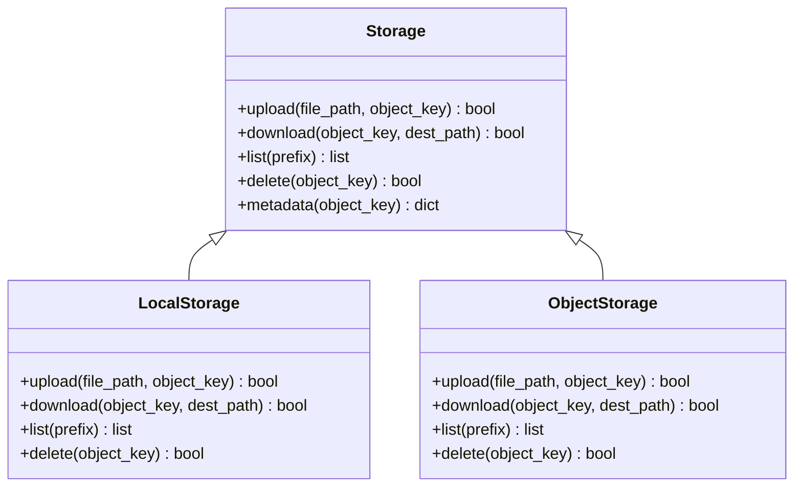
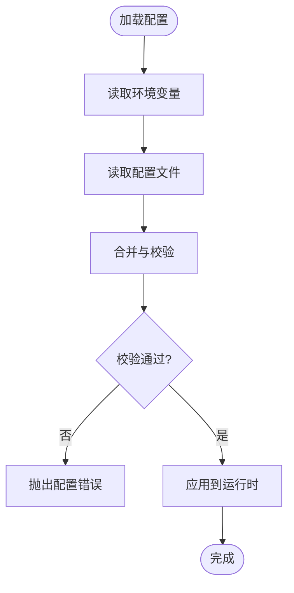
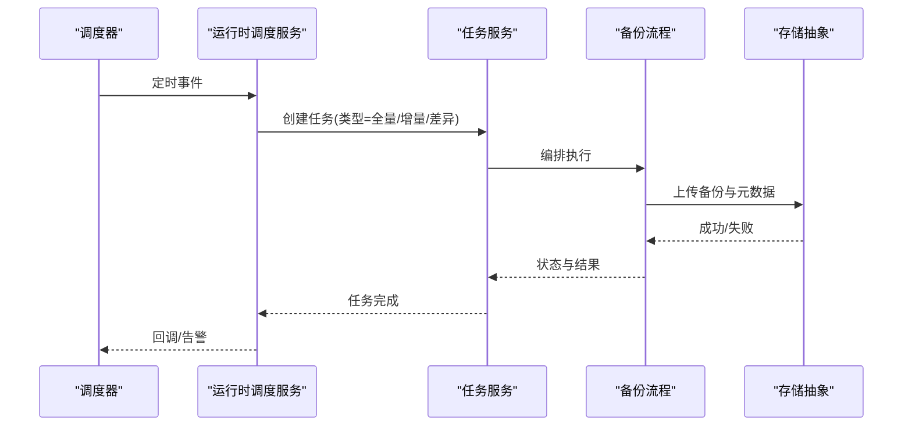
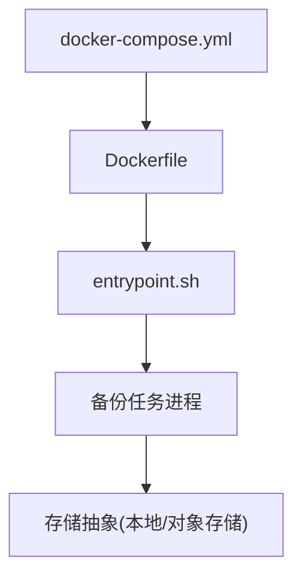
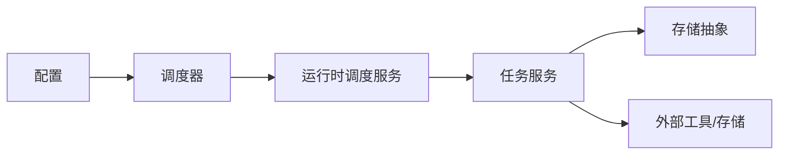

# 备份与恢复

<cite>
**本文引用的文件**   
- [storage.py](file://src/storage.py)
- [config.py](file://src/config.py)
- [scheduler.py](file://src/scheduler.py)
- [runtime_scheduler_service.py](file://src/services/runtime_scheduler_service.py)
- [task_service.py](file://src/services/task_service.py)
- [docker-compose.yml](file://docker/docker-compose.yml)
- [Dockerfile](file://docker/Dockerfile)
- [entrypoint.sh](file://docker/entrypoint.sh)
- [test_storage.py](file://tests/test_storage.py)
</cite>

## 目录
1. [简介](#简介)
2. [项目结构](#项目结构)
3. [核心组件](#核心组件)
4. [架构总览](#架构总览)
5. [详细组件分析](#详细组件分析)
6. [依赖关系分析](#依赖关系分析)
7. [性能考虑](#性能考虑)
8. [故障排查指南](#故障排查指南)
9. [结论](#结论)
10. [附录](#附录)

## 简介
本文件为 Daily Stock Analysis 的“备份与恢复”专项文档，面向运维与研发人员，覆盖以下目标：
- 备份策略设计：全量、增量、差异备份的选择与应用场景
- 自动化备份任务配置：定时调度、备份文件管理、存储空间优化
- 数据恢复流程：完整恢复、时间点恢复、选择性恢复操作步骤
- 备份数据验证：完整性检查与一致性验证方法
- 灾难恢复预案：故障检测、快速切换、业务连续性保障
- 备份安全性：数据加密、权限控制、传输安全

说明：当前仓库未包含内置的数据库备份/恢复实现。本文基于现有存储抽象、配置与调度能力，给出可落地的设计与集成方案，并标注对应源码位置以便后续扩展。

## 项目结构
与备份相关的关键位置与职责：
- src/storage.py：统一的存储抽象（本地/云对象存储），用于存放备份文件与元数据
- src/config.py：系统配置加载与校验，便于通过环境变量或配置文件启用/调整备份参数
- src/scheduler.py 与 src/services/runtime_scheduler_service.py：任务调度与运行时调度服务，可用于编排备份任务
- docker/*：容器化部署入口与编排，适合承载备份任务与外部工具
- tests/test_storage.py：存储层测试用例，可作为备份功能回归与兼容性测试的基础

**图表来源** 
- [config.py](file://src/config.py)
- [scheduler.py](file://src/scheduler.py)
- [runtime_scheduler_service.py](file://src/services/runtime_scheduler_service.py)
- [task_service.py](file://src/services/task_service.py)
- [storage.py](file://src/storage.py)
- [docker-compose.yml](file://docker/docker-compose.yml)
- [Dockerfile](file://docker/Dockerfile)
- [entrypoint.sh](file://docker/entrypoint.sh)

**章节来源**
- [storage.py](file://src/storage.py)
- [config.py](file://src/config.py)
- [scheduler.py](file://src/scheduler.py)
- [runtime_scheduler_service.py](file://src/services/runtime_scheduler_service.py)
- [task_service.py](file://src/services/task_service.py)
- [docker-compose.yml](file://docker/docker-compose.yml)
- [Dockerfile](file://docker/Dockerfile)
- [entrypoint.sh](file://docker/entrypoint.sh)

## 核心组件
- 存储抽象（Storage）
  - 提供统一的上传/下载/列举/删除接口，屏蔽本地磁盘与云对象存储的差异
  - 建议以“桶/容器 + 前缀”组织备份文件，如 backups/daily/{db}/...
- 配置中心（Config）
  - 集中管理备份开关、保留策略、加密密钥引用、存储后端参数等
- 调度与任务（Scheduler / Runtime Scheduler / Task Service）
  - 支持周期性触发备份任务、失败重试、告警通知
- 容器化（Docker）
  - 将备份工具与依赖打包，确保一致性与可移植性

**章节来源**
- [storage.py](file://src/storage.py)
- [config.py](file://src/config.py)
- [scheduler.py](file://src/scheduler.py)
- [runtime_scheduler_service.py](file://src/services/runtime_scheduler_service.py)
- [task_service.py](file://src/services/task_service.py)

## 架构总览
下图展示“备份与恢复”在系统中的角色与交互：
- 调度器按策略触发备份任务
- 任务服务协调执行（调用数据库导出工具、压缩、加密、上传）
- 存储抽象负责持久化备份文件与元数据
- 恢复流程反向读取备份，进行校验与还原

**图表来源** 
- [scheduler.py](file://src/scheduler.py)
- [runtime_scheduler_service.py](file://src/services/runtime_scheduler_service.py)
- [task_service.py](file://src/services/task_service.py)
- [storage.py](file://src/storage.py)

## 详细组件分析

### 存储抽象（Storage）
- 职责
  - 统一上传/下载/列举/删除接口
  - 支持多后端（本地文件系统、S3兼容对象存储等）
  - 提供分片上传、断点续传、并发优化的扩展点
- 关键设计要点
  - 命名规范：按日期+版本+类型组织，便于生命周期管理与恢复定位
  - 元数据：记录哈希、大小、时间戳、来源库名、备份类型
  - 错误处理：网络重试、幂等上传、失败回滚
- 复杂度与性能
  - 上传带宽与I/O是瓶颈；建议并行分块、压缩、去重
  - 列举操作需分页，避免大列表阻塞

**图表来源** 
- [storage.py](file://src/storage.py)

**章节来源**
- [storage.py](file://src/storage.py)
- [test_storage.py](file://tests/test_storage.py)

### 配置（Config）
- 职责
  - 加载并校验备份相关配置项（后端、保留策略、加密、并发、超时等）
  - 支持环境变量与配置文件双源
- 关键设计要点
  - 默认值与安全基线（最小权限、强制HTTPS、强密码/密钥管理）
  - 动态重载与热更新（谨慎使用，避免竞态）
- 复杂度与性能
  - 配置解析应轻量，避免在热路径中重复IO

**图表来源** 
- [config.py](file://src/config.py)

**章节来源**
- [config.py](file://src/config.py)

### 调度与任务（Scheduler / Runtime Scheduler / Task Service）
- 职责
  - 周期触发备份任务（全量/增量/差异）
  - 任务编排：导出→压缩→加密→上传→校验→清理
  - 失败重试、告警、审计日志
- 关键设计要点
  - 幂等性：同一任务多次触发不产生重复备份
  - 资源隔离：限制并发与I/O，避免影响主业务
  - 可观测性：指标、日志、健康检查
- 复杂度与性能
  - 调度粒度与窗口需结合RPO/RTO设定
  - 任务队列与优先级控制，避免长尾任务阻塞

**图表来源** 
- [scheduler.py](file://src/scheduler.py)
- [runtime_scheduler_service.py](file://src/services/runtime_scheduler_service.py)
- [task_service.py](file://src/services/task_service.py)
- [storage.py](file://src/storage.py)

**章节来源**
- [scheduler.py](file://src/scheduler.py)
- [runtime_scheduler_service.py](file://src/services/runtime_scheduler_service.py)
- [task_service.py](file://src/services/task_service.py)

### 容器化（Docker）
- 职责
  - 封装备份工具与依赖，保证环境一致性
  - 通过 entrypoint 启动备份任务或守护进程
- 关键设计要点
  - 只读镜像、最小化基础镜像
  - 挂载卷用于持久化备份与日志
  - 健康检查与退出码约定

**图表来源** 
- [docker-compose.yml](file://docker/docker-compose.yml)
- [Dockerfile](file://docker/Dockerfile)
- [entrypoint.sh](file://docker/entrypoint.sh)

**章节来源**
- [docker-compose.yml](file://docker/docker-compose.yml)
- [Dockerfile](file://docker/Dockerfile)
- [entrypoint.sh](file://docker/entrypoint.sh)

## 依赖关系分析
- 组件耦合
  - 任务服务依赖调度器与存储抽象
  - 配置模块被调度与任务服务共同消费
  - 容器编排作为运行载体，不直接参与业务逻辑
- 外部依赖
  - 数据库客户端/导出工具
  - 对象存储服务（S3兼容）
  - 加密库（可选）
- 潜在风险
  - 循环依赖应避免
  - 外部服务不可用时的降级与熔断

**图表来源** 
- [config.py](file://src/config.py)
- [scheduler.py](file://src/scheduler.py)
- [runtime_scheduler_service.py](file://src/services/runtime_scheduler_service.py)
- [task_service.py](file://src/services/task_service.py)
- [storage.py](file://src/storage.py)

**章节来源**
- [config.py](file://src/config.py)
- [scheduler.py](file://src/scheduler.py)
- [runtime_scheduler_service.py](file://src/services/runtime_scheduler_service.py)
- [task_service.py](file://src/services/task_service.py)
- [storage.py](file://src/storage.py)

## 性能考虑
- 备份窗口与吞吐
  - 根据RPO选择备份频率；根据带宽与I/O选择并发度
  - 增量/差异备份减少数据移动量，缩短窗口
- 压缩与去重
  - 合理压缩级别平衡CPU与I/O；对重复数据采用去重
- 存储分层
  - 热数据近端存储，冷数据归档到低成本对象存储
- 监控与限流
  - 监控队列长度、失败率、延迟；设置背压与限流保护主业务

[本节为通用指导，无需源码引用]

## 故障排查指南
- 常见问题
  - 任务堆积：检查调度器与任务队列容量
  - 上传失败：检查网络、凭据、配额与限速
  - 校验失败：核对哈希算法、元数据一致性
- 诊断步骤
  - 查看任务日志与指标
  - 复现最小用例，隔离问题域
  - 回滚到上一个可用备份，优先恢复业务
- 恢复演练
  - 定期演练不同恢复场景（完整/时间点/选择性）
  - 记录RTO/RPO达成情况并优化

[本节为通用指导，无需源码引用]

## 结论
- 本项目具备存储抽象、配置与调度能力，可作为备份与恢复系统的坚实基础
- 建议优先落地“全量+增量/差异”的组合策略，配合严格的校验与演练
- 通过容器化与标准化流程，提升可移植性与可维护性

[本节为总结性内容，无需源码引用]

## 附录

### 备份策略设计
- 全量备份
  - 适用：首次初始化、周期性基线、合规归档
  - 优点：恢复简单；缺点：占用空间大、时间长
- 增量备份
  - 适用：高频变更、严格RPO要求
  - 优点：节省空间与时间；缺点：恢复链复杂
- 差异备份
  - 适用：折中方案，介于全量与增量之间
  - 优点：恢复链较短；缺点：随时间增长体积增大

[本节为概念性说明，无需源码引用]

### 自动化备份任务配置
- 定时调度
  - 使用系统级 cron 或容器内调度器，按日/周/月组合策略
- 备份文件管理
  - 命名规范：{db}_{type}_{timestamp}.tar.gz
  - 生命周期：自动清理过期备份，保留策略可配置
- 存储空间优化
  - 压缩、去重、分层存储、冷热分离

[本节为概念性说明，无需源码引用]

### 数据恢复流程
- 完整恢复
  - 选择最近全量备份 → 依次应用增量/差异 → 校验一致性 → 切换流量
- 时间点恢复
  - 基于全量+事务日志回放至目标时间点
- 选择性恢复
  - 从备份中提取指定表/集合，导入测试或生产环境

[本节为概念性说明，无需源码引用]

### 备份数据验证
- 完整性检查
  - 计算哈希（SHA-256）、校验和比对
- 一致性验证
  - 元数据对比、抽样校验、端到端查询验证
- 自动化校验
  - 每次上传后自动校验，失败立即告警并重试

[本节为概念性说明，无需源码引用]

### 灾难恢复预案
- 故障检测
  - 心跳与健康检查、指标阈值告警
- 快速切换
  - 预置备用环境、DNS/负载均衡切换、读写分离切换
- 业务连续性
  - 降级策略、只读模式、缓存兜底

[本节为概念性说明，无需源码引用]

### 备份安全性
- 数据加密
  - 静态加密（对象存储服务端加密）、传输加密（TLS）
- 权限控制
  - 最小权限原则、IAM策略、KMS密钥轮换
- 审计与合规
  - 访问日志、操作审计、合规报表

[本节为概念性说明，无需源码引用]