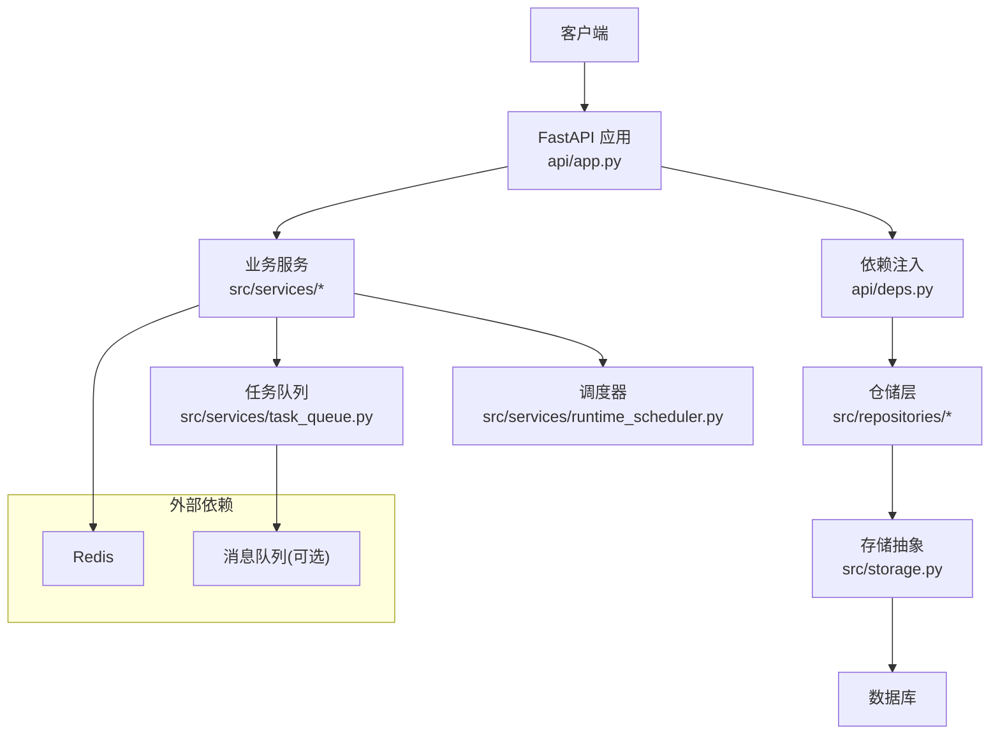
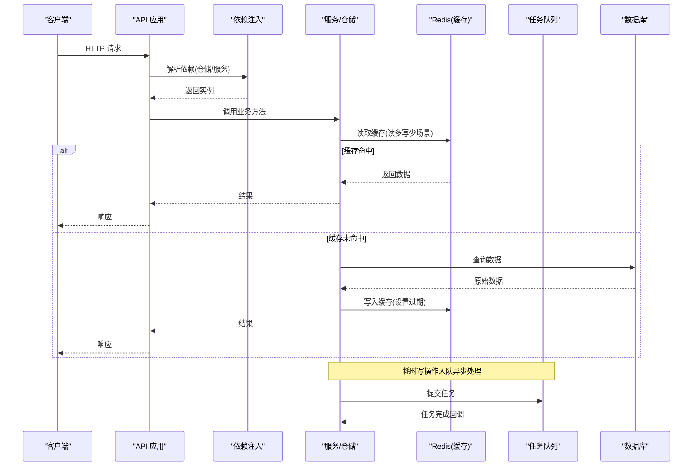
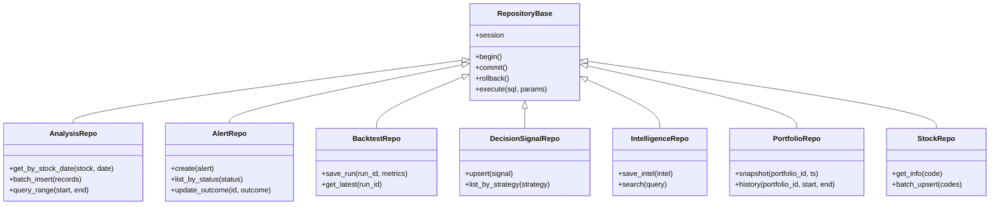
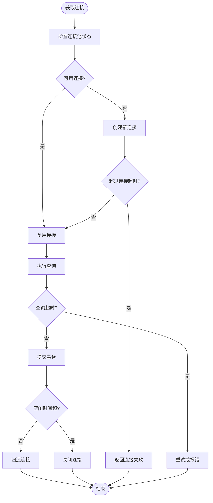
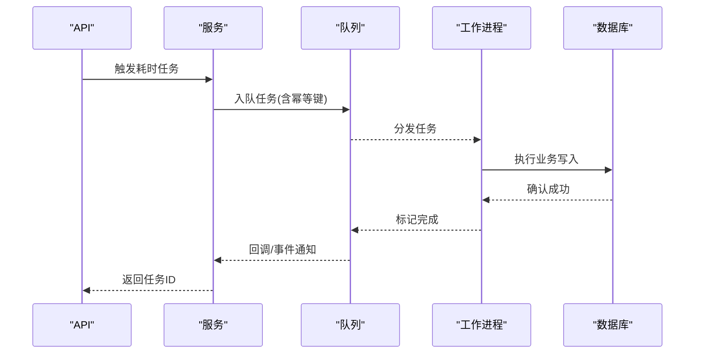
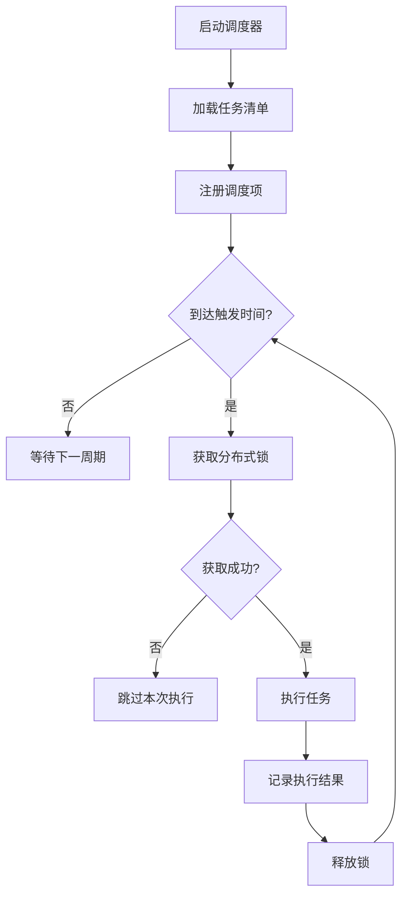
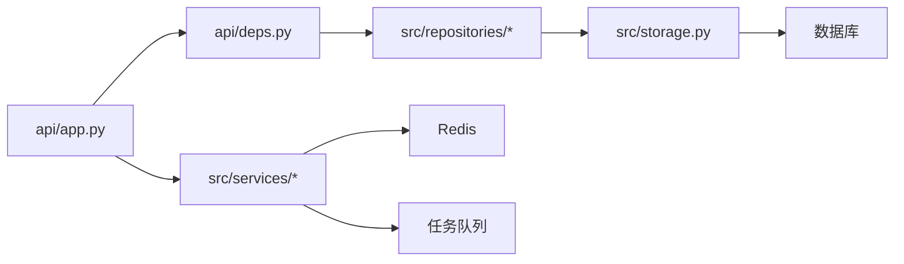

# 性能优化

<cite>
**本文引用的文件**   
- [main.py](file://main.py)
- [server.py](file://server.py)
- [api/app.py](file://api/app.py)
- [api/deps.py](file://api/deps.py)
- [src/config.py](file://src/config.py)
- [src/storage.py](file://src/storage.py)
- [src/repositories/__init__.py](file://src/repositories/__init__.py)
- [src/repositories/analysis_repo.py](file://src/repositories/analysis_repo.py)
- [src/repositories/alert_repo.py](file://src/repositories/alert_repo.py)
- [src/repositories/backtest_repo.py](file://src/repositories/backtest_repo.py)
- [src/repositories/decision_signal_repo.py](file://src/repositories/decision_signal_repo.py)
- [src/repositories/intelligence_repo.py](file://src/repositories/intelligence_repo.py)
- [src/repositories/portfolio_repo.py](file://src/repositories/portfolio_repo.py)
- [src/repositories/stock_repo.py](file://src/repositories/stock_repo.py)
- [src/services/task_queue.py](file://src/services/task_queue.py)
- [src/services/runtime_scheduler.py](file://src/services/runtime_scheduler.py)
- [docker/docker-compose.yml](file://docker/docker-compose.yml)
</cite>

## 目录
1. [简介](#简介)
2. [项目结构](#项目结构)
3. [核心组件](#核心组件)
4. [架构总览](#架构总览)
5. [详细组件分析](#详细组件分析)
6. [依赖关系分析](#依赖关系分析)
7. [性能考虑](#性能考虑)
8. [故障排查指南](#故障排查指南)
9. [结论](#结论)
10. [附录](#附录)

## 简介
本文件面向 Daily Stock Analysis 项目的数据库与数据访问层，聚焦性能优化。内容涵盖：慢查询分析与执行计划解读、索引优化建议；连接池配置调优（连接数、超时、空闲管理）；缓存策略（Redis 使用、失效策略、热点优化）；大数据量处理（分库分表、读写分离、归档）；监控与诊断（指标收集、瓶颈定位、容量规划）；内存管理与 GC 优化（避免泄漏与资源耗尽）。文档以仓库现有代码为依据，结合通用工程实践给出可操作的优化路径。

## 项目结构
Daily Stock Analysis 采用分层架构：API 层通过 FastAPI 暴露接口，依赖注入解析服务与仓储；仓储层封装对持久化存储的访问；后台任务与调度器负责异步处理与定时任务；Docker Compose 编排运行时环境。

图表来源
- [api/app.py:1-200](file://api/app.py#L1-L200)
- [api/deps.py:1-200](file://api/deps.py#L1-L200)
- [src/storage.py:1-200](file://src/storage.py#L1-L200)
- [src/repositories/__init__.py:1-200](file://src/repositories/__init__.py#L1-L200)
- [src/services/task_queue.py:1-200](file://src/services/task_queue.py#L1-L200)
- [src/services/runtime_scheduler.py:1-200](file://src/services/runtime_scheduler.py#L1-L200)

章节来源
- [main.py:1-200](file://main.py#L1-L200)
- [server.py:1-200](file://server.py#L1-L200)
- [api/app.py:1-200](file://api/app.py#L1-L200)
- [api/deps.py:1-200](file://api/deps.py#L1-L200)
- [src/config.py:1-200](file://src/config.py#L1-L200)
- [src/storage.py:1-200](file://src/storage.py#L1-L200)
- [src/repositories/__init__.py:1-200](file://src/repositories/__init__.py#L1-L200)
- [docker/docker-compose.yml:1-200](file://docker/docker-compose.yml#L1-L200)

## 核心组件
- 应用入口与路由注册：FastAPI 应用初始化、中间件、路由挂载与生命周期钩子。
- 依赖注入：统一创建和注入仓储实例、服务实例、配置对象，便于替换实现与测试。
- 仓储层：按领域划分的数据访问封装，屏蔽底层 SQL/ORM 细节，集中事务与重试策略。
- 存储抽象：统一的数据库连接与会话管理，支持连接池、超时、错误重试等。
- 任务队列与调度：异步任务执行与定时任务调度，解耦耗时操作，提升吞吐。
- 配置中心：集中化管理数据库、缓存、队列、日志等运行参数。

章节来源
- [api/app.py:1-200](file://api/app.py#L1-L200)
- [api/deps.py:1-200](file://api/deps.py#L1-L200)
- [src/storage.py:1-200](file://src/storage.py#L1-L200)
- [src/repositories/__init__.py:1-200](file://src/repositories/__init__.py#L1-L200)
- [src/services/task_queue.py:1-200](file://src/services/task_queue.py#L1-L200)
- [src/services/runtime_scheduler.py:1-200](file://src/services/runtime_scheduler.py#L1-L200)
- [src/config.py:1-200](file://src/config.py#L1-L200)

## 架构总览
下图展示请求从 API 到仓储再到数据库的关键路径，以及缓存与任务队列的交互点。

图表来源
- [api/app.py:1-200](file://api/app.py#L1-L200)
- [api/deps.py:1-200](file://api/deps.py#L1-L200)
- [src/storage.py:1-200](file://src/storage.py#L1-L200)
- [src/repositories/__init__.py:1-200](file://src/repositories/__init__.py#L1-L200)
- [src/services/task_queue.py:1-200](file://src/services/task_queue.py#L1-L200)

## 详细组件分析

### 仓储层与数据访问模式
仓储层按领域拆分，每个仓储封装特定实体的 CRUD、批量操作与复杂查询。建议：
- 将高频查询封装为只读视图或物化视图，减少重复计算。
- 使用分页与游标迭代避免一次性加载大结果集。
- 在仓储内统一处理事务边界与重试逻辑，降低上层复杂度。

图表来源
- [src/repositories/__init__.py:1-200](file://src/repositories/__init__.py#L1-L200)
- [src/repositories/analysis_repo.py:1-200](file://src/repositories/analysis_repo.py#L1-L200)
- [src/repositories/alert_repo.py:1-200](file://src/repositories/alert_repo.py#L1-L200)
- [src/repositories/backtest_repo.py:1-200](file://src/repositories/backtest_repo.py#L1-L200)
- [src/repositories/decision_signal_repo.py:1-200](file://src/repositories/decision_signal_repo.py#L1-L200)
- [src/repositories/intelligence_repo.py:1-200](file://src/repositories/intelligence_repo.py#L1-L200)
- [src/repositories/portfolio_repo.py:1-200](file://src/repositories/portfolio_repo.py#L1-L200)
- [src/repositories/stock_repo.py:1-200](file://src/repositories/stock_repo.py#L1-L200)

章节来源
- [src/repositories/__init__.py:1-200](file://src/repositories/__init__.py#L1-L200)
- [src/repositories/analysis_repo.py:1-200](file://src/repositories/analysis_repo.py#L1-L200)
- [src/repositories/alert_repo.py:1-200](file://src/repositories/alert_repo.py#L1-L200)
- [src/repositories/backtest_repo.py:1-200](file://src/repositories/backtest_repo.py#L1-L200)
- [src/repositories/decision_signal_repo.py:1-200](file://src/repositories/decision_signal_repo.py#L1-L200)
- [src/repositories/intelligence_repo.py:1-200](file://src/repositories/intelligence_repo.py#L1-L200)
- [src/repositories/portfolio_repo.py:1-200](file://src/repositories/portfolio_repo.py#L1-L200)
- [src/repositories/stock_repo.py:1-200](file://src/repositories/stock_repo.py#L1-L200)

### 存储抽象与连接池
存储抽象负责数据库会话与连接池管理，建议关注以下方面：
- 连接池大小：根据并发与数据库最大连接数设定，避免连接耗尽。
- 超时设置：连接建立、查询执行、事务提交的超时阈值，防止长尾阻塞。
- 空闲连接回收：定期清理无效连接，降低资源占用。
- 错误重试：对瞬态错误进行指数退避重试，提高稳定性。

图表来源
- [src/storage.py:1-200](file://src/storage.py#L1-L200)

章节来源
- [src/storage.py:1-200](file://src/storage.py#L1-L200)

### 任务队列与异步处理
任务队列用于解耦耗时操作（如批量导入、报表生成、通知发送），建议：
- 合理设置队列并发度与消费者数量，匹配 CPU/IO 能力。
- 实现幂等性与去重键，避免重复消费。
- 增加死信队列与告警，捕获异常任务并人工干预。

图表来源
- [src/services/task_queue.py:1-200](file://src/services/task_queue.py#L1-L200)

章节来源
- [src/services/task_queue.py:1-200](file://src/services/task_queue.py#L1-L200)

### 调度器与定时任务
调度器负责周期性任务（如每日市场上下文更新、指标刷新），建议：
- 使用分布式锁避免多实例重复执行。
- 记录任务执行元数据（开始/结束时间、耗时、状态），便于追踪。
- 支持动态调整调度间隔与开关控制。

图表来源
- [src/services/runtime_scheduler.py:1-200](file://src/services/runtime_scheduler.py#L1-L200)

章节来源
- [src/services/runtime_scheduler.py:1-200](file://src/services/runtime_scheduler.py#L1-L200)

### 配置与环境
配置中心统一管理数据库、缓存、队列、日志等参数，建议：
- 区分开发/测试/生产环境配置，避免硬编码。
- 对敏感信息使用环境变量或密钥管理服务。
- 提供配置校验与默认值回退机制。

章节来源
- [src/config.py:1-200](file://src/config.py#L1-L200)

## 依赖关系分析
仓储层依赖存储抽象，服务层依赖仓储与外部系统（Redis、队列），API 层通过依赖注入组装。

图表来源
- [api/app.py:1-200](file://api/app.py#L1-L200)
- [api/deps.py:1-200](file://api/deps.py#L1-L200)
- [src/repositories/__init__.py:1-200](file://src/repositories/__init__.py#L1-L200)
- [src/storage.py:1-200](file://src/storage.py#L1-L200)
- [src/services/task_queue.py:1-200](file://src/services/task_queue.py#L1-L200)

章节来源
- [api/app.py:1-200](file://api/app.py#L1-L200)
- [api/deps.py:1-200](file://api/deps.py#L1-L200)
- [src/repositories/__init__.py:1-200](file://src/repositories/__init__.py#L1-L200)
- [src/storage.py:1-200](file://src/storage.py#L1-L200)
- [src/services/task_queue.py:1-200](file://src/services/task_queue.py#L1-L200)

## 性能考虑

### 慢查询分析与执行计划解读
- 启用慢查询日志，采集执行时长超过阈值的 SQL 与上下文。
- 使用 EXPLAIN/EXPLAIN ANALYZE 查看执行计划，关注全表扫描、临时表、文件排序、回表等。
- 针对高延迟查询，优先优化 WHERE 条件与 JOIN 顺序，必要时引入覆盖索引。
- 对聚合与窗口函数，尽量下推过滤条件至底层，减少中间结果集。

章节来源
- [src/storage.py:1-200](file://src/storage.py#L1-L200)
- [src/repositories/analysis_repo.py:1-200](file://src/repositories/analysis_repo.py#L1-L200)
- [src/repositories/alert_repo.py:1-200](file://src/repositories/alert_repo.py#L1-L200)
- [src/repositories/backtest_repo.py:1-200](file://src/repositories/backtest_repo.py#L1-L200)
- [src/repositories/decision_signal_repo.py:1-200](file://src/repositories/decision_signal_repo.py#L1-L200)
- [src/repositories/intelligence_repo.py:1-200](file://src/repositories/intelligence_repo.py#L1-L200)
- [src/repositories/portfolio_repo.py:1-200](file://src/repositories/portfolio_repo.py#L1-L200)
- [src/repositories/stock_repo.py:1-200](file://src/repositories/stock_repo.py#L1-L200)

### 索引优化建议
- 为高频过滤列（如股票代码、日期范围、状态字段）建立单列或多列复合索引。
- 对排序与分组字段，评估是否可通过覆盖索引避免回表。
- 避免过度索引导致写入放大，定期评估索引命中率与选择性。
- 对分区表，确保分区键与查询谓词一致，提升分区裁剪效果。

章节来源
- [src/repositories/analysis_repo.py:1-200](file://src/repositories/analysis_repo.py#L1-L200)
- [src/repositories/alert_repo.py:1-200](file://src/repositories/alert_repo.py#L1-L200)
- [src/repositories/backtest_repo.py:1-200](file://src/repositories/backtest_repo.py#L1-L200)
- [src/repositories/decision_signal_repo.py:1-200](file://src/repositories/decision_signal_repo.py#L1-L200)
- [src/repositories/intelligence_repo.py:1-200](file://src/repositories/intelligence_repo.py#L1-L200)
- [src/repositories/portfolio_repo.py:1-200](file://src/repositories/portfolio_repo.py#L1-L200)
- [src/repositories/stock_repo.py:1-200](file://src/repositories/stock_repo.py#L1-L200)

### 连接池配置调优
- 连接数限制：根据峰值并发与数据库最大连接数，设置最小/最大连接数，预留余量。
- 超时设置：连接超时、查询超时、事务超时分别配置，避免长事务占用连接。
- 空闲连接管理：设置空闲回收时间与最大空闲连接数，及时释放无用连接。
- 健康检查：定期探测连接可用性，失败自动剔除并重建。

章节来源
- [src/storage.py:1-200](file://src/storage.py#L1-L200)
- [src/config.py:1-200](file://src/config.py#L1-L200)

### 缓存策略的实现
- 使用 Redis 缓存热点数据（如股票基础信息、近期行情、分析报告摘要）。
- 缓存键设计包含实体 ID 与版本/时间戳，避免脏读。
- 失效策略：TTL 过期、主动失效（写后删）、懒加载（读时重建）。
- 热点优化：本地二级缓存（进程内 LRU）+ 分布式缓存（Redis），多级一致性由版本号保障。

章节来源
- [src/storage.py:1-200](file://src/storage.py#L1-L200)
- [src/repositories/analysis_repo.py:1-200](file://src/repositories/analysis_repo.py#L1-L200)
- [src/repositories/stock_repo.py:1-200](file://src/repositories/stock_repo.py#L1-L200)

### 大数据量处理方案
- 分库分表：按股票代码或时间范围水平分片，路由规则清晰，跨分片查询降级为合并。
- 读写分离：主库写、从库读，读多写少场景显著降低主库压力。
- 归档策略：历史数据按月/季度归档至冷存储，在线库仅保留热数据窗口。
- 批量写入：使用批量插入与事务合并，减少网络往返与锁竞争。

章节来源
- [src/repositories/analysis_repo.py:1-200](file://src/repositories/analysis_repo.py#L1-L200)
- [src/repositories/backtest_repo.py:1-200](file://src/repositories/backtest_repo.py#L1-L200)
- [src/repositories/portfolio_repo.py:1-200](file://src/repositories/portfolio_repo.py#L1-L200)

### 监控与诊断工具
- 指标收集：暴露 QPS、P95/P99 延迟、连接池使用率、缓存命中率、队列积压。
- 瓶颈分析：链路追踪（Trace）串联 API-服务-仓储-数据库，定位慢点。
- 容量规划：基于历史增长趋势预测存储与计算需求，提前扩容。
- 告警策略：关键指标阈值告警，快速发现异常。

章节来源
- [src/services/task_queue.py:1-200](file://src/services/task_queue.py#L1-L200)
- [src/services/runtime_scheduler.py:1-200](file://src/services/runtime_scheduler.py#L1-L200)
- [src/storage.py:1-200](file://src/storage.py#L1-L200)

### 内存管理与垃圾回收优化
- 避免大对象常驻内存：流式处理、分页读取、及时释放引用。
- 合理使用缓存：限制缓存大小与 TTL，防止 OOM。
- 监控 GC 行为：观察 Full GC 频率与停顿时间，调整堆大小与回收器参数。
- 资源泄漏防护：显式关闭连接、文件句柄，使用上下文管理器保证释放。

章节来源
- [src/storage.py:1-200](file://src/storage.py#L1-L200)
- [src/repositories/analysis_repo.py:1-200](file://src/repositories/analysis_repo.py#L1-L200)
- [src/repositories/backtest_repo.py:1-200](file://src/repositories/backtest_repo.py#L1-L200)

## 故障排查指南
- 连接池耗尽：检查最大连接数、超时设置、是否存在长事务或未释放连接。
- 慢查询突增：查看慢查询日志与执行计划，定位缺失索引或不当 JOIN。
- 缓存穿透/雪崩：增加空值缓存、随机 TTL、限流与熔断。
- 队列堆积：提升消费者数量、优化任务粒度、排查下游依赖延迟。
- 内存飙升：分析对象生命周期、减少大对象分配、开启内存快照分析。

章节来源
- [src/storage.py:1-200](file://src/storage.py#L1-L200)
- [src/services/task_queue.py:1-200](file://src/services/task_queue.py#L1-L200)
- [src/repositories/analysis_repo.py:1-200](file://src/repositories/analysis_repo.py#L1-L200)

## 结论
通过对仓储层、存储抽象、任务队列与调度器的系统化优化，结合索引、连接池、缓存与大数据处理策略，可显著提升 Daily Stock Analysis 的数据库性能与稳定性。持续监控与容量规划是长期演进的关键。

## 附录
- Docker Compose 编排示例：数据库、Redis、队列服务的部署与网络配置。
- 配置模板：数据库、缓存、队列、日志的环境变量与默认值。

章节来源
- [docker/docker-compose.yml:1-200](file://docker/docker-compose.yml#L1-L200)
- [src/config.py:1-200](file://src/config.py#L1-L200)