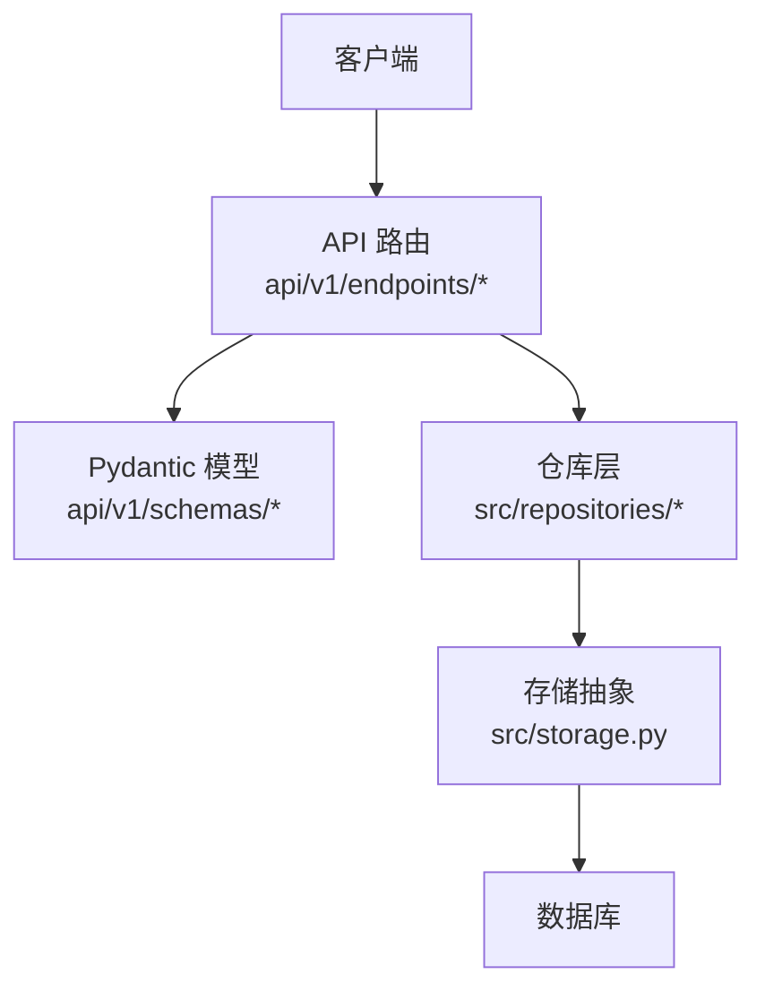
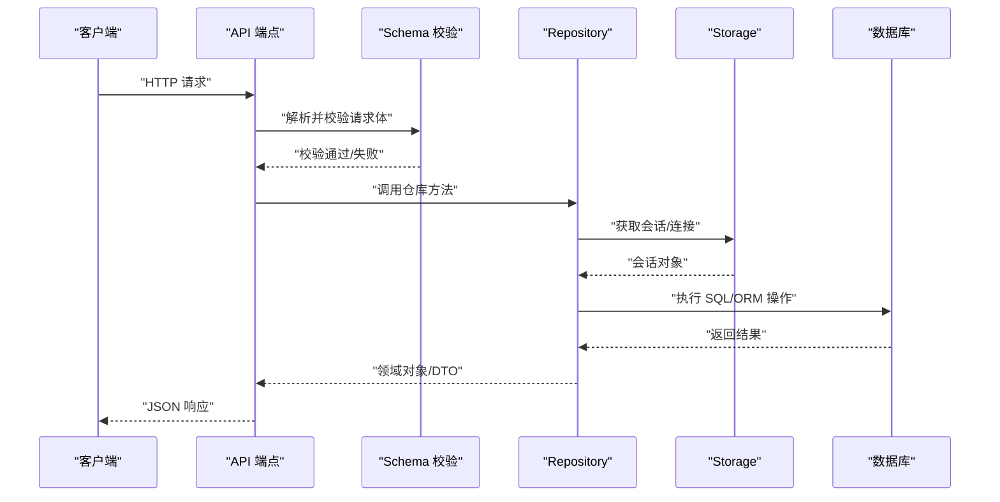
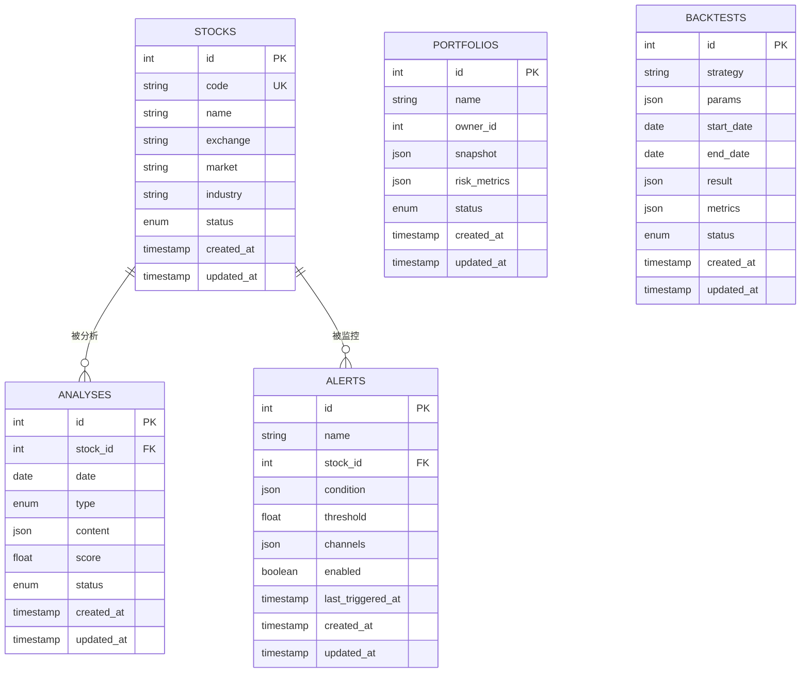
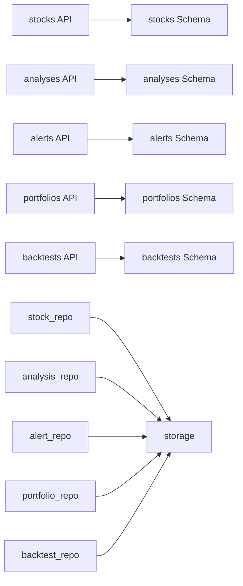

# 数据库表结构

<cite>
**本文引用的文件**   
- [storage.py](file://src/storage.py)
- [stock_repo.py](file://src/repositories/stock_repo.py)
- [analysis_repo.py](file://src/repositories/analysis_repo.py)
- [alert_repo.py](file://src/repositories/alert_repo.py)
- [portfolio_repo.py](file://src/repositories/portfolio_repo.py)
- [backtest_repo.py](file://src/repositories/backtest_repo.py)
- [api/v1/endpoints/stocks.py](file://api/v1/endpoints/stocks.py)
- [api/v1/endpoints/analysis.py](file://api/v1/endpoints/analysis.py)
- [api/v1/endpoints/alerts.py](file://api/v1/endpoints/alerts.py)
- [api/v1/endpoints/portfolio.py](file://api/v1/endpoints/portfolio.py)
- [api/v1/endpoints/backtest.py](file://api/v1/endpoints/backtest.py)
- [api/v1/schemas/stocks.py](file://api/v1/schemas/stocks.py)
- [api/v1/schemas/analysis.py](file://api/v1/schemas/analysis.py)
- [api/v1/schemas/alerts.py](file://api/v1/schemas/alerts.py)
- [api/v1/schemas/portfolio.py](file://api/v1/schemas/portfolio.py)
- [api/v1/schemas/backtest.py](file://api/v1/schemas/backtest.py)
</cite>

## 目录
1. [简介](#简介)
2. [项目结构](#项目结构)
3. [核心组件](#核心组件)
4. [架构总览](#架构总览)
5. [详细组件分析](#详细组件分析)
6. [依赖关系分析](#依赖关系分析)
7. [性能考虑](#性能考虑)
8. [故障排查指南](#故障排查指南)
9. [结论](#结论)
10. [附录](#附录)

## 简介
本文件为 Daily Stock Analysis 项目的数据库表结构文档，聚焦于 stocks、analyses、alerts、portfolios、backtests 等核心表的设计与实现。内容涵盖字段定义、数据类型选择、约束与默认值、表间关系（外键与关联）、索引设计与优化策略、数据完整性约束与业务规则落地方式，以及版本管理与迁移策略建议。读者无需深入代码即可理解整体设计思路与使用方式。

## 项目结构
本项目采用“API 层 + Schema 校验 + Repository 持久化”的分层架构：
- API 层负责请求路由与响应序列化
- Schema 层通过 Pydantic 模型对输入输出进行强类型校验
- Repository 层封装数据库访问逻辑，通常基于 SQLAlchemy ORM
- storage.py 提供数据库连接与会话管理

图表来源
- [api/v1/endpoints/stocks.py](file://api/v1/endpoints/stocks.py)
- [api/v1/schemas/stocks.py](file://api/v1/schemas/stocks.py)
- [src/repositories/stock_repo.py](file://src/repositories/stock_repo.py)
- [src/storage.py](file://src/storage.py)

章节来源
- [storage.py](file://src/storage.py)
- [api/v1/endpoints/stocks.py](file://api/v1/endpoints/stocks.py)
- [api/v1/schemas/stocks.py](file://api/v1/schemas/stocks.py)
- [src/repositories/stock_repo.py](file://src/repositories/stock_repo.py)

## 核心组件
- 股票主数据表（stocks）：维护股票代码、名称、市场、状态等基础信息
- 分析结果表（analyses）：记录对单只或多只股票的每日/周期性分析结果
- 预警表（alerts）：保存触发条件、阈值、通知渠道与执行状态
- 投资组合表（portfolios）：管理组合基本信息、持仓快照与风险指标
- 回测表（backtests）：记录回测任务配置、参数、运行结果与绩效统计

章节来源
- [api/v1/schemas/stocks.py](file://api/v1/schemas/stocks.py)
- [api/v1/schemas/analysis.py](file://api/v1/schemas/analysis.py)
- [api/v1/schemas/alerts.py](file://api/v1/schemas/alerts.py)
- [api/v1/schemas/portfolio.py](file://api/v1/schemas/portfolio.py)
- [api/v1/schemas/backtest.py](file://api/v1/schemas/backtest.py)

## 架构总览
下图展示了从 API 到数据库的调用链路与数据流向，强调各层职责与数据一致性保障点。

图表来源
- [api/v1/endpoints/stocks.py](file://api/v1/endpoints/stocks.py)
- [api/v1/schemas/stocks.py](file://api/v1/schemas/stocks.py)
- [src/repositories/stock_repo.py](file://src/repositories/stock_repo.py)
- [src/storage.py](file://src/storage.py)

## 详细组件分析

### 股票表（stocks）
- 用途：存储股票主数据，包括代码、名称、交易所、行业、上市状态等
- 关键字段建议
  - id：主键，自增或 UUID
  - code：股票代码，唯一索引
  - name：股票名称
  - exchange：交易所标识
  - market：市场分类（如 A 股、港股、美股）
  - industry：行业分类
  - status：上市状态（正常、停牌、退市）
  - created_at / updated_at：时间戳
- 约束与默认值
  - code 唯一约束
  - status 默认“正常”
  - created_at/updated_at 自动填充
- 索引策略
  - 对 code、exchange、market 建立索引以支持快速检索
- 业务规则
  - code 全局唯一
  - 更新时同步 updated_at
- 建表示例要点
  - 主键、唯一约束、非空约束、默认值、时间戳
  - 复合索引用于常用查询场景（如按市场+交易所筛选）

章节来源
- [api/v1/schemas/stocks.py](file://api/v1/schemas/stocks.py)
- [src/repositories/stock_repo.py](file://src/repositories/stock_repo.py)

### 分析结果表（analyses）
- 用途：记录对股票的分析结果，包含技术指标、基本面摘要、LLM 生成文本、评分等
- 关键字段建议
  - id：主键
  - stock_id：外键关联 stocks.id
  - date：分析日期
  - type：分析类型（技术面、基本面、综合）
  - content：结构化 JSON 或文本内容
  - score：综合评分
  - status：处理状态（待处理、成功、失败）
  - created_at / updated_at
- 约束与默认值
  - stock_id 非空且存在性约束
  - date 与 stock_id 联合唯一（避免重复分析）
  - status 默认“待处理”
- 索引策略
  - 对 stock_id、date、type 建立索引
  - 对 status 建立索引便于任务调度
- 业务规则
  - 同一股票同一天仅允许一条指定类型的分析记录
  - 失败重试需保留历史轨迹
- 建表示例要点
  - 外键约束、联合唯一约束、JSON 字段、时间戳
  - 分区表可按 date 分区以提升查询性能

章节来源
- [api/v1/schemas/analysis.py](file://api/v1/schemas/analysis.py)
- [src/repositories/analysis_repo.py](file://src/repositories/analysis_repo.py)

### 预警表（alerts）
- 用途：管理预警规则、触发条件、通知渠道与执行日志
- 关键字段建议
  - id：主键
  - name：预警名称
  - stock_id：可选，关联特定股票；为空表示全市场
  - condition：条件表达式（JSON）
  - threshold：阈值
  - channels：通知渠道列表（JSON）
  - enabled：是否启用
  - last_triggered_at：最后触发时间
  - created_at / updated_at
- 约束与默认值
  - enabled 默认 true
  - channels 默认空数组
- 索引策略
  - 对 stock_id、enabled 建立索引
  - 对 last_triggered_at 建立索引用于清理过期记录
- 业务规则
  - 条件表达式需可解析与评估
  - 触发后写入触发日志表（建议独立表）
- 建表示例要点
  - JSON 字段、布尔开关、时间戳
  - 外键可选关联 stocks

章节来源
- [api/v1/schemas/alerts.py](file://api/v1/schemas/alerts.py)
- [src/repositories/alert_repo.py](file://src/repositories/alert_repo.py)

### 投资组合表（portfolios）
- 用途：管理投资组合信息与持仓快照、风险指标
- 关键字段建议
  - id：主键
  - name：组合名称
  - owner_id：所有者标识
  - snapshot：持仓快照（JSON）
  - risk_metrics：风险指标（JSON）
  - status：状态（活跃、冻结）
  - created_at / updated_at
- 约束与默认值
  - status 默认“活跃”
  - snapshot/risk_metrics 默认空对象
- 索引策略
  - 对 owner_id、status 建立索引
- 业务规则
  - 快照需带版本号或时间戳以保证可追溯
  - 冻结期间禁止交易变更
- 建表示例要点
  - JSON 字段、状态枚举、时间戳
  - 外键关联用户表（若存在）

章节来源
- [api/v1/schemas/portfolio.py](file://api/v1/schemas/portfolio.py)
- [src/repositories/portfolio_repo.py](file://src/repositories/portfolio_repo.py)

### 回测表（backtests）
- 用途：记录回测任务配置、参数、运行结果与绩效统计
- 关键字段建议
  - id：主键
  - strategy：策略标识
  - params：回测参数（JSON）
  - start_date / end_date：回测区间
  - result：结果摘要（JSON）
  - metrics：绩效指标（JSON）
  - status：状态（运行中、成功、失败）
  - created_at / updated_at
- 约束与默认值
  - status 默认“运行中”
  - metrics/result 默认空对象
- 索引策略
  - 对 strategy、status、start_date 建立索引
- 业务规则
  - 同一策略同一参数集应可多次运行并对比
  - 失败任务需保留错误信息以便复现
- 建表示例要点
  - JSON 字段、状态枚举、时间戳
  - 复合索引用于按策略+时间段查询

章节来源
- [api/v1/schemas/backtest.py](file://api/v1/schemas/backtest.py)
- [src/repositories/backtest_repo.py](file://src/repositories/backtest_repo.py)

### 表关系图

图表来源
- [api/v1/schemas/stocks.py](file://api/v1/schemas/stocks.py)
- [api/v1/schemas/analysis.py](file://api/v1/schemas/analysis.py)
- [api/v1/schemas/alerts.py](file://api/v1/schemas/alerts.py)
- [api/v1/schemas/portfolio.py](file://api/v1/schemas/portfolio.py)
- [api/v1/schemas/backtest.py](file://api/v1/schemas/backtest.py)

## 依赖关系分析
- API 层依赖 Schema 层进行输入校验，确保进入系统的数据符合预期
- Repository 层依赖 storage.py 提供的数据库会话/连接管理
- 表间通过外键约束保证引用完整性，减少脏数据
- 索引设计围绕高频查询路径优化，平衡写入性能

图表来源
- [api/v1/endpoints/stocks.py](file://api/v1/endpoints/stocks.py)
- [api/v1/endpoints/analysis.py](file://api/v1/endpoints/analysis.py)
- [api/v1/endpoints/alerts.py](file://api/v1/endpoints/alerts.py)
- [api/v1/endpoints/portfolio.py](file://api/v1/endpoints/portfolio.py)
- [api/v1/endpoints/backtest.py](file://api/v1/endpoints/backtest.py)
- [api/v1/schemas/stocks.py](file://api/v1/schemas/stocks.py)
- [api/v1/schemas/analysis.py](file://api/v1/schemas/analysis.py)
- [api/v1/schemas/alerts.py](file://api/v1/schemas/alerts.py)
- [api/v1/schemas/portfolio.py](file://api/v1/schemas/portfolio.py)
- [api/v1/schemas/backtest.py](file://api/v1/schemas/backtest.py)
- [src/repositories/stock_repo.py](file://src/repositories/stock_repo.py)
- [src/repositories/analysis_repo.py](file://src/repositories/analysis_repo.py)
- [src/repositories/alert_repo.py](file://src/repositories/alert_repo.py)
- [src/repositories/portfolio_repo.py](file://src/repositories/portfolio_repo.py)
- [src/repositories/backtest_repo.py](file://src/repositories/backtest_repo.py)
- [src/storage.py](file://src/storage.py)

章节来源
- [src/storage.py](file://src/storage.py)
- [src/repositories/stock_repo.py](file://src/repositories/stock_repo.py)
- [src/repositories/analysis_repo.py](file://src/repositories/analysis_repo.py)
- [src/repositories/alert_repo.py](file://src/repositories/alert_repo.py)
- [src/repositories/portfolio_repo.py](file://src/repositories/portfolio_repo.py)
- [src/repositories/backtest_repo.py](file://src/repositories/backtest_repo.py)

## 性能考虑
- 索引设计
  - 针对高频过滤字段（如 stock_id、date、status、exchange、market）建立索引
  - 复合索引覆盖常见查询模式（如 stock_id + date）
- 分区与分表
  - analyses 与 backtests 可按时间分区，提升历史数据查询效率
- 读写分离
  - 分析任务与回测任务写多读少，建议异步写入与缓存热点数据
- JSON 字段
  - 合理拆分频繁查询的 JSON 子字段为独立列，必要时建立生成列或虚拟列索引
- 事务与锁
  - 批量写入使用事务，避免长事务导致锁竞争
- 缓存策略
  - 对股票字典、指数映射等静态数据使用内存缓存

[本节为通用性能建议，不直接分析具体文件]

## 故障排查指南
- 常见问题
  - 外键约束冲突：检查删除顺序与级联策略
  - 唯一约束冲突：确认 code、stock_id+date 等唯一键是否重复插入
  - JSON 字段解析失败：校验 Schema 与入库前数据格式
- 定位手段
  - 查看 Repository 层的异常捕获与日志
  - 检查 storage.py 的连接池与事务状态
  - 使用慢查询日志定位未命中索引的查询
- 恢复策略
  - 对失败任务进行幂等重试
  - 对损坏数据进行备份与修复脚本

章节来源
- [src/storage.py](file://src/storage.py)
- [src/repositories/stock_repo.py](file://src/repositories/stock_repo.py)
- [src/repositories/analysis_repo.py](file://src/repositories/analysis_repo.py)
- [src/repositories/alert_repo.py](file://src/repositories/alert_repo.py)
- [src/repositories/portfolio_repo.py](file://src/repositories/portfolio_repo.py)
- [src/repositories/backtest_repo.py](file://src/repositories/backtest_repo.py)

## 结论
本表结构设计围绕股票分析、预警、投资组合与回测四大核心能力展开，通过清晰的字段定义、严格的约束与合理的索引策略，确保数据一致性与查询性能。建议在后续迭代中逐步引入分区表、物化视图与更细粒度的权限控制，以支撑更大规模的数据与分析任务。

[本节为总结性内容，不直接分析具体文件]

## 附录

### 完整建表示例（要点说明）
以下为各表的建表语句要点，实际实现请以 ORM 迁移为准：
- stocks
  - 主键 id
  - 唯一约束 code
  - 非空约束 name、exchange、market、status
  - 默认值 status="正常"
  - 时间戳 created_at、updated_at
  - 索引：code、exchange、market
- analyses
  - 主键 id
  - 外键 stock_id 引用 stocks.id
  - 联合唯一 stock_id + date + type
  - 非空约束 date、type、status
  - 默认值 status="待处理"
  - 时间戳 created_at、updated_at
  - 索引：stock_id、date、type、status
- alerts
  - 主键 id
  - 可选外键 stock_id 引用 stocks.id
  - 非空约束 name、condition、threshold
  - 默认值 enabled=true、channels=[]
  - 时间戳 created_at、updated_at、last_triggered_at
  - 索引：stock_id、enabled、last_triggered_at
- portfolios
  - 主键 id
  - 非空约束 name、owner_id、status
  - 默认值 status="活跃"、snapshot={}、risk_metrics={}
  - 时间戳 created_at、updated_at
  - 索引：owner_id、status
- backtests
  - 主键 id
  - 非空约束 strategy、params、start_date、end_date、status
  - 默认值 status="运行中"、result={}、metrics={}
  - 时间戳 created_at、updated_at
  - 索引：strategy、status、start_date

[本节为概念性示例，不直接分析具体文件]

### 版本管理与迁移策略
- 使用迁移工具（如 Alembic）管理 DDL 变更
- 每次变更创建独立迁移脚本，保持可回滚
- 大表变更采用增量式（添加列/索引、分批重建）
- 发布前在预发环境验证迁移脚本与数据兼容性
- 对关键表增加审计字段（如 _version、_changed_by）

[本节为通用实践建议，不直接分析具体文件]