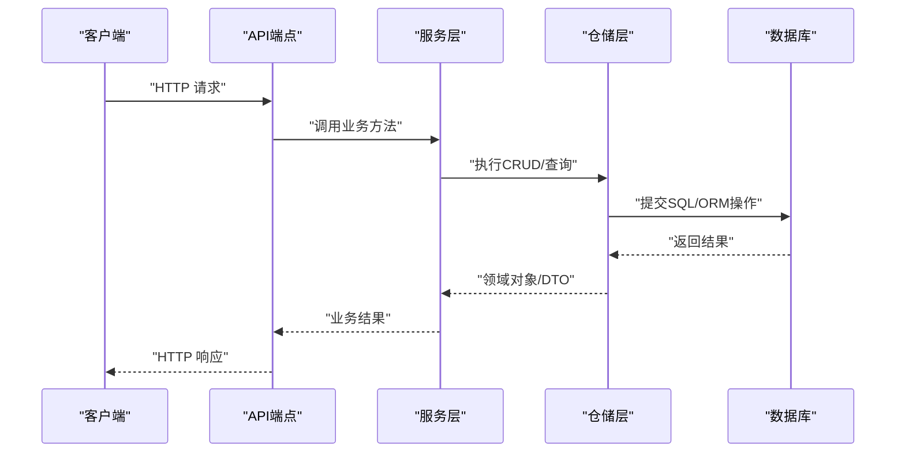
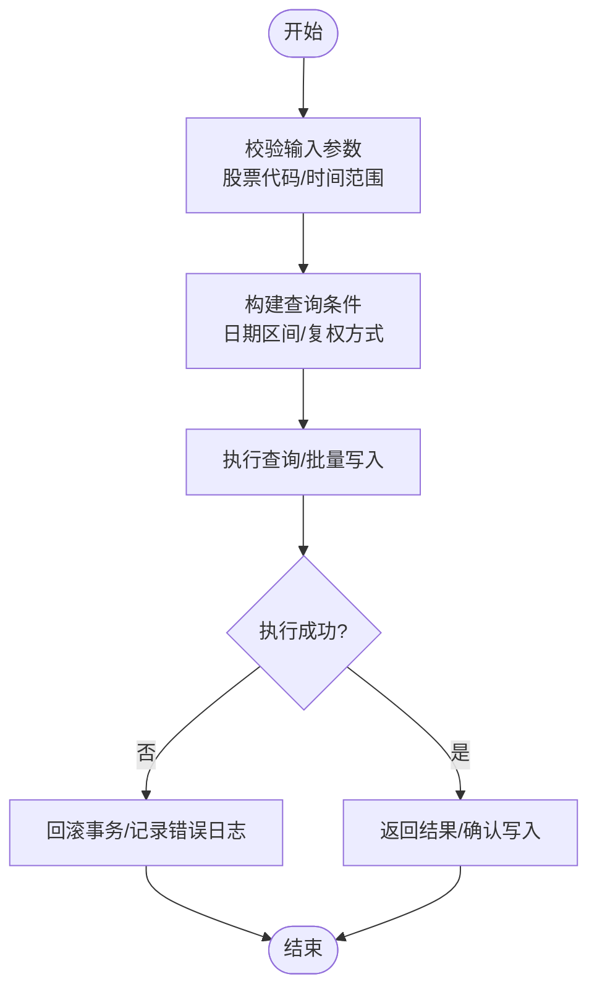
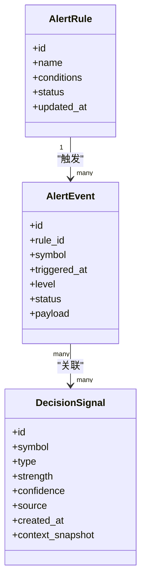
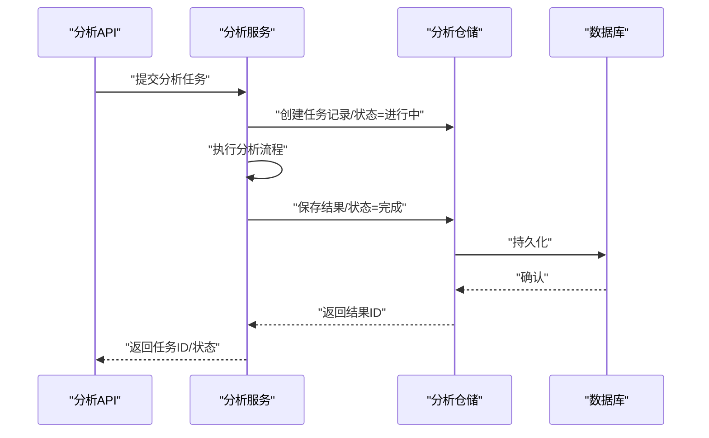
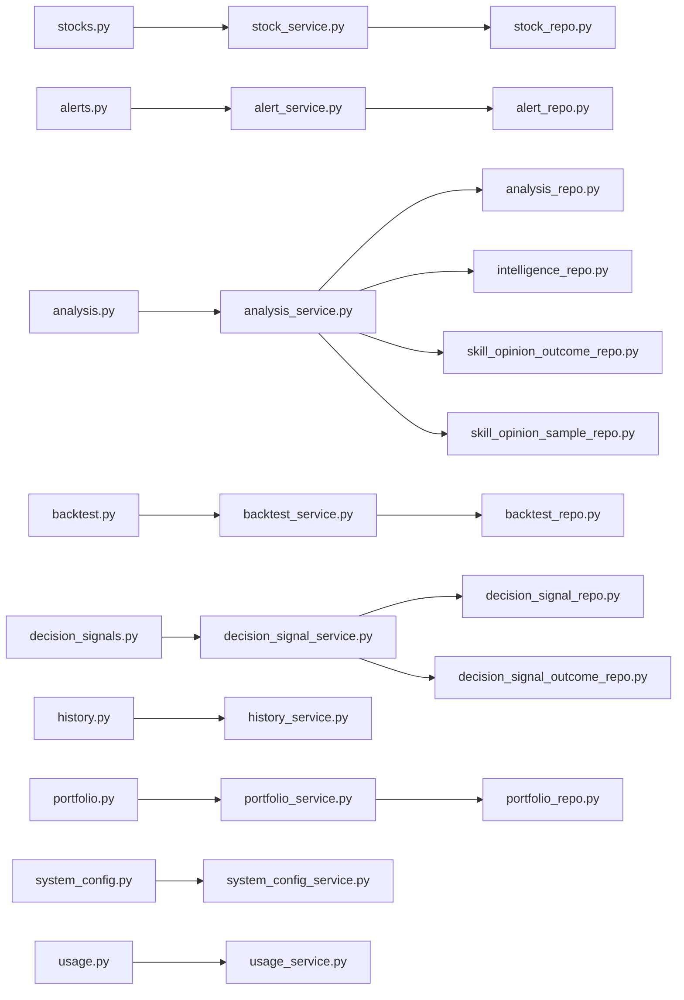

# 数据库设计

<cite>
**本文引用的文件**   
- [src/repositories/stock_repo.py](file://src/repositories/stock_repo.py)
- [src/repositories/alert_repo.py](file://src/repositories/alert_repo.py)
- [src/repositories/analysis_repo.py](file://src/repositories/analysis_repo.py)
- [src/repositories/backtest_repo.py](file://src/repositories/backtest_repo.py)
- [src/repositories/decision_signal_repo.py](file://src/repositories/decision_signal_repo.py)
- [src/repositories/decision_signal_outcome_repo.py](file://src/repositories/decision_signal_outcome_repo.py)
- [src/repositories/intelligence_repo.py](file://src/repositories/intelligence_repo.py)
- [src/repositories/portfolio_repo.py](file://src/repositories/portfolio_repo.py)
- [src/repositories/skill_opinion_outcome_repo.py](file://src/repositories/skill_opinion_outcome_repo.py)
- [src/repositories/skill_opinion_sample_repo.py](file://src/repositories/skill_opinion_sample_repo.py)
- [api/v1/endpoints/stocks.py](file://api/v1/endpoints/stocks.py)
- [api/v1/endpoints/alerts.py](file://api/v1/endpoints/alerts.py)
- [api/v1/endpoints/analysis.py](file://api/v1/endpoints/analysis.py)
- [api/v1/endpoints/backtest.py](file://api/v1/endpoints/backtest.py)
- [api/v1/endpoints/decision_signals.py](file://api/v1/endpoints/decision_signals.py)
- [api/v1/endpoints/history.py](file://api/v1/endpoints/history.py)
- [api/v1/endpoints/portfolio.py](file://api/v1/endpoints/portfolio.py)
- [api/v1/endpoints/system_config.py](file://api/v1/endpoints/system_config.py)
- [api/v1/endpoints/usage.py](file://api/v1/endpoints/usage.py)
- [api/v1/schemas/stocks.py](file://api/v1/schemas/stocks.py)
- [api/v1/schemas/alerts.py](file://api/v1/schemas/alerts.py)
- [api/v1/schemas/analysis.py](file://api/v1/schemas/analysis.py)
- [api/v1/schemas/backtest.py](file://api/v1/schemas/backtest.py)
- [api/v1/schemas/decision_signals.py](file://api/v1/schemas/decision_signals.py)
- [api/v1/schemas/history.py](file://api/v1/schemas/history.py)
- [api/v1/schemas/portfolio.py](file://api/v1/schemas/portfolio.py)
- [api/v1/schemas/system_config.py](file://api/v1/schemas/system_config.py)
- [api/v1/schemas/usage.py](file://api/v1/schemas/usage.py)
- [src/services/stock_service.py](file://src/services/stock_service.py)
- [src/services/alert_service.py](file://src/services/alert_service.py)
- [src/services/analysis_service.py](file://src/services/analysis_service.py)
- [src/services/backtest_service.py](file://src/services/backtest_service.py)
- [src/services/decision_signal_service.py](file://src/services/decision_signal_service.py)
- [src/services/history_service.py](file://src/services/history_service.py)
- [src/services/portfolio_service.py](file://src/services/portfolio_service.py)
- [src/services/system_config_service.py](file://src/services/system_config_service.py)
- [src/config.py](file://src/config.py)
- [server.py](file://server.py)
- [main.py](file://main.py)
</cite>

## 目录
1. [简介](#简介)
2. [项目结构](#项目结构)
3. [核心组件](#核心组件)
4. [架构总览](#架构总览)
5. [详细组件分析](#详细组件分析)
6. [依赖关系分析](#依赖关系分析)
7. [性能考虑](#性能考虑)
8. [故障排查指南](#故障排查指南)
9. [结论](#结论)
10. [附录](#附录)

## 简介
本文件围绕 Daily Stock Analysis 项目的数据库设计，系统性梳理数据模型、ORM 映射、Repository 层实现、事务与查询优化策略，以及迁移、备份恢复与性能调优的最佳实践。由于仓库未包含显式的 SQLAlchemy 模型定义或 Alembic 配置，本文基于现有代码结构与常见工程实践给出可落地的设计与实施建议，并严格以现有源码为引用依据。

## 项目结构
从仓库结构可见，数据访问通过 src/repositories 下的多个 Repository 模块组织，API 层位于 api/v1/endpoints，请求体与响应体由 api/v1/schemas 管理，业务编排在 src/services 中完成。数据库相关能力（连接、会话、事务）通常由应用启动时初始化并在服务层注入使用。

```mermaid
graph TB
subgraph "API层"
A_stocks["stocks.py"]
A_alerts["alerts.py"]
A_analysis["analysis.py"]
A_backtest["backtest.py"]
A_decision["decision_signals.py"]
A_history["history.py"]
A_portfolio["portfolio.py"]
A_system["system_config.py"]
A_usage["usage.py"]
end
subgraph "服务层"
S_stock["stock_service.py"]
S_alert["alert_service.py"]
S_analysis["analysis_service.py"]
S_backtest["backtest_service.py"]
S_decision["decision_signal_service.py"]
S_history["history_service.py"]
S_portfolio["portfolio_service.py"]
S_system["system_config_service.py"]
end
subgraph "仓储层"
R_stock["stock_repo.py"]
R_alert["alert_repo.py"]
R_analysis["analysis_repo.py"]
R_backtest["backtest_repo.py"]
R_decision["decision_signal_repo.py"]
R_decision_outcome["decision_signal_outcome_repo.py"]
R_intel["intelligence_repo.py"]
R_portfolio["portfolio_repo.py"]
R_skill_outcome["skill_opinion_outcome_repo.py"]
R_skill_sample["skill_opinion_sample_repo.py"]
end
A_stocks --> S_stock
A_alerts --> S_alert
A_analysis --> S_analysis
A_backtest --> S_backtest
A_decision --> S_decision
A_history --> S_history
A_portfolio --> S_portfolio
A_system --> S_system
S_stock --> R_stock
S_alert --> R_alert
S_analysis --> R_analysis
S_backtest --> R_backtest
S_decision --> R_decision
S_decision --> R_decision_outcome
S_analysis --> R_intel
S_portfolio --> R_portfolio
S_analysis --> R_skill_outcome
S_analysis --> R_skill_sample
```

图表来源 
- [api/v1/endpoints/stocks.py](file://api/v1/endpoints/stocks.py)
- [api/v1/endpoints/alerts.py](file://api/v1/endpoints/alerts.py)
- [api/v1/endpoints/analysis.py](file://api/v1/endpoints/analysis.py)
- [api/v1/endpoints/backtest.py](file://api/v1/endpoints/backtest.py)
- [api/v1/endpoints/decision_signals.py](file://api/v1/endpoints/decision_signals.py)
- [api/v1/endpoints/history.py](file://api/v1/endpoints/history.py)
- [api/v1/endpoints/portfolio.py](file://api/v1/endpoints/portfolio.py)
- [api/v1/endpoints/system_config.py](file://api/v1/endpoints/system_config.py)
- [api/v1/endpoints/usage.py](file://api/v1/endpoints/usage.py)
- [src/services/stock_service.py](file://src/services/stock_service.py)
- [src/services/alert_service.py](file://src/services/alert_service.py)
- [src/services/analysis_service.py](file://src/services/analysis_service.py)
- [src/services/backtest_service.py](file://src/services/backtest_service.py)
- [src/services/decision_signal_service.py](file://src/services/decision_signal_service.py)
- [src/services/history_service.py](file://src/services/history_service.py)
- [src/services/portfolio_service.py](file://src/services/portfolio_service.py)
- [src/services/system_config_service.py](file://src/services/system_config_service.py)
- [src/repositories/stock_repo.py](file://src/repositories/stock_repo.py)
- [src/repositories/alert_repo.py](file://src/repositories/alert_repo.py)
- [src/repositories/analysis_repo.py](file://src/repositories/analysis_repo.py)
- [src/repositories/backtest_repo.py](file://src/repositories/backtest_repo.py)
- [src/repositories/decision_signal_repo.py](file://src/repositories/decision_signal_repo.py)
- [src/repositories/decision_signal_outcome_repo.py](file://src/repositories/decision_signal_outcome_repo.py)
- [src/repositories/intelligence_repo.py](file://src/repositories/intelligence_repo.py)
- [src/repositories/portfolio_repo.py](file://src/repositories/portfolio_repo.py)
- [src/repositories/skill_opinion_outcome_repo.py](file://src/repositories/skill_opinion_outcome_repo.py)
- [src/repositories/skill_opinion_sample_repo.py](file://src/repositories/skill_opinion_sample_repo.py)

章节来源
- [server.py](file://server.py)
- [main.py](file://main.py)
- [src/config.py](file://src/config.py)

## 核心组件
- API 端点：负责接收 HTTP 请求、校验参数、调用服务层并返回响应。
- 服务层：封装业务逻辑，协调多个仓储与外部服务，处理事务边界与异常。
- 仓储层：面向数据库的 CRUD 与复杂查询，统一数据访问接口，屏蔽底层 SQL/ORM 细节。
- Schema：Pydantic 模型用于请求/响应的序列化与校验。

章节来源
- [api/v1/endpoints/stocks.py](file://api/v1/endpoints/stocks.py)
- [api/v1/endpoints/alerts.py](file://api/v1/endpoints/alerts.py)
- [api/v1/endpoints/analysis.py](file://api/v1/endpoints/analysis.py)
- [api/v1/endpoints/backtest.py](file://api/v1/endpoints/backtest.py)
- [api/v1/endpoints/decision_signals.py](file://api/v1/endpoints/decision_signals.py)
- [api/v1/endpoints/history.py](file://api/v1/endpoints/history.py)
- [api/v1/endpoints/portfolio.py](file://api/v1/endpoints/portfolio.py)
- [api/v1/endpoints/system_config.py](file://api/v1/endpoints/system_config.py)
- [api/v1/endpoints/usage.py](file://api/v1/endpoints/usage.py)
- [api/v1/schemas/stocks.py](file://api/v1/schemas/stocks.py)
- [api/v1/schemas/alerts.py](file://api/v1/schemas/alerts.py)
- [api/v1/schemas/analysis.py](file://api/v1/schemas/analysis.py)
- [api/v1/schemas/backtest.py](file://api/v1/schemas/backtest.py)
- [api/v1/schemas/decision_signals.py](file://api/v1/schemas/decision_signals.py)
- [api/v1/schemas/history.py](file://api/v1/schemas/history.py)
- [api/v1/schemas/portfolio.py](file://api/v1/schemas/portfolio.py)
- [api/v1/schemas/system_config.py](file://api/v1/schemas/system_config.py)
- [api/v1/schemas/usage.py](file://api/v1/schemas/usage.py)

## 架构总览
整体采用分层架构：API -> Service -> Repository -> Database。仓储层提供统一的领域数据访问接口，服务层组合仓储完成业务用例，API 层仅做协议适配与校验。

图表来源 
- [api/v1/endpoints/stocks.py](file://api/v1/endpoints/stocks.py)
- [src/services/stock_service.py](file://src/services/stock_service.py)
- [src/repositories/stock_repo.py](file://src/repositories/stock_repo.py)

## 详细组件分析

### 股票与历史行情
- 实体与字段建议
  - 股票表：股票代码、名称、交易所、上市状态、更新时间等。
  - 日线行情：日期、开盘价、收盘价、最高价、最低价、成交量、成交额、复权因子等。
  - 索引策略：股票代码+日期唯一索引；日期范围查询按日期建立索引；常用筛选字段（如交易所、上市状态）建立复合索引。
- ORM 映射建议
  - 使用 SQLAlchemy 声明式模型，主键自增或自然键（股票代码）。
  - 外键约束保证数据完整性（若存在多对多关联，如板块/指数）。
  - 使用 Enum/JSONB 存储扩展属性。
- 数据访问层
  - Repository 提供分页、时间窗口过滤、批量写入等方法。
  - 使用事务包裹批量插入，避免部分成功导致的数据不一致。
  - 查询优化：只选择必要字段、使用覆盖索引、避免 N+1 查询。

章节来源
- [src/repositories/stock_repo.py](file://src/repositories/stock_repo.py)
- [api/v1/endpoints/stocks.py](file://api/v1/endpoints/stocks.py)
- [api/v1/schemas/stocks.py](file://api/v1/schemas/stocks.py)
- [src/services/stock_service.py](file://src/services/stock_service.py)

### 预警与信号
- 实体与字段建议
  - 预警规则：规则名称、触发条件、阈值、生效时间、状态等。
  - 预警事件：关联规则、标的、触发时间、告警级别、处理状态、通知渠道等。
  - 决策信号：信号类型、强度、置信度、来源、时间戳、上下文快照等。
- ORM 映射建议
  - 预警规则与事件一对多；信号与事件可多对一或多对多（视业务）。
  - 使用 JSON 存储动态条件或上下文快照。
- 数据访问层
  - 高频写入场景建议使用批量插入与异步任务队列。
  - 查询优化：按时间分区或分表，热点查询走物化视图或缓存。

图表来源 
- [src/repositories/alert_repo.py](file://src/repositories/alert_repo.py)
- [src/repositories/decision_signal_repo.py](file://src/repositories/decision_signal_repo.py)
- [src/repositories/decision_signal_outcome_repo.py](file://src/repositories/decision_signal_outcome_repo.py)

章节来源
- [api/v1/endpoints/alerts.py](file://api/v1/endpoints/alerts.py)
- [api/v1/schemas/alerts.py](file://api/v1/schemas/alerts.py)
- [src/services/alert_service.py](file://src/services/alert_service.py)
- [api/v1/endpoints/decision_signals.py](file://api/v1/endpoints/decision_signals.py)
- [api/v1/schemas/decision_signals.py](file://api/v1/schemas/decision_signals.py)
- [src/services/decision_signal_service.py](file://src/services/decision_signal_service.py)

### 分析与回测
- 实体与字段建议
  - 分析报告：标的、分析时间、策略/模型版本、摘要、详情、状态、耗时等。
  - 回测结果：策略、参数集、时间段、指标集合、交易明细、净值曲线等。
- ORM 映射建议
  - 报告与详情分离，详情使用大字段（文本/JSON）存储。
  - 回测结果与交易明细一对多，支持按策略/参数维度聚合查询。
- 数据访问层
  - 分析任务异步化，仓储提供增量更新与幂等写入。
  - 回测结果写入采用批处理与事务边界控制。

图表来源 
- [api/v1/endpoints/analysis.py](file://api/v1/endpoints/analysis.py)
- [src/services/analysis_service.py](file://src/services/analysis_service.py)
- [src/repositories/analysis_repo.py](file://src/repositories/analysis_repo.py)

章节来源
- [api/v1/endpoints/analysis.py](file://api/v1/endpoints/analysis.py)
- [api/v1/schemas/analysis.py](file://api/v1/schemas/analysis.py)
- [src/services/analysis_service.py](file://src/services/analysis_service.py)
- [api/v1/endpoints/backtest.py](file://api/v1/endpoints/backtest.py)
- [api/v1/schemas/backtest.py](file://api/v1/schemas/backtest.py)
- [src/services/backtest_service.py](file://src/services/backtest_service.py)
- [src/repositories/backtest_repo.py](file://src/repositories/backtest_repo.py)

### 投资组合与历史数据
- 实体与字段建议
  - 持仓快照：账户/组合ID、标的、数量、成本、市值、更新时间。
  - 历史数据：K线、财务指标、新闻摘要、情绪指标等。
- ORM 映射建议
  - 组合与持仓一对多；历史数据按标的+时间维度组织。
  - 使用分区表或时序数据库优化历史数据读写。
- 数据访问层
  - 批量导入与增量更新结合，确保幂等与一致性。
  - 查询优化：预聚合、物化视图、冷热数据分离。

章节来源
- [api/v1/endpoints/portfolio.py](file://api/v1/endpoints/portfolio.py)
- [api/v1/schemas/portfolio.py](file://api/v1/schemas/portfolio.py)
- [src/services/portfolio_service.py](file://src/services/portfolio_service.py)
- [api/v1/endpoints/history.py](file://api/v1/endpoints/history.py)
- [api/v1/schemas/history.py](file://api/v1/schemas/history.py)
- [src/services/history_service.py](file://src/services/history_service.py)

### 系统配置与用量统计
- 实体与字段建议
  - 系统配置：键值对、分组、描述、默认值、是否敏感。
  - 用量统计：用户/租户、资源类型、消耗量、时间粒度、累计值。
- ORM 映射建议
  - 配置表使用键空间隔离，用量表按时间分区。
- 数据访问层
  - 配置读取走缓存，写操作需刷新缓存。
  - 用量统计异步聚合，避免阻塞主流程。

章节来源
- [api/v1/endpoints/system_config.py](file://api/v1/endpoints/system_config.py)
- [api/v1/schemas/system_config.py](file://api/v1/schemas/system_config.py)
- [src/services/system_config_service.py](file://src/services/system_config_service.py)
- [api/v1/endpoints/usage.py](file://api/v1/endpoints/usage.py)
- [api/v1/schemas/usage.py](file://api/v1/schemas/usage.py)

## 依赖关系分析
仓储层之间相对独立，服务层根据用例组合多个仓储。API 层仅依赖服务层，Schema 作为契约贯穿前后端。

图表来源 
- [api/v1/endpoints/stocks.py](file://api/v1/endpoints/stocks.py)
- [api/v1/endpoints/alerts.py](file://api/v1/endpoints/alerts.py)
- [api/v1/endpoints/analysis.py](file://api/v1/endpoints/analysis.py)
- [api/v1/endpoints/backtest.py](file://api/v1/endpoints/backtest.py)
- [api/v1/endpoints/decision_signals.py](file://api/v1/endpoints/decision_signals.py)
- [api/v1/endpoints/history.py](file://api/v1/endpoints/history.py)
- [api/v1/endpoints/portfolio.py](file://api/v1/endpoints/portfolio.py)
- [api/v1/endpoints/system_config.py](file://api/v1/endpoints/system_config.py)
- [api/v1/endpoints/usage.py](file://api/v1/endpoints/usage.py)
- [src/services/stock_service.py](file://src/services/stock_service.py)
- [src/services/alert_service.py](file://src/services/alert_service.py)
- [src/services/analysis_service.py](file://src/services/analysis_service.py)
- [src/services/backtest_service.py](file://src/services/backtest_service.py)
- [src/services/decision_signal_service.py](file://src/services/decision_signal_service.py)
- [src/services/history_service.py](file://src/services/history_service.py)
- [src/services/portfolio_service.py](file://src/services/portfolio_service.py)
- [src/services/system_config_service.py](file://src/services/system_config_service.py)
- [src/repositories/stock_repo.py](file://src/repositories/stock_repo.py)
- [src/repositories/alert_repo.py](file://src/repositories/alert_repo.py)
- [src/repositories/analysis_repo.py](file://src/repositories/analysis_repo.py)
- [src/repositories/backtest_repo.py](file://src/repositories/backtest_repo.py)
- [src/repositories/decision_signal_repo.py](file://src/repositories/decision_signal_repo.py)
- [src/repositories/decision_signal_outcome_repo.py](file://src/repositories/decision_signal_outcome_repo.py)
- [src/repositories/intelligence_repo.py](file://src/repositories/intelligence_repo.py)
- [src/repositories/portfolio_repo.py](file://src/repositories/portfolio_repo.py)
- [src/repositories/skill_opinion_outcome_repo.py](file://src/repositories/skill_opinion_outcome_repo.py)
- [src/repositories/skill_opinion_sample_repo.py](file://src/repositories/skill_opinion_sample_repo.py)

## 性能考虑
- 连接池配置
  - 合理设置最大连接数与空闲超时，避免连接耗尽。
  - 使用连接池健康检查与自动重连。
- 查询优化
  - 优先使用覆盖索引，减少回表。
  - 避免 SELECT *，按需选择字段。
  - 使用 EXPLAIN/ANALYZE 分析慢查询，必要时改写 SQL。
- 缓存策略
  - 热点配置与字典数据使用内存缓存（如 Redis）。
  - 读多写少的报表数据采用物化视图或定时刷新。
- 批量与异步
  - 批量写入使用事务包裹，提升吞吐。
  - 耗时任务放入消息队列异步处理。

[本节为通用指导，不直接分析具体文件]

## 故障排查指南
- 常见问题定位
  - 连接失败：检查数据库地址、端口、认证信息与连接池上限。
  - 死锁与长事务：查看事务边界与锁等待，缩短事务时长。
  - 慢查询：启用慢查询日志，定位热点 SQL 并优化索引。
- 日志与监控
  - 关键路径增加结构化日志，便于问题回溯。
  - 监控数据库连接数、QPS、延迟与错误率。

章节来源
- [src/config.py](file://src/config.py)
- [server.py](file://server.py)
- [main.py](file://main.py)

## 结论
本项目采用清晰的分层架构与 Repository 模式，API、Service、Repository 职责明确，有利于扩展与维护。尽管仓库未包含显式的 ORM 模型与迁移脚本，但基于现有仓储与服务结构，可按本文建议补充 SQLAlchemy 模型、Alembic 迁移与完善的备份恢复流程，从而形成完整的数据治理体系。

## 附录

### 数据迁移与版本管理（建议）
- 使用 Alembic 管理迁移脚本，每次变更生成独立迁移文件。
- 迁移脚本遵循幂等原则，支持升级与回滚。
- 数据完整性保证：在迁移中使用事务包裹 DDL/DML，失败即回滚。

### 备份与恢复（建议）
- 全量备份：定期导出数据库快照，存储于异地介质。
- 增量备份：基于 WAL/二进制日志进行增量归档。
- 灾难恢复：制定恢复演练流程，验证 RTO/RPO 目标。

### 数据模型与索引策略（建议）
- 主键与唯一约束：确保实体唯一性。
- 外键约束：维护关联完整性。
- 索引策略：按查询模式设计单列/复合索引，避免过度索引。