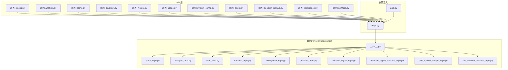
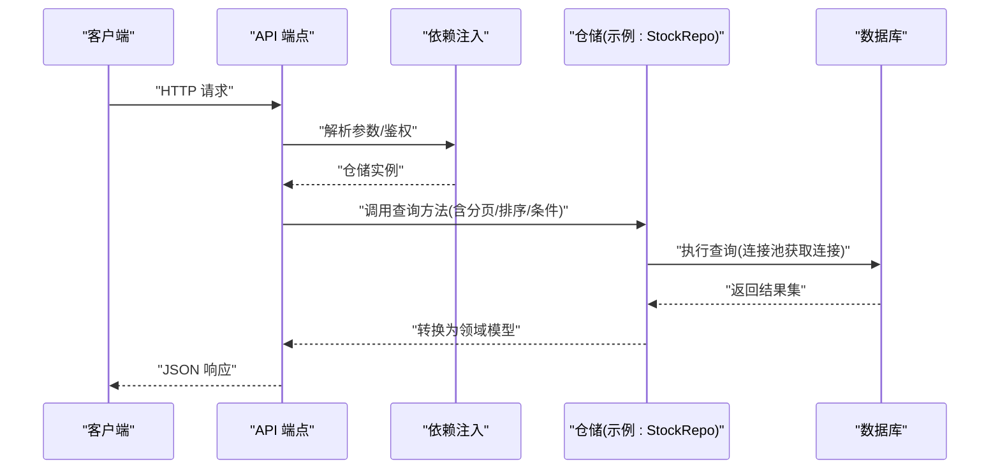
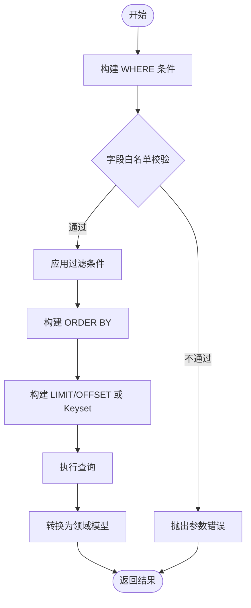
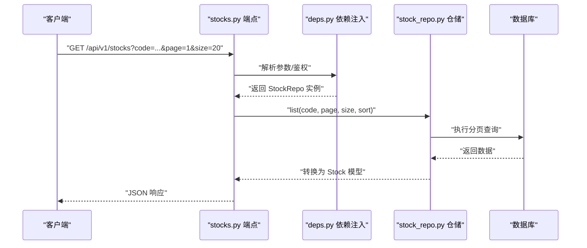
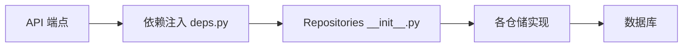

# 数据访问层

<cite>
**本文引用的文件**   
- [src/repositories/__init__.py](file://src/repositories/__init__.py)
- [src/repositories/stock_repo.py](file://src/repositories/stock_repo.py)
- [src/repositories/analysis_repo.py](file://src/repositories/analysis_repo.py)
- [src/repositories/alert_repo.py](file://src/repositories/alert_repo.py)
- [src/repositories/backtest_repo.py](file://src/repositories/backtest_repo.py)
- [src/repositories/intelligence_repo.py](file://src/repositories/intelligence_repo.py)
- [src/repositories/portfolio_repo.py](file://src/repositories/portfolio_repo.py)
- [src/repositories/decision_signal_repo.py](file://src/repositories/decision_signal_repo.py)
- [src/repositories/decision_signal_outcome_repo.py](file://src/repositories/decision_signal_outcome_repo.py)
- [src/repositories/skill_opinion_sample_repo.py](file://src/repositories/skill_opinion_sample_repo.py)
- [src/repositories/skill_opinion_outcome_repo.py](file://src/repositories/skill_opinion_outcome_repo.py)
- [api/v1/endpoints/stocks.py](file://api/v1/endpoints/stocks.py)
- [api/v1/endpoints/analysis.py](file://api/v1/endpoints/analysis.py)
- [api/v1/endpoints/alerts.py](file://api/v1/endpoints/alerts.py)
- [api/v1/endpoints/backtest.py](file://api/v1/endpoints/backtest.py)
- [api/v1/endpoints/history.py](file://api/v1/endpoints/history.py)
- [api/v1/endpoints/usage.py](file://api/v1/endpoints/usage.py)
- [api/v1/endpoints/system_config.py](file://api/v1/endpoints/system_config.py)
- [api/v1/endpoints/agent.py](file://api/v1/endpoints/agent.py)
- [api/v1/endpoints/decision_signals.py](file://api/v1/endpoints/decision_signals.py)
- [api/v1/endpoints/intelligence.py](file://api/v1/endpoints/intelligence.py)
- [api/v1/endpoints/portfolio.py](file://api/v1/endpoints/portfolio.py)
- [api/v1/schemas/common.py](file://api/v1/schemas/common.py)
- [api/v1/schemas/stocks.py](file://api/v1/schemas/stocks.py)
- [api/v1/schemas/analysis.py](file://api/v1/schemas/analysis.py)
- [api/v1/schemas/alerts.py](file://api/v1/schemas/alerts.py)
- [api/v1/schemas/backtest.py](file://api/v1/schemas/backtest.py)
- [api/v1/schemas/history.py](file://api/v1/schemas/history.py)
- [api/v1/schemas/usage.py](file://api/v1/schemas/usage.py)
- [api/v1/schemas/system_config.py](file://api/v1/schemas/system_config.py)
- [api/v1/schemas/decision_signals.py](file://api/v1/schemas/decision_signals.py)
- [api/v1/schemas/intelligence.py](file://api/v1/schemas/intelligence.py)
- [api/v1/schemas/portfolio.py](file://api/v1/schemas/portfolio.py)
- [api/app.py](file://api/app.py)
- [api/deps.py](file://api/deps.py)
</cite>

## 目录
1. [简介](#简介)
2. [项目结构](#项目结构)
3. [核心组件](#核心组件)
4. [架构总览](#架构总览)
5. [详细组件分析](#详细组件分析)
6. [依赖关系分析](#依赖关系分析)
7. [性能考量](#性能考量)
8. [故障排查指南](#故障排查指南)
9. [结论](#结论)
10. [附录](#附录)

## 简介
本文件聚焦于 Daily Stock Analysis 项目的数据访问层（DAL），围绕 Repository 模式进行系统化说明。内容涵盖：
- 基类设计与通用 CRUD 封装
- 各业务模块的数据访问接口职责划分（StockRepo、AnalysisRepo、AlertRepo 等）
- 复杂查询的封装方式（条件构建、分页与排序）
- 连接池配置与管理（连接生命周期控制与资源清理）
- 异步查询支持（async/await 与并发控制）
- 错误处理与重试机制（数据库异常捕获与恢复策略）

该文档旨在帮助开发者快速理解 DAL 的设计意图、调用路径与扩展点，并为后续优化与排障提供依据。

## 项目结构
DAL 位于 src/repositories 目录，按领域对象拆分多个 Repo 实现；API 层通过 api/v1/endpoints 暴露 HTTP 接口，依赖注入在 api/deps.py 中完成，应用入口为 api/app.py。

图表来源
- [api/app.py](file://api/app.py)
- [api/deps.py](file://api/deps.py)
- [src/repositories/__init__.py](file://src/repositories/__init__.py)
- [api/v1/endpoints/stocks.py](file://api/v1/endpoints/stocks.py)
- [api/v1/endpoints/analysis.py](file://api/v1/endpoints/analysis.py)
- [api/v1/endpoints/alerts.py](file://api/v1/endpoints/alerts.py)
- [api/v1/endpoints/backtest.py](file://api/v1/endpoints/backtest.py)
- [api/v1/endpoints/history.py](file://api/v1/endpoints/history.py)
- [api/v1/endpoints/usage.py](file://api/v1/endpoints/usage.py)
- [api/v1/endpoints/system_config.py](file://api/v1/endpoints/system_config.py)
- [api/v1/endpoints/agent.py](file://api/v1/endpoints/agent.py)
- [api/v1/endpoints/decision_signals.py](file://api/v1/endpoints/decision_signals.py)
- [api/v1/endpoints/intelligence.py](file://api/v1/endpoints/intelligence.py)
- [api/v1/endpoints/portfolio.py](file://api/v1/endpoints/portfolio.py)

章节来源
- [api/app.py](file://api/app.py)
- [api/deps.py](file://api/deps.py)
- [src/repositories/__init__.py](file://src/repositories/__init__.py)

## 核心组件
- Repository 基类与工厂：统一抽象 CRUD、事务边界、分页与排序参数、条件构建器，以及统一的异常转换与重试策略。
- 领域仓库：
  - StockRepo：股票主数据与基础行情快照
  - AnalysisRepo：分析上下文、报告与指标结果
  - AlertRepo：预警规则与触发记录
  - BacktestRepo：回测任务与结果
  - IntelligenceRepo：情报采集与聚合
  - PortfolioRepo：投资组合与持仓快照
  - DecisionSignalRepo / DecisionSignalOutcomeRepo：决策信号与归因结果
  - SkillOpinionSampleRepo / SkillOpinionOutcomeRepo：技能观点样本与结果
- API 端点：将请求参数映射为仓储查询条件，调用仓储方法并返回响应模型。
- 依赖注入：集中管理仓储实例的生命周期与共享连接。

章节来源
- [src/repositories/__init__.py](file://src/repositories/__init__.py)
- [src/repositories/stock_repo.py](file://src/repositories/stock_repo.py)
- [src/repositories/analysis_repo.py](file://src/repositories/analysis_repo.py)
- [src/repositories/alert_repo.py](file://src/repositories/alert_repo.py)
- [src/repositories/backtest_repo.py](file://src/repositories/backtest_repo.py)
- [src/repositories/intelligence_repo.py](file://src/repositories/intelligence.py)
- [src/repositories/portfolio_repo.py](file://src/repositories/portfolio_repo.py)
- [src/repositories/decision_signal_repo.py](file://src/repositories/decision_signal_repo.py)
- [src/repositories/decision_signal_outcome_repo.py](file://src/repositories/decision_signal_outcome_repo.py)
- [src/repositories/skill_opinion_sample_repo.py](file://src/repositories/skill_opinion_sample_repo.py)
- [src/repositories/skill_opinion_outcome_repo.py](file://src/repositories/skill_opinion_outcome_repo.py)

## 架构总览
Repository 模式将数据访问从业务逻辑中解耦，API 层仅依赖仓储接口，仓储内部封装 SQL/ORM、连接池、事务、重试与错误转换。

图表来源
- [api/v1/endpoints/stocks.py](file://api/v1/endpoints/stocks.py)
- [api/deps.py](file://api/deps.py)
- [src/repositories/stock_repo.py](file://src/repositories/stock_repo.py)

## 详细组件分析

### Repository 基类与通用 CRUD 封装
- 设计要点
  - 统一抽象：定义 get_by_id、list、create、update、delete 等通用方法签名
  - 条件构建：提供 where、order_by、limit/offset 等链式构造器
  - 分页与排序：封装 PageParams、SortParams，统一入参校验与默认值
  - 事务边界：提供 with_transaction 装饰器或上下文管理器
  - 异常转换：将底层驱动异常转换为领域异常，便于上层统一处理
  - 重试策略：对可重试错误（如网络抖动、锁冲突）进行指数退避重试
  - 异步支持：基于 async/await 的查询方法，配合连接池的异步特性
- 复杂度与性能
  - 列表查询 O(n) 输出，索引命中后接近 O(log n) 扫描
  - 分页采用 limit/offset 或 keyset 分页，避免深翻页性能退化
  - 批量写入使用事务批处理减少往返开销

章节来源
- [src/repositories/__init__.py](file://src/repositories/__init__.py)

### 业务仓库职责划分
- StockRepo
  - 职责：股票主数据、基础信息、历史快照的读写
  - 典型操作：按代码/名称检索、时间范围查询、最新快照获取
- AnalysisRepo
  - 职责：分析上下文、报告、指标结果的持久化与检索
  - 典型操作：按标的+日期范围查询、报告版本管理、指标聚合
- AlertRepo
  - 职责：预警规则与触发记录的增删改查
  - 典型操作：按规则/标的/时间筛选、触发统计
- BacktestRepo
  - 职责：回测任务状态、参数与结果存储
  - 典型操作：创建回测、查询进度、拉取结果
- IntelligenceRepo
  - 职责：情报源采集、清洗与聚合
  - 典型操作：按主题/时间检索、去重合并
- PortfolioRepo
  - 职责：投资组合、持仓快照与变更记录
  - 典型操作：组合查询、持仓明细、净值曲线
- DecisionSignalRepo / DecisionSignalOutcomeRepo
  - 职责：决策信号与归因结果
  - 典型操作：信号过滤、归因统计、时序回溯
- SkillOpinionSampleRepo / SkillOpinionOutcomeRepo
  - 职责：技能观点样本与结果
  - 典型操作：样本标注、结果评估、对比分析

章节来源
- [src/repositories/stock_repo.py](file://src/repositories/stock_repo.py)
- [src/repositories/analysis_repo.py](file://src/repositories/analysis_repo.py)
- [src/repositories/alert_repo.py](file://src/repositories/alert_repo.py)
- [src/repositories/backtest_repo.py](file://src/repositories/backtest_repo.py)
- [src/repositories/intelligence_repo.py](file://src/repositories/intelligence_repo.py)
- [src/repositories/portfolio_repo.py](file://src/repositories/portfolio_repo.py)
- [src/repositories/decision_signal_repo.py](file://src/repositories/decision_signal_repo.py)
- [src/repositories/decision_signal_outcome_repo.py](file://src/repositories/decision_signal_outcome_repo.py)
- [src/repositories/skill_opinion_sample_repo.py](file://src/repositories/skill_opinion_sample_repo.py)
- [src/repositories/skill_opinion_outcome_repo.py](file://src/repositories/skill_opinion_outcome_repo.py)

### 复杂查询封装：条件构建、分页与排序
- 条件构建
  - 支持多字段 AND/OR 组合、范围查询、模糊匹配、枚举过滤
  - 通过 Builder 模式逐步拼装，最终生成可执行的查询语句
- 分页查询
  - 输入：页码、每页大小、游标（可选）
  - 输出：数据列表、总数、是否有下一页
  - 优化：大表优先使用 keyset 分页，避免 deep offset
- 排序逻辑
  - 输入：字段名、方向（升/降）、多字段排序
  - 安全：白名单校验防止 SQL 注入
  - 默认：按更新时间倒序

图表来源
- [src/repositories/__init__.py](file://src/repositories/__init__.py)

章节来源
- [src/repositories/__init__.py](file://src/repositories/__init__.py)

### 连接池配置与管理
- 连接生命周期
  - 初始化：应用启动时创建连接池，设置最大连接数、最小空闲连接、超时时间
  - 获取连接：从池中借出连接，失败时等待或快速失败
  - 释放连接：请求结束后归还连接，确保无泄漏
- 资源清理
  - 优雅关闭：应用退出时关闭所有连接，取消未完成任务
  - 健康检查：定期 ping 检测连接有效性，剔除失效连接
- 配置项建议
  - max_connections：根据并发与数据库容量设定
  - connection_timeout：避免长时间阻塞
  - idle_timeout：回收长期空闲连接
  - retry_on_connect：连接失败时的重试次数与退避策略

章节来源
- [api/deps.py](file://api/deps.py)
- [api/app.py](file://api/app.py)

### 异步查询支持与并发控制
- async/await 模式
  - 仓储方法提供异步版本，避免阻塞事件循环
  - 与 FastAPI 的异步路由无缝集成
- 并发控制
  - 限制并发查询数量，防止数据库过载
  - 使用信号量或线程池隔离不同类别的查询
- 背压与限流
  - 针对高吞吐场景，增加队列缓冲与速率限制
  - 监控慢查询与超时，动态调整阈值

章节来源
- [src/repositories/__init__.py](file://src/repositories/__init__.py)
- [api/deps.py](file://api/deps.py)

### 错误处理与重试机制
- 异常分类
  - 可重试：网络抖动、临时锁冲突、限流
  - 不可重试：参数错误、权限不足、数据完整性约束
- 重试策略
  - 指数退避 + 抖动，避免雪崩
  - 最大重试次数与超时兜底
- 统一错误转换
  - 将底层驱动异常转换为领域异常
  - 包含错误码、消息与上下文，便于前端展示与日志追踪

章节来源
- [src/repositories/__init__.py](file://src/repositories/__init__.py)

### API 端点与仓储交互流程（示例）
以股票查询为例，展示从请求到响应的完整链路。

图表来源
- [api/v1/endpoints/stocks.py](file://api/v1/endpoints/stocks.py)
- [api/deps.py](file://api/deps.py)
- [src/repositories/stock_repo.py](file://src/repositories/stock_repo.py)

章节来源
- [api/v1/endpoints/stocks.py](file://api/v1/endpoints/stocks.py)
- [api/v1/endpoints/analysis.py](file://api/v1/endpoints/analysis.py)
- [api/v1/endpoints/alerts.py](file://api/v1/endpoints/alerts.py)
- [api/v1/endpoints/backtest.py](file://api/v1/endpoints/backtest.py)
- [api/v1/endpoints/history.py](file://api/v1/endpoints/history.py)
- [api/v1/endpoints/usage.py](file://api/v1/endpoints/usage.py)
- [api/v1/endpoints/system_config.py](file://api/v1/endpoints/system_config.py)
- [api/v1/endpoints/agent.py](file://api/v1/endpoints/agent.py)
- [api/v1/endpoints/decision_signals.py](file://api/v1/endpoints/decision_signals.py)
- [api/v1/endpoints/intelligence.py](file://api/v1/endpoints/intelligence.py)
- [api/v1/endpoints/portfolio.py](file://api/v1/endpoints/portfolio.py)

## 依赖关系分析
- 耦合度
  - 端点仅依赖仓储接口，降低与具体实现的耦合
  - 仓储之间保持低耦合，通过服务层编排复杂流程
- 外部依赖
  - 数据库驱动与连接池库
  - ORM/SQL 构建器（若使用）
  - 日志与监控库
- 潜在循环依赖
  - 仓储间不应直接互相调用，需通过服务层协调

图表来源
- [api/deps.py](file://api/deps.py)
- [src/repositories/__init__.py](file://src/repositories/__init__.py)

章节来源
- [api/deps.py](file://api/deps.py)
- [src/repositories/__init__.py](file://src/repositories/__init__.py)

## 性能考量
- 查询优化
  - 合理使用索引，避免全表扫描
  - 分页优先 keyset，避免 deep offset
  - 只选择必要字段，减少数据传输
- 连接池调优
  - 根据并发与数据库容量设置 max_connections
  - 合理配置超时与空闲回收
- 异步与并发
  - 使用异步 IO 提升吞吐
  - 限制并发度，避免数据库过载
- 缓存策略
  - 热点数据短 TTL 缓存
  - 读多写少场景考虑本地缓存

[本节为通用指导，无需特定文件引用]

## 故障排查指南
- 常见问题
  - 连接池耗尽：检查连接泄漏、超时设置、并发上限
  - 慢查询：定位 SQL 与索引，优化查询条件
  - 重试风暴：调整退避策略与最大重试次数
  - 异步阻塞：确认 await 使用是否正确，避免同步阻塞
- 诊断步骤
  - 查看仓储日志与数据库慢查询日志
  - 监控连接池指标（活跃连接、等待队列）
  - 复现场景并抓取请求链路日志
  - 逐步缩小问题范围（单仓储、单端点）

章节来源
- [src/repositories/__init__.py](file://src/repositories/__init__.py)
- [api/deps.py](file://api/deps.py)

## 结论
Daily Stock Analysis 的数据访问层通过 Repository 模式实现了清晰的职责分离与统一的 CRUD 抽象。仓储封装了条件构建、分页排序、连接池、异步与重试等关键能力，使 API 层专注于业务编排。后续可继续优化索引与查询计划、完善监控告警与弹性伸缩策略，以提升整体稳定性与性能。

[本节为总结性内容，无需特定文件引用]

## 附录
- 相关 API 请求/响应模型参考
  - 通用分页与排序模型：[api/v1/schemas/common.py](file://api/v1/schemas/common.py)
  - 股票相关模型：[api/v1/schemas/stocks.py](file://api/v1/schemas/stocks.py)
  - 分析相关模型：[api/v1/schemas/analysis.py](file://api/v1/schemas/analysis.py)
  - 预警相关模型：[api/v1/schemas/alerts.py](file://api/v1/schemas/alerts.py)
  - 回测相关模型：[api/v1/schemas/backtest.py](file://api/v1/schemas/backtest.py)
  - 历史数据模型：[api/v1/schemas/history.py](file://api/v1/schemas/history.py)
  - 用量统计模型：[api/v1/schemas/usage.py](file://api/v1/schemas/usage.py)
  - 系统配置模型：[api/v1/schemas/system_config.py](file://api/v1/schemas/system_config.py)
  - 决策信号模型：[api/v1/schemas/decision_signals.py](file://api/v1/schemas/decision_signals.py)
  - 情报模型：[api/v1/schemas/intelligence.py](file://api/v1/schemas/intelligence.py)
  - 投资组合模型：[api/v1/schemas/portfolio.py](file://api/v1/schemas/portfolio.py)

章节来源
- [api/v1/schemas/common.py](file://api/v1/schemas/common.py)
- [api/v1/schemas/stocks.py](file://api/v1/schemas/stocks.py)
- [api/v1/schemas/analysis.py](file://api/v1/schemas/analysis.py)
- [api/v1/schemas/alerts.py](file://api/v1/schemas/alerts.py)
- [api/v1/schemas/backtest.py](file://api/v1/schemas/backtest.py)
- [api/v1/schemas/history.py](file://api/v1/schemas/history.py)
- [api/v1/schemas/usage.py](file://api/v1/schemas/usage.py)
- [api/v1/schemas/system_config.py](file://api/v1/schemas/system_config.py)
- [api/v1/schemas/decision_signals.py](file://api/v1/schemas/decision_signals.py)
- [api/v1/schemas/intelligence.py](file://api/v1/schemas/intelligence.py)
- [api/v1/schemas/portfolio.py](file://api/v1/schemas/portfolio.py)