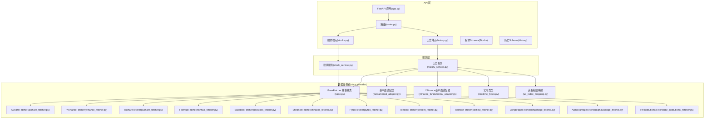
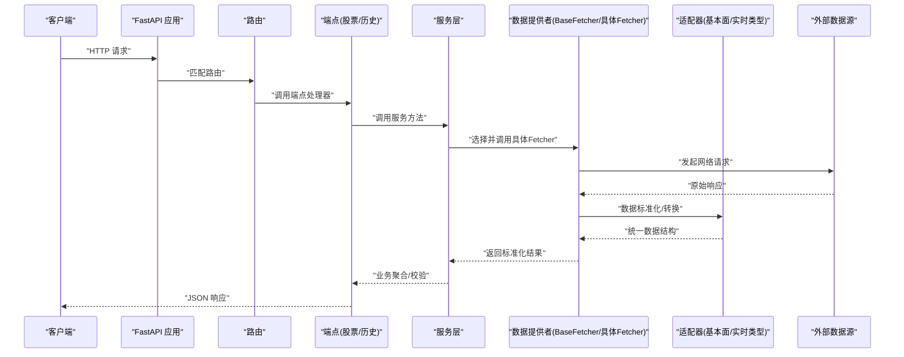
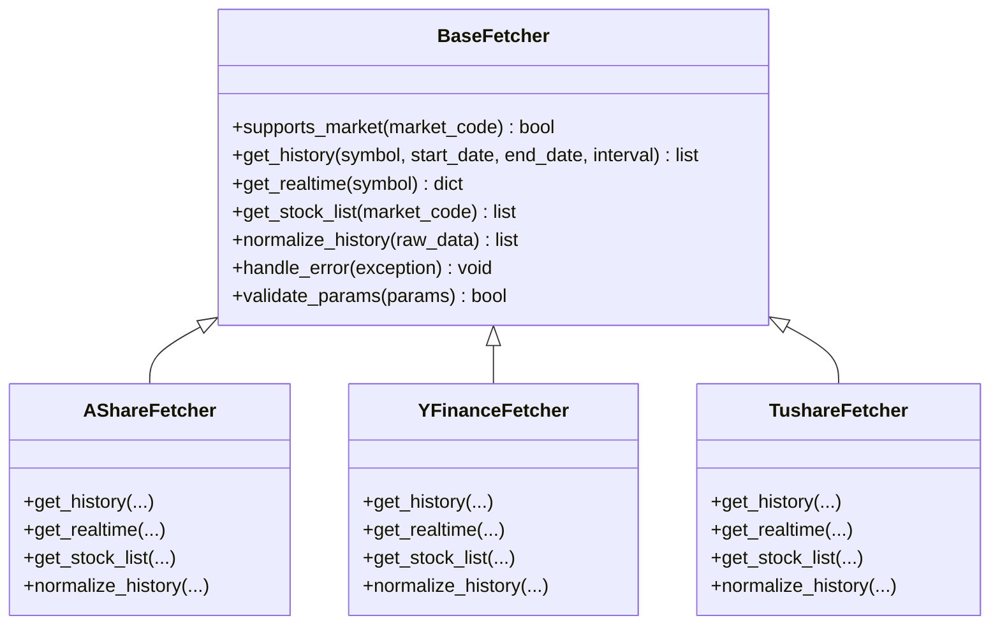
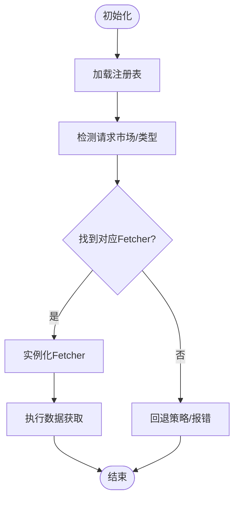
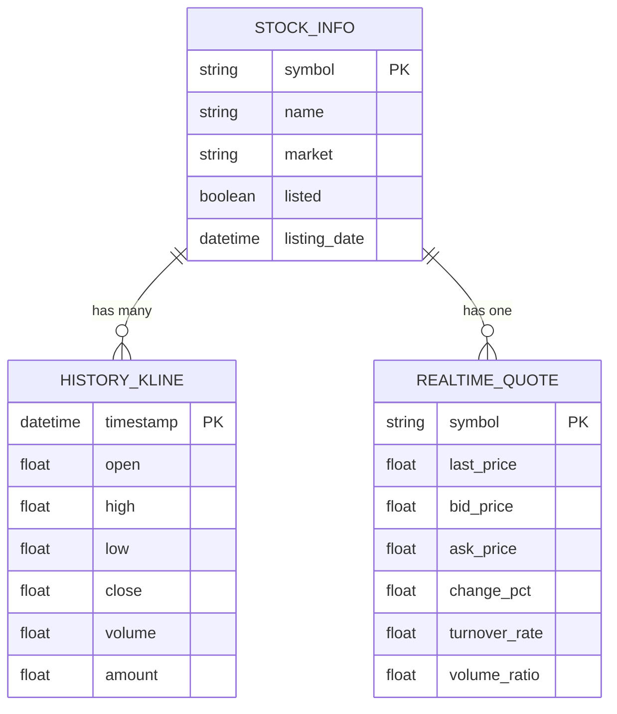
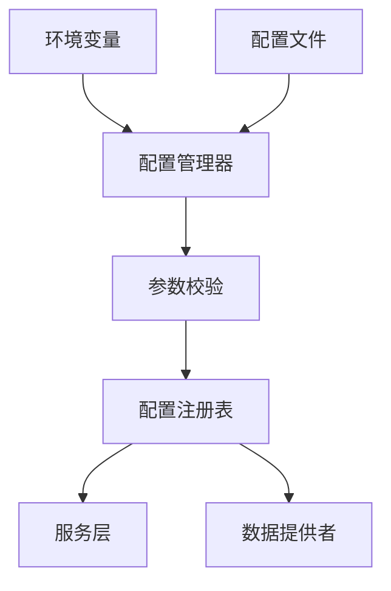
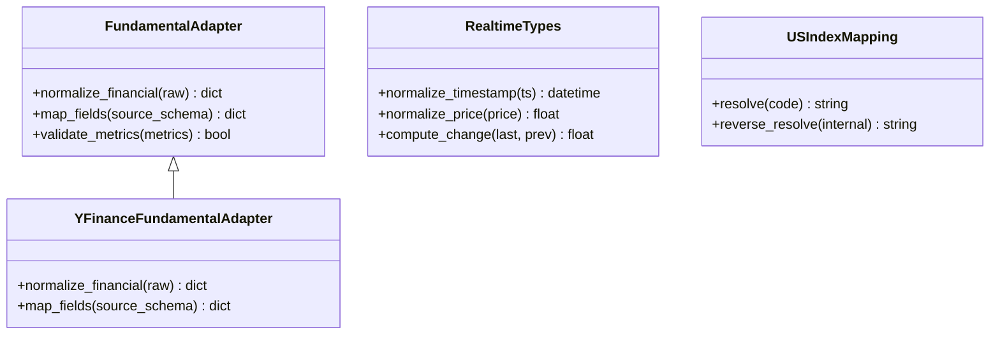
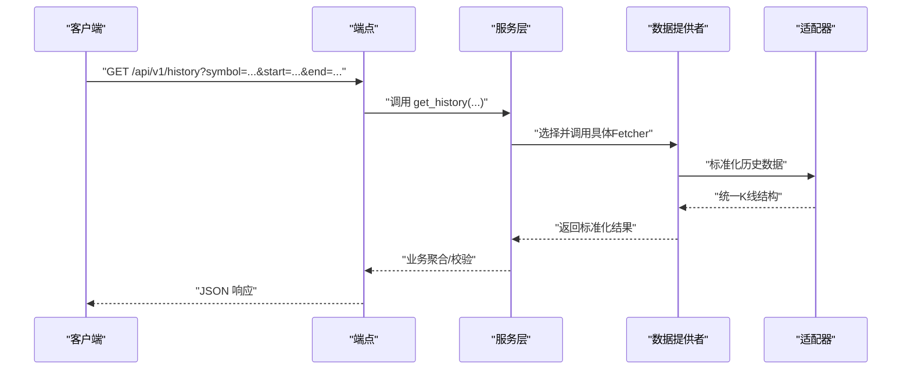
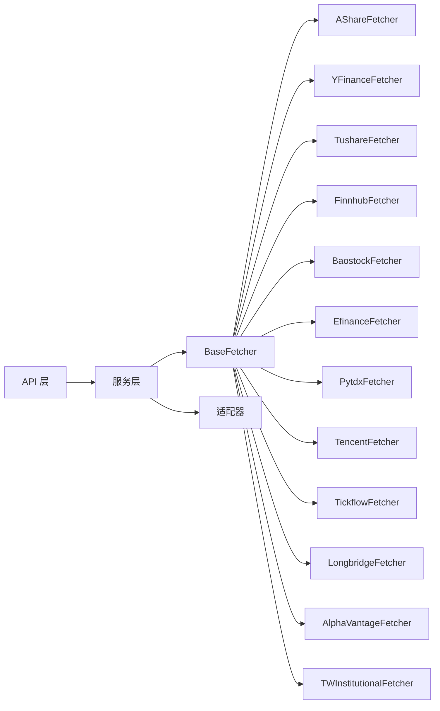

# 数据提供者架构

<cite>
**本文引用的文件**   
- [base.py](file://data_provider/base.py)
- [akshare_fetcher.py](file://data_provider/akshare_fetcher.py)
- [alphavantage_fetcher.py](file://data_provider/alphavantage_fetcher.py)
- [baostock_fetcher.py](file://data_provider/baostock_fetcher.py)
- [efinance_fetcher.py](file://data_provider/efinance_fetcher.py)
- [finnhub_fetcher.py](file://data_provider/finnhub_fetcher.py)
- [longbridge_fetcher.py](file://data_provider/longbridge_fetcher.py)
- [pytdx_fetcher.py](file://data_provider/pytdx_fetcher.py)
- [tencent_fetcher.py](file://data_provider/tencent_fetcher.py)
- [tickflow_fetcher.py](file://data_provider/tickflow_fetcher.py)
- [tushare_fetcher.py](file://data_provider/tushare_fetcher.py)
- [tw_institutional_fetcher.py](file://data_provider/tw_institutional_fetcher.py)
- [yfinance_fetcher.py](file://data_provider/yfinance_fetcher.py)
- [fundamental_adapter.py](file://data_provider/fundamental_adapter.py)
- [yfinance_fundamental_adapter.py](file://data_provider/yfinance_fundamental_adapter.py)
- [realtime_types.py](file://data_provider/realtime_types.py)
- [us_index_mapping.py](file://data_provider/us_index_mapping.py)
- [history_service.py](file://src/services/history_service.py)
- [stock_service.py](file://src/services/stock_service.py)
- [config_manager.py](file://src/core/config_manager.py)
- [config_registry.py](file://src/core/config_registry.py)
- [app.py](file://api/app.py)
- [router.py](file://api/v1/router.py)
- [stocks.py](file://api/v1/endpoints/stocks.py)
- [history.py](file://api/v1/endpoints/history.py)
- [stocks.py](file://api/v1/schemas/stocks.py)
- [history.py](file://api/v1/schemas/history.py)
</cite>

## 目录
1. [简介](#简介)
2. [项目结构](#项目结构)
3. [核心组件](#核心组件)
4. [架构总览](#架构总览)
5. [详细组件分析](#详细组件分析)
6. [依赖关系分析](#依赖关系分析)
7. [性能考量](#性能考量)
8. [故障排查指南](#故障排查指南)
9. [结论](#结论)
10. [附录](#附录)

## 简介
本文件面向“数据提供者架构”的设计与实现，聚焦以下目标：
- 解释 BaseFetcher 抽象类的设计模式与核心接口（数据获取、格式转换、错误处理等）
- 说明数据提供者的注册机制与工厂模式实现（动态加载与依赖注入）
- 描述统一的数据接口规范（股票信息、历史数据、实时行情等标准数据结构）
- 阐述数据源配置管理（环境变量、配置文件、参数校验）
- 提供架构图与数据流向图，展示从 API 调用到数据返回的完整流程
- 给出扩展新数据源的指导原则与设计最佳实践

## 项目结构
数据提供者相关代码主要位于 data_provider 目录，配合 src/services 中的服务层与 api 层的端点与 Schema 定义，形成“API -> 服务 -> 数据提供者”的分层架构。

图表来源
- [app.py:1-200](file://api/app.py#L1-L200)
- [router.py:1-200](file://api/v1/router.py#L1-L200)
- [stocks.py:1-200](file://api/v1/endpoints/stocks.py#L1-L200)
- [history.py:1-200](file://api/v1/endpoints/history.py#L1-L200)
- [history_service.py:1-200](file://src/services/history_service.py#L1-L200)
- [stock_service.py:1-200](file://src/services/stock_service.py#L1-L200)
- [base.py:1-200](file://data_provider/base.py#L1-L200)
- [akshare_fetcher.py:1-200](file://data_provider/akshare_fetcher.py#L1-L200)
- [yfinance_fetcher.py:1-200](file://data_provider/yfinance_fetcher.py#L1-L200)
- [tushare_fetcher.py:1-200](file://data_provider/tushare_fetcher.py#L1-L200)
- [finnhub_fetcher.py:1-200](file://data_provider/finnhub_fetcher.py#L1-L200)
- [baostock_fetcher.py:1-200](file://data_provider/baostock_fetcher.py#L1-L200)
- [efinance_fetcher.py:1-200](file://data_provider/efinance_fetcher.py#L1-L200)
- [pytdx_fetcher.py:1-200](file://data_provider/pytdx_fetcher.py#L1-L200)
- [tencent_fetcher.py:1-200](file://data_provider/tencent_fetcher.py#L1-L200)
- [tickflow_fetcher.py:1-200](file://data_provider/tickflow_fetcher.py#L1-L200)
- [longbridge_fetcher.py:1-200](file://data_provider/longbridge_fetcher.py#L1-L200)
- [alphavantage_fetcher.py:1-200](file://data_provider/alphavantage_fetcher.py#L1-L200)
- [tw_institutional_fetcher.py:1-200](file://data_provider/tw_institutional_fetcher.py#L1-L200)
- [fundamental_adapter.py:1-200](file://data_provider/fundamental_adapter.py#L1-L200)
- [yfinance_fundamental_adapter.py:1-200](file://data_provider/yfinance_fundamental_adapter.py#L1-L200)
- [realtime_types.py:1-200](file://data_provider/realtime_types.py#L1-L200)
- [us_index_mapping.py:1-200](file://data_provider/us_index_mapping.py#L1-L200)

章节来源
- [app.py:1-200](file://api/app.py#L1-L200)
- [router.py:1-200](file://api/v1/router.py#L1-L200)
- [stocks.py:1-200](file://api/v1/endpoints/stocks.py#L1-L200)
- [history.py:1-200](file://api/v1/endpoints/history.py#L1-L200)
- [history_service.py:1-200](file://src/services/history_service.py#L1-L200)
- [stock_service.py:1-200](file://src/services/stock_service.py#L1-L200)
- [base.py:1-200](file://data_provider/base.py#L1-L200)

## 核心组件
- BaseFetcher 抽象基类：定义统一的获取接口、数据标准化、错误处理与重试策略，作为所有具体 Fetcher 的共同契约。
- 具体 Fetcher 实现：针对 A 股、美股、港股、台湾机构数据等不同市场与数据源，分别实现数据拉取与适配逻辑。
- 适配器：将不同数据源的原始数据转换为统一的结构化模型（如历史 K 线、财务指标）。
- 服务层：封装业务逻辑，协调多个 Fetcher/适配器完成复杂查询与聚合。
- API 层：通过 FastAPI 暴露统一接口，使用 Pydantic Schema 进行输入输出校验与文档生成。

章节来源
- [base.py:1-200](file://data_provider/base.py#L1-L200)
- [history_service.py:1-200](file://src/services/history_service.py#L1-L200)
- [stock_service.py:1-200](file://src/services/stock_service.py#L1-L200)
- [stocks.py:1-200](file://api/v1/schemas/stocks.py#L1-L200)
- [history.py:1-200](file://api/v1/schemas/history.py#L1-L200)

## 架构总览
下图展示了从 HTTP 请求进入，到服务层调度数据提供者，最终返回统一数据的完整流程。

图表来源
- [app.py:1-200](file://api/app.py#L1-L200)
- [router.py:1-200](file://api/v1/router.py#L1-L200)
- [stocks.py:1-200](file://api/v1/endpoints/stocks.py#L1-L200)
- [history.py:1-200](file://api/v1/endpoints/history.py#L1-L200)
- [history_service.py:1-200](file://src/services/history_service.py#L1-L200)
- [stock_service.py:1-200](file://src/services/stock_service.py#L1-L200)
- [base.py:1-200](file://data_provider/base.py#L1-L200)
- [fundamental_adapter.py:1-200](file://data_provider/fundamental_adapter.py#L1-L200)
- [realtime_types.py:1-200](file://data_provider/realtime_types.py#L1-L200)

## 详细组件分析

### BaseFetcher 抽象类与统一接口
- 设计模式：抽象基类 + 模板方法。定义统一的数据获取、清洗、转换、错误处理流程，子类只需实现特定数据源的细节。
- 关键职责：
  - 数据获取：封装网络请求、超时、重试、限流等通用逻辑
  - 格式转换：将各源原始数据转换为统一模型
  - 错误处理：异常捕获、降级策略、日志记录
  - 元数据：标记支持的市场、数据类型、版本兼容性
- 扩展点：子类需实现的具体方法包括按市场/标的获取历史、实时、列表等；可覆盖默认转换与错误处理策略

图表来源
- [base.py:1-200](file://data_provider/base.py#L1-L200)
- [akshare_fetcher.py:1-200](file://data_provider/akshare_fetcher.py#L1-L200)
- [yfinance_fetcher.py:1-200](file://data_provider/yfinance_fetcher.py#L1-L200)
- [tushare_fetcher.py:1-200](file://data_provider/tushare_fetcher.py#L1-L200)

章节来源
- [base.py:1-200](file://data_provider/base.py#L1-L200)

### 数据提供者的注册机制与工厂模式
- 注册机制：通过集中式注册表维护“市场码 -> Fetcher 实例”的映射，支持运行时动态添加新的数据源。
- 工厂模式：根据请求上下文（市场、数据类型、可用配置）选择合适的 Fetcher 实例，避免硬编码分支。
- 依赖注入：服务层通过构造函数或模块级容器注入所需 Fetcher，便于测试与替换实现。
- 动态加载：可按需导入具体 Fetcher 模块，减少启动开销与内存占用。

图表来源
- [history_service.py:1-200](file://src/services/history_service.py#L1-L200)
- [stock_service.py:1-200](file://src/services/stock_service.py#L1-L200)
- [base.py:1-200](file://data_provider/base.py#L1-L200)

章节来源
- [history_service.py:1-200](file://src/services/history_service.py#L1-L200)
- [stock_service.py:1-200](file://src/services/stock_service.py#L1-L200)
- [base.py:1-200](file://data_provider/base.py#L1-L200)

### 统一数据接口规范
- 股票信息：包含代码、名称、市场、上市状态、交易时段等字段，用于前端展示与筛选。
- 历史数据：时间序列（日期/时间戳）、开盘价、最高价、最低价、收盘价、成交量、成交额等，支持多周期（日/周/月/分钟）。
- 实时行情：最新价、买卖盘口、涨跌额、涨跌幅、换手率、量比等，强调低延迟与高可用。
- 标准化模型：通过 Pydantic 模型在 API 层进行强类型校验，确保前后端一致性与可维护性。

图表来源
- [stocks.py:1-200](file://api/v1/schemas/stocks.py#L1-L200)
- [history.py:1-200](file://api/v1/schemas/history.py#L1-L200)
- [realtime_types.py:1-200](file://data_provider/realtime_types.py#L1-L200)

章节来源
- [stocks.py:1-200](file://api/v1/schemas/stocks.py#L1-L200)
- [history.py:1-200](file://api/v1/schemas/history.py#L1-L200)
- [realtime_types.py:1-200](file://data_provider/realtime_types.py#L1-L200)

### 数据源配置管理
- 环境变量：敏感信息与运行期开关（如 API Key、超时、重试次数、缓存开关）通过环境变量注入。
- 配置文件：非敏感配置（如默认市场、数据源优先级、指标阈值）通过 YAML/JSON 管理，支持热更新。
- 参数校验：在服务层与 Fetcher 层对输入参数进行严格校验，防止非法请求导致下游异常。
- 配置中心：通过配置管理器与注册表统一管理配置项，提供默认值、合并策略与版本兼容。

图表来源
- [config_manager.py:1-200](file://src/core/config_manager.py#L1-L200)
- [config_registry.py:1-200](file://src/core/config_registry.py#L1-L200)
- [history_service.py:1-200](file://src/services/history_service.py#L1-L200)
- [stock_service.py:1-200](file://src/services/stock_service.py#L1-L200)

章节来源
- [config_manager.py:1-200](file://src/core/config_manager.py#L1-L200)
- [config_registry.py:1-200](file://src/core/config_registry.py#L1-L200)

### 适配器与标准化
- 基本面适配器：将不同数据源的财务指标（营收、利润、估值等）统一为一致的字段与单位。
- 实时类型适配器：统一时间戳、价格精度、涨跌计算方式，保证跨源一致性。
- 美股指数映射：将外部指数代码映射到内部标准代码，简化上层逻辑。

图表来源
- [fundamental_adapter.py:1-200](file://data_provider/fundamental_adapter.py#L1-L200)
- [yfinance_fundamental_adapter.py:1-200](file://data_provider/yfinance_fundamental_adapter.py#L1-L200)
- [realtime_types.py:1-200](file://data_provider/realtime_types.py#L1-L200)
- [us_index_mapping.py:1-200](file://data_provider/us_index_mapping.py#L1-L200)

章节来源
- [fundamental_adapter.py:1-200](file://data_provider/fundamental_adapter.py#L1-L200)
- [yfinance_fundamental_adapter.py:1-200](file://data_provider/yfinance_fundamental_adapter.py#L1-L200)
- [realtime_types.py:1-200](file://data_provider/realtime_types.py#L1-L200)
- [us_index_mapping.py:1-200](file://data_provider/us_index_mapping.py#L1-L200)

### API 端到点与服务层协作
- 端点：接收请求、解析参数、调用服务层，返回 JSON 响应。
- 服务层：编排多个 Fetcher/适配器，处理业务规则、聚合与缓存。
- Schema：定义输入输出结构，自动校验与文档生成。

图表来源
- [stocks.py:1-200](file://api/v1/endpoints/stocks.py#L1-L200)
- [history.py:1-200](file://api/v1/endpoints/history.py#L1-L200)
- [history_service.py:1-200](file://src/services/history_service.py#L1-L200)
- [base.py:1-200](file://data_provider/base.py#L1-L200)

章节来源
- [stocks.py:1-200](file://api/v1/endpoints/stocks.py#L1-L200)
- [history.py:1-200](file://api/v1/endpoints/history.py#L1-L200)
- [history_service.py:1-200](file://src/services/history_service.py#L1-L200)

## 依赖关系分析
- 耦合度：服务层与 BaseFetcher 松耦合，具体 Fetcher 通过注册表与工厂解耦，降低直接依赖。
- 内聚性：每个 Fetcher 专注单一数据源，适配器负责跨源标准化，职责清晰。
- 外部依赖：网络库、第三方 SDK（如 yfinance、tushare、baostock）被隔离在各自 Fetcher 中。
- 循环依赖：通过分层与接口抽象避免循环引用。

图表来源
- [base.py:1-200](file://data_provider/base.py#L1-L200)
- [history_service.py:1-200](file://src/services/history_service.py#L1-L200)
- [stock_service.py:1-200](file://src/services/stock_service.py#L1-L200)

章节来源
- [base.py:1-200](file://data_provider/base.py#L1-L200)
- [history_service.py:1-200](file://src/services/history_service.py#L1-L200)
- [stock_service.py:1-200](file://src/services/stock_service.py#L1-L200)

## 性能考量
- 并发与限流：在高并发场景下，合理设置线程池/协程池，限制对外部 API 的并发数，避免触发限频。
- 缓存策略：对热点数据（如股票列表、指数映射）实施本地缓存，减少重复请求。
- 批量请求：合并历史数据请求，减少网络往返。
- 超时与重试：设置合理的超时时间与重试退避策略，提升鲁棒性。
- 内存优化：流式处理大响应，避免一次性加载过多数据。

[本节为通用指导，不直接分析具体文件]

## 故障排查指南
- 常见问题：
  - 数据源不可用：检查网络连通性、API Key、配额与限频
  - 数据不一致：核对时间戳、复权方式、币种与单位
  - 参数错误：校验输入范围与格式，查看服务端日志
- 定位步骤：
  - 启用调试日志，追踪请求链路
  - 使用健康检查端点验证数据源状态
  - 对比不同 Fetcher 的结果差异，定位适配问题
- 恢复策略：
  - 切换到备用数据源
  - 降级返回部分字段或历史快照
  - 告警通知运维介入

章节来源
- [history_service.py:1-200](file://src/services/history_service.py#L1-L200)
- [stock_service.py:1-200](file://src/services/stock_service.py#L1-L200)
- [base.py:1-200](file://data_provider/base.py#L1-L200)

## 结论
本架构通过 BaseFetcher 抽象与工厂注册机制，实现了多数据源的统一接入与灵活扩展；服务层与 API 层通过强类型 Schema 保障数据一致性；适配器与配置管理提升了系统的可维护性与稳定性。遵循本文档的指导原则与最佳实践，可高效扩展新数据源并保持系统健壮性。

[本节为总结性内容，不直接分析具体文件]

## 附录
- 扩展新数据源的最佳实践：
  - 继承 BaseFetcher，实现必要方法，保持接口一致性
  - 在注册表中声明市场支持与版本兼容性
  - 使用适配器进行数据标准化，避免上游感知差异
  - 完善错误处理与日志，便于问题定位
  - 编写单元测试与集成测试，覆盖边界条件与失败路径
  - 通过环境变量与配置文件管理密钥与行为开关
  - 考虑缓存、限流与重试策略，提升可用性

[本节为通用指导，不直接分析具体文件]