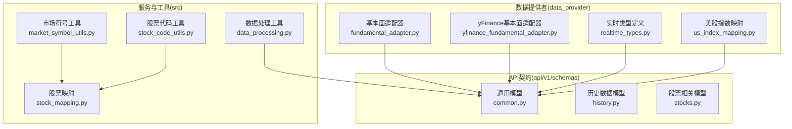
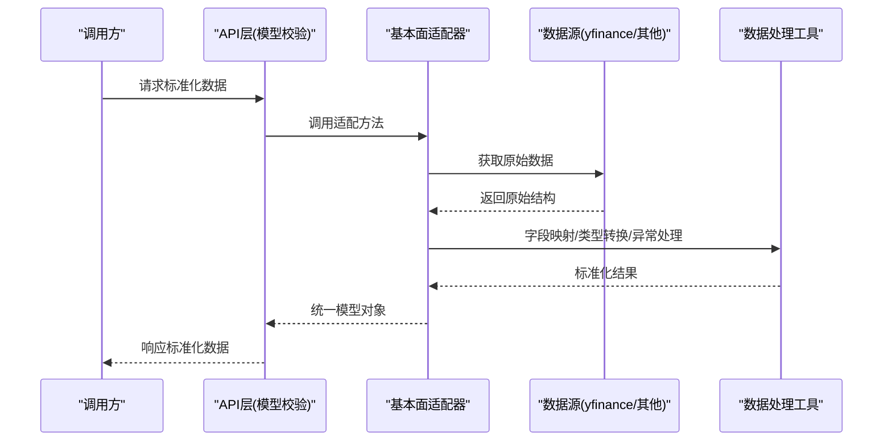
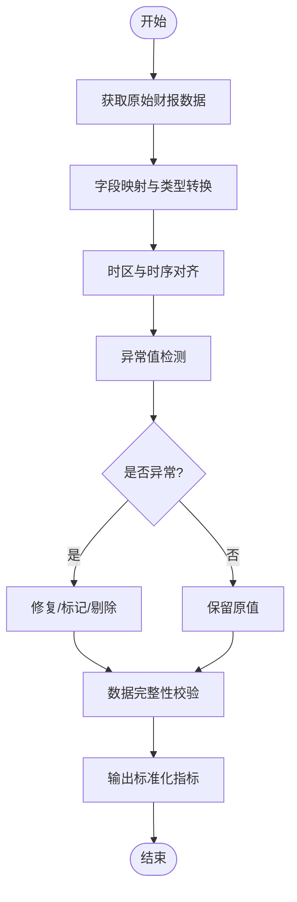
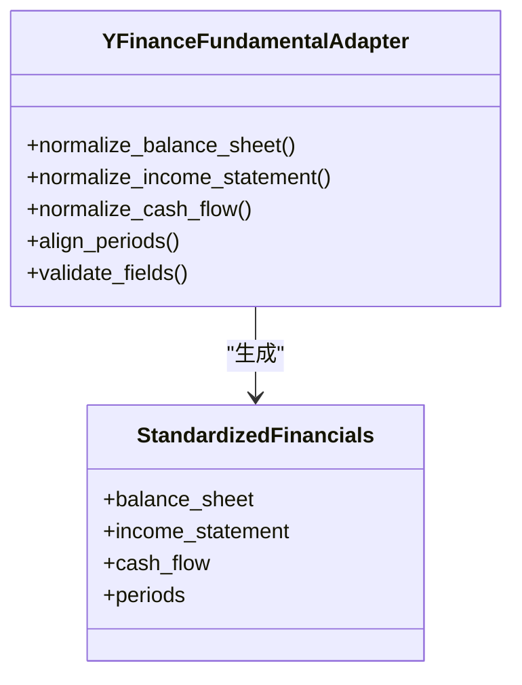
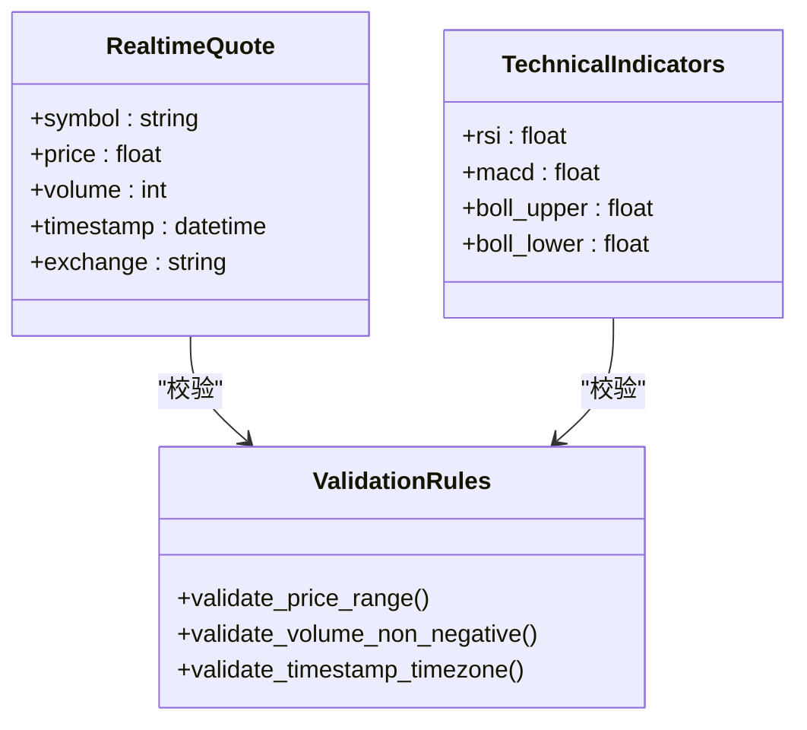
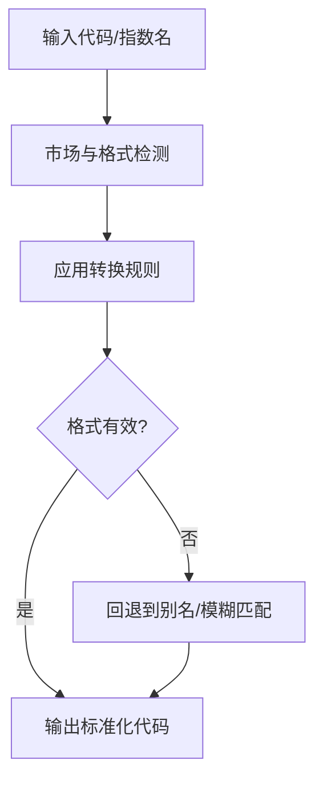
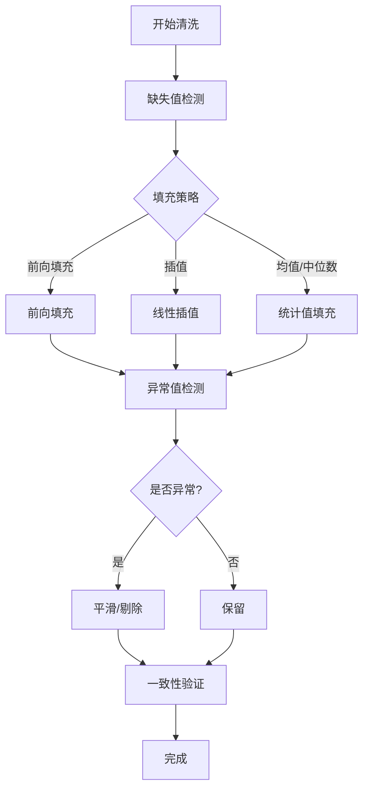
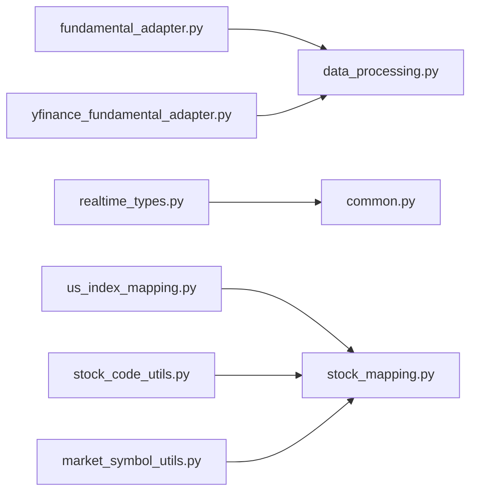

# 数据格式标准化

<cite>
**本文引用的文件**   
- [data_provider/fundamental_adapter.py](file://data_provider/fundamental_adapter.py)
- [data_provider/yfinance_fundamental_adapter.py](file://data_provider/yfinance_fundamental_adapter.py)
- [data_provider/realtime_types.py](file://data_provider/realtime_types.py)
- [data_provider/us_index_mapping.py](file://data_provider/us_index_mapping.py)
- [src/data/stock_mapping.py](file://src/data/stock_mapping.py)
- [src/services/market_symbol_utils.py](file://src/services/market_symbol_utils.py)
- [src/services/stock_code_utils.py](file://src/services/stock_code_utils.py)
- [src/utils/data_processing.py](file://src/utils/data_processing.py)
- [api/v1/schemas/common.py](file://api/v1/schemas/common.py)
- [api/v1/schemas/history.py](file://api/v1/schemas/history.py)
- [api/v1/schemas/stocks.py](file://api/v1/schemas/stocks.py)
- [tests/test_fundamental_adapter.py](file://tests/test_fundamental_adapter.py)
- [tests/test_yfinance_fundamental_adapter.py](file://tests/test_yfinance_fundamental_adapter.py)
- [tests/test_realtime_types.py](file://tests/test_realtime_types.py)
- [tests/test_us_index_mapping.py](file://tests/test_us_index_mapping.py)
- [tests/test_stock_code_utils.py](file://tests/test_stock_code_utils.py)
</cite>

## 目录
1. [简介](#简介)
2. [项目结构](#项目结构)
3. [核心组件](#核心组件)
4. [架构总览](#架构总览)
5. [详细组件分析](#详细组件分析)
6. [依赖关系分析](#依赖关系分析)
7. [性能考虑](#性能考虑)
8. [故障排查指南](#故障排查指南)
9. [结论](#结论)
10. [附录](#附录)

## 简介
本文件面向“数据格式标准化”主题，系统性说明多源数据（行情、基本面、指数等）的格式差异与统一适配机制。重点覆盖：
- 字段映射规则与数据类型转换
- 时区处理策略
- 基本面数据适配器的工作原理（财务报表标准化与异常值处理）
- 实时数据类型定义与校验（价格、成交量、技术指标等）
- 指数映射与股票代码转换逻辑（跨交易所规范与自动转换）
- 数据质量检查与清洗工具（缺失值、异常检测、一致性验证）
- 实际转换示例与性能优化建议

## 项目结构
本项目围绕 data_provider 层实现多数据源的拉取与标准化，通过 schemas 层对外暴露统一的数据契约；同时提供 stock_mapping、us_index_mapping 等模块完成代码与指数的规范化映射。utils.data_processing 提供通用的数据处理能力。测试用例覆盖关键适配与转换逻辑。

**图表来源** 
- [data_provider/fundamental_adapter.py](file://data_provider/fundamental_adapter.py)
- [data_provider/yfinance_fundamental_adapter.py](file://data_provider/yfinance_fundamental_adapter.py)
- [data_provider/realtime_types.py](file://data_provider/realtime_types.py)
- [data_provider/us_index_mapping.py](file://data_provider/us_index_mapping.py)
- [src/services/market_symbol_utils.py](file://src/services/market_symbol_utils.py)
- [src/services/stock_code_utils.py](file://src/services/stock_code_utils.py)
- [src/utils/data_processing.py](file://src/utils/data_processing.py)
- [src/data/stock_mapping.py](file://src/data/stock_mapping.py)
- [api/v1/schemas/common.py](file://api/v1/schemas/common.py)
- [api/v1/schemas/history.py](file://api/v1/schemas/history.py)
- [api/v1/schemas/stocks.py](file://api/v1/schemas/stocks.py)

**章节来源**
- [data_provider/fundamental_adapter.py](file://data_provider/fundamental_adapter.py)
- [data_provider/yfinance_fundamental_adapter.py](file://data_provider/yfinance_fundamental_adapter.py)
- [data_provider/realtime_types.py](file://data_provider/realtime_types.py)
- [data_provider/us_index_mapping.py](file://data_provider/us_index_mapping.py)
- [src/services/market_symbol_utils.py](file://src/services/market_symbol_utils.py)
- [src/services/stock_code_utils.py](file://src/services/stock_code_utils.py)
- [src/utils/data_processing.py](file://src/utils/data_processing.py)
- [src/data/stock_mapping.py](file://src/data/stock_mapping.py)
- [api/v1/schemas/common.py](file://api/v1/schemas/common.py)
- [api/v1/schemas/history.py](file://api/v1/schemas/history.py)
- [api/v1/schemas/stocks.py](file://api/v1/schemas/stocks.py)

## 核心组件
- 基本面数据适配器：将不同财务数据源的结构化报表转换为统一的指标集合，包含字段映射、单位换算、异常值处理与时间对齐。
- yFinance 基本面适配器：针对 yfinance 返回的原始数据结构进行标准化，确保与内部统一模型一致。
- 实时数据类型：定义价格、成交量、技术指标等标准结构，并提供 Pydantic 校验以保证输入输出的一致性。
- 指数映射：维护主要指数的代码映射表，支持不同交易所/平台的命名差异到统一标识的转换。
- 股票代码工具：提供跨市场（A股、港股、美股、日/韩等）的代码规范化与转换能力。
- 数据处理工具：封装缺失值填充、去重、排序、窗口计算、异常检测等通用操作。
- API 模型：以 Pydantic 模型定义对外接口契约，保证序列化/反序列化的严格性。

**章节来源**
- [data_provider/fundamental_adapter.py](file://data_provider/fundamental_adapter.py)
- [data_provider/yfinance_fundamental_adapter.py](file://data_provider/yfinance_fundamental_adapter.py)
- [data_provider/realtime_types.py](file://data_provider/realtime_types.py)
- [data_provider/us_index_mapping.py](file://data_provider/us_index_mapping.py)
- [src/services/market_symbol_utils.py](file://src/services/market_symbol_utils.py)
- [src/services/stock_code_utils.py](file://src/services/stock_code_utils.py)
- [src/utils/data_processing.py](file://src/utils/data_processing.py)
- [api/v1/schemas/common.py](file://api/v1/schemas/common.py)
- [api/v1/schemas/history.py](file://api/v1/schemas/history.py)
- [api/v1/schemas/stocks.py](file://api/v1/schemas/stocks.py)

## 架构总览
数据从多源进入 data_provider 层，经适配器转换为统一结构后，交由上层服务消费。API 层通过 schemas 暴露统一契约，确保前后端一致。

**图表来源** 
- [data_provider/fundamental_adapter.py](file://data_provider/fundamental_adapter.py)
- [data_provider/yfinance_fundamental_adapter.py](file://data_provider/yfinance_fundamental_adapter.py)
- [src/utils/data_processing.py](file://src/utils/data_processing.py)
- [api/v1/schemas/common.py](file://api/v1/schemas/common.py)

## 详细组件分析

### 基本面数据适配器
- 职责：将不同财务数据源的报表结构映射为统一指标集，处理单位（如百万/亿）、币种、会计期间对齐，并执行异常值检测与修复。
- 关键点：
  - 字段映射：按业务语义建立源字段到目标字段的映射表，支持可选字段与默认值。
  - 类型转换：字符串数值转浮点、日期解析、布尔标志位归一化。
  - 时区处理：统一转为 UTC 或本地交易日历时区，避免跨市场比较偏差。
  - 异常值处理：基于分位数、移动窗口统计、行业均值对比识别异常，采用插值/回退/标记策略。
  - 数据完整性：缺失值填充（前向填充、线性插值、零填充），重复行去重，时间戳排序。

**图表来源** 
- [data_provider/fundamental_adapter.py](file://data_provider/fundamental_adapter.py)
- [src/utils/data_processing.py](file://src/utils/data_processing.py)

**章节来源**
- [data_provider/fundamental_adapter.py](file://data_provider/fundamental_adapter.py)
- [src/utils/data_processing.py](file://src/utils/data_processing.py)
- [tests/test_fundamental_adapter.py](file://tests/test_fundamental_adapter.py)

### yFinance 基本面适配器
- 职责：针对 yfinance 返回的特定结构（如资产负债表、利润表、现金流）进行标准化，补齐字段、统一单位与时间粒度。
- 关键点：
  - 字段补全：对缺失的关键科目设置默认值或估算。
  - 单位统一：将不同量级（千/百万/十亿）统一为标准单位。
  - 时间对齐：按季度/年度聚合，确保可比性。
  - 校验：使用 Pydantic 模型约束关键字段非空与范围。

**图表来源** 
- [data_provider/yfinance_fundamental_adapter.py](file://data_provider/yfinance_fundamental_adapter.py)
- [api/v1/schemas/common.py](file://api/v1/schemas/common.py)

**章节来源**
- [data_provider/yfinance_fundamental_adapter.py](file://data_provider/yfinance_fundamental_adapter.py)
- [tests/test_yfinance_fundamental_adapter.py](file://tests/test_yfinance_fundamental_adapter.py)

### 实时数据类型与校验
- 职责：定义实时报价、成交量、技术指标的标准结构，并通过 Pydantic 进行强类型校验，确保下游稳定消费。
- 关键点：
  - 价格与成交量：限定正数、精度、最小变动单位。
  - 技术指标：RSI/MACD/布林带等字段范围与有效性校验。
  - 时间戳：ISO 8601 格式与时区标注。
  - 容错：允许部分字段缺失但需标记缺失原因。

**图表来源** 
- [data_provider/realtime_types.py](file://data_provider/realtime_types.py)
- [api/v1/schemas/common.py](file://api/v1/schemas/common.py)

**章节来源**
- [data_provider/realtime_types.py](file://data_provider/realtime_types.py)
- [tests/test_realtime_types.py](file://tests/test_realtime_types.py)

### 指数映射与股票代码转换
- 指数映射：维护主流指数在不同平台/交易所的编码映射，支持自动转换与回退策略。
- 股票代码转换：
  - A股：支持沪市/深市后缀与无后缀形式的互转。
  - 港股：支持 .HK 后缀与纯数字代码的转换。
  - 美股：支持 ticker 与复合后缀（如 ETF、指数）的识别与标准化。
  - 日/韩市场：遵循各自交易所的编码规范。
- 工具链：market_symbol_utils 与 stock_code_utils 提供统一接口，stock_mapping 维护全局映射表。

**图表来源** 
- [data_provider/us_index_mapping.py](file://data_provider/us_index_mapping.py)
- [src/services/market_symbol_utils.py](file://src/services/market_symbol_utils.py)
- [src/services/stock_code_utils.py](file://src/services/stock_code_utils.py)
- [src/data/stock_mapping.py](file://src/data/stock_mapping.py)

**章节来源**
- [data_provider/us_index_mapping.py](file://data_provider/us_index_mapping.py)
- [src/services/market_symbol_utils.py](file://src/services/market_symbol_utils.py)
- [src/services/stock_code_utils.py](file://src/services/stock_code_utils.py)
- [src/data/stock_mapping.py](file://src/data/stock_mapping.py)
- [tests/test_us_index_mapping.py](file://tests/test_us_index_mapping.py)
- [tests/test_stock_code_utils.py](file://tests/test_stock_code_utils.py)

### 数据质量检查与清洗工具
- 缺失值处理：前向填充、线性插值、均值/中位数填充、标记缺失比例。
- 异常检测：基于 IQR、Z-Score、移动窗口偏离度识别异常点，支持软修正（平滑）或硬剔除。
- 一致性验证：时间戳连续性、字段相关性检查（如收盘价与成交量同方向变化合理性）。
- 工具函数：在 data_processing 中集中实现，供各适配器复用。

**图表来源** 
- [src/utils/data_processing.py](file://src/utils/data_processing.py)

**章节来源**
- [src/utils/data_processing.py](file://src/utils/data_processing.py)

## 依赖关系分析
- 适配器依赖 utils.data_processing 提供的通用处理能力。
- 实时类型与 API 模型通过 Pydantic 强约束，减少运行时错误。
- 指数映射与代码转换依赖 stock_mapping 的全局映射表，并在 market_symbol_utils 与 stock_code_utils 中封装调用。
- 测试覆盖关键路径，保障映射与转换的正确性。

**图表来源** 
- [data_provider/fundamental_adapter.py](file://data_provider/fundamental_adapter.py)
- [data_provider/yfinance_fundamental_adapter.py](file://data_provider/yfinance_fundamental_adapter.py)
- [data_provider/realtime_types.py](file://data_provider/realtime_types.py)
- [data_provider/us_index_mapping.py](file://data_provider/us_index_mapping.py)
- [src/utils/data_processing.py](file://src/utils/data_processing.py)
- [src/data/stock_mapping.py](file://src/data/stock_mapping.py)
- [src/services/market_symbol_utils.py](file://src/services/market_symbol_utils.py)
- [src/services/stock_code_utils.py](file://src/services/stock_code_utils.py)
- [api/v1/schemas/common.py](file://api/v1/schemas/common.py)

**章节来源**
- [data_provider/fundamental_adapter.py](file://data_provider/fundamental_adapter.py)
- [data_provider/yfinance_fundamental_adapter.py](file://data_provider/yfinance_fundamental_adapter.py)
- [data_provider/realtime_types.py](file://data_provider/realtime_types.py)
- [data_provider/us_index_mapping.py](file://data_provider/us_index_mapping.py)
- [src/utils/data_processing.py](file://src/utils/data_processing.py)
- [src/data/stock_mapping.py](file://src/data/stock_mapping.py)
- [src/services/market_symbol_utils.py](file://src/services/market_symbol_utils.py)
- [src/services/stock_code_utils.py](file://src/services/stock_code_utils.py)
- [api/v1/schemas/common.py](file://api/v1/schemas/common.py)

## 性能考虑
- 批量处理：对历史数据与财报数据进行批量化映射与转换，减少循环开销。
- 缓存策略：对指数映射与股票代码映射结果进行内存缓存，降低重复计算。
- 惰性加载：按需加载大型映射表，避免启动时占用过多内存。
- 并行化：对独立标的的处理使用并发任务队列，提升吞吐。
- 内存管理：及时释放中间结果，避免大对象驻留。
- 校验优化：在 Pydantic 模型中使用 validator 的最小必要校验，避免过度计算。

[本节为通用指导，不直接分析具体文件]

## 故障排查指南
- 常见问题：
  - 字段缺失：检查映射表是否覆盖该字段，确认默认值策略。
  - 类型错误：核对 Pydantic 模型约束与输入数据格式。
  - 时区不一致：确认时间戳是否已统一为指定时区。
  - 异常值误判：调整检测阈值或窗口长度，结合业务上下文判断。
  - 代码转换失败：检查市场检测逻辑与映射表更新状态。
- 定位步骤：
  - 启用详细日志，记录原始结构与转换中间态。
  - 使用单元测试复现问题，逐步缩小范围。
  - 对映射表与工具函数进行回归测试。

**章节来源**
- [tests/test_fundamental_adapter.py](file://tests/test_fundamental_adapter.py)
- [tests/test_yfinance_fundamental_adapter.py](file://tests/test_yfinance_fundamental_adapter.py)
- [tests/test_realtime_types.py](file://tests/test_realtime_types.py)
- [tests/test_us_index_mapping.py](file://tests/test_us_index_mapping.py)
- [tests/test_stock_code_utils.py](file://tests/test_stock_code_utils.py)

## 结论
通过统一的适配器与工具链，本项目实现了多源数据的标准化与高质量交付。基本面适配器与 yFinance 适配器确保了财务报表的一致性与可比较性；实时类型与 API 模型保障了数据契约的稳定性；指数映射与代码转换工具提升了跨市场兼容性；数据质量工具提供了可靠的清洗与校验能力。建议在后续迭代中持续完善映射表、优化性能与增强异常处理的鲁棒性。

[本节为总结，不直接分析具体文件]

## 附录
- 字段映射规则示例：
  - 收入类：营业收入、营业成本、净利润等统一为金额与单位。
  - 资产负债类：资产总额、负债总额、所有者权益等统一口径。
  - 现金流类：经营活动、投资活动、筹资活动现金流净额。
- 数据类型转换示例：
  - 字符串数值去除千分位逗号并转为浮点。
  - 日期字符串解析为 ISO 8601 时间戳。
  - 布尔标志位标准化为 True/False。
- 时区处理示例：
  - 将本地交易日历时间转换为 UTC，便于跨市场比较。
- 异常值处理示例：
  - 基于 IQR 识别离群点，采用线性插值修复。
- 指数映射示例：
  - 将 SPX、S&P 500、标普500 统一映射为标准指数代码。
- 股票代码转换示例：
  - 600519.SH -> 600519；00700.HK -> 00700；AAPL.US -> AAPL。

[本节为概念性内容，不直接分析具体文件]