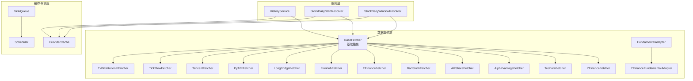
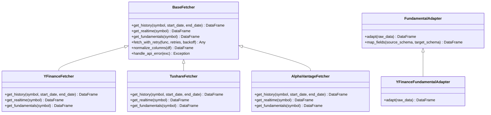
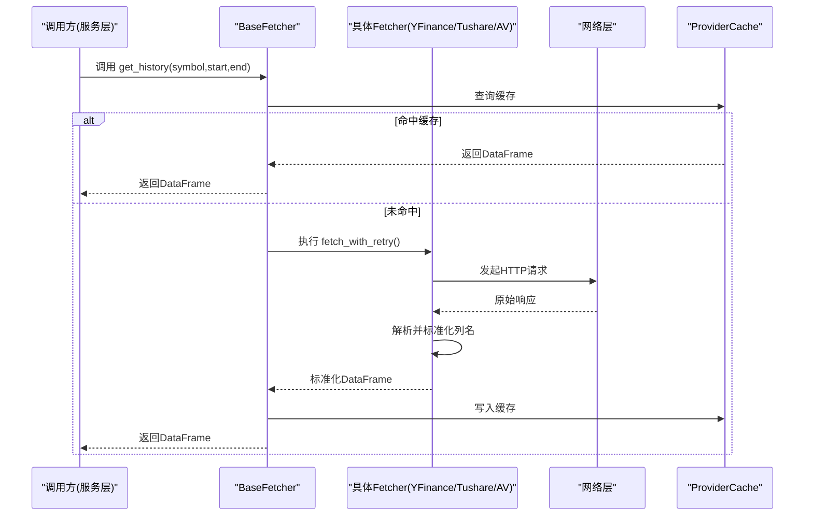
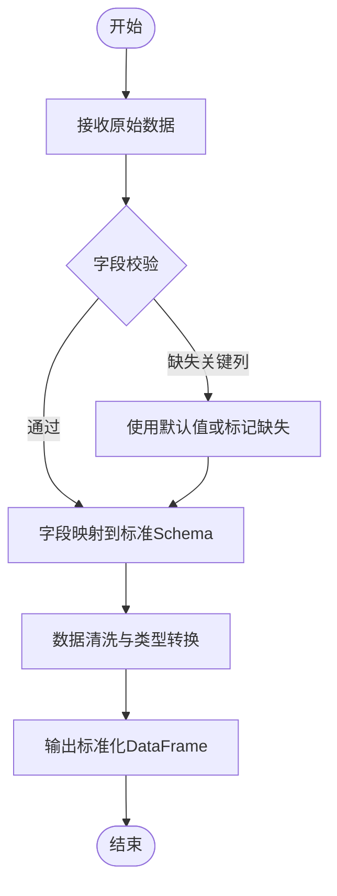
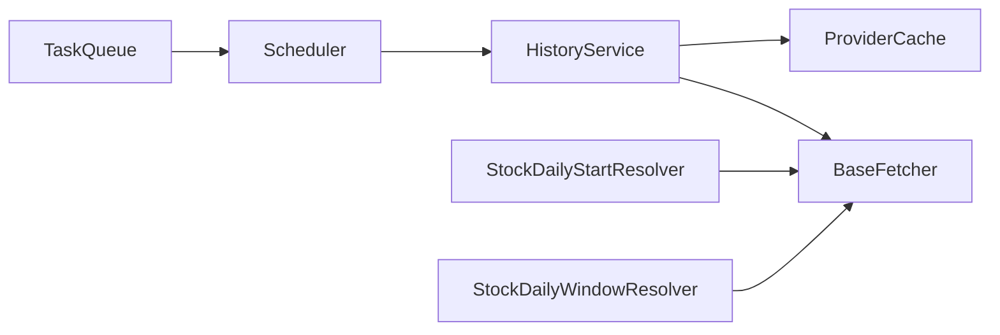

# 数据源集成

<cite>
**本文引用的文件**   
- [base.py](file://data_provider/base.py)
- [yfinance_fetcher.py](file://data_provider/yfinance_fetcher.py)
- [tushare_fetcher.py](file://data_provider/tushare_fetcher.py)
- [alphavantage_fetcher.py](file://data_provider/alphavantage_fetcher.py)
- [akshare_fetcher.py](file://data_provider/akshare_fetcher.py)
- [baostock_fetcher.py](file://data_provider/baostock_fetcher.py)
- [efinance_fetcher.py](file://data_provider/efinance_fetcher.py)
- [finnhub_fetcher.py](file://data_provider/finnhub_fetcher.py)
- [longbridge_fetcher.py](file://data_provider/longbridge_fetcher.py)
- [pytdx_fetcher.py](file://data_provider/pytdx_fetcher.py)
- [tencent_fetcher.py](file://data_provider/tencent_fetcher.py)
- [tickflow_fetcher.py](file://data_provider/tickflow_fetcher.py)
- [tw_institutional_fetcher.py](file://data_provider/tw_institutional_fetcher.py)
- [fundamental_adapter.py](file://data_provider/fundamental_adapter.py)
- [yfinance_fundamental_adapter.py](file://data_provider/yfinance_fundamental_adapter.py)
- [realtime_types.py](file://data_provider/realtime_types.py)
- [us_index_mapping.py](file://data_provider/us_index_mapping.py)
- [history_service.py](file://src/services/history_service.py)
- [stock_daily_start_resolver.py](file://src/services/stock_daily_start_resolver.py)
- [stock_daily_window_resolver.py](file://src/services/stock_daily_window_resolver.py)
- [provider_cache.py](file://src/llm/provider_cache.py)
- [task_queue.py](file://src/services/task_queue.py)
- [scheduler.py](file://src/scheduler.py)
</cite>

## 目录
1. [简介](#简介)
2. [项目结构](#项目结构)
3. [核心组件](#核心组件)
4. [架构总览](#架构总览)
5. [详细组件分析](#详细组件分析)
6. [依赖关系分析](#依赖关系分析)
7. [性能考虑](#性能考虑)
8. [故障排查指南](#故障排查指南)
9. [结论](#结论)
10. [附录](#附录)

## 简介
本文件面向Daily Stock Analysis的数据源集成模块，系统性阐述数据提供者架构的设计模式、基础抽象类与具体实现类的继承关系，主流数据提供商（YFinance、Tushare、Alpha Vantage等）的接入方式，统一数据格式适配机制，以及自定义数据源开发指南。同时覆盖缓存策略与更新机制（增量更新、全量刷新、一致性保证），并提供实际获取示例与错误处理最佳实践。

## 项目结构
数据源相关代码集中在 data_provider 目录，包含：
- 基础抽象与类型定义：base.py、realtime_types.py、us_index_mapping.py
- 各数据源Fetcher实现：yfinance_fetcher.py、tushare_fetcher.py、alphavantage_fetcher.py、akshare_fetcher.py、baostock_fetcher.py、efinance_fetcher.py、finnhub_fetcher.py、longbridge_fetcher.py、pytdx_fetcher.py、tencent_fetcher.py、tickflow_fetcher.py、tw_institutional_fetcher.py
- 基本面数据适配器：fundamental_adapter.py、yfinance_fundamental_adapter.py

上层服务通过 services 层调用数据源，如 history_service.py、stock_daily_start_resolver.py、stock_daily_window_resolver.py；缓存与调度由 provider_cache.py、task_queue.py、scheduler.py 支撑。

图表来源 
- [base.py](file://data_provider/base.py)
- [yfinance_fetcher.py](file://data_provider/yfinance_fetcher.py)
- [tushare_fetcher.py](file://data_provider/tushare_fetcher.py)
- [alphavantage_fetcher.py](file://data_provider/alphavantage_fetcher.py)
- [akshare_fetcher.py](file://data_provider/akshare_fetcher.py)
- [baostock_fetcher.py](file://data_provider/baostock_fetcher.py)
- [efinance_fetcher.py](file://data_provider/efinance_fetcher.py)
- [finnhub_fetcher.py](file://data_provider/finnhub_fetcher.py)
- [longbridge_fetcher.py](file://data_provider/longbridge_fetcher.py)
- [pytdx_fetcher.py](file://data_provider/pytdx_fetcher.py)
- [tencent_fetcher.py](file://data_provider/tencent_fetcher.py)
- [tickflow_fetcher.py](file://data_provider/tickflow_fetcher.py)
- [tw_institutional_fetcher.py](file://data_provider/tw_institutional_fetcher.py)
- [fundamental_adapter.py](file://data_provider/fundamental_adapter.py)
- [yfinance_fundamental_adapter.py](file://data_provider/yfinance_fundamental_adapter.py)
- [history_service.py](file://src/services/history_service.py)
- [stock_daily_start_resolver.py](file://src/services/stock_daily_start_resolver.py)
- [stock_daily_window_resolver.py](file://src/services/stock_daily_window_resolver.py)
- [provider_cache.py](file://src/llm/provider_cache.py)
- [task_queue.py](file://src/services/task_queue.py)
- [scheduler.py](file://src/scheduler.py)

章节来源
- [base.py](file://data_provider/base.py)
- [history_service.py](file://src/services/history_service.py)
- [stock_daily_start_resolver.py](file://src/services/stock_daily_start_resolver.py)
- [stock_daily_window_resolver.py](file://src/services/stock_daily_window_resolver.py)

## 核心组件
- BaseFetcher：定义数据获取的统一接口与通用能力（重试、超时、限流、日志、异常封装）。所有具体Fetcher均继承该类，确保一致的调用契约。
- 具体Fetcher：针对各数据源（YFinance、Tushare、Alpha Vantage、AKShare、BaoStock、EFinance、Finnhub、LongBridge、PyTdx、Tencent、TickFlow、TW Institutional）实现差异化网络请求与解析逻辑。
- FundamentalAdapter/YFinanceFundamentalAdapter：将不同来源的基本面数据统一为标准字段结构，屏蔽上游差异。
- RealtimeTypes：统一实时行情数据结构定义，供上层服务消费。
- USIndexMapping：美股指数映射表，用于标准化指数标识。

章节来源
- [base.py](file://data_provider/base.py)
- [realtime_types.py](file://data_provider/realtime_types.py)
- [us_index_mapping.py](file://data_provider/us_index_mapping.py)
- [fundamental_adapter.py](file://data_provider/fundamental_adapter.py)
- [yfinance_fundamental_adapter.py](file://data_provider/yfinance_fundamental_adapter.py)

## 架构总览
数据源集成采用“抽象基类 + 多实现”的策略模式，配合适配器模式对异构数据进行标准化。服务层通过统一的Fetcher接口获取历史与实时数据，并通过缓存与任务队列进行并发控制与一致性保障。

图表来源 
- [base.py](file://data_provider/base.py)
- [yfinance_fetcher.py](file://data_provider/yfinance_fetcher.py)
- [tushare_fetcher.py](file://data_provider/tushare_fetcher.py)
- [alphavantage_fetcher.py](file://data_provider/alphavantage_fetcher.py)
- [fundamental_adapter.py](file://data_provider/fundamental_adapter.py)
- [yfinance_fundamental_adapter.py](file://data_provider/yfinance_fundamental_adapter.py)

## 详细组件分析

### 基础抽象类 BaseFetcher
- 职责：定义统一的数据获取接口（历史、实时、基本面）、通用网络能力（重试、退避、超时）、列名标准化、异常封装。
- 设计要点：
  - 接口隔离：历史、实时、基本面三类方法明确分离，便于按需实现。
  - 健壮性：内置重试与退避策略，避免瞬时失败影响整体稳定性。
  - 可观测性：统一日志记录与错误分类，便于定位问题。
  - 可移植性：列名标准化后输出DataFrame，屏蔽上游差异。

章节来源
- [base.py](file://data_provider/base.py)

### 具体Fetcher实现（以YFinance、Tushare、Alpha Vantage为例）
- YFinanceFetcher：基于Yahoo Finance API，支持美股、港股、日股、韩股等多市场，具备指数映射与符号规范化能力。
- TushareFetcher：基于Tushare Pro，侧重A股与部分海外市场，需配置token与权限。
- AlphaVantageFetcher：基于Alpha Vantage REST API，适合美股与外汇数据，注意API速率限制。

图表来源 
- [base.py](file://data_provider/base.py)
- [yfinance_fetcher.py](file://data_provider/yfinance_fetcher.py)
- [tushare_fetcher.py](file://data_provider/tushare_fetcher.py)
- [alphavantage_fetcher.py](file://data_provider/alphavantage_fetcher.py)
- [provider_cache.py](file://src/llm/provider_cache.py)

章节来源
- [yfinance_fetcher.py](file://data_provider/yfinance_fetcher.py)
- [tushare_fetcher.py](file://data_provider/tushare_fetcher.py)
- [alphavantage_fetcher.py](file://data_provider/alphavantage_fetcher.py)

### 基本面数据适配器
- FundamentalAdapter：定义统一的基本面数据适配接口，负责字段映射与清洗。
- YFinanceFundamentalAdapter：针对YFinance基本面的特殊字段进行映射与转换，确保与其他来源一致的结构。

图表来源 
- [fundamental_adapter.py](file://data_provider/fundamental_adapter.py)
- [yfinance_fundamental_adapter.py](file://data_provider/yfinance_fundamental_adapter.py)

章节来源
- [fundamental_adapter.py](file://data_provider/fundamental_adapter.py)
- [yfinance_fundamental_adapter.py](file://data_provider/yfinance_fundamental_adapter.py)

### 实时数据类型与指数映射
- realtime_types.py：定义实时行情的统一数据结构，包括时间戳、价格、成交量、买卖盘口等字段。
- us_index_mapping.py：维护美股指数代码映射，确保跨市场指数识别的一致性。

章节来源
- [realtime_types.py](file://data_provider/realtime_types.py)
- [us_index_mapping.py](file://data_provider/us_index_mapping.py)

### 其他Fetcher实现概览
- AKShareFetcher/BaoStockFetcher/EFinanceFetcher：国内数据源，适用于A股历史与实时数据。
- FinnhubFetcher/LongBridgeFetcher：国际与港美股数据源，支持更丰富的金融数据。
- PyTdxFetcher/TencentFetcher：通达信与腾讯财经接口，适合特定场景。
- TickFlowFetcher/TWInstitutionalFetcher：机构与另类数据源，扩展分析维度。

章节来源
- [akshare_fetcher.py](file://data_provider/akshare_fetcher.py)
- [baostock_fetcher.py](file://data_provider/baostock_fetcher.py)
- [efinance_fetcher.py](file://data_provider/efinance_fetcher.py)
- [finnhub_fetcher.py](file://data_provider/finnhub_fetcher.py)
- [longbridge_fetcher.py](file://data_provider/longbridge_fetcher.py)
- [pytdx_fetcher.py](file://data_provider/pytdx_fetcher.py)
- [tencent_fetcher.py](file://data_provider/tencent_fetcher.py)
- [tickflow_fetcher.py](file://data_provider/tickflow_fetcher.py)
- [tw_institutional_fetcher.py](file://data_provider/tw_institutional_fetcher.py)

## 依赖关系分析
- 服务层依赖：
  - history_service.py：聚合历史数据，协调多个Fetcher与缓存。
  - stock_daily_start_resolver.py / stock_daily_window_resolver.py：计算交易起始日与窗口，辅助数据拉取范围确定。
- 缓存与调度：
  - provider_cache.py：按symbol+时间窗口的键值缓存，减少重复请求。
  - task_queue.py：任务队列管理并发与优先级。
  - scheduler.py：定时任务触发数据更新。

图表来源 
- [history_service.py](file://src/services/history_service.py)
- [stock_daily_start_resolver.py](file://src/services/stock_daily_start_resolver.py)
- [stock_daily_window_resolver.py](file://src/services/stock_daily_window_resolver.py)
- [provider_cache.py](file://src/llm/provider_cache.py)
- [task_queue.py](file://src/services/task_queue.py)
- [scheduler.py](file://src/scheduler.py)

章节来源
- [history_service.py](file://src/services/history_service.py)
- [stock_daily_start_resolver.py](file://src/services/stock_daily_start_resolver.py)
- [stock_daily_window_resolver.py](file://src/services/stock_daily_window_resolver.py)
- [provider_cache.py](file://src/llm/provider_cache.py)
- [task_queue.py](file://src/services/task_queue.py)
- [scheduler.py](file://src/scheduler.py)

## 性能考虑
- 缓存策略：
  - 键设计：symbol + 时间窗口 + 数据源类型，避免冲突。
  - TTL与失效：根据市场状态设置合理过期时间，支持手动失效。
- 并发与限流：
  - 任务队列控制并发度，避免过载。
  - 各数据源API限速策略（如Alpha Vantage、Tushare）需在Fetcher中体现。
- 增量更新：
  - 仅拉取新增交易日数据，减少带宽与解析开销。
  - 结合stock_daily_start_resolver与stock_daily_window_resolver确定最小必要窗口。
- 数据一致性：
  - 写入缓存前进行完整性校验（行数、时间连续性、关键字段非空）。
  - 失败回滚与重试机制保证最终一致性。

[本节为通用指导，不直接分析具体文件]

## 故障排查指南
- 常见错误分类：
  - 网络错误：超时、连接失败、DNS解析失败。
  - 认证错误：Token无效、权限不足。
  - 数据错误：字段缺失、类型不匹配、时间序列不完整。
  - 限流错误：API速率限制、配额耗尽。
- 排查步骤：
  - 检查Fetcher日志与异常堆栈，定位具体数据源。
  - 验证配置项（API Key、Token、代理、超时参数）。
  - 使用最小化请求复现问题，逐步缩小范围。
  - 查看缓存是否命中旧数据导致不一致。
- 恢复策略：
  - 自动重试与退避，必要时切换备用数据源。
  - 清理异常缓存条目，强制重新拉取。
  - 降级策略：返回部分数据或占位符，保证系统可用性。

章节来源
- [base.py](file://data_provider/base.py)
- [provider_cache.py](file://src/llm/provider_cache.py)

## 结论
Daily Stock Analysis的数据源集成通过抽象基类与适配器模式实现了高内聚、低耦合的多数据源接入。统一的数据格式与标准化的错误处理提升了系统的健壮性与可维护性。结合缓存、任务队列与调度器，系统在性能与一致性之间取得平衡。开发者可基于BaseFetcher快速扩展新的数据源，满足多样化分析需求。

[本节为总结性内容，不直接分析具体文件]

## 附录

### 自定义数据源开发指南
- 步骤：
  1. 继承BaseFetcher，实现get_history、get_realtime、get_fundamentals等方法。
  2. 在方法内部处理网络请求、解析响应、标准化列名。
  3. 复用BaseFetcher的retry与error handling机制。
  4. 注册新Fetcher至工厂或路由（如有）。
- 异常处理：
  - 捕获网络异常并转换为统一错误类型。
  - 区分临时错误（可重试）与永久错误（不可重试）。
- 性能优化：
  - 使用连接池与异步请求提升吞吐。
  - 合理设置超时与重试次数。
  - 利用缓存减少重复请求。

章节来源
- [base.py](file://data_provider/base.py)

### 数据格式统一适配机制
- 标准化字段：
  - 时间戳、开盘价、最高价、最低价、收盘价、成交量、成交额。
  - 基本面字段：市盈率、市净率、每股收益、营收、净利润等。
- 映射规则：
  - 建立source_schema到target_schema的映射表。
  - 处理单位换算（如美元转人民币）、日期格式统一。
- 校验与清洗：
  - 必填字段检查、数值范围校验、异常值填充或删除。

章节来源
- [fundamental_adapter.py](file://data_provider/fundamental_adapter.py)
- [yfinance_fundamental_adapter.py](file://data_provider/yfinance_fundamental_adapter.py)
- [realtime_types.py](file://data_provider/realtime_types.py)

### 缓存策略与更新机制
- 缓存键：symbol + start_date + end_date + source_type
- 更新策略：
  - 增量更新：仅拉取新增交易日数据。
  - 全量刷新：定期或手动触发，重建缓存。
- 一致性保证：
  - 写入前校验数据完整性。
  - 失败时回滚或标记脏数据。

章节来源
- [provider_cache.py](file://src/llm/provider_cache.py)
- [task_queue.py](file://src/services/task_queue.py)
- [scheduler.py](file://src/scheduler.py)

### 实际数据获取示例与错误处理最佳实践
- 示例流程：
  - 初始化Fetcher实例，传入配置。
  - 调用get_history获取指定时间窗口数据。
  - 处理返回的DataFrame，进行后续分析。
- 错误处理最佳实践：
  - 外层try-catch包裹网络请求。
  - 记录详细上下文（symbol、时间、数据源）。
  - 提供用户友好的错误消息与重试建议。

章节来源
- [yfinance_fetcher.py](file://data_provider/yfinance_fetcher.py)
- [tushare_fetcher.py](file://data_provider/tushare_fetcher.py)
- [alphavantage_fetcher.py](file://data_provider/alphavantage_fetcher.py)
- [base.py](file://data_provider/base.py)