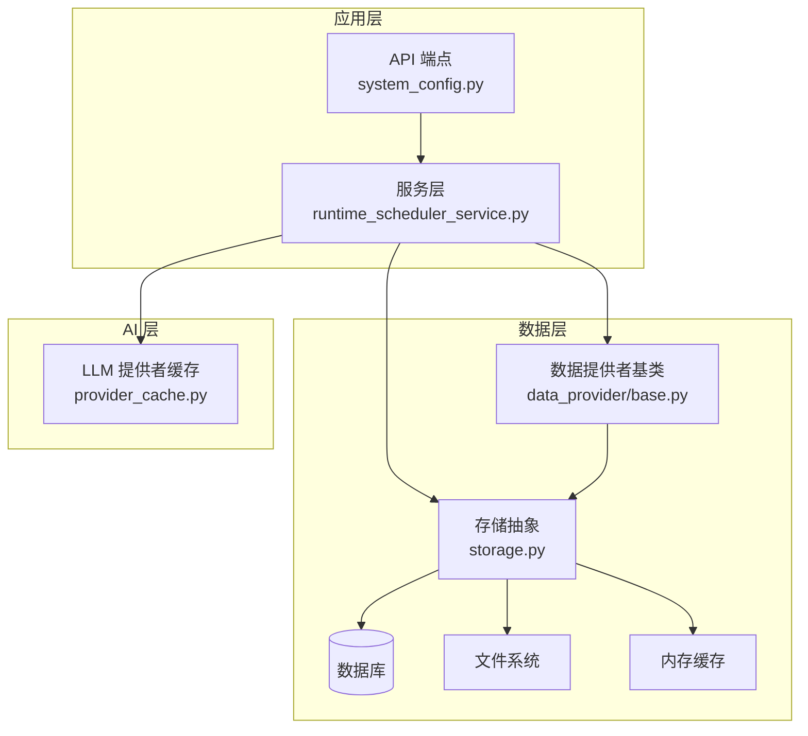
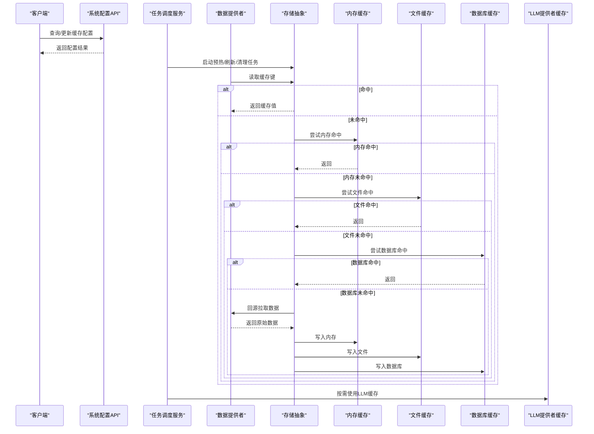
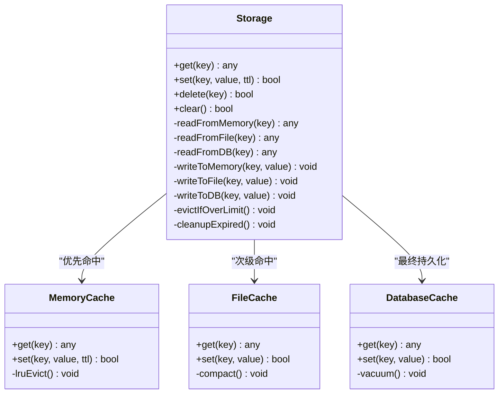
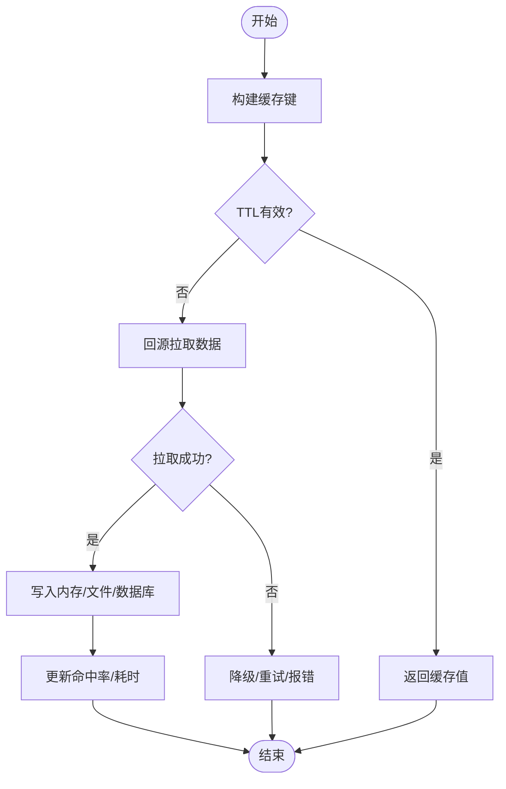
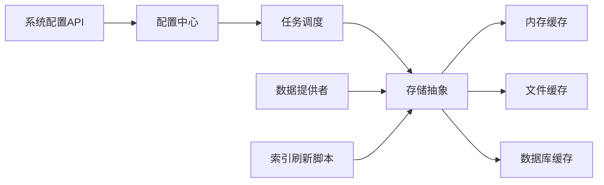

# 数据缓存策略

<cite>
**本文引用的文件**   
- [src/storage.py](file://src/storage.py)
- [src/config.py](file://src/config.py)
- [src/services/runtime_scheduler_service.py](file://src/services/runtime_scheduler_service.py)
- [src/data_provider/base.py](file://src/data_provider/base.py)
- [src/llm/provider_cache.py](file://src/llm/provider_cache.py)
- [api/v1/endpoints/system_config.py](file://api/v1/endpoints/system_config.py)
- [scripts/refresh_stock_index.py](file://scripts/refresh_stock_index.py)
- [tests/test_storage.py](file://tests/test_storage.py)
</cite>

## 目录
1. [简介](#简介)
2. [项目结构](#项目结构)
3. [核心组件](#核心组件)
4. [架构总览](#架构总览)
5. [详细组件分析](#详细组件分析)
6. [依赖关系分析](#依赖关系分析)
7. [性能考量](#性能考量)
8. [故障排查指南](#故障排查指南)
9. [结论](#结论)
10. [附录](#附录)

## 简介
本文件面向“数据缓存策略”的完整设计与实现，围绕多级缓存（内存、文件、数据库）的层次结构与适用场景展开，系统说明配置项（过期时间、最大存储大小、清理策略）、增量更新与全量刷新机制（变更检测、并发控制、一致性保证）、预热与预取（定时调度、智能预测、批量加载）、监控与诊断（命中率统计、性能分析、故障排查），以及分布式环境下的缓存同步与一致性方案。文档同时提供可操作的配置示例与调优建议，帮助读者快速落地并优化缓存体系。

## 项目结构
本项目采用分层组织：API 层暴露接口，服务层编排业务逻辑，数据提供者负责外部数据获取，存储层统一抽象持久化能力，LLM 模块包含独立的提供者缓存，脚本层提供运维工具（如索引刷新）。缓存相关的关键位置包括：
- 存储抽象与实现：src/storage.py
- 全局配置与运行时参数：src/config.py
- 任务调度与后台作业：src/services/runtime_scheduler_service.py
- 数据提供者基类（含缓存落盘/回源策略）：src/data_provider/base.py
- LLM 提供者缓存：src/llm/provider_cache.py
- 系统配置 API：api/v1/endpoints/system_config.py
- 索引刷新脚本：scripts/refresh_stock_index.py
- 存储测试用例：tests/test_storage.py

图表来源
- [api/v1/endpoints/system_config.py](file://api/v1/endpoints/system_config.py)
- [src/services/runtime_scheduler_service.py](file://src/services/runtime_scheduler_service.py)
- [src/data_provider/base.py](file://src/data_provider/base.py)
- [src/storage.py](file://src/storage.py)
- [src/llm/provider_cache.py](file://src/llm/provider_cache.py)

章节来源
- [src/storage.py](file://src/storage.py)
- [src/config.py](file://src/config.py)
- [src/services/runtime_scheduler_service.py](file://src/services/runtime_scheduler_service.py)
- [src/data_provider/base.py](file://src/data_provider/base.py)
- [src/llm/provider_cache.py](file://src/llm/provider_cache.py)
- [api/v1/endpoints/system_config.py](file://api/v1/endpoints/system_config.py)
- [scripts/refresh_stock_index.py](file://scripts/refresh_stock_index.py)
- [tests/test_storage.py](file://tests/test_storage.py)

## 核心组件
- 存储抽象层（Storage）
  - 职责：统一封装内存、文件、数据库三类存储的读写、过期、清理与降级策略；对外暴露一致的缓存访问接口。
  - 关键能力：多级回退（内存→文件→DB→远端）、键空间隔离、TTL 管理、容量上限与淘汰策略、并发安全。
- 配置中心（Config）
  - 职责：集中管理缓存相关配置（过期时间、最大大小、清理策略、开关等），支持热更新与校验。
- 数据提供者（DataProvider Base）
  - 职责：定义数据拉取的通用流程，内置缓存命中/未命中的分支处理，支持增量与全量模式。
- LLM 提供者缓存（Provider Cache）
  - 职责：针对 LLM 调用结果进行短期缓存，降低重复请求成本，具备独立 TTL 与容量限制。
- 任务调度（Runtime Scheduler Service）
  - 职责：驱动缓存预热、定时刷新、清理任务与监控指标上报。
- 系统配置 API（System Config Endpoint）
  - 职责：提供运行时修改缓存参数的能力，便于动态调优。
- 索引刷新脚本（Refresh Stock Index）
  - 职责：触发全量或增量索引重建，配合存储层完成幂等写入与一致性保障。

章节来源
- [src/storage.py](file://src/storage.py)
- [src/config.py](file://src/config.py)
- [src/data_provider/base.py](file://src/data_provider/base.py)
- [src/llm/provider_cache.py](file://src/llm/provider_cache.py)
- [src/services/runtime_scheduler_service.py](file://src/services/runtime_scheduler_service.py)
- [api/v1/endpoints/system_config.py](file://api/v1/endpoints/system_config.py)
- [scripts/refresh_stock_index.py](file://scripts/refresh_stock_index.py)

## 架构总览
下图展示从 API 到存储的多级缓存路径，以及 LLM 缓存与任务调度的交互。

图表来源
- [api/v1/endpoints/system_config.py](file://api/v1/endpoints/system_config.py)
- [src/services/runtime_scheduler_service.py](file://src/services/runtime_scheduler_service.py)
- [src/data_provider/base.py](file://src/data_provider/base.py)
- [src/storage.py](file://src/storage.py)
- [src/llm/provider_cache.py](file://src/llm/provider_cache.py)

## 详细组件分析

### 存储抽象层（Storage）
- 设计要点
  - 多级回退：按优先级依次访问内存、文件、数据库，任一层级命中即返回。
  - 过期策略：基于 TTL 的时间戳比较，支持惰性删除与主动清理。
  - 容量控制：内存与文件层设置最大大小，超限触发 LRU/LFU 淘汰。
  - 并发安全：读写锁或原子操作避免竞态条件。
  - 降级与容错：底层不可用时自动降级至下一层，记录错误日志。
- 数据结构与复杂度
  - 内存层：哈希表 O(1) 读写；LRU 链表 O(1) 更新。
  - 文件层：键→路径映射，I/O 开销与磁盘吞吐相关。
  - 数据库层：索引查找 O(log n)，适合大体积与持久化需求。
- 优化机会
  - 热点键预取与分区分桶减少锁竞争。
  - 批量写入与异步落盘降低 I/O 抖动。
  - 压缩与序列化选择（JSON vs MessagePack）权衡 CPU 与空间。

图表来源
- [src/storage.py](file://src/storage.py)

章节来源
- [src/storage.py](file://src/storage.py)
- [tests/test_storage.py](file://tests/test_storage.py)

### 配置中心（Config）
- 职责
  - 集中管理缓存相关参数：过期时间（秒）、最大存储大小（MB/GB）、清理周期（分钟）、是否启用各层缓存、并发线程数等。
  - 提供默认值与校验，支持运行时热更新。
- 典型配置项
  - 过期时间：全局 TTL、键级 TTL、热点键延长策略。
  - 容量上限：内存上限、文件上限、数据库上限。
  - 清理策略：惰性删除、定时扫描、阈值触发。
  - 开关与降级：禁用某层、失败降级、只读模式。
- 热更新流程
  - 通过系统配置 API 提交新配置 → 校验通过后生效 → 触发必要的重装载（如清理任务间隔调整）。

章节来源
- [src/config.py](file://src/config.py)
- [api/v1/endpoints/system_config.py](file://api/v1/endpoints/system_config.py)

### 数据提供者基类（DataProvider Base）
- 职责
  - 定义统一的拉取流程：先查缓存，未命中则回源，写回多级缓存。
  - 支持增量与全量模式：增量基于时间窗口或版本号，全量强制刷新。
  - 异常处理：网络超时、限流、解析失败时的重试与降级。
- 关键流程
  - 构建缓存键（股票/指数/时间范围/字段）。
  - 检查 TTL 有效性。
  - 命中则返回；未命中则拉取并写入各层。
  - 记录命中率与耗时指标。

图表来源
- [src/data_provider/base.py](file://src/data_provider/base.py)

章节来源
- [src/data_provider/base.py](file://src/data_provider/base.py)

### LLM 提供者缓存（Provider Cache）
- 职责
  - 缓存 LLM 调用结果，减少重复请求与费用。
  - 独立 TTL、容量限制与键空间隔离。
- 特点
  - 短生命周期：通常分钟级，避免模型版本或提示词变更导致的不一致。
  - 高并发友好：读多写少，适合热点问答与模板化输出。

章节来源
- [src/llm/provider_cache.py](file://src/llm/provider_cache.py)

### 任务调度（Runtime Scheduler Service）
- 职责
  - 定时执行缓存预热、增量刷新、全量刷新、清理与指标上报。
  - 支持任务去重、幂等执行与失败重试。
- 典型任务
  - 预热：在交易开盘前加载热门标的历史与实时指标。
  - 增量：按分钟/小时粒度更新最新数据。
  - 全量：每日收盘后重建索引与聚合指标。
  - 清理：定期扫描过期键与碎片整理。

章节来源
- [src/services/runtime_scheduler_service.py](file://src/services/runtime_scheduler_service.py)

### 系统配置 API（System Config Endpoint）
- 职责
  - 提供 REST 接口用于查询与更新缓存配置。
  - 权限校验、参数校验、审计日志。
- 典型操作
  - GET /system-config/cache：获取当前缓存配置。
  - PUT /system-config/cache：更新缓存配置并立即生效。

章节来源
- [api/v1/endpoints/system_config.py](file://api/v1/endpoints/system_config.py)

### 索引刷新脚本（Refresh Stock Index）
- 职责
  - 触发全量或增量索引重建，确保索引与数据源一致。
  - 支持幂等写入与事务性更新，失败回滚。
- 使用方式
  - 命令行参数指定市场、日期范围、刷新模式（全量/增量）。
  - 与存储层协作，保证写入顺序与一致性。

章节来源
- [scripts/refresh_stock_index.py](file://scripts/refresh_stock_index.py)

## 依赖关系分析
- 组件耦合
  - 存储抽象对内存、文件、数据库解耦，便于替换与扩展。
  - 数据提供者依赖存储抽象，不关心具体实现细节。
  - 任务调度依赖配置中心，动态调整策略。
- 外部依赖
  - 数据库连接池、文件系统权限、网络 I/O 稳定性。
- 潜在循环依赖
  - 通过接口与事件解耦，避免直接循环引用。

图表来源
- [src/config.py](file://src/config.py)
- [src/services/runtime_scheduler_service.py](file://src/services/runtime_scheduler_service.py)
- [src/storage.py](file://src/storage.py)
- [src/data_provider/base.py](file://src/data_provider/base.py)
- [api/v1/endpoints/system_config.py](file://api/v1/endpoints/system_config.py)
- [scripts/refresh_stock_index.py](file://scripts/refresh_stock_index.py)

章节来源
- [src/config.py](file://src/config.py)
- [src/services/runtime_scheduler_service.py](file://src/services/runtime_scheduler_service.py)
- [src/storage.py](file://src/storage.py)
- [src/data_provider/base.py](file://src/data_provider/base.py)
- [api/v1/endpoints/system_config.py](file://api/v1/endpoints/system_config.py)
- [scripts/refresh_stock_index.py](file://scripts/refresh_stock_index.py)

## 性能考量
- 命中率优化
  - 热点键预热与分区，减少冷启动延迟。
  - 合理 TTL：高频数据短 TTL，低频数据长 TTL。
- 容量与淘汰
  - 内存层 LRU/LFU 结合负载自适应。
  - 文件层压缩与分段存储，降低 I/O。
  - 数据库层索引优化与分区表。
- 并发与锁
  - 读写分离与细粒度锁，避免热点键阻塞。
  - 批量写入与异步落盘，提升吞吐。
- 监控与诊断
  - 命中率、平均延迟、P95/P99 延迟、错误率。
  - 缓存占用、淘汰次数、清理耗时。
  - 告警阈值与自动恢复策略。

## 故障排查指南
- 常见问题
  - 命中率低：检查 TTL 设置、键设计、预热策略。
  - 内存溢出：调整容量上限、淘汰策略、压缩比例。
  - 文件损坏：校验与修复工具、备份与恢复流程。
  - 数据库锁竞争：优化索引、拆分表、减少长事务。
- 诊断步骤
  - 查看缓存指标与日志，定位瓶颈。
  - 复现问题并抓取快照（键分布、命中率趋势）。
  - 逐步关闭某层缓存验证影响面。
- 恢复策略
  - 自动重试与降级，快速恢复服务可用性。
  - 手动触发清理与重建，释放资源。

章节来源
- [tests/test_storage.py](file://tests/test_storage.py)
- [src/storage.py](file://src/storage.py)

## 结论
本缓存策略通过多级缓存架构实现了高性能、高可用与可扩展的数据访问能力。合理的配置与监控能够显著提升命中率与系统稳定性。建议在分布式环境中引入一致性协议与跨节点同步机制，进一步保障数据一致性与容灾能力。

## 附录

### 配置示例（建议）
- 内存缓存
  - 最大大小：256MB
  - TTL：默认 5 分钟，热点键 10 分钟
  - 淘汰策略：LRU
- 文件缓存
  - 最大大小：10GB
  - TTL：默认 1 小时
  - 压缩：开启（GZIP）
- 数据库缓存
  - 最大大小：无硬性限制（按分区与索引优化）
  - TTL：默认 24 小时
  - 清理：每日凌晨执行
- 任务调度
  - 预热：开盘前 10 分钟
  - 增量：每 5 分钟
  - 全量：每日收盘后
  - 清理：每小时扫描过期键

### 增量与全量刷新机制
- 增量更新
  - 基于时间窗口或版本号，仅拉取变更部分。
  - 并发控制：分片并行，合并时按时间戳排序。
  - 一致性：幂等写入，冲突时以最新版本为准。
- 全量刷新
  - 强制重建索引与聚合指标，确保与数据源一致。
  - 事务性更新，失败回滚，避免脏数据。

### 分布式缓存同步与一致性
- 同步策略
  - 发布订阅：变更事件广播至所有节点。
  - 版本向量：冲突检测与合并。
  - 强一致：分布式锁与两阶段提交（适用于关键数据）。
- 一致性保证
  - 最终一致：允许短暂不一致，提高吞吐。
  - 读路径：优先本地缓存，必要时回源校验。
  - 写路径：主节点写入，异步复制至从节点。